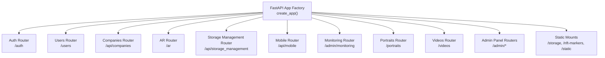
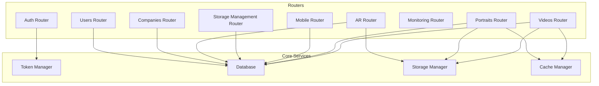
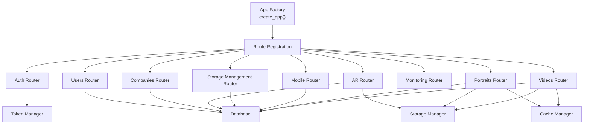
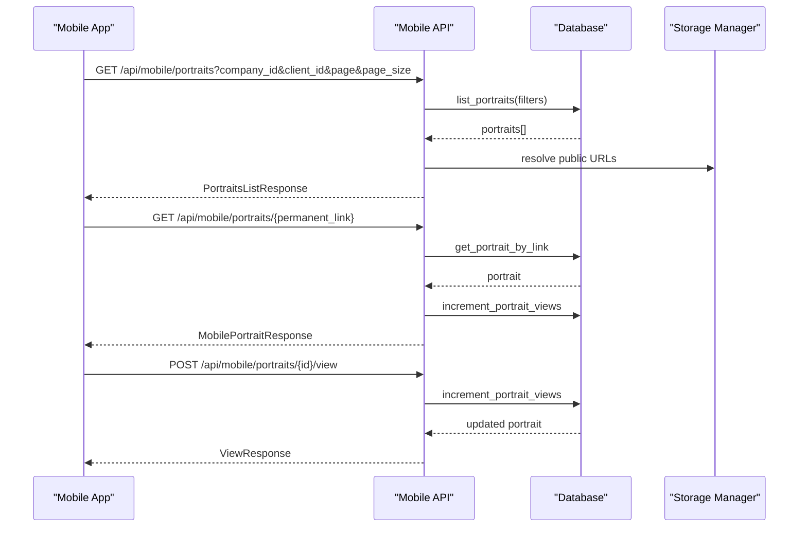

# API Endpoints Reference

<cite>
**Referenced Files in This Document**
- [auth.py](file://vertex-ar/app/api/auth.py)
- [users.py](file://vertex-ar/app/api/users.py)
- [companies.py](file://vertex-ar/app/api/companies.py)
- [ar.py](file://vertex-ar/app/api/ar.py)
- [storage_management.py](file://vertex-ar/app/api/storage_management.py)
- [mobile.py](file://vertex-ar/app/api/mobile.py)
- [monitoring.py](file://vertex-ar/app/api/monitoring.py)
- [models.py](file://vertex-ar/app/models.py)
- [main.py](file://vertex-ar/app/main.py)
- [rate_limiter.py](file://vertex-ar/app/rate_limiter.py)
- [middleware.py](file://vertex-ar/app/middleware.py)
- [config.py](file://vertex-ar/app/config.py)
- [portraits.py](file://vertex-ar/app/api/portraits.py)
- [videos.py](file://vertex-ar/app/api/videos.py)
</cite>

## Table of Contents
1. [Introduction](#introduction)
2. [Project Structure](#project-structure)
3. [Core Components](#core-components)
4. [Architecture Overview](#architecture-overview)
5. [Detailed Component Analysis](#detailed-component-analysis)
6. [Dependency Analysis](#dependency-analysis)
7. [Performance Considerations](#performance-considerations)
8. [Troubleshooting Guide](#troubleshooting-guide)
9. [Conclusion](#conclusion)
10. [Appendices](#appendices)

## Introduction
This document provides comprehensive API documentation for the Vertex AR application’s public RESTful endpoints grouped by functional areas. It covers Authentication, User Management, Company Management, AR Content, Storage Management, Monitoring, and Mobile APIs. For each group, you will find HTTP methods, URL patterns, request/response schemas, authentication mechanisms (JWT), error codes, parameters, query options, payload structures, and practical curl examples. Additional sections address rate limiting, CORS policies, versioning strategy, mobile-specific data flows, security considerations, and performance tips for bulk operations and pagination.

## Project Structure
The API is organized into modular routers under the application factory. Each router encapsulates a domain (e.g., auth, users, companies, ar, storage_management, mobile, monitoring). The application factory configures middleware, CORS, Prometheus metrics, and mounts static directories for storage and NFT markers.

**Diagram sources**
- [main.py](file://vertex-ar/app/main.py#L158-L183)

**Section sources**
- [main.py](file://vertex-ar/app/main.py#L158-L183)

## Core Components
- Authentication and Authorization: JWT-based bearer tokens with optional cookie fallback; admin-only endpoints enforce admin role.
- Rate Limiting: Per-endpoint and global rate limiting via a custom dependency.
- CORS: Configurable origins with credentials and selected headers.
- Versioning: Application version exposed in the root endpoint and FastAPI metadata.
- Middleware: Structured request/response logging, error logging, and validation error logging.

**Section sources**
- [auth.py](file://vertex-ar/app/api/auth.py#L109-L192)
- [rate_limiter.py](file://vertex-ar/app/rate_limiter.py#L87-L124)
- [main.py](file://vertex-ar/app/main.py#L66-L74)
- [config.py](file://vertex-ar/app/config.py#L28-L33)
- [middleware.py](file://vertex-ar/app/middleware.py#L18-L156)

## Architecture Overview
The API follows a layered architecture:
- Routers define endpoints and dependencies.
- Pydantic models define request/response schemas.
- Database and storage managers handle persistence and file operations.
- Middleware handles cross-cutting concerns (logging, rate limiting).
- Prometheus instrumentation exposes metrics.

**Diagram sources**
- [auth.py](file://vertex-ar/app/api/auth.py#L109-L192)
- [users.py](file://vertex-ar/app/api/users.py#L70-L167)
- [companies.py](file://vertex-ar/app/api/companies.py#L86-L175)
- [ar.py](file://vertex-ar/app/api/ar.py#L42-L158)
- [storage_management.py](file://vertex-ar/app/api/storage_management.py#L294-L393)
- [mobile.py](file://vertex-ar/app/api/mobile.py#L215-L303)
- [portraits.py](file://vertex-ar/app/api/portraits.py#L88-L224)
- [videos.py](file://vertex-ar/app/api/videos.py#L68-L190)

## Detailed Component Analysis

### Authentication API
- Purpose: Login/logout with JWT token issuance and revocation.
- Authentication: Bearer token via Authorization header or authToken cookie.
- Rate Limiting: Endpoint-level rate limit enforced.
- Error Codes: 400 (invalid credentials), 401 (not authenticated/expired), 403 (account locked), 423 (locked).
- Security: Password hashing/verification, token revocation, admin-only endpoints.

Endpoints
- POST /auth/login
  - Request: UserLogin (username, password)
  - Response: TokenResponse (access_token, token_type)
  - Rate Limit: 5/minute
  - Example curl:
    - curl -X POST "$BASE_URL/auth/login" -H "Content-Type: application/json" -d '{"username":"<user>","password":"<pass>"}'

- POST /auth/logout
  - Request: Authorization Bearer token
  - Response: 204 No Content
  - Rate Limit: 5/minute
  - Example curl:
    - curl -X POST "$BASE_URL/auth/logout" -H "Authorization: Bearer <token>"

Schemas
- UserLogin: { username, password }
- TokenResponse: { access_token, token_type }

Security Notes
- Tokens are verified against the token manager; expired or invalid tokens yield 401.
- Account lockout after repeated failed attempts; locked accounts receive 423.

**Section sources**
- [auth.py](file://vertex-ar/app/api/auth.py#L109-L192)
- [models.py](file://vertex-ar/app/models.py#L20-L30)
- [rate_limiter.py](file://vertex-ar/app/rate_limiter.py#L87-L124)

### User Management API
- Purpose: Profile retrieval and updates for authenticated users; password change with session invalidation.
- Authentication: Bearer token required; admin-only endpoints enforce admin role.
- Error Codes: 400 (validation/bad request), 401 (not authenticated), 403 (forbidden), 404 (not found).

Endpoints
- GET /users/profile
  - Response: UserProfile (username, email, full_name, created_at, last_login)

- PUT /users/profile
  - Request: UserUpdate (email, full_name)
  - Response: MessageResponse

- POST /users/change-password
  - Request: PasswordChange (current_password, new_password)
  - Response: MessageResponse
  - Behavior: On success, revokes other tokens for the user (forces re-login on other devices)

Schemas
- UserUpdate: { email?, full_name? }
- PasswordChange: { current_password, new_password }
- UserProfile: { username, email?, full_name?, created_at, last_login }
- MessageResponse: { message }

**Section sources**
- [users.py](file://vertex-ar/app/api/users.py#L70-L167)
- [models.py](file://vertex-ar/app/models.py#L31-L68)

### Company Management API
- Purpose: Admin-only CRUD and configuration management for companies and storage.
- Authentication: Admin-required.
- Pagination: Standardized with page/page_size and total_pages.
- Error Codes: 400 (validation/bad request), 401 (not authenticated), 403 (forbidden), 404 (not found), 409 (conflict), 500 (internal error).

Endpoints
- POST /api/companies
  - Request: CompanyCreate
  - Response: CompanyResponse
  - Validation: Storage type and connection requirements enforced.

- GET /api/companies
  - Query: page, page_size, search, storage_type
  - Response: PaginatedCompaniesResponse

- GET /api/companies/{company_id}
  - Response: CompanyResponse

- PUT/PATCH /api/companies/{company_id}
  - Request: CompanyUpdate
  - Response: CompanyResponse
  - Restrictions: Default company name/storage cannot be changed.

- DELETE /api/companies/{company_id}
  - Response: MessageResponse
  - Restrictions: Default company cannot be deleted.

- POST /api/companies/{company_id}/select
  - Response: CompanyResponse

- POST /api/companies/{company_id}/yandex-disk-folder
  - Request: YandexFolderUpdate
  - Response: CompanyResponse
  - Validation: Yandex Disk storage type and connection must be active and tested.

- GET /api/companies/{company_id}/storage-info
  - Response: CompanyStorageInfoResponse

- PUT /api/companies/{company_id}/storage-type
  - Request: CompanyStorageTypeUpdate
  - Response: CompanyResponse

Schemas
- CompanyCreate/Update: Fields include name, storage_type, storage_connection_id, yandex_disk_folder_id, storage_folder_path, backup_provider, backup_remote_path, contact info.
- PaginatedCompaniesResponse: { items, total, page, page_size, total_pages }
- CompanyStorageInfoResponse: { company_id, company_name, storage_type, storage_folder_path?, yandex_disk_folder_id?, storage_connection_id?, is_configured, status_message }
- YandexFolderUpdate: { folder_path }

Notes
- Remote storage requires active and tested storage connection.
- Updating storage configuration clears company storage adapter cache.

**Section sources**
- [companies.py](file://vertex-ar/app/api/companies.py#L86-L175)
- [companies.py](file://vertex-ar/app/api/companies.py#L177-L257)
- [companies.py](file://vertex-ar/app/api/companies.py#L259-L296)
- [companies.py](file://vertex-ar/app/api/companies.py#L340-L494)
- [companies.py](file://vertex-ar/app/api/companies.py#L524-L714)
- [companies.py](file://vertex-ar/app/api/companies.py#L716-L786)
- [companies.py](file://vertex-ar/app/api/companies.py#L788-L800)
- [models.py](file://vertex-ar/app/models.py#L80-L192)
- [models.py](file://vertex-ar/app/models.py#L476-L486)
- [models.py](file://vertex-ar/app/models.py#L487-L509)

### AR Content API
- Purpose: Admin-only AR content upload, listing, viewing, click tracking, and deletion.
- Authentication: Admin-required for upload/delete; public view endpoint.
- Rate Limiting: Upload endpoint has a dedicated rate limit.

Endpoints
- POST /ar/upload
  - Request: multipart/form-data (image, video)
  - Response: ARContentResponse
  - Rate Limit: 10/minute
  - Behavior: Generates previews, QR code, and NFT markers; stores files and records in DB.

- GET /ar/list
  - Response: list of AR content records (admin sees all; users see their own)

- GET /ar/{content_id}
  - Response: HTML page for AR content
  - Behavior: Increments view count

- POST /ar/{content_id}/click
  - Response: { status, content_id }
  - Behavior: Tracks click interactions

- DELETE /ar/{content_id}
  - Response: 204 No Content
  - Behavior: Removes files and DB record

Schemas
- ARContentResponse: { id, ar_url, qr_code_base64?, image_path, video_path, created_at }

**Section sources**
- [ar.py](file://vertex-ar/app/api/ar.py#L42-L158)
- [ar.py](file://vertex-ar/app/api/ar.py#L160-L195)
- [ar.py](file://vertex-ar/app/api/ar.py#L197-L207)
- [ar.py](file://vertex-ar/app/api/ar.py#L209-L241)
- [models.py](file://vertex-ar/app/models.py#L69-L77)

### Storage Management API
- Purpose: Admin-only management of storage connections and per-company storage configuration.
- Authentication: Admin-required.
- Sensitive Data Handling: Encrypted storage configs; masked in responses.

Endpoints
- GET /api/storage_management/storages
  - Query: active_only, tested_only
  - Response: List of StorageConnectionResponse

- POST /api/storage_management/storages
  - Request: StorageConnectionCreate
  - Response: StorageConnectionResponse

- GET /api/storage_management/storages/{connection_id}
  - Response: StorageConnectionResponse

- PUT /api/storage_management/storages/{connection_id}
  - Request: StorageConnectionUpdate
  - Response: StorageConnectionResponse

- DELETE /api/storage_management/storages/{connection_id}
  - Response: MessageResponse

- POST /api/storage_management/storages/test
  - Request: StorageTestRequest
  - Response: StorageTestResponse

- GET /api/storage_management/storage-options
  - Response: List of StorageOptionResponse

- PATCH /api/storage_management/companies/{company_id}/storage
  - Request: CompanyStorageUpdate
  - Response: MessageResponse

Schemas
- StorageConnectionCreate/Update: { name, type, config, is_active? }
- StorageConnectionResponse: { id, name, type, config (masked), is_active, is_tested, test_result?, created_at, updated_at }
- StorageTestRequest: { connection_id }
- StorageTestResponse: { success, message, details? }
- StorageOptionResponse: { id, name, type, connection_id?, is_available }
- CompanyStorageUpdate: { storage_type, storage_connection_id?, yandex_disk_folder_id? }

Notes
- Encryption/decryption of sensitive fields (OAuth tokens, access keys) performed before storage and during testing.
- After updating company storage, caches are cleared.

**Section sources**
- [storage_management.py](file://vertex-ar/app/api/storage_management.py#L294-L393)
- [storage_management.py](file://vertex-ar/app/api/storage_management.py#L395-L422)
- [storage_management.py](file://vertex-ar/app/api/storage_management.py#L424-L496)
- [storage_management.py](file://vertex-ar/app/api/storage_management.py#L498-L534)
- [storage_management.py](file://vertex-ar/app/api/storage_management.py#L536-L569)
- [storage_management.py](file://vertex-ar/app/api/storage_management.py#L572-L598)
- [storage_management.py](file://vertex-ar/app/api/storage_management.py#L600-L667)
- [models.py](file://vertex-ar/app/models.py#L316-L417)
- [models.py](file://vertex-ar/app/models.py#L418-L448)
- [models.py](file://vertex-ar/app/models.py#L436-L448)

### Monitoring API
- Purpose: Admin-only monitoring, alerting, and diagnostics.
- Authentication: Admin-required.
- Endpoints include status, health checks, metrics, trends, alerts, thresholds, settings, email stats, hotspots, memory leaks, and manual triggers.

Endpoints
- GET /admin/monitoring/status
  - Response: Monitoring status and runtime settings

- POST /admin/monitoring/health-check
  - Response: Health check results

- GET /admin/monitoring/metrics
  - Response: Current system metrics

- GET /admin/monitoring/trends
  - Query: hours
  - Response: Historical trends

- GET /admin/monitoring/detailed-metrics
  - Response: Comprehensive metrics

- POST /admin/monitoring/test-alert
  - Request: AlertTestRequest
  - Response: Channels tested

- GET /admin/monitoring/alerts
  - Query: hours
  - Response: Recent alerts

- POST /admin/monitoring/send-report
  - Response: Report generation status

- GET /admin/monitoring/report-preview
  - Response: Weekly report preview

- PUT /admin/monitoring/thresholds
  - Request: ThresholdUpdateRequest
  - Response: Thresholds updated

- GET /admin/monitoring/stats
  - Response: Monitoring statistics

- GET /admin/monitoring/settings
  - Response: Alert settings

- PUT /admin/monitoring/settings
  - Request: AlertSettingsRequest
  - Response: Settings updated

- GET /admin/monitoring/email-stats
  - Response: Email service statistics

- GET /admin/monitoring/hotspots
  - Response: Deep diagnostics

- GET /admin/monitoring/memory-leaks
  - Response: Memory snapshots

- POST /admin/monitoring/memory-snapshot
  - Response: Manual snapshot

Schemas
- AlertTestRequest: { message?, severity? }
- ThresholdUpdateRequest: { cpu_threshold?, memory_threshold?, disk_threshold? }
- AlertSettingsRequest: { email_enabled?, telegram_enabled?, cpu_threshold?, memory_threshold?, disk_threshold?, response_threshold?, system_errors?, performance?, storage?, backup? }

**Section sources**
- [monitoring.py](file://vertex-ar/app/api/monitoring.py#L71-L118)
- [monitoring.py](file://vertex-ar/app/api/monitoring.py#L120-L138)
- [monitoring.py](file://vertex-ar/app/api/monitoring.py#L140-L165)
- [monitoring.py](file://vertex-ar/app/api/monitoring.py#L167-L195)
- [monitoring.py](file://vertex-ar/app/api/monitoring.py#L197-L267)
- [monitoring.py](file://vertex-ar/app/api/monitoring.py#L269-L297)
- [monitoring.py](file://vertex-ar/app/api/monitoring.py#L299-L319)
- [monitoring.py](file://vertex-ar/app/api/monitoring.py#L321-L341)
- [monitoring.py](file://vertex-ar/app/api/monitoring.py#L343-L365)
- [monitoring.py](file://vertex-ar/app/api/monitoring.py#L367-L433)
- [monitoring.py](file://vertex-ar/app/api/monitoring.py#L435-L474)
- [monitoring.py](file://vertex-ar/app/api/monitoring.py#L476-L501)
- [monitoring.py](file://vertex-ar/app/api/monitoring.py#L503-L559)
- [monitoring.py](file://vertex-ar/app/api/monitoring.py#L561-L614)
- [monitoring.py](file://vertex-ar/app/api/monitoring.py#L616-L661)
- [monitoring.py](file://vertex-ar/app/api/monitoring.py#L663-L721)
- [monitoring.py](file://vertex-ar/app/api/monitoring.py#L723-L776)

### Mobile API
- Purpose: Optimized endpoints for mobile AR viewing and analytics.
- Authentication: Some endpoints are public; others require JWT.
- Pagination: Standardized with page/page_size and total_pages.
- Data Flow: Builds URLs for images, videos, markers, and QR codes; tracks views and device/AR analytics.

Endpoints
- GET /api/mobile/portraits
  - Query: company_id?, client_id?, include_inactive?, page, page_size
  - Response: PortraitsListResponse
  - Notes: Filters by company/client; excludes portraits without active video unless include_inactive is true.

- GET /api/mobile/portraits/{permanent_link}
  - Response: MobilePortraitResponse
  - Notes: Public endpoint; increments view count internally.

- POST /api/mobile/portraits/{portrait_id}/view
  - Request: PortraitViewRequest
  - Response: ViewResponse
  - Notes: Analytics: device_info, ar_info, session_id, timestamp, duration_seconds.

- GET /api/mobile/companies
  - Response: List of CompanyInfo
  - Notes: Provides company selection with portrait counts.

- GET /api/mobile/portraits/{portrait_id}/marker-status
  - Response: MarkerStatusResponse
  - Notes: Checks availability and file sizes for NFT marker files.

Schemas
- MobilePortraitResponse: { id, permanent_link, client, image, markers, active_video?, qr_code?, view_count, created_at }
- PortraitsListResponse: { portraits, total, page, page_size }
- ViewResponse: { success, view_count }
- CompanyInfo: { id, name, portraits_count, created_at }
- MarkerStatusResponse: { available, files, total_size_mb }
- PortraitViewRequest: { timestamp, duration_seconds, device_info, ar_info?, session_id? }
- DeviceInfo: { platform, os_version, app_version, model? }
- ARInfo: { scan_time_ms?, fps_average?, marker_lost_count? }
- ImageInfo: { url, preview_url?, width?, height? }
- MarkersInfo: { fset, fset3, iset }
- VideoInfo: { id, url, preview_url?, description?, file_size_mb?, duration_seconds? }
- ClientInfo: { id, name, phone }

**Section sources**
- [mobile.py](file://vertex-ar/app/api/mobile.py#L215-L303)
- [mobile.py](file://vertex-ar/app/api/mobile.py#L305-L349)
- [mobile.py](file://vertex-ar/app/api/mobile.py#L351-L401)
- [mobile.py](file://vertex-ar/app/api/mobile.py#L403-L437)
- [mobile.py](file://vertex-ar/app/api/mobile.py#L439-L500)
- [models.py](file://vertex-ar/app/models.py#L37-L141)
- [models.py](file://vertex-ar/app/models.py#L142-L214)
- [models.py](file://vertex-ar/app/models.py#L215-L289)

### Additional APIs (Portraits and Videos)
These endpoints complement the core functionality and are used by admin dashboards and clients.

- Portraits
  - POST /portraits/: create portrait (multipart/form-data)
  - GET /portraits/: list with filters and pagination
  - GET /portraits/admin/list-with-preview: admin preview-heavy list with caching
  - GET /portraits/{id}/analyze: admin image analysis
  - POST /portraits/{id}/regenerate-marker: admin marker regeneration
  - POST /portraits/{id}/videos: add video to portrait (admin)
  - DELETE /portraits/{id}: delete portrait (admin)

- Videos
  - GET /videos/: list all videos (admin)
  - POST /videos/: create video (multipart/form-data)
  - GET /videos/portrait/{id}: list videos for a portrait
  - GET /videos/active/{id}: get active video
  - PUT /videos/{id}/active: set active video
  - GET /videos/{id}/preview: get video preview as base64
  - GET /videos/{id}: get video by id
  - POST /videos/{id}/activate: activate video (admin)
  - DELETE /videos/{id}: delete video (admin)
  - PUT /videos/{id}/schedule: update schedule (admin)
  - GET /videos/{id}/schedule/history: schedule history (admin)
  - POST /videos/rotation/trigger: manual rotation (admin)
  - GET /videos/scheduler/status: scheduler status (admin)
  - POST /videos/scheduler/archive-expired: archive expired (admin)

**Section sources**
- [portraits.py](file://vertex-ar/app/api/portraits.py#L88-L224)
- [portraits.py](file://vertex-ar/app/api/portraits.py#L226-L341)
- [portraits.py](file://vertex-ar/app/api/portraits.py#L343-L502)
- [portraits.py](file://vertex-ar/app/api/portraits.py#L504-L683)
- [portraits.py](file://vertex-ar/app/api/portraits.py#L685-L800)
- [videos.py](file://vertex-ar/app/api/videos.py#L68-L190)
- [videos.py](file://vertex-ar/app/api/videos.py#L192-L307)
- [videos.py](file://vertex-ar/app/api/videos.py#L309-L393)
- [videos.py](file://vertex-ar/app/api/videos.py#L395-L423)
- [videos.py](file://vertex-ar/app/api/videos.py#L425-L512)
- [videos.py](file://vertex-ar/app/api/videos.py#L515-L635)
- [videos.py](file://vertex-ar/app/api/videos.py#L637-L662)

## Dependency Analysis
Key dependencies and relationships:
- Routers depend on shared app state for database, token manager, storage manager, cache manager, and templates.
- Rate limiting is applied globally and per-endpoint.
- CORS is configured centrally; middleware logs requests/responses and errors.
- Monitoring integrates with Prometheus and internal metrics.

**Diagram sources**
- [main.py](file://vertex-ar/app/main.py#L158-L183)
- [auth.py](file://vertex-ar/app/api/auth.py#L109-L192)
- [users.py](file://vertex-ar/app/api/users.py#L70-L167)
- [companies.py](file://vertex-ar/app/api/companies.py#L86-L175)
- [ar.py](file://vertex-ar/app/api/ar.py#L42-L158)
- [storage_management.py](file://vertex-ar/app/api/storage_management.py#L294-L393)
- [mobile.py](file://vertex-ar/app/api/mobile.py#L215-L303)
- [portraits.py](file://vertex-ar/app/api/portraits.py#L88-L224)
- [videos.py](file://vertex-ar/app/api/videos.py#L68-L190)

**Section sources**
- [main.py](file://vertex-ar/app/main.py#L158-L183)
- [rate_limiter.py](file://vertex-ar/app/rate_limiter.py#L87-L124)
- [middleware.py](file://vertex-ar/app/middleware.py#L18-L156)

## Performance Considerations
- Pagination: Use page/page_size consistently across list endpoints to avoid large payloads.
- Caching: Admin preview lists and portrait lists leverage cache; invalidate cache on write operations.
- File Operations: Prefer streaming uploads and avoid loading large files into memory unnecessarily.
- Batch Operations: Combine related updates where possible to minimize round-trips.
- Metrics: Prometheus metrics are instrumented; monitor slow endpoints and high-latency routes.

[No sources needed since this section provides general guidance]

## Troubleshooting Guide
Common issues and resolutions:
- Authentication Failures
  - 401 Not authenticated: Ensure Authorization header or authToken cookie is present and valid.
  - 401 Token expired/invalid: Re-authenticate to obtain a new token.
  - 403 Forbidden: Confirm admin privileges or user activation status.
  - 423 Locked: Account locked after repeated failed attempts; wait or reset lock.

- Rate Limit Exceeded
  - 429 Too Many Requests: Respect Retry-After header; reduce request frequency.

- Validation Errors
  - 422 Unprocessable Entity: Review request body against schemas and constraints.

- Storage Issues
  - 400 Bad Request: Validate storage type/connection and required fields.
  - 500 Internal Server Error: Check storage adapter configuration and connectivity.

**Section sources**
- [auth.py](file://vertex-ar/app/api/auth.py#L109-L192)
- [rate_limiter.py](file://vertex-ar/app/rate_limiter.py#L87-L124)
- [middleware.py](file://vertex-ar/app/middleware.py#L135-L156)
- [storage_management.py](file://vertex-ar/app/api/storage_management.py#L294-L393)

## Conclusion
This API reference consolidates the public REST endpoints across Authentication, User Management, Company Management, AR Content, Storage Management, Monitoring, and Mobile domains. It emphasizes JWT-based authentication, robust error handling, pagination, caching, and performance-aware designs. Use the provided schemas and curl examples to integrate efficiently and securely.

[No sources needed since this section summarizes without analyzing specific files]

## Appendices

### Authentication Mechanisms
- JWT Bearer Token: Required for protected endpoints; include Authorization: Bearer <token>.
- Cookie Fallback: Some endpoints accept authToken cookie for convenience.
- Admin Role: Certain endpoints require admin privileges.

**Section sources**
- [auth.py](file://vertex-ar/app/api/auth.py#L109-L192)

### Rate Limiting Strategy
- Global Rate Limit: Applied at the application level.
- Endpoint-Level Limits: Some endpoints have stricter limits (e.g., login, upload).
- Retry-After Header: Returned on 429 responses indicating seconds to wait.

**Section sources**
- [rate_limiter.py](file://vertex-ar/app/rate_limiter.py#L87-L124)
- [main.py](file://vertex-ar/app/main.py#L53-L54)

### CORS Policy
- Origins: Configurable via environment; defaults allow localhost.
- Headers Allowed: Authorization, Content-Type.
- Credentials: Allowed.

**Section sources**
- [main.py](file://vertex-ar/app/main.py#L66-L74)
- [config.py](file://vertex-ar/app/config.py#L56-L58)

### Versioning Strategy
- Version: Exposed in FastAPI metadata and root endpoint.
- Recommendations: Clients should include Accept-Version header if evolving APIs.

**Section sources**
- [main.py](file://vertex-ar/app/main.py#L49-L54)
- [config.py](file://vertex-ar/app/config.py#L28-L33)

### Security Considerations
- Sensitive Data: Storage configurations are encrypted; responses mask sensitive fields.
- Token Revocation: Changing passwords revokes other tokens for the user.
- Admin-Only Endpoints: Enforced via admin dependency.
- CORS and CSRF: Configure origins carefully; avoid wildcard origins in production.

**Section sources**
- [storage_management.py](file://vertex-ar/app/api/storage_management.py#L28-L96)
- [users.py](file://vertex-ar/app/api/users.py#L124-L167)
- [main.py](file://vertex-ar/app/main.py#L66-L74)

### Client Implementation Guidelines
- Use Authorization header for all protected requests.
- Implement exponential backoff on 429 responses.
- Cache portrait lists where appropriate; invalidate on writes.
- For mobile, use /api/mobile endpoints to minimize payload size and improve UX.

**Section sources**
- [portraits.py](file://vertex-ar/app/api/portraits.py#L226-L341)
- [mobile.py](file://vertex-ar/app/api/mobile.py#L215-L303)

### Mobile-Specific Data Flow Patterns
- Portrait Listing: Filters by company/client; optional inclusion of inactive portraits.
- Public View: Direct QR code access via public endpoint; view count incremented.
- Analytics: Device and AR metrics recorded on view tracking.

**Diagram sources**
- [mobile.py](file://vertex-ar/app/api/mobile.py#L215-L303)
- [mobile.py](file://vertex-ar/app/api/mobile.py#L305-L349)
- [mobile.py](file://vertex-ar/app/api/mobile.py#L351-L401)

### Bulk Operations and Pagination Strategies
- Pagination: Use page/page_size with reasonable limits (e.g., 20–100 for mobile).
- Bulk Updates: Prefer batch endpoints if available; otherwise, loop with retries and backoff.
- Caching: Leverage cache for read-heavy lists; invalidate on mutations.

**Section sources**
- [mobile.py](file://vertex-ar/app/api/mobile.py#L215-L303)
- [portraits.py](file://vertex-ar/app/api/portraits.py#L226-L341)