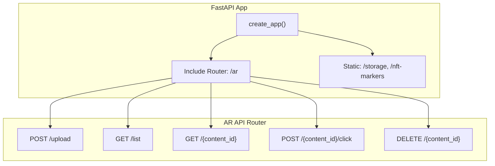
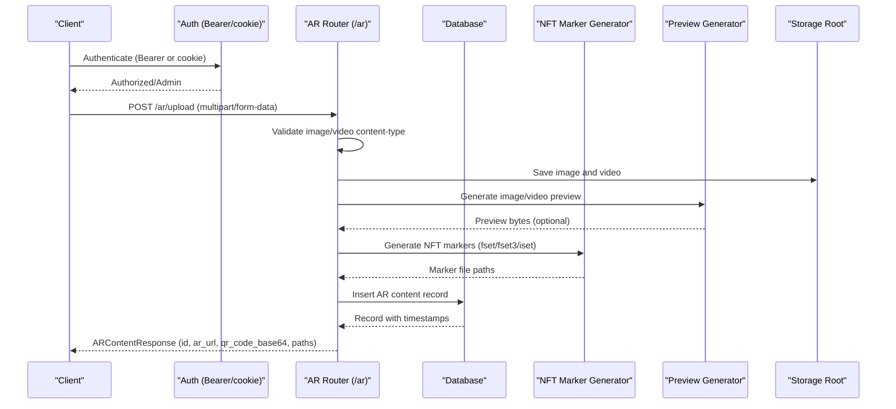
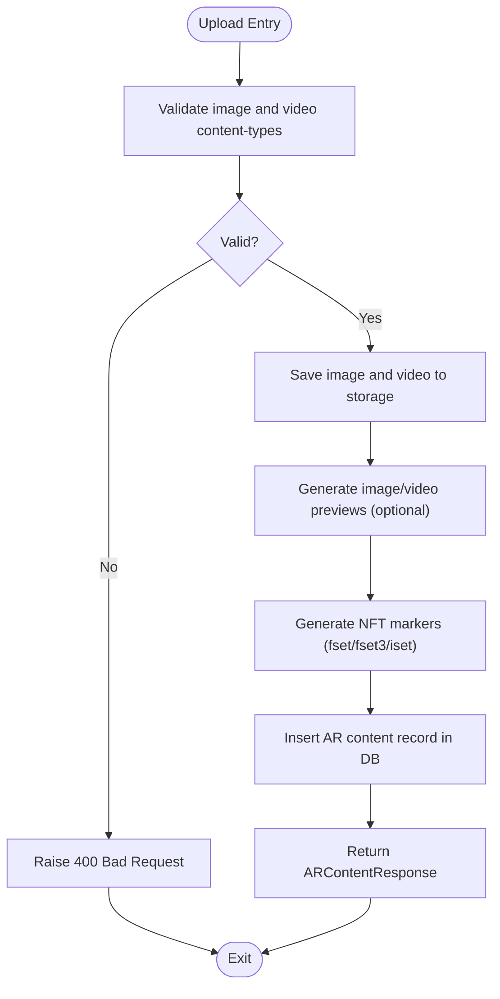
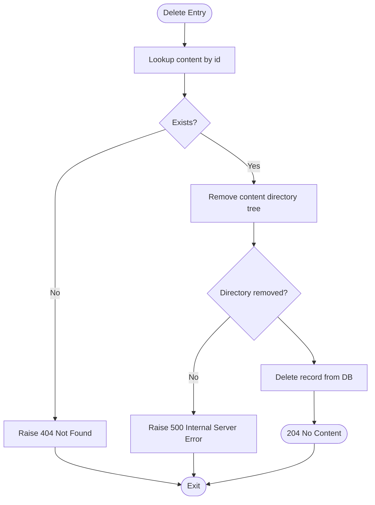
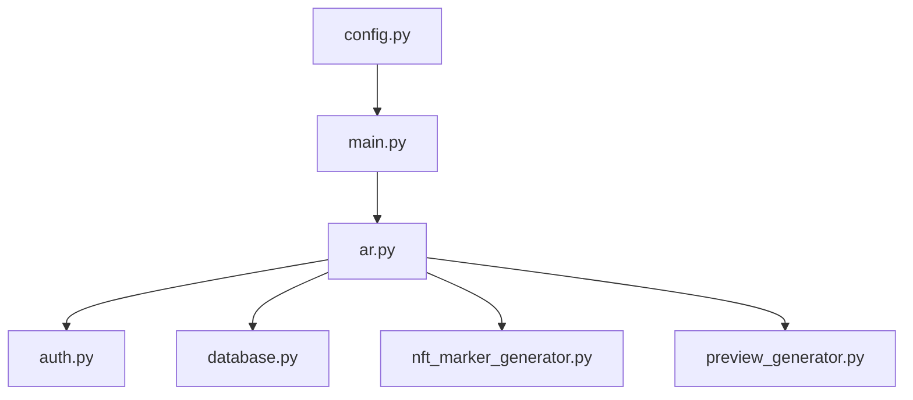

# AR Content API

<cite>
**Referenced Files in This Document**
- [ar.py](file://vertex-ar/app/api/ar.py)
- [models.py](file://vertex-ar/app/models.py)
- [database.py](file://vertex-ar/app/database.py)
- [auth.py](file://vertex-ar/app/api/auth.py)
- [main.py](file://vertex-ar/app/main.py)
- [config.py](file://vertex-ar/app/config.py)
- [nft_marker_generator.py](file://vertex-ar/nft_marker_generator.py)
- [preview_generator.py](file://vertex-ar/preview_generator.py)
</cite>

## Table of Contents
1. [Introduction](#introduction)
2. [Project Structure](#project-structure)
3. [Core Components](#core-components)
4. [Architecture Overview](#architecture-overview)
5. [Detailed Component Analysis](#detailed-component-analysis)
6. [Dependency Analysis](#dependency-analysis)
7. [Performance Considerations](#performance-considerations)
8. [Troubleshooting Guide](#troubleshooting-guide)
9. [Conclusion](#conclusion)

## Introduction
This document provides API documentation for the AR Content endpoints that manage AR experiences built from paired image and video assets. It covers:
- Uploading image and video pairs to create AR content (admin-only)
- Listing AR content (admin sees all; users see their own)
- Public viewing of AR content
- Interaction tracking (view and click)
- Deleting AR content and automatic cleanup of associated files
- Automatic generation of NFT markers, QR codes, and preview images
- Request/response schemas, HTTP methods, and URL patterns
- Performance considerations, error handling, and cleanup guarantees

## Project Structure
The AR Content API is implemented under the AR module and mounted under the /ar prefix. The application initializes configuration, static file serving, and registers routers during startup.

**Diagram sources**
- [main.py](file://vertex-ar/app/main.py#L158-L183)
- [ar.py](file://vertex-ar/app/api/ar.py#L42-L241)

**Section sources**
- [main.py](file://vertex-ar/app/main.py#L158-L183)
- [ar.py](file://vertex-ar/app/api/ar.py#L42-L241)

## Core Components
- AR API router: Defines endpoints for AR content management and public viewing.
- Database: Stores AR content metadata, counters, and provides CRUD operations.
- Authentication: Enforces admin-only access for upload and deletion; user access for listing.
- NFT Marker Generator: Produces AR.js-compatible marker files (.fset, .fset3, .iset).
- Preview Generator: Creates image and video preview thumbnails.
- Pydantic Model: Defines the response schema for uploaded AR content.

Key responsibilities:
- Upload endpoint validates file types, saves files, generates previews, creates NFT markers, builds QR code, and persists metadata.
- List endpoint respects admin privileges.
- View endpoint serves a public HTML page and increments view counts.
- Click endpoint increments click counts.
- Delete endpoint removes files and database records.

**Section sources**
- [ar.py](file://vertex-ar/app/api/ar.py#L42-L241)
- [database.py](file://vertex-ar/app/database.py#L1131-L1177)
- [models.py](file://vertex-ar/app/models.py#L69-L77)
- [nft_marker_generator.py](file://vertex-ar/nft_marker_generator.py#L603-L663)
- [preview_generator.py](file://vertex-ar/preview_generator.py#L17-L68)

## Architecture Overview
The AR Content API integrates with the application’s configuration, static file serving, and authentication layers. Uploads are persisted to the configured storage root, and public access is served via static mounts.

**Diagram sources**
- [ar.py](file://vertex-ar/app/api/ar.py#L42-L158)
- [database.py](file://vertex-ar/app/database.py#L1131-L1140)
- [nft_marker_generator.py](file://vertex-ar/nft_marker_generator.py#L603-L663)
- [preview_generator.py](file://vertex-ar/preview_generator.py#L17-L68)
- [config.py](file://vertex-ar/app/config.py#L162-L166)

## Detailed Component Analysis

### Upload Endpoint
- Method: POST
- URL: /ar/upload
- Authentication: Admin required (via Bearer token or authToken cookie)
- Request: multipart/form-data with image and video UploadFile fields
- Validation:
  - Rejects non-image content-type for image
  - Rejects non-video content-type for video
- Processing:
  - Generates UUID for content directory
  - Saves image and video to storage_root/ar_content/{username}/{content_id}/
  - Generates image and video previews (optional)
  - Generates NFT markers with increased size limits
  - Creates QR code base64 PNG for the public AR URL
  - Persists record with paths, marker files, URLs, and counters
- Response: ARContentResponse with id, ar_url, qr_code_base64, image_path, video_path, created_at

**Diagram sources**
- [ar.py](file://vertex-ar/app/api/ar.py#L42-L158)
- [database.py](file://vertex-ar/app/database.py#L1131-L1140)
- [nft_marker_generator.py](file://vertex-ar/nft_marker_generator.py#L603-L663)
- [preview_generator.py](file://vertex-ar/preview_generator.py#L17-L68)

**Section sources**
- [ar.py](file://vertex-ar/app/api/ar.py#L42-L158)
- [models.py](file://vertex-ar/app/models.py#L69-L77)
- [config.py](file://vertex-ar/app/config.py#L162-L166)

### List Endpoint
- Method: GET
- URL: /ar/list
- Authentication: Requires authenticated user
- Behavior:
  - Admins see all AR content ordered by created_at desc
  - Non-admins see only their own content

**Section sources**
- [ar.py](file://vertex-ar/app/api/ar.py#L160-L168)
- [database.py](file://vertex-ar/app/database.py#L1149-L1157)
- [auth.py](file://vertex-ar/app/api/auth.py#L41-L66)

### Public View Endpoint
- Method: GET
- URL: /ar/{content_id}
- Authentication: Public (no auth required)
- Behavior:
  - Retrieves AR content by id
  - Increments view_count
  - Renders HTML template with video URL derived from storage_root
  - Returns HTMLResponse

**Section sources**
- [ar.py](file://vertex-ar/app/api/ar.py#L170-L195)
- [database.py](file://vertex-ar/app/database.py#L1142-L1148)
- [database.py](file://vertex-ar/app/database.py#L1159-L1165)
- [main.py](file://vertex-ar/app/main.py#L76-L84)

### Interaction Tracking Endpoint
- Method: POST
- URL: /ar/{content_id}/click
- Authentication: Public (no auth required)
- Behavior:
  - Validates content exists
  - Increments click_count
  - Returns success status

**Section sources**
- [ar.py](file://vertex-ar/app/api/ar.py#L197-L207)
- [database.py](file://vertex-ar/app/database.py#L1166-L1171)

### Delete Endpoint
- Method: DELETE
- URL: /ar/{content_id}
- Authentication: Admin required
- Behavior:
  - Validates content exists
  - Removes content directory tree from storage
  - Deletes database record
  - Logs errors and raises 500 on failure

**Diagram sources**
- [ar.py](file://vertex-ar/app/api/ar.py#L209-L241)
- [database.py](file://vertex-ar/app/database.py#L1173-L1177)

**Section sources**
- [ar.py](file://vertex-ar/app/api/ar.py#L209-L241)
- [database.py](file://vertex-ar/app/database.py#L1173-L1177)

### Data Models and Schemas
- ARContentResponse: Fields include id, ar_url, qr_code_base64, image_path, video_path, created_at.

**Section sources**
- [models.py](file://vertex-ar/app/models.py#L69-L77)

### Public Access and Permanent Links
- Public AR viewer is served at /ar/{content_id}.
- The application mounts /storage for static file access and /nft-markers for marker files.
- QR code is embedded as base64 PNG in the upload response.

**Section sources**
- [main.py](file://vertex-ar/app/main.py#L76-L84)
- [ar.py](file://vertex-ar/app/api/ar.py#L116-L122)

## Dependency Analysis
- Router registration: AR endpoints are included under /ar prefix.
- Authentication dependencies: require_admin for upload/delete; get_current_user for list.
- Database operations: CRUD and counters for AR content.
- External generators: NFT marker generation and preview generation.

**Diagram sources**
- [ar.py](file://vertex-ar/app/api/ar.py#L42-L241)
- [auth.py](file://vertex-ar/app/api/auth.py#L68-L107)
- [database.py](file://vertex-ar/app/database.py#L1131-L1177)
- [nft_marker_generator.py](file://vertex-ar/nft_marker_generator.py#L603-L663)
- [preview_generator.py](file://vertex-ar/preview_generator.py#L17-L68)
- [main.py](file://vertex-ar/app/main.py#L158-L183)
- [config.py](file://vertex-ar/app/config.py#L162-L166)

**Section sources**
- [ar.py](file://vertex-ar/app/api/ar.py#L42-L241)
- [auth.py](file://vertex-ar/app/api/auth.py#L68-L107)
- [database.py](file://vertex-ar/app/database.py#L1131-L1177)
- [main.py](file://vertex-ar/app/main.py#L158-L183)
- [config.py](file://vertex-ar/app/config.py#L162-L166)

## Performance Considerations
- Upload rate limiting: Uploads are rate-limited globally and per endpoint.
- File size limits: MAX_FILE_SIZE controls upload size.
- Preview generation: Uses optimized resizing and compression; failures are logged and do not block upload.
- NFT marker generation: Supports larger images and areas; caching reduces repeated analysis.
- Static serving: Mounted /storage and /nft-markers improve delivery performance for media and markers.
- Database counters: Incremental updates are lightweight; consider batching if needed.

[No sources needed since this section provides general guidance]

## Troubleshooting Guide
- Invalid file types:
  - Upload rejects non-image or non-video content-type and returns 400.
- Missing or invalid admin credentials:
  - Upload and delete require admin; unauthorized or invalid tokens return 401/403.
- Content not found:
  - View and click endpoints return 404 if content_id is invalid.
- Directory removal failures:
  - Delete logs errors and returns 500 if stored content directory cannot be removed.
- Preview generation errors:
  - Preview generation exceptions are caught and logged; upload continues without previews.
- NFT marker generation:
  - Validation errors raise ValueError with messages; ensure image meets size and area constraints.

**Section sources**
- [ar.py](file://vertex-ar/app/api/ar.py#L57-L62)
- [auth.py](file://vertex-ar/app/api/auth.py#L68-L107)
- [ar.py](file://vertex-ar/app/api/ar.py#L174-L177)
- [ar.py](file://vertex-ar/app/api/ar.py#L220-L233)
- [preview_generator.py](file://vertex-ar/preview_generator.py#L63-L68)
- [nft_marker_generator.py](file://vertex-ar/nft_marker_generator.py#L257-L295)

## Conclusion
The AR Content API provides a complete pipeline for creating, managing, and consuming AR experiences from paired image and video assets. Admins can upload, list, and delete content; users can view and interact with AR content. The system automatically generates NFT markers, QR codes, and previews, and cleans up associated files upon deletion. Robust validation, rate limiting, and static file serving contribute to reliability and performance.