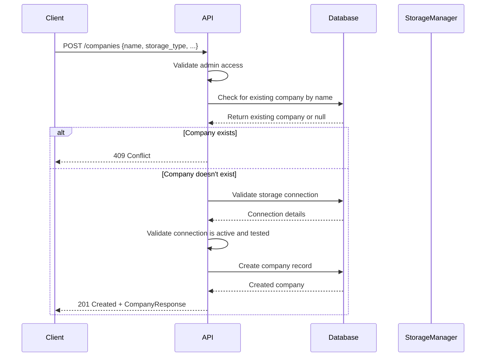
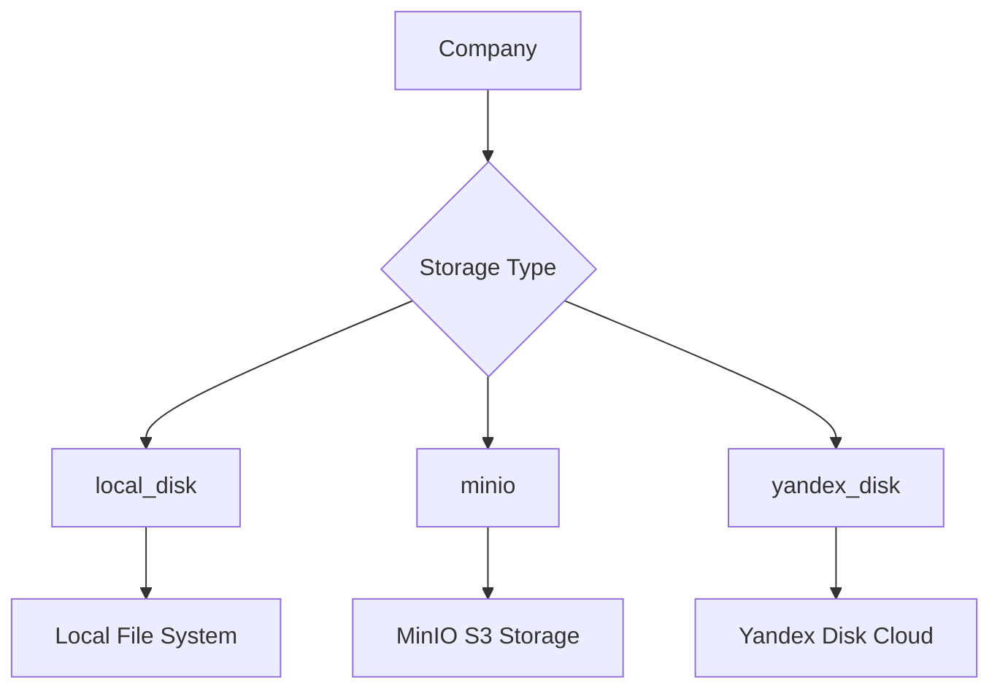
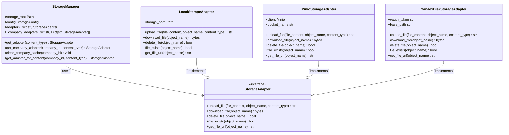
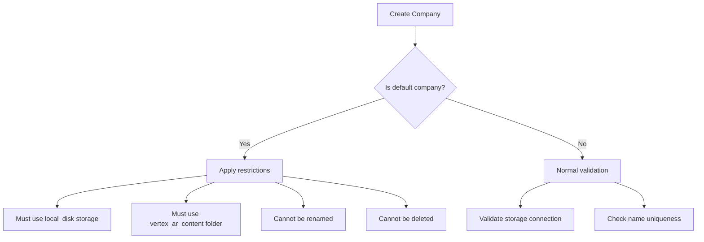
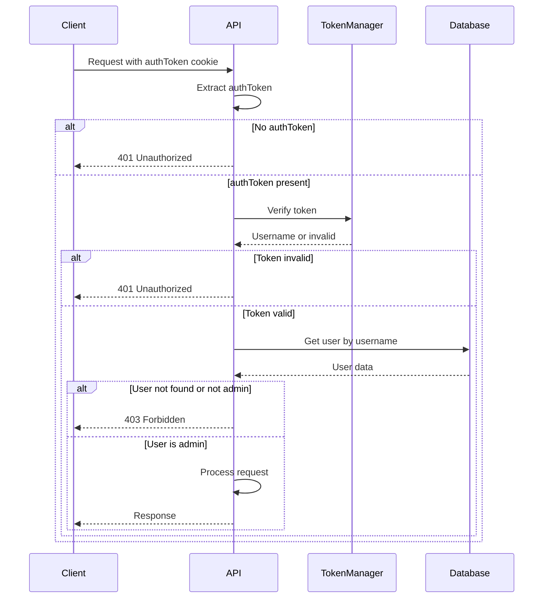

# Company Management API

<cite>
**Referenced Files in This Document**   
- [companies.py](file://vertex-ar/app/api/companies.py)
- [models.py](file://vertex-ar/app/models.py)
- [database.py](file://vertex-ar/app/database.py)
- [storage_manager.py](file://vertex-ar/storage_manager.py)
- [storage_config.py](file://vertex-ar/storage_config.py)
- [storage_utils.py](file://vertex-ar/app/storage_utils.py)
- [COMPANIES_API_ENHANCED.md](file://COMPANIES_API_ENHANCED.md)
- [COMPANY_STORAGE_DEFAULTS_MIGRATION.md](file://COMPANY_STORAGE_DEFAULTS_MIGRATION.md)
</cite>

## Table of Contents
1. [Introduction](#introduction)
2. [API Endpoints](#api-endpoints)
3. [Request/Response Schemas](#requestresponse-schemas)
4. [Storage Configuration](#storage-configuration)
5. [Default Company](#default-company)
6. [Security Considerations](#security-considerations)
7. [Examples](#examples)
8. [Error Handling](#error-handling)
9. [Best Practices](#best-practices)

## Introduction
The Company Management API provides comprehensive CRUD operations for managing companies within the Vertex AR multi-tenant system. This API enables administrators to create, retrieve, update, and delete company records, with special handling for the default company and robust validation for unique company names. The system supports multiple storage types including local storage, MinIO, and Yandex Disk, with detailed configuration options for storage connections and backup providers.

The API follows RESTful principles with appropriate HTTP methods and status codes. All endpoints require admin authentication via cookie-based authentication tokens. The system ensures data integrity through validation of unique company names and proper configuration of storage settings before creation or modification of company records.

**Section sources**
- [companies.py](file://vertex-ar/app/api/companies.py#L1-L1332)
- [COMPANIES_API_ENHANCED.md](file://COMPANIES_API_ENHANCED.md#L1-L558)

## API Endpoints

### Company CRUD Operations

#### Create Company
**Endpoint**: `POST /companies`  
**Description**: Creates a new company with specified storage configuration.  
**Authentication**: Admin access required  
**Validation**: 
- Company name must be unique
- For remote storage types (minio, yandex_disk), storage_connection_id is required
- Storage connection must be active and tested



**Diagram sources**
- [companies.py](file://vertex-ar/app/api/companies.py#L86-L174)

#### List Companies
**Endpoint**: `GET /companies`  
**Description**: Retrieves a paginated list of companies with optional filtering.  
**Query Parameters**:
- `page` (integer, default: 1): Page number for pagination
- `page_size` (integer, default: 50, max: 200): Number of items per page
- `search` (string, optional): Search query for company name
- `storage_type` (string, optional): Filter by storage type (local, local_disk, minio, yandex_disk)

**Response**: Paginated list of companies with total count and pagination metadata.

**Section sources**
- [companies.py](file://vertex-ar/app/api/companies.py#L177-L256)

#### Get Company
**Endpoint**: `GET /companies/{company_id}`  
**Description**: Retrieves detailed information about a specific company.  
**Response**: Company details including storage configuration, contact information, and creation timestamp.

**Section sources**
- [companies.py](file://vertex-ar/app/api/companies.py#L259-L296)

#### Update Company
**Endpoint**: `PUT /companies/{company_id}` or `PATCH /companies/{company_id}`  
**Description**: Updates company fields (full replacement with PUT, partial update with PATCH).  
**Validation**:
- Cannot rename the default company ('Vertex AR')
- Cannot change storage settings for the default company (must use local_disk with vertex_ar_content folder)
- When changing to remote storage, storage_connection_id must be provided
- Storage connection must be active and tested

**Section sources**
- [companies.py](file://vertex-ar/app/api/companies.py#L340-L494)

#### Delete Company
**Endpoint**: `DELETE /companies/{company_id}`  
**Description**: Deletes a company and all related data (cascade delete).  
**Restriction**: Cannot delete the default company ('Vertex AR').  
**Response**: Success message upon deletion.

**Section sources**
- [companies.py](file://vertex-ar/app/api/companies.py#L298-L337)

#### Select Company
**Endpoint**: `POST /companies/{company_id}/select`  
**Description**: Switches the current context to the specified company.  
**Response**: Basic company information for the selected company.

**Section sources**
- [companies.py](file://vertex-ar/app/api/companies.py#L497-L522)

### Storage Configuration Endpoints

#### Set Yandex Disk Folder
**Endpoint**: `POST /companies/{company_id}/yandex-disk-folder`  
**Description**: Sets the Yandex Disk folder for a company using Yandex Disk storage.  
**Validation**:
- Company must use Yandex Disk storage type
- Company must have a storage connection configured
- Storage connection must be active
- OAuth token must be configured in the storage connection
- Folder must exist on Yandex Disk

**Section sources**
- [companies.py](file://vertex-ar/app/api/companies.py#L524-L713)

#### Get Storage Information
**Endpoint**: `GET /companies/{company_id}/storage-info`  
**Description**: Retrieves storage configuration information for a company.  
**Response**: Current storage type, folder path, configuration status, and status message.

**Section sources**
- [companies.py](file://vertex-ar/app/api/companies.py#L716-L785)

#### Update Storage Type
**Endpoint**: `PUT /companies/{company_id}/storage-type`  
**Description**: Updates the storage type for a company.  
**Restriction**: Cannot change storage type for the default company (must use local_disk).  
**Validation**: Storage type must be one of: local, minio, yandex_disk.

**Section sources**
- [companies.py](file://vertex-ar/app/api/companies.py#L788-L871)

#### Create/Update Storage Folder
**Endpoint**: `POST /companies/{company_id}/storage-folder`  
**Description**: Creates or updates the storage folder for a company (for local storage).  
**Validation**:
- Only applicable for local storage types
- Cannot change storage folder for the default company (must use 'vertex_ar_content')
- Folder path must be valid (letters, numbers, dashes, underscores only)

**Section sources**
- [companies.py](file://vertex-ar/app/api/companies.py#L874-L983)

#### Get Storage Workflow Options
**Endpoint**: `GET /companies/workflow/storage-options`  
**Description**: Retrieves available storage options for company creation workflow.  
**Response**: List of storage types with connection details, including local storage (always available) and tested remote storage connections (MinIO, Yandex Disk).

**Section sources**
- [companies.py](file://vertex-ar/app/api/companies.py#L1304-L1331)

## Request/Response Schemas

### CompanyCreate
Request schema for creating a new company.

```json
{
  "name": "string",
  "storage_type": "string",
  "storage_connection_id": "string",
  "yandex_disk_folder_id": "string",
  "storage_folder_path": "string",
  "backup_provider": "string",
  "backup_remote_path": "string",
  "email": "string",
  "description": "string",
  "city": "string",
  "phone": "string",
  "website": "string",
  "social_links": "string",
  "manager_name": "string",
  "manager_phone": "string",
  "manager_email": "string"
}
```

**Properties**:
- `name`: Company name (required, 1-255 characters)
- `storage_type`: Storage type (default: "local_disk", one of: local, local_disk, minio, yandex_disk)
- `storage_connection_id`: Storage connection ID for remote storage
- `yandex_disk_folder_id`: Yandex Disk folder ID/path for storing orders
- `storage_folder_path`: Storage folder path for local storage (default: "vertex_ar_content")
- `backup_provider`: Remote backup provider (e.g., yandex_disk, google_drive)
- `backup_remote_path`: Remote path for backups
- `email`: Company email address
- `description`: Company description
- `city`: Company city/location
- `phone`: Company phone number
- `website`: Company website URL
- `social_links`: Social media links as JSON string
- `manager_name`: Manager/contact person name
- `manager_phone`: Manager phone number
- `manager_email`: Manager email address

**Validation**:
- Company name must be unique
- For minio or yandex_disk storage, storage_connection_id is required
- For yandex_disk storage, yandex_disk_folder_id is required
- Email, phone, website, and social links are validated for proper format

**Section sources**
- [models.py](file://vertex-ar/app/models.py#L80-L170)

### CompanyResponse
Response schema for company operations.

```json
{
  "id": "string",
  "name": "string",
  "storage_type": "string",
  "storage_connection_id": "string",
  "yandex_disk_folder_id": "string",
  "storage_folder_path": "string",
  "backup_provider": "string",
  "backup_remote_path": "string",
  "email": "string",
  "description": "string",
  "city": "string",
  "phone": "string",
  "website": "string",
  "social_links": "string",
  "manager_name": "string",
  "manager_phone": "string",
  "manager_email": "string",
  "created_at": "string"
}
```

**Section sources**
- [models.py](file://vertex-ar/app/models.py#L173-L192)

### CompanyUpdate
Request schema for updating a company.

```json
{
  "name": "string",
  "storage_type": "string",
  "storage_connection_id": "string",
  "yandex_disk_folder_id": "string",
  "storage_folder_path": "string",
  "backup_provider": "string",
  "backup_remote_path": "string",
  "email": "string",
  "description": "string",
  "city": "string",
  "phone": "string",
  "website": "string",
  "social_links": "string",
  "manager_name": "string",
  "manager_phone": "string",
  "manager_email": "string"
}
```

**Section sources**
- [models.py](file://vertex-ar/app/models.py#L198-L290)

### CompanyStorageTypeUpdate
Request schema for updating company storage type.

```json
{
  "storage_type": "string"
}
```

**Section sources**
- [models.py](file://vertex-ar/app/models.py#L450-L458)

### CompanyStorageFolderUpdate
Request schema for creating or updating company storage folder.

```json
{
  "folder_path": "string"
}
```

**Section sources**
- [models.py](file://vertex-ar/app/models.py#L461-L473)

### YandexFolderUpdate
Request schema for setting Yandex Disk folder.

```json
{
  "folder_path": "string"
}
```

**Section sources**
- [models.py](file://vertex-ar/app/models.py#L487-L495)

### CompanyStorageInfoResponse
Response schema for company storage information.

```json
{
  "company_id": "string",
  "company_name": "string",
  "storage_type": "string",
  "storage_folder_path": "string",
  "yandex_disk_folder_id": "string",
  "storage_connection_id": "string",
  "is_configured": "boolean",
  "status_message": "string"
}
```

**Section sources**
- [models.py](file://vertex-ar/app/models.py#L476-L484)

### PaginatedCompaniesResponse
Response schema for paginated company listing.

```json
{
  "items": [
    {
      "id": "string",
      "name": "string",
      "storage_type": "string",
      "storage_connection_id": "string",
      "yandex_disk_folder_id": "string",
      "storage_folder_path": "string",
      "backup_provider": "string",
      "backup_remote_path": "string",
      "email": "string",
      "description": "string",
      "city": "string",
      "phone": "string",
      "website": "string",
      "social_links": "string",
      "manager_name": "string",
      "manager_phone": "string",
      "manager_email": "string",
      "created_at": "string",
      "client_count": "integer"
    }
  ],
  "total": "integer",
  "page": "integer",
  "page_size": "integer",
  "total_pages": "integer"
}
```

**Section sources**
- [models.py](file://vertex-ar/app/models.py#L527-L533)

## Storage Configuration

### Storage Types
The system supports multiple storage types for company data:

- **local**: Legacy local storage type (backward compatibility)
- **local_disk**: Current standard for local storage
- **minio**: MinIO S3-compatible storage
- **yandex_disk**: Yandex Disk cloud storage

The system uses a utility function `is_local_storage()` that treats both "local" and "local_disk" as equivalent for backward compatibility while standardizing on "local_disk" for new configurations.



**Diagram sources**
- [storage_utils.py](file://vertex-ar/app/storage_utils.py)
- [storage_manager.py](file://vertex-ar/storage_manager.py)

### Storage Connection Management
Storage connections are managed separately from companies. A storage connection defines the configuration for a remote storage system (MinIO or Yandex Disk) and can be reused by multiple companies.

**Storage Connection Schema**:
- `id`: Unique identifier
- `name`: Display name
- `type`: Storage type (minio or yandex_disk)
- `config`: Configuration details (endpoint, credentials, etc.)
- `is_active`: Whether the connection is active
- `is_tested`: Whether the connection has been tested successfully

When creating or updating a company with remote storage, the storage_connection_id must reference an existing, active, and tested storage connection.

**Section sources**
- [companies.py](file://vertex-ar/app/api/companies.py#L104-L116)
- [COMPANIES_API_ENHANCED.md](file://COMPANIES_API_ENHANCED.md#L280-L332)

### Storage Manager
The StorageManager class manages storage adapters for different content types and companies. It handles:

- Creating appropriate storage adapters based on storage type
- Caching company-specific storage adapters
- Clearing cache when storage configuration changes
- Provisioning storage hierarchies for companies



**Diagram sources**
- [storage_manager.py](file://vertex-ar/storage_manager.py)
- [storage_adapter.py](file://vertex-ar/storage_adapter.py)

## Default Company

### Special Handling
The system includes a default company with ID "vertex-ar-default" that has special handling rules:

- **Cannot be deleted**: The default company serves as the system's baseline configuration.
- **Cannot be renamed**: The name "Vertex AR" is fixed for the default company.
- **Storage restrictions**: The default company must use local_disk storage with the vertex_ar_content folder.
- **Automatic creation**: The default company is created automatically on first system startup.



**Diagram sources**
- [companies.py](file://vertex-ar/app/api/companies.py#L308-L319)
- [companies.py](file://vertex-ar/app/api/companies.py#L366-L379)

### Migration from "local" to "local_disk"
The system has migrated from using "local" to "local_disk" as the standard identifier for local storage. This change maintains backward compatibility through:

- **Automatic migration**: Existing companies with storage_type="local" are automatically converted to "local_disk" on database initialization.
- **Validation accepts both**: All validators accept both "local" and "local_disk" values.
- **Equivalent treatment**: The is_local_storage() helper treats both values identically.
- **Default values**: New companies default to storage_type="local_disk" and storage_folder_path="vertex_ar_content".

**Section sources**
- [COMPANY_STORAGE_DEFAULTS_MIGRATION.md](file://COMPANY_STORAGE_DEFAULTS_MIGRATION.md#L1-L219)

## Security Considerations

### Authentication and Authorization
All company management endpoints require admin authentication. The system verifies admin access through:

- **Cookie-based authentication**: The API checks for a valid authToken cookie.
- **Token verification**: The token is verified against the application's token manager.
- **Admin role check**: The authenticated user must have admin privileges (is_admin=True).



**Diagram sources**
- [companies.py](file://vertex-ar/app/api/companies.py#L47-L83)

### Data Validation
The API implements comprehensive validation to prevent invalid data:

- **Company name uniqueness**: Prevents creation of companies with duplicate names.
- **Storage configuration validation**: Ensures remote storage connections are properly configured and tested.
- **Input sanitization**: Validates and sanitizes all input fields (email, phone, URLs, etc.).
- **Field-level validation**: Each field has appropriate validation rules (length, format, etc.).

**Section sources**
- [companies.py](file://vertex-ar/app/api/companies.py#L95-L101)
- [models.py](file://vertex-ar/app/models.py#L98-L170)

### Special Restrictions
Additional security restrictions apply to sensitive operations:

- **Default company protection**: Prevents deletion and critical modifications to the default company.
- **Storage type restrictions**: Prevents changing storage type for the default company.
- **Folder path restrictions**: Prevents changing the storage folder for the default company.
- **Admin-only access**: All company management operations require admin privileges.

**Section sources**
- [companies.py](file://vertex-ar/app/api/companies.py#L308-L379)

## Examples

### Creating a Company with Local Storage
```bash
curl -X POST "https://api.example.com/companies" \
  -H "Content-Type: application/json" \
  -H "Cookie: authToken=your_admin_token" \
  -d '{
    "name": "Local Company",
    "storage_type": "local_disk",
    "storage_folder_path": "local_company"
  }'
```

**Response**:
```json
{
  "id": "company-abc123",
  "name": "Local Company",
  "storage_type": "local_disk",
  "storage_folder_path": "local_company",
  "created_at": "2025-01-15T10:30:00"
}
```

**Section sources**
- [companies.py](file://vertex-ar/app/api/companies.py#L86-L174)

### Creating a Company with MinIO Storage
```bash
curl -X POST "https://api.example.com/companies" \
  -H "Content-Type: application/json" \
  -H "Cookie: authToken=your_admin_token" \
  -d '{
    "name": "MinIO Company",
    "storage_type": "minio",
    "storage_connection_id": "conn-minio-1"
  }'
```

**Response**:
```json
{
  "id": "company-def456",
  "name": "MinIO Company",
  "storage_type": "minio",
  "storage_connection_id": "conn-minio-1",
  "created_at": "2025-01-15T10:35:00"
}
```

**Section sources**
- [companies.py](file://vertex-ar/app/api/companies.py#L86-L174)

### Creating a Company with Yandex Disk Storage
```bash
curl -X POST "https://api.example.com/companies" \
  -H "Content-Type: application/json" \
  -H "Cookie: authToken=your_admin_token" \
  -d '{
    "name": "Yandex Company",
    "storage_type": "yandex_disk",
    "storage_connection_id": "conn-yandex-1",
    "yandex_disk_folder_id": "/Companies/YandexCompany"
  }'
```

**Response**:
```json
{
  "id": "company-ghi789",
  "name": "Yandex Company",
  "storage_type": "yandex_disk",
  "storage_connection_id": "conn-yandex-1",
  "yandex_disk_folder_id": "/Companies/YandexCompany",
  "created_at": "2025-01-15T10:40:00"
}
```

**Section sources**
- [companies.py](file://vertex-ar/app/api/companies.py#L86-L174)

### Updating Company Storage Settings
```bash
curl -X PATCH "https://api.example.com/companies/company-abc123" \
  -H "Content-Type: application/json" \
  -H "Cookie: authToken=your_admin_token" \
  -d '{
    "storage_type": "minio",
    "storage_connection_id": "conn-minio-1"
  }'
```

**Response**:
```json
{
  "id": "company-abc123",
  "name": "Local Company",
  "storage_type": "minio",
  "storage_connection_id": "conn-minio-1",
  "storage_folder_path": "local_company",
  "created_at": "2025-01-15T10:30:00"
}
```

**Section sources**
- [companies.py](file://vertex-ar/app/api/companies.py#L340-L494)

### Setting Yandex Disk Folder for Company
```bash
curl -X POST "https://api.example.com/companies/company-ghi789/yandex-disk-folder" \
  -H "Content-Type: application/json" \
  -H "Cookie: authToken=your_admin_token" \
  -d '{
    "folder_path": "/Companies/YandexCompany/UpdatedFolder"
  }'
```

**Response**:
```json
{
  "id": "company-ghi789",
  "name": "Yandex Company",
  "storage_type": "yandex_disk",
  "yandex_disk_folder_id": "/Companies/YandexCompany/UpdatedFolder",
  "created_at": "2025-01-15T10:40:00"
}
```

**Section sources**
- [companies.py](file://vertex-ar/app/api/companies.py#L524-L713)

## Error Handling

### Common Error Responses

#### 401 Unauthorized
Returned when authentication is missing or invalid.

```json
{
  "detail": "Not authenticated"
}
```

**Section sources**
- [companies.py](file://vertex-ar/app/api/companies.py#L52-L54)

#### 403 Forbidden
Returned when the authenticated user lacks admin privileges or attempts to perform a restricted operation.

```json
{
  "detail": "Admin access required"
}
```

Or when attempting to modify the default company's critical settings:

```json
{
  "detail": "Cannot change storage settings for default company 'Vertex AR'. It must use local_disk with vertex_ar_content folder."
}
```

**Section sources**
- [companies.py](file://vertex-ar/app/api/companies.py#L70-L72)
- [companies.py](file://vertex-ar/app/api/companies.py#L377-L379)

#### 404 Not Found
Returned when the requested company does not exist.

```json
{
  "detail": "Company not found"
}
```

**Section sources**
- [companies.py](file://vertex-ar/app/api/companies.py#L271-L272)

#### 409 Conflict
Returned when attempting to create a company with a name that already exists.

```json
{
  "detail": "Company 'existing-name' already exists"
}
```

**Section sources**
- [companies.py](file://vertex-ar/app/api/companies.py#L99-L100)

#### 400 Bad Request
Returned when storage configuration is invalid.

```json
{
  "detail": "Storage connection ID is required for remote storage"
}
```

Or when the storage connection is inactive or not tested:

```json
{
  "detail": "Storage connection must be active and tested"
}
```

**Section sources**
- [companies.py](file://vertex-ar/app/api/companies.py#L119-L120)
- [companies.py](file://vertex-ar/app/api/companies.py#L114-L115)

### Error Response Schema
All error responses follow the standard FastAPI HTTPException format:

```json
{
  "detail": "Error description"
}
```

The detail field contains a human-readable description of the error condition.

**Section sources**
- [companies.py](file://vertex-ar/app/api/companies.py#L99-L100)
- [companies.py](file://vertex-ar/app/api/companies.py#L271-L272)
- [companies.py](file://vertex-ar/app/api/companies.py#L310-L311)

## Best Practices

### Company Naming
- Use descriptive, unique names for companies
- Avoid special characters and spaces in company names
- Consider using a consistent naming convention across your organization

### Storage Configuration
- **Local storage**: Use for development and small-scale deployments
- **MinIO**: Use for on-premise object storage with S3-compatible API
- **Yandex Disk**: Use for cloud storage with built-in backup capabilities
- Always test storage connections before assigning them to companies
- Use descriptive names for storage connections to identify their purpose

### Default Company Usage
- The default company should be used for system-level configurations
- Do not modify the default company's storage settings
- Create separate companies for customer data and operations
- Use the default company as a template for new company configurations

### API Usage
- Always handle authentication tokens securely
- Implement proper error handling for all API calls
- Use pagination when retrieving company lists to avoid performance issues
- Validate responses before processing data
- Cache company information when appropriate to reduce API calls

### Security
- Restrict access to company management endpoints to administrators only
- Regularly audit company configurations and storage settings
- Monitor logs for unauthorized access attempts
- Keep storage connection credentials secure and rotate them periodically
- Implement backup strategies for critical company data

**Section sources**
- [COMPANIES_API_ENHANCED.md](file://COMPANIES_API_ENHANCED.md#L488-L511)
- [COMPANY_STORAGE_DEFAULTS_MIGRATION.md](file://COMPANY_STORAGE_DEFAULTS_MIGRATION.md#L214-L218)