# Mobile API

<cite>
**Referenced Files in This Document**
- [mobile.py](file://vertex-ar/app/api/mobile.py)
- [mobile-api-schema.json](file://docs/api/mobile-api-schema.json)
- [mobile-data-flow.md](file://docs/api/mobile-data-flow.md)
- [mobile-rn-requirements.md](file://docs/api/mobile-rn-requirements.md)
- [mobile-examples.md](file://docs/api/mobile-examples.md)
- [database.py](file://vertex-ar/app/database.py)
</cite>

## Table of Contents
1. [Introduction](#introduction)
2. [Project Structure](#project-structure)
3. [Core Components](#core-components)
4. [Architecture Overview](#architecture-overview)
5. [Detailed Component Analysis](#detailed-component-analysis)
6. [Dependency Analysis](#dependency-analysis)
7. [Performance Considerations](#performance-considerations)
8. [Troubleshooting Guide](#troubleshooting-guide)
9. [Conclusion](#conclusion)
10. [Appendices](#appendices)

## Introduction
This document provides comprehensive API documentation for the Mobile API endpoints optimized for the React Native mobile application. It covers retrieving portraits, tracking views, checking marker status, and the company listing endpoint for multi-tenant selection. It explains how the server builds optimized data structures with pre-built URLs for images, videos, and NFT markers, and how the mobile app can leverage preview URLs to reduce bandwidth usage. It also details public access to portrait data via permanent links, view tracking with device and AR performance analytics, and the marker status endpoint for efficient cache management.

## Project Structure
The Mobile API is implemented as a FastAPI router module and documented via OpenAPI schema and usage guides. The endpoints are backed by a SQLite database with tables for companies, clients, portraits, and videos. The documentation includes:
- Endpoint definitions and request/response schemas
- Data flow diagrams for typical mobile workflows
- Requirements and examples for React Native integration
- Performance and caching guidance

**Diagram sources**
- [mobile-data-flow.md](file://docs/api/mobile-data-flow.md#L1-L64)
- [mobile.py](file://vertex-ar/app/api/mobile.py#L215-L500)

**Section sources**
- [mobile.py](file://vertex-ar/app/api/mobile.py#L1-L500)
- [mobile-api-schema.json](file://docs/api/mobile-api-schema.json#L1-L176)
- [mobile-data-flow.md](file://docs/api/mobile-data-flow.md#L1-L64)

## Core Components
- Mobile API Router: Defines endpoints for portrait listing, public portrait retrieval by permanent link, view tracking, company listing, and marker status checks.
- Pydantic Models: Define request/response schemas for mobile-optimized payloads, including DeviceInfo, ARInfo, ImageInfo, MarkersInfo, VideoInfo, ClientInfo, and response models.
- Database Layer: Provides portrait, client, video, and company data accessors used by the Mobile API.

Key responsibilities:
- Build pre-signed or public URLs for images, videos, and NFT markers.
- Return preview URLs to minimize bandwidth on mobile networks.
- Expose marker status for efficient caching and offline readiness.
- Track view counts and analytics for AR sessions.

**Section sources**
- [mobile.py](file://vertex-ar/app/api/mobile.py#L36-L213)
- [database.py](file://vertex-ar/app/database.py#L1389-L1579)

## Architecture Overview
The Mobile API follows a straightforward request-response pattern:
- Clients authenticate with a bearer token for protected endpoints.
- Public endpoints (portrait by permanent link and view tracking) are accessible without authentication.
- The API constructs resource URLs using configured base URL and storage roots.
- Responses are optimized for mobile consumption with pre-built URLs and preview assets.

**Diagram sources**
- [mobile.py](file://vertex-ar/app/api/mobile.py#L215-L500)
- [database.py](file://vertex-ar/app/database.py#L1389-L1579)

## Detailed Component Analysis

### Endpoint Catalog
- GET /api/mobile/portraits
  - Purpose: Retrieve a paginated list of portraits optimized for mobile.
  - Filters: company_id, client_id, include_inactive.
  - Response: PortraitsListResponse with portraits[], total, page, page_size.
  - Security: Requires bearer token.

- GET /api/mobile/portraits/{permanent_link}
  - Purpose: Public endpoint to fetch a specific portrait by permanent link.
  - Response: MobilePortraitResponse.
  - Security: No authentication required.

- POST /api/mobile/portraits/{portrait_id}/view
  - Purpose: Track a portrait view with device and AR analytics.
  - Request Body: PortraitViewRequest (timestamp, duration_seconds, device_info, ar_info, session_id).
  - Response: ViewResponse (success, view_count).
  - Security: No authentication required.

- GET /api/mobile/companies
  - Purpose: List companies with portrait counts for multi-tenant selection.
  - Response: List[CompanyInfo].
  - Security: Requires bearer token.

- GET /api/mobile/portraits/{portrait_id}/marker-status
  - Purpose: Check availability and metadata of NFT marker files for cache management.
  - Response: MarkerStatusResponse (available, files map, total_size_mb).
  - Security: Requires bearer token.

**Section sources**
- [mobile-api-schema.json](file://docs/api/mobile-api-schema.json#L24-L176)
- [mobile.py](file://vertex-ar/app/api/mobile.py#L215-L500)

### Request/Response Schemas
- PortraitViewRequest
  - Fields: timestamp (ISO8601), duration_seconds (int >= 0), device_info (DeviceInfo), ar_info (ARInfo), session_id (string).
- DeviceInfo
  - Fields: platform ("ios"|"android"), os_version (string), app_version (string), model (string).
- ARInfo
  - Fields: scan_time_ms (int), fps_average (float), marker_lost_count (int).
- ImageInfo
  - Fields: url (string), preview_url (string), width (int), height (int).
- MarkersInfo
  - Fields: fset (string), fset3 (string), iset (string).
- VideoInfo
  - Fields: id (string), url (string), preview_url (string), description (string), file_size_mb (float), duration_seconds (int).
- ClientInfo
  - Fields: id (string), name (string), phone (string).
- MobilePortraitResponse
  - Fields: id (string), permanent_link (string), client (ClientInfo), image (ImageInfo), markers (MarkersInfo), active_video (VideoInfo), qr_code (string), view_count (int), created_at (string).
- PortraitsListResponse
  - Fields: portraits (array of MobilePortraitResponse), total (int), page (int), page_size (int).
- ViewResponse
  - Fields: success (bool), view_count (int).
- CompanyInfo
  - Fields: id (string), name (string), portraits_count (int), created_at (string).
- MarkerStatusFile
  - Fields: size (int), updated_at (string).
- MarkerStatusResponse
  - Fields: available (bool), files (map of file_type to MarkerStatusFile), total_size_mb (float).

**Section sources**
- [mobile-api-schema.json](file://docs/api/mobile-api-schema.json#L177-L324)
- [mobile.py](file://vertex-ar/app/api/mobile.py#L36-L213)

### Data Flow and URL Construction
- Image and video URLs are constructed using the configured base URL and storage root, pointing to /storage/<path>.
- NFT marker URLs are constructed under /nft-markers/<portrait_id>/<portrait_id>.<ext>.
- QR code is returned as a data URL when present.
- Pagination is handled server-side for portrait lists.

**Diagram sources**
- [mobile.py](file://vertex-ar/app/api/mobile.py#L142-L213)

**Section sources**
- [mobile.py](file://vertex-ar/app/api/mobile.py#L142-L213)

### Public Access: Permanent Link Retrieval
- Endpoint: GET /api/mobile/portraits/{permanent_link}
- Behavior: Public endpoint that returns a MobilePortraitResponse without authentication.
- Use Case: Direct access via QR codes or deep links.

Example flow:
- Mobile app receives a QR payload containing a URL with a permanent link.
- Extract permanent_link from the URL path.
- Call GET /api/mobile/portraits/{permanent_link}.
- Receive MobilePortraitResponse with pre-built URLs for image, video, and markers.

**Section sources**
- [mobile.py](file://vertex-ar/app/api/mobile.py#L305-L349)
- [mobile-data-flow.md](file://docs/api/mobile-data-flow.md#L112-L146)

### View Tracking with Device and AR Analytics
- Endpoint: POST /api/mobile/portraits/{portrait_id}/view
- Request Body: PortraitViewRequest with device_info and optional ar_info.
- Behavior: Increments the portrait’s view_count and returns the updated count.
- Analytics: Supports device platform, OS version, app version, and AR metrics such as scan_time_ms, fps_average, and marker_lost_count.

Example flow:
- On AR session exit, compute duration_seconds.
- Send POST /api/mobile/portraits/{id}/view with device_info and ar_info.
- Server increments view_count and returns ViewResponse.

**Section sources**
- [mobile.py](file://vertex-ar/app/api/mobile.py#L351-L401)
- [mobile-data-flow.md](file://docs/api/mobile-data-flow.md#L182-L204)

### Marker Status Endpoint for Cache Management
- Endpoint: GET /api/mobile/portraits/{portrait_id}/marker-status
- Response: MarkerStatusResponse indicating whether all marker files are present and their sizes/timestamps.
- Use Case: Mobile app checks marker status before AR playback to decide whether to download or skip.

**Diagram sources**
- [mobile.py](file://vertex-ar/app/api/mobile.py#L439-L500)

**Section sources**
- [mobile.py](file://vertex-ar/app/api/mobile.py#L439-L500)

### Company Listing Endpoint for Multi-Tenant Selection
- Endpoint: GET /api/mobile/companies
- Response: List of CompanyInfo with portraits_count for each company.
- Use Case: Allow users to select a company tenant before browsing portraits.

**Section sources**
- [mobile.py](file://vertex-ar/app/api/mobile.py#L403-L437)

## Dependency Analysis
- Mobile API depends on:
  - Database layer for portrait, client, video, and company data.
  - Application configuration for BASE_URL and STORAGE_ROOT.
  - Pydantic models for request/response validation.
- External dependencies:
  - FastAPI for routing and serialization.
  - SQLite for persistence.

**Diagram sources**
- [mobile.py](file://vertex-ar/app/api/mobile.py#L215-L500)
- [database.py](file://vertex-ar/app/database.py#L1389-L1579)

**Section sources**
- [mobile.py](file://vertex-ar/app/api/mobile.py#L215-L500)
- [database.py](file://vertex-ar/app/database.py#L1389-L1579)

## Performance Considerations
- Bandwidth Optimization:
  - Use preview_url fields for images and videos to reduce initial payload size.
  - Download full-resolution assets on demand.
- Caching Strategy:
  - Cache portrait metadata and preview assets locally.
  - Cache NFT marker files persistently for offline AR readiness.
- Network Resilience:
  - Queue view tracking events when offline and sync upon connectivity.
- AR Performance:
  - Provide ARInfo (scan_time_ms, fps_average, marker_lost_count) to inform analytics and UX decisions.
- File Sizes and Traffic:
  - Typical sizes and traffic estimates are documented to help plan caching and bandwidth budgets.

**Section sources**
- [mobile-rn-requirements.md](file://docs/api/mobile-rn-requirements.md#L316-L401)
- [mobile-data-flow.md](file://docs/api/mobile-data-flow.md#L407-L450)

## Troubleshooting Guide
Common issues and resolutions:
- 404 Not Found
  - Portrait not found by permanent_link or portrait_id.
  - Verify the permanent_link or portrait_id correctness.
- 404 Not Found (View Tracking)
  - Portrait does not exist for the given id.
  - Ensure the portrait exists before sending view events.
- 500 Internal Server Error
  - Failure to build portrait response or increment view count.
  - Check server logs and storage paths resolution.
- Marker Files Missing
  - MarkerStatusResponse.available is false.
  - Trigger marker download flow and retry after successful download.
- Authentication Required
  - Protected endpoints require a valid bearer token.
  - Ensure the token is included in Authorization header.

**Section sources**
- [mobile.py](file://vertex-ar/app/api/mobile.py#L305-L500)
- [database.py](file://vertex-ar/app/database.py#L1389-L1579)

## Conclusion
The Mobile API provides a focused set of endpoints optimized for React Native AR experiences. It delivers pre-built URLs for images, videos, and NFT markers, supports public portrait retrieval via permanent links, enables view tracking with device and AR analytics, and offers marker status checks for efficient caching. By leveraging preview assets and robust caching strategies, the API minimizes bandwidth usage and improves performance on mobile networks.

## Appendices

### Endpoint Reference and Examples

- GET /api/mobile/portraits
  - Filters: company_id, client_id, include_inactive, page, page_size.
  - Response: PortraitsListResponse.
  - Example usage: See [mobile-examples.md](file://docs/api/mobile-examples.md#L75-L138).

- GET /api/mobile/portraits/{permanent_link}
  - Response: MobilePortraitResponse.
  - Example usage: See [mobile-examples.md](file://docs/api/mobile-examples.md#L141-L176).

- POST /api/mobile/portraits/{portrait_id}/view
  - Request: PortraitViewRequest with device_info and optional ar_info.
  - Response: ViewResponse.
  - Example usage: See [mobile-examples.md](file://docs/api/mobile-examples.md#L179-L241).

- GET /api/mobile/companies
  - Response: List[CompanyInfo].
  - Example usage: See [mobile-examples.md](file://docs/api/mobile-examples.md#L75-L138).

- GET /api/mobile/portraits/{portrait_id}/marker-status
  - Response: MarkerStatusResponse.
  - Example usage: See [mobile-examples.md](file://docs/api/mobile-examples.md#L313-L395).

**Section sources**
- [mobile-examples.md](file://docs/api/mobile-examples.md#L1-L461)

### Data Model Diagrams

```mermaid
classDiagram
class DeviceInfo {
+string platform
+string os_version
+string app_version
+string model
}
class ARInfo {
+int scan_time_ms
+float fps_average
+int marker_lost_count
}
class ClientInfo {
+string id
+string name
+string phone
}
class ImageInfo {
+string url
+string preview_url
+int width
+int height
}
class MarkersInfo {
+string fset
+string fset3
+string iset
}
class VideoInfo {
+string id
+string url
+string preview_url
+string description
+float file_size_mb
+int duration_seconds
}
class MobilePortraitResponse {
+string id
+string permanent_link
+ClientInfo client
+ImageInfo image
+MarkersInfo markers
+VideoInfo active_video
+string qr_code
+int view_count
+string created_at
}
class PortraitsListResponse {
+MobilePortraitResponse[] portraits
+int total
+int page
+int page_size
}
class ViewResponse {
+bool success
+int view_count
}
class CompanyInfo {
+string id
+string name
+int portraits_count
+string created_at
}
class MarkerStatusFile {
+int size
+string updated_at
}
class MarkerStatusResponse {
+bool available
+map~string, MarkerStatusFile~ files
+float total_size_mb
}
```

**Diagram sources**
- [mobile-api-schema.json](file://docs/api/mobile-api-schema.json#L177-L324)
- [mobile.py](file://vertex-ar/app/api/mobile.py#L36-L213)