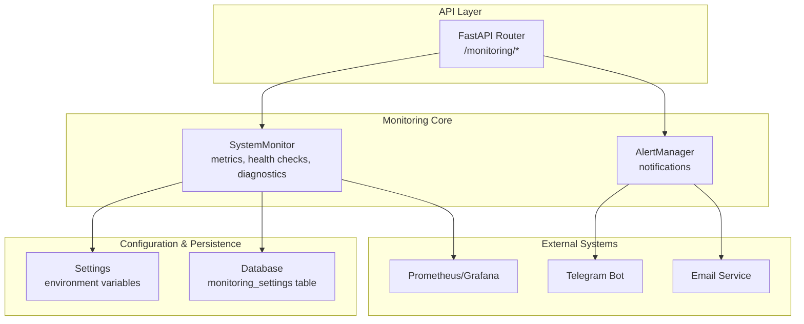
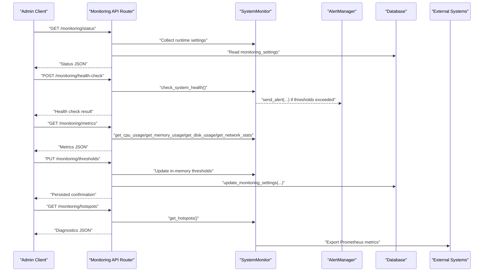
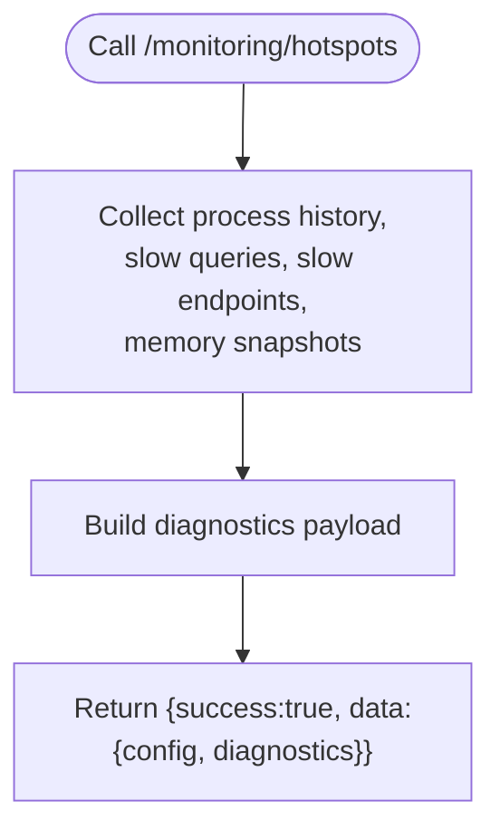
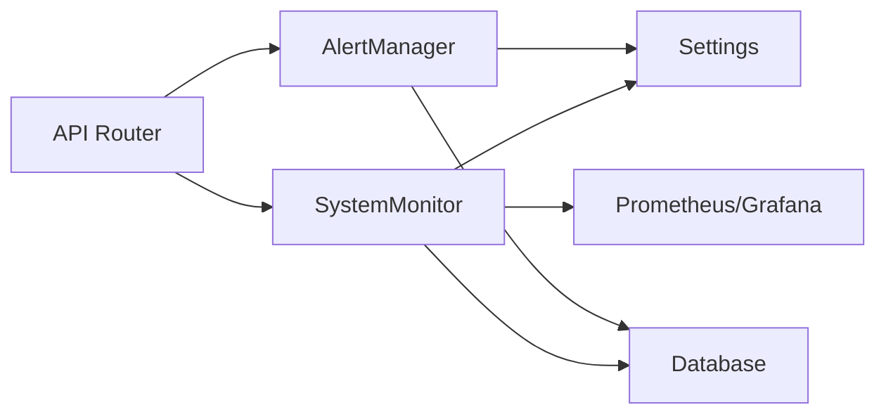

# Monitoring API

<cite>
**Referenced Files in This Document**
- [monitoring.py](file://vertex-ar/app/api/monitoring.py)
- [monitoring.py](file://vertex-ar/app/monitoring.py)
- [alerting.py](file://vertex-ar/app/alerting.py)
- [config.py](file://vertex-ar/app/config.py)
- [database.py](file://vertex-ar/app/database.py)
- [persistent-settings.md](file://docs/monitoring/persistent-settings.md)
- [implementation.md](file://docs/monitoring/implementation.md)
- [deep-diagnostics.md](file://docs/monitoring/deep-diagnostics.md)
- [docker-compose.monitoring.yml](file://docker-compose.monitoring.yml)
- [setup-monitoring.sh](file://setup-monitoring.sh)
</cite>

## Table of Contents
1. [Introduction](#introduction)
2. [Project Structure](#project-structure)
3. [Core Components](#core-components)
4. [Architecture Overview](#architecture-overview)
5. [Detailed Component Analysis](#detailed-component-analysis)
6. [Dependency Analysis](#dependency-analysis)
7. [Performance Considerations](#performance-considerations)
8. [Troubleshooting Guide](#troubleshooting-guide)
9. [Conclusion](#conclusion)
10. [Appendices](#appendices)

## Introduction
This document provides comprehensive API documentation for the Monitoring API endpoints in the Vertex AR system. It covers system monitoring and alerting operations, including retrieving monitoring status, triggering health checks, fetching system metrics (CPU, memory, disk, network), viewing alerts, updating alert thresholds, testing alert notifications, and accessing deep diagnostics for performance bottlenecks and memory leak investigations. It also explains the alerting system with configurable thresholds, multiple notification channels (email, Telegram), and the persistence of settings in the database. Security considerations such as admin-only access are addressed, along with practical examples for checking system health and updating CPU/memory thresholds.

## Project Structure
The Monitoring API is implemented as a FastAPI router under the application’s API layer and integrates with the SystemMonitor service, AlertManager, configuration, and database modules. Supporting documentation outlines persistent settings, deep diagnostics, and monitoring stack setup.

**Diagram sources**
- [monitoring.py](file://vertex-ar/app/api/monitoring.py#L1-L120)
- [monitoring.py](file://vertex-ar/app/monitoring.py#L1-L120)
- [alerting.py](file://vertex-ar/app/alerting.py#L1-L120)
- [config.py](file://vertex-ar/app/config.py#L120-L140)
- [database.py](file://vertex-ar/app/database.py#L3683-L3768)

**Section sources**
- [monitoring.py](file://vertex-ar/app/api/monitoring.py#L1-L120)
- [monitoring.py](file://vertex-ar/app/monitoring.py#L1-L120)
- [alerting.py](file://vertex-ar/app/alerting.py#L1-L120)
- [config.py](file://vertex-ar/app/config.py#L120-L140)
- [database.py](file://vertex-ar/app/database.py#L3683-L3768)

## Core Components
- Monitoring API Router: Exposes endpoints for status, health checks, metrics, alerts, thresholds, settings, diagnostics, and reporting.
- SystemMonitor: Collects CPU, memory, disk, network, and service health metrics; manages thresholds, deduplication, and deep diagnostics.
- AlertManager: Handles alert routing to Telegram and email, with cooldown and enhanced notification storage.
- Settings: Loads environment variables for thresholds, intervals, and alerting controls.
- Database: Persists monitoring settings and exposes CRUD operations for thresholds and runtime settings.

Key responsibilities:
- Retrieve monitoring status and runtime settings
- Trigger manual health checks
- Fetch current and detailed system metrics
- View recent alerts and monitoring statistics
- Update thresholds and settings (persisted)
- Test alert channels
- Access deep diagnostics (hotspots, memory snapshots)
- Weekly report generation and preview

**Section sources**
- [monitoring.py](file://vertex-ar/app/api/monitoring.py#L70-L120)
- [monitoring.py](file://vertex-ar/app/monitoring.py#L1-L120)
- [alerting.py](file://vertex-ar/app/alerting.py#L1-L120)
- [config.py](file://vertex-ar/app/config.py#L120-L140)
- [database.py](file://vertex-ar/app/database.py#L3683-L3768)

## Architecture Overview
The Monitoring API is protected by admin-only access. Requests flow through the FastAPI router to the SystemMonitor for metrics and health checks, and to AlertManager for alerting. Settings and thresholds are persisted in the database and reloaded at runtime. External systems (Prometheus, Grafana) consume metrics and dashboards.

**Diagram sources**
- [monitoring.py](file://vertex-ar/app/api/monitoring.py#L120-L200)
- [monitoring.py](file://vertex-ar/app/monitoring.py#L1388-L1463)
- [alerting.py](file://vertex-ar/app/alerting.py#L218-L270)
- [database.py](file://vertex-ar/app/database.py#L3683-L3768)
- [docker-compose.monitoring.yml](file://docker-compose.monitoring.yml#L1-L132)

**Section sources**
- [monitoring.py](file://vertex-ar/app/api/monitoring.py#L120-L200)
- [monitoring.py](file://vertex-ar/app/monitoring.py#L1388-L1463)
- [alerting.py](file://vertex-ar/app/alerting.py#L218-L270)
- [database.py](file://vertex-ar/app/database.py#L3683-L3768)
- [docker-compose.monitoring.yml](file://docker-compose.monitoring.yml#L1-L132)

## Detailed Component Analysis

### Monitoring API Endpoints
All endpoints require admin authentication. Responses follow a consistent envelope with a success flag and data payload.

- GET /monitoring/status
  - Purpose: Retrieve monitoring status, thresholds, channel configuration, recent alerts, runtime settings, persisted settings, and lock status.
  - Response envelope keys: success, data with fields: enabled, status, check_interval, thresholds, channels, recent_alerts, runtime_settings, persisted_settings, lock_status.
  - Example request: curl -H "Cookie: authToken=..." http://localhost:8000/monitoring/status

- POST /monitoring/health-check
  - Purpose: Trigger an immediate system health check.
  - Response envelope keys: success, data with health result, message.
  - Example request: curl -X POST -H "Cookie: authToken=..." http://localhost:8000/monitoring/health-check

- GET /monitoring/metrics
  - Purpose: Get current system metrics (CPU, memory, disk, network, process, services).
  - Response envelope keys: success, data with cpu, memory, disk, network, process, services, timestamp.
  - Example request: curl -H "Cookie: authToken=..." http://localhost:8000/monitoring/metrics

- GET /monitoring/trends?hours=N
  - Purpose: Get historical system trends and analysis for the specified hours (limit 1–168).
  - Response envelope keys: success, data with trends, message.
  - Example request: curl -H "Cookie: authToken=..." "http://localhost:8000/monitoring/trends?hours=24"

- GET /monitoring/detailed-metrics
  - Purpose: Get detailed system metrics with trends and summaries.
  - Response envelope keys: success, data with timestamp, system_overview, alerts_summary.
  - Example request: curl -H "Cookie: authToken=..." http://localhost:8000/monitoring/detailed-metrics

- GET /monitoring/alerts?hours=N
  - Purpose: Get recent alerts from the system for the specified hours.
  - Response envelope keys: success, data with alerts, count, hours.
  - Example request: curl -H "Cookie: authToken=..." "http://localhost:8000/monitoring/alerts?hours=24"

- POST /monitoring/test-alert
  - Purpose: Test the alert system by sending a test alert to configured channels.
  - Response envelope keys: success, channels_tested, message.
  - Example request: curl -X POST -H "Cookie: authToken=..." http://localhost:8000/monitoring/test-alert

- GET /monitoring/stats
  - Purpose: Get comprehensive monitoring statistics (database usage, usage stats, alerts summary, system info).
  - Response envelope keys: success, data with database, usage, alerts, system.
  - Example request: curl -H "Cookie: authToken=..." http://localhost:8000/monitoring/stats

- GET /monitoring/settings
  - Purpose: Get current alert settings (channel toggles, thresholds, flags).
  - Response envelope keys: success, fields email_enabled, telegram_enabled, cpu_threshold, memory_threshold, disk_threshold, response_threshold, system_errors, performance, storage, backup.
  - Example request: curl -H "Cookie: authToken=..." http://localhost:8000/monitoring/settings

- PUT /monitoring/settings
  - Purpose: Update alert settings and persist to database.
  - Request body fields: email_enabled, telegram_enabled, cpu_threshold, memory_threshold, disk_threshold, response_threshold, system_errors, performance, storage, backup.
  - Response envelope keys: success, message, settings, persisted.
  - Example request: curl -X PUT -H "Cookie: authToken=..." -H "Content-Type: application/json" -d '{"cpu_threshold":85,"memory_threshold":90,"disk_threshold":95}' http://localhost:8000/monitoring/settings

- PUT /monitoring/thresholds
  - Purpose: Update alert thresholds and persist to database.
  - Request body fields: cpu_threshold, memory_threshold, disk_threshold (values 0–100).
  - Response envelope keys: success, message, current_thresholds, persisted.
  - Example request: curl -X PUT -H "Cookie: authToken=..." -H "Content-Type: application/json" -d '{"cpu_threshold":85,"memory_threshold":90,"disk_threshold":95}' http://localhost:8000/monitoring/thresholds

- GET /monitoring/email-stats
  - Purpose: Get email service statistics (queue, performance, retry histogram, recent errors, Prometheus metrics snapshot).
  - Response envelope keys: success, data with service, queue, performance, retry_histogram, errors, prometheus_metrics.
  - Example request: curl -H "Cookie: authToken=..." http://localhost:8000/monitoring/email-stats

- GET /monitoring/hotspots
  - Purpose: Get deep resource diagnostics (process history, slow queries, slow endpoints, memory snapshots).
  - Response envelope keys: success, data with config, diagnostics.
  - Example request: curl -H "Cookie: authToken=..." http://localhost:8000/monitoring/hotspots

- GET /monitoring/memory-leaks
  - Purpose: Get tracemalloc memory snapshots for leak detection (requires tracemalloc enabled).
  - Response envelope keys: success, data with enabled, current_memory_mb, threshold_mb, snapshot_count, snapshots, latest_snapshot.
  - Example request: curl -H "Cookie: authToken=..." http://localhost:8000/monitoring/memory-leaks

- POST /monitoring/memory-snapshot
  - Purpose: Manually trigger a memory snapshot (bypasses threshold).
  - Response envelope keys: success, data with snapshot, message.
  - Example request: curl -X POST -H "Cookie: authToken=..." http://localhost:8000/monitoring/memory-snapshot

- POST /monitoring/send-report
  - Purpose: Send the weekly report immediately (background task).
  - Response envelope keys: success, message.
  - Example request: curl -X POST -H "Cookie: authToken=..." http://localhost:8000/monitoring/send-report

- GET /monitoring/report-preview
  - Purpose: Get a preview of the weekly report without sending it.
  - Response envelope keys: success, data with report, generated_at, schedule.
  - Example request: curl -H "Cookie: authToken=..." http://localhost:8000/monitoring/report-preview

Security:
- All endpoints require admin authentication via cookie-based sessions.

**Section sources**
- [monitoring.py](file://vertex-ar/app/api/monitoring.py#L70-L120)
- [monitoring.py](file://vertex-ar/app/api/monitoring.py#L120-L165)
- [monitoring.py](file://vertex-ar/app/api/monitoring.py#L166-L200)
- [monitoring.py](file://vertex-ar/app/api/monitoring.py#L268-L365)
- [monitoring.py](file://vertex-ar/app/api/monitoring.py#L366-L474)
- [monitoring.py](file://vertex-ar/app/api/monitoring.py#L475-L560)
- [monitoring.py](file://vertex-ar/app/api/monitoring.py#L561-L776)

### Monitoring Data Models and Schemas
- ThresholdUpdateRequest: cpu_threshold, memory_threshold, disk_threshold (float, 0–100)
- AlertSettingsRequest: email_enabled, telegram_enabled, cpu_threshold, memory_threshold, disk_threshold, response_threshold, system_errors, performance, storage, backup
- MonitoringStatusResponse: enabled, check_interval, last_check, thresholds, alert_channels

Example request bodies:
- Threshold update: {"cpu_threshold":85.0,"memory_threshold":90.0,"disk_threshold":95.0}
- Settings update: {"cpu_threshold":85,"memory_threshold":90,"disk_threshold":95,"response_threshold":3000}

Response envelopes:
- All endpoints return {success: true, data: {...}, message: "..."} on success; HTTP 4xx/5xx on error.

**Section sources**
- [monitoring.py](file://vertex-ar/app/api/monitoring.py#L35-L120)
- [monitoring.py](file://vertex-ar/app/api/monitoring.py#L366-L474)

### System Monitoring and Metrics
SystemMonitor collects:
- CPU: percent, load average, per-core usage, top processes
- Memory: virtual and swap usage, top memory processes
- Disk: storage usage, partitions, I/O stats, temperature
- Network: total counters, per-interface stats, connections
- Process: current process CPU/RSS, threads, uptime
- Services: database, storage, web server, external services, recent errors

These are exposed via GET /monitoring/metrics and GET /monitoring/detailed-metrics.

**Section sources**
- [monitoring.py](file://vertex-ar/app/monitoring.py#L218-L484)
- [monitoring.py](file://vertex-ar/app/monitoring.py#L485-L622)
- [monitoring.py](file://vertex-ar/app/monitoring.py#L623-L638)
- [monitoring.py](file://vertex-ar/app/monitoring.py#L639-L718)
- [monitoring.py](file://vertex-ar/app/monitoring.py#L719-L782)
- [monitoring.py](file://vertex-ar/app/monitoring.py#L783-L882)

### Alerting System and Persistence
- AlertManager supports Telegram and email channels, with cooldown and enhanced notification routing.
- Thresholds and runtime settings are persisted in the monitoring_settings table and reloaded at startup and via API.
- Concurrency guards prevent overlapping health checks; cooldown and max runtime are enforced.

Endpoints for alerting:
- POST /monitoring/test-alert
- PUT /monitoring/settings
- PUT /monitoring/thresholds

**Section sources**
- [alerting.py](file://vertex-ar/app/alerting.py#L1-L120)
- [alerting.py](file://vertex-ar/app/alerting.py#L218-L270)
- [database.py](file://vertex-ar/app/database.py#L3683-L3768)
- [persistent-settings.md](file://docs/monitoring/persistent-settings.md#L1-L120)

### Deep Diagnostics and Memory Leak Investigation
- Hotspots endpoint aggregates process history, slow queries, slow endpoints, and memory snapshots.
- Memory leak investigation uses tracemalloc snapshots with configurable thresholds and top-N allocations.
- Prometheus metrics are exported for external monitoring.

**Diagram sources**
- [monitoring.py](file://vertex-ar/app/api/monitoring.py#L616-L661)
- [monitoring.py](file://vertex-ar/app/monitoring.py#L783-L882)

**Section sources**
- [monitoring.py](file://vertex-ar/app/api/monitoring.py#L616-L661)
- [monitoring.py](file://vertex-ar/app/monitoring.py#L719-L782)
- [deep-diagnostics.md](file://docs/monitoring/deep-diagnostics.md#L1-L120)

### Example Workflows

- Check system health
  - POST /monitoring/health-check
  - Response includes success flag and health result.

- Update CPU and memory thresholds
  - PUT /monitoring/thresholds with JSON body containing cpu_threshold and memory_threshold (0–100).
  - Response confirms persisted updates and current thresholds.

- Test alert channels
  - POST /monitoring/test-alert to validate Telegram and email delivery.

- Investigate performance bottlenecks
  - GET /monitoring/hotspots to retrieve process trends, slow queries, slow endpoints.
  - Use Prometheus metrics for long-term trend analysis.

- Memory leak investigation
  - Enable tracemalloc via environment variables and restart.
  - POST /monitoring/memory-snapshot to capture current state.
  - GET /monitoring/memory-leaks to review snapshots and top allocations.

**Section sources**
- [monitoring.py](file://vertex-ar/app/api/monitoring.py#L120-L200)
- [monitoring.py](file://vertex-ar/app/api/monitoring.py#L366-L474)
- [monitoring.py](file://vertex-ar/app/api/monitoring.py#L616-L776)
- [deep-diagnostics.md](file://docs/monitoring/deep-diagnostics.md#L120-L210)

## Dependency Analysis
The Monitoring API depends on SystemMonitor for metrics and health checks, AlertManager for notifications, Settings for thresholds and intervals, and Database for persisted settings. External systems include Prometheus/Grafana for metrics and dashboards.

**Diagram sources**
- [monitoring.py](file://vertex-ar/app/api/monitoring.py#L1-L120)
- [monitoring.py](file://vertex-ar/app/monitoring.py#L1-L120)
- [alerting.py](file://vertex-ar/app/alerting.py#L1-L120)
- [config.py](file://vertex-ar/app/config.py#L120-L140)
- [database.py](file://vertex-ar/app/database.py#L3683-L3768)
- [docker-compose.monitoring.yml](file://docker-compose.monitoring.yml#L1-L132)

**Section sources**
- [monitoring.py](file://vertex-ar/app/api/monitoring.py#L1-L120)
- [monitoring.py](file://vertex-ar/app/monitoring.py#L1-L120)
- [alerting.py](file://vertex-ar/app/alerting.py#L1-L120)
- [config.py](file://vertex-ar/app/config.py#L120-L140)
- [database.py](file://vertex-ar/app/database.py#L3683-L3768)
- [docker-compose.monitoring.yml](file://docker-compose.monitoring.yml#L1-L132)

## Performance Considerations
- Monitoring overhead is minimal (<1% CPU), with light-weight data structures and ring buffers for diagnostics.
- Concurrency guards prevent overlapping checks; cooldown and max runtime mitigate resource exhaustion.
- Prometheus metrics are exported for scalable external monitoring.
- Tracemalloc adds ~10% overhead; use only during debugging.

[No sources needed since this section provides general guidance]

## Troubleshooting Guide
Common issues and resolutions:
- Settings not persisting: Verify database migration and seed; confirm persisted settings via /monitoring/status.
- Health checks overlapping: Increase max runtime or cooldown; review lock status.
- Too many alerts: Increase consecutive failures threshold, dedup window, or alert recovery minutes; adjust thresholds.
- No alerts when expected: Verify ALERTING_ENABLED; lower thresholds; test alert system.

Operational checks:
- Use /monitoring/status to inspect runtime vs persisted settings and lock status.
- Use /monitoring/alerts?hours=1 to review recent alerts.
- Use /monitoring/metrics to validate current system state.

**Section sources**
- [persistent-settings.md](file://docs/monitoring/persistent-settings.md#L379-L443)
- [monitoring.py](file://vertex-ar/app/api/monitoring.py#L70-L120)

## Conclusion
The Monitoring API provides a comprehensive, admin-protected interface for system observability, alerting, and diagnostics. It integrates tightly with SystemMonitor and AlertManager, persists settings in the database, and exposes deep diagnostics for performance and memory analysis. With admin-only access and robust concurrency controls, it ensures reliable operation while enabling proactive issue detection and resolution.

[No sources needed since this section summarizes without analyzing specific files]

## Appendices

### Security Considerations
- Admin-only access: All endpoints require authenticated admin sessions.
- Credential storage: SMTP credentials are managed securely via notification configuration; environment-based credentials are deprecated and flagged.
- Rate limiting and deduplication: Prevents alert spam and protects system resources.

**Section sources**
- [config.py](file://vertex-ar/app/config.py#L80-L110)
- [alerting.py](file://vertex-ar/app/alerting.py#L117-L183)
- [persistent-settings.md](file://docs/monitoring/persistent-settings.md#L379-L443)

### Monitoring Stack Setup
- Use the provided setup script to provision Prometheus, Grafana, AlertManager, Node Exporter, and cAdvisor.
- Configure environment variables for alerting and thresholds.
- Access dashboards at Grafana and Prometheus endpoints.

**Section sources**
- [setup-monitoring.sh](file://setup-monitoring.sh#L1-L120)
- [docker-compose.monitoring.yml](file://docker-compose.monitoring.yml#L1-L132)