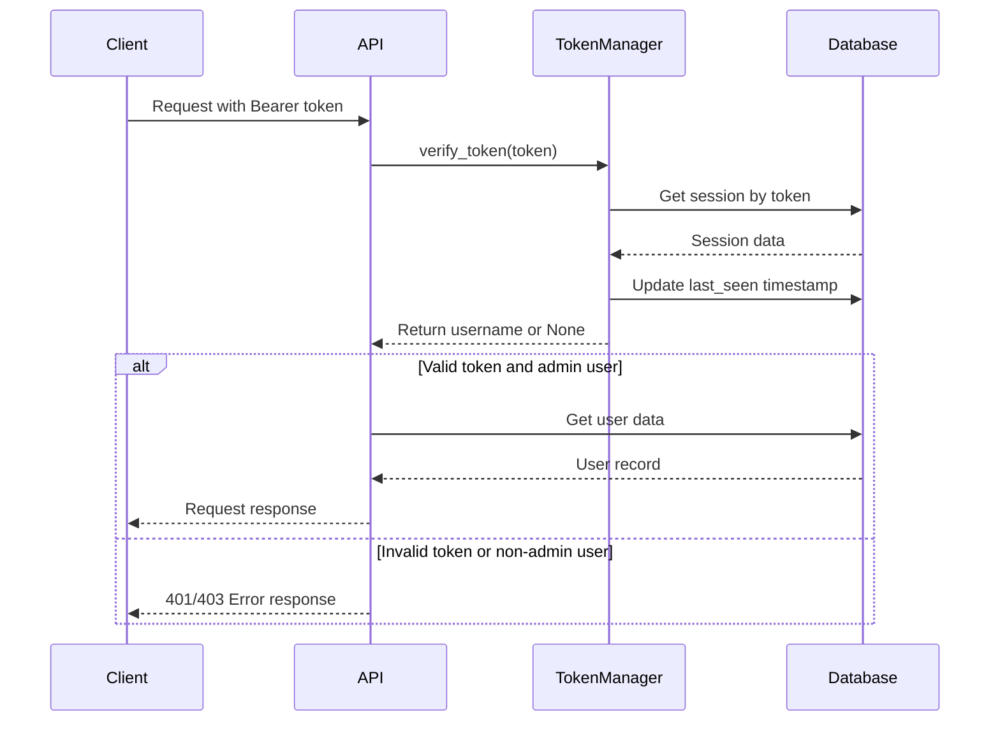
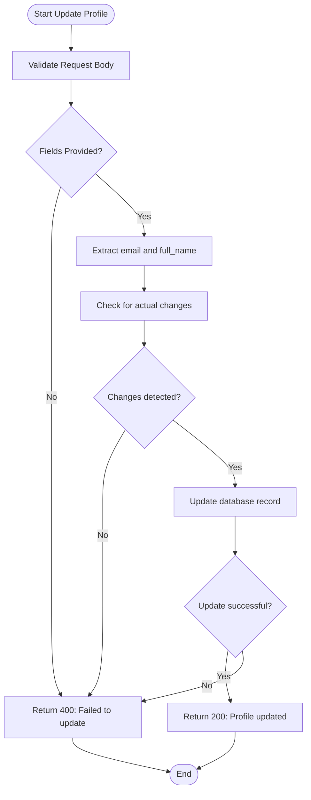
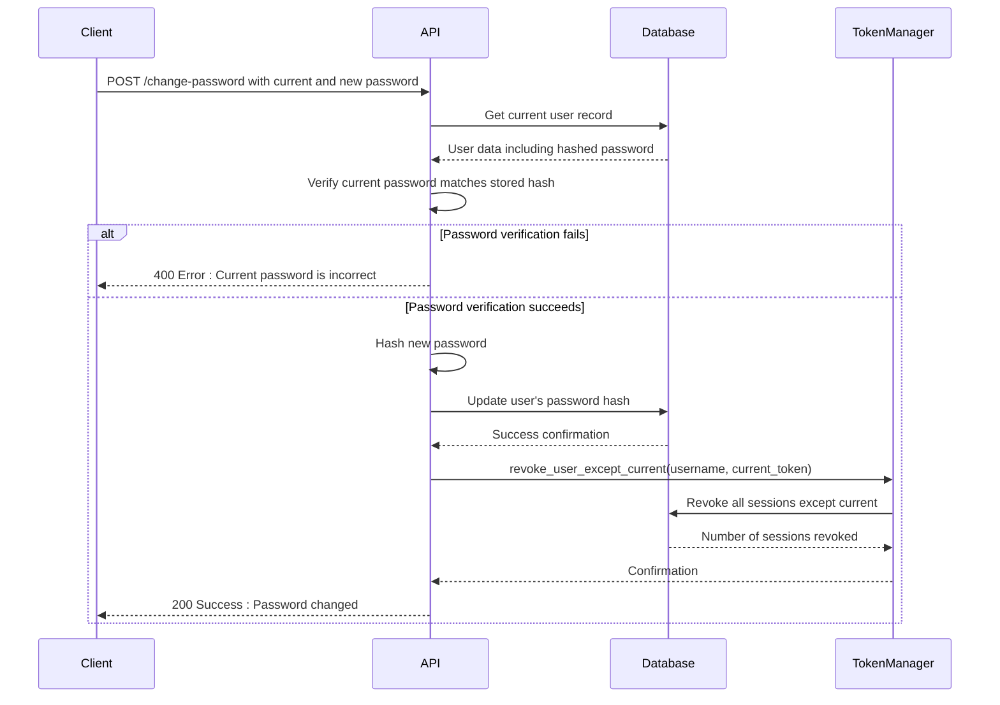
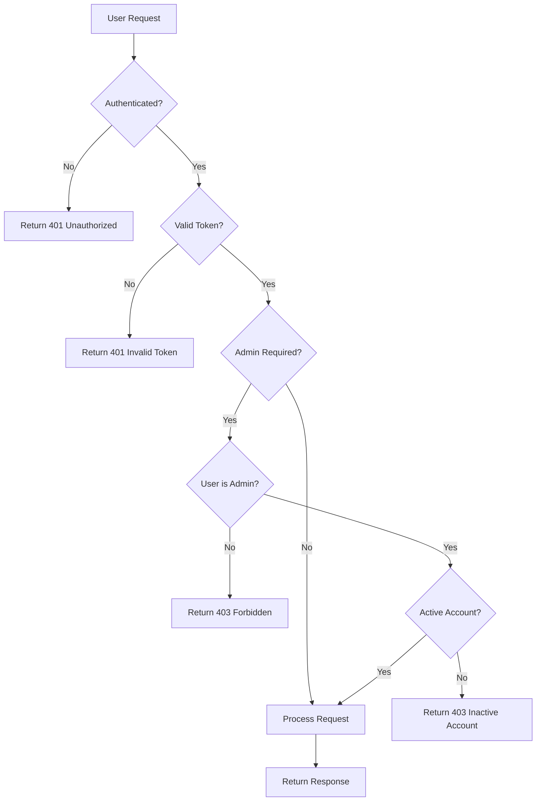

# User Management API

<cite>
**Referenced Files in This Document**   
- [users.py](file://vertex-ar/app/api/users.py)
- [models.py](file://vertex-ar/app/models.py)
- [database.py](file://vertex-ar/app/database.py)
- [auth.py](file://vertex-ar/app/auth.py)
- [USER_MANAGEMENT.md](file://docs/guides/USER_MANAGEMENT.md)
</cite>

## Table of Contents
1. [Introduction](#introduction)
2. [Authentication Requirements](#authentication-requirements)
3. [User Profile Management](#user-profile-management)
4. [Password Management](#password-management)
5. [Request/Response Schemas](#requestresponse-schemas)
6. [Security Considerations](#security-considerations)
7. [Error Handling](#error-handling)

## Introduction
The User Management API provides endpoints for managing user profiles and authentication within the Vertex AR platform. This API is designed for administrative use, with all endpoints requiring admin authentication. The system implements role-based access control, soft-delete functionality for user deactivation, and comprehensive security measures including token revocation on password changes.

The API supports core user management operations including profile retrieval and updates, password changes with current password verification, and administrative functions for user management. All endpoints follow RESTful principles and use JSON for request and response payloads.

**Section sources**
- [USER_MANAGEMENT.md](file://docs/guides/USER_MANAGEMENT.md#L1-L454)

## Authentication Requirements
All User Management API endpoints require admin authentication using Bearer tokens. The authentication system implements role-based access control, ensuring that only users with administrative privileges can access these endpoints.

Authentication is performed by including a Bearer token in the Authorization header of each request:
```
Authorization: Bearer <token>
```

The system validates the token and checks the user's admin status before processing any request. Users are considered admins if their `is_admin` field is set to `1` in the database. The authentication process also verifies that the user account is active (`is_active = 1`).

Token management is handled by the `TokenManager` class, which issues, verifies, and revokes tokens. Tokens are stored in the database to ensure compatibility across Uvicorn workers and support session management features like forced re-authentication.



**Diagram sources**
- [users.py](file://vertex-ar/app/api/users.py#L39-L58)
- [auth.py](file://vertex-ar/app/auth.py#L48-L63)
- [database.py](file://vertex-ar/app/database.py#L1037-L1048)

**Section sources**
- [users.py](file://vertex-ar/app/api/users.py#L61-L67)
- [auth.py](file://vertex-ar/app/auth.py#L48-L63)

## User Profile Management
The User Management API provides endpoints for retrieving and updating user profiles. These operations are restricted to the authenticated user's own profile, with admin users having additional capabilities for managing other users' accounts.

### GET /profile
Retrieves the current user's profile information.

**HTTP Method**: GET  
**URL Pattern**: `/profile`  
**Authentication**: Required (Bearer token)  
**Admin Only**: No (user can access own profile)

**Response Schema**:
```json
{
  "username": "string",
  "email": "string",
  "full_name": "string",
  "created_at": "string (ISO 8601)",
  "last_login": "string (ISO 8601)"
}
```

**Example Response (200 OK)**:
```json
{
  "username": "admin",
  "email": "admin@example.com",
  "full_name": "Administrator",
  "created_at": "2024-01-15T10:30:00Z",
  "last_login": "2024-01-15T14:45:00Z"
}
```

### PUT /profile
Updates the current user's profile information. Users can only update their email and full name.

**HTTP Method**: PUT  
**URL Pattern**: `/profile`  
**Authentication**: Required (Bearer token)  
**Admin Only**: No (user can update own profile)

**Request Body Schema**:
```json
{
  "email": "string (optional)",
  "full_name": "string (optional)"
}
```

**Example Request**:
```json
{
  "email": "newemail@example.com",
  "full_name": "Updated Name"
}
```

**Response Schema**:
```json
{
  "message": "string"
}
```

**Example Response (200 OK)**:
```json
{
  "message": "Profile updated successfully"
}
```

The system validates input data, ensuring email addresses are properly formatted and names meet validation criteria. Updates are applied only if there are changes to the fields, and the database is updated accordingly.



**Diagram sources**
- [users.py](file://vertex-ar/app/api/users.py#L70-L122)
- [models.py](file://vertex-ar/app/models.py#L32-L49)

**Section sources**
- [users.py](file://vertex-ar/app/api/users.py#L70-L122)
- [models.py](file://vertex-ar/app/models.py#L32-L57)

## Password Management
The User Management API includes functionality for changing user passwords with security measures to prevent unauthorized changes and ensure account security.

### POST /change-password
Changes the current user's password. This endpoint requires verification of the current password before allowing a change to the new password.

**HTTP Method**: POST  
**URL Pattern**: `/change-password`  
**Authentication**: Required (Bearer token)  
**Admin Only**: No (user can change own password)

**Request Body Schema**:
```json
{
  "current_password": "string",
  "new_password": "string (8-256 characters)"
}
```

**Example Request**:
```json
{
  "current_password": "oldpassword123",
  "new_password": "newsecurepassword456"
}
```

**Response Schema**:
```json
{
  "message": "string"
}
```

**Example Response (200 OK)**:
```json
{
  "message": "Password changed successfully"
}
```

When a password change is successful, the system automatically revokes all other active sessions for the user, forcing re-authentication on other devices. This security measure helps prevent unauthorized access if a user's credentials have been compromised on another device.



**Diagram sources**
- [users.py](file://vertex-ar/app/api/users.py#L124-L166)
- [auth.py](file://vertex-ar/app/auth.py#L84-L93)
- [database.py](file://vertex-ar/app/database.py#L1088-L1096)

**Section sources**
- [users.py](file://vertex-ar/app/api/users.py#L124-L166)
- [models.py](file://vertex-ar/app/models.py#L59-L67)

## Request/Response Schemas
This section defines the complete schema definitions for all request and response payloads used in the User Management API.

### UserUpdate (Request)
Schema for updating user profile information.

```json
{
  "email": {
    "type": "string",
    "format": "email",
    "maxLength": 255,
    "nullable": true
  },
  "full_name": {
    "type": "string",
    "maxLength": 150,
    "nullable": true
  }
}
```

**Validation Rules**:
- Email must be a valid email format if provided
- Full name must contain only valid characters (letters, spaces, hyphens, apostrophes)
- Maximum length constraints apply as defined

### UserProfile (Response)
Schema for user profile responses.

```json
{
  "username": {
    "type": "string"
  },
  "email": {
    "type": "string",
    "format": "email",
    "nullable": true
  },
  "full_name": {
    "type": "string",
    "nullable": true
  },
  "created_at": {
    "type": "string",
    "format": "date-time"
  },
  "last_login": {
    "type": "string",
    "format": "date-time",
    "nullable": true
  }
}
```

### PasswordChange (Request)
Schema for password change requests.

```json
{
  "current_password": {
    "type": "string",
    "minLength": 1
  },
  "new_password": {
    "type": "string",
    "minLength": 8,
    "maxLength": 256
  }
}
```

**Validation Rules**:
- New password must be at least 8 characters long
- New password must not exceed 256 characters
- New password must meet complexity requirements (uppercase, lowercase, numbers, special characters)

### MessageResponse (Response)
Standard response schema for success messages.

```json
{
  "message": {
    "type": "string"
  }
}
```

**Section sources**
- [models.py](file://vertex-ar/app/models.py#L32-L67)

## Security Considerations
The User Management API implements several security measures to protect user accounts and prevent unauthorized access.

### Password Security
- **Password Hashing**: Passwords are hashed using SHA-256 before storage in the database
- **Password Complexity**: New passwords must meet minimum complexity requirements
- **Current Password Verification**: Password changes require verification of the current password
- **Recommendation**: Upgrade to bcrypt for production environments to provide better protection against brute force attacks

### Session Management
- **Token Revocation on Password Change**: When a user changes their password, all other active sessions are automatically revoked, forcing re-authentication on other devices
- **Session Timeouts**: Tokens have a configurable expiration period (default 30 minutes)
- **Database-Backed Sessions**: Session data is stored in the database to ensure consistency across Uvicorn workers

### Input Validation
All input data is validated before processing:
- Email addresses are validated for proper format
- Usernames and names are validated for allowed characters
- Passwords are checked for minimum length and complexity
- Request payloads are validated against defined schemas

### Rate Limiting
The API implements rate limiting to prevent brute force attacks:
- Authentication endpoints are limited to 5 requests per minute
- Global rate limit of 100 requests per minute
- Configurable via environment variables

### Role-Based Access Control
- All endpoints require authentication
- Admin verification is performed for admin-only endpoints
- Users can only modify their own profile information
- Admin users have additional privileges for managing other users



**Diagram sources**
- [users.py](file://vertex-ar/app/api/users.py#L61-L67)
- [auth.py](file://vertex-ar/app/auth.py#L105-L153)

**Section sources**
- [USER_MANAGEMENT.md](file://docs/guides/USER_MANAGEMENT.md#L290-L311)
- [auth.py](file://vertex-ar/app/auth.py#L105-L153)

## Error Handling
The User Management API returns standardized error responses for various error conditions. All error responses include an appropriate HTTP status code and a JSON body with a detail message.

### Common Error Responses

**401 Unauthorized**
Returned when authentication is required but not provided or invalid.

```json
{
  "detail": "Not authenticated"
}
```

**401 Unauthorized (Invalid Token)**
Returned when the provided token is expired or invalid.

```json
{
  "detail": "Token expired or invalid"
}
```

**403 Forbidden**
Returned when the authenticated user does not have sufficient privileges.

```json
{
  "detail": "Admin access required"
}
```

**400 Bad Request**
Returned for various validation errors.

```json
{
  "detail": "Current password is incorrect"
}
```

```json
{
  "detail": "No fields to update"
}
```

```json
{
  "detail": "Failed to update profile"
}
```

**404 Not Found**
Returned when a requested resource is not found.

```json
{
  "detail": "User not found"
}
```

The system logs all authentication attempts and errors for monitoring and security auditing purposes. Sensitive information such as passwords is never included in log messages.

**Section sources**
- [users.py](file://vertex-ar/app/api/users.py#L43-L57)
- [users.py](file://vertex-ar/app/api/users.py#L78-L80)
- [users.py](file://vertex-ar/app/api/users.py#L116-L117)
- [users.py](file://vertex-ar/app/api/users.py#L143-L144)