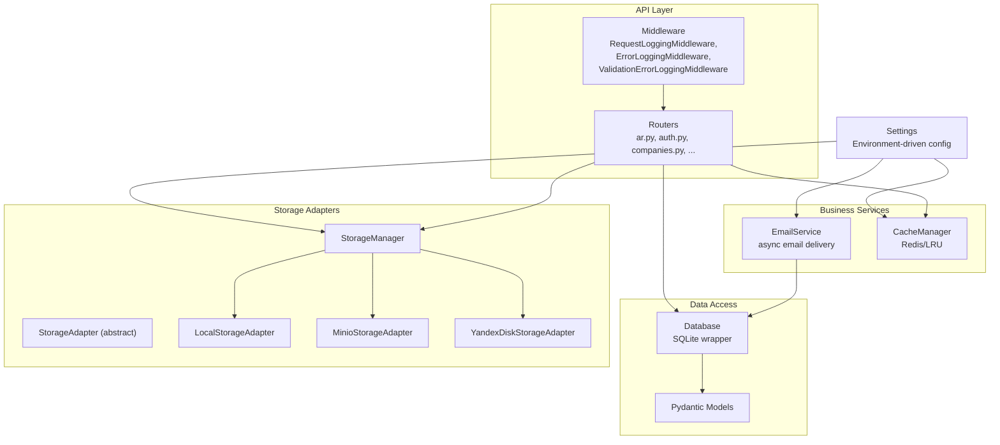
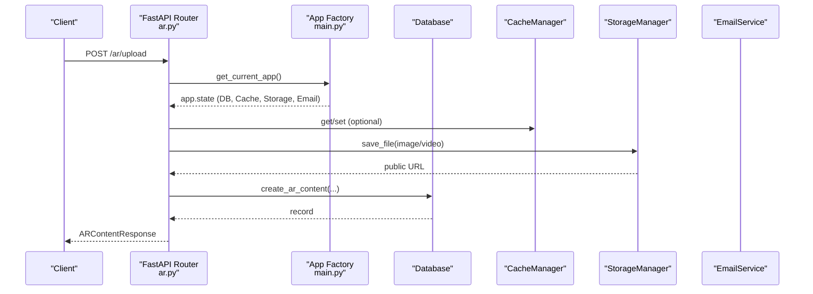
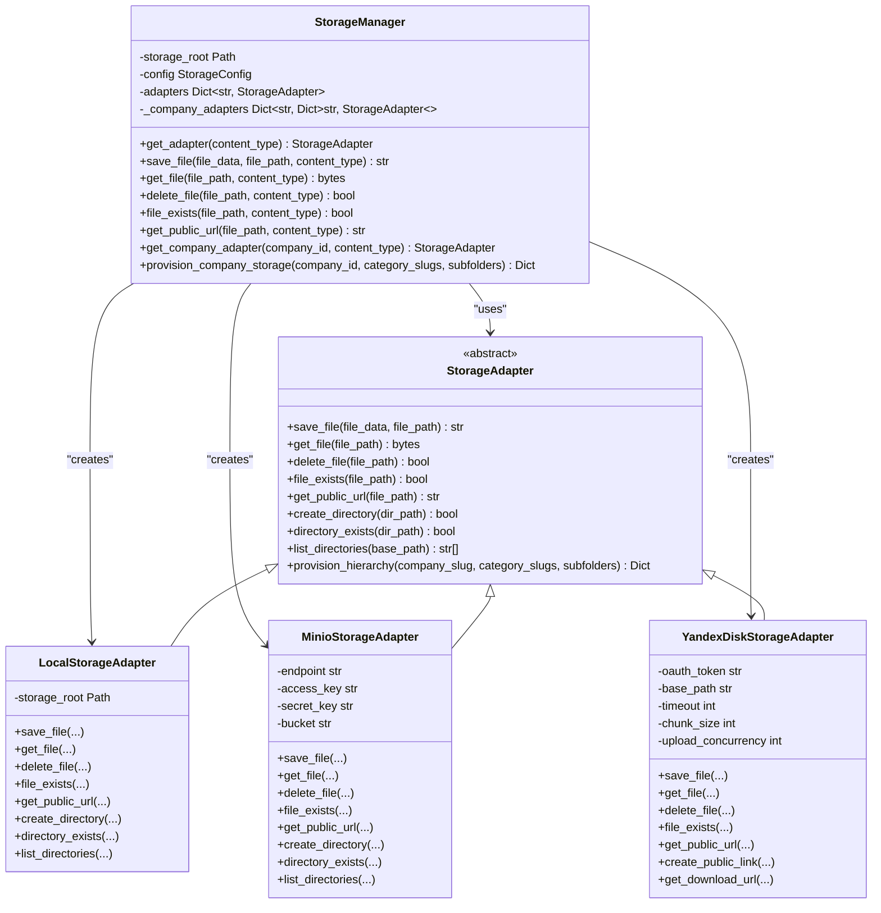
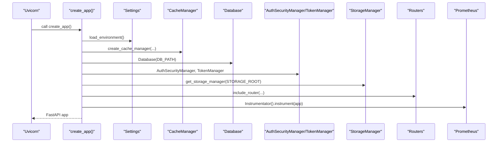
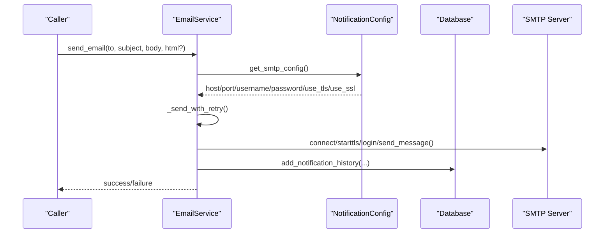
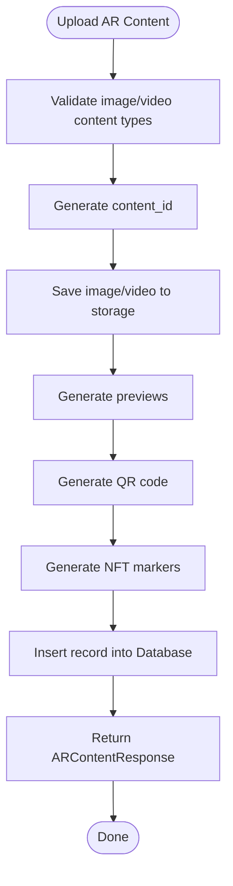
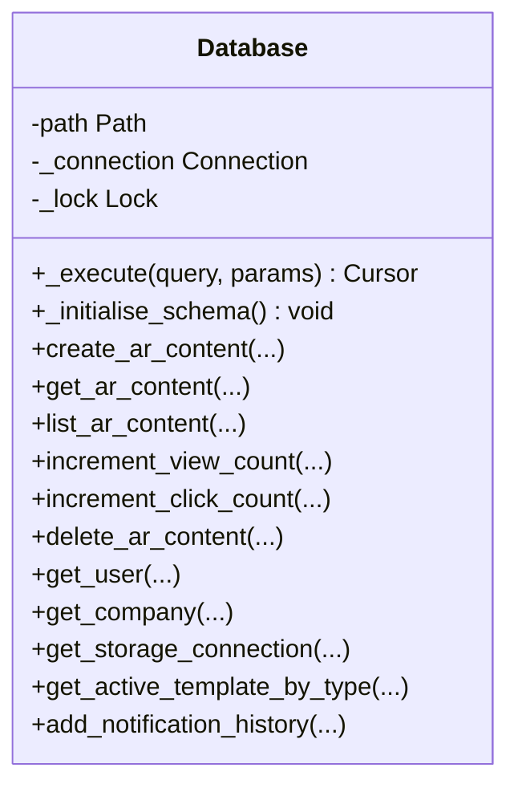
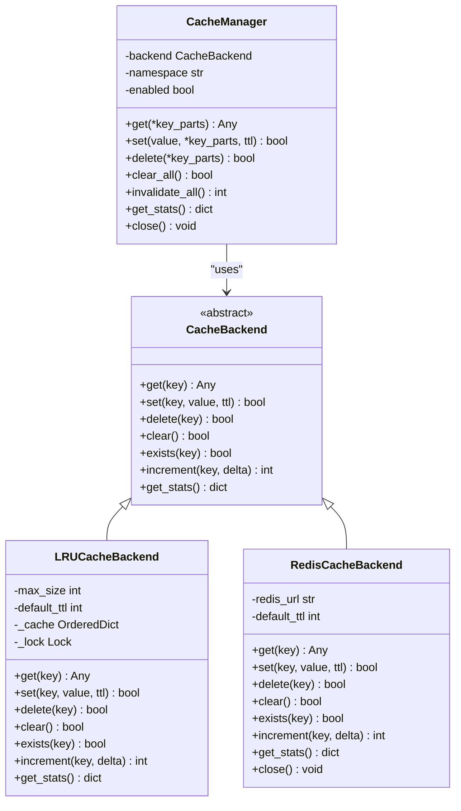
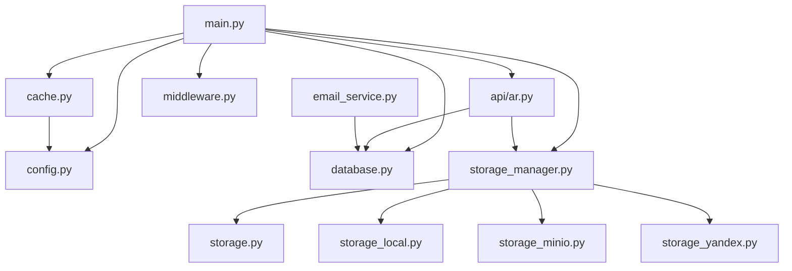

# Architecture

<cite>
**Referenced Files in This Document**
- [main.py](file://vertex-ar/app/main.py)
- [config.py](file://vertex-ar/app/config.py)
- [storage.py](file://vertex-ar/app/storage.py)
- [storage_manager.py](file://vertex-ar/storage_manager.py)
- [storage_local.py](file://vertex-ar/app/storage_local.py)
- [storage_minio.py](file://vertex-ar/app/storage_minio.py)
- [storage_yandex.py](file://vertex-ar/app/storage_yandex.py)
- [models.py](file://vertex-ar/app/models.py)
- [database.py](file://vertex-ar/app/database.py)
- [cache.py](file://vertex-ar/app/cache.py)
- [middleware.py](file://vertex-ar/app/middleware.py)
- [ar.py](file://vertex-ar/app/api/ar.py)
- [email_service.py](file://vertex-ar/app/services/email_service.py)
</cite>

## Table of Contents
1. [Introduction](#introduction)
2. [Project Structure](#project-structure)
3. [Core Components](#core-components)
4. [Architecture Overview](#architecture-overview)
5. [Detailed Component Analysis](#detailed-component-analysis)
6. [Dependency Analysis](#dependency-analysis)
7. [Performance Considerations](#performance-considerations)
8. [Troubleshooting Guide](#troubleshooting-guide)
9. [Conclusion](#conclusion)
10. [Appendices](#appendices)

## Introduction
This document describes the AR backend system architecture as a modular, domain-driven service with clear separation of concerns. It covers the layered architecture (API, business services, data access, storage adapters), key architectural patterns (Adapter Pattern for storage backends, Dependency Injection via config objects, Singleton pattern for shared services, Asynchronous Processing for background tasks), and integration patterns. It also explains critical design decisions, trade-offs (e.g., synchronous vs asynchronous operations), scalability considerations, and operational aspects such as security, monitoring, and disaster recovery.

## Project Structure
The system is organized around a FastAPI application factory that composes configuration, middleware, services, and routers. Storage is abstracted behind an adapter interface with pluggable implementations for local, MinIO, and Yandex Disk. Business logic is encapsulated in API modules and services, while persistence is handled by SQLite with a thin wrapper. Caching is abstracted with Redis or in-memory LRU fallback. Cross-cutting concerns include logging, rate limiting, monitoring, and background tasks.

**Diagram sources**
- [main.py](file://vertex-ar/app/main.py#L35-L184)
- [config.py](file://vertex-ar/app/config.py#L9-L244)
- [storage.py](file://vertex-ar/app/storage.py#L9-L175)
- [storage_manager.py](file://vertex-ar/storage_manager.py#L19-L110)
- [storage_local.py](file://vertex-ar/app/storage_local.py#L12-L162)
- [storage_minio.py](file://vertex-ar/app/storage_minio.py#L10-L237)
- [storage_yandex.py](file://vertex-ar/app/storage_yandex.py#L84-L145)
- [models.py](file://vertex-ar/app/models.py#L1-L120)
- [database.py](file://vertex-ar/app/database.py#L34-L120)
- [cache.py](file://vertex-ar/app/cache.py#L313-L461)
- [middleware.py](file://vertex-ar/app/middleware.py#L18-L156)
- [ar.py](file://vertex-ar/app/api/ar.py#L1-L241)
- [email_service.py](file://vertex-ar/app/services/email_service.py#L28-L120)

**Section sources**
- [main.py](file://vertex-ar/app/main.py#L35-L184)
- [config.py](file://vertex-ar/app/config.py#L9-L244)

## Core Components
- Application Factory and Composition: The FastAPI application is created and configured centrally, wiring middleware, static mounts, Prometheus metrics, rate limiting, cache, database, auth, storage manager, templates, and all API routers.
- Configuration Management: A Settings class loads environment variables and provides typed configuration for storage, caching, monitoring, alerting, email, and runtime tuning.
- Storage Abstraction: An abstract StorageAdapter defines the contract for saving, retrieving, deleting, and checking files and directories, with implementations for local, MinIO, and Yandex Disk.
- Storage Manager: Orchestrates adapter selection by content type and company, provisions storage hierarchies, and exposes unified APIs for file operations.
- Data Access: A Database wrapper encapsulates SQLite operations, schema initialization, migrations, and CRUD methods for AR content, companies, projects, folders, clients, and related entities.
- Caching: A CacheManager abstracts Redis or in-memory LRU caching with namespacing, TTL, and version-based invalidation.
- Email Service: An async EmailService handles SMTP delivery with retries, template rendering, and notification history logging.
- Middleware: Request/response logging, error logging, and validation error logging are implemented as middleware for observability and diagnostics.
- API Layer: Feature-focused routers (AR content, auth, companies, storage, notifications, etc.) depend on shared services and models.

**Section sources**
- [main.py](file://vertex-ar/app/main.py#L35-L184)
- [config.py](file://vertex-ar/app/config.py#L9-L244)
- [storage.py](file://vertex-ar/app/storage.py#L9-L175)
- [storage_manager.py](file://vertex-ar/storage_manager.py#L19-L110)
- [database.py](file://vertex-ar/app/database.py#L34-L120)
- [cache.py](file://vertex-ar/app/cache.py#L313-L461)
- [email_service.py](file://vertex-ar/app/services/email_service.py#L28-L120)
- [middleware.py](file://vertex-ar/app/middleware.py#L18-L156)
- [ar.py](file://vertex-ar/app/api/ar.py#L1-L241)

## Architecture Overview
The system follows a layered architecture:
- API Layer: FastAPI routers and endpoints, with dependency injection via app.state and per-route dependencies.
- Business Services: Shared services (email, cache) are initialized during app startup and exposed via app.state.
- Data Access: SQLite-backed Database class with schema initialization and migrations.
- Storage Adapters: Pluggable storage implementations behind a common interface.

Key architectural patterns:
- Adapter Pattern: StorageAdapter abstracts storage backends; StorageManager selects and manages adapters.
- Dependency Injection: Configuration via Settings and service initialization in app factory; services injected via app.state.
- Singleton Pattern: Global instances for EmailService and StorageManager are created once and reused.
- Asynchronous Processing: Background tasks (monitoring, schedulers, email queue) run asynchronously on startup; EmailService uses async SMTP.

**Diagram sources**
- [ar.py](file://vertex-ar/app/api/ar.py#L42-L158)
- [main.py](file://vertex-ar/app/main.py#L122-L153)
- [cache.py](file://vertex-ar/app/cache.py#L313-L461)
- [storage_manager.py](file://vertex-ar/storage_manager.py#L110-L175)
- [database.py](file://vertex-ar/app/database.py#L34-L120)

## Detailed Component Analysis

### Storage Layer
The storage layer is built around an abstract adapter interface and concrete implementations. The StorageManager orchestrates adapter selection and provides unified APIs for file operations and directory provisioning.

**Diagram sources**
- [storage.py](file://vertex-ar/app/storage.py#L9-L175)
- [storage_manager.py](file://vertex-ar/storage_manager.py#L19-L110)
- [storage_local.py](file://vertex-ar/app/storage_local.py#L12-L162)
- [storage_minio.py](file://vertex-ar/app/storage_minio.py#L10-L237)
- [storage_yandex.py](file://vertex-ar/app/storage_yandex.py#L84-L145)

Key design decisions:
- Adapter Pattern decouples API and business logic from storage specifics, enabling seamless switching between local, MinIO, and Yandex Disk.
- StorageManager centralizes adapter creation and caching, reducing duplication and enabling company-scoped overrides.
- Yandex Disk adapter includes chunked upload/download, directory cache with TTL, and Prometheus metrics for observability.

Trade-offs:
- Synchronous directory existence checks for Yandex Disk are offloaded to executor threads to avoid blocking the event loop.
- MinIO and local adapters provide native async semantics; Yandex Disk relies on HTTP requests with connection pooling and retries.

Scalability considerations:
- Yandex Disk adapter supports configurable chunk sizes, upload concurrency, and directory cache TTL to balance throughput and latency.
- Local storage is suitable for single-instance deployments; MinIO enables horizontal scaling and object-level access control.

**Section sources**
- [storage.py](file://vertex-ar/app/storage.py#L9-L175)
- [storage_manager.py](file://vertex-ar/storage_manager.py#L19-L110)
- [storage_local.py](file://vertex-ar/app/storage_local.py#L12-L162)
- [storage_minio.py](file://vertex-ar/app/storage_minio.py#L10-L237)
- [storage_yandex.py](file://vertex-ar/app/storage_yandex.py#L84-L145)

### Application Factory and DI
The application factory initializes configuration, logging, rate limiting, cache, database, auth, storage manager, templates, and registers all routers. It also starts background tasks and sets up Prometheus metrics.

**Diagram sources**
- [main.py](file://vertex-ar/app/main.py#L35-L184)
- [config.py](file://vertex-ar/app/config.py#L9-L244)
- [cache.py](file://vertex-ar/app/cache.py#L313-L461)
- [database.py](file://vertex-ar/app/database.py#L34-L120)

Patterns and practices:
- Dependency Injection: Services are constructed from Settings and injected into app.state for global access.
- Singleton Pattern: StorageManager and EmailService are created once and reused via global references.
- Asynchronous Processing: Background tasks (monitoring, schedulers, email queue) are started on app startup.

**Section sources**
- [main.py](file://vertex-ar/app/main.py#L35-L184)
- [config.py](file://vertex-ar/app/config.py#L9-L244)

### Email Service and Queue
The EmailService provides async SMTP delivery with exponential backoff, template rendering, and notification history logging. It integrates with persistent storage via Database and configuration via NotificationConfig.

**Diagram sources**
- [email_service.py](file://vertex-ar/app/services/email_service.py#L28-L120)
- [email_service.py](file://vertex-ar/app/services/email_service.py#L138-L276)
- [email_service.py](file://vertex-ar/app/services/email_service.py#L313-L404)
- [email_service.py](file://vertex-ar/app/services/email_service.py#L405-L462)
- [email_service.py](file://vertex-ar/app/services/email_service.py#L463-L494)

Asynchronous processing:
- EmailService uses async SMTP operations and retries with exponential backoff.
- The application starts persistent email queue workers and an in-memory queue processor on startup.

**Section sources**
- [email_service.py](file://vertex-ar/app/services/email_service.py#L28-L120)
- [email_service.py](file://vertex-ar/app/services/email_service.py#L138-L276)
- [email_service.py](file://vertex-ar/app/services/email_service.py#L313-L404)
- [email_service.py](file://vertex-ar/app/services/email_service.py#L405-L462)
- [email_service.py](file://vertex-ar/app/services/email_service.py#L463-L494)
- [main.py](file://vertex-ar/app/main.py#L309-L360)

### API Layer and Business Logic
The AR content router demonstrates the API layer’s role: validating inputs, coordinating storage and database operations, and returning structured responses. It depends on app.state for configuration, storage manager, and database.

**Diagram sources**
- [ar.py](file://vertex-ar/app/api/ar.py#L42-L158)
- [storage_manager.py](file://vertex-ar/storage_manager.py#L110-L175)
- [database.py](file://vertex-ar/app/database.py#L34-L120)

**Section sources**
- [ar.py](file://vertex-ar/app/api/ar.py#L1-L241)

### Data Access Layer
The Database class encapsulates SQLite operations, schema initialization, migrations, and CRUD methods. It tracks slow queries and integrates with monitoring.

**Diagram sources**
- [database.py](file://vertex-ar/app/database.py#L34-L120)
- [database.py](file://vertex-ar/app/database.py#L120-L220)

**Section sources**
- [database.py](file://vertex-ar/app/database.py#L34-L120)

### Caching Layer
The CacheManager abstracts Redis or in-memory LRU caching with namespacing, TTL, and version-based invalidation. It provides get/set/delete/clear/invalidate_all operations.

**Diagram sources**
- [cache.py](file://vertex-ar/app/cache.py#L19-L195)
- [cache.py](file://vertex-ar/app/cache.py#L197-L312)
- [cache.py](file://vertex-ar/app/cache.py#L313-L461)

**Section sources**
- [cache.py](file://vertex-ar/app/cache.py#L19-L195)
- [cache.py](file://vertex-ar/app/cache.py#L197-L312)
- [cache.py](file://vertex-ar/app/cache.py#L313-L461)

### Cross-Cutting Concerns
- Logging and Observability: RequestLoggingMiddleware logs requests/responses and slow endpoints; ErrorLoggingMiddleware and ValidationErrorLoggingMiddleware capture errors and validation failures. Prometheus metrics are instrumented and served at /metrics.
- Security: Authentication and rate limiting are configured globally; sensitive SMTP credentials are not exposed in Settings and must be stored securely via admin UI.
- Monitoring and Alerting: System monitor tracks slow queries/endpoints and emits alerts; alerting is configurable via Settings.
- Disaster Recovery: Backup scheduler runs background tasks; persistent email queue ensures delivery resilience.

**Section sources**
- [middleware.py](file://vertex-ar/app/middleware.py#L18-L156)
- [main.py](file://vertex-ar/app/main.py#L186-L207)
- [main.py](file://vertex-ar/app/main.py#L264-L308)
- [config.py](file://vertex-ar/app/config.py#L123-L160)

## Dependency Analysis
The application exhibits low coupling and high cohesion:
- API routers depend on app.state for shared services, minimizing direct imports.
- StorageManager encapsulates adapter creation and company-specific overrides.
- Database and CacheManager are injected via app.state, enabling reuse across modules.
- EmailService depends on NotificationConfig and Database for SMTP configuration and history.

**Diagram sources**
- [main.py](file://vertex-ar/app/main.py#L35-L184)
- [config.py](file://vertex-ar/app/config.py#L9-L244)
- [storage_manager.py](file://vertex-ar/storage_manager.py#L19-L110)
- [storage.py](file://vertex-ar/app/storage.py#L9-L175)
- [storage_local.py](file://vertex-ar/app/storage_local.py#L12-L162)
- [storage_minio.py](file://vertex-ar/app/storage_minio.py#L10-L237)
- [storage_yandex.py](file://vertex-ar/app/storage_yandex.py#L84-L145)
- [database.py](file://vertex-ar/app/database.py#L34-L120)
- [cache.py](file://vertex-ar/app/cache.py#L313-L461)
- [middleware.py](file://vertex-ar/app/middleware.py#L18-L156)
- [ar.py](file://vertex-ar/app/api/ar.py#L1-L241)
- [email_service.py](file://vertex-ar/app/services/email_service.py#L28-L120)

**Section sources**
- [main.py](file://vertex-ar/app/main.py#L35-L184)
- [storage_manager.py](file://vertex-ar/storage_manager.py#L19-L110)

## Performance Considerations
- Concurrency and Threading:
  - Yandex Disk adapter uses connection pooling and retry strategies; directory existence checks leverage a thread executor to avoid blocking the event loop.
  - EmailService uses semaphores and exponential backoff for concurrent sends.
- Caching:
  - CacheManager supports Redis for distributed caching and LRU fallback; namespacing and version-based invalidation prevent stale reads.
- Storage:
  - Yandex Disk supports chunked uploads/downloads and configurable concurrency to improve throughput for large files.
- Database:
  - Slow query tracking and indexing help optimize query performance; migrations handle schema evolution safely.
- Uvicorn Tuning:
  - Worker count is derived from CPU count for optimal performance; keepalive and backlog settings tune connection handling.

[No sources needed since this section provides general guidance]

## Troubleshooting Guide
Common issues and resolutions:
- Storage Adapter Failures:
  - Yandex Disk: Check OAuth token and base path; verify directory cache TTL and chunk size settings; review adapter metrics for errors.
  - MinIO: Verify endpoint, access key, secret key, and bucket; ensure bucket exists.
  - Local: Confirm storage root permissions and free disk space.
- Email Delivery Failures:
  - Review SMTP configuration via NotificationConfig; check retry delays and max attempts; inspect notification history for errors.
- Slow Endpoints and Queries:
  - Use RequestLoggingMiddleware and Prometheus metrics; check slow endpoint and slow query tracking.
- Session Cleanup and Background Tasks:
  - Ensure background tasks are running; verify TokenManager cleanup and scheduled jobs.

**Section sources**
- [storage_yandex.py](file://vertex-ar/app/storage_yandex.py#L146-L259)
- [storage_minio.py](file://vertex-ar/app/storage_minio.py#L10-L42)
- [storage_local.py](file://vertex-ar/app/storage_local.py#L12-L41)
- [email_service.py](file://vertex-ar/app/services/email_service.py#L138-L276)
- [middleware.py](file://vertex-ar/app/middleware.py#L18-L156)
- [main.py](file://vertex-ar/app/main.py#L382-L412)

## Conclusion
The AR backend system is a modular, domain-driven service with clear separation of concerns across API, business services, data access, and storage layers. It leverages the Adapter Pattern for storage backends, Dependency Injection via Settings, Singleton services, and Asynchronous Processing for background tasks. The architecture balances performance, scalability, and operability with robust caching, monitoring, and resilient email delivery.

[No sources needed since this section summarizes without analyzing specific files]

## Appendices
- Deployment Topology:
  - Single-instance deployment with local storage or MinIO for scalable object storage.
  - Redis for caching and session sharing across Uvicorn workers.
  - Prometheus and Alertmanager for monitoring and alerting.
- Infrastructure Requirements:
  - CPU: Derived from CPU count for Uvicorn workers.
  - Memory: Sufficient for caching and concurrent uploads/downloads.
  - Disk: Storage root for local storage; MinIO bucket for object storage; Yandex Disk quota for remote storage.
- Security:
  - Enforce secure SMTP credentials via admin UI; avoid environment-based SMTP credentials in production.
  - Rate limiting and authentication controls protect endpoints.
- Monitoring and Disaster Recovery:
  - System monitor tracks slow queries/endpoints; backup scheduler automates backups; persistent email queue ensures delivery.

[No sources needed since this section provides general guidance]