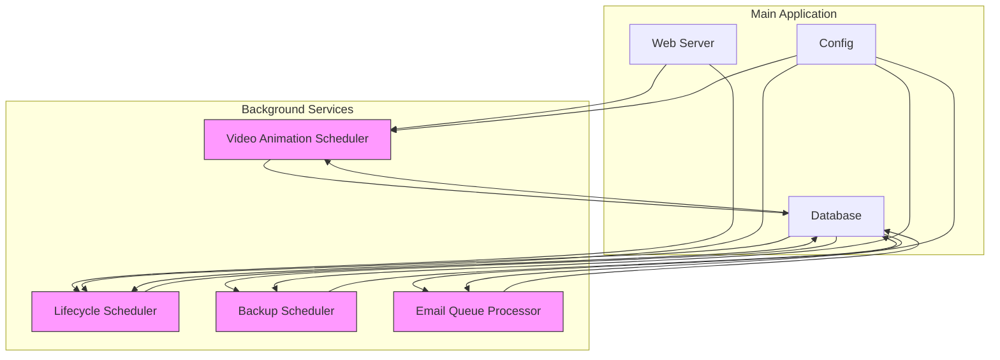
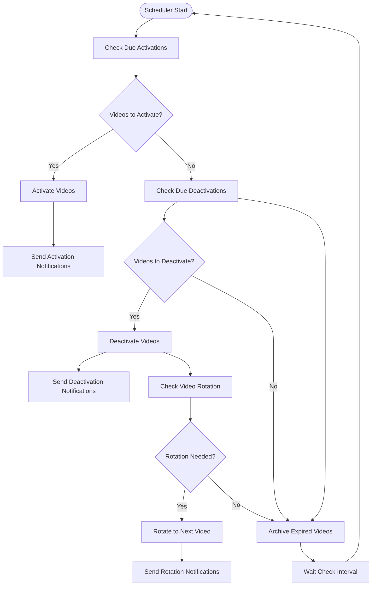
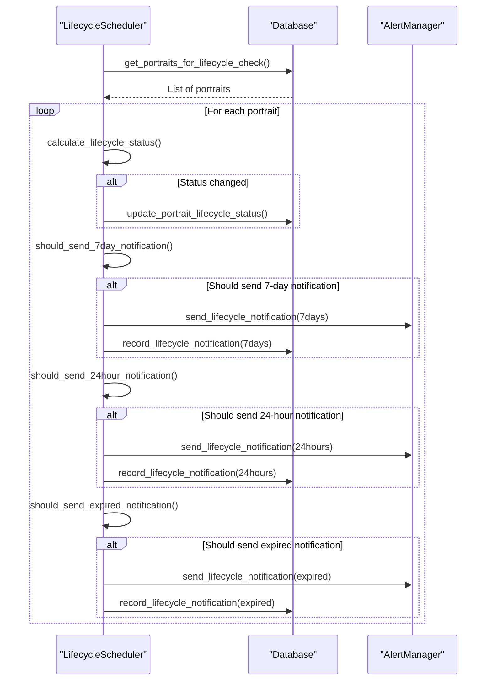
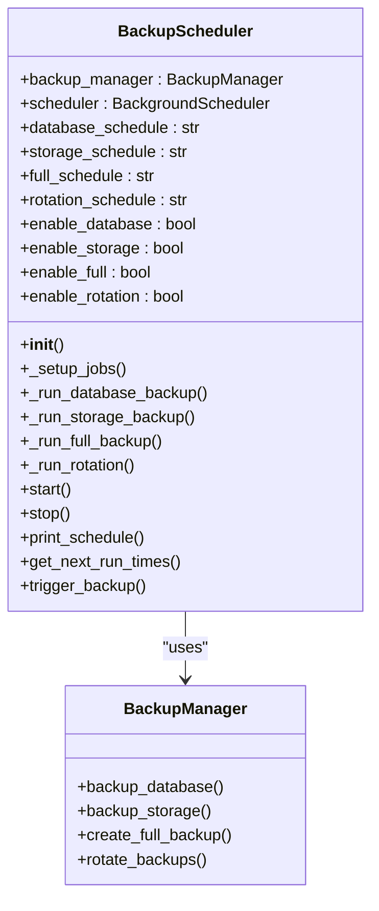
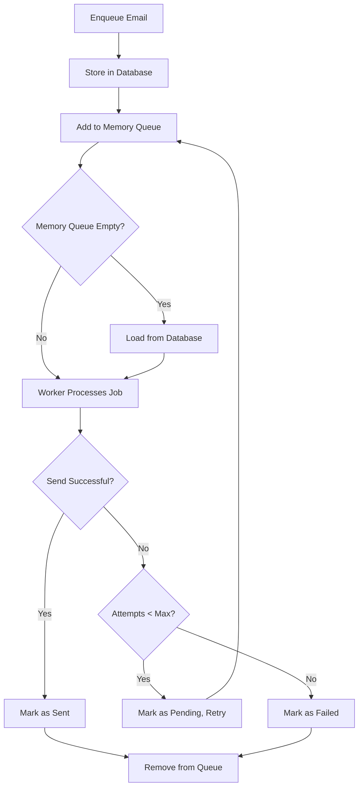
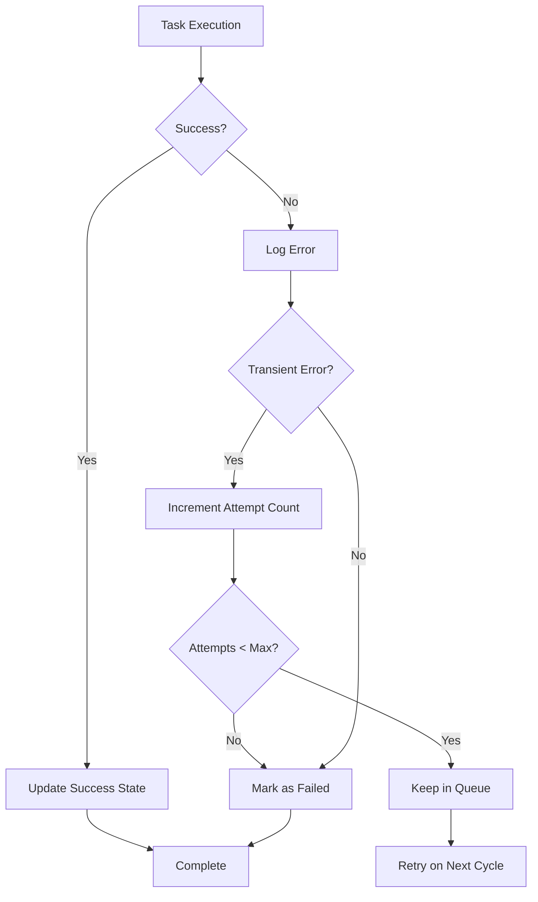
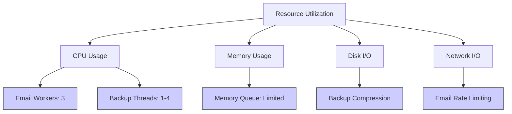
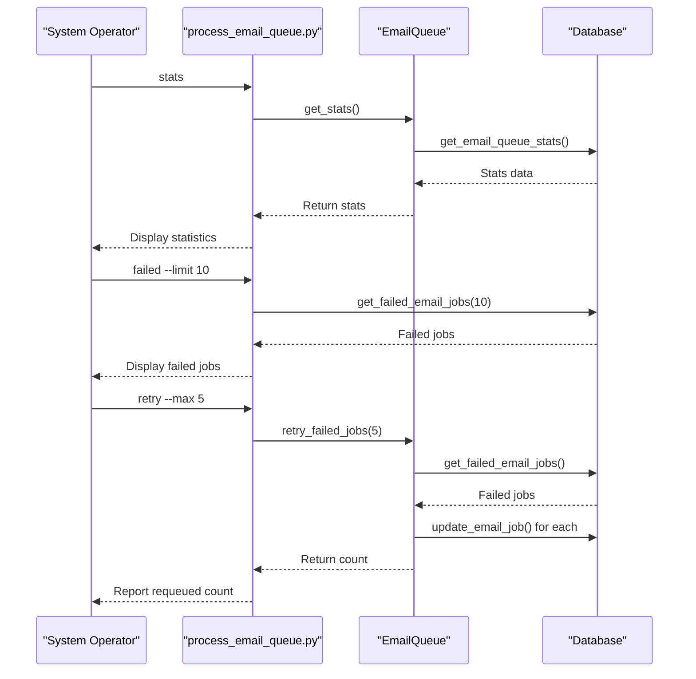
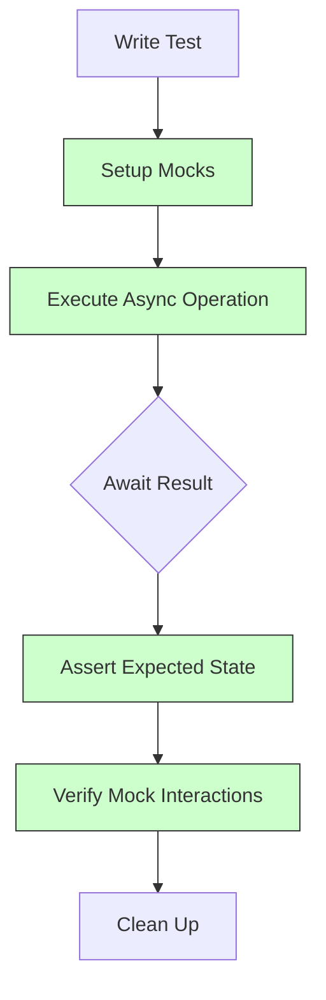

# Background Services & Schedulers

<cite>
**Referenced Files in This Document**   
- [video_animation_scheduler.py](file://vertex-ar/app/video_animation_scheduler.py)
- [backup_scheduler.py](file://vertex-ar/backup_scheduler.py)
- [email_queue.py](file://vertex-ar/app/services/email_queue.py)
- [process_email_queue.py](file://scripts/process_email_queue.py)
- [project_lifecycle.py](file://vertex-ar/app/project_lifecycle.py)
- [config.py](file://vertex-ar/app/config.py)
- [database.py](file://vertex-ar/app/database.py)
</cite>

## Table of Contents
1. [Introduction](#introduction)
2. [System Architecture](#system-architecture)
3. [Video Animation Scheduler](#video-animation-scheduler)
4. [Lifecycle Scheduler](#lifecycle-scheduler)
5. [Backup Scheduler](#backup-scheduler)
6. [Email Queue Processor](#email-queue-processor)
7. [Configuration Options](#configuration-options)
8. [Task Orchestration and Error Handling](#task-orchestration-and-error-handling)
9. [Resource Utilization and Concurrency](#resource-utilization-and-concurrency)
10. [Monitoring and Diagnostics](#monitoring-and-diagnostics)
11. [Extending the Scheduler System](#extending-the-scheduler-system)
12. [Testing Asynchronous Workflows](#testing-asynchronous-workflows)
13. [Conclusion](#conclusion)

## Introduction

The Vertex AR platform employs a comprehensive background processing system to manage time-sensitive operations, ensure data integrity, and maintain system reliability. This documentation provides an in-depth analysis of the four core scheduler components: Video Animation Scheduler, Lifecycle Scheduler, Backup Scheduler, and Email Queue Processor. These services operate independently yet cohesively to automate critical business processes, from content lifecycle management to system backups and notification delivery.

The background processing system is designed with resilience, fault tolerance, and configurability in mind. Each scheduler component follows a consistent pattern of initialization, execution, and error recovery, while maintaining isolation to prevent cascading failures. The system leverages both periodic scheduling (via APScheduler) and continuous polling mechanisms (via asyncio) to accommodate different operational requirements.

This document details the architecture, configuration, and operational characteristics of each scheduler, providing guidance for administrators and developers on monitoring, troubleshooting, and extending the system's capabilities.

## System Architecture

The background processing system in Vertex AR follows a modular architecture with clearly defined components and responsibilities. The system is designed to be both robust and flexible, allowing for independent operation of each scheduler while providing centralized configuration and monitoring capabilities.

**Diagram sources**
- [video_animation_scheduler.py](file://vertex-ar/app/video_animation_scheduler.py)
- [project_lifecycle.py](file://vertex-ar/app/project_lifecycle.py)
- [backup_scheduler.py](file://vertex-ar/backup_scheduler.py)
- [email_queue.py](file://vertex-ar/app/services/email_queue.py)

**Section sources**
- [config.py](file://vertex-ar/app/config.py)
- [database.py](file://vertex-ar/app/database.py)

## Video Animation Scheduler

The Video Animation Scheduler manages the automatic activation and deactivation of video animations based on predefined schedules. This component ensures that video content is displayed according to temporal rules, supporting both one-time activations and recurring rotation patterns.

The scheduler operates as a continuous background task that periodically checks for videos that need to be activated or deactivated. It runs with a configurable check interval (default: 300 seconds) and handles three primary operations: activation of scheduled videos, deactivation of expired videos, and rotation of video content according to specified patterns.

**Diagram sources**
- [video_animation_scheduler.py](file://vertex-ar/app/video_animation_scheduler.py#L315-L341)

**Section sources**
- [video_animation_scheduler.py](file://vertex-ar/app/video_animation_scheduler.py#L17-L344)
- [database.py](file://vertex-ar/app/database.py#L288-L305)

## Lifecycle Scheduler

The Lifecycle Scheduler manages the lifecycle of portraits and projects based on subscription periods and expiration dates. This component ensures that content is properly categorized and notifications are sent as subscription periods approach their end.

The scheduler operates on an hourly basis (configurable) and performs several key functions: calculating lifecycle status (active, expiring, archived), sending timely notifications at 7-day and 24-hour intervals before expiration, and handling post-expiration processes. The system maintains state tracking to prevent duplicate notifications and ensures that expired content is properly archived.

**Diagram sources**
- [project_lifecycle.py](file://vertex-ar/app/project_lifecycle.py)
- [database.py](file://vertex-ar/app/database.py#L351-L374)

**Section sources**
- [project_lifecycle.py](file://vertex-ar/app/project_lifecycle.py)
- [test_lifecycle_scheduler.py](file://test_files/unit/test_lifecycle_scheduler.py)

## Backup Scheduler

The Backup Scheduler provides automated backup capabilities for the Vertex AR system, ensuring data protection and disaster recovery readiness. This component uses APScheduler to manage periodic backup jobs with configurable schedules for different backup types.

The scheduler supports four types of backup operations: database backups, storage backups, full backups (combining database and storage), and backup rotation (cleanup of old backups). Each operation type can be independently enabled or disabled through configuration. The system provides both programmatic and command-line interfaces for manual backup operations and monitoring.

**Diagram sources**
- [backup_scheduler.py](file://vertex-ar/backup_scheduler.py#L19-L246)
- [backup_manager.py](file://vertex-ar/backup_manager.py)

**Section sources**
- [backup_scheduler.py](file://vertex-ar/backup_scheduler.py#L1-L303)

## Email Queue Processor

The Email Queue Processor provides a durable, persistent system for asynchronous email delivery. This component ensures that important notifications are delivered reliably, even in the face of temporary delivery failures or system restarts.

The processor implements a hybrid queue system with both in-memory and database persistence. Emails are stored in the database immediately upon enqueue, ensuring durability across application restarts. A configurable number of worker processes (default: 3) continuously process the queue, with automatic retry logic for failed deliveries. The system supports up to three retry attempts before marking a job as permanently failed.

**Diagram sources**
- [email_queue.py](file://vertex-ar/app/services/email_queue.py#L95-L371)
- [database.py](file://vertex-ar/app/database.py#L723-L756)

**Section sources**
- [email_queue.py](file://vertex-ar/app/services/email_queue.py#L1-L380)
- [process_email_queue.py](file://scripts/process_email_queue.py#L1-L256)

## Configuration Options

The background processing system is highly configurable through environment variables and application settings. Each scheduler component has its own set of configuration options that control behavior, timing, and feature availability.

### Video Animation Scheduler Configuration
| Configuration Option | Default Value | Description |
|----------------------|-------------|-------------|
| VIDEO_SCHEDULER_ENABLED | true | Enables/disables the video animation scheduler |
| VIDEO_SCHEDULER_CHECK_INTERVAL | 300 | Interval (seconds) between scheduler checks |
| VIDEO_SCHEDULER_ROTATION_INTERVAL | 3600 | Interval (seconds) for rotation checks |
| VIDEO_SCHEDULER_ARCHIVE_AFTER_HOURS | 168 | Hours after which expired videos are archived |
| VIDEO_SCHEDULER_NOTIFICATIONS_ENABLED | true | Enables/disables scheduler notifications |

### Lifecycle Scheduler Configuration
| Configuration Option | Default Value | Description |
|----------------------|-------------|-------------|
| LIFECYCLE_SCHEDULER_ENABLED | true | Enables/disables the lifecycle scheduler |
| LIFECYCLE_CHECK_INTERVAL_SECONDS | 3600 | Interval (seconds) between lifecycle checks |
| LIFECYCLE_NOTIFICATIONS_ENABLED | true | Enables/disables lifecycle notifications |

### Backup Scheduler Configuration
| Configuration Option | Default Value | Description |
|----------------------|-------------|-------------|
| BACKUP_DATABASE_ENABLED | true | Enables/disables database backups |
| BACKUP_STORAGE_ENABLED | false | Enables/disables storage backups |
| BACKUP_FULL_ENABLED | true | Enables/disables full backups |
| BACKUP_ROTATION_ENABLED | true | Enables/disables backup rotation |
| BACKUP_DATABASE_SCHEDULE | 0 2 * * * | Cron expression for database backups |
| BACKUP_STORAGE_SCHEDULE | 0 3 * * 0 | Cron expression for storage backups |
| BACKUP_FULL_SCHEDULE | 0 3 * * 0 | Cron expression for full backups |
| BACKUP_ROTATION_SCHEDULE | 0 4 * * * | Cron expression for rotation |

### Email Queue Configuration
| Configuration Option | Default Value | Description |
|----------------------|-------------|-------------|
| EMAIL_QUEUE_WORKERS | 3 | Number of concurrent email processing workers |
| EMAIL_RETRY_MAX_ATTEMPTS | 5 | Maximum number of retry attempts for failed emails |
| EMAIL_RETRY_DELAYS | 1,2,4,8,16 | Comma-separated list of retry delays in seconds |

**Section sources**
- [config.py](file://vertex-ar/app/config.py#L173-L199)

## Task Orchestration and Error Handling

The background processing system implements robust error handling and recovery mechanisms to ensure reliability and data consistency. Each scheduler component follows a consistent pattern of exception handling, logging, and state management.

### Error Handling Patterns

The system employs several key error handling strategies:

1. **Graceful Degradation**: Individual task failures do not halt the entire scheduler process
2. **Comprehensive Logging**: All operations and errors are logged with contextual information
3. **Retry Mechanisms**: Transient failures are handled through automatic retry logic
4. **State Persistence**: Critical state information is stored in the database to survive restarts

For the Email Queue Processor, failed email deliveries are handled through a progressive retry strategy. After each failure, the job remains in the "pending" state and will be retried on subsequent processing cycles until the maximum attempt count is reached. This ensures that temporary issues like network connectivity problems do not result in permanent delivery failure.

**Diagram sources**
- [email_queue.py](file://vertex-ar/app/services/email_queue.py#L184-L243)
- [backup_scheduler.py](file://vertex-ar/backup_scheduler.py#L112-L129)

**Section sources**
- [email_queue.py](file://vertex-ar/app/services/email_queue.py#L184-L243)
- [backup_scheduler.py](file://vertex-ar/backup_scheduler.py#L112-L129)
- [test_email_queue.py](file://test_files/unit/test_email_queue.py#L202-L242)

## Resource Utilization and Concurrency

The background processing system is designed to efficiently utilize system resources while maintaining responsiveness and stability. Each component employs appropriate concurrency models based on its operational requirements.

### Concurrency Models

**Video Animation Scheduler**: Uses a single continuous asyncio task that periodically checks for scheduled operations. This model minimizes resource consumption while ensuring timely execution of scheduled events.

**Lifecycle Scheduler**: Similar to the Video Animation Scheduler, it runs as a single background task with periodic execution, optimized for low-frequency operations (typically hourly).

**Backup Scheduler**: Utilizes APScheduler's thread-based execution model, allowing backup operations to run in separate threads without blocking the main application. This enables long-running backup operations to proceed independently.

**Email Queue Processor**: Implements a worker pool pattern with multiple asyncio tasks (default: 3) that process the email queue concurrently. This allows for parallel email delivery while maintaining the benefits of asynchronous I/O.

### Resource Monitoring

The system includes built-in resource monitoring to prevent excessive resource consumption. The Email Queue Processor, for example, limits the number of concurrent workers and implements backoff strategies during error conditions. The Backup Scheduler includes misfire grace periods to prevent overlapping backup operations.

**Diagram sources**
- [email_queue.py](file://vertex-ar/app/services/email_queue.py#L101-L122)
- [backup_scheduler.py](file://vertex-ar/backup_scheduler.py#L40-L53)

**Section sources**
- [email_queue.py](file://vertex-ar/app/services/email_queue.py#L101-L122)
- [backup_scheduler.py](file://vertex-ar/backup_scheduler.py#L40-L53)

## Monitoring and Diagnostics

The background processing system includes comprehensive monitoring and diagnostic capabilities to ensure operational visibility and facilitate troubleshooting.

### Built-in Monitoring Features

Each scheduler component provides status and statistics endpoints that can be used for monitoring:

- **Video Animation Scheduler**: Provides current status, check intervals, and video summary statistics
- **Lifecycle Scheduler**: Offers lifecycle status summaries and notification tracking
- **Backup Scheduler**: Exposes next run times for all scheduled jobs
- **Email Queue Processor**: Delivers detailed queue statistics including pending, sending, sent, and failed job counts

The Email Queue Processor includes a dedicated CLI tool (`process_email_queue.py`) that provides administrative capabilities for monitoring and manual intervention. This tool allows operators to:
- View queue statistics
- List failed jobs
- Retry failed jobs
- Drain the queue
- Clean up old jobs

### Logging Strategy

The system employs structured logging with contextual information for all background operations. Log entries include:
- Timestamps
- Component identifiers
- Operation types
- Status indicators
- Error details (when applicable)
- Performance metrics

This comprehensive logging approach enables effective monitoring, auditing, and troubleshooting of background operations.

**Diagram sources**
- [process_email_queue.py](file://scripts/process_email_queue.py#L84-L106)
- [email_queue.py](file://vertex-ar/app/services/email_queue.py#L327-L339)

**Section sources**
- [process_email_queue.py](file://scripts/process_email_queue.py#L1-L256)
- [email_queue.py](file://vertex-ar/app/services/email_queue.py#L327-L339)

## Extending the Scheduler System

The background processing system is designed to be extensible, allowing developers to add new background processes with minimal effort. The architecture follows consistent patterns that can be replicated for new scheduler components.

### Adding New Background Processes

To add a new background process, follow these steps:

1. **Create a new scheduler class** that encapsulates the business logic
2. **Implement initialization and configuration** through the standard settings mechanism
3. **Define the execution pattern** (continuous polling or scheduled execution)
4. **Integrate with the main application** through proper initialization
5. **Implement monitoring and statistics** endpoints
6. **Add appropriate logging** for operational visibility

For scheduled tasks using APScheduler (like the Backup Scheduler), create a class that initializes a BackgroundScheduler and configures jobs with appropriate triggers. For continuous background tasks (like the Video Animation Scheduler), implement a method that runs an infinite loop with appropriate sleep intervals.

### Integration Points

New scheduler components should integrate with the existing system through these key points:

- **Configuration**: Use the central Settings object for configuration
- **Database**: Access data through the Database class
- **Logging**: Use the standard logging setup
- **Alerting**: Integrate with the alerting system for notifications
- **Monitoring**: Expose status information for system monitoring

The Email Queue Processor serves as an excellent example of a well-integrated background component, demonstrating proper separation of concerns, configuration management, and operational visibility.

**Section sources**
- [video_animation_scheduler.py](file://vertex-ar/app/video_animation_scheduler.py)
- [backup_scheduler.py](file://vertex-ar/backup_scheduler.py)
- [email_queue.py](file://vertex-ar/app/services/email_queue.py)

## Testing Asynchronous Workflows

The background processing system includes comprehensive testing coverage for asynchronous workflows, ensuring reliability and correctness of background operations.

### Testing Strategies

The system employs several testing approaches:

1. **Unit Testing**: Isolated testing of individual components and methods
2. **Mocking**: Use of mocks for external dependencies like email services and databases
3. **Async Testing**: Proper handling of asynchronous code in test cases
4. **Edge Case Testing**: Verification of error conditions and failure recovery

The test suite for the Email Queue Processor demonstrates effective testing of asynchronous workflows, using pytest with async support and comprehensive mocking of dependencies.

### Test Coverage

Key aspects covered by the test suite include:

- **Email Queue Job Creation**: Validation of job initialization and serialization
- **Enqueue/Dequeue Operations**: Testing of queue persistence and retrieval
- **Error Handling**: Verification of retry logic and failure states
- **Worker Pool Behavior**: Testing of concurrent processing and shutdown
- **Database Integration**: Validation of persistence operations

The tests use realistic scenarios to ensure that the system behaves correctly under various conditions, including network failures, database errors, and edge cases in job processing.

**Diagram sources**
- [test_email_queue.py](file://test_files/unit/test_email_queue.py#L88-L348)
- [test_lifecycle_scheduler.py](file://test_files/unit/test_lifecycle_scheduler.py#L14-L203)

**Section sources**
- [test_email_queue.py](file://test_files/unit/test_email_queue.py#L1-L348)
- [test_lifecycle_scheduler.py](file://test_files/unit/test_lifecycle_scheduler.py#L1-L203)

## Conclusion

The background processing system in Vertex AR provides a robust, reliable, and extensible framework for managing time-sensitive operations. The four core scheduler components—Video Animation Scheduler, Lifecycle Scheduler, Backup Scheduler, and Email Queue Processor—work together to ensure the platform operates smoothly and reliably.

Key strengths of the system include:
- **Resilience**: Comprehensive error handling and recovery mechanisms
- **Configurability**: Extensive configuration options for operational flexibility
- **Visibility**: Detailed monitoring and diagnostic capabilities
- **Extensibility**: Consistent patterns that facilitate adding new background processes
- **Reliability**: Persistent storage and retry mechanisms for critical operations

The system demonstrates best practices in background processing, including proper separation of concerns, appropriate concurrency models, and thorough testing. By following the patterns established in this system, developers can confidently extend the platform's capabilities while maintaining stability and reliability.

For optimal operation, administrators should:
- Regularly monitor scheduler status and performance
- Configure appropriate alerting for critical operations
- Test backup and recovery procedures periodically
- Review and adjust configuration based on operational requirements
- Monitor resource utilization to ensure system stability

The comprehensive documentation and testing coverage provide a solid foundation for maintaining and enhancing the background processing system as the platform evolves.