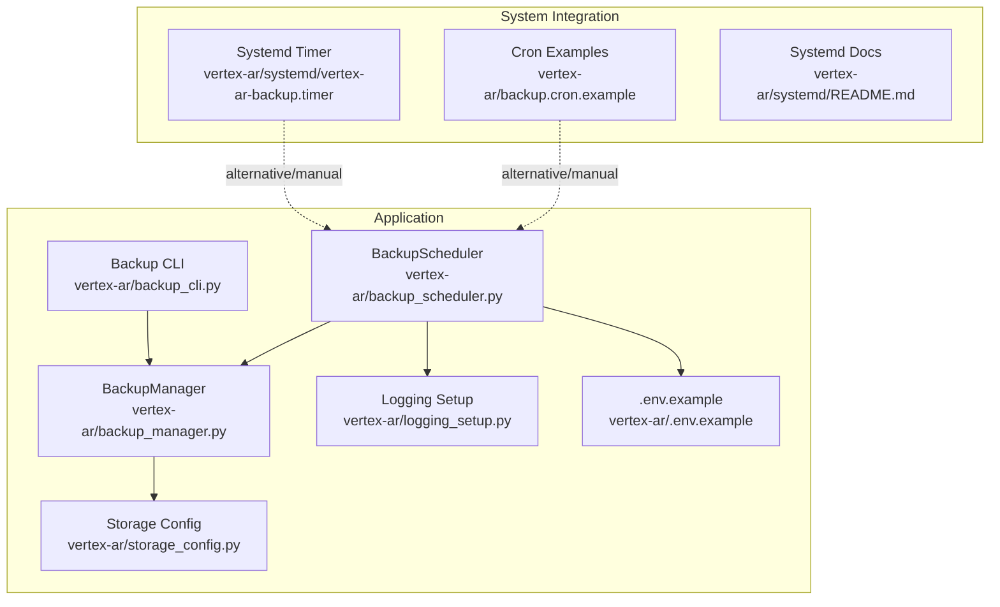
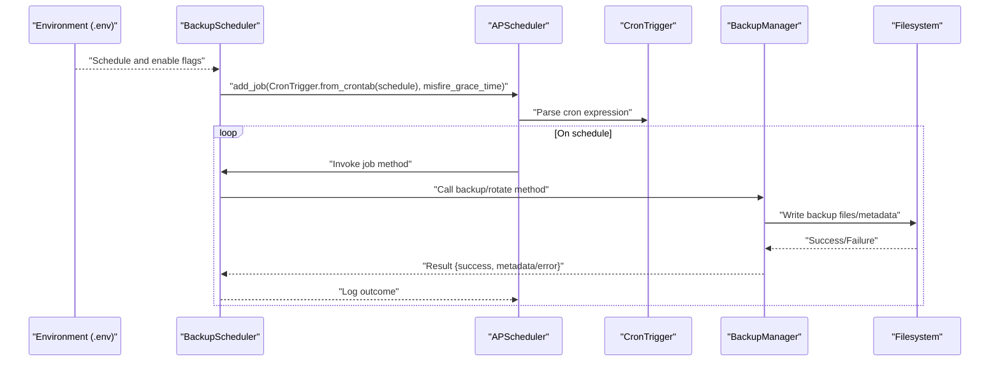
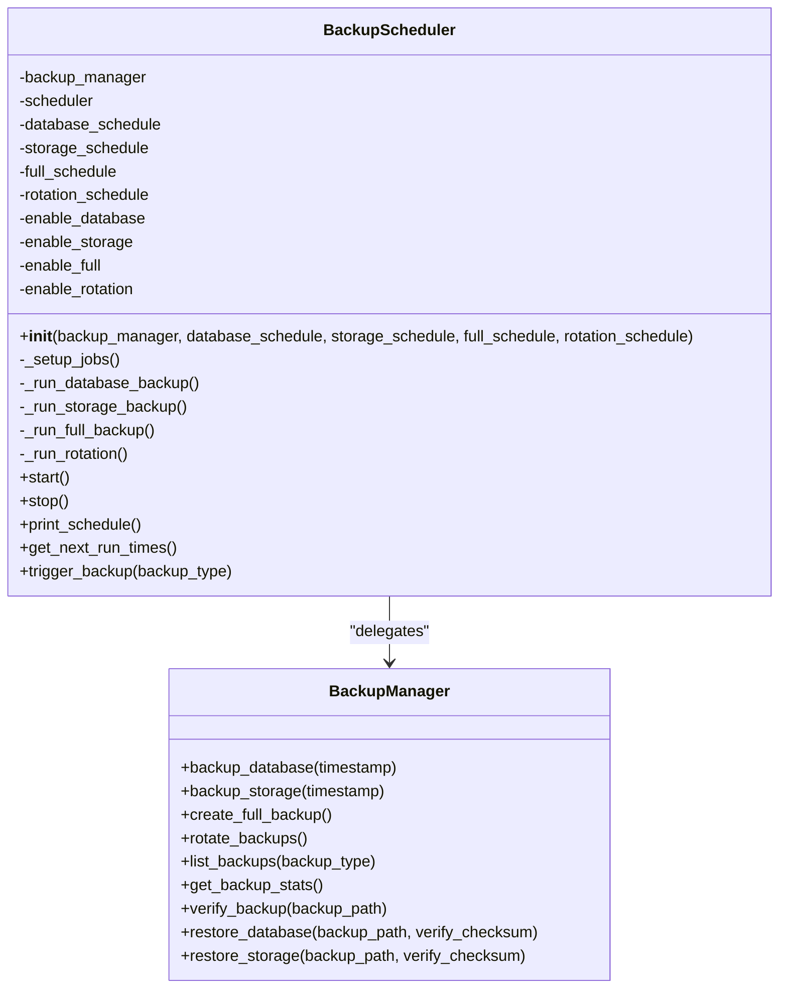
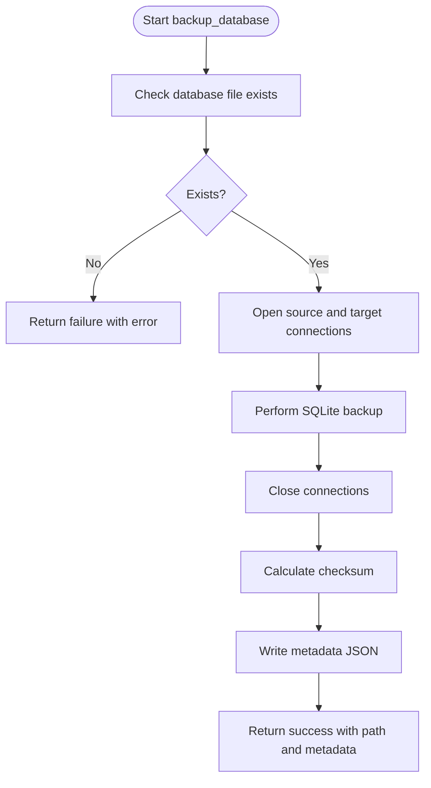
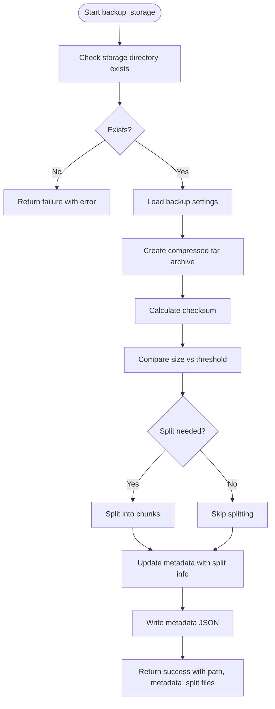
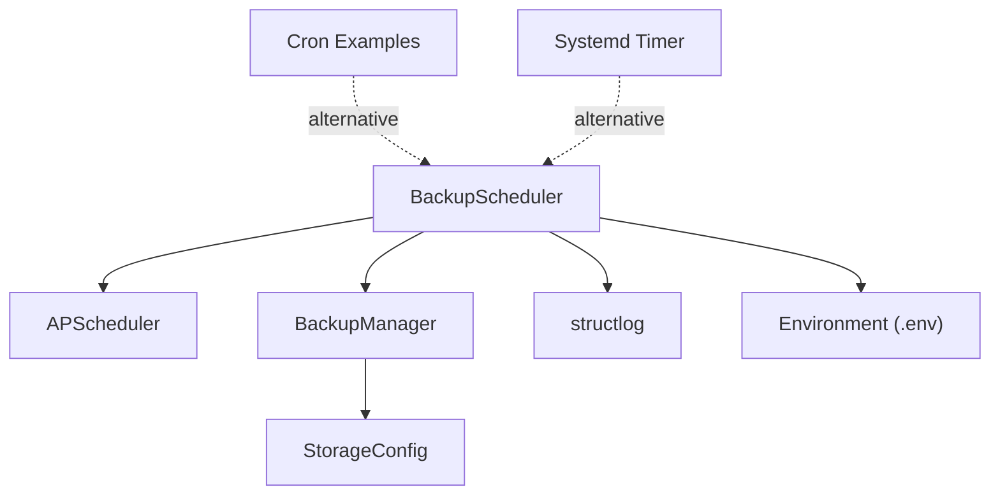

# Backup Scheduler

<cite>
**Referenced Files in This Document**
- [backup_scheduler.py](file://vertex-ar/backup_scheduler.py)
- [backup_manager.py](file://vertex-ar/backup_manager.py)
- [logging_setup.py](file://vertex-ar/logging_setup.py)
- [.env.example](file://vertex-ar/.env.example)
- [backup.cron.example](file://vertex-ar/backup.cron.example)
- [systemd/vertex-ar-backup.timer](file://vertex-ar/systemd/vertex-ar-backup.timer)
- [systemd/README.md](file://vertex-ar/systemd/README.md)
- [backup_cli.py](file://vertex-ar/backup_cli.py)
- [storage_config.py](file://vertex-ar/storage_config.py)
</cite>

## Table of Contents
1. [Introduction](#introduction)
2. [Project Structure](#project-structure)
3. [Core Components](#core-components)
4. [Architecture Overview](#architecture-overview)
5. [Detailed Component Analysis](#detailed-component-analysis)
6. [Dependency Analysis](#dependency-analysis)
7. [Performance Considerations](#performance-considerations)
8. [Troubleshooting Guide](#troubleshooting-guide)
9. [Conclusion](#conclusion)
10. [Appendices](#appendices)

## Introduction
This document explains the Backup Scheduler sub-component responsible for automated, cron-based backup orchestration. It integrates APScheduler to schedule and execute four types of backups: database, storage, full (combined), and rotation. The scheduler reads configuration from environment variables, initializes a shared BackupManager instance, and exposes lifecycle controls (start/stop), operational visibility (schedule printing), and manual triggers. It also demonstrates graceful shutdown handling and provides troubleshooting guidance for common issues such as cron syntax errors and storage permission failures.

## Project Structure
The Backup Scheduler lives in the application’s vertex-ar module and coordinates with the Backup Manager for actual backup operations. Configuration is primarily driven by environment variables defined in the project’s template.

**Diagram sources**
- [backup_scheduler.py](file://vertex-ar/backup_scheduler.py#L1-L120)
- [backup_manager.py](file://vertex-ar/backup_manager.py#L1-L120)
- [logging_setup.py](file://vertex-ar/logging_setup.py#L1-L133)
- [.env.example](file://vertex-ar/.env.example#L250-L284)
- [backup.cron.example](file://vertex-ar/backup.cron.example#L1-L121)
- [systemd/vertex-ar-backup.timer](file://vertex-ar/systemd/vertex-ar-backup.timer#L1-L13)
- [systemd/README.md](file://vertex-ar/systemd/README.md#L1-L84)
- [backup_cli.py](file://vertex-ar/backup_cli.py#L1-L120)
- [storage_config.py](file://vertex-ar/storage_config.py#L140-L160)

**Section sources**
- [backup_scheduler.py](file://vertex-ar/backup_scheduler.py#L1-L120)
- [.env.example](file://vertex-ar/.env.example#L250-L284)

## Core Components
- BackupScheduler: Orchestrates APScheduler, loads environment-driven schedules and toggles, registers jobs, and exposes lifecycle and manual trigger APIs.
- BackupManager: Implements backup operations (database, storage, full), rotation, verification, and restore helpers.
- Environment configuration: Defines default schedules and enable flags for each job type.
- Logging: Structured logging with sensitive data redaction for operational insights.
- Alternative integrations: Cron examples and systemd timer for complementary automation.

Key responsibilities:
- Initialize APScheduler with CronTrigger and misfire grace time.
- Register four jobs: database backup, storage backup, full backup, and rotation.
- Execute jobs via BackupManager methods and log outcomes.
- Provide start/stop lifecycle and schedule printing utilities.
- Offer manual trigger capability for ad-hoc runs.

**Section sources**
- [backup_scheduler.py](file://vertex-ar/backup_scheduler.py#L19-L120)
- [backup_manager.py](file://vertex-ar/backup_manager.py#L21-L120)
- [.env.example](file://vertex-ar/.env.example#L250-L284)
- [logging_setup.py](file://vertex-ar/logging_setup.py#L1-L133)

## Architecture Overview
The Backup Scheduler composes APScheduler with CronTrigger to schedule jobs. Each job delegates to BackupManager methods, which encapsulate filesystem operations, metadata generation, and rotation logic. Environment variables control schedules and enablement flags. Logging is centralized via structlog.

**Diagram sources**
- [backup_scheduler.py](file://vertex-ar/backup_scheduler.py#L43-L106)
- [backup_manager.py](file://vertex-ar/backup_manager.py#L212-L423)

## Detailed Component Analysis

### BackupScheduler
Responsibilities:
- Initialization: Reads environment variables for schedules and enable flags; constructs BackupManager; sets up APScheduler jobs.
- Job registration: Adds four jobs with CronTrigger and a 5-minute misfire grace window.
- Execution: Wraps BackupManager calls with structured logging and error handling.
- Lifecycle: start(), stop(), print_schedule(), get_next_run_times().
- Manual trigger: trigger_backup() dispatches to the appropriate job method.
- Singleton: get_backup_scheduler() ensures a single scheduler instance.

Implementation highlights:
- Environment-driven configuration:
  - BACKUP_DATABASE_SCHEDULE, BACKUP_STORAGE_SCHEDULE, BACKUP_FULL_SCHEDULE, BACKUP_ROTATION_SCHEDULE
  - BACKUP_DATABASE_ENABLED, BACKUP_STORAGE_ENABLED, BACKUP_FULL_ENABLED, BACKUP_ROTATION_ENABLED
- APScheduler setup:
  - CronTrigger.from_crontab() parses cron expressions.
  - replace_existing=True allows dynamic reconfiguration.
  - misfire_grace_time=300 seconds prevents missed executions from causing immediate reschedules.
- Error handling:
  - Try/catch around job bodies logs exceptions and continues.
  - Setup errors are logged and re-raised to surface configuration issues.

Operational utilities:
- print_schedule(): Logs active jobs and next run times.
- get_next_run_times(): Returns a structured map of job IDs to next run timestamps.

Manual intervention:
- trigger_backup(backup_type): Executes a specific job immediately for testing or emergency runs.

Graceful shutdown:
- Standalone entrypoint handles SIGINT/SIGTERM and stops the scheduler.

**Section sources**
- [backup_scheduler.py](file://vertex-ar/backup_scheduler.py#L19-L120)
- [backup_scheduler.py](file://vertex-ar/backup_scheduler.py#L112-L185)
- [backup_scheduler.py](file://vertex-ar/backup_scheduler.py#L186-L246)
- [backup_scheduler.py](file://vertex-ar/backup_scheduler.py#L248-L303)

#### Class Diagram

**Diagram sources**
- [backup_scheduler.py](file://vertex-ar/backup_scheduler.py#L19-L120)
- [backup_scheduler.py](file://vertex-ar/backup_scheduler.py#L112-L185)
- [backup_manager.py](file://vertex-ar/backup_manager.py#L212-L423)

### BackupManager
Responsibilities:
- Database backup: Uses SQLite backup API to create a safe copy and metadata.
- Storage backup: Creates a compressed tar archive of the storage directory, calculates checksums, and supports splitting large backups.
- Full backup: Combines database and storage backups, aggregates metadata, and writes combined metadata.
- Rotation: Removes oldest backups beyond retention limits, cleaning both files and associated metadata.
- Verification and restore: Validates backups and restores database/storage with optional checksum verification.

Key behaviors:
- Metadata generation: Each backup writes a JSON metadata file alongside the backup artifact.
- Large file handling: Splits backups exceeding configured thresholds and merges when needed.
- Error handling: Returns structured results with success flags and error messages.

**Section sources**
- [backup_manager.py](file://vertex-ar/backup_manager.py#L212-L423)
- [backup_manager.py](file://vertex-ar/backup_manager.py#L465-L531)
- [backup_manager.py](file://vertex-ar/backup_manager.py#L630-L700)

#### Algorithm Flow: Database Backup

**Diagram sources**
- [backup_manager.py](file://vertex-ar/backup_manager.py#L212-L277)

#### Algorithm Flow: Storage Backup

**Diagram sources**
- [backup_manager.py](file://vertex-ar/backup_manager.py#L278-L371)

### Environment Configuration and Defaults
- Default schedules and enable flags are defined in the environment template:
  - BACKUP_DATABASE_SCHEDULE, BACKUP_DATABASE_ENABLED
  - BACKUP_STORAGE_SCHEDULE, BACKUP_STORAGE_ENABLED
  - BACKUP_FULL_SCHEDULE, BACKUP_FULL_ENABLED
  - BACKUP_ROTATION_SCHEDULE, BACKUP_ROTATION_ENABLED
- These values are read by BackupScheduler during initialization to configure APScheduler jobs.

**Section sources**
- [.env.example](file://vertex-ar/.env.example#L250-L284)
- [backup_scheduler.py](file://vertex-ar/backup_scheduler.py#L43-L53)

### Alternative Automation Paths
- Cron-based automation: The repository includes a crontab example with recommended schedules and alternative configurations.
- Systemd timer: Provides a systemd timer unit for daily execution and manual triggers.

These alternatives complement the APScheduler-based scheduler and can be used depending on deployment preferences.

**Section sources**
- [backup.cron.example](file://vertex-ar/backup.cron.example#L1-L121)
- [systemd/vertex-ar-backup.timer](file://vertex-ar/systemd/vertex-ar-backup.timer#L1-L13)
- [systemd/README.md](file://vertex-ar/systemd/README.md#L1-L84)

## Dependency Analysis
- BackupScheduler depends on:
  - APScheduler for scheduling and job execution.
  - BackupManager for performing backup operations.
  - Structlog for logging with sensitive data redaction.
  - Environment variables for configuration.
- BackupManager depends on:
  - SQLite for database backup.
  - Tar archives for storage backup.
  - Storage configuration for backup settings (compression, chunking, retention).
- External integrations:
  - Cron examples and systemd timer for alternative automation.

**Diagram sources**
- [backup_scheduler.py](file://vertex-ar/backup_scheduler.py#L1-L120)
- [backup_manager.py](file://vertex-ar/backup_manager.py#L1-L120)
- [storage_config.py](file://vertex-ar/storage_config.py#L140-L160)
- [backup.cron.example](file://vertex-ar/backup.cron.example#L1-L121)
- [systemd/vertex-ar-backup.timer](file://vertex-ar/systemd/vertex-ar-backup.timer#L1-L13)

**Section sources**
- [backup_scheduler.py](file://vertex-ar/backup_scheduler.py#L1-L120)
- [backup_manager.py](file://vertex-ar/backup_manager.py#L1-L120)
- [storage_config.py](file://vertex-ar/storage_config.py#L140-L160)

## Performance Considerations
- Misfire grace time: The scheduler uses a 5-minute grace window to tolerate minor delays without rescheduling.
- Compression and chunking: Storage backups support compression and automatic splitting to manage large artifacts efficiently.
- Rotation: Maintains a bounded number of backups to control disk usage.
- Logging overhead: Structured logging with redaction minimizes sensitive data exposure and keeps logs efficient.

[No sources needed since this section provides general guidance]

## Troubleshooting Guide
Common issues and resolutions:

- Cron expression syntax errors:
  - Symptom: Jobs not appearing or failing to parse.
  - Resolution: Validate cron expressions against the standard format (minute hour day month weekday). Use the included cron examples as reference.
  - Reference: [backup.cron.example](file://vertex-ar/backup.cron.example#L90-L112)

- Backup job failures due to storage permissions:
  - Symptom: Storage backup fails with permission denied or missing directory.
  - Resolution: Ensure the backup directory exists and is writable by the process owner. Verify STORAGE_PATH and backup directory paths in environment configuration.
  - Reference: [backup_manager.py](file://vertex-ar/backup_manager.py#L278-L371)

- Database backup failures:
  - Symptom: Database file not found or backup API errors.
  - Resolution: Confirm DATABASE_URL points to a valid SQLite file and that the process has read access. Review metadata and logs for details.
  - Reference: [backup_manager.py](file://vertex-ar/backup_manager.py#L212-L277)

- Rotation not removing old backups:
  - Symptom: Old backups persist beyond retention limits.
  - Resolution: Check MAX_BACKUPS setting and confirm rotation job is enabled and scheduled. Inspect logs for removal counts.
  - Reference: [.env.example](file://vertex-ar/.env.example#L282-L284), [backup_scheduler.py](file://vertex-ar/backup_scheduler.py#L43-L53), [backup_manager.py](file://vertex-ar/backup_manager.py#L465-L531)

- Manual trigger not working:
  - Symptom: trigger_backup returns False or logs an invalid backup type.
  - Resolution: Use one of the supported types: database, storage, full, rotation. Verify the method is invoked with the correct argument.
  - Reference: [backup_scheduler.py](file://vertex-ar/backup_scheduler.py#L221-L246)

- Graceful shutdown:
  - Symptom: Scheduler does not stop cleanly on SIGINT/SIGTERM.
  - Resolution: The standalone entrypoint installs signal handlers to stop the scheduler gracefully. Ensure the process is started as the scheduler script.
  - Reference: [backup_scheduler.py](file://vertex-ar/backup_scheduler.py#L278-L303)

- Operational visibility:
  - Use print_schedule() to inspect active jobs and next run times. Alternatively, use get_next_run_times() for programmatic access.
  - Reference: [backup_scheduler.py](file://vertex-ar/backup_scheduler.py#L199-L220)

**Section sources**
- [backup_scheduler.py](file://vertex-ar/backup_scheduler.py#L186-L246)
- [backup_scheduler.py](file://vertex-ar/backup_scheduler.py#L278-L303)
- [backup_manager.py](file://vertex-ar/backup_manager.py#L212-L371)
- [backup_manager.py](file://vertex-ar/backup_manager.py#L465-L531)
- [.env.example](file://vertex-ar/.env.example#L250-L284)

## Conclusion
The Backup Scheduler provides a robust, configurable, and observable solution for automated backups using APScheduler. It integrates tightly with BackupManager to perform database, storage, and full backups, and to manage retention via rotation. Environment-driven configuration enables flexible scheduling and enablement flags. The component offers lifecycle controls, manual triggers, and structured logging for operational transparency. Complementary cron and systemd integrations provide alternative automation paths for environments preferring system-level scheduling.

[No sources needed since this section summarizes without analyzing specific files]

## Appendices

### Environment Variables Reference
- BACKUP_DATABASE_SCHEDULE: Cron expression for database backups (default daily at 2:00 AM).
- BACKUP_STORAGE_SCHEDULE: Cron expression for storage backups (default weekly on Sunday at 3:00 AM).
- BACKUP_FULL_SCHEDULE: Cron expression for full backups (default weekly on Sunday at 3:00 AM).
- BACKUP_ROTATION_SCHEDULE: Cron expression for rotation (default daily at 4:00 AM).
- BACKUP_DATABASE_ENABLED, BACKUP_STORAGE_ENABLED, BACKUP_FULL_ENABLED, BACKUP_ROTATION_ENABLED: Enable/disable flags for each job type.
- MAX_BACKUPS: Maximum number of backups to retain (applies to rotation).

**Section sources**
- [.env.example](file://vertex-ar/.env.example#L250-L284)

### Backup Types and Execution Flow
- Database backup: Delegates to BackupManager.backup_database(), logs success/failure with metadata.
- Storage backup: Delegates to BackupManager.backup_storage(), supports compression and splitting.
- Full backup: Delegates to BackupManager.create_full_backup(), aggregates database and storage metadata.
- Rotation: Delegates to BackupManager.rotate_backups(), removes oldest backups and metadata.

**Section sources**
- [backup_scheduler.py](file://vertex-ar/backup_scheduler.py#L112-L185)
- [backup_manager.py](file://vertex-ar/backup_manager.py#L212-L423)
- [backup_manager.py](file://vertex-ar/backup_manager.py#L465-L531)

### Systemd Timer Integration
- The systemd timer unit defines a daily schedule at 2:00 AM with persistence for missed runs.
- Manual triggers and status checks are documented in the systemd README.

**Section sources**
- [systemd/vertex-ar-backup.timer](file://vertex-ar/systemd/vertex-ar-backup.timer#L1-L13)
- [systemd/README.md](file://vertex-ar/systemd/README.md#L1-L84)