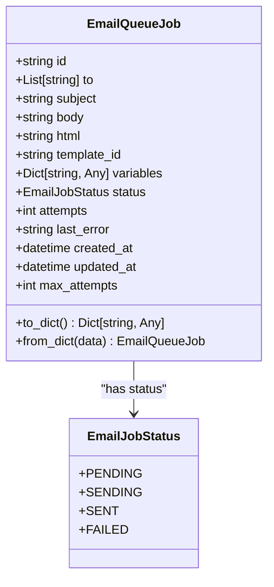
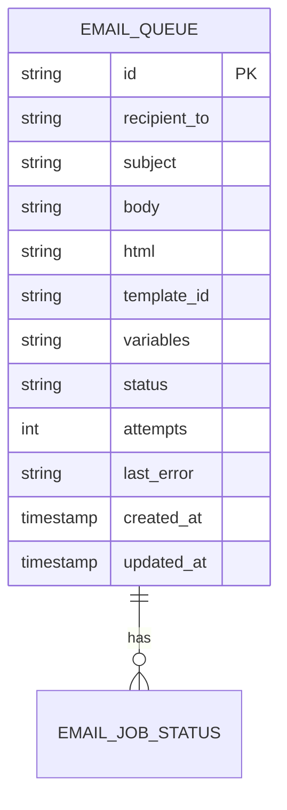
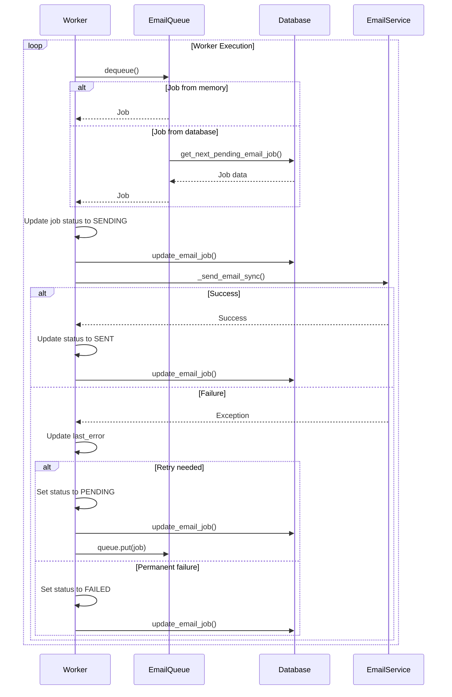
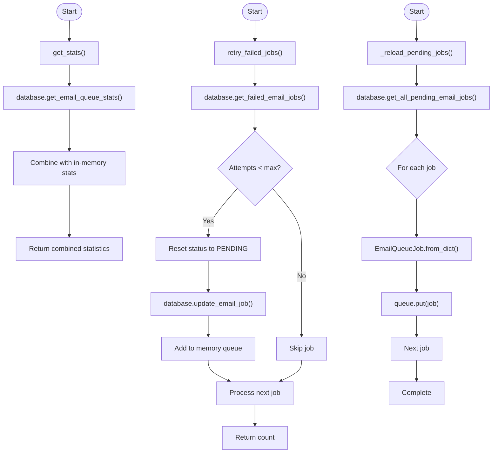

# Email Queue Processor

<cite>
**Referenced Files in This Document**   
- [email_queue.py](file://vertex-ar/app/services/email_queue.py)
- [database.py](file://vertex-ar/app/database.py)
- [email_service.py](file://vertex-ar/app/services/email_service.py)
- [main.py](file://vertex-ar/app/main.py)
- [test_email_queue.py](file://test_files/unit/test_email_queue.py)
</cite>

## Table of Contents
1. [Introduction](#introduction)
2. [EmailQueueJob Model and Status Lifecycle](#emailqueuejob-model-and-status-lifecycle)
3. [Database Persistence Mechanism](#database-persistence-mechanism)
4. [EmailQueue Service Initialization](#emailqueue-service-initialization)
5. [Enqueue Method and Dual Persistence Strategy](#enqueue-method-and-dual-persistence-strategy)
6. [Dequeue Method and Fallback Mechanism](#dequeue-method-and-fallback-mechanism)
7. [_process_job Method Execution Flow](#_process_job-method-execution-flow)
8. [Worker Pool Implementation](#worker-pool-implementation)
9. [Integration Points](#integration-points)
10. [Monitoring and Recovery Methods](#monitoring-and-recovery-methods)
11. [Error Handling and Best Practices](#error-handling-and-best-practices)

## Introduction
The Email Queue Processor is a critical component of the Vertex AR application, providing a durable, persistent mechanism for asynchronous email delivery that survives application restarts. This system ensures reliable email delivery by combining database persistence with an in-memory queue for high-performance processing. The processor uses a worker pool architecture with configurable concurrency, implementing robust retry logic and failure recovery mechanisms. It integrates tightly with the application's database layer for job persistence and the email service for actual message delivery. This documentation provides a comprehensive analysis of the implementation details, including the EmailQueueJob model with its status lifecycle, the hybrid persistence strategy, worker pool management, and integration points with other system components.

**Section sources**
- [email_queue.py](file://vertex-ar/app/services/email_queue.py#L1-L380)

## EmailQueueJob Model and Status Lifecycle
The `EmailQueueJob` class represents an email job in the persistent queue, encapsulating all necessary information for email delivery. The job model includes essential fields such as recipient list, subject, body content, HTML content, template ID, and variables for template rendering. Each job maintains a unique identifier, creation and update timestamps, and metadata for tracking delivery attempts and errors.

The status lifecycle of an email job follows a well-defined state machine with four distinct states: `pending`, `sending`, `sent`, and `failed`. The `EmailJobStatus` enum defines these states, ensuring type safety and preventing invalid status values. When a job is first created, it defaults to the `pending` state, indicating it's ready for processing. During processing, the status transitions to `sending` to indicate active delivery attempts. Upon successful delivery, the status becomes `sent`, marking the job as completed. If delivery fails after exhausting all retry attempts, the status becomes `failed`, indicating permanent delivery failure.

Each job tracks the number of delivery attempts, with a configurable maximum of three attempts before permanent failure. The job also stores the last error message encountered during delivery attempts, providing valuable diagnostic information for troubleshooting. The model includes serialization methods (`to_dict` and `from_dict`) to facilitate database storage and retrieval, converting between object instances and dictionary representations suitable for database operations.

**Diagram sources**
- [email_queue.py](file://vertex-ar/app/services/email_queue.py#L25-L92)

**Section sources**
- [email_queue.py](file://vertex-ar/app/services/email_queue.py#L25-L92)

## Database Persistence Mechanism
The Email Queue Processor implements a robust database persistence mechanism using SQLite to ensure job durability across application restarts. The `email_queue` table in the database schema is specifically designed to store email jobs with all necessary metadata for reliable delivery. The table includes columns for the job ID, recipient list, subject, body content, HTML content, template ID, variables (stored as JSON), status, attempt count, last error message, and timestamps for creation and updates.

The database schema enforces data integrity through constraints and indexes. The status column has a CHECK constraint to ensure only valid status values (`pending`, `sending`, `sent`, `failed`) are stored. The job ID serves as the primary key, ensuring uniqueness. Multiple indexes are created to optimize query performance: an index on the status column for efficient job retrieval, an index on the creation timestamp for chronological ordering, and a composite index on status and creation time for optimized pending job queries.

The persistence mechanism is implemented through dedicated database methods in the `Database` class. The `create_email_job` method inserts a new job into the database, while `update_email_job` modifies an existing job's status and metadata. The `get_next_pending_email_job` method retrieves the next pending job for processing, and `get_all_pending_email_jobs` loads all pending jobs during queue recovery. These methods ensure atomic operations and thread safety through the database connection's locking mechanism.

**Diagram sources**
- [database.py](file://vertex-ar/app/database.py#L724-L755)

**Section sources**
- [database.py](file://vertex-ar/app/database.py#L724-L755)
- [email_queue.py](file://vertex-ar/app/services/email_queue.py#L157-L158)

## EmailQueue Service Initialization
The `EmailQueue` service is initialized with dependency injection of essential components and configuration parameters. The constructor accepts three parameters: an `email_service` instance for sending emails, a `database` instance for persistence, and a `worker_count` parameter to configure the number of concurrent workers. This dependency injection pattern promotes loose coupling and facilitates testing by allowing mock implementations to be injected during unit tests.

During initialization, the service sets up an in-memory asyncio queue for fast dequeue operations, creating an `asyncio.Queue` instance. It also initializes worker management structures, including a list to track worker tasks and a flag to indicate whether workers are running. A shutdown event is created to coordinate graceful worker termination. The worker count is configurable, with a default of three workers, allowing the system to be tuned based on available resources and email volume.

The initialization process follows the dependency inversion principle, depending on abstractions (email service and database interfaces) rather than concrete implementations. This design allows for flexibility in substituting different email delivery mechanisms or database backends without modifying the queue processor logic. The service logs its initialization with the configured worker count, providing visibility into the system's configuration.

**Section sources**
- [email_queue.py](file://vertex-ar/app/services/email_queue.py#L101-L122)

## Enqueue Method and Dual Persistence Strategy
The `enqueue` method implements a dual persistence strategy that ensures job durability while maintaining high performance. When an email job is enqueued, it is immediately persisted to the database through the `create_email_job` method, guaranteeing that the job will survive application restarts. Simultaneously, the job is added to the in-memory asyncio queue, enabling immediate processing by available workers.

This dual strategy provides several benefits: database persistence ensures durability and recovery after crashes, while in-memory queuing enables low-latency job processing. The method creates an `EmailQueueJob` instance from the provided parameters, then stores it in the database, retrieving a job ID for the newly created record. The same job instance is then placed in the in-memory queue using `await self.queue.put(job)`, making it immediately available for processing.

The enqueue operation is designed to be non-blocking for the caller, with database persistence and in-memory queuing happening asynchronously. The method returns the job ID synchronously, allowing the caller to reference the enqueued job. Comprehensive logging is implemented to track enqueue operations, including the job ID and recipient count, aiding in monitoring and debugging.

**Section sources**
- [email_queue.py](file://vertex-ar/app/services/email_queue.py#L124-L164)

## Dequeue Method and Fallback Mechanism
The `dequeue` method implements a sophisticated fallback mechanism that prioritizes in-memory queue performance while ensuring reliability through database persistence. The method first attempts to retrieve a job from the in-memory asyncio queue with a one-second timeout. If a job is available, it is returned immediately, enabling low-latency processing.

If the in-memory queue is empty (indicated by a `TimeoutError`), the method falls back to querying the database for pending jobs using `get_next_pending_email_job`. This fallback mechanism ensures that jobs enqueued while workers were stopped or during application restarts can still be processed. The database query retrieves the next pending job, which is then converted from a dictionary representation to an `EmailQueueJob` instance using the `from_dict` method.

This hybrid approach optimizes performance by minimizing database queries during normal operation while maintaining reliability by falling back to persistent storage when necessary. The one-second timeout strikes a balance between responsiveness and resource efficiency, preventing the worker from blocking indefinitely when the queue is empty. The method returns `None` when no jobs are available from either source, signaling the worker to pause briefly before retrying.

**Section sources**
- [email_queue.py](file://vertex-ar/app/services/email_queue.py#L166-L182)

## _process_job Method Execution Flow
The `_process_job` method orchestrates the execution flow for processing a single email job, implementing a comprehensive state management and error handling strategy. The method begins by updating the job status to `SENDING` and incrementing the attempt counter, then persists these changes to the database to reflect the current processing state.

The core email delivery is performed by calling the email service's `_send_email_sync` method with an `EmailMessage` constructed from the job data. This direct synchronous call ensures that the email is sent immediately within the worker's execution context. Upon successful delivery, the job status is updated to `SENT`, the completion time is recorded, and the updated job is persisted to the database.

If an exception occurs during email sending, the method implements a sophisticated retry strategy. The error message is captured and stored in the job's `last_error` field. If the number of attempts is below the maximum (three), the job status is reset to `PENDING` and the job is returned to the queue for retry. If the maximum attempts are exhausted, the status is set to `FAILED`, indicating permanent delivery failure. In both cases, the updated job state is persisted to the database.

The method returns a boolean indicating success or failure, which the worker uses to determine whether to remove the job from further processing. Comprehensive logging is implemented at each stage, providing detailed visibility into job processing, successes, and failures.

**Section sources**
- [email_queue.py](file://vertex-ar/app/services/email_queue.py#L184-L242)

## Worker Pool Implementation
The worker pool implementation provides concurrent processing of email jobs through a configurable number of worker coroutines. The `_worker` coroutine represents a single worker that continuously polls for jobs and processes them. Each worker runs in an infinite loop while the service is running, checking for shutdown signals before each iteration to enable graceful termination.

The worker pool is managed by the `start_workers` and `stop_workers` methods. `start_workers` initializes the worker pool by first reloading any pending jobs from the database into the in-memory queue using `_reload_pending_jobs`, ensuring no jobs are lost during restarts. It then creates the configured number of worker tasks using `asyncio.create_task` and stores references to them for management.

The `stop_workers` method implements graceful shutdown by setting the running flag to false, signaling the shutdown event, and canceling all worker tasks. It then waits for all workers to complete using `asyncio.gather`, ensuring all in-progress jobs are handled before termination. This graceful shutdown prevents job loss and ensures clean resource cleanup.

The worker pool design allows for horizontal scaling of email processing capacity by adjusting the worker count. The use of asyncio ensures efficient resource utilization, with workers yielding control during I/O operations to maximize throughput.

**Diagram sources**
- [email_queue.py](file://vertex-ar/app/services/email_queue.py#L244-L315)

**Section sources**
- [email_queue.py](file://vertex-ar/app/services/email_queue.py#L244-L315)

## Integration Points
The Email Queue Processor integrates with two critical system components: the database for job persistence and the email service for actual message delivery. The database integration is implemented through method calls on the injected `database` instance, using a well-defined interface for CRUD operations on email jobs. This integration ensures that all job state changes are durably stored, enabling recovery after application restarts and providing a reliable audit trail.

The integration with the email service is implemented through the injected `email_service` instance, specifically calling the `_send_email_sync` method to deliver emails. This direct integration bypasses any additional queuing in the email service, ensuring that emails are sent immediately during job processing. The email service handles SMTP configuration, connection management, and retry logic for transient delivery failures.

The integration points are designed with loose coupling in mind, depending on abstractions rather than concrete implementations. This design allows for substitution of different database backends or email delivery mechanisms without modifying the queue processor logic. The dependency injection pattern used during initialization facilitates testing by enabling mock implementations to be injected.

**Section sources**
- [email_queue.py](file://vertex-ar/app/services/email_queue.py#L110-L111)
- [email_queue.py](file://vertex-ar/app/services/email_queue.py#L203-L214)

## Monitoring and Recovery Methods
The Email Queue Processor includes comprehensive monitoring and recovery methods to support operational visibility and manual intervention. The `get_stats` method provides real-time queue statistics by combining database query results with in-memory state. It returns a dictionary containing counts of jobs in each status (pending, sending, sent, failed), the number of active workers, the running state, and the size of the in-memory queue. This comprehensive view enables monitoring tools to track queue health and performance.

The `retry_failed_jobs` method implements manual recovery functionality, allowing administrators to reprocess failed jobs. This method queries the database for failed jobs, resets their status to `PENDING` if they haven't exceeded the maximum retry attempts, and adds them back to the in-memory queue for reprocessing. This capability is essential for recovering from transient issues that caused permanent job failures.

The `_reload_pending_jobs` method implements automatic recovery after application restarts by loading all pending jobs from the database into the in-memory queue. This method is called during `start_workers`, ensuring that no jobs are lost when the application restarts. It queries the database for all pending jobs and adds each one to the in-memory queue, making them immediately available for processing by the worker pool.

**Diagram sources**
- [email_queue.py](file://vertex-ar/app/services/email_queue.py#L327-L370)

**Section sources**
- [email_queue.py](file://vertex-ar/app/services/email_queue.py#L327-L370)

## Error Handling and Best Practices
The Email Queue Processor implements robust error handling to ensure reliable operation in production environments. For database connection failures during job processing, the system relies on the database layer's connection management and retry mechanisms. The use of SQLite with a connection pool and transaction management ensures that transient database issues are handled gracefully.

For email service timeouts, the processor implements a retry strategy with exponential backoff through the underlying email service. The `_process_job` method captures exceptions during email sending and implements retry logic based on the attempt count. This approach handles transient network issues and temporary email server unavailability while preventing infinite retry loops.

Best practices for monitoring queue health include regularly checking the queue statistics exposed by the `get_stats` method, setting up alerts for high numbers of failed jobs, and monitoring the memory queue size to detect processing bottlenecks. The system should be configured with an appropriate worker count based on email volume and system resources, typically starting with the default of three workers and adjusting based on performance metrics.

Regular maintenance should include monitoring the database size and implementing archival policies for completed jobs to prevent unbounded growth. The retry_failed_jobs method should be used judiciously, as reprocessing failed jobs can generate additional load on the email service. The system's integration with monitoring tools through Prometheus metrics provides additional visibility into performance and error rates.

**Section sources**
- [email_queue.py](file://vertex-ar/app/services/email_queue.py#L224-L242)
- [email_queue.py](file://vertex-ar/app/services/email_queue.py#L341-L370)