# Lifecycle Scheduler

<cite>
**Referenced Files in This Document**   
- [project_lifecycle.py](file://vertex-ar/app/project_lifecycle.py)
- [config.py](file://vertex-ar/app/config.py)
- [database.py](file://vertex-ar/app/database.py)
- [main.py](file://vertex-ar/app/main.py)
- [alerting.py](file://vertex-ar/app/alerting.py)
- [email_service.py](file://vertex-ar/app/email_service.py)
</cite>

## Table of Contents
1. [Introduction](#introduction)
2. [Configuration Options](#configuration-options)
3. [Initialization Process](#initialization-process)
4. [Lifecycle Status Calculation](#lifecycle-status-calculation)
5. [Scheduler Execution Pattern](#scheduler-execution-pattern)
6. [Database Interaction](#database-interaction)
7. [Notification System](#notification-system)
8. [Time-based Notifications](#time-based-notifications)
9. [Integration with Email Service](#integration-with-email-service)
10. [Telegram Alert System](#telegram-alert-system)
11. [Error Handling and Recovery](#error-handling-and-recovery)
12. [Timezone Handling](#timezone-handling)
13. [Troubleshooting](#troubleshooting)

## Introduction
The Lifecycle Scheduler is a critical component of the Vertex AR application responsible for managing the lifecycle of portraits based on subscription deadlines. It automatically handles status transitions, sends time-based notifications to clients, and alerts administrators through multiple channels. The scheduler runs as a background task using asyncio, checking for lifecycle changes at regular intervals defined by configuration settings. It integrates with the database layer to retrieve portraits for lifecycle checks, update statuses, and manage notification flags. The system provides a comprehensive notification framework that includes 7-day, 24-hour, and post-expiry alerts, ensuring clients are informed about their subscription status while maintaining proper records of sent notifications to prevent duplicates.

**Section sources**
- [project_lifecycle.py](file://vertex-ar/app/project_lifecycle.py#L1-L541)

## Configuration Options
The Lifecycle Scheduler's behavior is controlled by several configuration options defined in the application settings. These settings determine whether the scheduler is enabled, how frequently it checks for lifecycle changes, and whether notifications are sent. The primary configuration options include:

- **LIFECYCLE_SCHEDULER_ENABLED**: A boolean flag that determines whether the lifecycle scheduler is active. When set to true, the scheduler will run and process lifecycle changes; when false, it will be disabled entirely.
- **LIFECYCLE_CHECK_INTERVAL_SECONDS**: An integer value specifying the number of seconds between each lifecycle check. The default value is 3600 seconds (1 hour), meaning the scheduler will check for lifecycle changes every hour.
- **LIFECYCLE_NOTIFICATIONS_ENABLED**: A boolean flag that controls whether lifecycle notifications are sent. When enabled, the system will send email notifications to clients and Telegram alerts to administrators; when disabled, notifications will be suppressed while status updates continue.

These configuration values are loaded from environment variables through the Settings class, allowing administrators to modify scheduler behavior without changing code. The settings are initialized when the application starts and are used to configure the ProjectLifecycleScheduler instance accordingly.

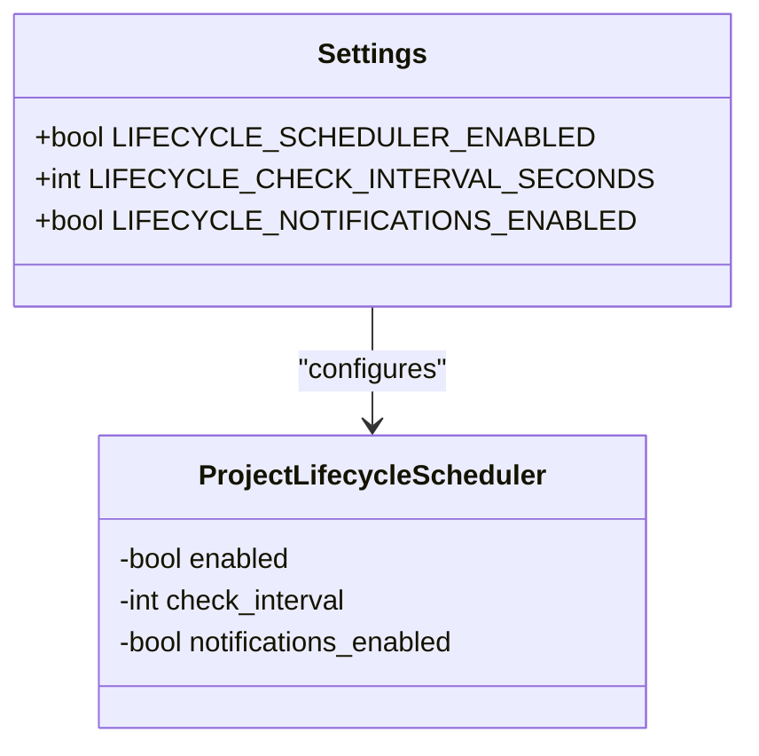

**Diagram sources **
- [config.py](file://vertex-ar/app/config.py#L180-L184)
- [project_lifecycle.py](file://vertex-ar/app/project_lifecycle.py#L20-L24)

## Initialization Process
The Lifecycle Scheduler is initialized as part of the application startup process. When the FastAPI application is created, the ProjectLifecycleScheduler instance is instantiated and configured based on the application settings. The initialization occurs in the `__init__` method of the ProjectLifecycleScheduler class, where it reads the configuration values from the global settings object.

The scheduler instance is created as a global variable named `project_lifecycle_scheduler`, making it accessible throughout the application. During initialization, the scheduler sets its internal state based on the configuration options, including whether it is enabled, the check interval, and whether notifications are enabled.

The actual startup of the scheduler occurs through the FastAPI application's event system. In the `main.py` file, an `on_event("startup")` decorator is used to register a function that starts the lifecycle scheduler when the application begins. This function creates an asynchronous task that runs the scheduler's main loop, ensuring it operates independently of other application processes.

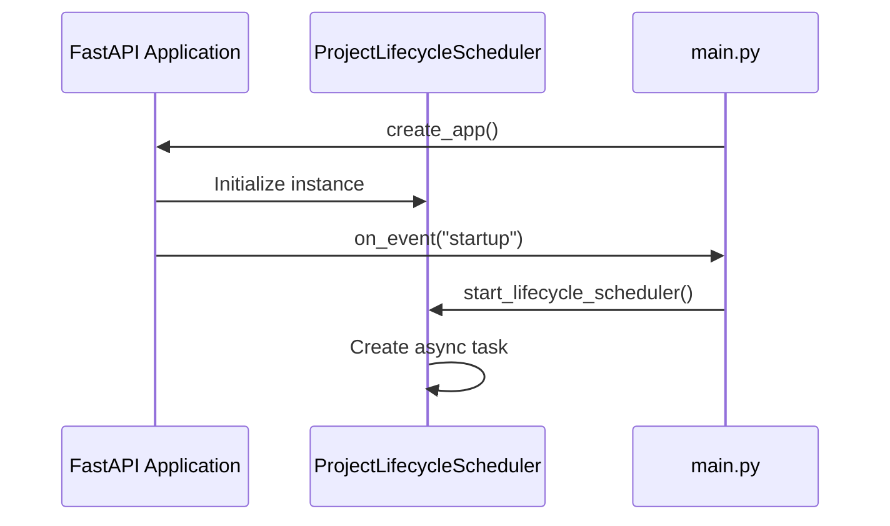

**Diagram sources **
- [main.py](file://vertex-ar/app/main.py#L295-L307)
- [project_lifecycle.py](file://vertex-ar/app/project_lifecycle.py#L20-L24)

## Lifecycle Status Calculation
The core functionality of calculating lifecycle statuses is implemented in the `calculate_lifecycle_status` method of the ProjectLifecycleScheduler class. This method determines the current status of a portrait based on its subscription end date compared to the current time. The status calculation follows a simple but effective logic:

- **Active**: When the subscription end date is more than 7 days in the future
- **Expiring**: When the subscription end date is 7 days or less in the future, but not yet expired
- **Archived**: When the subscription end date has passed

The method takes a subscription_end datetime parameter and compares it to the current UTC time. It first checks if the subscription has already expired by comparing the subscription_end with the current time. If expired, it returns 'archived'. Otherwise, it calculates the number of days remaining by converting the time difference from seconds to days. If the remaining days are 7 or less, it returns 'expiring'; otherwise, it returns 'active'.

This calculation is used both for updating the portrait's lifecycle status in the database and for determining when to send time-based notifications. The method is called for each portrait during the lifecycle check process, ensuring that statuses are updated accurately based on the current time and subscription deadlines.

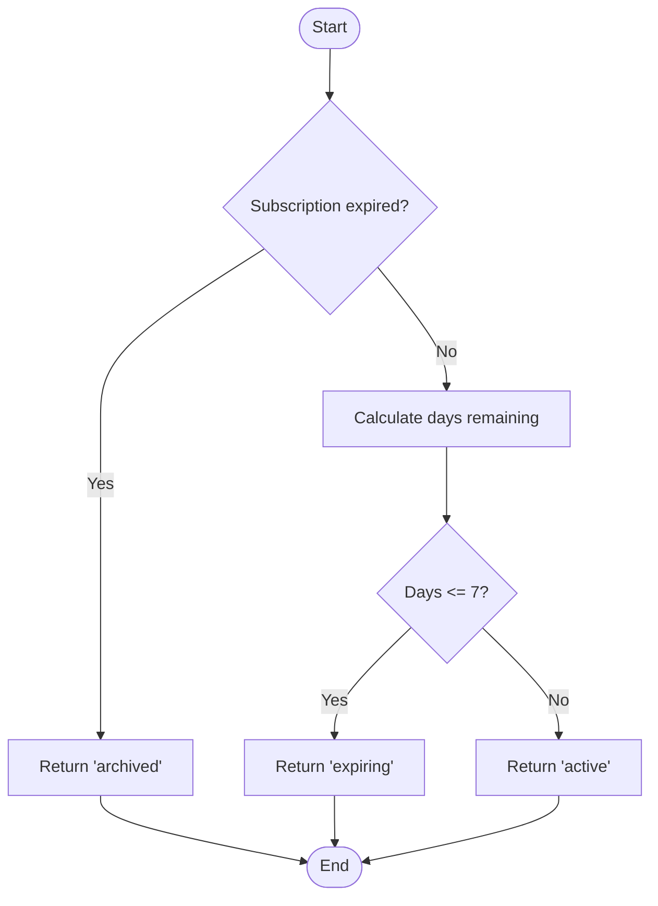

**Diagram sources **
- [project_lifecycle.py](file://vertex-ar/app/project_lifecycle.py#L38-L57)

## Scheduler Execution Pattern
The Lifecycle Scheduler uses asyncio to implement a non-blocking, periodic execution pattern. The main execution loop is defined in the `start_lifecycle_scheduler` method, which runs as an infinite loop that periodically checks and updates lifecycle statuses. The execution pattern follows these steps:

1. Check if the scheduler is enabled; if not, log a message and return
2. Enter an infinite loop that:
   - Calls `check_and_update_lifecycle_statuses` to process all portraits
   - Sleeps for the configured interval using `asyncio.sleep`
   - Handles any exceptions that occur during processing
   - Continues the loop even after errors to ensure resilience

The use of asyncio allows the scheduler to perform its tasks without blocking the main application thread. The `asyncio.sleep` function is used to pause execution for the specified interval, yielding control back to the event loop so other asynchronous tasks can run. This approach ensures that the scheduler doesn't consume CPU resources when idle and can coexist with other background tasks like the video animation scheduler and monitoring system.

The infinite loop pattern with error handling ensures that the scheduler continues running even if individual operations fail. If an exception occurs during the lifecycle check process, it is logged, and the scheduler continues after the sleep interval, preventing a single error from stopping the entire scheduling process.

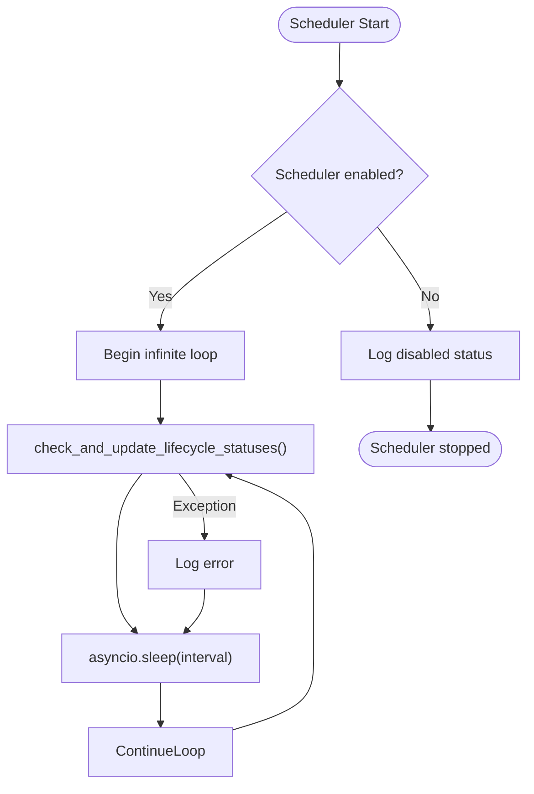

**Diagram sources **
- [project_lifecycle.py](file://vertex-ar/app/project_lifecycle.py#L518-L537)

## Database Interaction
The Lifecycle Scheduler interacts with the database through several methods that retrieve portraits for lifecycle checks, update their statuses, and record notification events. The primary database interactions include:

- **get_portraits_for_lifecycle_check**: Retrieves all portraits that have a subscription_end date set, which are candidates for lifecycle processing
- **update_portrait_lifecycle_status**: Updates the lifecycle_status field of a portrait in the database when the status changes
- **record_lifecycle_notification**: Records when a notification has been sent by updating timestamp fields for 7-day, 24-hour, or expired notifications

The scheduler obtains a database instance through the `get_database` method, which accesses the database connection stored in the FastAPI application state. This ensures that the scheduler uses the same database connection as the rest of the application, maintaining consistency and avoiding connection issues.

The database schema includes specific fields to support lifecycle management:
- **subscription_end**: Stores the subscription end date/time for each portrait
- **lifecycle_status**: Stores the current status (active, expiring, archived)
- **notification_7days_sent**: Timestamp when the 7-day notification was sent
- **notification_24hours_sent**: Timestamp when the 24-hour notification was sent
- **notification_expired_sent**: Timestamp when the expired notification was sent

These fields allow the scheduler to track both the current state of each portrait and the history of notifications sent, preventing duplicate notifications and enabling accurate status calculations.

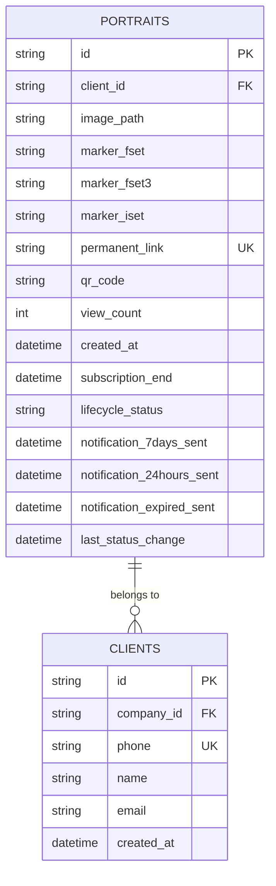

**Diagram sources **
- [database.py](file://vertex-ar/app/database.py#L351-L373)
- [project_lifecycle.py](file://vertex-ar/app/project_lifecycle.py#L107-L128)

## Notification System
The Lifecycle Scheduler implements a comprehensive notification system that alerts both clients and administrators about subscription status changes. The system is designed to send notifications at key points in the subscription lifecycle: 7 days before expiration, 24 hours before expiration, and after expiration. The notification system follows a structured approach to ensure reliable delivery and prevent duplicate messages.

The core of the notification system consists of three main components:
1. **Status change notifications**: Triggered when a portrait's lifecycle status changes, particularly when transitioning to 'archived'
2. **Time-based notifications**: Sent at specific intervals before and after expiration based on the subscription end date
3. **Notification persistence**: Records when notifications are sent to prevent duplicates in subsequent checks

Each notification type has corresponding methods to determine if a notification should be sent (`should_send_*`) and to send the notification (`send_*`). The system checks the notification sent flags in the database before sending any notification, ensuring that each notification type is only sent once per subscription period.

The notification system is configurable through the `LIFECYCLE_NOTIFICATIONS_ENABLED` setting, allowing administrators to disable notifications while keeping the status update functionality active. This flexibility is useful for testing or when temporarily suspending notifications.

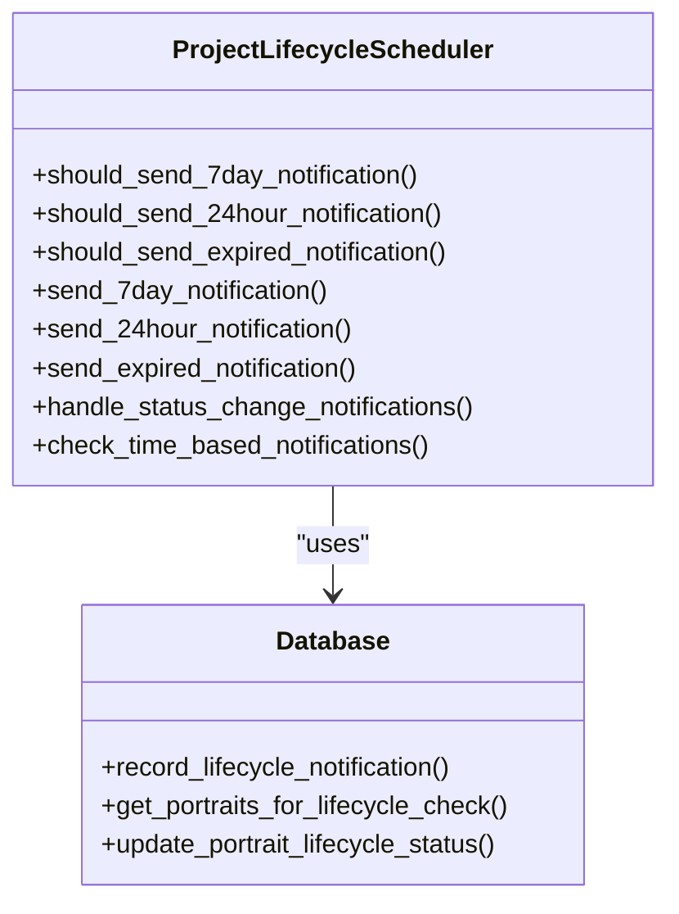

**Diagram sources **
- [project_lifecycle.py](file://vertex-ar/app/project_lifecycle.py#L59-L406)

## Time-based Notifications
The time-based notification system is a critical component of the Lifecycle Scheduler, designed to proactively inform clients about upcoming subscription expirations. The system implements three distinct notification levels based on the time remaining until expiration:

- **7-day notification**: Sent when a subscription has 7 days or less remaining, but is not yet expired. This serves as an early warning to clients, giving them ample time to renew their subscription.
- **24-hour notification**: Sent when a subscription has 24 hours or less remaining, but is not yet expired. This acts as a final reminder before expiration, creating urgency for renewal.
- **Post-expiry notification**: Sent after a subscription has expired, informing the client that their portrait has been archived and providing information on how to restore access.

Each notification type has a corresponding `should_send_*` method that determines whether the notification should be sent based on two criteria: whether the subscription deadline meets the time threshold and whether the notification has already been sent. This prevents duplicate notifications during subsequent scheduler runs.

The timing calculations are performed using UTC time to ensure consistency across different timezones. The system calculates the time difference between the current time and the subscription end date, converting it to days or hours as needed for comparison with the notification thresholds.

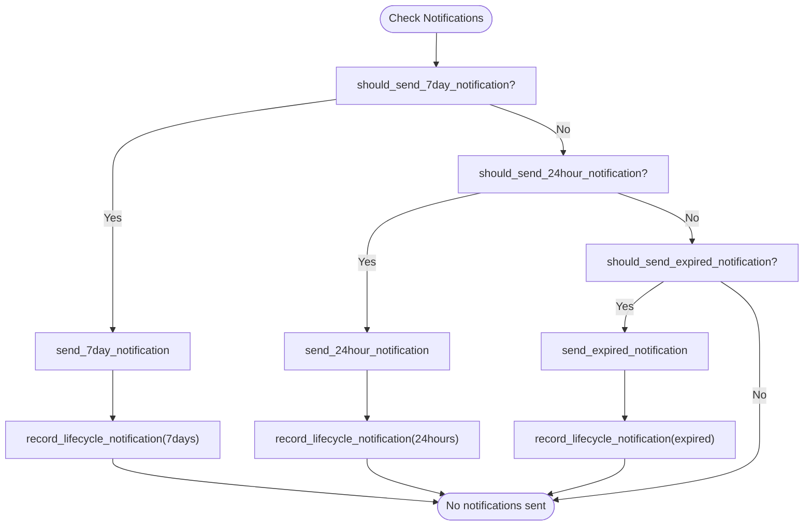

**Diagram sources **
- [project_lifecycle.py](file://vertex-ar/app/project_lifecycle.py#L59-L102)

## Integration with Email Service
The Lifecycle Scheduler integrates with the application's email service to send notifications to clients when their subscriptions are nearing expiration or have expired. The integration is implemented through the `send_client_email` method, which acts as a bridge between the scheduler and the email service.

When a notification should be sent, the scheduler retrieves the client's email address from the database and prepares a message with appropriate subject and body content. The message content is localized in both Russian and English to accommodate different client preferences. The scheduler then calls the email service to send the message, passing the recipient, subject, and body.

The email service integration includes several important features:
- **Persistent queue**: Uses a persistent email queue for reliable delivery, ensuring notifications are not lost if the application restarts
- **Retry mechanism**: Implements exponential backoff retry logic for failed email deliveries
- **Priority handling**: Assigns medium priority to lifecycle notifications, balancing timely delivery with system resource usage
- **Urgent flag**: Sets urgent=False for lifecycle notifications, allowing them to use the persistent queue rather than immediate delivery

The integration also includes comprehensive error handling and logging. If an email fails to send, the error is logged, and the failure is recorded in the notification history table. This allows administrators to monitor notification delivery success rates and troubleshoot any issues with the email service.

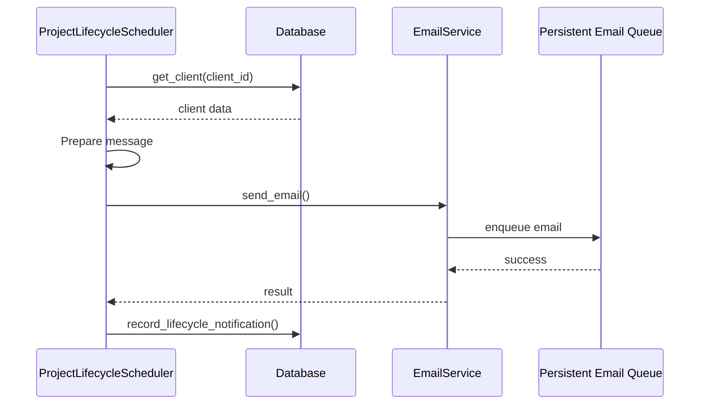

**Diagram sources **
- [project_lifecycle.py](file://vertex-ar/app/project_lifecycle.py#L407-L472)
- [email_service.py](file://vertex-ar/app/email_service.py#L293-L363)

## Telegram Alert System
In addition to client email notifications, the Lifecycle Scheduler integrates with a Telegram alert system to notify administrators about important subscription events. The Telegram integration is implemented through the `alert_manager` instance, which provides a centralized alerting system for the entire application.

When a lifecycle notification is triggered, the scheduler sends a formatted message to Telegram using the `send_telegram_alert` method. The message includes key information such as:
- The client's name and phone number
- The portrait ID
- The subscription expiration date
- The number of days or hours remaining
- Appropriate emoji indicators for the notification type

The Telegram messages use Markdown formatting to enhance readability, with bold text and line breaks to organize the information. Different emoji are used to distinguish between notification types:
- ⚠️ for 7-day warnings
- 🚨 for 24-hour warnings
- ⚫️ for post-expiry notifications

The alert manager handles the actual communication with the Telegram API, managing the bot token and chat IDs. It retrieves these credentials from the database configuration, falling back to environment variables if necessary. The system includes error handling to manage API failures and logs all alert attempts in the notification history table for auditing purposes.

The Telegram alert system serves as a secondary notification channel, ensuring that administrators are aware of important subscription events even if email delivery fails. This dual-channel approach increases the reliability of the notification system and provides administrators with timely information to follow up with clients.

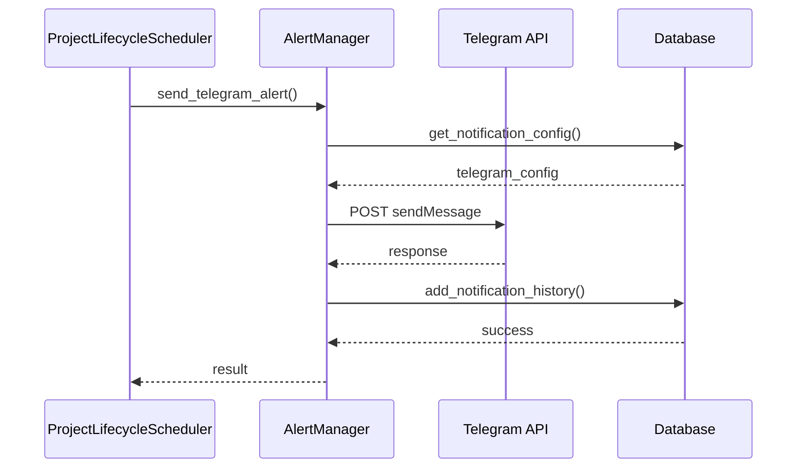

**Diagram sources **
- [project_lifecycle.py](file://vertex-ar/app/project_lifecycle.py#L236-L237)
- [alerting.py](file://vertex-ar/app/alerting.py#L23-L115)

## Error Handling and Recovery
The Lifecycle Scheduler implements comprehensive error handling and recovery mechanisms to ensure reliable operation in production environments. The system is designed to gracefully handle various types of errors, from database connectivity issues to notification service failures, without interrupting the overall scheduling process.

Key error handling features include:

- **Try-except blocks**: Each major operation is wrapped in try-except blocks to catch and handle exceptions locally
- **Detailed logging**: All errors are logged with descriptive messages, including the portrait ID and error details, facilitating troubleshooting
- **Continuation after errors**: The scheduler continues processing subsequent portraits even if an error occurs with one portrait
- **Infinite loop resilience**: The main scheduling loop continues running even after exceptions, with errors logged and processing resuming after the sleep interval

The error handling is implemented at multiple levels:
1. **Portrait-level errors**: When processing individual portraits, exceptions are caught and logged, but the scheduler continues with the next portrait
2. **Batch-level errors**: Errors in the overall lifecycle check process are caught, logged, and the scheduler continues after the configured interval
3. **Notification errors**: Failures in sending notifications are handled separately, ensuring that one failed notification doesn't affect status updates or other notifications

The system also includes specific error handling for common issues such as missing clients, invalid datetime formats, and database connectivity problems. For example, when a portrait's client cannot be found, the scheduler logs a warning but continues processing other portraits rather than failing the entire batch.

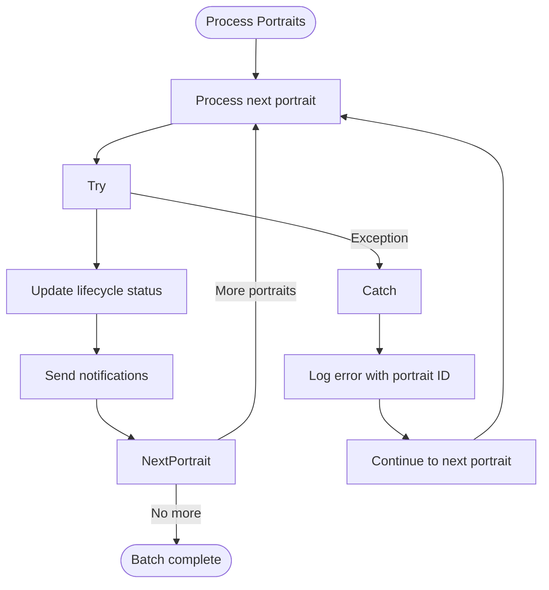

**Diagram sources **
- [project_lifecycle.py](file://vertex-ar/app/project_lifecycle.py#L141-L143)
- [project_lifecycle.py](file://vertex-ar/app/project_lifecycle.py#L150-L152)

## Timezone Handling
The Lifecycle Scheduler handles datetime operations using UTC time to ensure consistency across different timezones and prevent issues related to daylight saving time changes. When processing subscription end dates, the system follows a specific pattern to handle timezone-aware and timezone-naive datetime objects.

The subscription_end field in the database is stored as an ISO format string, which may include timezone information (indicated by a 'Z' suffix for UTC). When parsing this string, the scheduler uses `datetime.fromisoformat` with string replacement to handle the 'Z' suffix properly. If the parsed datetime object has timezone information, it is removed by replacing the tzinfo attribute with None, converting it to a timezone-naive datetime in UTC.

This approach ensures that all datetime comparisons are performed in UTC, eliminating potential issues with timezone conversions. The system assumes that all subscription end dates are specified in UTC, which simplifies the logic and avoids ambiguity. When displaying dates to users, the application is responsible for converting UTC times to the appropriate local timezone.

The timezone handling is implemented in the `check_and_update_lifecycle_statuses` method, where the subscription_end string is parsed and normalized to a timezone-naive UTC datetime before any calculations are performed. This ensures consistent behavior regardless of the original timezone information in the stored datetime string.

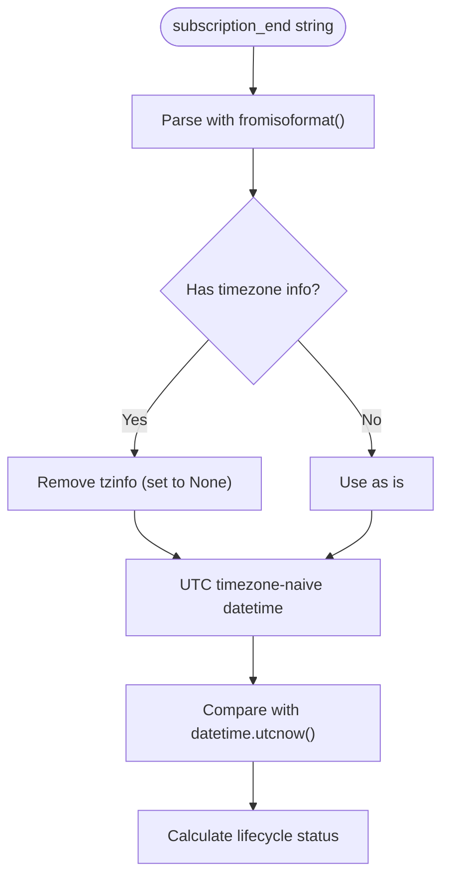

**Diagram sources **
- [project_lifecycle.py](file://vertex-ar/app/project_lifecycle.py#L117-L120)

## Troubleshooting
When troubleshooting issues with the Lifecycle Scheduler, several common problems and their solutions should be considered:

**Scheduler not running**: Verify that the `LIFECYCLE_SCHEDULER_ENABLED` setting is set to true in the environment variables. Check the application logs for messages indicating that the scheduler has started.

**Notifications not being sent**: Ensure that `LIFECYCLE_NOTIFICATIONS_ENABLED` is set to true. Verify that the SMTP configuration is properly set in the database through the admin interface, as environment-based SMTP credentials are deprecated for security reasons.

**Duplicate notifications**: This may occur if the notification sent flags are not being recorded properly. Check that the `record_lifecycle_notification` method is being called after successful notification delivery and that the database updates are being committed.

**Incorrect status calculations**: Verify that the subscription_end dates are stored in the correct ISO format and that the timezone handling is working as expected. Ensure that the system clock is synchronized and accurate.

**Performance issues**: If the scheduler is taking too long to process portraits, consider optimizing database queries or adjusting the check interval. The system should handle large numbers of portraits efficiently, but very large datasets may require tuning.

**Error logs**: Monitor the application logs for error messages related to the lifecycle scheduler. Common issues include database connectivity problems, invalid datetime formats, and notification service failures. The logs provide detailed information about the portrait ID and error context, facilitating targeted troubleshooting.

**Testing**: Use the unit tests in `test_lifecycle_scheduler.py` to verify the core functionality of the scheduler, including status calculations and notification logic. These tests can help identify issues in the business logic.

**Section sources**
- [project_lifecycle.py](file://vertex-ar/app/project_lifecycle.py#L1-L541)
- [test_lifecycle_scheduler.py](file://vertex-ar/test_files/unit/test_lifecycle_scheduler.py#L1-L203)