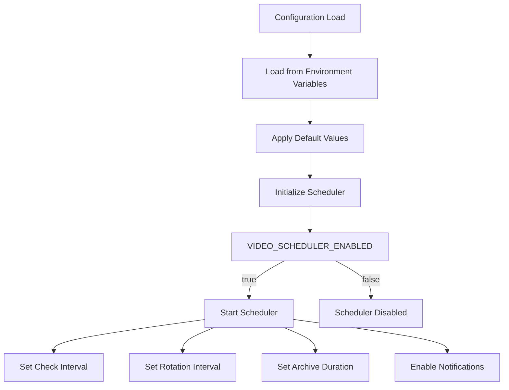
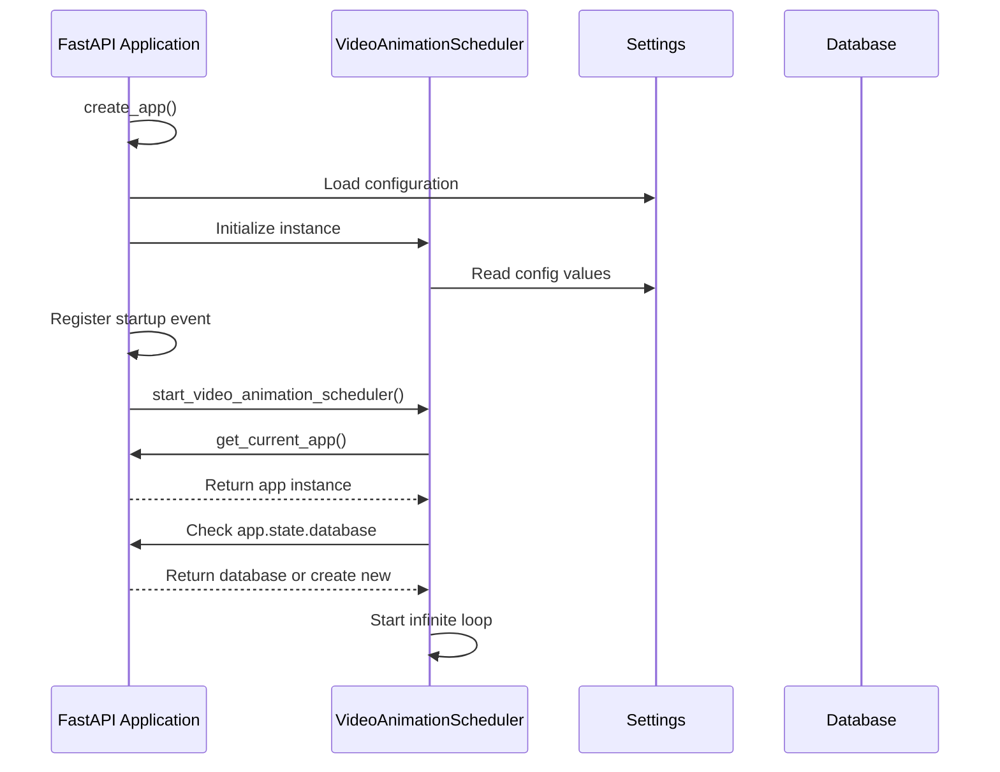
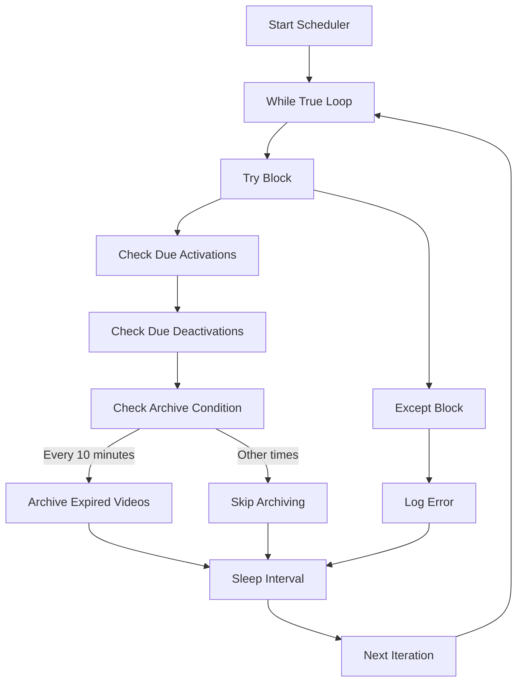
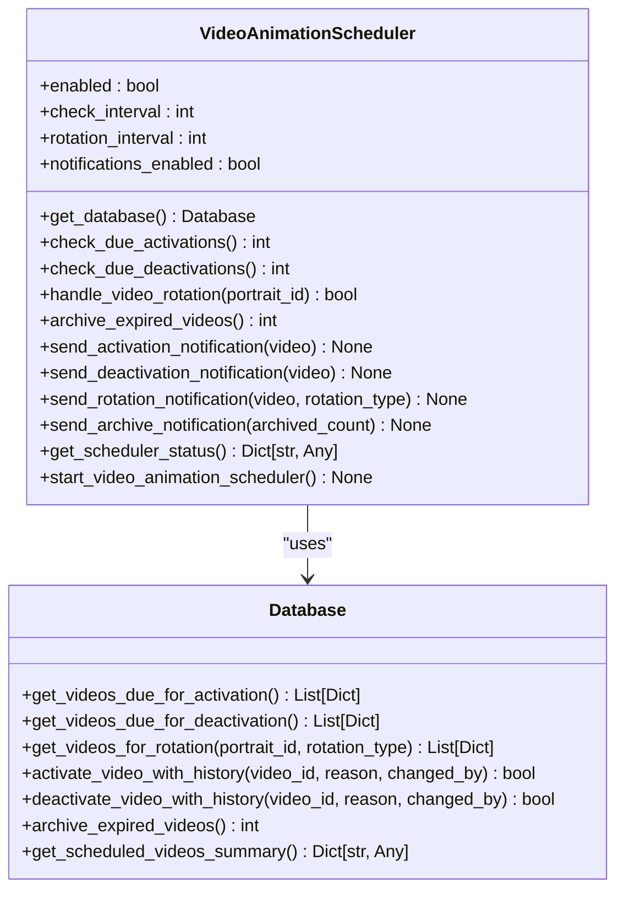
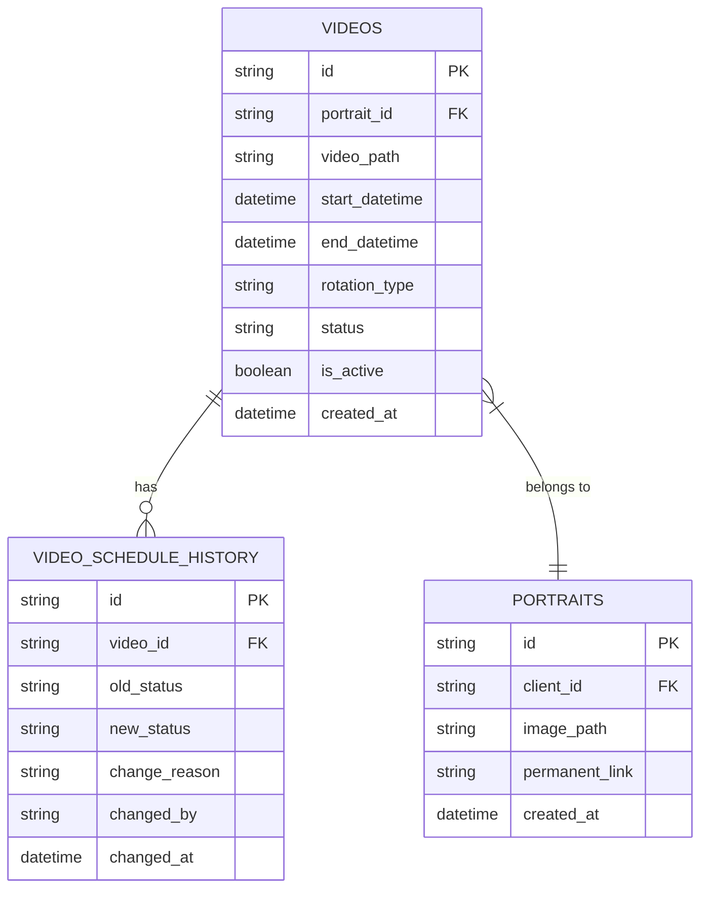
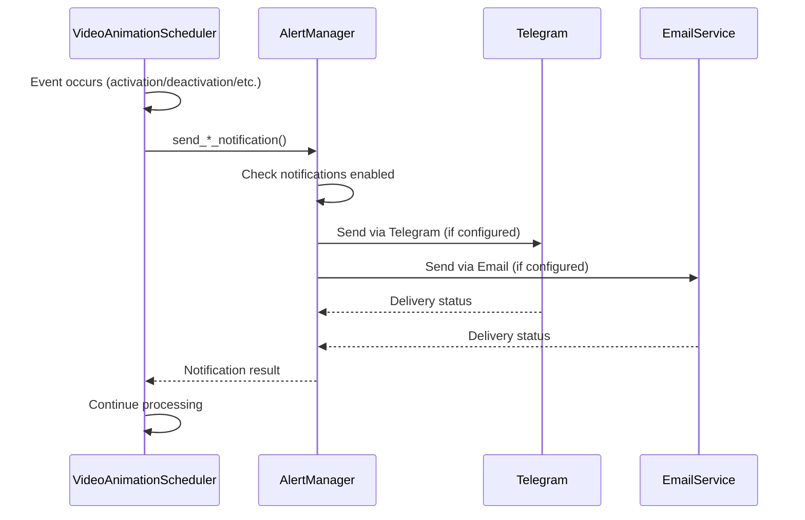
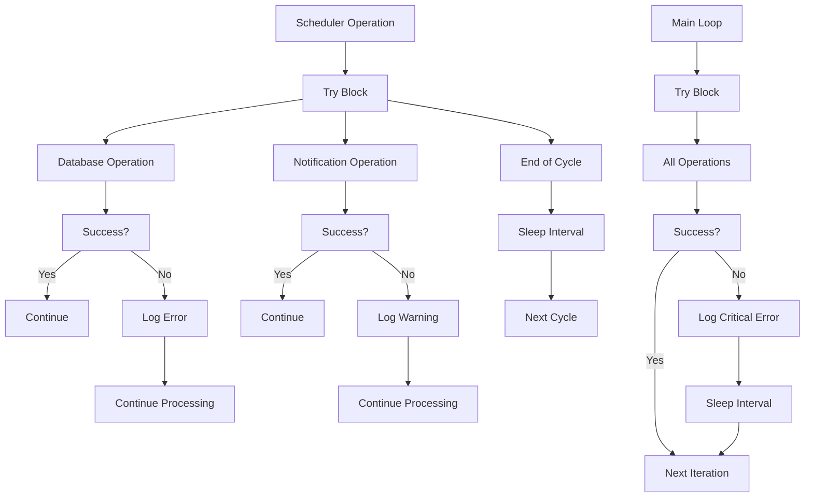
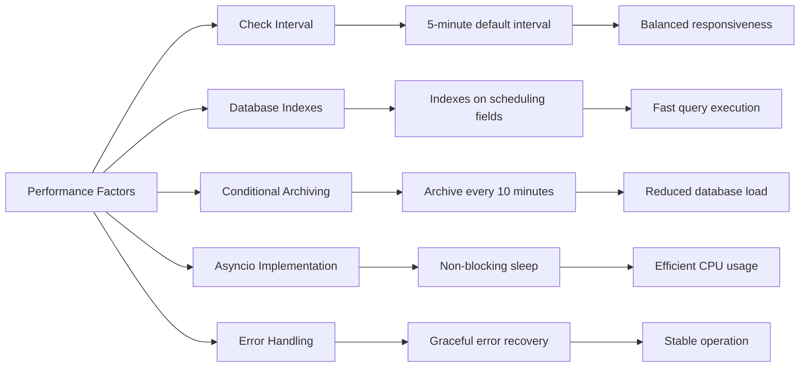

# Video Animation Scheduler

<cite>
**Referenced Files in This Document**   
- [video_animation_scheduler.py](file://vertex-ar/app/video_animation_scheduler.py)
- [config.py](file://vertex-ar/app/config.py)
- [database.py](file://vertex-ar/app/database.py)
- [main.py](file://vertex-ar/app/main.py)
- [alerting.py](file://vertex-ar/app/alerting.py)
- [docs/features/video-scheduler.md](file://docs/features/video-scheduler.md)
- [docs/features/video-scheduler-detailed.md](file://docs/features/video-scheduler-detailed.md)
- [docs/architecture/markers-storage-analysis.md](file://docs/architecture/markers-storage-analysis.md)
- [docs/archive/RELEASE_1.5.0_FINAL.md](file://docs/archive/RELEASE_1.5.0_FINAL.md)
</cite>

## Table of Contents
1. [Introduction](#introduction)
2. [Configuration Options](#configuration-options)
3. [Initialization Process](#initialization-process)
4. [Execution Patterns with Asyncio](#execution-patterns-with-asyncio)
5. [Core Functionality](#core-functionality)
6. [Database Interaction](#database-interaction)
7. [Notification System Integration](#notification-system-integration)
8. [Error Handling and Common Issues](#error-handling-and-common-issues)
9. [Performance and Resource Utilization](#performance-and-resource-utilization)
10. [Troubleshooting Guide](#troubleshooting-guide)

## Introduction

The Video Animation Scheduler is a background service component within the Vertex AR application responsible for managing the lifecycle of video animations based on predefined schedules. This sub-component automates the activation, deactivation, rotation, and archiving of videos according to time-based rules, reducing manual intervention and ensuring consistent content delivery.

The scheduler operates as an asynchronous background task integrated with the FastAPI application, checking for scheduled video changes at regular intervals. It supports various scheduling features including time-based activation/deactivation, sequential and cyclic video rotation, and automatic archiving of expired content. The system is designed to be robust, with comprehensive error handling and integration with notification systems for operational visibility.

This documentation provides a detailed explanation of the Video Animation Scheduler's implementation, covering its initialization process, execution patterns using asyncio, interaction with the main FastAPI application, configuration options, core functionality, database interactions, and notification integrations.

**Section sources**
- [video_animation_scheduler.py](file://vertex-ar/app/video_animation_scheduler.py#L1-L344)
- [docs/features/video-scheduler.md](file://docs/features/video-scheduler.md#L46-L80)
- [docs/features/video-scheduler-detailed.md](file://docs/features/video-scheduler-detailed.md#L19-L232)

## Configuration Options

The Video Animation Scheduler is controlled through several configuration options defined in the application settings. These settings allow administrators to enable/disable the scheduler and fine-tune its behavior according to their requirements.

The primary configuration options are:

- **VIDEO_SCHEDULER_ENABLED**: A boolean flag that enables or disables the video animation scheduler. When set to `true`, the scheduler runs as a background task; when `false`, it remains inactive.
- **VIDEO_SCHEDULER_CHECK_INTERVAL**: Specifies the interval in seconds between scheduler checks. The default value is 300 seconds (5 minutes), determining how frequently the system checks for videos that need activation or deactivation.
- **VIDEO_SCHEDULER_ROTATION_INTERVAL**: Defines the interval in seconds for video rotation checks. The default is 3600 seconds (1 hour), controlling how often the system evaluates whether video rotation should occur.
- **VIDEO_SCHEDULER_ARCHIVE_AFTER_HOURS**: Sets the number of hours after which expired videos are automatically archived. The default value is 168 hours (1 week), determining the retention period for videos after their scheduled end time.
- **VIDEO_SCHEDULER_NOTIFICATIONS_ENABLED**: A boolean flag that enables or disables notifications for scheduler events. When enabled, the system sends alerts for video activations, deactivations, rotations, and archiving operations.

These configuration values are loaded from environment variables through the `Settings` class in `config.py` and are used to initialize the `VideoAnimationScheduler` instance. The configuration system provides default values for all settings, ensuring the scheduler can operate even if specific environment variables are not defined.

**Diagram sources**
- [config.py](file://vertex-ar/app/config.py#L173-L178)
- [video_animation_scheduler.py](file://vertex-ar/app/video_animation_scheduler.py#L20-L25)

**Section sources**
- [config.py](file://vertex-ar/app/config.py#L173-L178)
- [docs/features/video-scheduler.md](file://docs/features/video-scheduler.md#L48-L63)
- [docs/architecture/markers-storage-analysis.md](file://docs/architecture/markers-storage-analysis.md#L627-L643)

## Initialization Process

The Video Animation Scheduler is initialized as part of the FastAPI application startup process. The initialization follows a dependency injection pattern where the scheduler instance is created and configured based on the application settings.

The initialization process begins when the `VideoAnimationScheduler` class is instantiated. During instantiation, the class constructor reads the configuration values from the global `settings` object, setting up the scheduler's operational parameters including whether it's enabled, the check interval, rotation interval, and notification settings.

The scheduler is integrated into the FastAPI application through the `on_event("startup")` decorator in `main.py`. When the application starts, FastAPI triggers the startup event, which creates an asynchronous task to run the scheduler's main loop. This integration ensures that the scheduler begins operation immediately when the application becomes available.

A key aspect of the initialization process is the lazy loading of the database connection. The scheduler doesn't maintain a direct reference to the database but instead uses the `get_database()` method to retrieve the database instance from the FastAPI application state. This approach ensures that the scheduler always accesses the same database connection used by the main application, maintaining data consistency and leveraging the application's connection management.

The initialization also includes setting up the global `video_animation_scheduler` instance, which serves as a singleton pattern implementation. This allows other components to access the scheduler without needing to create new instances, promoting consistency and reducing resource usage.

**Diagram sources**
- [main.py](file://vertex-ar/app/main.py#L282-L294)
- [video_animation_scheduler.py](file://vertex-ar/app/video_animation_scheduler.py#L20-L37)
- [video_animation_scheduler.py](file://vertex-ar/app/video_animation_scheduler.py#L343-L344)

**Section sources**
- [main.py](file://vertex-ar/app/main.py#L282-L294)
- [video_animation_scheduler.py](file://vertex-ar/app/video_animation_scheduler.py#L20-L37)
- [video_animation_scheduler.py](file://vertex-ar/app/video_animation_scheduler.py#L343-L344)

## Execution Patterns with Asyncio

The Video Animation Scheduler employs asyncio to implement a non-blocking, efficient execution pattern that runs as a background task within the FastAPI application. The core of the scheduler is an infinite asynchronous loop that periodically checks for video scheduling events without interfering with the main request-response cycle of the web application.

The execution pattern is centered around the `start_video_animation_scheduler()` method, which contains a `while True` loop that runs indefinitely once started. Within this loop, the scheduler performs several key operations in sequence: checking for due activations, checking for due deactivations, and conditionally archiving expired videos. After completing these operations, the scheduler uses `asyncio.sleep()` to pause for the configured check interval before repeating the cycle.

This approach leverages Python's asyncio library to yield control back to the event loop during the sleep period, allowing other asynchronous tasks to execute. The use of `asyncio.sleep()` instead of the traditional `time.sleep()` is crucial, as it prevents blocking the entire event loop and maintains the responsiveness of the application.

The scheduler's execution is designed to be resilient to errors. The entire loop body is wrapped in a try-except block that catches any exceptions that occur during execution. When an error is caught, it is logged, and the scheduler continues with the next iteration after sleeping for the check interval. This error handling strategy ensures that transient issues don't terminate the scheduler, maintaining continuous operation.

The execution pattern also includes a conditional check for archiving expired videos, which runs less frequently than the main activation/deactivation checks. This optimization reduces database load by performing the archiving operation only every 10 minutes (when the current minute is divisible by 10), rather than on every check cycle.

**Diagram sources**
- [video_animation_scheduler.py](file://vertex-ar/app/video_animation_scheduler.py#L315-L341)
- [video_animation_scheduler.py](file://vertex-ar/app/video_animation_scheduler.py#L332-L333)

**Section sources**
- [video_animation_scheduler.py](file://vertex-ar/app/video_animation_scheduler.py#L315-L341)
- [video_animation_scheduler.py](file://vertex-ar/app/video_animation_scheduler.py#L332-L333)

## Core Functionality

The Video Animation Scheduler provides several core functionalities that enable automated management of video content based on scheduling rules. These functionalities include checking for due activations and deactivations, handling video rotation (both sequential and cyclic), and archiving expired videos.

### Checking Due Activations and Deactivations

The scheduler periodically checks for videos that should be activated or deactivated based on their scheduled start and end times. The `check_due_activations()` method queries the database for videos that have a start time in the past but are not yet active, activating them if they meet the criteria. Similarly, the `check_due_deactivations()` method identifies videos whose end time has passed and deactivates them.

These checks use database queries that filter videos based on their status, activation state, and timing parameters. The scheduler ensures that only videos with the "active" status are considered for activation, preventing accidental activation of videos that have been manually set to inactive or archived.

### Video Rotation Handling

The scheduler supports two rotation types: sequential and cyclic. Sequential rotation activates videos in chronological order based on their start times, while cyclic rotation follows a round-robin pattern, activating the next inactive video in a sequence.

When a video is deactivated, the scheduler triggers the `handle_video_rotation()` method to determine if another video should be activated. For sequential rotation, the system finds the next video in the sequence that should be active based on current time. For cyclic rotation, it activates the first inactive video in the rotation group.

The rotation logic is implemented by querying the database for videos with the same rotation type and determining the appropriate video to activate based on the rotation strategy. This allows for flexible content management where multiple videos can be part of a rotation schedule.

### Archiving Expired Videos

The scheduler automatically archives videos whose end time has passed, moving them to an archived status after the configured retention period. The `archive_expired_videos()` method updates the status of expired videos to "archived" and sets their active state to false.

This archiving process helps maintain a clean content library by automatically removing expired content from active circulation while preserving it for historical reference. The archiving operation runs less frequently than the activation/deactivation checks to optimize performance.

**Diagram sources**
- [video_animation_scheduler.py](file://vertex-ar/app/video_animation_scheduler.py#L17-L344)
- [database.py](file://vertex-ar/app/database.py#L1682-L1830)

**Section sources**
- [video_animation_scheduler.py](file://vertex-ar/app/video_animation_scheduler.py#L39-L181)
- [database.py](file://vertex-ar/app/database.py#L1682-L1830)

## Database Interaction

The Video Animation Scheduler interacts extensively with the database to retrieve videos that require scheduling actions and to update their states. The database layer provides specific methods that the scheduler uses to implement its functionality, creating a clear separation between business logic and data access.

The scheduler accesses the database through the `get_database()` method, which retrieves the database instance from the FastAPI application state. This approach ensures that the scheduler uses the same database connection as the rest of the application, maintaining data consistency and leveraging the application's connection management.

Key database interactions include:

- **Retrieving videos for activation**: The `get_videos_due_for_activation()` method queries the database for videos that should be activated based on their start time and current status. This query filters videos that are scheduled to be active, have a start time in the past, and are not currently active.
- **Retrieving videos for deactivation**: The `get_videos_due_for_deactivation()` method identifies videos whose end time has passed and need to be deactivated. This query considers videos that are currently active but have an end time in the past.
- **Retrieving videos for rotation**: The `get_videos_for_rotation()` method fetches videos that are part of a rotation sequence for a specific portrait, allowing the scheduler to determine the next video to activate.
- **Updating video states**: The scheduler uses methods like `activate_video_with_history()` and `deactivate_video_with_history()` to change video states while recording the change in the video schedule history table.

The database schema includes specific fields to support video scheduling, such as `start_datetime`, `end_datetime`, `rotation_type`, and `status`. These fields are used in the scheduling logic to determine when videos should be activated, deactivated, or rotated.

The database also maintains a `video_schedule_history` table that records all state changes, providing an audit trail of scheduling actions. Each time the scheduler changes a video's state, it creates a history record with details about the change, including the reason and the actor (system).

**Diagram sources**
- [database.py](file://vertex-ar/app/database.py#L288-L305)
- [database.py](file://vertex-ar/app/database.py#L307-L320)
- [database.py](file://vertex-ar/app/database.py#L1682-L1830)

**Section sources**
- [database.py](file://vertex-ar/app/database.py#L288-L305)
- [database.py](file://vertex-ar/app/database.py#L307-L320)
- [database.py](file://vertex-ar/app/database.py#L1682-L1830)

## Notification System Integration

The Video Animation Scheduler integrates with the application's notification system to provide alerts for scheduling events, including video activations, deactivations, rotations, and archiving operations. This integration ensures that administrators are informed of automated changes to video content, enhancing operational visibility and accountability.

The notification system supports multiple channels, including Telegram and email, allowing administrators to receive alerts through their preferred communication methods. The scheduler uses the global `alert_manager` instance to send notifications, leveraging the application's centralized alerting infrastructure.

For each scheduling event, the scheduler calls specific notification methods:
- **Activation notifications**: Sent when a video is automatically activated based on its schedule
- **Deactivation notifications**: Sent when a video is automatically deactivated after its end time
- **Rotation notifications**: Sent when video rotation occurs, either sequentially or cyclically
- **Archiving notifications**: Sent when expired videos are automatically archived

Each notification includes relevant details about the event, such as the video ID, portrait ID, timing information, and rotation type. The notifications are formatted with appropriate emojis and markdown for better readability in Telegram, while email notifications include structured text with event details.

The notification system is configurable through the `VIDEO_SCHEDULER_NOTIFICATIONS_ENABLED` setting, allowing administrators to enable or disable scheduler notifications independently of other notification types. This provides flexibility in managing alert volume based on operational needs.

The integration with the notification system follows a fire-and-forget pattern, where notification failures are logged but don't affect the core scheduling operations. This ensures that issues with notification delivery don't impact the scheduler's primary function of managing video states.

**Diagram sources**
- [video_animation_scheduler.py](file://vertex-ar/app/video_animation_scheduler.py#L182-L292)
- [alerting.py](file://vertex-ar/app/alerting.py#L23-L216)

**Section sources**
- [video_animation_scheduler.py](file://vertex-ar/app/video_animation_scheduler.py#L182-L292)
- [alerting.py](file://vertex-ar/app/alerting.py#L23-L216)
- [docs/features/video-scheduler.md](file://docs/features/video-scheduler.md#L74-L80)

## Error Handling and Common Issues

The Video Animation Scheduler implements comprehensive error handling strategies to ensure reliable operation in production environments. The error handling approach focuses on resilience, logging, and graceful degradation to maintain scheduler availability even when individual operations fail.

The primary error handling mechanism is a try-except block that wraps the entire main loop in the `start_video_animation_scheduler()` method. This ensures that any unhandled exceptions during the scheduling cycle are caught, logged, and don't terminate the scheduler process. After logging the error, the scheduler continues with the next iteration after sleeping for the configured check interval.

For database operations, each scheduling method (activation, deactivation, rotation, archiving) has its own try-except block. This granular error handling allows the scheduler to continue processing other videos even if an operation fails for a specific video. Failed operations are logged with detailed error messages, including the video ID and the nature of the failure.

Common issues that may occur during scheduler execution include:

- **Database connection failures**: These can occur due to database server issues, network problems, or connection timeouts. The scheduler handles these by logging the error and continuing with the next iteration, relying on the next check cycle to retry the operation.
- **Notification delivery failures**: Issues with Telegram or email services may prevent notifications from being delivered. The scheduler logs these failures but continues with its core scheduling functions.
- **Data consistency issues**: Problems with video scheduling data, such as invalid timestamps or conflicting schedules, are handled by skipping the affected videos and logging appropriate warnings.

The scheduler also includes specific error handling for notification operations, with separate try-except blocks for Telegram and email notifications. This ensures that a failure in one notification channel doesn't prevent attempts to send through other channels.

**Diagram sources**
- [video_animation_scheduler.py](file://vertex-ar/app/video_animation_scheduler.py#L66-L68)
- [video_animation_scheduler.py](file://vertex-ar/app/video_animation_scheduler.py#L100-L102)
- [video_animation_scheduler.py](file://vertex-ar/app/video_animation_scheduler.py#L338-L340)

**Section sources**
- [video_animation_scheduler.py](file://vertex-ar/app/video_animation_scheduler.py#L66-L68)
- [video_animation_scheduler.py](file://vertex-ar/app/video_animation_scheduler.py#L100-L102)
- [video_animation_scheduler.py](file://vertex-ar/app/video_animation_scheduler.py#L338-L340)

## Performance and Resource Utilization

The Video Animation Scheduler is designed with performance and resource efficiency in mind, minimizing its impact on the overall application while maintaining reliable scheduling operations. The scheduler's architecture incorporates several optimizations to ensure efficient resource utilization.

The primary performance consideration is the scheduling check interval, which balances responsiveness with resource usage. With a default interval of 300 seconds (5 minutes), the scheduler performs its checks frequently enough to ensure timely video activations and deactivations while avoiding excessive database queries that could impact performance.

Database queries are optimized through the use of appropriate indexes on key scheduling fields. The database schema includes indexes on `start_datetime`, `end_datetime`, `status`, and `portrait_id` fields, enabling efficient retrieval of videos that need scheduling actions. These indexes significantly reduce query execution time, especially as the number of videos grows.

The scheduler implements a conditional archiving operation that runs less frequently than the main scheduling checks. By performing archiving only every 10 minutes (when the current minute is divisible by 10), the scheduler reduces database load while still maintaining timely cleanup of expired content.

Resource utilization is further optimized through the use of asyncio, which allows the scheduler to yield control back to the event loop during sleep periods. This non-blocking approach ensures that the scheduler doesn't consume CPU resources when idle, allowing other application tasks to execute efficiently.

The error handling strategy also contributes to performance stability by preventing cascading failures. By catching and logging exceptions without terminating the scheduler, the system maintains continuous operation even when individual operations fail, reducing the need for restarts and associated resource overhead.

**Diagram sources**
- [video_animation_scheduler.py](file://vertex-ar/app/video_animation_scheduler.py#L332-L333)
- [database.py](file://vertex-ar/app/database.py#L323-L334)
- [video_animation_scheduler.py](file://vertex-ar/app/video_animation_scheduler.py#L336)

**Section sources**
- [video_animation_scheduler.py](file://vertex-ar/app/video_animation_scheduler.py#L332-L333)
- [database.py](file://vertex-ar/app/database.py#L323-L334)
- [video_animation_scheduler.py](file://vertex-ar/app/video_animation_scheduler.py#L336)

## Troubleshooting Guide

This section addresses common issues that may occur with the Video Animation Scheduler and provides solutions for diagnosis and resolution.

### Video Not Activating Automatically

If videos are not activating automatically according to their schedule:

1. Verify that `VIDEO_SCHEDULER_ENABLED=true` in the environment configuration
2. Check that the video's start time is in the future relative to the server time
3. Ensure the video status is set to "active" in the database
4. Verify that the scheduler is running by checking application logs for "Starting video animation scheduler" messages
5. Confirm that the database connection is available and responsive

### Notifications Not Being Sent

If scheduler notifications are not being delivered:

1. Check that `VIDEO_SCHEDULER_NOTIFICATIONS_ENABLED=true` in the configuration
2. Verify that Telegram and/or email settings are properly configured in the notification settings
3. Ensure that the Telegram bot token and chat ID are correctly set in environment variables or database settings
4. Confirm that SMTP settings are properly configured for email notifications
5. Check application logs for error messages related to notification sending

### Database Connection Failures

If the scheduler encounters database connection issues:

1. Verify that the database file is accessible and has proper read/write permissions
2. Check that the database is not locked by another process
3. Ensure that the database path is correctly configured in the application settings
4. Monitor disk space and ensure the system has sufficient storage
5. Review database connection settings and timeout configurations

### Scheduler Not Starting

If the scheduler fails to start with the application:

1. Check application startup logs for errors related to scheduler initialization
2. Verify that the `video_animation_scheduler.py` module is properly imported
3. Ensure that all required dependencies are installed and available
4. Confirm that the FastAPI application is correctly registering the startup event
5. Check for syntax errors or import issues in the scheduler code

Regular monitoring of application logs is recommended to identify and address issues promptly. The logs provide detailed information about scheduler operations, including successful activations/deactivations and any errors that occur during execution.

**Section sources**
- [docs/features/video-scheduler-detailed.md](file://docs/features/video-scheduler-detailed.md#L209-L225)
- [video_animation_scheduler.py](file://vertex-ar/app/video_animation_scheduler.py#L66-L68)
- [video_animation_scheduler.py](file://vertex-ar/app/video_animation_scheduler.py#L100-L102)