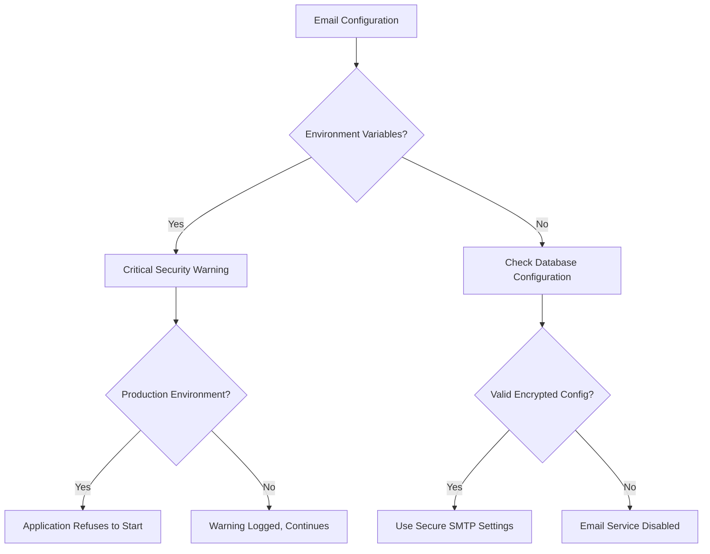

# Environment Variables

<cite>
**Referenced Files in This Document**   
- [.env.example](file://vertex-ar/.env.example)
- [.env.production.example](file://vertex-ar/.env.production.example)
- [config.py](file://vertex-ar/app/config.py)
- [EMAIL_MIGRATION.md](file://docs/EMAIL_MIGRATION.md)
- [logging_setup.py](file://vertex-ar/logging_setup.py)
- [encryption.py](file://vertex-ar/app/encryption.py)
- [notification_config.py](file://vertex-ar/app/notification_config.py)
</cite>

## Table of Contents
1. [Introduction](#introduction)
2. [Core Application Settings](#core-application-settings)
3. [Security Configuration](#security-configuration)
4. [Storage Configuration](#storage-configuration)
5. [Email and Notification Settings](#email-and-notification-settings)
6. [Monitoring and Alerting](#monitoring-and-alerting)
7. [Backup and Scheduler Configuration](#backup-and-scheduler-configuration)
8. [Performance and Resource Tuning](#performance-and-resource-tuning)
9. [Configuration Hierarchy and Environment Management](#configuration-hierarchy-and-environment-management)
10. [Security Best Practices](#security-best-practices)
11. [Troubleshooting Common Issues](#troubleshooting-common-issues)
12. [Conclusion](#conclusion)

## Introduction

The Vertex AR application utilizes a comprehensive environment variable configuration system to manage application settings, security parameters, storage configurations, and service integrations. This documentation provides a detailed overview of all available environment variables, their purposes, default values, and security implications across different deployment environments.

The configuration system follows a hierarchical approach with distinct configuration files for development, staging, and production environments. The application prioritizes security, particularly for sensitive credentials, by implementing encrypted storage and deprecating environment-based configuration for critical security variables.

The primary configuration files are:
- `.env.example`: Development template with default values
- `.env.production.example`: Production configuration template with secure defaults
- `config.py`: Central configuration management module that loads and validates environment variables

This documentation will detail each configuration category, explain the configuration hierarchy between environments, and provide guidance on secure handling practices for sensitive variables.

**Section sources**
- [.env.example](file://vertex-ar/.env.example)
- [.env.production.example](file://vertex-ar/.env.production.example)
- [config.py](file://vertex-ar/app/config.py)

## Core Application Settings

The core application settings control fundamental aspects of the Vertex AR application's behavior, including debug mode, host configuration, and base URLs.

### Debug and Development Settings
The DEBUG variable controls whether the application runs in development mode with detailed error messages and automatic reloading:

- **DEBUG**: Enables debug mode (default: `True` in development, `False` in production)
- **RELOAD**: Enables auto-reload on code changes (development only, default: `True`)
- **SHOW_ERROR_DETAILS**: Displays detailed error pages (default: `True` in development)

### Host and URL Configuration
These variables define how the application is accessed and the base URLs for resource generation:

- **APP_HOST**: Network interface to bind to (default: `0.0.0.0`)
- **APP_PORT**: Port to listen on (default: `8000`)
- **BASE_URL**: Public base URL for generating AR links and QR codes (default: `http://localhost:8000`)
- **INTERNAL_HEALTH_URL**: Internal health check URL for monitoring (optional, auto-built from APP_HOST/APP_PORT if not set)

### Version and Path Settings
The application automatically determines version information and file paths:

- **VERSION**: Application version (read from VERSION file, defaults to `1.3.0`)
- **BASE_DIR**: Application base directory (auto-detected)
- **DB_DIR**: Database directory (uses `/app/data` in Docker, otherwise BASE_DIR)
- **STORAGE_ROOT**: Root directory for file storage (default: `./storage`)

**Section sources**
- [.env.example](file://vertex-ar/.env.example#L8-L27)
- [config.py](file://vertex-ar/app/config.py#L18-L41)

## Security Configuration

The security configuration section covers critical security parameters including authentication, encryption, and access control settings.

### Authentication and Session Management
The application implements robust authentication controls with configurable security parameters:

- **SECRET_KEY**: Cryptographic key for JWT tokens and session management (default: `default-secret-key-change-in-production`)
- **SESSION_TIMEOUT_MINUTES**: Session timeout duration (default: `30` minutes)
- **AUTH_MAX_ATTEMPTS**: Maximum failed login attempts before lockout (default: `5`)
- **AUTH_LOCKOUT_MINUTES**: Duration of account lockout after failed attempts (default: `15` minutes)
- **TOKEN_EXPIRATION_HOURS**: JWT token expiration time (default: `24` hours)
- **BCRYPT_ROUNDS**: Password hashing complexity (default: `12`, higher values increase security but decrease performance)

### Cross-Origin Resource Sharing (CORS)
CORS settings control which domains can access the application's API:

- **CORS_ORIGINS**: Comma-separated list of allowed origins (default: `http://localhost:8000,http://127.0.0.1:8000`, use specific domains in production)
- **RATE_LIMIT_ENABLED**: Enables rate limiting for API requests (default: `true`)
- **RATE_LIMIT_AUTH**: Request limit for authenticated users (default: `100` per minute)
- **RATE_LIMIT_ANON**: Request limit for unauthenticated users (default: `20` per minute)

### Default Administrator Credentials
The application seeds a default administrator account on first run:

- **DEFAULT_ADMIN_USERNAME**: Default admin username (default: `superar`)
- **DEFAULT_ADMIN_PASSWORD**: Default admin password (default: `ffE48f0ns@HQ`)
- **DEFAULT_ADMIN_EMAIL**: Default admin email address (default: `superar@vertex-ar.local`)
- **DEFAULT_ADMIN_FULL_NAME**: Default admin full name (default: `Super Administrator`)

**Section sources**
- [.env.example](file://vertex-ar/.env.example#L11-L132)
- [config.py](file://vertex-ar/app/config.py#L43-L57)

## Storage Configuration

The storage configuration system provides flexible options for file storage with support for local storage and S3-compatible object storage.

### Storage Type Selection
The application supports multiple storage backends:

- **STORAGE_TYPE**: Storage backend type (`local` or `minio`, default: `local`)
- **STORAGE_PATH**: Local storage path (relative to application directory, default: `./storage`)

### MinIO/S3 Configuration
For scalable object storage, the application supports MinIO and other S3-compatible services:

- **MINIO_ENDPOINT**: MinIO server endpoint (without protocol, default: `localhost:9000`)
- **MINIO_ACCESS_KEY**: Access key for MinIO authentication (default: `minioadmin`)
- **MINIO_SECRET_KEY**: Secret key for MinIO authentication (default: `minioadmin`)
- **MINIO_BUCKET**: Bucket name for storing files (default: `vertex-ar`)
- **MINIO_SECURE**: Use HTTPS connection (default: `False`)
- **MINIO_PUBLIC_URL**: Public URL for accessing files (optional, for CDN or reverse proxy scenarios)

### File Upload Limits
The application enforces configurable limits on file uploads:

- **MAX_IMAGE_SIZE_MB**: Maximum image size in MB (default: `10`)
- **MAX_VIDEO_SIZE_MB**: Maximum video size in MB (default: `50`)
- **ALLOWED_IMAGE_FORMATS**: Comma-separated list of allowed image formats (default: `jpg,jpeg,png`)
- **ALLOWED_VIDEO_FORMATS**: Comma-separated list of allowed video formats (default: `mp4,webm`)

**Section sources**
- [.env.example](file://vertex-ar/.env.example#L42-L87)
- [config.py](file://vertex-ar/app/config.py#L65-L70)

## Email and Notification Settings

The email and notification system has undergone significant security enhancements, deprecating environment-based SMTP credentials in favor of secure database storage.

### Deprecated SMTP Configuration
The following SMTP variables are deprecated and should not be used in production:

- **SMTP_USERNAME**: ❌ Deprecated - do not use in production
- **SMTP_PASSWORD**: ❌ Deprecated - do not use in production

The application will display a critical security warning if these variables are detected and refuse to start in production mode.

### Secure SMTP Configuration
SMTP settings should be configured through the admin UI at `/admin/notification-settings` where credentials are encrypted at rest:

- **SMTP_HOST**: SMTP server hostname (default: `smtp.gmail.com`)
- **SMTP_PORT**: SMTP server port (default: `587`)
- **SMTP_USE_TLS**: Enable TLS encryption (default: `True`)
- **EMAIL_FROM**: Default sender email address (default: `noreply@vertex-ar.com`)
- **EMAIL_DEFAULT_FROM**: Fallback sender address (default: `noreply@vertex-ar.com`)
- **ADMIN_EMAILS**: Comma-separated list of admin notification emails (default: `admin@vertex-ar.com`)

### Email Retry Configuration
The application implements exponential backoff for email delivery retries:

- **EMAIL_RETRY_MAX_ATTEMPTS**: Maximum number of send attempts (default: `5`)
- **EMAIL_RETRY_DELAYS**: Comma-separated list of retry delays in seconds (default: `1,2,4,8,16` for exponential backoff)

### Notification Services
The application supports multiple notification channels:

- **TELEGRAM_BOT_TOKEN**: Telegram bot token for notifications
- **TELEGRAM_CHAT_ID**: Telegram chat ID for sending notifications
- **SENTRY_DSN**: Sentry DSN for error tracking and monitoring
- **GA_TRACKING_ID**: Google Analytics tracking ID (if analytics are enabled)

**Diagram sources**
- [.env.example](file://vertex-ar/.env.example#L158-L188)
- [config.py](file://vertex-ar/app/config.py#L75-L113)
- [EMAIL_MIGRATION.md](file://docs/EMAIL_MIGRATION.md)

**Section sources**
- [.env.example](file://vertex-ar/.env.example#L158-L188)
- [config.py](file://vertex-ar/app/config.py#L75-L113)
- [EMAIL_MIGRATION.md](file://docs/EMAIL_MIGRATION.md)

## Monitoring and Alerting

The application includes a comprehensive monitoring and alerting system with configurable thresholds and notification settings.

### System Resource Thresholds
The monitoring system tracks key system metrics with configurable alert thresholds:

- **CPU_THRESHOLD**: CPU usage percentage threshold (default: `80.0%`)
- **MEMORY_THRESHOLD**: Memory usage percentage threshold (default: `85.0%`)
- **DISK_THRESHOLD**: Disk usage percentage threshold (default: `90.0%`)
- **ALERTING_ENABLED**: Enable system monitoring and alerting (default: `true`)

### Health Check Configuration
The health monitoring system uses configurable intervals and stabilization settings:

- **HEALTH_CHECK_INTERVAL**: Interval between health checks in seconds (default: `60`)
- **HEALTH_CHECK_COOLDOWN**: Minimum time between consecutive checks (default: `30` seconds)
- **MONITORING_CONSECUTIVE_FAILURES**: Number of consecutive failures before alerting (default: `3`)
- **MONITORING_DEDUP_WINDOW**: Time window to suppress duplicate alerts (default: `300` seconds)
- **MONITORING_MAX_RUNTIME**: Maximum runtime for health checks (default: `120` seconds, 0 for no limit)
- **ALERT_RECOVERY_MINUTES**: Recovery window before alerts can re-fire (default: `60` minutes)

### Analytics and Error Tracking
The application supports integration with external monitoring services:

- **ANALYTICS_ENABLED**: Enable analytics collection (default: `False`)
- **GA_TRACKING_ID**: Google Analytics tracking ID
- **SENTRY_DSN**: Sentry DSN for error tracking
- **SENTRY_TRACES_SAMPLE_RATE**: Sampling rate for Sentry traces (default: `0.1`)
- **SENTRY_ENVIRONMENT**: Sentry environment name (default: `development`)

**Section sources**
- [.env.example](file://vertex-ar/.env.example#L216-L249)
- [config.py](file://vertex-ar/app/config.py#L124-L137)

## Backup and Scheduler Configuration

The application includes automated backup and scheduling capabilities with configurable timing and retention policies.

### Backup Schedule Configuration
The backup system supports multiple backup types with independent scheduling:

- **BACKUP_DATABASE_ENABLED**: Enable database backup schedule (default: `true`)
- **BACKUP_DATABASE_SCHEDULE**: Database backup schedule in cron format (default: `0 2 * * *` - daily at 2:00 AM)
- **BACKUP_STORAGE_ENABLED**: Enable storage backup schedule (default: `false`)
- **BACKUP_STORAGE_SCHEDULE**: Storage backup schedule (default: `0 3 * * 0` - weekly on Sunday at 3:00 AM)
- **BACKUP_FULL_ENABLED**: Enable full backup schedule (default: `true`)
- **BACKUP_FULL_SCHEDULE**: Full backup schedule (default: `0 3 * * 0` - weekly on Sunday at 3:00 AM)
- **BACKUP_ROTATION_ENABLED**: Enable backup rotation schedule (default: `true`)
- **BACKUP_ROTATION_SCHEDULE**: Backup rotation schedule (default: `0 4 * * *` - daily at 4:00 AM)
- **MAX_BACKUPS**: Maximum number of backups to keep (default: `7`)

### Video Animation Scheduler
The video animation system includes automated scheduling capabilities:

- **VIDEO_SCHEDULER_ENABLED**: Enable video animation scheduler (default: `true`)
- **VIDEO_SCHEDULER_CHECK_INTERVAL**: Scheduler check interval in seconds (default: `300` - 5 minutes)
- **VIDEO_SCHEDULER_ROTATION_INTERVAL**: Video rotation check interval (default: `3600` - 1 hour)
- **VIDEO_SCHEDULER_ARCHIVE_AFTER_HOURS**: Auto-archive videos after specified hours (default: `168` - 1 week)
- **VIDEO_SCHEDULER_NOTIFICATIONS_ENABLED**: Enable scheduler notifications (default: `true`)

### Lifecycle Scheduler
The project lifecycle management system includes scheduling capabilities:

- **LIFECYCLE_SCHEDULER_ENABLED**: Enable lifecycle scheduler (default: `true`)
- **LIFECYCLE_CHECK_INTERVAL_SECONDS**: Lifecycle check interval (default: `3600` - 1 hour)
- **LIFECYCLE_NOTIFICATIONS_ENABLED**: Enable lifecycle notifications (default: `true`)

**Section sources**
- [.env.example](file://vertex-ar/.env.example#L254-L304)
- [config.py](file://vertex-ar/app/config.py#L174-L184)

## Performance and Resource Tuning

The application includes various performance tuning parameters to optimize resource usage and scalability.

### Caching Configuration
The application supports Redis for distributed caching:

- **CACHE_ENABLED**: Enable caching (default: `true`)
- **REDIS_URL**: Redis connection URL (default: `redis://localhost:6379/0`)
- **REDIS_PASSWORD**: Redis password (if authentication is enabled)
- **CACHE_TTL**: Default cache time-to-live in seconds (default: `300` - 5 minutes)
- **CACHE_NAMESPACE**: Cache namespace prefix (default: `vertex_ar`)
- **CACHE_MAX_SIZE**: Maximum size for LRU cache (default: `1000` items)
- **CACHE_PAGE_SIZE_DEFAULT**: Default page size for cached queries (default: `50`)
- **CACHE_PAGE_SIZE_MAX**: Maximum page size for cached queries (default: `200`)

### Uvicorn Runtime Tuning
The application server (Uvicorn) includes performance tuning parameters:

- **UVICORN_WORKERS**: Number of worker processes (default: `(2 * CPU_COUNT) + 1`)
- **UVICORN_KEEPALIVE_TIMEOUT**: Keep-alive timeout in seconds (default: `5`)
- **UVICORN_TIMEOUT_KEEP_ALIVE**: Timeout for keep-alive connections (default: `5`)
- **UVICORN_LIMIT_CONCURRENCY**: Maximum concurrent connections (0 for unlimited, default: `0`)
- **UVICORN_BACKLOG**: Connection queue size (default: `2048`)
- **UVICORN_PROXY_HEADERS**: Trust proxy headers (default: `true`)
- **UVICORN_TIMEOUT_GRACEFUL_SHUTDOWN**: Graceful shutdown timeout (default: `30` seconds)

### Yandex Disk Performance Tuning
For Yandex Disk integration, the application includes performance optimization settings:

- **YANDEX_REQUEST_TIMEOUT**: Request timeout in seconds (default: `30`)
- **YANDEX_CHUNK_SIZE_MB**: Upload chunk size in MB (default: `10`)
- **YANDEX_UPLOAD_CONCURRENCY**: Number of parallel upload chunks (default: `3`)
- **YANDEX_DIRECTORY_CACHE_TTL**: Directory cache TTL in seconds (default: `300` - 5 minutes)
- **YANDEX_DIRECTORY_CACHE_SIZE**: Maximum directory cache entries (default: `1000`)
- **YANDEX_SESSION_POOL_CONNECTIONS**: Session pool connections (default: `10`)
- **YANDEX_SESSION_POOL_MAXSIZE**: Session pool maximum size (default: `20`)

**Section sources**
- [.env.example](file://vertex-ar/.env.example#L193-L211)
- [config.py](file://vertex-ar/app/config.py#L115-L121)
- [config.py](file://vertex-ar/app/config.py#L210-L221)
- [config.py](file://vertex-ar/app/config.py#L200-L208)

## Configuration Hierarchy and Environment Management

The Vertex AR application implements a hierarchical configuration system that varies between development, staging, and production environments.

### Environment-Specific Configuration Files
The application provides example configuration files for different environments:

- **.env.example**: Development environment template with permissive settings
- **.env.production.example**: Production environment template with secure defaults
- **.env.notification-example**: Notification-specific configuration template

### Configuration Loading Priority
The application follows a specific order when loading configuration values:

1. Environment variables (highest priority)
2. Configuration file values
3. Hardcoded defaults (lowest priority)

The `config.py` module loads values using `os.getenv()` with fallback defaults, ensuring that environment variables override any other configuration source.

### Environment Detection and Behavior
The application detects the current environment and adjusts behavior accordingly:

- **ENVIRONMENT**: Explicit environment designation (development, staging, production)
- **SENTRY_ENVIRONMENT**: Environment name for Sentry error tracking
- Production mode enforces stricter security requirements, such as rejecting environment-based SMTP credentials

### Configuration Validation
The application performs runtime validation of critical configuration settings:

- SMTP credentials in environment variables trigger warnings in development and prevent startup in production
- Required settings have sensible defaults to ensure the application can start
- Configuration values are type-converted and validated (e.g., numeric values for port numbers)

**Section sources**
- [.env.example](file://vertex-ar/.env.example)
- [.env.production.example](file://vertex-ar/.env.production.example)
- [config.py](file://vertex-ar/app/config.py)

## Security Best Practices

This section outlines critical security practices for configuring the Vertex AR application, particularly for production deployments.

### Critical Security Variables
The following variables require special attention due to their security implications:

- **SECRET_KEY**: Must be a cryptographically secure random value in production (generate with `python -c "import secrets; print(secrets.token_urlsafe(32))"`)
- **MINIO_ACCESS_KEY/MINIO_SECRET_KEY**: Default credentials must be changed in production
- **DEFAULT_ADMIN_PASSWORD**: Default admin password should be changed immediately after first login
- **SMTP credentials**: Must be configured through the admin UI with encrypted storage, not environment variables

### Secure Handling Practices
Follow these practices for secure configuration management:

1. **Never commit .env files** to version control - add them to `.gitignore`
2. **Use strong, randomly generated keys** for SECRET_KEY and other cryptographic values
3. **Enable HTTPS** in production and configure MINIO_SECURE=True for remote storage
4. **Restrict CORS_ORIGINS** to specific domains in production (not wildcard *)
5. **Enable rate limiting** in production to prevent abuse
6. **Use PostgreSQL instead of SQLite** for production deployments for better concurrency and security
7. **Configure proper logging** with LOG_FILE set to a secure location
8. **Regularly backup** both database and storage directories

### Email Configuration Security
The application has deprecated environment-based SMTP credentials due to security risks:

- Environment variables are visible to all processes and can be exposed in logs
- Database-stored credentials are encrypted with AES-256 and protected from exposure
- The migration process requires configuring SMTP through the admin UI at `/admin/notification-settings`
- In production, the application refuses to start if environment-based SMTP credentials are detected

### Encryption and Key Management
The application uses AES-256 encryption for sensitive data:

- The encryption key is stored in `vertex-ar/app/.encryption_key` (auto-generated)
- The key can be overridden with the ENCRYPTION_KEY environment variable
- The key must be backed up securely as losing it prevents decryption of stored credentials
- Key rotation requires re-encrypting all stored secrets

**Section sources**
- [.env.example](file://vertex-ar/.env.example#L329-L338)
- [EMAIL_MIGRATION.md](file://docs/EMAIL_MIGRATION.md)
- [config.py](file://vertex-ar/app/config.py#L81-L113)
- [encryption.py](file://vertex-ar/app/encryption.py)

## Troubleshooting Common Issues

This section addresses common configuration-related issues and their solutions.

### Connection Timeouts
Issues with database, storage, or external service connections:

**Symptoms:**
- Database connection errors
- Storage access timeouts
- Email delivery failures
- Health check failures

**Solutions:**
1. Verify network connectivity to external services
2. Check firewall rules and security groups
3. Increase timeout values (e.g., YANDEX_REQUEST_TIMEOUT, WEB_HEALTH_CHECK_TIMEOUT)
4. Validate credentials and authentication settings
5. Test connectivity using command-line tools (telnet, openssl)

### Authentication Failures
Issues with user login or API authentication:

**Symptoms:**
- Login attempts failing
- JWT token errors
- Rate limiting blocking legitimate users

**Solutions:**
1. Verify SECRET_KEY is consistent across application instances
2. Check that DEFAULT_ADMIN_USERNAME/DEFAULT_ADMIN_PASSWORD are correct
3. Review rate limiting settings (RATE_LIMIT_AUTH, RATE_LIMIT_ANON)
4. Verify token expiration settings (TOKEN_EXPIRATION_HOURS)
5. Check authentication logs for specific error messages

### Performance Bottlenecks
Issues with application responsiveness or resource utilization:

**Symptoms:**
- Slow API responses
- High CPU or memory usage
- Database query timeouts
- Request queuing

**Solutions:**
1. Adjust Uvicorn worker count (UVICORN_WORKERS) based on CPU cores
2. Optimize database queries and add indexes
3. Enable and configure Redis caching (REDIS_URL, CACHE_TTL)
4. Monitor slow queries using the built-in diagnostics
5. Scale resources or implement load balancing

### Email Configuration Issues
Problems with email delivery and notification services:

**Symptoms:**
- "Application refuses to start in production" with SMTP warning
- Emails not being delivered
- Persistent email queue
- Authentication errors with SMTP server

**Solutions:**
1. Migrate SMTP credentials from environment variables to admin UI configuration
2. Verify SMTP settings (host, port, TLS/SSL) match provider requirements
3. Use app-specific passwords for services like Gmail
4. Check email queue status with `python scripts/process_email_queue.py stats`
5. Monitor email metrics at `/metrics` endpoint

### Monitoring and Alerting Problems
Issues with system monitoring and alert delivery:

**Symptoms:**
- False positive alerts
- Missing alerts for actual issues
- Telegram notifications not delivered
- High resource usage not triggering alerts

**Solutions:**
1. Verify alert thresholds (CPU_THRESHOLD, MEMORY_THRESHOLD, DISK_THRESHOLD)
2. Check health check intervals and stabilization settings
3. Validate Telegram bot token and chat ID
4. Review alert deduplication window (MONITORING_DEDUP_WINDOW)
5. Ensure monitoring services are running (check application startup logs)

**Section sources**
- [.env.example](file://vertex-ar/.env.example)
- [EMAIL_MIGRATION.md](file://docs/EMAIL_MIGRATION.md)
- [config.py](file://vertex-ar/app/config.py)

## Conclusion

The Vertex AR application provides a comprehensive and secure environment variable configuration system that balances flexibility with security best practices. The configuration hierarchy supports different environments from development to production, with appropriate defaults and security controls for each context.

Key takeaways for successful configuration management:

1. **Prioritize security** by using encrypted storage for sensitive credentials, particularly for SMTP and database connections
2. **Follow the migration path** for deprecated configuration methods, especially the transition from environment-based SMTP credentials to database-stored encrypted credentials
3. **Use environment-specific configuration files** to maintain appropriate settings for development, staging, and production
4. **Monitor and tune performance** using the provided configuration options for caching, worker processes, and resource limits
5. **Implement robust backup and monitoring** with the built-in scheduling and alerting capabilities

The application's configuration system demonstrates a mature approach to environment management, with thoughtful defaults, clear documentation, and security-first design principles. By following the guidelines in this documentation, operators can ensure a secure, performant, and reliable deployment of the Vertex AR application.

**Section sources**
- [.env.example](file://vertex-ar/.env.example)
- [.env.production.example](file://vertex-ar/.env.production.example)
- [config.py](file://vertex-ar/app/config.py)