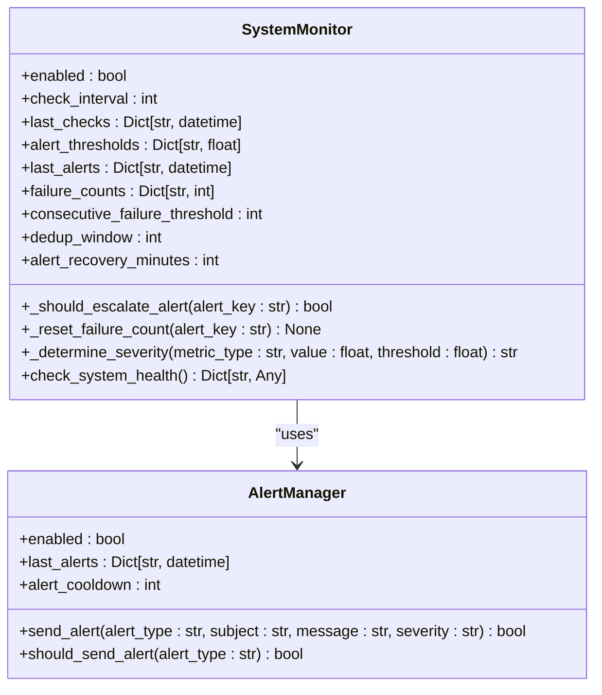
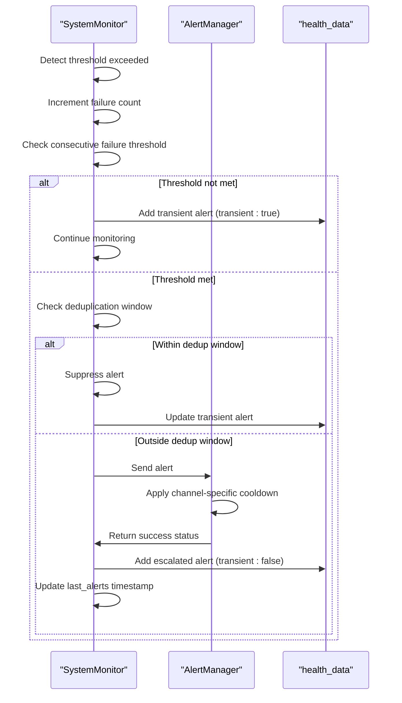
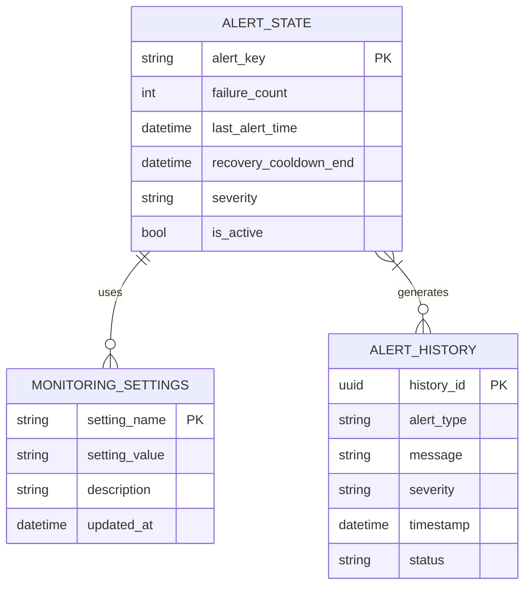
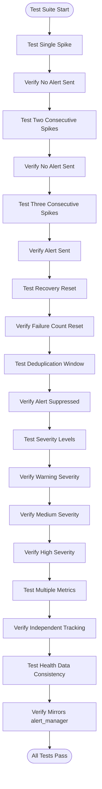

# Alert Stabilization

<cite>
**Referenced Files in This Document**   
- [alert-stabilization.md](file://docs/monitoring/alert-stabilization.md)
- [alert-stabilization-summary.md](file://docs/monitoring/alert-stabilization-summary.md)
- [monitoring.py](file://vertex-ar/app/monitoring.py)
- [config.py](file://vertex-ar/app/config.py)
- [test_monitoring_alert_dedup.py](file://test_files/integration/test_monitoring_alert_dedup.py)
- [alerting.py](file://vertex-ar/app/alerting.py)
- [database.py](file://vertex-ar/app/database.py)
</cite>

## Table of Contents
1. [Introduction](#introduction)
2. [Core Alert Stabilization Mechanisms](#core-alert-stabilization-mechanisms)
3. [Configuration Parameters](#configuration-parameters)
4. [Implementation Details](#implementation-details)
5. [Alert Escalation Logic](#alert-escalation-logic)
6. [State Tracking Data Structures](#state-tracking-data-structures)
7. [Configuration Examples](#configuration-examples)
8. [Troubleshooting Guide](#troubleshooting-guide)
9. [Testing and Validation](#testing-and-validation)
10. [Best Practices](#best-practices)

## Introduction

The Vertex AR monitoring system implements sophisticated alert stabilization mechanisms to prevent alert storms while ensuring critical issues are properly escalated. This documentation details the implementation of alert deduplication, consecutive failure counting, and hysteresis logic that work together to balance sensitivity with noise reduction.

The system uses a multi-layered approach to alert management, combining configurable thresholds, state tracking, and cooldown periods to ensure that only sustained issues trigger notifications. This prevents transient spikes from generating unnecessary alerts while maintaining responsiveness to genuine problems.

**Section sources**
- [alert-stabilization.md](file://docs/monitoring/alert-stabilization.md#L1-L295)
- [alert-stabilization-summary.md](file://docs/monitoring/alert-stabilization-summary.md#L1-L262)

## Core Alert Stabilization Mechanisms

The alert stabilization system in Vertex AR employs three primary mechanisms to prevent alert storms: consecutive failure tracking, alert deduplication, and service degradation detection. These mechanisms work together to ensure that alerts are only triggered for sustained issues rather than transient spikes.

### Consecutive Failure Tracking

Alerts are only escalated after a configurable number of consecutive failures, preventing single noisy samples or transient spikes from triggering alerts. Each metric or service tracks failures independently, with the failure count incrementing on each check that exceeds its threshold and resetting to zero when the metric returns to a healthy state.

The consecutive failure threshold is configurable via the `MONITORING_CONSECUTIVE_FAILURES` setting, with a default value of 3. This means that an alert will only be sent after three consecutive failed checks, providing hysteresis that prevents oscillating metrics from generating excessive notifications.

### Alert Deduplication Window

Once an alert is sent, subsequent alerts of the same type are suppressed within a configurable deduplication window to prevent alert spam. This window is defined by the `MONITORING_DEDUP_WINDOW` setting, which defaults to 300 seconds (5 minutes).

The deduplication mechanism tracks each alert type independently, ensuring that different metrics can be alerted simultaneously while preventing repeated notifications for the same issue. During the deduplication window, consecutive failures continue to be counted, but alerts are not re-sent, maintaining awareness of ongoing issues without notification fatigue.

### Degraded Service Detection

Services are classified with granular severity levels based on their state, providing more nuanced alerting than simple binary health checks. The system distinguishes between different levels of service degradation:

- **Warning**: Metric just over threshold or transient issue (not yet escalated)
- **Medium**: Service degraded but still partially functional (e.g., slow response time)
- **High**: Service completely failed or metric critically high

Severity is determined based on the degree to which a metric exceeds its threshold:
- Just over threshold (<5% overshoot): `warning`
- Moderate degradation (5-15% overshoot): `medium`
- Critical level (>15% overshoot or >95% absolute): `high`

This allows for appropriate routing of alerts based on actual impact, with critical failures receiving immediate attention while degraded services are monitored.

**Section sources**
- [alert-stabilization.md](file://docs/monitoring/alert-stabilization.md#L9-L55)
- [alert-stabilization-summary.md](file://docs/monitoring/alert-stabilization-summary.md#L89-L109)

## Configuration Parameters

The alert stabilization system is controlled by several configurable parameters that can be adjusted to balance sensitivity with noise reduction based on the specific requirements of different environments.

### MONITORING_CONSECUTIVE_FAILURES

This parameter defines the number of consecutive failures required before an alert is escalated. It implements hysteresis logic to prevent transient issues from triggering notifications.

- **Default value**: 3
- **Purpose**: Prevents alerts from transient spikes (e.g., brief CPU spike during backup)
- **Data type**: Integer
- **Location**: Environment variable and database setting

The value represents the number of consecutive failed checks required before an alert is sent. For example, with a check interval of 60 seconds and a threshold of 3, it would take approximately 3 minutes to detect a sustained issue.

### MONITORING_DEDUP_WINDOW

This parameter defines the deduplication window in seconds, during which duplicate alerts of the same type are suppressed.

- **Default value**: 300 seconds (5 minutes)
- **Purpose**: Prevents notification spam for sustained issues
- **Data type**: Integer
- **Location**: Environment variable and database setting

The deduplication window starts when an alert is sent and prevents subsequent alerts of the same type from being sent until the window expires. This ensures that ongoing issues are not repeatedly notified while still allowing for follow-up alerts if the issue persists beyond the window.

### ALERT_RECOVERY_MINUTES

This parameter controls the minimum time in minutes before a recovered alert can be re-fired, preventing alert fatigue from oscillating metrics.

- **Default value**: 60 minutes
- **Purpose**: Prevents alert fatigue from oscillating metrics
- **Data type**: Integer
- **Location**: Environment variable and database setting

After a service recovers and the alert is resolved, this setting enforces a cooldown period before the same alert type can be triggered again. This prevents rapid cycling between alert and recovery states from generating excessive notifications.

### Configuration Hierarchy

Configuration values can be set at multiple levels, with the following precedence:
1. Database settings (highest priority)
2. Environment variables
3. Default values (lowest priority)

This allows for runtime configuration changes without requiring application restarts, as database settings can be updated through the admin interface.

**Section sources**
- [config.py](file://vertex-ar/app/config.py#L132-L137)
- [alert-stabilization.md](file://docs/monitoring/alert-stabilization.md#L13-L37)
- [alert-stabilization-summary.md](file://docs/monitoring/alert-stabilization-summary.md#L194-L213)

## Implementation Details

The alert stabilization mechanisms are implemented in the `SystemMonitor` class within the monitoring module, with key functionality provided by helper methods that manage alert state and escalation logic.



**Diagram sources **
- [monitoring.py](file://vertex-ar/app/monitoring.py#L21-L800)
- [alerting.py](file://vertex-ar/app/alerting.py#L15-L383)

### _should_escalate_alert Method

The `_should_escalate_alert` method implements the core hysteresis logic that determines whether an alert should be sent. This method follows a multi-step decision process:

1. Increment the failure count for the specified alert key
2. Check if the consecutive failure threshold has been reached
3. If the threshold is met, check if the alert is within its deduplication window
4. If not within the deduplication window, update the last alert timestamp and return True
5. Otherwise, return False to suppress the alert

The method includes comprehensive logging to aid in troubleshooting, with debug messages indicating when alerts are not escalated due to insufficient failures or deduplication windows, and info messages when alerts are successfully escalated.

### _reset_failure_count Method

The `_reset_failure_count` method is called when a metric or service recovers to a healthy state. It resets the failure count for the specified alert key to zero, effectively restarting the consecutive failure counter.

This method is called when:
- A metric returns below its threshold
- A service becomes healthy
- A service's response time becomes acceptable

The reset ensures that transient issues do not accumulate failure counts that could lead to premature alerting when a subsequent issue occurs.

### _determine_severity Method

The `_determine_severity` method calculates the appropriate severity level for an alert based on how much a metric exceeds its threshold. It returns one of three severity levels:

- `"warning"`: Just over threshold
- `"medium"`: Moderately degraded (5-15% over threshold)
- `"high"`: Critical level (>15% over threshold or >95% absolute)

The severity determination considers both the relative overshoot percentage and absolute values, with any metric exceeding 95% automatically classified as high severity regardless of the threshold.

**Section sources**
- [monitoring.py](file://vertex-ar/app/monitoring.py#L152-L217)
- [alert-stabilization.md](file://docs/monitoring/alert-stabilization.md#L99-L124)

## Alert Escalation Logic

The alert escalation process follows a well-defined sequence that ensures alerts are only sent for sustained issues while providing visibility into transient problems.



**Diagram sources **
- [monitoring.py](file://vertex-ar/app/monitoring.py#L152-L217)
- [alerting.py](file://vertex-ar/app/alerting.py#L218-L257)

The process begins when a metric exceeds its threshold. The failure count for that metric is incremented, and if it reaches the consecutive failure threshold, the system checks whether the alert is within its deduplication window. Only if both conditions are satisfied (threshold met and outside dedup window) is the alert forwarded to the `AlertManager` for delivery.

During this process, the `health_data["alerts"]` field is updated to mirror the actual alerts sent, ensuring consistency between the Notification Center view and the alerting system. Transient issues are marked with a `transient: true` flag, while escalated alerts have no transient flag and include full severity information.

The `AlertManager` applies its own cooldown logic through the `should_send_alert` method, which uses a separate `alert_cooldown` period (default 300 seconds) to prevent duplicate alerts across different alert types. This provides an additional layer of deduplication beyond the monitoring system's per-metric deduplication.

## State Tracking Data Structures

The alert stabilization system maintains several data structures to track the state of monitored metrics and services, enabling the hysteresis and deduplication logic.



**Diagram sources **
- [monitoring.py](file://vertex-ar/app/monitoring.py#L36-L46)
- [database.py](file://vertex-ar/app/database.py#L3640-L3768)

### failure_counts Dictionary

The `failure_counts` dictionary tracks the current consecutive failure count for each monitored metric or service. It is implemented as a simple key-value store where:

- **Key**: Unique identifier for the alert (e.g., "high_cpu", "service_database")
- **Value**: Integer representing the current consecutive failure count

This dictionary is incremented by the `_should_escalate_alert` method on each failed check and reset to zero by the `_reset_failure_count` method when a metric recovers.

### last_alerts Dictionary

The `last_alerts` dictionary enforces the deduplication window by tracking the timestamp of the last alert sent for each alert type. It is implemented as:

- **Key**: Alert key (same as in failure_counts)
- **Value**: datetime representing when the last alert was sent

This dictionary is used to calculate the time since the last alert and determine whether the current check falls within the deduplication window. It is updated whenever an alert is successfully escalated.

### Configuration Persistence

Monitoring settings, including the stabilization parameters, are persisted in the database through the `monitoring_settings` table. This allows for runtime configuration changes without requiring application restarts. The settings can be updated via the admin interface and are loaded into the `SystemMonitor` instance during initialization and through the `reload_settings` method.

The database schema includes fields for all stabilization parameters:
- `consecutive_failures`: Corresponds to MONITORING_CONSECUTIVE_FAILURES
- `dedup_window_seconds`: Corresponds to MONITORING_DEDUP_WINDOW  
- `alert_recovery_minutes`: Corresponds to ALERT_RECOVERY_MINUTES

**Section sources**
- [monitoring.py](file://vertex-ar/app/monitoring.py#L36-L46)
- [database.py](file://vertex-ar/app/database.py#L3640-L3768)
- [config.py](file://vertex-ar/app/config.py#L132-L137)

## Configuration Examples

The alert stabilization parameters can be tuned for different environments to balance sensitivity with noise reduction. Below are recommended configurations for various deployment scenarios.

### Development Environment

In development environments, faster detection of issues is typically preferred, even at the cost of increased alert noise:

```bash
# Development configuration
MONITORING_CONSECUTIVE_FAILURES=2  # Faster detection
MONITORING_DEDUP_WINDOW=120        # 2 minutes
HEALTH_CHECK_INTERVAL=30           # Check every 30 seconds
ALERT_RECOVERY_MINUTES=30          # Shorter recovery window
```

This configuration reduces the time to detect sustained issues to approximately 1 minute (2 checks × 30 seconds) and limits alert spam to once every 2 minutes for ongoing issues.

### Production Environment

For production systems, a balance between sensitivity and noise reduction is essential:

```bash
# Production configuration
MONITORING_CONSECUTIVE_FAILURES=3  # Default sensitivity
MONITORING_DEDUP_WINDOW=300        # 5 minutes
HEALTH_CHECK_INTERVAL=60           # Check every minute  
ALERT_RECOVERY_MINUTES=60          # Standard recovery window
```

This configuration provides a reasonable detection time of 3 minutes for sustained issues while preventing alert storms during transient problems.

### High-Traffic Systems

For high-traffic systems that experience regular load spikes, more tolerance is needed to avoid false positives:

```bash
# High-traffic system configuration
MONITORING_CONSECUTIVE_FAILURES=5  # More tolerance for spikes
MONITORING_DEDUP_WINDOW=600        # 10 minutes
HEALTH_CHECK_INTERVAL=120          # Check every 2 minutes
ALERT_RECOVERY_MINUTES=120         # Extended recovery window
```

This configuration increases the detection time to 10 minutes but significantly reduces the likelihood of alert storms during expected load variations.

All configurations should be set in the `.env` file or through the admin interface, with database settings taking precedence over environment variables.

**Section sources**
- [alert-stabilization-summary.md](file://docs/monitoring/alert-stabilization-summary.md#L194-L213)
- [config.py](file://vertex-ar/app/config.py#L132-L137)

## Troubleshooting Guide

This section addresses common issues related to alert delivery and provides guidance for debugging alert stabilization problems.

### Too Many Alerts Still Being Sent

If excessive alerts are being received despite the stabilization mechanisms, consider the following steps:

1. **Check failure count reset logic**: Verify that `_reset_failure_count` is being called when metrics recover by examining debug logs for "Resetting failure count" messages.

2. **Increase consecutive failure threshold**: Raise `MONITORING_CONSECUTIVE_FAILURES` to 4 or 5 to require more sustained issues before alerting.

3. **Extend deduplication window**: Increase `MONITORING_DEDUP_WINDOW` to 600 (10 minutes) to further suppress repeated alerts.

4. **Review logs for escalation patterns**: Check info logs for "Escalating alert" messages to identify which alerts are being triggered and how frequently.

5. **Verify metric thresholds**: Ensure that threshold values are appropriate for your system's normal operating conditions to avoid constant borderline triggering.

### Important Issues Not Being Alerted

If critical issues are not generating alerts, investigate the following:

1. **Check consecutive failure threshold**: Verify that `MONITORING_CONSECUTIVE_FAILURES` is not set too high for your check interval.

2. **Confirm alerting is enabled**: Ensure `ALERTING_ENABLED=true` in the configuration.

3. **Review failure counts**: Check the `failure_counts` dictionary values in health data to verify that failures are being counted properly.

4. **Examine deduplication windows**: Determine if alerts are being suppressed by the deduplication window by checking the time since last alert.

5. **Verify monitoring loop operation**: Confirm that the monitoring loop is running by checking for "System health check completed" log messages.

6. **Test alert delivery**: Use the alert system test functionality to verify that notification channels are working correctly.

### Inconsistent Health Data

If the health data does not match actual alert behavior:

1. **Verify health_data["alerts"] content**: Ensure it includes both escalated and transient alerts.

2. **Check transient flag usage**: Confirm that transient alerts have the `transient: true` flag and escalated alerts do not.

3. **Validate failure count reset**: Ensure `_reset_failure_count()` is called when metrics recover by checking debug logs.

4. **Compare with alert_manager logs**: Verify that the alerts sent by `alert_manager` match those recorded in `health_data["alerts"]`.

### Debugging Tools and Commands

The system provides several tools for troubleshooting alert stabilization:

```bash
# Run comprehensive alert deduplication tests
cd vertex-ar
python test_monitoring_alert_dedup.py

# Check current monitoring settings
grep "MONITORING_" .env

# Monitor alert-related logs
tail -f logs/app.log | grep "Alert\|Escalating"
```

**Section sources**
- [alert-stabilization.md](file://docs/monitoring/alert-stabilization.md#L248-L270)
- [test_monitoring_alert_dedup.py](file://test_files/integration/test_monitoring_alert_dedup.py#L1-L445)

## Testing and Validation

The alert stabilization system is supported by comprehensive tests that verify the correct behavior of all stabilization mechanisms.



**Diagram sources **
- [test_monitoring_alert_dedup.py](file://test_files/integration/test_monitoring_alert_dedup.py#L1-L445)
- [alert-stabilization.md](file://docs/monitoring/alert-stabilization.md#L137-L154)

The test suite validates the following scenarios:
- Single spike does not trigger an alert
- Two consecutive spikes do not trigger an alert
- Three consecutive spikes trigger an alert
- Failure count resets on recovery
- Deduplication window prevents rapid re-alerts
- Severity determination works correctly
- Degraded services get appropriate severity levels
- Failed services get high severity
- Multiple metrics track failures independently
- `health_data["alerts"]` mirrors sent alerts

Tests are implemented using mocking to isolate the alert stabilization logic from external dependencies, ensuring reliable and repeatable test results. The test suite can be run with the command `python test_monitoring_alert_dedup.py` from the vertex-ar directory.

**Section sources**
- [test_monitoring_alert_dedup.py](file://test_files/integration/test_monitoring_alert_dedup.py#L1-L445)
- [alert-stabilization.md](file://docs/monitoring/alert-stabilization.md#L137-L154)

## Best Practices

To effectively use the alert stabilization system, follow these best practices for configuration and maintenance.

### Tuning Thresholds

Adjust the `MONITORING_CONSECUTIVE_FAILURES` parameter based on your check interval to achieve the desired detection time:

- For a 60-second check interval: 3 checks = 3 minutes to detect sustained issues
- For faster detection: Reduce to 2 checks or decrease the check interval
- For more tolerance: Increase to 4-5 checks

Consider the nature of your services when setting thresholds—critical services may warrant lower thresholds for faster detection, while volatile metrics may need higher thresholds to avoid noise.

### Balancing Deduplication Windows

The `MONITORING_DEDUP_WINDOW` should be balanced to prevent spam while staying informed:

- Too short (<5 minutes): May still generate too many alerts for sustained issues
- Too long (>30 minutes): May miss escalating issues or delay response
- Optimal range: 5-15 minutes for most production systems

Consider setting different deduplication windows for different severity levels, with shorter windows for high-severity alerts.

### Monitoring Transient Alerts

Regularly review transient alerts in the health data to identify intermittent issues that don't reach the escalation threshold. These can indicate underlying problems that may worsen over time.

Set up periodic reviews of transient alerts to identify patterns and address potential issues before they become critical.

### Service-Specific Tuning

Consider implementing service-specific thresholds based on the criticality and behavior of different services:

- Critical services: Lower consecutive failure thresholds for faster detection
- Volatile services: Higher thresholds and longer deduplication windows
- Batch processes: Different thresholds during processing windows

### Alert Routing by Severity

Use severity levels to route alerts appropriately:

- `high` severity: Route to all channels (Telegram, Email, PagerDuty)
- `medium` severity: Route to email and dashboard
- `warning` severity: Dashboard only, no immediate notifications

This ensures that critical issues receive immediate attention while less severe issues are monitored without causing alert fatigue.

**Section sources**
- [alert-stabilization.md](file://docs/monitoring/alert-stabilization.md#L230-L247)
- [alert-stabilization-summary.md](file://docs/monitoring/alert-stabilization-summary.md#L240-L246)