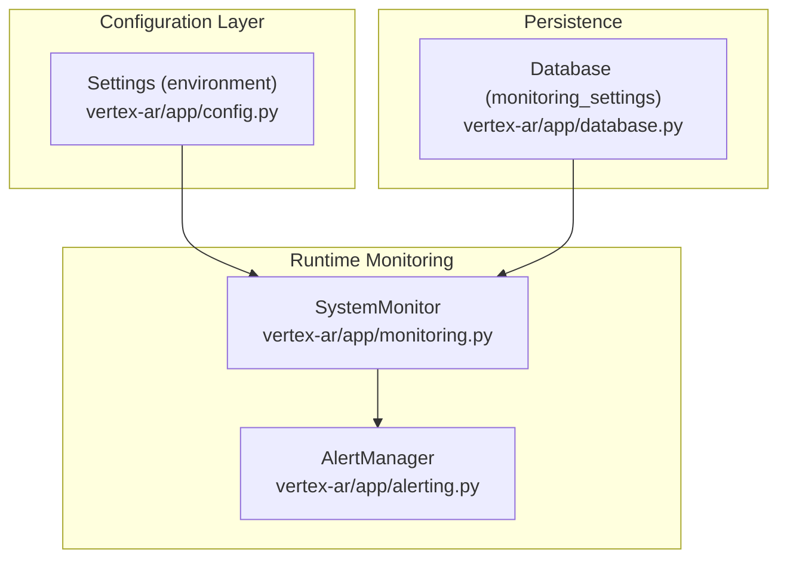
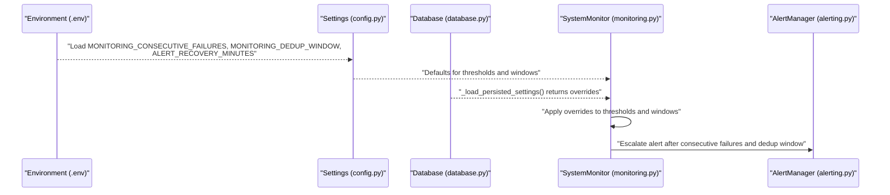
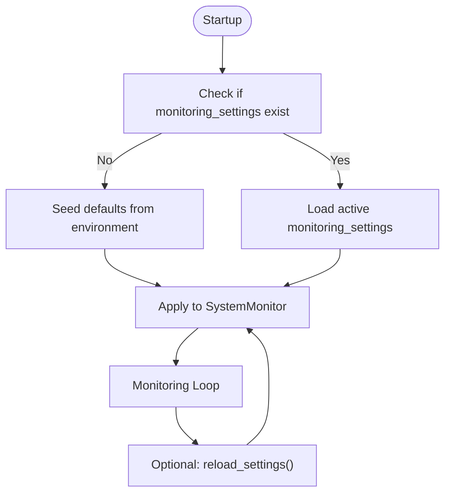
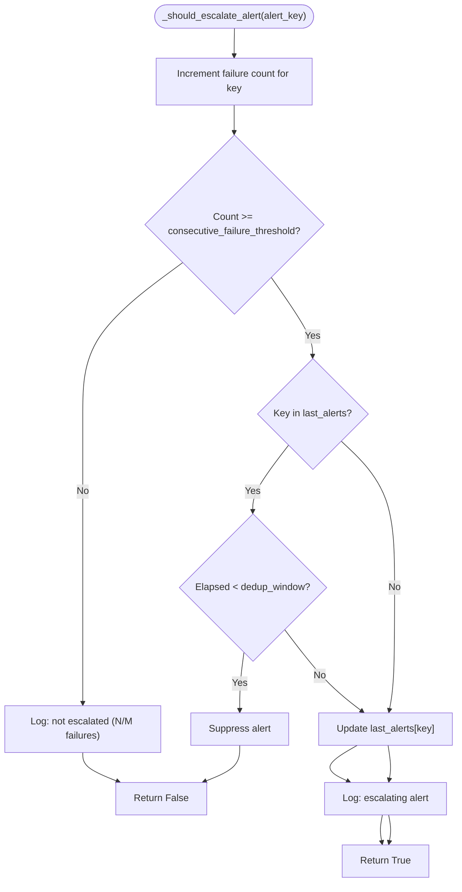
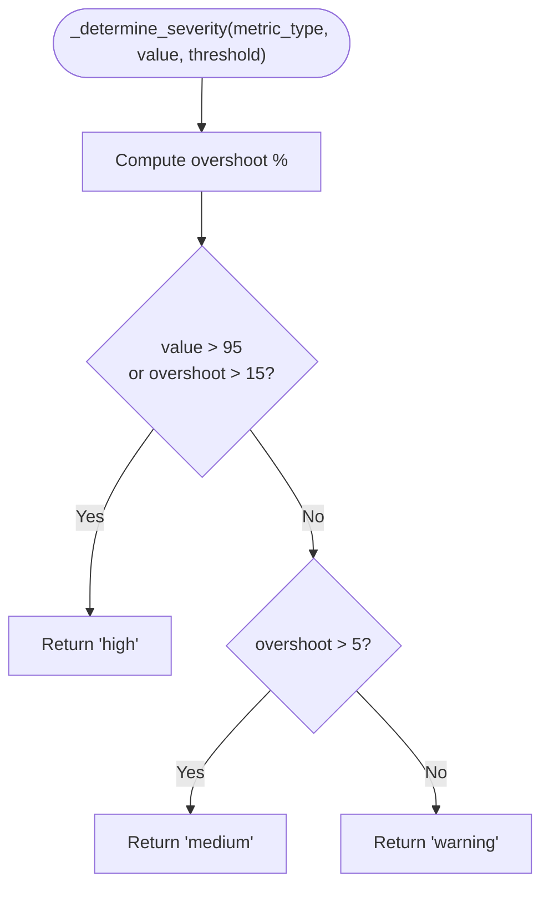
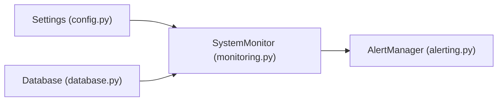

# Configuration

<cite>
**Referenced Files in This Document**
- [vertex-ar/app/monitoring.py](file://vertex-ar/app/monitoring.py)
- [vertex-ar/app/config.py](file://vertex-ar/app/config.py)
- [vertex-ar/app/database.py](file://vertex-ar/app/database.py)
- [docs/monitoring/alert-stabilization.md](file://docs/monitoring/alert-stabilization.md)
- [docs/monitoring/alert-stabilization-summary.md](file://docs/monitoring/alert-stabilization-summary.md)
- [docs/monitoring/persistent-settings.md](file://docs/monitoring/persistent-settings.md)
- [test_files/unit/test_monitoring.py](file://test_files/unit/test_monitoring.py)
- [test_files/unit/test_monitoring_alert_dedup.py](file://test_files/unit/test_monitoring_alert_dedup.py)
</cite>

## Table of Contents
1. [Introduction](#introduction)
2. [Project Structure](#project-structure)
3. [Core Components](#core-components)
4. [Architecture Overview](#architecture-overview)
5. [Detailed Component Analysis](#detailed-component-analysis)
6. [Dependency Analysis](#dependency-analysis)
7. [Performance Considerations](#performance-considerations)
8. [Troubleshooting Guide](#troubleshooting-guide)
9. [Conclusion](#conclusion)

## Introduction
This document explains the alert stabilization configuration in the Vertex AR monitoring system. It focuses on three key environment variables and their persistence:
- MONITORING_CONSECUTIVE_FAILURES: number of consecutive failures required before escalating an alert
- MONITORING_DEDUP_WINDOW: deduplication window in seconds to suppress repeated alerts
- ALERT_RECOVERY_MINUTES: time window in minutes that controls whether a previously failed service can re-trigger an alert after recovery

It also documents how these settings are loaded from environment variables, how they can be overridden via database-persisted configurations, and how to safely tune them for different environments.

## Project Structure
The alert stabilization logic is implemented in the monitoring module and controlled by configuration settings. Database-backed monitoring settings are managed by the database module and can be updated via admin APIs or programmatic calls.

**Diagram sources**
- [vertex-ar/app/config.py](file://vertex-ar/app/config.py#L120-L145)
- [vertex-ar/app/monitoring.py](file://vertex-ar/app/monitoring.py#L21-L90)
- [vertex-ar/app/database.py](file://vertex-ar/app/database.py#L3618-L3674)

**Section sources**
- [vertex-ar/app/config.py](file://vertex-ar/app/config.py#L120-L145)
- [vertex-ar/app/monitoring.py](file://vertex-ar/app/monitoring.py#L21-L90)
- [vertex-ar/app/database.py](file://vertex-ar/app/database.py#L3618-L3674)

## Core Components
- Settings loader: Reads environment variables and exposes them as application settings.
- SystemMonitor: Orchestrates health checks, applies consecutive failure thresholds, deduplication, and severity classification, and persists settings from the database.
- Database: Seeds default monitoring settings from environment variables and provides methods to retrieve and update them.
- AlertManager: Routes alerts to configured channels; the monitoring subsystem coordinates escalation and deduplication.

Key configuration defaults and behavior:
- MONITORING_CONSECUTIVE_FAILURES defaults to 3
- MONITORING_DEDUP_WINDOW defaults to 300 seconds (5 minutes)
- ALERT_RECOVERY_MINUTES defaults to 60 minutes

These defaults are applied when initializing SystemMonitor and can be overridden by database-persisted settings.

**Section sources**
- [vertex-ar/app/config.py](file://vertex-ar/app/config.py#L120-L145)
- [vertex-ar/app/monitoring.py](file://vertex-ar/app/monitoring.py#L21-L90)
- [docs/monitoring/alert-stabilization.md](file://docs/monitoring/alert-stabilization.md#L13-L23)
- [docs/monitoring/alert-stabilization.md](file://docs/monitoring/alert-stabilization.md#L24-L37)
- [docs/monitoring/alert-stabilization.md](file://docs/monitoring/alert-stabilization.md#L288-L295)

## Architecture Overview
The monitoring loop integrates environment-based defaults with database-persisted overrides. On startup, SystemMonitor loads settings from the database if available; otherwise it falls back to environment-derived defaults. During operation, it enforces consecutive failure thresholds and deduplication windows before escalating alerts.

**Diagram sources**
- [vertex-ar/app/config.py](file://vertex-ar/app/config.py#L120-L145)
- [vertex-ar/app/monitoring.py](file://vertex-ar/app/monitoring.py#L88-L117)
- [vertex-ar/app/database.py](file://vertex-ar/app/database.py#L3683-L3691)
- [vertex-ar/app/monitoring.py](file://vertex-ar/app/monitoring.py#L152-L180)

## Detailed Component Analysis

### Environment Variables and Defaults
- MONITORING_CONSECUTIVE_FAILURES
  - Purpose: Controls the number of consecutive failures required before alert escalation.
  - Default: 3
  - Behavior: Incremented on each failing check; only escalates when threshold is met.
- MONITORING_DEDUP_WINDOW
  - Purpose: Suppresses duplicate alerts within a configurable window to prevent spam.
  - Default: 300 seconds (5 minutes)
  - Behavior: After escalation, same alert type is suppressed until window elapses.
- ALERT_RECOVERY_MINUTES
  - Purpose: Controls whether a previously failed service can re-trigger an alert after recovery.
  - Default: 60 minutes
  - Behavior: Used to gate re-alerting after a recovery event.

These defaults are defined in the settings loader and consumed by SystemMonitor.

**Section sources**
- [vertex-ar/app/config.py](file://vertex-ar/app/config.py#L120-L145)
- [docs/monitoring/alert-stabilization.md](file://docs/monitoring/alert-stabilization.md#L13-L23)
- [docs/monitoring/alert-stabilization.md](file://docs/monitoring/alert-stabilization.md#L24-L37)
- [docs/monitoring/alert-stabilization.md](file://docs/monitoring/alert-stabilization.md#L288-L295)

### Database-Persisted Overrides
SystemMonitor loads monitoring settings from the database during initialization and can reload them at runtime. The database stores:
- cpu_threshold, memory_threshold, disk_threshold
- health_check_interval
- consecutive_failures
- dedup_window_seconds
- max_runtime_seconds
- health_check_cooldown_seconds
- alert_recovery_minutes

The database module seeds defaults from environment variables and provides methods to retrieve and update these settings.

**Diagram sources**
- [vertex-ar/app/database.py](file://vertex-ar/app/database.py#L3618-L3674)
- [vertex-ar/app/database.py](file://vertex-ar/app/database.py#L3683-L3691)
- [vertex-ar/app/database.py](file://vertex-ar/app/database.py#L3693-L3767)
- [vertex-ar/app/monitoring.py](file://vertex-ar/app/monitoring.py#L88-L117)
- [vertex-ar/app/monitoring.py](file://vertex-ar/app/monitoring.py#L118-L151)

**Section sources**
- [vertex-ar/app/monitoring.py](file://vertex-ar/app/monitoring.py#L88-L117)
- [vertex-ar/app/monitoring.py](file://vertex-ar/app/monitoring.py#L118-L151)
- [vertex-ar/app/database.py](file://vertex-ar/app/database.py#L3618-L3674)
- [vertex-ar/app/database.py](file://vertex-ar/app/database.py#L3683-L3691)
- [vertex-ar/app/database.py](file://vertex-ar/app/database.py#L3693-L3767)

### Escalation and Deduplication Logic
SystemMonitor’s escalation logic increments failure counts per alert key, checks the consecutive failure threshold, and enforces the deduplication window. It also resets failure counts upon recovery.

**Diagram sources**
- [vertex-ar/app/monitoring.py](file://vertex-ar/app/monitoring.py#L152-L180)

**Section sources**
- [vertex-ar/app/monitoring.py](file://vertex-ar/app/monitoring.py#L152-L180)
- [docs/monitoring/alert-stabilization.md](file://docs/monitoring/alert-stabilization.md#L99-L116)

### Severity Determination
Severity is derived from how far a metric exceeds its threshold. This influences the alert level and routing.

**Diagram sources**
- [vertex-ar/app/monitoring.py](file://vertex-ar/app/monitoring.py#L193-L217)

**Section sources**
- [vertex-ar/app/monitoring.py](file://vertex-ar/app/monitoring.py#L193-L217)
- [docs/monitoring/alert-stabilization.md](file://docs/monitoring/alert-stabilization.md#L47-L68)

### Configuration Scenarios and Guidance
- Development
  - Lower consecutive failure threshold and shorter dedup window for faster feedback loops.
  - Example: MONITORING_CONSECUTIVE_FAILURES=2, MONITORING_DEDUP_WINDOW=120, HEALTH_CHECK_INTERVAL=30.
- Production
  - Default values balance signal-to-noise and operational stability.
  - Example: MONITORING_CONSECUTIVE_FAILURES=3, MONITORING_DEDUP_WINDOW=300, HEALTH_CHECK_INTERVAL=60.
- High-traffic systems
  - Higher tolerance to transient spikes; increase thresholds and dedup window.
  - Example: MONITORING_CONSECUTIVE_FAILURES=5, MONITORING_DEDUP_WINDOW=600, HEALTH_CHECK_INTERVAL=120.

Guidance for safe modification:
- Align MONITORING_CONSECUTIVE_FAILURES with HEALTH_CHECK_INTERVAL so detection timing is appropriate (e.g., 60s interval × 3 checks ≈ 3 minutes).
- Tune dedup window to balance alert fatigue and timely awareness.
- Review transient vs escalated alerts in the admin dashboard to validate behavior.

**Section sources**
- [docs/monitoring/alert-stabilization-summary.md](file://docs/monitoring/alert-stabilization-summary.md#L194-L214)
- [docs/monitoring/alert-stabilization.md](file://docs/monitoring/alert-stabilization.md#L231-L247)

## Dependency Analysis
- SystemMonitor depends on Settings for initial defaults and on Database for persisted overrides.
- Database seeds defaults from Settings and exposes methods to retrieve and update monitoring settings.
- AlertManager handles routing; SystemMonitor decides when to escalate.

**Diagram sources**
- [vertex-ar/app/config.py](file://vertex-ar/app/config.py#L120-L145)
- [vertex-ar/app/monitoring.py](file://vertex-ar/app/monitoring.py#L21-L90)
- [vertex-ar/app/database.py](file://vertex-ar/app/database.py#L3618-L3674)
- [vertex-ar/app/monitoring.py](file://vertex-ar/app/monitoring.py#L152-L180)

**Section sources**
- [vertex-ar/app/config.py](file://vertex-ar/app/config.py#L120-L145)
- [vertex-ar/app/monitoring.py](file://vertex-ar/app/monitoring.py#L21-L90)
- [vertex-ar/app/database.py](file://vertex-ar/app/database.py#L3618-L3674)

## Performance Considerations
- Consecutive failure tracking and deduplication are lightweight dictionaries keyed by alert type; overhead scales with number of tracked metrics/services.
- Deduplication reduces redundant alert routing and database writes.
- Tuning HEALTH_CHECK_INTERVAL with MONITORING_CONSECUTIVE_FAILURES affects detection latency and false-positive reduction.

[No sources needed since this section provides general guidance]

## Troubleshooting Guide
Common issues and resolutions:
- Too many alerts still being sent
  - Verify failure counts reset on recovery and increase MONITORING_CONSECUTIVE_FAILURES or MONITORING_DEDUP_WINDOW.
  - Confirm ALERTING_ENABLED and logs indicate escalation decisions.
- Important issues not being alerted
  - Check that MONITORING_CONSECUTIVE_FAILURES is not too high and that monitoring loop is running.
  - Review transient vs escalated alerts in the admin dashboard.
- Inconsistent health data
  - Ensure transient alerts are marked correctly and that failure counts reset when metrics recover.

Operational tips:
- Use reload_settings() to apply database-persisted overrides without restarting.
- Validate database seeding and updates via tests.

**Section sources**
- [docs/monitoring/alert-stabilization.md](file://docs/monitoring/alert-stabilization.md#L248-L269)
- [test_files/unit/test_monitoring.py](file://test_files/unit/test_monitoring.py#L442-L595)
- [test_files/unit/test_monitoring_alert_dedup.py](file://test_files/unit/test_monitoring_alert_dedup.py#L1-L150)

## Conclusion
The Vertex AR monitoring system stabilizes alerts by combining consecutive failure tracking, deduplication windows, and severity-aware escalation. Environment variables provide sensible defaults, while database-persisted settings enable safe, runtime overrides. Properly aligning MONITORING_CONSECUTIVE_FAILURES with HEALTH_CHECK_INTERVAL and tuning MONITORING_DEDUP_WINDOW and ALERT_RECOVERY_MINUTES yields reliable, actionable alerts across development, staging, and production environments.