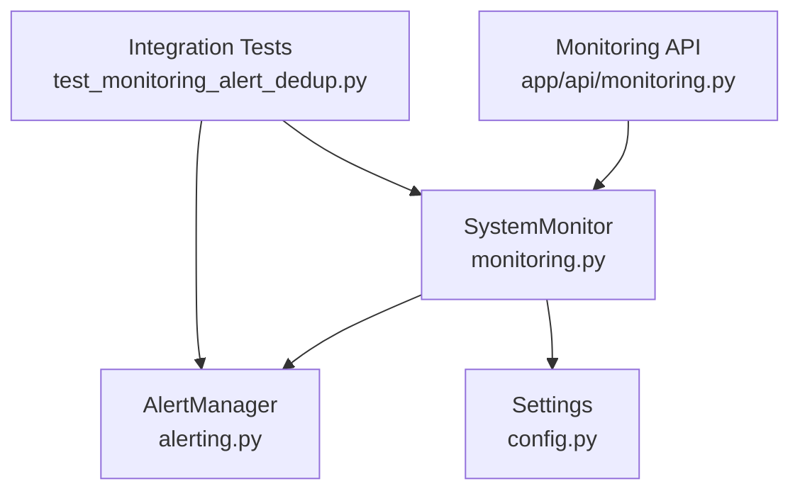
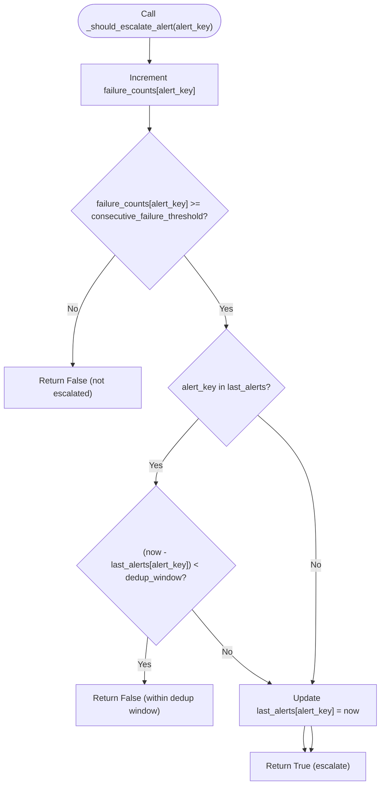
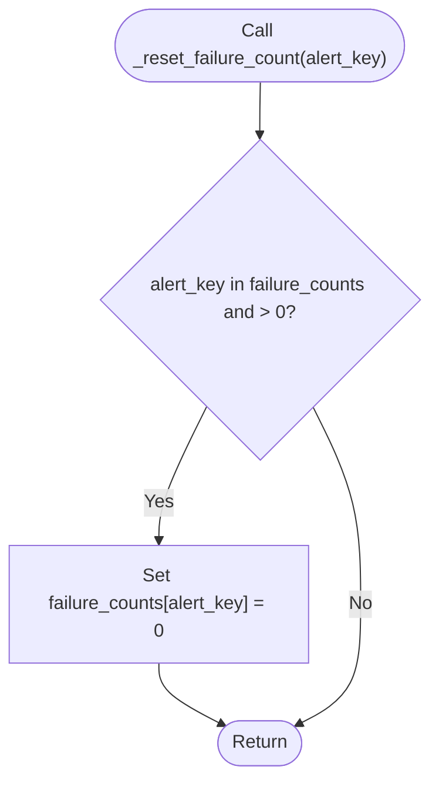
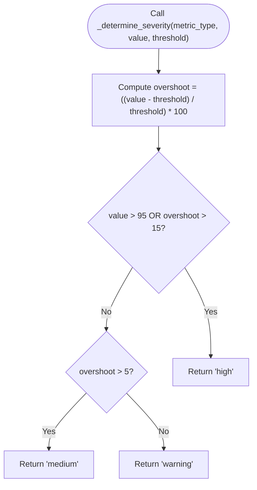
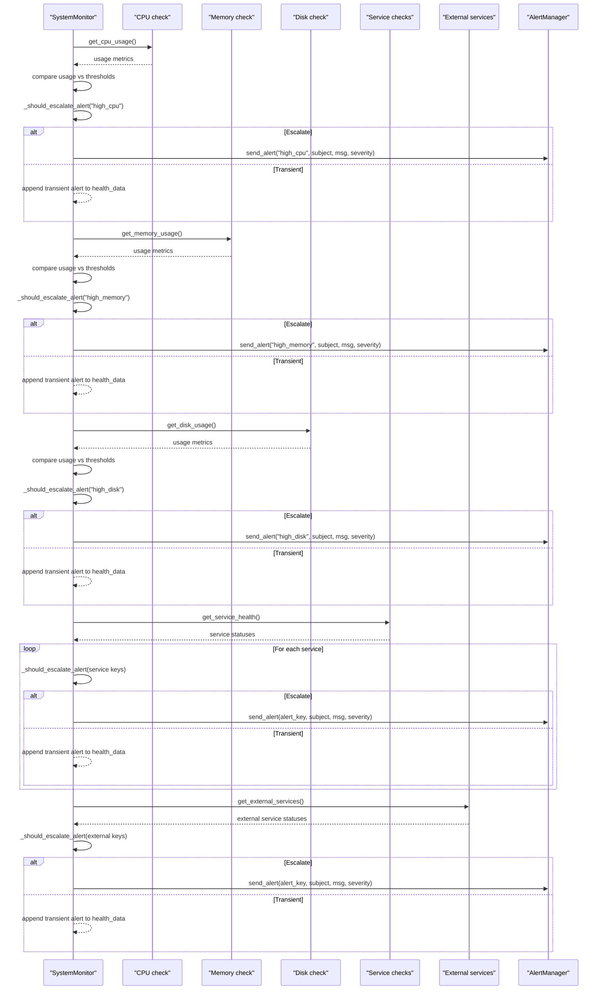
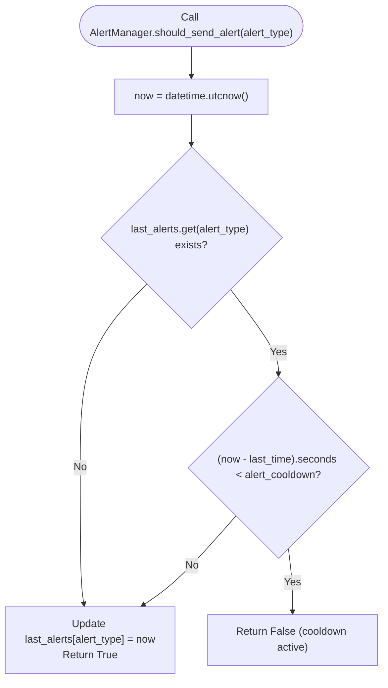
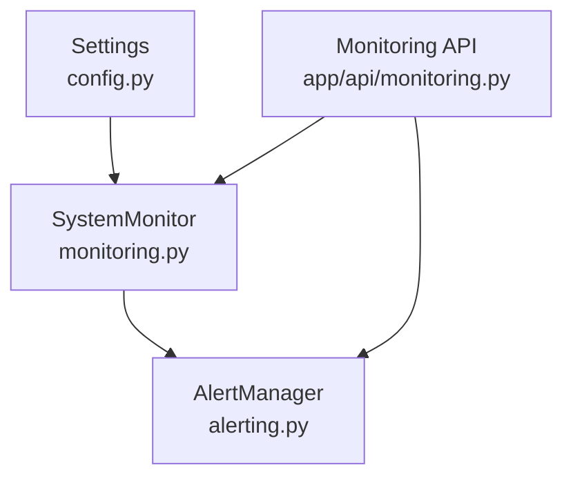

# Core Logic

<cite>
**Referenced Files in This Document**
- [monitoring.py](file://vertex-ar/app/monitoring.py)
- [alerting.py](file://vertex-ar/app/alerting.py)
- [config.py](file://vertex-ar/app/config.py)
- [monitoring.py](file://vertex-ar/app/api/monitoring.py)
- [test_monitoring_alert_dedup.py](file://test_files/integration/test_monitoring_alert_dedup.py)
- [alert-stabilization.md](file://docs/monitoring/alert-stabilization.md)
</cite>

## Table of Contents
1. [Introduction](#introduction)
2. [Project Structure](#project-structure)
3. [Core Components](#core-components)
4. [Architecture Overview](#architecture-overview)
5. [Detailed Component Analysis](#detailed-component-analysis)
6. [Dependency Analysis](#dependency-analysis)
7. [Performance Considerations](#performance-considerations)
8. [Troubleshooting Guide](#troubleshooting-guide)
9. [Conclusion](#conclusion)

## Introduction
This document explains the core alert stabilization logic in the Vertex AR monitoring system. It focuses on how SystemMonitor’s _should_escalate_alert integrates consecutive failure counting with deduplication window enforcement, how failure_counts tracks sustained issues per alert key and resets via _reset_failure_count when metrics recover, how hysteresis prevents noise from transient spikes, and how _determine_severity classifies alerts as warning, medium, or high. It also describes the interaction between SystemMonitor’s escalation logic and AlertManager’s cooldown mechanism to prevent alert storms while ensuring critical issues are communicated.

## Project Structure
The monitoring and alerting logic spans several modules:
- SystemMonitor orchestrates health checks, escalations, and alert stabilization.
- AlertManager handles cooldown and dispatch of alerts to configured channels.
- Settings define thresholds and stabilization parameters.
- API endpoints surface monitoring status and trigger manual checks.
- Tests validate the stabilization behavior.



**Diagram sources**
- [monitoring.py](file://vertex-ar/app/monitoring.py#L1373-L1704)
- [alerting.py](file://vertex-ar/app/alerting.py#L1-L383)
- [config.py](file://vertex-ar/app/config.py#L123-L145)
- [monitoring.py](file://vertex-ar/app/api/monitoring.py#L1-L120)
- [test_monitoring_alert_dedup.py](file://test_files/integration/test_monitoring_alert_dedup.py#L1-L120)

**Section sources**
- [monitoring.py](file://vertex-ar/app/monitoring.py#L1373-L1704)
- [alerting.py](file://vertex-ar/app/alerting.py#L1-L383)
- [config.py](file://vertex-ar/app/config.py#L123-L145)
- [monitoring.py](file://vertex-ar/app/api/monitoring.py#L1-L120)
- [test_monitoring_alert_dedup.py](file://test_files/integration/test_monitoring_alert_dedup.py#L1-L120)

## Core Components
- SystemMonitor: central orchestrator for health checks, failure counting, escalation decisions, and alert emission.
- AlertManager: manages cooldown and dispatch to channels.
- Settings: exposes thresholds and stabilization parameters (consecutive failures, dedup window, intervals).
- API: exposes endpoints to inspect status, trigger checks, and manage settings.

Key responsibilities:
- Consecutive failure tracking and hysteresis via _should_escalate_alert.
- Deduplication enforcement via last_alerts timestamps and dedup_window.
- Severity determination via _determine_severity.
- Recovery handling via _reset_failure_count.
- Interaction with AlertManager for cooldown and routing.

**Section sources**
- [monitoring.py](file://vertex-ar/app/monitoring.py#L1373-L1704)
- [alerting.py](file://vertex-ar/app/alerting.py#L1-L383)
- [config.py](file://vertex-ar/app/config.py#L123-L145)

## Architecture Overview
The monitoring loop periodically evaluates metrics and services. For each potential alertable condition, SystemMonitor decides whether to escalate based on consecutive failures and deduplication window. If escalation criteria are met, it emits an alert via AlertManager, which applies its own cooldown to throttle repeated sends.

```mermaid
sequenceDiagram
participant Loop as "Monitoring Loop<br/>SystemMonitor.start_monitoring()"
participant Monitor as "SystemMonitor<br/>check_system_health()"
participant Esc as "_should_escalate_alert()"
participant AM as "AlertManager<br/>should_send_alert()"
participant Dispatch as "AlertManager.send_alert()"
Loop->>Monitor : schedule periodic check
Monitor->>Monitor : evaluate metrics/services
Monitor->>Esc : compute alert_key and increment failure count
Esc-->>Monitor : True if threshold reached AND dedup window elapsed
Monitor->>AM : send_alert(alert_key, subject, message, severity)
AM->>AM : check cooldown (last_alerts + alert_cooldown)
AM-->>Dispatch : proceed if allowed
Dispatch-->>Monitor : alert dispatched
```

**Diagram sources**
- [monitoring.py](file://vertex-ar/app/monitoring.py#L1606-L1668)
- [monitoring.py](file://vertex-ar/app/monitoring.py#L1373-L1599)
- [monitoring.py](file://vertex-ar/app/monitoring.py#L1599-L1604)
- [alerting.py](file://vertex-ar/app/alerting.py#L218-L228)
- [alerting.py](file://vertex-ar/app/alerting.py#L229-L317)

## Detailed Component Analysis

### SystemMonitor: _should_escalate_alert
- Purpose: Decide whether to escalate an alert based on consecutive failures and deduplication window.
- Behavior:
  - Increments failure_counts[alert_key].
  - If failure count reaches consecutive_failure_threshold, checks last_alerts against dedup_window.
  - If dedup window elapsed, updates last_alerts and returns True; otherwise returns False.
  - Logs debug/info messages indicating escalation or suppression.



**Diagram sources**
- [monitoring.py](file://vertex-ar/app/monitoring.py#L152-L181)

**Section sources**
- [monitoring.py](file://vertex-ar/app/monitoring.py#L152-L181)

### SystemMonitor: _reset_failure_count
- Purpose: Reset failure count for a metric/service upon recovery.
- Behavior:
  - Resets failure_counts[alert_key] to 0 when healthy conditions return.
  - Used after successful checks for CPU, memory, disk, service health, external services, and error logs.



**Diagram sources**
- [monitoring.py](file://vertex-ar/app/monitoring.py#L182-L192)

**Section sources**
- [monitoring.py](file://vertex-ar/app/monitoring.py#L182-L192)

### SystemMonitor: _determine_severity
- Purpose: Classify alert severity based on how far a metric exceeds its threshold.
- Logic:
  - Computes overshoot percentage and compares against thresholds.
  - Returns "warning" for small overshoots, "medium" for moderate overshoots, and "high" for critical levels.
  - Special handling for slow response times and failed services.



**Diagram sources**
- [monitoring.py](file://vertex-ar/app/monitoring.py#L193-L217)

**Section sources**
- [monitoring.py](file://vertex-ar/app/monitoring.py#L193-L217)

### SystemMonitor: check_system_health and escalation flow
- Purpose: Central orchestration of health checks and alert emission.
- Key behaviors:
  - Evaluates CPU, memory, disk, service health, external services, and recent errors.
  - Uses _should_escalate_alert to decide escalation per alert key.
  - Emits transient alerts (with transient flag) when below threshold but still elevated.
  - Resets failure counts on recovery.
  - Calls AlertManager.send_alert with computed severity.



**Diagram sources**
- [monitoring.py](file://vertex-ar/app/monitoring.py#L1373-L1599)
- [monitoring.py](file://vertex-ar/app/monitoring.py#L1599-L1604)

**Section sources**
- [monitoring.py](file://vertex-ar/app/monitoring.py#L1373-L1599)
- [monitoring.py](file://vertex-ar/app/monitoring.py#L1599-L1604)

### AlertManager: cooldown and dispatch
- Purpose: Prevent alert storms by enforcing a cooldown period per alert type.
- Behavior:
  - Maintains last_alerts keyed by alert type.
  - should_send_alert returns False if within cooldown window.
  - send_alert coordinates channel dispatch and notification persistence.



**Diagram sources**
- [alerting.py](file://vertex-ar/app/alerting.py#L218-L228)

**Section sources**
- [alerting.py](file://vertex-ar/app/alerting.py#L218-L228)

### Configuration and Defaults
- Settings expose:
  - MONITORING_CONSECUTIVE_FAILURES (default 3)
  - MONITORING_DEDUP_WINDOW (default 300 seconds)
  - HEALTH_CHECK_INTERVAL, HEALTH_CHECK_COOLDOWN
  - Thresholds for CPU/Memory/Disk
- These values drive the hysteresis and deduplication behavior.

**Section sources**
- [config.py](file://vertex-ar/app/config.py#L123-L145)

### API Integration
- API endpoints:
  - GET /monitoring/status: returns runtime settings and recent alerts.
  - POST /monitoring/health-check: triggers an immediate health check.
  - PUT /monitoring/settings: updates thresholds and persists to database.
- These endpoints surface SystemMonitor’s runtime state and allow tuning of stabilization parameters.

**Section sources**
- [monitoring.py](file://vertex-ar/app/api/monitoring.py#L71-L118)
- [monitoring.py](file://vertex-ar/app/api/monitoring.py#L120-L138)
- [monitoring.py](file://vertex-ar/app/api/monitoring.py#L476-L559)

### Test Validation
- Tests confirm:
  - Single spikes do not escalate.
  - Two consecutive spikes do not escalate.
  - Three consecutive spikes escalate.
  - Deduplication window suppresses rapid re-alerts.
  - Severity determination for warning/medium/high.
  - Degraded vs failed service classification.
  - Independent tracking per metric/service.
  - health_data["alerts"] mirrors sent alerts.

**Section sources**
- [test_monitoring_alert_dedup.py](file://test_files/integration/test_monitoring_alert_dedup.py#L30-L114)
- [test_monitoring_alert_dedup.py](file://test_files/integration/test_monitoring_alert_dedup.py#L115-L142)
- [test_monitoring_alert_dedup.py](file://test_files/integration/test_monitoring_alert_dedup.py#L143-L250)
- [test_monitoring_alert_dedup.py](file://test_files/integration/test_monitoring_alert_dedup.py#L251-L318)
- [test_monitoring_alert_dedup.py](file://test_files/integration/test_monitoring_alert_dedup.py#L319-L378)

## Dependency Analysis
- SystemMonitor depends on:
  - Settings for thresholds and stabilization parameters.
  - AlertManager for dispatch and cooldown.
  - Metrics collection helpers (CPU, memory, disk, services, network).
- AlertManager depends on:
  - Notification configuration and routing settings.
  - Persistence layer for notification history.
- API depends on SystemMonitor and AlertManager for operational insights and controls.



**Diagram sources**
- [config.py](file://vertex-ar/app/config.py#L123-L145)
- [monitoring.py](file://vertex-ar/app/monitoring.py#L1373-L1704)
- [alerting.py](file://vertex-ar/app/alerting.py#L1-L383)
- [monitoring.py](file://vertex-ar/app/api/monitoring.py#L1-L120)

**Section sources**
- [config.py](file://vertex-ar/app/config.py#L123-L145)
- [monitoring.py](file://vertex-ar/app/monitoring.py#L1373-L1704)
- [alerting.py](file://vertex-ar/app/alerting.py#L1-L383)
- [monitoring.py](file://vertex-ar/app/api/monitoring.py#L1-L120)

## Performance Considerations
- Consecutive failure threshold and dedup window balance sensitivity vs spam.
- Cooldown between monitoring iterations prevents overlapping runs and reduces load.
- Historical data storage and trend calculations are bounded to limit memory footprint.
- Service checks use lightweight HTTP methods and timeouts to minimize overhead.

[No sources needed since this section provides general guidance]

## Troubleshooting Guide
Common issues and remedies:
- Too many alerts still being sent:
  - Verify failure counts reset on recovery.
  - Increase MONITORING_CONSECUTIVE_FAILURES or MONITORING_DEDUP_WINDOW.
  - Review logs for escalation messages.
- Important issues not being alerted:
  - Reduce consecutive failure threshold or increase check interval.
  - Confirm ALERTING_ENABLED is true.
  - Inspect health_data for transient alerts and failure counts.
  - Ensure monitoring loop is running and not blocked by cooldown.
- Inconsistent health data:
  - Confirm health_data["alerts"] includes both escalated and transient alerts.
  - Ensure _reset_failure_count is invoked on recovery.

**Section sources**
- [alert-stabilization.md](file://docs/monitoring/alert-stabilization.md#L249-L270)

## Conclusion
The Vertex AR monitoring system stabilizes alerts by combining hysteresis (consecutive failure threshold) with deduplication windows. SystemMonitor’s _should_escalate_alert enforces both rules and maintains failure_counts per alert key, resetting on recovery via _reset_failure_count. Severity is determined by _determine_severity, classifying alerts as warning, medium, or high. AlertManager’s cooldown complements SystemMonitor’s logic to prevent alert storms while ensuring critical issues are delivered promptly. Together, these mechanisms provide robust, actionable monitoring without alert fatigue.