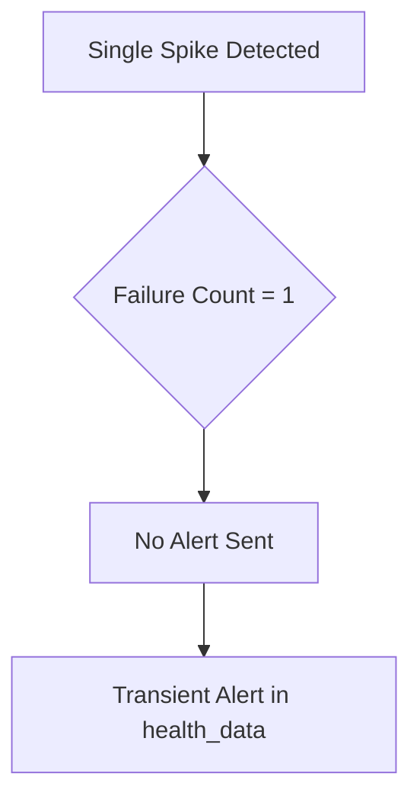
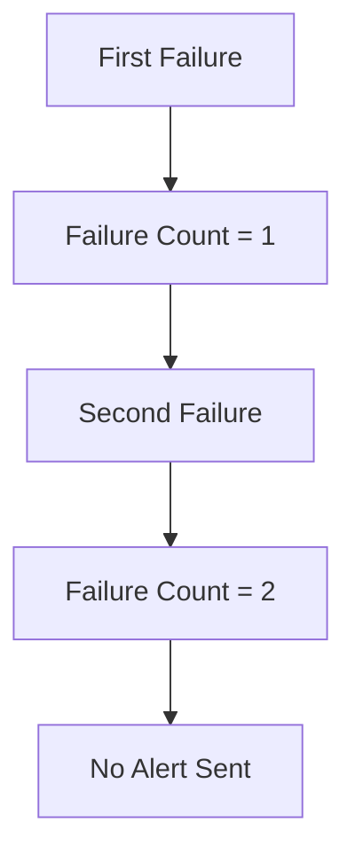
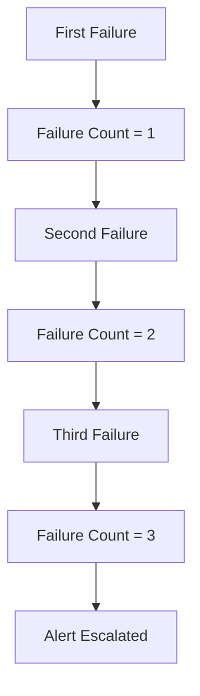
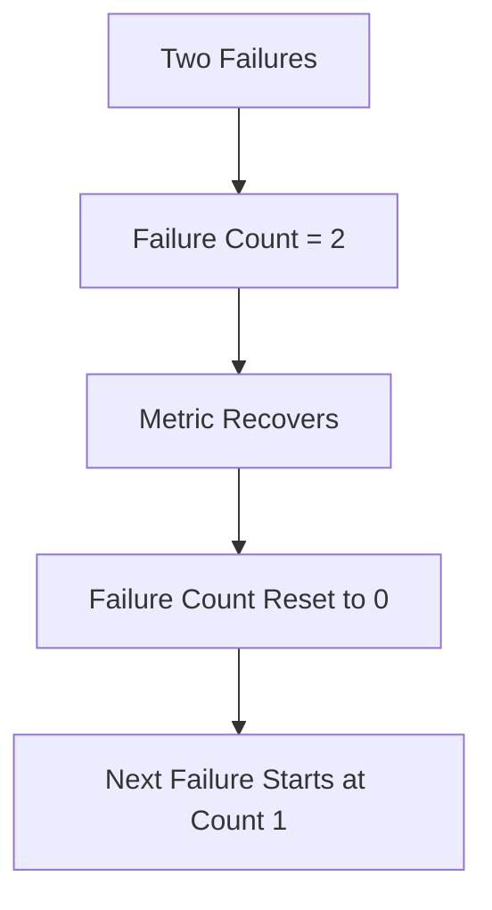
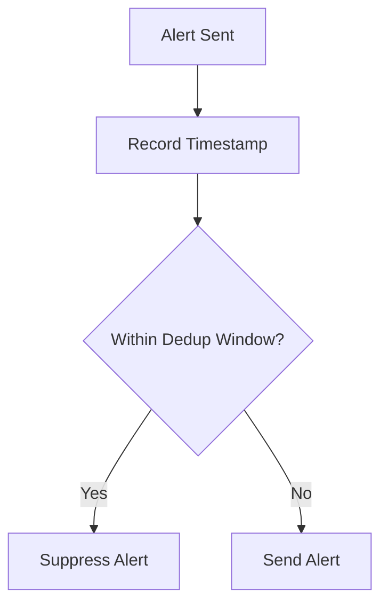
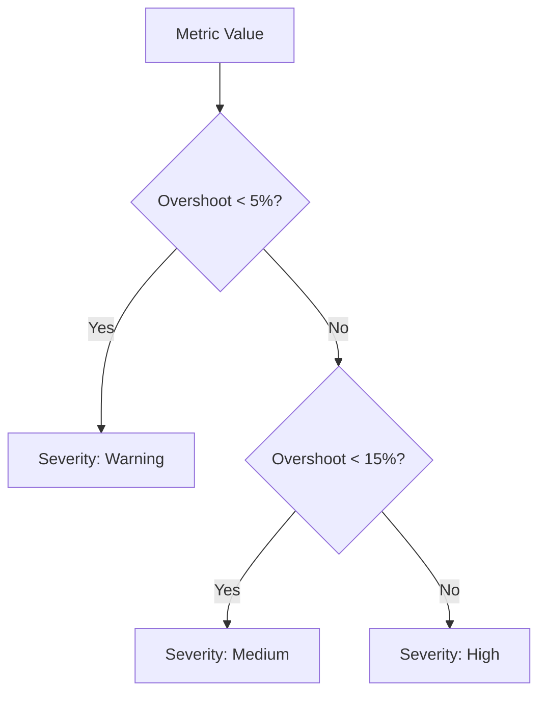
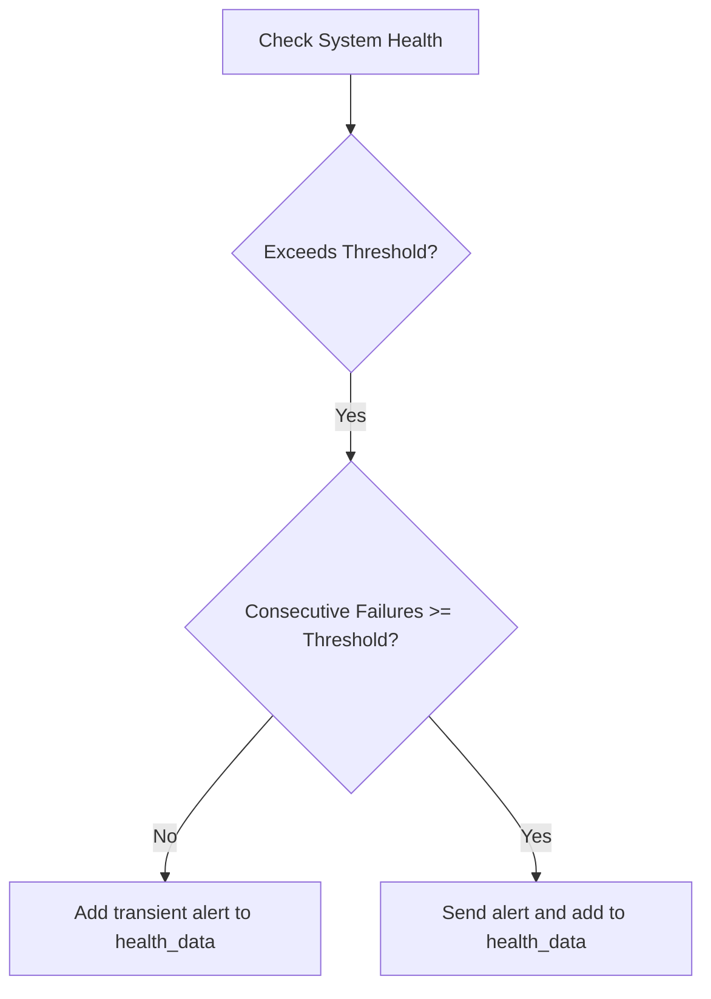
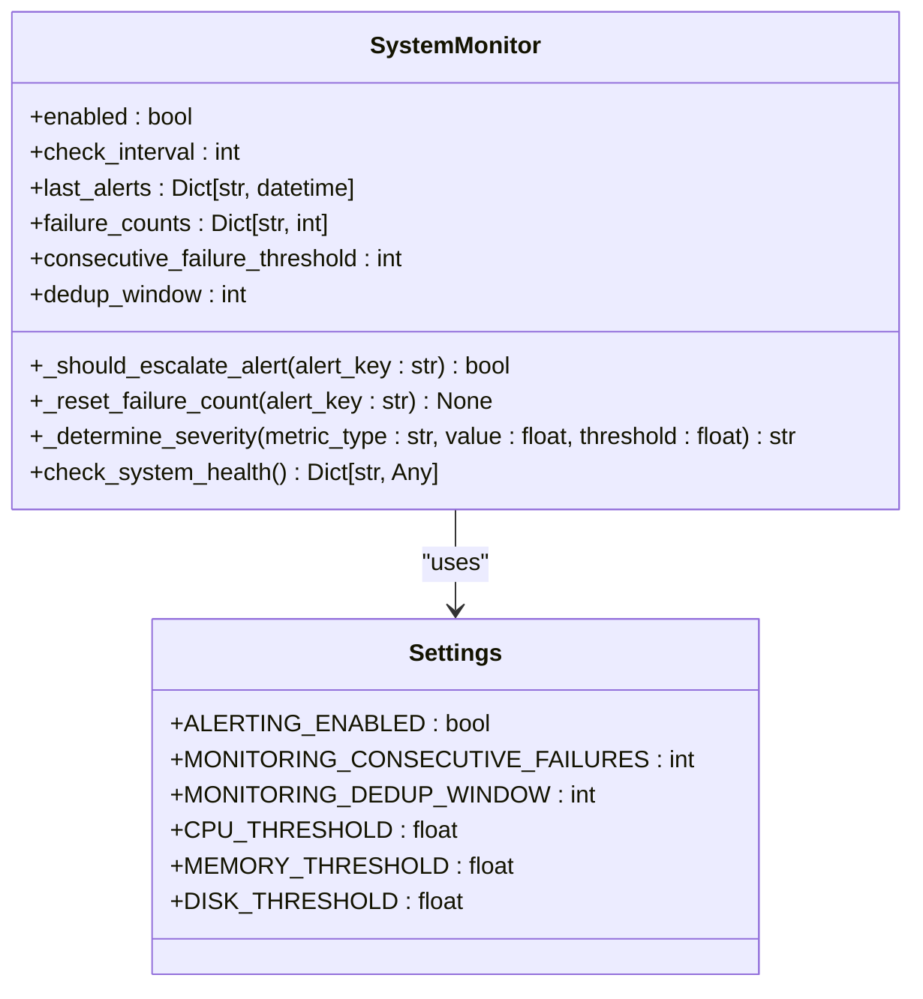

# Testing and Validation

<cite>
**Referenced Files in This Document**   
- [test_monitoring_alert_dedup.py](file://test_files/integration/test_monitoring_alert_dedup.py)
- [alert-stabilization.md](file://docs/monitoring/alert-stabilization.md)
- [alert-stabilization-summary.md](file://docs/monitoring/alert-stabilization-summary.md)
- [config.py](file://vertex-ar/app/config.py)
- [monitoring.py](file://vertex-ar/app/monitoring.py)
</cite>

## Table of Contents
1. [Introduction](#introduction)
2. [Core Test Cases](#core-test-cases)
3. [Test Execution](#test-execution)
4. [Adding New Test Scenarios](#adding-new-test-scenarios)
5. [Configuration and Defaults](#configuration-and-defaults)
6. [Example Scenarios from Documentation](#example-scenarios-from-documentation)
7. [Conclusion](#conclusion)

## Introduction

The alert stabilization system in Vertex AR ensures that transient system issues do not trigger unnecessary alerts, while sustained problems are properly escalated. This documentation details the test cases implemented in `test_monitoring_alert_dedup.py` that verify critical functionality including consecutive failure tracking, alert deduplication, severity determination, and proper alert state management. The tests validate that the system correctly handles CPU spikes, sustained high usage, and service degradation/failure transitions as described in the `alert-stabilization.md` documentation.

**Section sources**
- [alert-stabilization.md](file://docs/monitoring/alert-stabilization.md)
- [alert-stabilization-summary.md](file://docs/monitoring/alert-stabilization-summary.md)

## Core Test Cases

The test suite in `test_monitoring_alert_dedup.py` verifies the following critical behaviors of the alert stabilization system:

### Single Transient Spikes Not Triggering Alerts

The test `test_consecutive_failure_tracking_single_spike` verifies that a single spike in system metrics does not trigger an alert. When a metric exceeds its threshold for the first time, the failure count is incremented but no alert is escalated. This prevents noise from temporary system fluctuations.



**Diagram sources**
- [test_monitoring_alert_dedup.py](file://test_files/integration/test_monitoring_alert_dedup.py#L30-L37)
- [monitoring.py](file://vertex-ar/app/monitoring.py#L152-L180)

### Two Consecutive Failures Not Triggering Alerts

The test `test_consecutive_failure_tracking_two_spikes` confirms that two consecutive failures do not trigger an alert when the threshold is set to three. The failure count is incremented to two, but since it has not reached the threshold, no alert is sent. This provides a buffer for intermittent issues.



**Diagram sources**
- [test_monitoring_alert_dedup.py](file://test_files/integration/test_monitoring_alert_dedup.py#L41-L50)
- [monitoring.py](file://vertex-ar/app/monitoring.py#L152-L180)

### Three Consecutive Failures Triggering Alerts

The test `test_consecutive_failure_tracking_sustained_issue` validates that three consecutive failures trigger an alert when `MONITORING_CONSECUTIVE_FAILURES=3`. After the third consecutive failure, the system escalates the alert and records it in the alert history.



**Diagram sources**
- [test_monitoring_alert_dedup.py](file://test_files/integration/test_monitoring_alert_dedup.py#L54-L65)
- [monitoring.py](file://vertex-ar/app/monitoring.py#L152-L180)

### Proper Reset of Failure Counts Upon Recovery

The test `test_failure_count_reset_on_recovery` ensures that when a metric returns to a healthy state, the failure count is reset to zero. This allows the system to distinguish between sustained issues and intermittent problems that resolve themselves.



**Diagram sources**
- [test_monitoring_alert_dedup.py](file://test_files/integration/test_monitoring_alert_dedup.py#L70-L86)
- [monitoring.py](file://vertex-ar/app/monitoring.py#L182-L191)

### Enforcement of Deduplication Window

The test `test_deduplication_window` verifies that the deduplication window prevents rapid re-alerting. After an alert is sent, subsequent alerts of the same type are suppressed for the duration of the deduplication window (default 300 seconds).



**Diagram sources**
- [test_monitoring_alert_dedup.py](file://test_files/integration/test_monitoring_alert_dedup.py#L90-L111)
- [monitoring.py](file://vertex-ar/app/monitoring.py#L152-L180)

### Correct Severity Determination

The tests `test_severity_determination_warning`, `test_severity_determination_medium`, and `test_severity_determination_high` validate that the system correctly determines alert severity based on threshold overshoot levels:

- **Warning**: Just over threshold (<5% overshoot)
- **Medium**: Moderately degraded (5-15% overshoot)
- **High**: Critical level (>15% overshoot or >95% absolute)



**Diagram sources**
- [test_monitoring_alert_dedup.py](file://test_files/integration/test_monitoring_alert_dedup.py#L115-L140)
- [monitoring.py](file://vertex-ar/app/monitoring.py#L193-L218)

### Accurate Reflection of Alerts in health_data

The tests `test_cpu_alert_not_sent_on_single_spike` and `test_cpu_alert_sent_after_sustained_issue` verify that the `health_data["alerts"]` field accurately reflects the alert state. Transient issues are marked with `transient: true`, while escalated alerts are included without this flag, ensuring consistency between the Notification Center view and actual alerts sent.



**Diagram sources**
- [test_monitoring_alert_dedup.py](file://test_files/integration/test_monitoring_alert_dedup.py#L143-L248)
- [monitoring.py](file://vertex-ar/app/monitoring.py#L1373-L1593)

**Section sources**
- [test_monitoring_alert_dedup.py](file://test_files/integration/test_monitoring_alert_dedup.py)
- [monitoring.py](file://vertex-ar/app/monitoring.py)

## Test Execution

To run the alert stabilization tests, execute the test script directly:

```bash
cd vertex-ar
python test_monitoring_alert_dedup.py
```

The test script includes a `run_async_tests()` function that executes all test cases and provides a summary of results. When run successfully, the output will show:

```
============================================================
Testing Monitoring Alert Deduplication & Stabilization
============================================================

Testing consecutive failure tracking...
✅ Single spike does not escalate to alert
✅ Two consecutive spikes do not escalate to alert
✅ Sustained issue (3 consecutive failures) escalates to alert
✅ Failure count resets on recovery
✅ Deduplication window works correctly

Testing severity determination...
✅ Just-over-threshold values get 'warning' severity
✅ Moderately degraded values get 'medium' severity
✅ Critical values get 'high' severity

Testing alert sending behavior...
✅ Single CPU spike does not send alert
✅ Sustained CPU issue sends alert after 3 checks
✅ Degraded service gets warning, failed service gets high severity
✅ Multiple metrics track independently

============================================================
✅ All tests passed!
============================================================

Summary:
- Single noisy samples do not trigger alerts ✅
- Sustained issues (3+ consecutive failures) do trigger alerts ✅
- Deduplication window prevents alert spam ✅
- Degraded services get warning severity ✅
- Failed services get high severity ✅
- Multiple metrics track independently ✅
- health_data['alerts'] mirrors sent alerts ✅
```

The tests use mocking to isolate the alerting system, allowing verification of alert conditions without actually sending notifications. The `AsyncMock` for `alert_manager.send_alert` enables verification of call counts and parameters.

**Section sources**
- [test_monitoring_alert_dedup.py](file://test_files/integration/test_monitoring_alert_dedup.py#L380-L444)

## Adding New Test Scenarios

When adding new test scenarios for edge cases or modifying existing tests for configuration changes, follow these guidelines:

### Adding Edge Case Tests

To test new edge cases, create additional test methods in the `TestMonitoringAlertDedup` class. For example, to test a scenario where multiple metrics fail simultaneously:

```python
def test_multiple_metrics_simultaneous_failure(self):
    """Test that multiple metrics failing simultaneously are handled correctly."""
    with patch('app.monitoring.alert_manager.send_alert', new_callable=AsyncMock) as mock_alert:
        # Mock multiple metrics over threshold
        with patch.object(self.monitor, 'get_cpu_usage') as mock_cpu, \
             patch.object(self.monitor, 'get_memory_usage') as mock_mem, \
             patch.object(self.monitor, 'get_disk_usage') as mock_disk:
            
            mock_cpu.return_value = {"percent": 85.0}
            mock_mem.return_value = {"virtual": {"percent": 90}}
            mock_disk.return_value = {"storage": {"percent": 95}}
            
            # Run checks to reach threshold
            for _ in range(3):
                await self.monitor.check_system_health()
            
            # Verify all alerts were sent
            assert mock_alert.call_count == 3
```

### Modifying Tests for Configuration Changes

When configuration defaults change (e.g., `MONITORING_CONSECUTIVE_FAILURES` changes from 3 to 4), update the test setup accordingly:

```python
def setup_method(self):
    """Set up test fixtures with updated configuration."""
    self.monitor = SystemMonitor()
    # Update for new configuration default
    self.monitor.consecutive_failure_threshold = 4  # Changed from 3 to 4
    self.monitor.dedup_window = 600  # Changed from 300 to 600 seconds
```

Then update test assertions to reflect the new thresholds:

```python
def test_consecutive_failure_tracking_sustained_issue(self):
    """Test that sustained issues (4+ failures) do escalate to alert."""
    alert_key = "test_cpu"
    
    # First, second, and third failures - no escalation
    self.monitor._should_escalate_alert(alert_key)
    self.monitor._should_escalate_alert(alert_key)
    self.monitor._should_escalate_alert(alert_key)
    
    # Fourth failure - should escalate
    result = self.monitor._should_escalate_alert(alert_key)
    assert result is True
    assert self.monitor.failure_counts[alert_key] == 4
```

### Testing Service Degradation Scenarios

To add tests for service degradation scenarios, extend the test suite to cover additional service types:

```python
async def test_service_degradation_scenarios(self):
    """Test various service degradation scenarios."""
    with patch('app.monitoring.alert_manager.send_alert', new_callable=AsyncMock) as mock_alert:
        with patch.object(self.monitor, 'get_service_health') as mock_service:
            
            # Test database slow response
            mock_service.return_value = {
                "database": {
                    "healthy": True,
                    "response_time_ms": 6000,
                    "status": "degraded"
                }
            }
            
            # Test storage service failure
            mock_service.return_value = {
                "storage": {
                    "healthy": False,
                    "error": "Connection timeout"
                }
            }
            
            # Test multiple services degraded
            mock_service.return_value = {
                "database": {"healthy": True, "response_time_ms": 7000},
                "minio": {"healthy": False, "error": "Authentication failed"},
                "web_server": {"healthy": True, "response_time_ms": 8000}
            }
            
            # Run multiple checks and verify alert behavior
            for _ in range(3):
                await self.monitor.check_system_health()
            
            # Assert expected alert patterns
            assert len(mock_alert.call_args_list) > 0
```

**Section sources**
- [test_monitoring_alert_dedup.py](file://test_files/integration/test_monitoring_alert_dedup.py)
- [config.py](file://vertex-ar/app/config.py)

## Configuration and Defaults

The alert stabilization system is configured through environment variables defined in `config.py`. The key configuration parameters tested in the suite are:

### MONITORING_CONSECUTIVE_FAILURES

This setting determines the number of consecutive failures required before an alert is escalated. The default value is 3, which is tested in the core test cases.

```python
self.consecutive_failure_threshold = getattr(settings, 'MONITORING_CONSECUTIVE_FAILURES', 3)
```

### MONITORING_DEDUP_WINDOW

This setting defines the deduplication window in seconds during which repeated alerts of the same type are suppressed. The default value is 300 seconds (5 minutes).

```python
self.dedup_window = getattr(settings, 'MONITORING_DEDUP_WINDOW', settings.NOTIFICATION_DEDUP_WINDOW)
```

### Alert Thresholds

The system uses configurable thresholds for CPU, memory, and disk usage. These are tested in conjunction with the consecutive failure logic:

```python
self.alert_thresholds = {
    "cpu": settings.CPU_THRESHOLD,
    "memory": settings.MEMORY_THRESHOLD,
    "disk": settings.DISK_THRESHOLD,
}
```

When modifying these defaults, ensure that the test values are updated accordingly to maintain test validity.



**Diagram sources**
- [config.py](file://vertex-ar/app/config.py#L123-L144)
- [monitoring.py](file://vertex-ar/app/monitoring.py#L20-L200)

**Section sources**
- [config.py](file://vertex-ar/app/config.py)
- [monitoring.py](file://vertex-ar/app/monitoring.py)

## Example Scenarios from Documentation

The `alert-stabilization.md` file documents several example scenarios that are directly tested in the test suite:

### Scenario 1: CPU Transient Spike

This scenario is tested by `test_cpu_alert_not_sent_on_single_spike`, which verifies that a single CPU spike does not send an alert but records a transient warning in `health_data`.

```python
# Test implementation
async def test_cpu_alert_not_sent_on_single_spike(self):
    """Test that CPU alert is not sent on a single spike."""
    with patch('app.monitoring.alert_manager.send_alert', new_callable=AsyncMock) as mock_alert:
        with patch.object(self.monitor, 'get_cpu_usage') as mock_cpu:
            mock_cpu.return_value = {"percent": 85.0}
            
            health_data = await self.monitor.check_system_health()
            
            # Verify alert was NOT sent
            mock_alert.assert_not_called()
            
            # Verify health_data includes the transient alert
            assert len(health_data["alerts"]) == 1
            assert health_data["alerts"][0]["transient"] is True
```

### Scenario 2: CPU Sustained High Usage

This scenario is tested by `test_cpu_alert_sent_after_sustained_issue`, which verifies that three consecutive high CPU readings trigger an alert.

```python
# Test implementation
async def test_cpu_alert_sent_after_sustained_issue(self):
    """Test that CPU alert IS sent after 3 consecutive high readings."""
    with patch('app.monitoring.alert_manager.send_alert', new_callable=AsyncMock) as mock_alert:
        with patch.object(self.monitor, 'get_cpu_usage') as mock_cpu:
            mock_cpu.return_value = {"percent": 85.0}
            
            # First and second checks - no alert
            await self.monitor.check_system_health()
            await self.monitor.check_system_health()
            assert mock_alert.call_count == 0
            
            # Third check - should send alert
            await self.monitor.check_system_health()
            assert mock_alert.call_count == 1
```

### Scenario 3: Service Degraded Then Failed

This scenario is tested by `test_service_degraded_warning_vs_failure`, which verifies that a slow service receives a medium severity alert, while a completely failed service receives a high severity alert.

```python
# Test implementation
async def test_service_degraded_warning_vs_failure(self):
    """Test that slow service gets warning, failed service gets high severity."""
    with patch('app.monitoring.alert_manager.send_alert', new_callable=AsyncMock) as mock_alert:
        with patch.object(self.monitor, 'get_service_health') as mock_service:
            
            # Test degraded service (slow but working)
            mock_service.return_value = {
                "database": {
                    "healthy": True,
                    "response_time_ms": 6000,
                    "status": "degraded"
                }
            }
            
            # Run 3 checks to reach threshold
            for _ in range(3):
                await self.monitor.check_system_health()
            
            # Should have called alert with "medium" severity
            assert any(call[0][3] == "medium" for call in mock_alert.call_args_list)
            
            # Reset for next test
            mock_alert.reset_mock()
            
            # Test failed service
            mock_service.return_value = {
                "database": {
                    "healthy": False,
                    "response_time_ms": None,
                    "status": "failed",
                    "error": "Connection refused"
                }
            }
            
            # Reset failure counts
            self.monitor.failure_counts = {}
            self.monitor.last_alerts = {}
            
            # Run 3 checks to reach threshold
            for _ in range(3):
                await self.monitor.check_system_health()
            
            # Should have called alert with "high" severity
            assert any(call[0][3] == "high" for call in mock_alert.call_args_list)
```

These test cases ensure that the documented behaviors are implemented correctly and continue to work as expected after code changes.

**Section sources**
- [alert-stabilization.md](file://docs/monitoring/alert-stabilization.md#L190-L217)
- [test_monitoring_alert_dedup.py](file://test_files/integration/test_monitoring_alert_dedup.py#L251-L316)

## Conclusion

The test suite in `test_monitoring_alert_dedup.py` provides comprehensive coverage of the alert stabilization system in Vertex AR. It verifies that transient issues do not trigger unnecessary alerts, while sustained problems are properly escalated after three consecutive failures. The tests validate the deduplication window, severity determination, and accurate reflection of alert states in the health data.

To maintain the reliability of the alerting system, ensure that:
- New configuration options are accompanied by corresponding test cases
- Changes to default values are reflected in the test setup
- Edge cases are tested to prevent regression
- The relationship between `health_data["alerts"]` and actual alerts sent remains consistent

The documented example scenarios from `alert-stabilization.md` are directly implemented as test cases, ensuring that the system behaves as documented and expected in production environments.