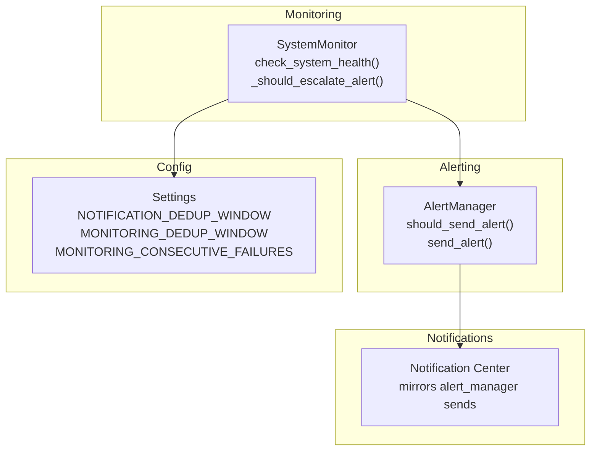
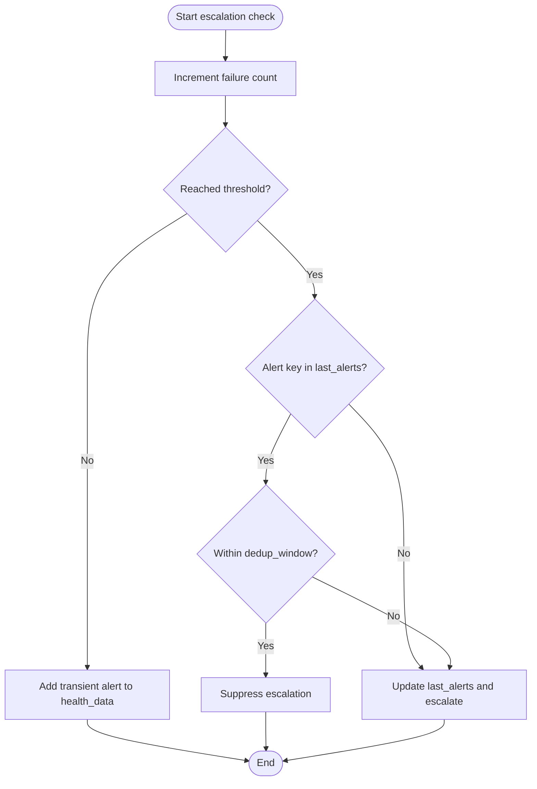
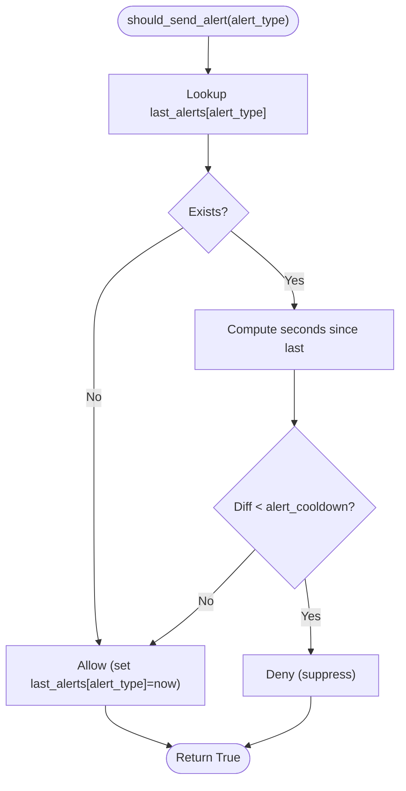
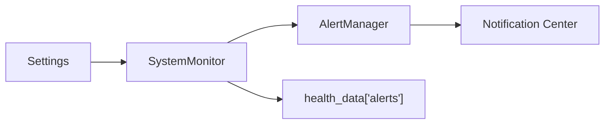

# Alert Cooldown and Deduplication

<cite>
**Referenced Files in This Document**
- [monitoring.py](file://vertex-ar/app/monitoring.py)
- [alerting.py](file://vertex-ar/app/alerting.py)
- [config.py](file://vertex-ar/app/config.py)
- [test_monitoring_alert_dedup.py](file://test_files/integration/test_monitoring_alert_dedup.py)
- [alert-stabilization.md](file://docs/monitoring/alert-stabilization.md)
- [alert-stabilization-summary.md](file://docs/monitoring/alert-stabilization-summary.md)
- [persistent-settings.md](file://docs/monitoring/persistent-settings.md)
</cite>

## Table of Contents
1. [Introduction](#introduction)
2. [Project Structure](#project-structure)
3. [Core Components](#core-components)
4. [Architecture Overview](#architecture-overview)
5. [Detailed Component Analysis](#detailed-component-analysis)
6. [Dependency Analysis](#dependency-analysis)
7. [Performance Considerations](#performance-considerations)
8. [Troubleshooting Guide](#troubleshooting-guide)
9. [Conclusion](#conclusion)
10. [Appendices](#appendices)

## Introduction
This document explains the alert cooldown and deduplication mechanisms in Vertex AR’s monitoring system. It focuses on:
- The should_send_alert method in the alerting subsystem that enforces a 300-second cooldown for identical alert types.
- Integration with the system-wide deduplication window controlled by NOTIFICATION_DEDUP_WINDOW (default 300 seconds) and overridable by MONITORING_DEDUP_WINDOW.
- Consecutive failure tracking requiring N consecutive failures (configurable via MONITORING_CONSECUTIVE_FAILURES) before escalation to prevent noise from transient spikes.
- Health data consistency that mirrors alert_manager sends in health_data["alerts"] with transient flags for non-escalated issues.
- Configuration examples for development, production, and high-traffic environments.
- Troubleshooting guidance for alert suppression or delayed notifications.

## Project Structure
The monitoring and alerting logic resides primarily in:
- Monitoring orchestrator and health evaluation: vertex-ar/app/monitoring.py
- Alerting and cooldown enforcement: vertex-ar/app/alerting.py
- Configuration settings: vertex-ar/app/config.py
- Tests validating deduplication and stabilization: test_files/integration/test_monitoring_alert_dedup.py
- Documentation describing behavior and configuration: docs/monitoring/alert-stabilization.md and docs/monitoring/alert-stabilization-summary.md, docs/monitoring/persistent-settings.md



**Diagram sources**
- [monitoring.py](file://vertex-ar/app/monitoring.py#L1373-L1604)
- [alerting.py](file://vertex-ar/app/alerting.py#L218-L278)
- [config.py](file://vertex-ar/app/config.py#L132-L145)

**Section sources**
- [monitoring.py](file://vertex-ar/app/monitoring.py#L1373-L1604)
- [alerting.py](file://vertex-ar/app/alerting.py#L218-L278)
- [config.py](file://vertex-ar/app/config.py#L132-L145)

## Core Components
- SystemMonitor: Orchestrates health checks, computes severity, tracks consecutive failures, and decides whether to escalate alerts. It also populates health_data["alerts"] with transient entries when conditions are not yet severe enough to send.
- AlertManager: Enforces a per-alert-type cooldown and routes alerts to configured channels, while also persisting notifications for the Notification Center.
- Settings: Exposes configuration keys for deduplication windows and consecutive failure thresholds.

Key responsibilities:
- Consecutive failure tracking: failure_counts per alert key; reset on recovery.
- Deduplication: last_alerts per alert key; enforced by both SystemMonitor and AlertManager.
- Severity determination: based on overshoot percentage and absolute thresholds.
- Health data mirroring: transient vs escalated alerts in health_data["alerts"].

**Section sources**
- [monitoring.py](file://vertex-ar/app/monitoring.py#L152-L191)
- [monitoring.py](file://vertex-ar/app/monitoring.py#L1373-L1604)
- [alerting.py](file://vertex-ar/app/alerting.py#L218-L278)
- [config.py](file://vertex-ar/app/config.py#L132-L145)

## Architecture Overview
The monitoring loop evaluates system health and services. For each potential alert:
- SystemMonitor determines severity and decides escalation using consecutive failure tracking and deduplication.
- If escalated, SystemMonitor calls AlertManager.send_alert, which enforces a cooldown and persists notifications.
- health_data["alerts"] is populated consistently with either transient entries (not yet escalated) or escalated entries (with full severity).

```mermaid
sequenceDiagram
participant Loop as "Monitoring Loop"
participant Monitor as "SystemMonitor"
participant Manager as "AlertManager"
participant Notify as "Notification Center"
Loop->>Monitor : check_system_health()
Monitor->>Monitor : evaluate metrics and services
Monitor->>Monitor : _should_escalate_alert(alert_key)
alt Escalate
Monitor->>Manager : send_alert(alert_key, subject, message, severity)
Manager->>Manager : should_send_alert(alert_type)
alt Within cooldown
Manager-->>Monitor : False (suppress)
else Allowed
Manager->>Notify : persist notification
Manager-->>Monitor : True (sent)
end
Monitor-->>Loop : health_data["alerts"] includes escalated entry
else Transient
Monitor-->>Loop : health_data["alerts"] includes transient entry
end
```

**Diagram sources**
- [monitoring.py](file://vertex-ar/app/monitoring.py#L1373-L1604)
- [alerting.py](file://vertex-ar/app/alerting.py#L218-L278)

## Detailed Component Analysis

### Consecutive Failure Tracking and Escalation Decision
SystemMonitor maintains:
- failure_counts: per alert key failure count that increments on each failing check and resets on recovery.
- last_alerts: per alert key timestamp of last escalation.
- consecutive_failure_threshold: configurable via MONITORING_CONSECUTIVE_FAILURES.
- dedup_window: configurable via MONITORING_DEDUP_WINDOW or falls back to NOTIFICATION_DEDUP_WINDOW.

Escalation decision flow:
- Increment failure count for the alert key.
- If failure count reaches threshold:
  - Check last_alerts for the same alert key.
  - If within dedup_window, deny escalation.
  - Else, update last_alerts and allow escalation.
- On recovery, reset failure count.



**Diagram sources**
- [monitoring.py](file://vertex-ar/app/monitoring.py#L152-L191)

**Section sources**
- [monitoring.py](file://vertex-ar/app/monitoring.py#L152-L191)
- [monitoring.py](file://vertex-ar/app/monitoring.py#L1373-L1604)

### Alert Cooldown Enforcement (AlertManager.should_send_alert)
AlertManager enforces a per-alert-type cooldown:
- Stores last_alerts keyed by alert_type.
- Compares current time with last_alerts[alert_type].
- If within cooldown, returns False to suppress.
- Otherwise updates last_alerts and returns True.

Cooldown default: 300 seconds.



**Diagram sources**
- [alerting.py](file://vertex-ar/app/alerting.py#L218-L227)

**Section sources**
- [alerting.py](file://vertex-ar/app/alerting.py#L218-L227)

### Deduplication Window Integration
SystemMonitor integrates with the deduplication window in two ways:
- SystemMonitor.last_alerts and dedup_window enforce per-alert-type suppression within the configured window.
- AlertManager.alert_cooldown enforces a separate per-alert-type cooldown for the alerting channel routing.

Configuration precedence:
- MONITORING_DEDUP_WINDOW overrides NOTIFICATION_DEDUP_WINDOW for monitoring deduplication.
- AlertManager.alert_cooldown remains at 300 seconds unless AlertManager is customized.

**Section sources**
- [monitoring.py](file://vertex-ar/app/monitoring.py#L36-L42)
- [config.py](file://vertex-ar/app/config.py#L132-L145)
- [alerting.py](file://vertex-ar/app/alerting.py#L218-L227)

### Severity Determination and Health Data Mirroring
Severity determination:
- Based on overshoot percentage and absolute thresholds.
- Warning, Medium, High levels are assigned accordingly.

Health data mirroring:
- Transient alerts (not yet escalated) appear in health_data["alerts"] with severity "warning" and transient: true.
- Escalated alerts appear with full severity and no transient flag.
- This ensures the Notification Center view aligns with actual alerts sent.

**Section sources**
- [monitoring.py](file://vertex-ar/app/monitoring.py#L193-L217)
- [monitoring.py](file://vertex-ar/app/monitoring.py#L1373-L1604)
- [alert-stabilization.md](file://docs/monitoring/alert-stabilization.md#L47-L75)
- [alert-stabilization-summary.md](file://docs/monitoring/alert-stabilization-summary.md#L111-L126)

### Configuration Examples
Environment-specific recommendations:
- Development: Lower consecutive failures and shorter dedup window for faster feedback.
- Production: Default values for balanced stability.
- High-traffic: Higher consecutive failures and longer dedup window to tolerate load spikes.

These examples are derived from the documentation and reflect recommended tuning.

**Section sources**
- [alert-stabilization-summary.md](file://docs/monitoring/alert-stabilization-summary.md#L194-L214)

## Dependency Analysis
- SystemMonitor depends on Settings for thresholds, intervals, and dedup windows.
- SystemMonitor calls AlertManager.send_alert when escalation occurs.
- AlertManager persists notifications for the Notification Center and enforces its own cooldown.
- Tests validate independent tracking across multiple metrics and confirm health_data mirroring.



**Diagram sources**
- [monitoring.py](file://vertex-ar/app/monitoring.py#L1373-L1604)
- [alerting.py](file://vertex-ar/app/alerting.py#L218-L278)
- [config.py](file://vertex-ar/app/config.py#L132-L145)

**Section sources**
- [monitoring.py](file://vertex-ar/app/monitoring.py#L1373-L1604)
- [alerting.py](file://vertex-ar/app/alerting.py#L218-L278)
- [test_monitoring_alert_dedup.py](file://test_files/integration/test_monitoring_alert_dedup.py#L1-L445)

## Performance Considerations
- Consecutive failure tracking uses lightweight dictionaries keyed by alert types, minimizing overhead.
- Deduplication checks are O(1) lookups per alert key.
- Monitoring loop includes cooldown and optional max runtime to avoid overload.
- Severity determination is constant-time arithmetic.

[No sources needed since this section provides general guidance]

## Troubleshooting Guide
Common issues and resolutions:
- Alerts not firing for transient spikes
  - Expected behavior: consecutive failure threshold must be met before escalation.
  - Verify MONITORING_CONSECUTIVE_FAILURES and that failure counts reset on recovery.
  - Confirm transient entries appear in health_data["alerts"] with transient: true.

- Alerts suppressed unexpectedly
  - Check deduplication windows:
    - MONITORING_DEDUP_WINDOW controls monitoring deduplication.
    - AlertManager.alert_cooldown controls channel routing cooldown.
  - Inspect last_alerts timestamps and ensure dedup_window has elapsed.

- Delayed notifications
  - Review HEALTH_CHECK_INTERVAL and HEALTH_CHECK_COOLDOWN.
  - Ensure monitoring loop is running and not blocked by timeouts.

- Misaligned Notification Center entries
  - Confirm health_data["alerts"] entries mirror AlertManager sends.
  - Escalated alerts should not have transient: true; transient alerts should be flagged.

Validation references:
- Tests demonstrate single spikes do not escalate, sustained issues do escalate, deduplication suppresses repeated alerts, and health_data mirrors sent alerts.

**Section sources**
- [monitoring.py](file://vertex-ar/app/monitoring.py#L1373-L1604)
- [alerting.py](file://vertex-ar/app/alerting.py#L218-L278)
- [test_monitoring_alert_dedup.py](file://test_files/integration/test_monitoring_alert_dedup.py#L1-L445)
- [persistent-settings.md](file://docs/monitoring/persistent-settings.md#L265-L292)

## Conclusion
Vertex AR’s monitoring system stabilizes alerts by combining:
- Consecutive failure tracking to prevent false positives from transient spikes.
- A configurable deduplication window to reduce alert spam.
- Severity-aware escalation and health data mirroring for transparency.
- A per-alert-type cooldown in the alerting layer to avoid channel flooding.

These mechanisms collectively improve reliability and reduce noise while preserving actionable signals in the Notification Center.

[No sources needed since this section summarizes without analyzing specific files]

## Appendices

### Configuration Keys and Defaults
- MONITORING_CONSECUTIVE_FAILURES: default 3
- MONITORING_DEDUP_WINDOW: default 300 seconds
- NOTIFICATION_DEDUP_WINDOW: default 300 seconds (fallback for monitoring)
- AlertManager.alert_cooldown: default 300 seconds

**Section sources**
- [config.py](file://vertex-ar/app/config.py#L132-L145)
- [alerting.py](file://vertex-ar/app/alerting.py#L218-L227)