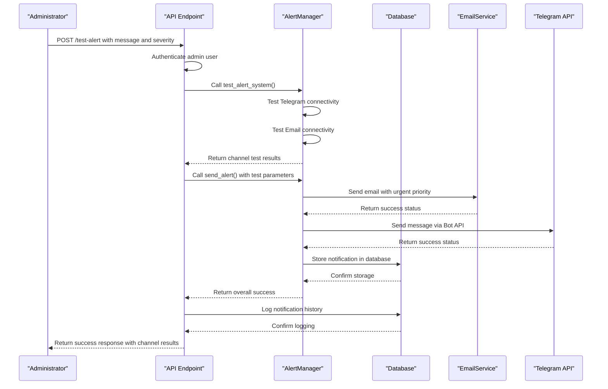
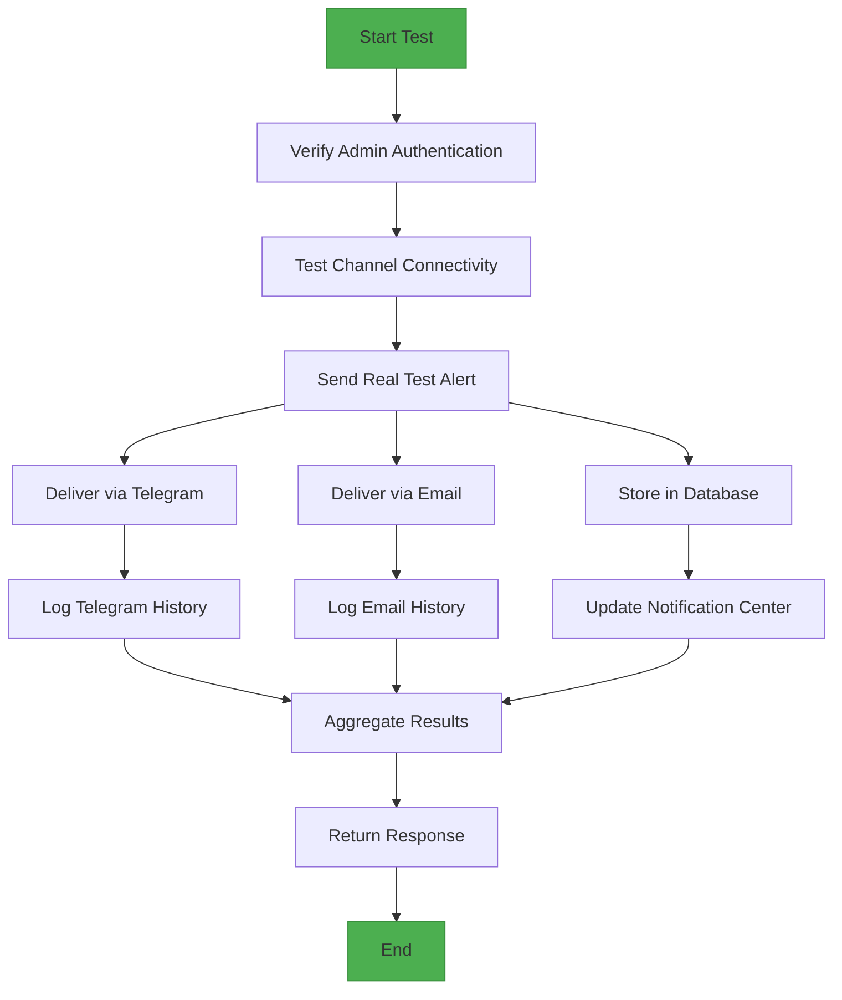

# Alert Testing and Validation

<cite>
**Referenced Files in This Document**   
- [vertex-ar/app/alerting.py](file://vertex-ar/app/alerting.py)
- [vertex-ar/app/api/monitoring.py](file://vertex-ar/app/api/monitoring.py)
- [vertex-ar/app/monitoring.py](file://vertex-ar/app/monitoring.py)
- [vertex-ar/app/database.py](file://vertex-ar/app/database.py)
- [vertex-ar/app/notification_config.py](file://vertex-ar/app/notification_config.py)
- [vertex-ar/app/api/notification_settings.py](file://vertex-ar/app/api/notification_settings.py)
- [vertex-ar/templates/admin_notification_settings.html](file://vertex-ar/templates/admin_notification_settings.html)
- [test_files/integration/test_monitoring.py](file://test_files/integration/test_monitoring.py)
- [test_files/integration/test_monitoring_alert_dedup.py](file://test_files/integration/test_monitoring_alert_dedup.py)
- [docs/monitoring/alert-stabilization-summary.md](file://docs/monitoring/alert-stabilization-summary.md)
- [docs/notifications/migration-summary.md](file://docs/notifications/migration-summary.md)
</cite>

## Table of Contents
1. [Introduction](#introduction)
2. [AlertManager test_alert_system Method](#alertmanager-test_alert_system-method)
3. [/test-alert API Endpoint](#test-alert-api-endpoint)
4. [Test Process and Workflow](#test-process-and-workflow)
5. [Configuration Validation Use Cases](#configuration-validation-use-cases)
6. [Test Response Examples](#test-response-examples)
7. [Failure Patterns and Troubleshooting](#failure-patterns-and-troubleshooting)
8. [Results Interpretation and Actions](#results-interpretation-and-actions)
9. [Conclusion](#conclusion)

## Introduction
The Vertex AR alert testing and validation system provides comprehensive tools for administrators to verify the integrity and functionality of the alert delivery pipeline. This system enables testing of all configured alert channels, validation of configuration changes, and verification of end-to-end notification workflows. The core components include the `test_alert_system` method in the `AlertManager` class and the `/test-alert` API endpoint, which work together to provide both connectivity testing and real alert delivery testing. This documentation details the implementation, usage, and troubleshooting of this critical system component.

## AlertManager test_alert_system Method
The `test_alert_system` method in the `AlertManager` class is responsible for testing the connectivity and configuration of all configured alert channels. This method performs a comprehensive check of both Telegram and email alert capabilities, returning success status for each channel.

```mermaid
flowchart TD
Start([test_alert_system]) --> CheckTelegram["Check Telegram configuration"]
CheckTelegram --> |Configured| TestTelegram["Send test Telegram alert"]
CheckTelegram --> |Not Configured| SetTelegramFail["Set telegram: false"]
TestTelegram --> |Success| SetTelegramSuccess["Set telegram: true"]
TestTelegram --> |Failure| SetTelegramFail
SetTelegramSuccess --> CheckEmail["Check email configuration in DB"]
SetTelegramFail --> CheckEmail
CheckEmail --> |Configured| TestEmail["Send test email alert"]
CheckEmail --> |Not Configured| SetEmailFail["Set email: false"]
TestEmail --> |Success| SetEmailSuccess["Set email: true"]
TestEmail --> |Failure| SetEmailFail
SetEmailSuccess --> LogResults["Log test results"]
SetEmailFail --> LogResults
LogResults --> ReturnResults["Return results dictionary"]
ReturnResults --> End([Return {telegram: bool, email: bool}])
```

**Diagram sources**
- [vertex-ar/app/alerting.py](file://vertex-ar/app/alerting.py#L355-L378)

**Section sources**
- [vertex-ar/app/alerting.py](file://vertex-ar/app/alerting.py#L355-L378)

The method works by first checking if Telegram is configured via environment variables (`TELEGRAM_BOT_TOKEN`) and then attempting to send a test message to all configured chat IDs. For email, it checks the database-stored SMTP configuration and attempts to send a test email using the `EmailService` with urgent delivery priority. The results are returned as a dictionary with boolean values for each channel, indicating success or failure. All test attempts are logged in the `notification_history` table for audit purposes, capturing both successful and failed attempts with detailed error messages.

## /test-alert API Endpoint
The `/test-alert` API endpoint provides an administrative interface for triggering comprehensive alert system tests. This endpoint not only tests channel connectivity but also sends a real test alert through the full delivery pipeline.



**Diagram sources**
- [vertex-ar/app/api/monitoring.py](file://vertex-ar/app/api/monitoring.py#L269-L296)

**Section sources**
- [vertex-ar/app/api/monitoring.py](file://vertex-ar/app/api/monitoring.py#L269-L296)

The endpoint requires administrator authentication and accepts a request body with optional message and severity parameters. When invoked, it first calls the `test_alert_system` method to verify channel connectivity, then proceeds to send a real test alert with the specified message and severity level through all enabled channels. This dual approach provides both a connectivity check and an end-to-end delivery test. The endpoint returns a success status, the results of the channel connectivity tests, and a confirmation message. The implementation ensures that even if the real alert fails to send, the connectivity test results are still returned to provide diagnostic information.

## Test Process and Workflow
The alert testing process verifies both technical connectivity and end-to-end workflow, ensuring that alerts can be successfully delivered and properly recorded in the system.



**Diagram sources**
- [vertex-ar/app/alerting.py](file://vertex-ar/app/alerting.py)
- [vertex-ar/app/api/monitoring.py](file://vertex-ar/app/api/monitoring.py)
- [vertex-ar/app/database.py](file://vertex-ar/app/database.py)

**Section sources**
- [vertex-ar/app/alerting.py](file://vertex-ar/app/alerting.py)
- [vertex-ar/app/api/monitoring.py](file://vertex-ar/app/api/monitoring.py)
- [vertex-ar/app/database.py](file://vertex-ar/app/database.py)

The test process begins with administrator authentication to ensure only authorized users can trigger test alerts. Once authenticated, the system first performs a connectivity test of all configured channels through the `test_alert_system` method. This step verifies that the necessary credentials and configurations are present and accessible. Following the connectivity check, the system sends a real test alert through the complete delivery pipeline, which includes multiple verification points. For Telegram alerts, the system verifies API connectivity and message delivery to each configured chat ID. For email alerts, it confirms SMTP configuration validity and successful message queuing with immediate delivery priority. Throughout this process, all actions are logged in the `notification_history` table, capturing recipient information, message content, delivery status, and any error messages. The alert is also stored in the main notifications database with enhanced metadata including priority, source, service name, and event data, ensuring it appears correctly in the Notification Center interface.

## Configuration Validation Use Cases
The alert testing system serves as a critical tool for configuration validation, particularly after deployment or credential changes. This functionality ensures that alert channels remain operational following system modifications.

### Post-Deployment Validation
After deploying Vertex AR to a new environment, administrators must validate that all alert channels are properly configured. The testing system allows for immediate verification of both Telegram and email configurations without requiring an actual system issue to occur. By using the `/test-alert` endpoint, administrators can confirm that the application can successfully connect to external services and deliver messages. This is particularly important for environments where firewall rules or network policies might restrict outbound connections to Telegram's API or SMTP servers.

### Credential Change Validation
When updating alert credentials, such as rotating SMTP passwords or changing Telegram bot tokens, the testing system provides immediate feedback on the validity of the new credentials. The system stores encrypted credentials in the database, and the test process verifies that these credentials can be successfully decrypted and used for authentication. This prevents configuration errors that could leave the system without alerting capabilities. The test also validates that the updated credentials have the necessary permissions, such as the ability to send messages to specified Telegram chat IDs or authenticate with the SMTP server.

### Integration with Notification Settings
The testing functionality is integrated with the notification settings management system, allowing administrators to test configurations immediately after making changes. When updating SMTP or Telegram settings through the admin interface, the system can automatically trigger a test to verify the new configuration. This tight integration ensures that configuration changes are validated in real-time, reducing the window during which the alert system might be non-functional.

**Section sources**
- [vertex-ar/app/notification_config.py](file://vertex-ar/app/notification_config.py)
- [vertex-ar/app/api/notification_settings.py](file://vertex-ar/app/api/notification_settings.py)
- [vertex-ar/templates/admin_notification_settings.html](file://vertex-ar/templates/admin_notification_settings.html)

## Test Response Examples
The alert testing system returns structured responses that provide clear information about the test results. Understanding these responses is essential for interpreting the system's status and taking appropriate actions.

### Successful Test Response
```json
{
  "success": true,
  "channels_tested": {
    "telegram": true,
    "email": true
  },
  "message": "Test alert sent successfully"
}
```
This response indicates that both Telegram and email channels were successfully tested and a real test alert was delivered through both channels. The `channels_tested` object shows that connectivity was established for both services, and the success flag confirms that the end-to-end delivery process completed without errors.

### Partial Success Response
```json
{
  "success": true,
  "channels_tested": {
    "telegram": true,
    "email": false
  },
  "message": "Test alert sent successfully"
}
```
This response indicates that while the overall test was considered successful (the API call completed without errors), the email channel failed its connectivity test. The Telegram channel is operational, but there may be issues with the SMTP configuration, credentials, or network connectivity that prevent email delivery.

### Failed Test Response
```json
{
  "success": false,
  "detail": "Test alert failed: Error sending email alert: [SSL: CERTIFICATE_VERIFY_FAILED] certificate verify failed"
}
```
This response indicates a complete failure of the test process. The error message provides specific information about the nature of the failure, in this case, an SSL certificate verification issue with the SMTP server. This level of detail helps administrators quickly identify and resolve the underlying problem.

**Section sources**
- [vertex-ar/app/api/monitoring.py](file://vertex-ar/app/api/monitoring.py#L286-L295)

## Failure Patterns and Troubleshooting
Understanding common failure patterns and their corresponding troubleshooting steps is essential for maintaining a reliable alert system.

### Telegram Alert Failures
**Common Causes:**
- Invalid or expired bot token
- Incorrect chat IDs
- Network connectivity issues to Telegram API
- Bot not added to specified chat groups

**Troubleshooting Steps:**
1. Verify the bot token format (should be in the format "123456789:ABCdefGHIjklMNOpqrsTUVwxyz")
2. Confirm that the bot has been added to the chat and has permission to send messages
3. Test the bot token directly using the Telegram Bot API: `https://api.telegram.org/bot<TOKEN>/getMe`
4. Verify network connectivity to `api.telegram.org` on port 443
5. Check that the chat IDs are correct and the bot has been started by the user (for private chats)

### Email Alert Failures
**Common Causes:**
- Incorrect SMTP server settings
- Invalid credentials
- SSL/TLS configuration issues
- Sender email address not authorized
- Email service rate limiting

**Troubleshooting Steps:**
1. Verify SMTP server hostname, port, and security settings (SSL/TLS)
2. Test credentials using a standard email client
3. Check that the "from" email address is authorized by the SMTP provider
4. Verify that the server can resolve the SMTP server hostname
5. Check for firewall rules blocking outbound connections on SMTP ports (25, 465, 587)
6. Review SMTP server logs for specific error messages

### Database and Logging Issues
**Common Causes:**
- Database connection failures
- Permission issues with notification tables
- Disk space limitations
- Encryption/decryption failures for stored credentials

**Troubleshooting Steps:**
1. Verify database connectivity and credentials
2. Check that the `notification_history` and `notifications` tables exist and have the correct schema
3. Verify sufficient disk space for database operations
4. Test credential encryption/decryption functionality
5. Check database error logs for specific issues

**Section sources**
- [vertex-ar/app/alerting.py](file://vertex-ar/app/alerting.py)
- [vertex-ar/app/database.py](file://vertex-ar/app/database.py)
- [vertex-ar/app/notification_config.py](file://vertex-ar/app/notification_config.py)

## Results Interpretation and Actions
Interpreting test results correctly is crucial for maintaining system reliability and taking appropriate actions based on the outcomes.

### Interpreting Success Results
When both channels return success (`telegram: true, email: true`), the alert system is fully operational. This indicates that:
- All required credentials are correctly configured and accessible
- Network connectivity to external services is established
- Message delivery mechanisms are functioning properly
- Database logging is operational

No immediate action is required, but administrators should periodically retest to ensure continued functionality, especially after system updates or network changes.

### Interpreting Partial Success Results
When one channel succeeds and the other fails, immediate investigation is required. For example, if Telegram succeeds but email fails:
- Focus troubleshooting on SMTP configuration and email service connectivity
- Verify that email credentials are correctly encrypted and stored
- Check that the email service is not rate limiting the application
- Temporarily rely on Telegram for critical alerts until email is restored

### Interpreting Failure Results
Complete test failures require immediate attention:
- Check system logs for detailed error messages
- Verify network connectivity and firewall rules
- Validate that all required environment variables are set
- Check database connectivity and table integrity
- Consider rolling back recent configuration changes

Administrators should establish a regular testing schedule (e.g., weekly) to proactively identify and resolve issues before they impact alert delivery during actual system incidents.

**Section sources**
- [vertex-ar/app/alerting.py](file://vertex-ar/app/alerting.py)
- [vertex-ar/app/api/monitoring.py](file://vertex-ar/app/api/monitoring.py)

## Conclusion
The alert testing and validation system in Vertex AR provides a comprehensive solution for ensuring the reliability of critical alert delivery channels. By combining connectivity testing with end-to-end delivery verification, the system enables administrators to validate configurations, troubleshoot issues, and maintain confidence in the alert infrastructure. The integration of the `test_alert_system` method and `/test-alert` API endpoint with comprehensive logging and database storage ensures that both technical connectivity and workflow integrity are verified. Regular use of this testing system is essential for maintaining system reliability, particularly after deployment or configuration changes. Administrators should incorporate regular testing into their operational procedures to ensure that alert channels remain functional and that the system can effectively communicate critical information when needed.