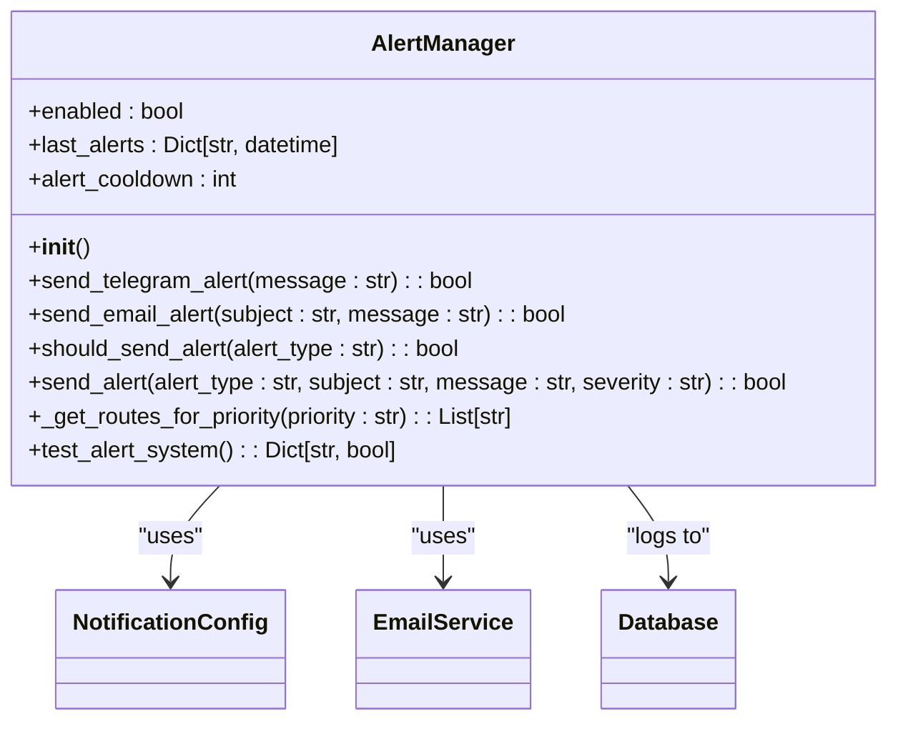
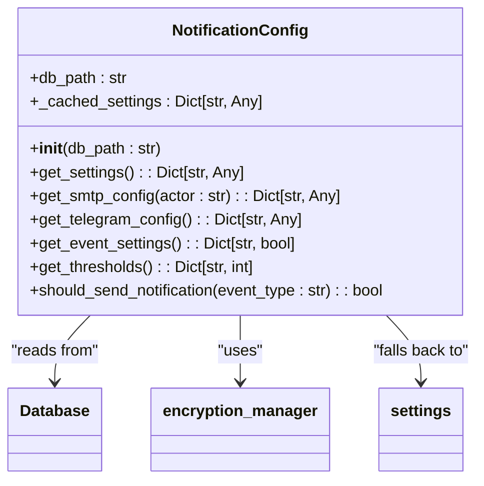
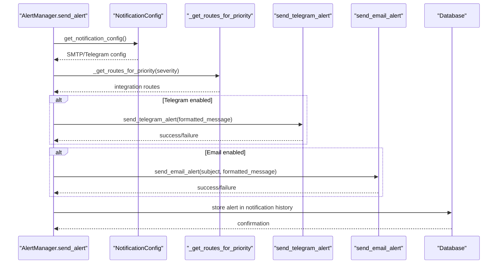
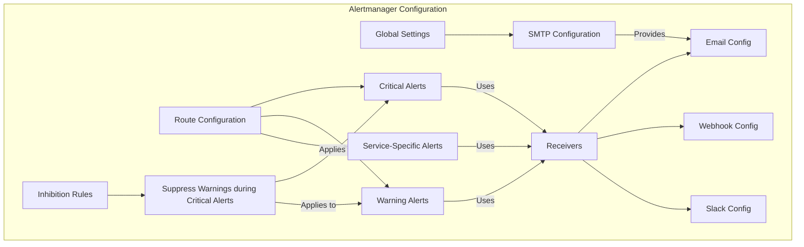

# Alerting Integration

<cite>
**Referenced Files in This Document**   
- [alerting.py](file://vertex-ar/app/alerting.py)
- [notification_config.py](file://vertex-ar/app/notification_config.py)
- [notification_integrations.py](file://vertex-ar/notification_integrations.py)
- [alertmanager.yml](file://monitoring/alertmanager.yml)
- [notifications.py](file://vertex-ar/notifications.py)
- [notification_settings.py](file://vertex-ar/app/api/notification_settings.py)
- [test_notifications_comprehensive.py](file://test_files/integration/test_notifications_comprehensive.py)
</cite>

## Table of Contents
1. [Introduction](#introduction)
2. [AlertManager Class Implementation](#alertmanager-class-implementation)
3. [Notification Configuration System](#notification-configuration-system)
4. [Multi-Channel Alert Delivery](#multi-channel-alert-delivery)
5. [External Alertmanager Integration](#external-alertmanager-integration)
6. [Configuration Examples](#configuration-examples)
7. [Troubleshooting Guide](#troubleshooting-guide)
8. [Conclusion](#conclusion)

## Introduction

The alerting integration system in Vertex AR provides a robust notification framework for delivering critical alerts through multiple channels, primarily Telegram and email. This system ensures that operational issues and important events are communicated promptly to administrators and relevant stakeholders. The core of this system is the AlertManager class, which handles the sending of alerts through various channels with configurable routing based on severity and priority.

The alerting system integrates with both internal configuration stored in the database and external Alertmanager configuration for comprehensive monitoring and notification policies. It supports fallback mechanisms to environment variables when database configurations are unavailable, ensuring reliable delivery even during configuration issues. The system also includes comprehensive testing capabilities through the test_alert_system function, allowing administrators to validate their alert configurations.

This documentation provides a detailed analysis of the AlertManager implementation, covering the send_telegram_alert and send_email_alert methods, the multi-channel send_alert method with severity-based formatting, and the _get_routes_for_priority routing mechanism. It also explains the integration with the external Alertmanager configuration in alertmanager.yml and provides guidance on configuration and troubleshooting.

**Section sources**
- [alerting.py](file://vertex-ar/app/alerting.py#L1-L383)

## AlertManager Class Implementation

The AlertManager class serves as the central component for emergency notifications in Vertex AR, providing methods to send alerts via Telegram and email channels. The class implements cooldown logic to prevent alert flooding and maintains a record of recently sent alerts to ensure appropriate spacing between notifications of the same type.

The implementation follows a hierarchical configuration approach, first attempting to retrieve notification settings from the database through the notification_config module, and falling back to environment variables when database configurations are unavailable or incomplete. This dual-layer approach ensures that critical alerts can still be delivered even if the primary configuration source is temporarily inaccessible.

The AlertManager class is instantiated as a global instance, making it readily available throughout the application for sending alerts. It includes comprehensive error handling and logging to track the success or failure of each notification attempt, with detailed records stored in the notification history for auditing and troubleshooting purposes.

**Diagram sources **
- [alerting.py](file://vertex-ar/app/alerting.py#L15-L383)
- [notification_config.py](file://vertex-ar/app/notification_config.py#L40-L221)

**Section sources**
- [alerting.py](file://vertex-ar/app/alerting.py#L15-L383)

## Notification Configuration System

The notification configuration system in Vertex AR provides a flexible and secure way to manage alert settings through both database storage and environment variables. The NotificationConfig class serves as the central configuration manager, retrieving settings from the database and providing them to various components of the notification system.

Configuration settings are stored in an encrypted format in the database, with sensitive information like SMTP passwords and Telegram bot tokens encrypted using the encryption_manager. This security measure ensures that credentials are protected even if the database is compromised. The get_smtp_config method includes security guardrails that require encrypted database entries, preventing the use of unencrypted credentials.

The configuration system supports a hierarchy of settings, with database configurations taking precedence over environment variables. When retrieving settings, the system first attempts to load from the database, and only falls back to environment variables if the database configuration is unavailable or incomplete. This approach allows for centralized management of notification settings through the admin interface while maintaining the ability to use environment-based configuration for deployment and testing.

The notification configuration also includes event-specific settings that determine which types of events should trigger notifications, allowing administrators to fine-tune the alerting behavior based on their operational needs. Threshold settings for monitoring metrics like CPU, memory, and disk usage are also managed through this system, enabling dynamic adjustment of alert triggers without code changes.

**Diagram sources **
- [notification_config.py](file://vertex-ar/app/notification_config.py#L40-L221)
- [alerting.py](file://vertex-ar/app/alerting.py#L26-L37)

**Section sources**
- [notification_config.py](file://vertex-ar/app/notification_config.py#L40-L221)

## Multi-Channel Alert Delivery

The multi-channel alert delivery system in Vertex AR enables notifications to be sent through multiple channels simultaneously, ensuring that critical alerts reach administrators through their preferred communication methods. The send_alert method serves as the primary interface for sending alerts, coordinating delivery across Telegram, email, and other configured channels based on the alert's severity and the system's routing configuration.

The _get_routes_for_priority method determines which notification channels should be used for a given alert based on its priority level. This routing is configured through environment variables (NOTIFICATION_*_ROUTES) that specify the integration routes for different priority levels (critical, high, medium, low). The method filters these routes based on whether each integration is enabled in the system configuration, ensuring that alerts are only sent through active channels.

For Telegram alerts, the send_telegram_alert method constructs a formatted message with appropriate Markdown formatting and sends it to all configured chat IDs. The method includes comprehensive error handling and logs the success or failure of each delivery attempt to the notification history. For email alerts, the send_email_alert method uses the EmailService to deliver messages, with the SMTP configuration retrieved from the database notification settings.

The system implements a fallback mechanism where alerts are first attempted through the primary channels (Telegram and email), and if these fail, the alert information is stored in the database notifications system as a backup. This ensures that even if external delivery fails, the alert is still recorded and can be reviewed through the admin interface.

**Diagram sources **
- [alerting.py](file://vertex-ar/app/alerting.py#L229-L353)
- [notification_config.py](file://vertex-ar/app/notification_config.py#L83-L144)

**Section sources**
- [alerting.py](file://vertex-ar/app/alerting.py#L229-L353)

## External Alertmanager Integration

The Vertex AR system integrates with an external Alertmanager instance through the alertmanager.yml configuration file, which defines comprehensive routing and notification policies for monitoring alerts. This integration allows for sophisticated alert management, including grouping, deduplication, and escalation policies based on alert severity and service type.

The alertmanager.yml configuration defines routes that direct alerts to different receivers based on matching criteria such as severity level or service name. Critical alerts are routed to the 'critical-alerts' receiver with a shorter repeat interval (30 minutes) to ensure urgent attention, while warning alerts are sent to the 'warning-alerts' receiver with a longer repeat interval (2 hours). Service-specific alerts for the vertex-ar service are routed to the 'vertex-ar-team' receiver, which delivers notifications to a Slack channel.

The global configuration section defines SMTP settings for email delivery, including the mail server, sender address, and authentication credentials. Receivers are configured with multiple notification methods, such as email and webhooks, allowing alerts to be delivered through multiple channels simultaneously. The webhook configuration sends alerts to the Vertex AR application at http://localhost:8000/admin/monitoring/webhook/alert, where they can be processed and potentially forwarded through the internal alerting system.

Inhibition rules are implemented to prevent notification noise, specifically inhibiting warning alerts when a critical alert for the same alertname and service is active. This ensures that administrators are not overwhelmed with lower-severity alerts when a critical issue is already being addressed.

**Diagram sources **
- [alertmanager.yml](file://monitoring/alertmanager.yml#L1-L97)

**Section sources**
- [alertmanager.yml](file://monitoring/alertmanager.yml#L1-L97)

## Configuration Examples

The alerting system in Vertex AR supports various configuration scenarios through both database settings and environment variables. For Telegram integration, administrators can configure multiple chat IDs to receive alerts, allowing notifications to be sent to individual users, groups, or channels simultaneously. The configuration is stored in the database with the Telegram bot token encrypted for security, and falls back to the TELEGRAM_BOT_TOKEN and TELEGRAM_CHAT_ID environment variables if database configuration is unavailable.

For email alerts, the SMTP configuration is retrieved from the database notification settings, including the mail server host, port, authentication credentials, and sender address. The system falls back to environment variables for critical settings like ADMIN_EMAILS, which determines the recipients for alert emails. The email subject and body are automatically formatted with severity indicators and include contextual information like the server URL and timestamp.

Priority-based routing is configured through environment variables that specify which notification channels should be used for different priority levels. For example, critical alerts might be configured to use both Telegram and email channels, while low-priority alerts might only use email. This is controlled by variables like CRITICAL_NOTIFICATION_ROUTES, HIGH_NOTIFICATION_ROUTES, MEDIUM_NOTIFICATION_ROUTES, and LOW_NOTIFICATION_ROUTES, each containing a comma-separated list of enabled integrations.

The test_alert_system functionality provides a comprehensive way to validate alert configurations by testing both Telegram and email delivery. This method returns a dictionary with the success status of each channel, allowing administrators to quickly identify and resolve configuration issues. The testing process follows the same configuration hierarchy as regular alerts, first attempting to use database settings and falling back to environment variables.

**Section sources**
- [alerting.py](file://vertex-ar/app/alerting.py#L355-L378)
- [notification_config.py](file://vertex-ar/app/notification_config.py#L146-L162)
- [alertmanager.yml](file://monitoring/alertmanager.yml#L30-L63)

## Troubleshooting Guide

Common issues with the alerting system typically fall into several categories: authentication failures, network connectivity problems, and configuration errors. Authentication failures for email alerts usually stem from incorrect SMTP credentials or missing encryption of the password in the database. The system requires that SMTP passwords be stored in encrypted form, and will reject configurations that lack encrypted password entries as a security measure.

Network connectivity issues can prevent Telegram alerts from being delivered, often due to firewall restrictions or temporary unavailability of the Telegram API. The system implements exponential backoff retry logic for failed deliveries, with a maximum of three attempts before marking the delivery as failed. Monitoring the webhook queue statistics through the NotificationIntegrator's get_webhook_stats method can help identify persistent delivery issues.

Configuration errors are a common source of alert delivery problems. These can include missing environment variables, incorrect database settings, or misconfigured notification routes. The test_alert_system method is the primary tool for diagnosing configuration issues, as it tests both Telegram and email delivery and returns detailed success/failure information for each channel.

When troubleshooting alert delivery issues, administrators should first verify that the ALERTING_ENABLED setting is true, then check the notification configuration in the database through the admin interface. For email issues, confirming that the SMTP password is properly encrypted and that the mail server is accessible is crucial. For Telegram issues, verifying that the bot token is valid and that the bot has been added to the specified chat IDs is essential.

The system maintains comprehensive logs of all notification attempts, including success and failure reasons, which can be accessed through the notification history API. This historical data is invaluable for diagnosing intermittent issues and understanding the overall reliability of the alerting system.

**Section sources**
- [alerting.py](file://vertex-ar/app/alerting.py#L43-L115)
- [notification_config.py](file://vertex-ar/app/notification_config.py#L108-L117)
- [notification_integrations.py](file://vertex-ar/notification_integrations.py#L85-L128)

## Conclusion

The alerting integration system in Vertex AR provides a comprehensive and reliable framework for delivering critical notifications through multiple channels. The AlertManager class implementation offers robust functionality for sending alerts via Telegram and email, with intelligent routing based on severity and priority levels. The system's dual-layer configuration approach, combining database storage with environment variable fallbacks, ensures high availability and flexibility in various deployment scenarios.

Integration with the external Alertmanager configuration enables sophisticated alert management policies, including grouping, deduplication, and escalation based on alert severity. The comprehensive testing and troubleshooting capabilities, particularly the test_alert_system functionality, empower administrators to validate and maintain their alert configurations effectively.

The system's design prioritizes reliability, security, and ease of use, with features like encrypted credential storage, detailed logging, and flexible routing options. By following the configuration examples and troubleshooting guidelines provided in this documentation, administrators can ensure that their alerting system operates effectively and provides timely notifications of critical events in the Vertex AR platform.