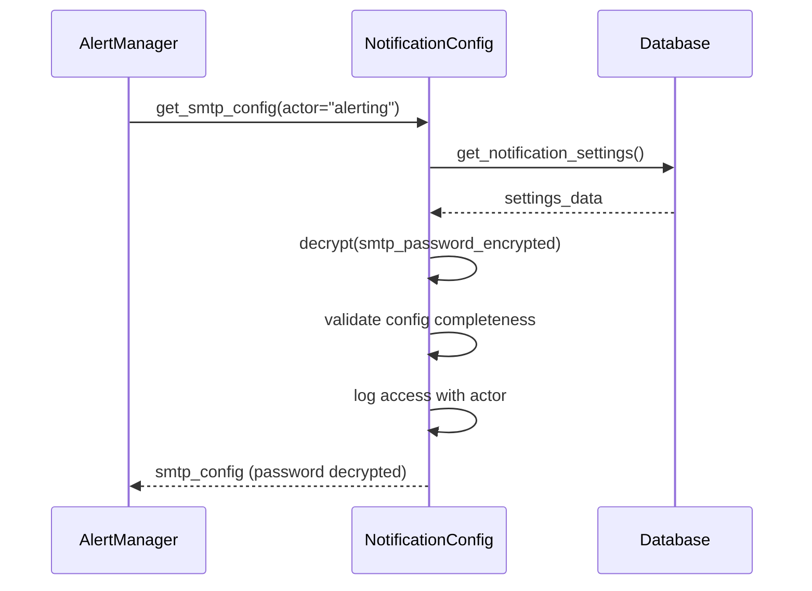
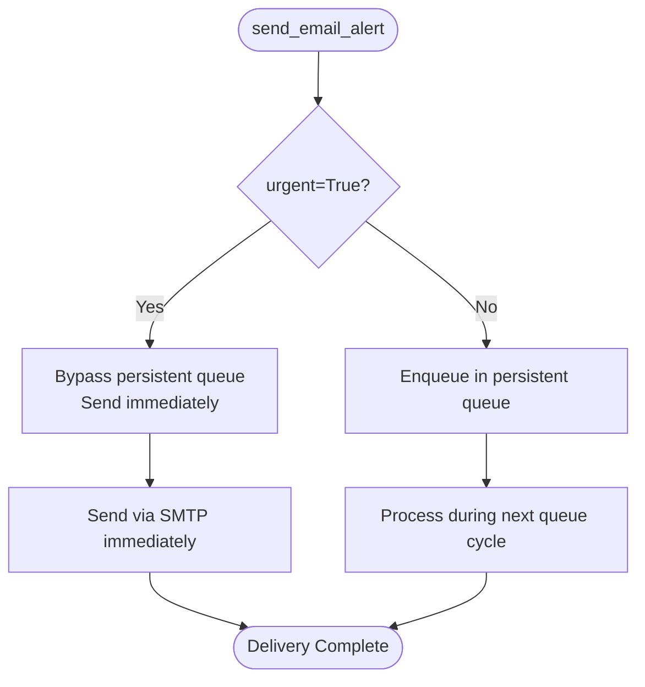

# Email Integration

<cite>
**Referenced Files in This Document**   
- [alerting.py](file://vertex-ar/app/alerting.py)
- [notification_config.py](file://vertex-ar/app/notification_config.py)
- [email_service.py](file://vertex-ar/app/services/email_service.py)
- [email_service.py](file://vertex-ar/app/email_service.py)
</cite>

## Table of Contents
1. [Introduction](#introduction)
2. [AlertManager and Email Alert Workflow](#alertmanager-and-email-alert-workflow)
3. [SMTP Configuration Retrieval](#smtp-configuration-retrieval)
4. [Email Composition and Formatting](#email-composition-and-formatting)
5. [Immediate Delivery with Urgent Flag](#immediate-delivery-with-urgent-flag)
6. [Error Handling and Delivery Confirmation](#error-handling-and-delivery-confirmation)
7. [Notification History Logging](#notification-history-logging)
8. [Configuration Examples for SMTP Providers](#configuration-examples-for-smtp-providers)
9. [Troubleshooting Email Delivery Issues](#troubleshooting-email-delivery-issues)
10. [Conclusion](#conclusion)

## Introduction
The Vertex AR system implements a robust email alert integration through the `AlertManager` class, which coordinates emergency notifications across multiple channels including email. This documentation details the implementation of the `send_email_alert` method, its integration with the `EmailService` for message delivery, and the underlying mechanisms for configuration management, message composition, delivery prioritization, and failure monitoring. The system ensures reliable alert delivery through secure SMTP configuration retrieval, structured email formatting, immediate delivery bypassing queues, comprehensive error handling, and detailed logging to the notification history system.

## AlertManager and Email Alert Workflow
The `AlertManager` class serves as the central coordinator for emergency alerts within Vertex AR, providing a unified interface for sending notifications via multiple channels. The `send_email_alert` method is specifically designed to deliver critical system alerts through email, integrating with the `EmailService` to ensure reliable message delivery. When invoked, the method first retrieves the necessary SMTP configuration from the database using the `get_smtp_config` method with 'alerting' as the actor parameter. It then constructs a formatted email message containing the alert details, including timestamp and server information, before delegating the actual delivery to the `EmailService`. The method handles both success and failure scenarios, ensuring that delivery outcomes are properly logged in the notification history system. This workflow enables administrators to receive timely alerts about system events, failures, or critical conditions.

**Section sources**
- [alerting.py](file://vertex-ar/app/alerting.py#L116-L215)

## SMTP Configuration Retrieval
The email alert system retrieves SMTP configuration through a secure and auditable process implemented in the `NotificationConfig` class. When the `send_email_alert` method is called, it invokes `get_smtp_config` with 'alerting' as the actor parameter, which triggers a comprehensive security check and audit logging sequence. The method first verifies that encrypted credentials exist in the database by checking for the presence of `smtp_password_encrypted`, refusing to return configuration if this field is missing. It then retrieves the full SMTP configuration including host, port, username, password, from_email, and security settings (TLS/SSL). Throughout this process, structured logs are generated that include the actor identifier, timestamp, and sanitized configuration with passwords masked as `***REDACTED***`. This approach eliminates the use of environment variables for SMTP credentials, enhancing security by storing sensitive information only in encrypted form within the database. The actor parameter provides an audit trail that distinguishes between different system components accessing the SMTP configuration.

**Diagram sources**
- [notification_config.py](file://vertex-ar/app/notification_config.py#L83-L144)
- [alerting.py](file://vertex-ar/app/alerting.py#L125-L126)

## Email Composition and Formatting
The email composition process in Vertex AR follows a standardized format designed for clarity and consistency in alert communications. When the `send_email_alert` method is invoked, it constructs the email body using a multi-line format that includes the alert message, a separator line, and contextual information about the event. The body template includes the current UTC timestamp and the server's base URL, providing essential context for recipients. The subject line is automatically prefixed with `[VERTEX AR ALERT]` to ensure immediate recognition of the email's importance and origin. This prefix is concatenated with the provided subject parameter to create the final subject line. The email is formatted as plain text with proper line breaks and indentation to ensure readability across different email clients. The composition process also includes proper MIME encoding to handle any special characters in the message content, ensuring that the email displays correctly regardless of the recipient's email client or locale settings.

**Section sources**
- [alerting.py](file://vertex-ar/app/alerting.py#L140-L149)

## Immediate Delivery with Urgent Flag
The email alert system implements immediate delivery by utilizing the `urgent=True` and `priority=1` parameters when calling the `EmailService`. These parameters work together to ensure that critical alerts bypass the persistent email queue and are delivered without delay. When `urgent=True` is specified, the `EmailService` skips the persistent queue entirely and processes the email through the in-memory queue for immediate sending. The `priority=1` parameter assigns the highest possible priority to the email, ensuring it is processed ahead of lower-priority messages in the queue. This combination effectively creates a fast-path for emergency alerts, guaranteeing that time-sensitive notifications are delivered as quickly as possible. The immediate delivery mechanism is particularly important for system alerts where timely notification can prevent extended downtime or data loss. This approach balances the need for reliable queued delivery for routine emails with the requirement for instant delivery for critical alerts.

**Diagram sources**
- [email_service.py](file://vertex-ar/app/email_service.py#L320-L337)
- [alerting.py](file://vertex-ar/app/alerting.py#L157-L158)

## Error Handling and Delivery Confirmation
The email alert system implements comprehensive error handling to ensure reliable operation even in the face of delivery failures. When sending an email, the system wraps the delivery process in try-catch blocks that capture and log any exceptions that occur during SMTP communication. If an error occurs, the system attempts to log the failure to the notification history, even if the primary delivery failed. The error handling process includes detailed logging of the error type, message, and stack trace, which aids in diagnosing delivery issues. For persistent failures, the system implements exponential backoff retry logic with configurable delays. The delivery confirmation process involves checking the return value from the `EmailService` and updating the alert status accordingly. Success is confirmed when the SMTP server accepts the message, while failure is reported if any step in the delivery process encounters an error. This robust error handling ensures that administrators are notified of both the original alert and any issues with alert delivery itself.

**Section sources**
- [alerting.py](file://vertex-ar/app/alerting.py#L183-L215)

## Notification History Logging
The system maintains a comprehensive audit trail of all email alert attempts through the notification history logging mechanism. After each email delivery attempt, whether successful or failed, the system calls `add_notification_history` to record the event in the database. The logged information includes the history ID, notification type ('email'), recipient address, subject, message content, status ('sent' or 'failed'), and any error message in case of failure. This logging occurs both when the primary delivery attempt succeeds and when it fails, ensuring complete visibility into the alert delivery process. The history entries use UUIDs for unique identification, enabling reliable tracking and auditing of notifications. This comprehensive logging serves multiple purposes: it provides an audit trail for compliance, enables troubleshooting of delivery issues, and supports monitoring of alert system reliability. Administrators can review the notification history to verify that critical alerts were delivered and to investigate any delivery failures.

**Section sources**
- [alerting.py](file://vertex-ar/app/alerting.py#L164-L178)

## Configuration Examples for SMTP Providers
The system supports configuration for various SMTP providers through the database-stored settings. For Gmail, the configuration would include host='smtp.gmail.com', port=587, use_tls=True, and the sender's Gmail address as both username and from_email. For Outlook/Hotmail, the settings would use host='smtp-mail.outlook.com', port=587, and use_tls=True. Amazon SES requires host='email-smtp.us-east-1.amazonaws.com', port=587, and use_tls=True, with AWS SMTP credentials. SendGrid configuration uses host='smtp.sendgrid.net', port=587, and use_tls=True with the SendGrid API key as the password. Each provider has specific requirements for authentication and security settings that must be correctly configured in the database. The system's flexible configuration model allows it to work with any SMTP provider by adjusting these parameters accordingly. It's important to note that all credentials are stored encrypted in the database, with the system refusing to operate if encrypted credentials are not present, ensuring that sensitive information is never exposed in plaintext.

**Section sources**
- [notification_config.py](file://vertex-ar/app/notification_config.py#L127-L135)

## Troubleshooting Email Delivery Issues
Diagnosing email delivery problems in Vertex AR involves checking several key areas. For delivery failures, first verify that the SMTP configuration exists in the database and that the `smtp_password_encrypted` field is populated. Authentication issues typically indicate incorrect credentials or security settings; check that the username, password, and security protocol (TLS/SSL) match the provider's requirements. Spam filtering problems can be addressed by ensuring the from_email address is properly configured and recognized by the recipient's email system, and by checking that the email content doesn't trigger spam filters. Network connectivity issues may prevent connection to the SMTP server; verify that the host and port are correct and that firewall rules allow outbound connections. The system's structured logs provide detailed information about each delivery attempt, including error types and messages, which are invaluable for troubleshooting. Additionally, monitoring the notification history can reveal patterns in delivery failures, and checking the email service metrics can identify systemic issues such as high failure rates that might indicate broader problems with the email configuration or infrastructure.

**Section sources**
- [email_service.py](file://vertex-ar/app/email_service.py#L492-L515)
- [notification_config.py](file://vertex-ar/app/notification_config.py#L109-L116)

## Conclusion
The email alert integration in Vertex AR provides a robust and secure mechanism for delivering critical system notifications. By leveraging the `AlertManager` class in conjunction with the `EmailService`, the system ensures reliable delivery of alerts through properly formatted emails with immediate delivery capabilities for urgent messages. The implementation prioritizes security by storing SMTP credentials encrypted in the database and implementing comprehensive audit logging through actor-based access tracking. The integration with the notification history system provides full visibility into delivery attempts, while the error handling and retry mechanisms ensure resilience in the face of temporary delivery failures. This comprehensive approach to email alerts enhances system reliability and ensures that administrators receive timely notifications about critical events, enabling prompt response to potential issues.