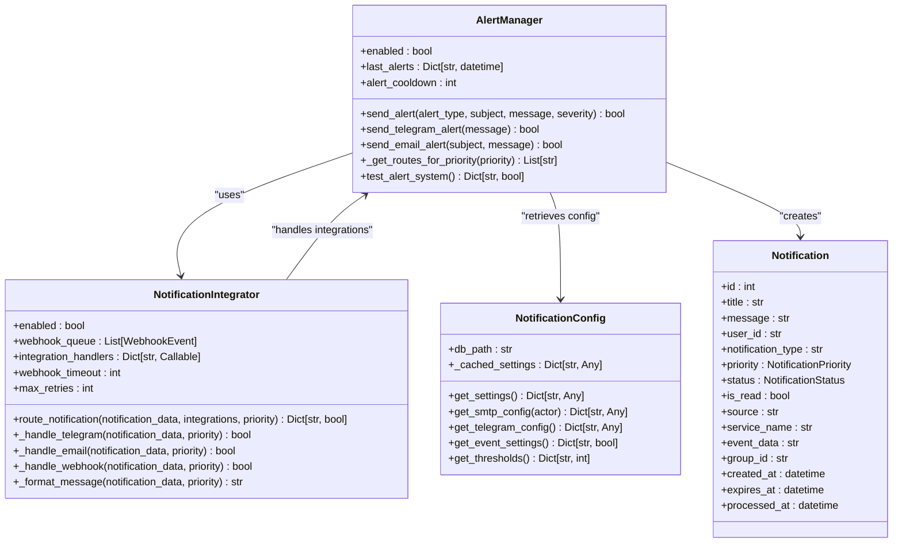
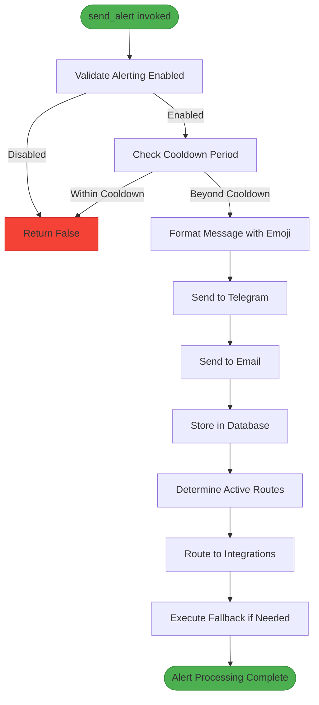
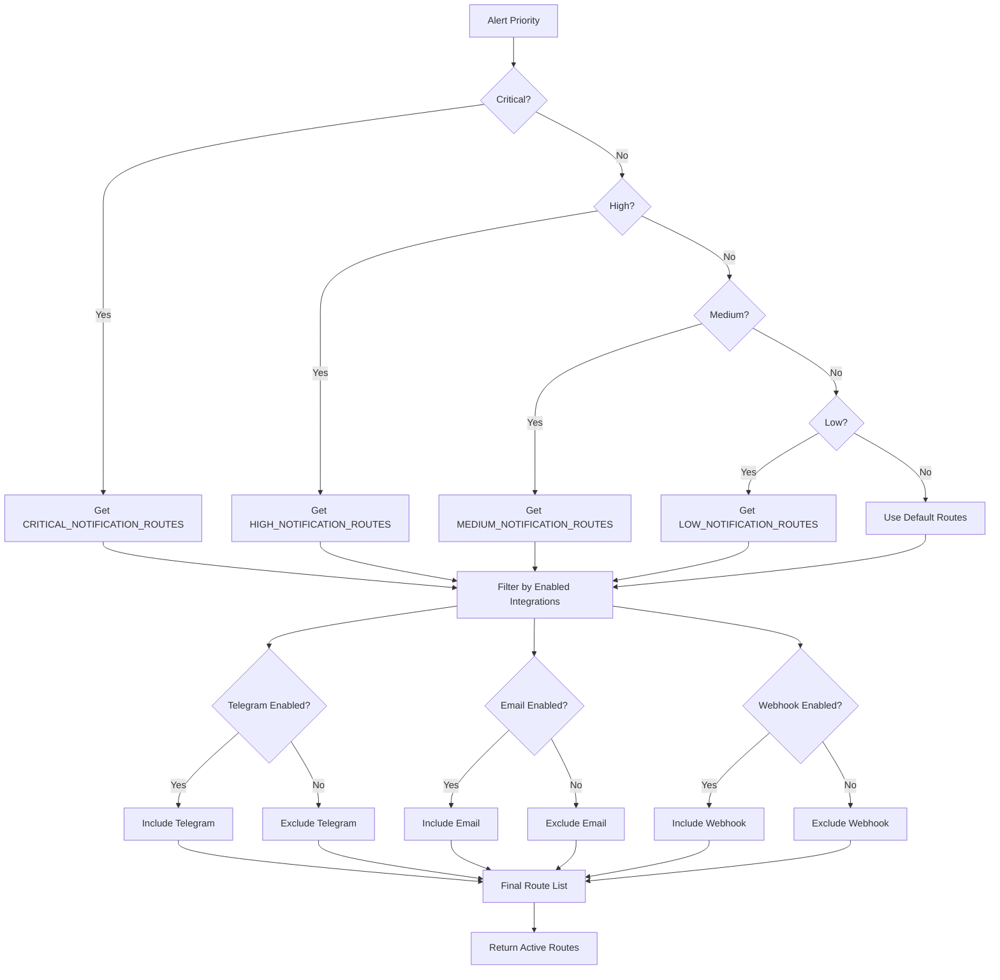
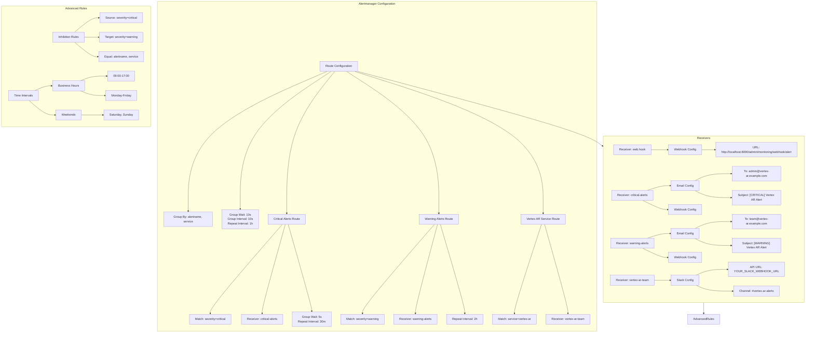
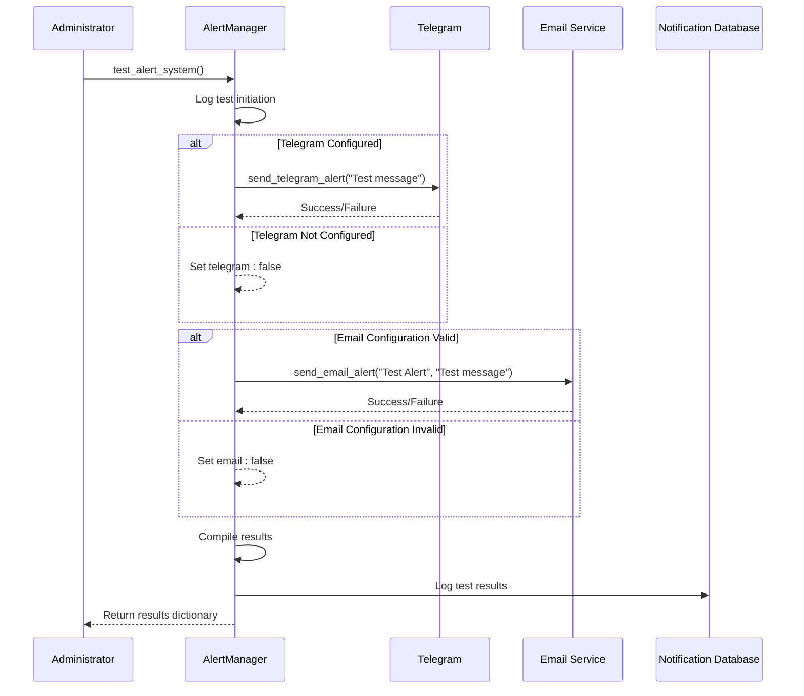

# Multi-Channel Alert Routing

<cite>
**Referenced Files in This Document**   
- [alertmanager.yml](file://monitoring/alertmanager.yml)
- [alerting.py](file://vertex-ar/app/alerting.py)
- [config.py](file://vertex-ar/app/config.py)
- [notification_config.py](file://vertex-ar/app/notification_config.py)
- [notification_integrations.py](file://vertex-ar/notification_integrations.py)
- [notifications.py](file://vertex-ar/notifications.py)
- [notification_sync.py](file://vertex-ar/notification_sync.py)
</cite>

## Table of Contents
1. [Introduction](#introduction)
2. [Core Alerting Components](#core-alerting-components)
3. [send_alert Method Implementation](#send_alert-method-implementation)
4. [Notification Routing Configuration](#notification-routing-configuration)
5. [Alertmanager Integration](#alertmanager-integration)
6. [Testing and Validation](#testing-and-validation)
7. [Configuration Examples](#configuration-examples)
8. [Conclusion](#conclusion)

## Introduction

The multi-channel alert routing system in Vertex AR provides a comprehensive notification framework that delivers alerts through multiple channels including Telegram, email, and database-stored notifications. This system ensures critical information reaches stakeholders through redundant channels based on severity levels, with sophisticated routing logic that considers feature flags and priority-based configurations.

The architecture integrates both internal application-level alerting and external monitoring systems, creating a cohesive notification ecosystem. At its core, the system uses severity-based formatting with emoji indicators to quickly convey the urgency of alerts, while implementing intelligent routing that respects business hours and suppresses redundant notifications.

This documentation details the implementation of the `send_alert` method, the `_get_routes_for_priority` routing logic, integration with Prometheus Alertmanager, and provides guidance on configuration and testing of the alert routing system.

## Core Alerting Components

The multi-channel alert routing system comprises several interconnected components that work together to deliver notifications across multiple channels. The primary components include the AlertManager class, NotificationIntegrator, and the underlying notification storage system.



**Diagram sources**
- [alerting.py](file://vertex-ar/app/alerting.py#L15-L382)
- [notification_integrations.py](file://vertex-ar/notification_integrations.py#L48-L355)
- [notification_config.py](file://vertex-ar/app/notification_config.py#L40-L221)
- [notifications.py](file://vertex-ar/notifications.py#L63-L87)

**Section sources**
- [alerting.py](file://vertex-ar/app/alerting.py#L1-L382)
- [notification_integrations.py](file://vertex-ar/notification_integrations.py#L1-L355)
- [notification_config.py](file://vertex-ar/app/notification_config.py#L1-L221)
- [notifications.py](file://vertex-ar/notifications.py#L1-L689)

## send_alert Method Implementation

The `send_alert` method in the AlertManager class coordinates the delivery of alerts across multiple channels with severity-based formatting. This method serves as the central entry point for the alerting system, handling the entire workflow from alert creation to multi-channel delivery.

The implementation follows a comprehensive process that begins with validation of the alerting system's enabled status and cooldown period checks to prevent alert flooding. When an alert is triggered, the method formats the message with emoji indicators based on severity level: red circle (🔴) for high severity, yellow circle (🟡) for medium, and green circle (🟢) for low severity alerts.



The method implements a fallback mechanism that ensures alert delivery even when the enhanced notification system encounters issues. If the primary enhanced notification path fails, the system falls back to the original notification storage method, ensuring reliability and message delivery.

The alert processing includes several key steps:
1. Cooldown validation to prevent alert storms
2. Message formatting with severity-based emoji indicators
3. Parallel delivery to Telegram and email channels
4. Storage in the database with enhanced metadata
5. Routing through configured integration channels
6. Fallback mechanisms for system resilience

**Section sources**
- [alerting.py](file://vertex-ar/app/alerting.py#L229-L328)

## Notification Routing Configuration

The notification routing system in Vertex AR uses a priority-based configuration model that determines active channels for different alert severities. The `_get_routes_for_priority` method implements this logic by mapping priority levels to specific notification routes based on configuration settings and feature flags.

The routing configuration is defined through environment variables that specify the channels for each priority level:
- CRITICAL_NOTIFICATION_ROUTES: Channels for critical alerts
- HIGH_NOTIFICATION_ROUTES: Channels for high severity alerts
- MEDIUM_NOTIFICATION_ROUTES: Channels for medium severity alerts
- LOW_NOTIFICATION_ROUTES: Channels for low severity alerts



Feature flags control the availability of each notification channel:
- NOTIFICATION_TELEGRAM_ENABLED: Enables/disables Telegram notifications
- NOTIFICATION_EMAIL_ENABLED: Enables/disables email notifications
- NOTIFICATION_WEBHOOK_ENABLED: Enables/disables webhook notifications

The routing method filters the configured routes based on these feature flags, ensuring that only enabled channels are included in the final route list. This allows administrators to temporarily disable specific channels without modifying the route configurations.

**Section sources**
- [alerting.py](file://vertex-ar/app/alerting.py#L329-L353)
- [config.py](file://vertex-ar/app/config.py#L151-L160)

## Alertmanager Integration

The Vertex AR system integrates with Prometheus Alertmanager through the alertmanager.yml configuration file, which defines a sophisticated routing and notification system for monitoring alerts. This integration enables the system to handle alerts from Prometheus and route them appropriately based on severity and service type.



**Diagram sources**
- [alertmanager.yml](file://monitoring/alertmanager.yml#L1-L97)

The Alertmanager configuration includes several key components:

### Route Configuration
The route configuration defines how alerts are grouped and routed based on their labels. Alerts are grouped by alertname and service, with specific routes for different severity levels:
- Critical alerts (severity=critical) are routed to the critical-alerts receiver
- Warning alerts (severity=warning) are routed to the warning-alerts receiver
- Alerts for the vertex-ar service are routed to the vertex-ar-team receiver

### Receivers Configuration
The system defines multiple receivers for different notification channels:
- **web.hook**: A webhook receiver that forwards alerts to the Vertex AR application at http://localhost:8000/admin/monitoring/webhook/alert
- **critical-alerts**: Sends email notifications to admin@vertex-ar.example.com with a [CRITICAL] subject prefix
- **warning-alerts**: Sends email notifications to team@vertex-ar.example.com with a [WARNING] subject prefix
- **vertex-ar-team**: Sends notifications to a Slack channel (#vertex-ar-alerts) using a webhook

### Inhibition Rules
The system implements inhibition rules to prevent alert noise by suppressing less severe alerts when more critical alerts exist. Specifically, warning alerts are suppressed when critical alerts exist for the same service and alert name. This prevents teams from being overwhelmed with warning notifications when a critical issue is already being addressed.

### Time Intervals
The configuration defines time intervals for different operational periods:
- Business hours: 09:00 to 17:00 on weekdays (Monday through Friday)
- Weekends: Saturday and Sunday

These time intervals can be used to implement different notification policies during business hours versus after hours, though the specific routing based on these intervals is not shown in the current configuration.

**Section sources**
- [alertmanager.yml](file://monitoring/alertmanager.yml#L1-L97)

## Testing and Validation

The alert routing system includes comprehensive testing and validation capabilities to ensure proper configuration and functionality. These testing mechanisms allow administrators to verify that alerts are properly routed through the configured channels.

The AlertManager class includes a `test_alert_system` method that tests all configured alert channels. This method sends test messages through Telegram and email channels, returning a dictionary with the success status of each channel. The test process follows these steps:



**Diagram sources**
- [alerting.py](file://vertex-ar/app/alerting.py#L355-L378)

Additionally, the system provides an API endpoint for testing notification routing through the integrations layer. The `/test-routing` endpoint in notifications_management.py allows administrators to test specific notification configurations with custom data, priority levels, and integration channels.

The testing process includes:
1. Verification of Telegram configuration (bot token and chat ID)
2. Validation of email service connectivity and SMTP configuration
3. Testing of webhook delivery (if configured)
4. Verification of database notification storage
5. Validation of integration routing logic

These testing capabilities ensure that administrators can validate the entire alert routing pipeline before relying on it for production alerts.

**Section sources**
- [alerting.py](file://vertex-ar/app/alerting.py#L355-L378)
- [notifications_management.py](file://vertex-ar/app/api/notifications_management.py#L270-L304)

## Configuration Examples

The multi-channel alert routing system supports various configuration strategies through environment variables and the alertmanager.yml file. Below are examples of different routing configurations:

### Basic Configuration
```env
# Enable alerting system
ALERTING_ENABLED=true

# Notification channel feature flags
NOTIFICATION_TELEGRAM_ENABLED=true
NOTIFICATION_EMAIL_ENABLED=true
NOTIFICATION_WEBHOOK_ENABLED=false

# Priority-based routing
CRITICAL_NOTIFICATION_ROUTES=telegram,email
HIGH_NOTIFICATION_ROUTES=telegram,email
MEDIUM_NOTIFICATION_ROUTES=email
LOW_NOTIFICATION_ROUTES=
```

### Production Configuration with Webhooks
```env
# Enable all notification channels
NOTIFICATION_TELEGRAM_ENABLED=true
NOTIFICATION_EMAIL_ENABLED=true
NOTIFICATION_WEBHOOK_ENABLED=true

# Webhook configuration
WEBHOOK_URLS=https://webhook.example.com/alerts,https://backup-webhook.example.com/alerts
WEBHOOK_TIMEOUT=30
WEBHOOK_MAX_RETRIES=3

# Enhanced routing for critical situations
CRITICAL_NOTIFICATION_ROUTES=telegram,email,webhook
HIGH_NOTIFICATION_ROUTES=telegram,email,webhook
MEDIUM_NOTIFICATION_ROUTES=email,webhook
LOW_NOTIFICATION_ROUTES=webhook
```

### Development Configuration
```env
# Disable external notifications in development
NOTIFICATION_TELEGRAM_ENABLED=false
NOTIFICATION_EMAIL_ENABLED=false
NOTIFICATION_WEBHOOK_ENABLED=false

# Route all notifications to database only
CRITICAL_NOTIFICATION_ROUTES=
HIGH_NOTIFICATION_ROUTES=
MEDIUM_NOTIFICATION_ROUTES=
LOW_NOTIFICATION_ROUTES=
```

### Business Hours Configuration
```yaml
# alertmanager.yml - Business hours routing
time_intervals:
  - name: 'business-hours'
    time_intervals:
      - times:
          - start_time: '09:00'
            end_time: '17:00'
        weekdays: ['monday:friday']
  
  - name: 'weekends'
    time_intervals:
      - weekdays: ['saturday', 'sunday']

# Route critical alerts to on-call team during business hours
routes:
  - match:
      severity: critical
    receiver: 'critical-alerts'
    active_time_intervals: ['business-hours', 'weekends']
  
  - match:
      severity: warning
    receiver: 'warning-alerts'
    active_time_intervals: ['business-hours']
```

### Alertmanager Configuration with Inhibition
```yaml
# alertmanager.yml - Complete configuration
route:
  group_by: ['alertname', 'service']
  group_wait: 10s
  group_interval: 10s
  repeat_interval: 1h
  receiver: 'web.hook'
  routes:
    - match:
        severity: critical
      receiver: 'critical-alerts'
      group_wait: 5s
      repeat_interval: 30m
    - match:
        severity: warning
      receiver: 'warning-alerts'
      repeat_interval: 2h
    - match:
        service: vertex-ar
      receiver: 'vertex-ar-team'

receivers:
  - name: 'web.hook'
    webhook_configs:
      - url: 'http://localhost:8000/admin/monitoring/webhook/alert'
        send_resolved: true

  - name: 'critical-alerts'
    email_configs:
      - to: 'admin@vertex-ar.example.com'
        subject: '[CRITICAL] Vertex AR Alert: {{ .GroupLabels.alertname }}'
    webhook_configs:
      - url: 'http://localhost:8000/admin/monitoring/webhook/alert'
        send_resolved: true

  - name: 'warning-alerts'
    email_configs:
      - to: 'team@vertex-ar.example.com'
        subject: '[WARNING] Vertex AR Alert: {{ .GroupLabels.alertname }}'
    webhook_configs:
      - url: 'http://localhost:8000/admin/monitoring/webhook/alert'
        send_resolved: true

  - name: 'vertex-ar-team'
    slack_configs:
      - api_url: 'YOUR_SLACK_WEBHOOK_URL'
        channel: '#vertex-ar-alerts'

inhibit_rules:
  - source_match:
      severity: 'critical'
    target_match:
      severity: 'warning'
    equal: ['alertname', 'service']
```

These configuration examples demonstrate the flexibility of the alert routing system, allowing administrators to tailor notification strategies to their specific operational requirements.

**Section sources**
- [config.py](file://vertex-ar/app/config.py#L151-L160)
- [alertmanager.yml](file://monitoring/alertmanager.yml#L1-L97)

## Conclusion

The multi-channel alert routing system in Vertex AR provides a robust and flexible framework for delivering critical notifications through multiple channels. The system's architecture combines application-level alerting with external monitoring integration, creating a comprehensive notification ecosystem that ensures important alerts reach the appropriate stakeholders.

Key features of the system include:
- Multi-channel delivery through Telegram, email, and database notifications
- Severity-based formatting with emoji indicators for quick visual recognition
- Priority-based routing controlled by configuration settings and feature flags
- Integration with Prometheus Alertmanager for monitoring alerts
- Inhibition rules that suppress warning alerts when critical alerts exist
- Comprehensive testing and validation capabilities

The system's design emphasizes reliability and flexibility, with fallback mechanisms that ensure alert delivery even when components fail. The configuration model allows administrators to tailor notification strategies to their specific operational requirements, from development environments with minimal notifications to production systems with redundant alerting channels.

By implementing this sophisticated alert routing system, Vertex AR ensures that critical information is delivered promptly and reliably, enabling rapid response to system issues and maintaining high availability.