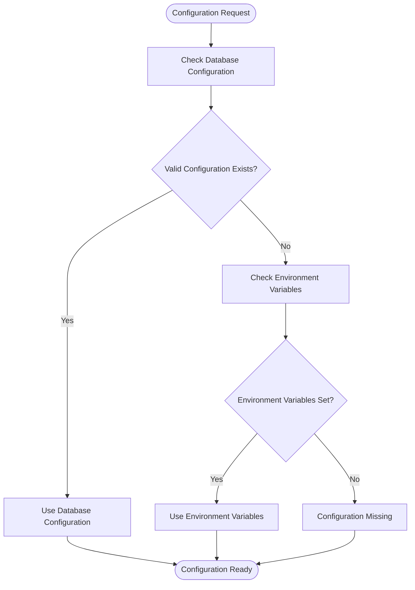
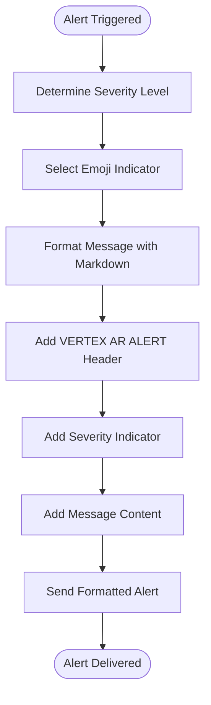
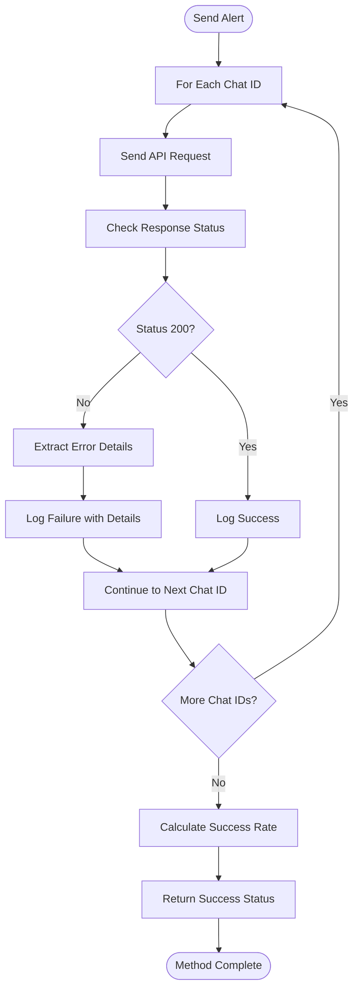
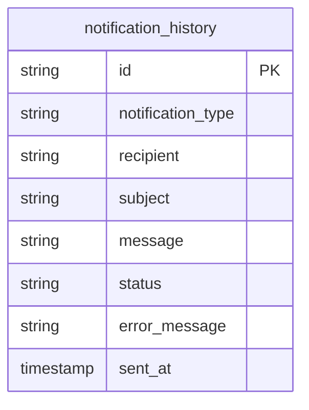
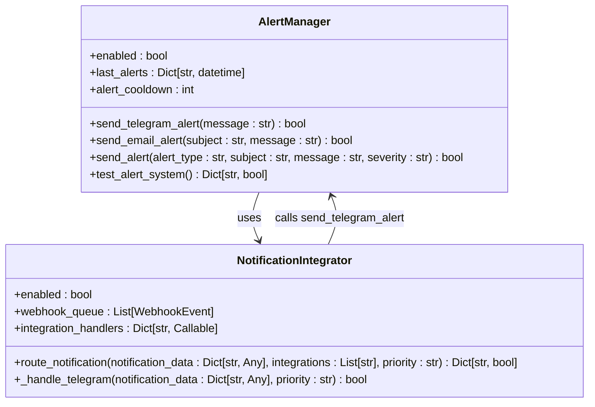

# Telegram Integration

<cite>
**Referenced Files in This Document**   
- [alerting.py](file://vertex-ar/app/alerting.py)
- [notification_config.py](file://vertex-ar/app/notification_config.py)
- [database.py](file://vertex-ar/app/database.py)
- [config.py](file://vertex-ar/app/config.py)
- [notification_settings.py](file://vertex-ar/app/api/notification_settings.py)
</cite>

## Table of Contents
1. [Introduction](#introduction)
2. [Configuration Hierarchy](#configuration-hierarchy)
3. [Alert Message Formatting](#alert-message-formatting)
4. [Error Handling and Retry Logic](#error-handling-and-retry-logic)
5. [Notification History Logging](#notification-history-logging)
6. [Configuration Examples](#configuration-examples)
7. [Troubleshooting Guide](#troubleshooting-guide)
8. [Integration with Notification System](#integration-with-notification-system)

## Introduction
The Telegram alert integration in Vertex AR provides a robust notification system for critical system events and alerts. The implementation centers around the `send_telegram_alert` method in the `AlertManager` class, which enables administrators to receive real-time notifications through Telegram. This system supports multiple recipients, message formatting with Markdown and emoji indicators for severity levels, and comprehensive error handling with retry logic.

The integration uses the Telegram Bot API to deliver formatted messages to configured chat recipients. It implements a hierarchical configuration approach that prioritizes database-stored credentials over environment variables, enhancing security and flexibility. The system also maintains a complete audit trail of notification attempts in the `notification_history` table, recording both successful and failed delivery attempts with detailed error information.

**Section sources**
- [alerting.py](file://vertex-ar/app/alerting.py#L23-L115)

## Configuration Hierarchy
The Telegram alert system implements a two-tier configuration hierarchy that first attempts to retrieve credentials from the database before falling back to environment variables. This approach provides enhanced security and centralized management while maintaining backward compatibility.

The configuration retrieval process follows these steps:
1. First, the system attempts to retrieve Telegram configuration from the database via the `get_telegram_config` method in the `NotificationConfig` class
2. If database configuration is not available or incomplete, the system falls back to environment variables (`TELEGRAM_BOT_TOKEN` and `TELEGRAM_CHAT_ID`)

The database configuration takes precedence and is stored in encrypted form for security. The `notification_settings` table contains encrypted fields for sensitive information:
- `telegram_bot_token_encrypted`: Stores the encrypted bot token
- `telegram_chat_ids`: Stores comma-separated chat IDs in plain text

When retrieving configuration, the system decrypts the bot token and parses the chat IDs into a list. Environment variables are only used when no valid database configuration exists, providing a fallback mechanism for initial setup or emergency access.



**Diagram sources**
- [alerting.py](file://vertex-ar/app/alerting.py#L25-L37)
- [notification_config.py](file://vertex-ar/app/notification_config.py#L146-L161)

**Section sources**
- [alerting.py](file://vertex-ar/app/alerting.py#L23-L37)
- [notification_config.py](file://vertex-ar/app/notification_config.py#L146-L161)
- [config.py](file://vertex-ar/app/config.py#L72-L73)

## Alert Message Formatting
The Telegram alert system formats messages using Markdown syntax with emoji indicators to convey severity levels. The message format includes a standardized header and structured content that enhances readability and provides immediate visual cues about the alert's importance.

The message formatting process applies the following elements:
- **Severity-based emoji indicators**: Different colored emojis represent various severity levels (🔴 for high, 🟡 for medium, 🟢 for low)
- **Markdown formatting**: Uses bold text for emphasis and clear section separation
- **Standardized header**: Includes a "VERTEX AR ALERT" banner for immediate recognition
- **Structured content**: Organizes information in a consistent, scannable format

The `send_telegram_alert` method constructs messages with the following template:
```
🚨 **VERTEX AR ALERT** 🚨

{severity_emoji} **{SEVERITY_LEVEL}**
{message_content}
```

The severity level mapping is defined as:
- High severity: "🔴" emoji with "HIGH" text
- Medium severity: "🟡" emoji with "MEDIUM" text  
- Low severity: "🟢" emoji with "LOW" text

This formatting approach ensures that alerts are immediately recognizable and their urgency is clearly communicated, even when viewed quickly on mobile devices.



**Diagram sources**
- [alerting.py](file://vertex-ar/app/alerting.py#L239-L240)
- [alerting.py](file://vertex-ar/app/alerting.py#L48-L50)

**Section sources**
- [alerting.py](file://vertex-ar/app/alerting.py#L239-L240)

## Error Handling and Retry Logic
The Telegram alert system implements comprehensive error handling to ensure reliable message delivery and provide detailed diagnostics for troubleshooting. The system handles various failure scenarios including network timeouts, invalid credentials, and API rate limiting.

When sending a Telegram alert, the system processes each configured chat ID individually, allowing partial success when some recipients are unreachable. For each chat ID, the system:
1. Attempts to send the message with a 10-second timeout
2. Handles HTTP response codes and extracts error details
3. Catches network and connection exceptions
4. Logs detailed error information for each failure

The error handling covers multiple failure scenarios:
- **Network connectivity issues**: Timeouts and connection errors are caught and logged
- **Invalid bot tokens**: 401 Unauthorized responses from the Telegram API
- **Invalid chat IDs**: 400 Bad Request responses indicating invalid recipients
- **API rate limiting**: 429 Too Many Requests responses
- **Server errors**: 5xx responses from the Telegram API

For each failed delivery attempt, the system captures the specific error details, including HTTP status codes and response messages from the Telegram API. This granular error information is crucial for diagnosing configuration issues and connectivity problems.



**Diagram sources**
- [alerting.py](file://vertex-ar/app/alerting.py#L42-L115)

**Section sources**
- [alerting.py](file://vertex-ar/app/alerting.py#L42-L115)

## Notification History Logging
The system maintains a comprehensive audit trail of all notification attempts in the `notification_history` table, providing complete visibility into alert delivery status. This logging mechanism records both successful and failed delivery attempts with detailed metadata for troubleshooting and compliance purposes.

The `notification_history` table schema includes the following fields:
- `id`: Unique identifier for the history record
- `notification_type`: Type of notification (e.g., "telegram")
- `recipient`: Target recipient (chat ID for Telegram)
- `subject`: Message subject (optional)
- `message`: Full message content
- `status`: Delivery status ("sent" or "failed")
- `error_message`: Detailed error description for failed attempts
- `sent_at`: Timestamp of the delivery attempt

When a Telegram alert is sent, the system logs each delivery attempt to this table. For successful deliveries, it records the "sent" status. For failed attempts, it captures the specific error details, including HTTP status codes and response messages from the Telegram API.

The logging occurs within the same transaction as the API call, ensuring that even if the application crashes after sending the message but before logging, the notification history remains consistent. This atomic operation guarantees that administrators can always correlate alert messages with their delivery status in the audit log.



**Diagram sources**
- [database.py](file://vertex-ar/app/database.py#L668-L680)
- [alerting.py](file://vertex-ar/app/alerting.py#L63-L70)
- [alerting.py](file://vertex-ar/app/alerting.py#L82-L89)

**Section sources**
- [database.py](file://vertex-ar/app/database.py#L668-L680)
- [database.py](file://vertex-ar/app/database.py#L3162-L3182)
- [alerting.py](file://vertex-ar/app/alerting.py#L63-L90)

## Configuration Examples
The Telegram alert system supports flexible configuration for various deployment scenarios, including single and multiple recipient setups. Configuration can be managed through the database (preferred) or environment variables (fallback).

### Database Configuration
To configure Telegram alerts through the database, update the `notification_settings` table with encrypted credentials:

```sql
UPDATE notification_settings 
SET 
    telegram_bot_token_encrypted = 'encrypted_bot_token_value',
    telegram_chat_ids = '123456789,987654321,111222333'
WHERE is_active = 1;
```

### Environment Variable Configuration
For fallback configuration, set the following environment variables:

```bash
# Single chat recipient
TELEGRAM_BOT_TOKEN=your_bot_token_here
TELEGRAM_CHAT_ID=123456789

# Multiple chat recipients (not directly supported via env vars)
# The system will only use TELEGRAM_CHAT_ID for single recipient
```

### Multiple Recipient Configuration
To send alerts to multiple recipients, use the database configuration with comma-separated chat IDs:

```python
# In the admin interface or direct database update
telegram_chat_ids = "123456789,987654321,111222333"
```

### Complete Configuration Example
```python
# Example configuration in the admin settings UI
{
    "telegram_bot_token": "your_bot_token_here",
    "telegram_chat_ids": "123456789,987654321",
    "smtp_host": "smtp.gmail.com",
    "smtp_port": 587,
    "smtp_username": "your_email@gmail.com"
}
```

The system processes multiple chat IDs by iterating through each recipient and sending individual messages, ensuring that delivery failures to one recipient do not affect delivery to others.

**Section sources**
- [alerting.py](file://vertex-ar/app/alerting.py#L30-L32)
- [notification_config.py](file://vertex-ar/app/notification_config.py#L156-L160)
- [notification_settings.py](file://vertex-ar/app/api/notification_settings.py#L160-L161)

## Troubleshooting Guide
This section provides guidance for diagnosing and resolving common issues with the Telegram alert integration.

### Common Issues and Solutions

#### Invalid Bot Token
**Symptoms**: HTTP 401 Unauthorized responses, "Bad Authorization" errors
**Diagnosis**: Check logs for "401" status codes when sending messages
**Solution**: 
1. Verify the bot token in the database or environment variables
2. Ensure no extra spaces or characters are included
3. Regenerate the bot token through BotFather if necessary
4. Test the token directly with the Telegram API

#### Network Timeouts
**Symptoms**: "Timeout" errors, slow alert delivery, intermittent failures
**Diagnosis**: Check logs for timeout exceptions and response times
**Solution**:
1. Verify network connectivity to api.telegram.org
2. Check firewall rules for outbound HTTPS traffic
3. Increase network timeout settings if needed
4. Monitor network stability and packet loss

#### Message Formatting Errors
**Symptoms**: Messages not rendering correctly, Markdown not processed
**Diagnosis**: Check if emojis and bold text appear as expected
**Solution**:
1. Verify that `parse_mode: "Markdown"` is included in the payload
2. Check for invalid Markdown syntax in the message content
3. Test with simple messages to isolate formatting issues
4. Ensure no prohibited characters are included

### Log Analysis
The system logs detailed information about alert delivery attempts, which can be used for troubleshooting:

**Successful Delivery Log Example**:
```
INFO:root:Telegram alert sent successfully to 123456789
INFO:root:Added notification history: telegram to 123456789 (sent)
```

**Failed Delivery Log Example**:
```
ERROR:root:Failed to send Telegram alert to 123456789: 400 - {"ok":false,"error_code":400,"description":"Bad Request: chat not found"}
ERROR:root:Failed to log notification history: ...
```

Administrators can query the notification history through the admin API to review delivery status:
```bash
GET /admin/notification-settings/history?page=1&page_size=50&notification_type=telegram
```

This returns a paginated list of delivery attempts with status and error details.

**Section sources**
- [alerting.py](file://vertex-ar/app/alerting.py#L74-L75)
- [alerting.py](file://vertex-ar/app/alerting.py#L93-L94)
- [notification_settings.py](file://vertex-ar/app/api/notification_settings.py#L390-L419)
- [database.py](file://vertex-ar/app/database.py#L3192-L3215)

## Integration with Notification System
The Telegram alert functionality is integrated into Vertex AR's broader notification ecosystem through multiple entry points and coordination mechanisms. The `AlertManager` class serves as the central hub for emergency notifications, coordinating between Telegram, email, and other notification channels.

The integration architecture includes:
- **Direct API calls**: Other components can directly call `alert_manager.send_telegram_alert()`
- **Notification integrator**: The `NotificationIntegrator` routes alerts through Telegram as one of several possible channels
- **Enhanced notification system**: Alerts are also stored in the database notification system for UI display

The `send_alert` method in `AlertManager` provides a unified interface for sending alerts across all configured channels, automatically handling the routing based on severity and configuration. This method applies cooldown logic to prevent alert flooding and formats messages consistently across channels.

The system also supports testing of the Telegram integration through the `test_alert_system` method, which sends a test message and returns success status. This testing capability is exposed through the admin interface, allowing administrators to verify configuration without triggering real alerts.



**Diagram sources**
- [alerting.py](file://vertex-ar/app/alerting.py#L15-L382)
- [notification_integrations.py](file://vertex-ar/notification_integrations.py#L48-L354)

**Section sources**
- [alerting.py](file://vertex-ar/app/alerting.py#L229-L257)
- [notification_integrations.py](file://vertex-ar/notification_integrations.py#L176-L182)
- [alerting.py](file://vertex-ar/app/alerting.py#L355-L378)