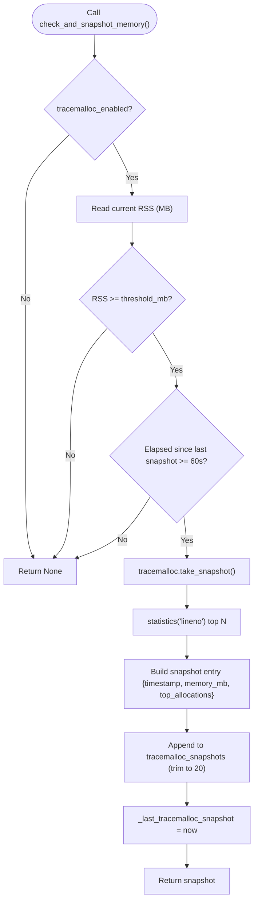

# Deep Diagnostics

<cite>
**Referenced Files in This Document**
- [app/monitoring.py](file://vertex-ar/app/monitoring.py)
- [app/api/monitoring.py](file://vertex-ar/app/api/monitoring.py)
- [app/prometheus_metrics.py](file://vertex-ar/app/prometheus_metrics.py)
- [app/config.py](file://vertex-ar/app/config.py)
- [docs/monitoring/deep-diagnostics.md](file://docs/monitoring/deep-diagnostics.md)
- [test_files/unit/test_monitoring.py](file://test_files/unit/test_monitoring.py)
</cite>

## Table of Contents
1. [Introduction](#introduction)
2. [Project Structure](#project-structure)
3. [Core Components](#core-components)
4. [Architecture Overview](#architecture-overview)
5. [Detailed Component Analysis](#detailed-component-analysis)
6. [Dependency Analysis](#dependency-analysis)
7. [Performance Considerations](#performance-considerations)
8. [Troubleshooting Guide](#troubleshooting-guide)
9. [Conclusion](#conclusion)
10. [Appendices](#appendices)

## Introduction
This document explains the deep diagnostics capabilities in the Vertex AR monitoring system. It focuses on performance diagnostics including:
- Process history tracking with configurable ring buffer size
- Slow query detection with configurable thresholds and ring buffer
- Slow endpoint monitoring with configurable thresholds and ring buffer
- Memory profiling via tracemalloc integration with threshold-based snapshots
- Aggregation of diagnostic data through the get_hotspots method
- Configuration examples for different diagnostic intensity levels
- Guidance on tuning diagnostics for production environments

## Project Structure
The deep diagnostics system is implemented in the monitoring module and exposed via FastAPI endpoints. Prometheus metrics are exported to visualize hotspots.

**Diagram sources**
- [app/monitoring.py](file://vertex-ar/app/monitoring.py#L52-L120)
- [app/config.py](file://vertex-ar/app/config.py#L227-L236)
- [app/api/monitoring.py](file://vertex-ar/app/api/monitoring.py#L616-L776)
- [app/prometheus_metrics.py](file://vertex-ar/app/prometheus_metrics.py#L217-L242)

**Section sources**
- [app/monitoring.py](file://vertex-ar/app/monitoring.py#L52-L120)
- [app/config.py](file://vertex-ar/app/config.py#L227-L236)
- [app/api/monitoring.py](file://vertex-ar/app/api/monitoring.py#L616-L776)
- [app/prometheus_metrics.py](file://vertex-ar/app/prometheus_metrics.py#L217-L242)

## Core Components
- SystemMonitor: central class that maintains diagnostics state and exposes methods to capture and aggregate performance data.
- Configuration: environment-driven settings for diagnostics thresholds and ring buffer sizes.
- API endpoints: provide access to hotspots, memory snapshots, and manual triggers.
- Prometheus exporter: publishes hotspots metrics for observability.

Key diagnostics features:
- Process history tracking: stores CPU and RSS snapshots per PID with a ring buffer size controlled by MONITORING_PROCESS_HISTORY_SIZE.
- Slow query detection: captures SQL queries exceeding MONITORING_SLOW_QUERY_THRESHOLD_MS and maintains top-N slowest via MONITORING_SLOW_QUERY_RING_SIZE.
- Slow endpoint monitoring: captures HTTP requests exceeding MONITORING_SLOW_ENDPOINT_THRESHOLD_MS and maintains top-N slowest via MONITORING_SLOW_ENDPOINT_RING_SIZE.
- Memory profiling: optional tracemalloc snapshots when memory usage exceeds MONITORING_TRACEMALLOC_THRESHOLD_MB, with top-N allocations controlled by MONITORING_TRACEMALLOC_TOP_N.

**Section sources**
- [app/monitoring.py](file://vertex-ar/app/monitoring.py#L52-L120)
- [app/config.py](file://vertex-ar/app/config.py#L227-L236)
- [docs/monitoring/deep-diagnostics.md](file://docs/monitoring/deep-diagnostics.md#L1-L120)

## Architecture Overview
The monitoring system runs continuously, periodically collecting system metrics and deep diagnostics. API endpoints expose hotspots and memory diagnostics. Prometheus metrics are exported from hotspots data.

**Diagram sources**
- [app/api/monitoring.py](file://vertex-ar/app/api/monitoring.py#L616-L661)
- [app/monitoring.py](file://vertex-ar/app/monitoring.py#L783-L831)
- [app/prometheus_metrics.py](file://vertex-ar/app/prometheus_metrics.py#L217-L242)

## Detailed Component Analysis

### SystemMonitor: Deep Diagnostics Engine
The SystemMonitor class encapsulates all deep diagnostics logic:
- Initialization loads environment-based settings for diagnostics thresholds and ring buffer sizes.
- Process history ring buffer stores CPU percent and RSS MB snapshots per PID.
- Slow query ring buffer stores queries exceeding the configured threshold, sorted by duration.
- Slow endpoint ring buffer stores HTTP requests exceeding the configured threshold, sorted by duration.
- Memory snapshot mechanism integrates with tracemalloc to capture top allocations when memory exceeds threshold.
- get_hotspots aggregates process trends and returns structured diagnostics for analysis.

**Diagram sources**
- [app/monitoring.py](file://vertex-ar/app/monitoring.py#L52-L120)
- [app/monitoring.py](file://vertex-ar/app/monitoring.py#L639-L718)
- [app/monitoring.py](file://vertex-ar/app/monitoring.py#L719-L782)
- [app/monitoring.py](file://vertex-ar/app/monitoring.py#L783-L831)

**Section sources**
- [app/monitoring.py](file://vertex-ar/app/monitoring.py#L52-L120)
- [app/monitoring.py](file://vertex-ar/app/monitoring.py#L639-L718)
- [app/monitoring.py](file://vertex-ar/app/monitoring.py#L719-L782)
- [app/monitoring.py](file://vertex-ar/app/monitoring.py#L783-L831)

### Process History Tracking
- Purpose: Maintain a time-series history of CPU and memory usage for monitored processes.
- Mechanism: track_process_snapshot appends a snapshot with timestamp, CPU percent, and RSS MB. The ring buffer is trimmed to the configured size.
- Aggregation: get_hotspots computes average, min, max CPU and RSS values per PID and includes first/last seen timestamps.

**Diagram sources**
- [app/monitoring.py](file://vertex-ar/app/monitoring.py#L639-L662)

**Section sources**
- [app/monitoring.py](file://vertex-ar/app/monitoring.py#L639-L662)
- [app/monitoring.py](file://vertex-ar/app/monitoring.py#L783-L810)
- [test_files/unit/test_monitoring.py](file://test_files/unit/test_monitoring.py#L647-L671)

### Slow Query Detection
- Purpose: Capture database queries that exceed a configurable threshold.
- Mechanism: track_slow_query filters queries below threshold, creates entries with timestamp, query text, duration, and parameters, sorts by duration descending, and trims to ring size.
- Thresholds: MONITORING_SLOW_QUERY_THRESHOLD_MS controls the minimum duration to record; MONITORING_SLOW_QUERY_RING_SIZE controls the number of top-N slowest retained.

**Diagram sources**
- [app/monitoring.py](file://vertex-ar/app/monitoring.py#L663-L689)

**Section sources**
- [app/monitoring.py](file://vertex-ar/app/monitoring.py#L663-L689)
- [test_files/unit/test_monitoring.py](file://test_files/unit/test_monitoring.py#L673-L717)

### Slow Endpoint Monitoring
- Purpose: Capture HTTP requests that exceed a configurable response time threshold.
- Mechanism: track_slow_endpoint filters requests below threshold, creates entries with method, path, duration, status code, and timestamp, sorts by duration descending, and trims to ring size.
- Thresholds: MONITORING_SLOW_ENDPOINT_THRESHOLD_MS controls the minimum duration to record; MONITORING_SLOW_ENDPOINT_RING_SIZE controls the number of top-N slowest retained.

**Diagram sources**
- [app/monitoring.py](file://vertex-ar/app/monitoring.py#L690-L718)

**Section sources**
- [app/monitoring.py](file://vertex-ar/app/monitoring.py#L690-L718)
- [test_files/unit/test_monitoring.py](file://test_files/unit/test_monitoring.py#L719-L762)

### Tracemalloc Integration for Memory Profiling
- Purpose: Optional memory profiling to detect allocation hotspots and potential leaks.
- Configuration: MONITORING_TRACEMALLOC_ENABLED toggles tracemalloc; MONITORING_TRACEMALLOC_THRESHOLD_MB sets the memory usage threshold to trigger snapshots; MONITORING_TRACEMALLOC_TOP_N controls the number of top allocations reported.
- Mechanism: check_and_snapshot_memory checks current memory usage against threshold, enforces a minimum interval between snapshots, takes a tracemalloc snapshot, extracts top-N allocations by file/line, and stores up to a fixed number of recent snapshots.

**Diagram sources**
- [app/monitoring.py](file://vertex-ar/app/monitoring.py#L719-L782)

**Section sources**
- [app/monitoring.py](file://vertex-ar/app/monitoring.py#L719-L782)
- [test_files/unit/test_monitoring.py](file://test_files/unit/test_monitoring.py#L821-L868)

### get_hotspots Aggregation
- Purpose: Aggregate all deep diagnostics data for analysis and API exposure.
- Output includes:
  - process_trends: per-PID CPU and RSS averages/min/max and timestamps
  - slow_queries: count, threshold, and top-N slowest queries
  - slow_endpoints: count, threshold, and top-N slowest endpoints
  - memory_snapshots: enabled flag, threshold, and recent snapshots
- API: /monitoring/hotspots returns the aggregated diagnostics payload.

**Diagram sources**
- [app/monitoring.py](file://vertex-ar/app/monitoring.py#L783-L831)
- [app/api/monitoring.py](file://vertex-ar/app/api/monitoring.py#L616-L661)

**Section sources**
- [app/monitoring.py](file://vertex-ar/app/monitoring.py#L783-L831)
- [app/api/monitoring.py](file://vertex-ar/app/api/monitoring.py#L616-L661)
- [test_files/unit/test_monitoring.py](file://test_files/unit/test_monitoring.py#L782-L820)

### API Endpoints for Diagnostics
- GET /monitoring/hotspots: returns aggregated diagnostics and configuration.
- GET /monitoring/memory-leaks: returns tracemalloc snapshots when enabled.
- POST /monitoring/memory-snapshot: manually triggers a snapshot bypassing threshold.

These endpoints rely on SystemMonitor’s methods and expose diagnostics to administrators.

**Section sources**
- [app/api/monitoring.py](file://vertex-ar/app/api/monitoring.py#L616-L776)

### Prometheus Metrics Export
Prometheus exporter reads hotspots data and exports metrics such as:
- vertex_ar_slow_queries_count
- vertex_ar_slow_queries_slowest_ms
- vertex_ar_slow_endpoints_count
- vertex_ar_slow_endpoints_slowest_ms
- vertex_ar_memory_snapshots_count
- vertex_ar_process_history_count
- vertex_ar_process_trend_cpu_avg{pid}
- vertex_ar_process_trend_rss_mb{pid}

These metrics reflect the current state of slow queries, slow endpoints, memory snapshots, and process trends.

**Section sources**
- [app/prometheus_metrics.py](file://vertex-ar/app/prometheus_metrics.py#L217-L242)

## Dependency Analysis
- SystemMonitor depends on:
  - Settings for environment-driven configuration
  - psutil for system/process metrics
  - tracemalloc for memory profiling (when enabled)
  - FastAPI routes for exposing diagnostics
  - Prometheus exporter for metrics

**Diagram sources**
- [app/monitoring.py](file://vertex-ar/app/monitoring.py#L52-L120)
- [app/config.py](file://vertex-ar/app/config.py#L227-L236)
- [app/api/monitoring.py](file://vertex-ar/app/api/monitoring.py#L616-L776)
- [app/prometheus_metrics.py](file://vertex-ar/app/prometheus_metrics.py#L217-L242)

**Section sources**
- [app/monitoring.py](file://vertex-ar/app/monitoring.py#L52-L120)
- [app/config.py](file://vertex-ar/app/config.py#L227-L236)
- [app/api/monitoring.py](file://vertex-ar/app/api/monitoring.py#L616-L776)
- [app/prometheus_metrics.py](file://vertex-ar/app/prometheus_metrics.py#L217-L242)

## Performance Considerations
- Process history tracking: negligible overhead; ring buffer size determines memory footprint.
- Slow query detection: minimal overhead; only records queries exceeding threshold.
- Slow endpoint monitoring: automatic via middleware; minimal overhead; only records requests exceeding threshold.
- Tracemalloc: significant overhead (~10%); use only when debugging memory issues; snapshots are rate-limited and trimmed.

Best practices:
- Production: keep tracemalloc disabled; tune thresholds to balance sensitivity and overhead.
- Development: enable tracemalloc temporarily; reduce ring sizes and increase top-N for detailed analysis.

**Section sources**
- [docs/monitoring/deep-diagnostics.md](file://docs/monitoring/deep-diagnostics.md#L190-L221)

## Troubleshooting Guide
Common issues and resolutions:
- No slow queries/endpoints showing up:
  - Verify thresholds are appropriate for your environment.
  - Ensure application receives traffic.
  - Confirm monitoring is enabled.
- Tracemalloc not capturing snapshots:
  - Verify MONITORING_TRACEMALLOC_ENABLED is true.
  - Check current memory usage vs. threshold.
  - Manually trigger a snapshot via POST /monitoring/memory-snapshot.
- Excessive memory overhead from diagnostics:
  - Reduce ring buffer sizes.
  - Disable tracemalloc.
  - Lower retention periods by adjusting thresholds and ring sizes.

**Section sources**
- [docs/monitoring/deep-diagnostics.md](file://docs/monitoring/deep-diagnostics.md#L232-L257)
- [app/api/monitoring.py](file://vertex-ar/app/api/monitoring.py#L723-L776)

## Conclusion
The Vertex AR deep diagnostics system provides robust, configurable performance monitoring with low overhead in production and detailed insights in development. By tuning thresholds and ring buffers, teams can identify bottlenecks, optimize database queries, improve API performance, and detect memory leaks effectively.

## Appendices

### Configuration Examples
Environment variables controlling deep diagnostics:
- Process history
  - MONITORING_PROCESS_HISTORY_SIZE
- Slow queries
  - MONITORING_SLOW_QUERY_THRESHOLD_MS
  - MONITORING_SLOW_QUERY_RING_SIZE
- Slow endpoints
  - MONITORING_SLOW_ENDPOINT_THRESHOLD_MS
  - MONITORING_SLOW_ENDPOINT_RING_SIZE
- Memory profiling
  - MONITORING_TRACEMALLOC_ENABLED
  - MONITORING_TRACEMALLOC_THRESHOLD_MB
  - MONITORING_TRACEMALLOC_TOP_N

Production tuning guidelines:
- Keep tracemalloc disabled.
- Use conservative thresholds (e.g., query threshold 100–200 ms; endpoint threshold 1000–2000 ms).
- Maintain default ring sizes for moderate memory usage.

Development tuning guidelines:
- Enable tracemalloc temporarily.
- Lower thresholds for more detail.
- Increase ring sizes and top-N for deeper analysis.

**Section sources**
- [docs/monitoring/deep-diagnostics.md](file://docs/monitoring/deep-diagnostics.md#L45-L115)
- [app/config.py](file://vertex-ar/app/config.py#L227-L236)
- [docs/monitoring/deep-diagnostics.md](file://docs/monitoring/deep-diagnostics.md#L190-L212)