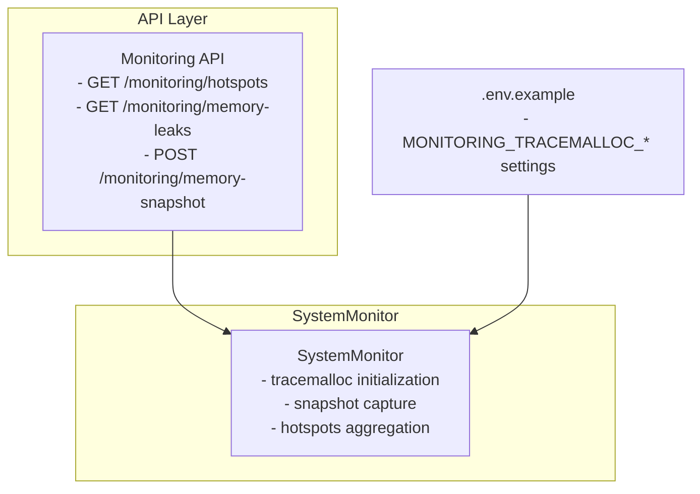
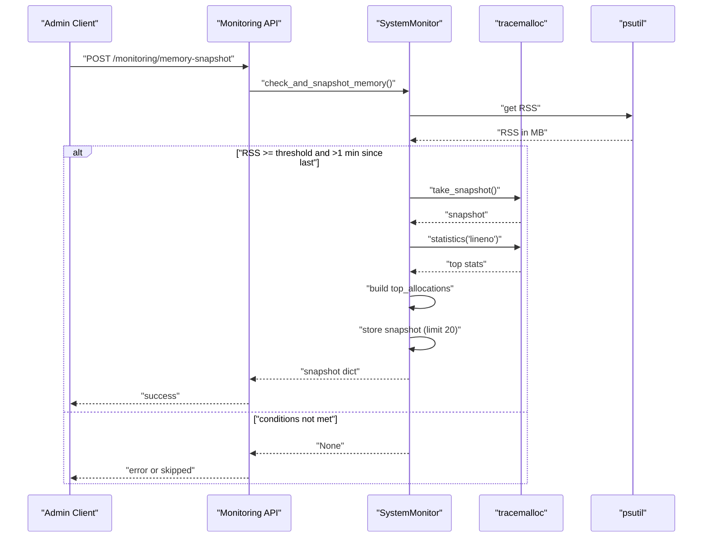
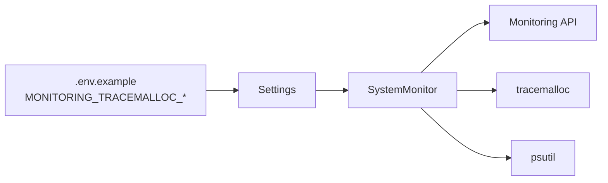

# Memory Snapshots

<cite>
**Referenced Files in This Document**
- [monitoring.py](file://vertex-ar/app/monitoring.py)
- [monitoring.py](file://vertex-ar/app/api/monitoring.py)
- [.env.example](file://.env.example)
- [test_monitoring.py](file://test_files/unit/test_monitoring.py)
</cite>

## Table of Contents
1. [Introduction](#introduction)
2. [Project Structure](#project-structure)
3. [Core Components](#core-components)
4. [Architecture Overview](#architecture-overview)
5. [Detailed Component Analysis](#detailed-component-analysis)
6. [Dependency Analysis](#dependency-analysis)
7. [Performance Considerations](#performance-considerations)
8. [Troubleshooting Guide](#troubleshooting-guide)
9. [Conclusion](#conclusion)
10. [Appendices](#appendices)

## Introduction
This document explains the memory snapshot feature powered by Python’s tracemalloc in the Vertex AR monitoring system. It covers how automatic memory profiling is triggered when the application’s RSS exceeds a configurable threshold, how snapshots are captured and analyzed, and how the collected data is exposed via API endpoints. It also describes the rate-limiting mechanism, retention policy, and the manual on-demand snapshot endpoint. Configuration examples for production and debugging are included, along with guidance on interpreting top allocations to detect memory leaks and inefficient usage patterns.

## Project Structure
The memory snapshot feature spans two primary areas:
- SystemMonitor: core logic for enabling tracemalloc, capturing snapshots, and exposing diagnostics.
- Monitoring API: endpoints to retrieve hotspots, memory leak data, and to manually trigger snapshots.

**Diagram sources**
- [monitoring.py](file://vertex-ar/app/monitoring.py#L52-L87)
- [monitoring.py](file://vertex-ar/app/api/monitoring.py#L616-L776)
- [.env.example](file://.env.example#L457-L463)

**Section sources**
- [monitoring.py](file://vertex-ar/app/monitoring.py#L52-L87)
- [monitoring.py](file://vertex-ar/app/api/monitoring.py#L616-L776)
- [.env.example](file://.env.example#L457-L463)

## Core Components
- Automatic memory profiling:
  - Enabled when MONITORING_TRACEMALLOC_ENABLED is true.
  - Initializes tracemalloc only if tracing is not already active.
  - Captures snapshots when RSS exceeds MONITORING_TRACEMALLOC_THRESHOLD_MB.
  - Rate-limits snapshots to approximately one per minute.
  - Stores up to 20 most recent snapshots.
- Manual snapshot endpoint:
  - POST /monitoring/memory-snapshot forces a snapshot regardless of threshold.
- Hotspots exposure:
  - GET /monitoring/hotspots returns process trends, slow queries/endpoints, and memory snapshots.
  - GET /monitoring/memory-leaks returns memory snapshot data with current RSS and threshold.

Key configuration keys:
- MONITORING_TRACEMALLOC_ENABLED: toggles tracemalloc.
- MONITORING_TRACEMALLOC_THRESHOLD_MB: RSS threshold to trigger snapshots.
- MONITORING_TRACEMALLOC_TOP_N: number of top allocations to record per snapshot.

**Section sources**
- [monitoring.py](file://vertex-ar/app/monitoring.py#L52-L87)
- [monitoring.py](file://vertex-ar/app/monitoring.py#L719-L781)
- [monitoring.py](file://vertex-ar/app/monitoring.py#L783-L831)
- [monitoring.py](file://vertex-ar/app/api/monitoring.py#L616-L776)
- [.env.example](file://.env.example#L457-L463)

## Architecture Overview
The memory snapshot pipeline integrates monitoring and API layers with configuration-driven behavior.

**Diagram sources**
- [monitoring.py](file://vertex-ar/app/api/monitoring.py#L723-L776)
- [monitoring.py](file://vertex-ar/app/monitoring.py#L719-L781)

## Detailed Component Analysis

### Automatic Memory Profiling: check_and_snapshot_memory
Behavior:
- Checks if tracemalloc is enabled.
- Reads current RSS via psutil.
- Compares RSS to MONITORING_TRACEMALLOC_THRESHOLD_MB.
- Enforces a minimum 60-second interval between snapshots.
- Captures a tracemalloc snapshot and extracts top allocations by line number.
- Builds a snapshot entry with timestamp, RSS, and top allocations.
- Appends to an internal list and retains up to 20 entries.
- Updates last snapshot timestamp.

Top allocations structure:
- file: primary traceback frame filename and line.
- size_mb: total allocated bytes converted to MB.
- count: number of allocations in that frame.

Rate limiting:
- Prevents more than one snapshot per minute.

Retention:
- Limits stored snapshots to the most recent 20.

Error handling:
- Catches exceptions and logs errors; returns None on failure.

**Section sources**
- [monitoring.py](file://vertex-ar/app/monitoring.py#L719-L781)

### Initialization and Configuration: tracemalloc start
- On initialization, if tracemalloc is enabled, the module attempts to start tracing.
- Logs configuration and disables tracemalloc if startup fails.

**Section sources**
- [monitoring.py](file://vertex-ar/app/monitoring.py#L52-L87)

### Exposing Diagnostics: get_hotspots
- Aggregates:
  - Process trends (CPU/RSS averages, min/max, sample count).
  - Slow queries and endpoints (with thresholds and counts).
  - Memory snapshots (count, enabled flag, threshold, and snapshot list).
- Returns a structured dictionary consumed by API endpoints.

**Section sources**
- [monitoring.py](file://vertex-ar/app/monitoring.py#L783-L831)

### API Endpoints

#### GET /monitoring/hotspots
- Returns comprehensive diagnostics including memory snapshots, slow queries/endpoints, and process trends.
- Includes configuration metadata for tracemalloc (enabled, threshold, top_n).

**Section sources**
- [monitoring.py](file://vertex-ar/app/api/monitoring.py#L616-L661)

#### GET /monitoring/memory-leaks
- Validates tracemalloc enabled.
- Retrieves memory snapshot data via get_hotspots.
- Adds current RSS and threshold to the response.
- Returns snapshot list and latest snapshot.

**Section sources**
- [monitoring.py](file://vertex-ar/app/api/monitoring.py#L663-L721)

#### POST /monitoring/memory-snapshot (manual)
- Requires tracemalloc enabled.
- Temporarily lowers threshold to zero to force a snapshot.
- Restores threshold after capture.
- Returns the captured snapshot.

**Section sources**
- [monitoring.py](file://vertex-ar/app/api/monitoring.py#L723-L776)

### Unit Test Coverage
- Confirms that when tracemalloc is enabled and RSS exceeds threshold, a snapshot is taken and stored.
- Verifies snapshot structure includes timestamp, memory_mb, and top_allocations.

**Section sources**
- [test_monitoring.py](file://test_files/unit/test_monitoring.py#L827-L870)

## Dependency Analysis
- SystemMonitor depends on:
  - psutil for RSS measurement.
  - tracemalloc for heap profiling.
  - settings for configuration values.
- API endpoints depend on SystemMonitor for data retrieval and snapshot capture.
- Configuration is sourced from environment variables defined in .env.example.

**Diagram sources**
- [.env.example](file://.env.example#L457-L463)
- [monitoring.py](file://vertex-ar/app/monitoring.py#L52-L87)
- [monitoring.py](file://vertex-ar/app/api/monitoring.py#L616-L776)

**Section sources**
- [.env.example](file://.env.example#L457-L463)
- [monitoring.py](file://vertex-ar/app/monitoring.py#L52-L87)
- [monitoring.py](file://vertex-ar/app/api/monitoring.py#L616-L776)

## Performance Considerations
- Overhead: Enabling tracemalloc adds approximately 10% overhead when active.
- Production guidance:
  - Keep MONITORING_TRACEMALLOC_ENABLED=false by default.
  - Enable temporarily when investigating memory issues.
  - Tune MONITORING_TRACEMALLOC_THRESHOLD_MB slightly above normal RSS to avoid frequent snapshots.
  - Adjust MONITORING_TRACEMALLOC_TOP_N for desired detail level.

[No sources needed since this section provides general guidance]

## Troubleshooting Guide
Common issues and resolutions:
- Snapshots not triggering:
  - Ensure MONITORING_TRACEMALLOC_ENABLED=true.
  - Confirm RSS exceeds MONITORING_TRACEMALLOC_THRESHOLD_MB.
  - Wait at least 60 seconds between snapshots due to rate limiting.
- Manual snapshot fails:
  - Verify tracemalloc is enabled; endpoint returns an error if disabled.
  - Check that the application process is reachable and not overloaded.
- Insufficient detail in top allocations:
  - Increase MONITORING_TRACEMALLOC_TOP_N.
- Too many snapshots:
  - The system retains only the last 20 snapshots automatically.

Interpretation tips:
- Look for repeated filenames/lines in top_allocations across snapshots to identify hotspots.
- Compare timestamps to detect growth in allocations over time.
- Correlate top allocations with recent code changes or heavy operations.

**Section sources**
- [monitoring.py](file://vertex-ar/app/monitoring.py#L719-L781)
- [monitoring.py](file://vertex-ar/app/api/monitoring.py#L723-L776)

## Conclusion
The memory snapshot feature provides a practical way to profile Python heap allocations in Vertex AR. Automatic snapshots activate when RSS crosses a configurable threshold, rate-limit snapshots to prevent overhead spikes, and retain a bounded history for trend analysis. The API exposes this data for operational insights and targeted debugging, while a manual endpoint enables on-demand profiling. Proper configuration and cautious use keep the overhead manageable while delivering actionable diagnostics.

[No sources needed since this section summarizes without analyzing specific files]

## Appendices

### Configuration Examples

- Production monitoring (default, disabled):
  - MONITORING_TRACEMALLOC_ENABLED=false
  - MONITORING_TRACEMALLOC_THRESHOLD_MB=100
  - MONITORING_TRACEMALLOC_TOP_N=10

- Debugging memory leaks (temporary):
  - MONITORING_TRACEMALLOC_ENABLED=true
  - MONITORING_TRACEMALLOC_THRESHOLD_MB=slightly above normal RSS
  - MONITORING_TRACEMALLOC_TOP_N=20–50

- Tuning guidelines:
  - Lower thresholds and increase TOP_N for more detail.
  - Monitor via GET /monitoring/hotspots regularly.

**Section sources**
- [.env.example](file://.env.example#L457-L463)
- [monitoring.py](file://vertex-ar/app/api/monitoring.py#L663-L721)