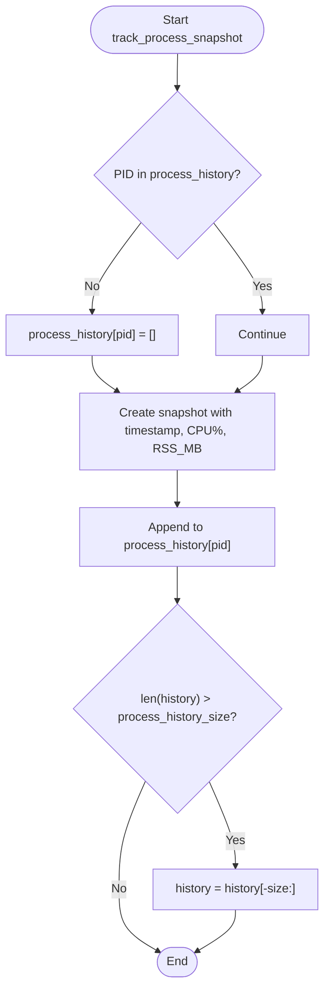
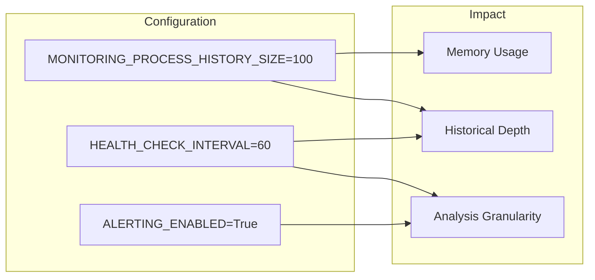
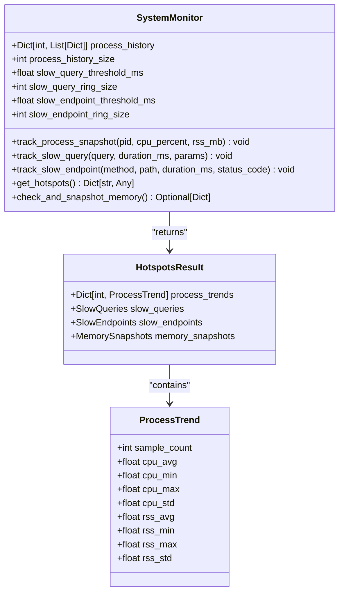
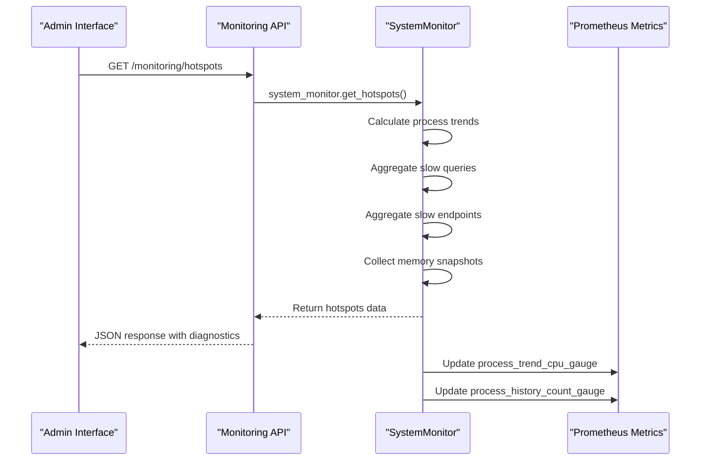

# Process History Tracking

<cite>
**Referenced Files in This Document**   
- [monitoring.py](file://vertex-ar/app/monitoring.py)
- [test_monitoring.py](file://test_files/unit/test_monitoring.py)
- [prometheus_metrics.py](file://vertex-ar/app/prometheus_metrics.py)
- [api/monitoring.py](file://vertex-ar/app/api/monitoring.py)
</cite>

## Table of Contents
1. [Introduction](#introduction)
2. [Process History Data Structure](#process-history-data-structure)
3. [Ring Buffer Implementation](#ring-buffer-implementation)
4. [Configuration and Tuning](#configuration-and-tuning)
5. [Hotspot Analysis and Trend Calculation](#hotspot-analysis-and-trend-calculation)
6. [Integration with Monitoring System](#integration-with-monitoring-system)
7. [Performance Considerations](#performance-considerations)
8. [Troubleshooting Guide](#troubleshooting-guide)

## Introduction
The Vertex AR monitoring system implements a process history tracking feature that captures and maintains CPU and memory usage metrics for monitored processes. This feature uses a ring buffer data structure to store snapshots of process performance metrics, enabling historical analysis and trend identification. The system tracks CPU percentage and Resident Set Size (RSS) in MB for each process, maintaining a fixed-size history based on the MONITORING_PROCESS_HISTORY_SIZE configuration parameter. This documentation details the implementation, configuration, and usage of this process history tracking system, including how it integrates with the broader monitoring infrastructure to identify performance hotspots and abnormal resource consumption patterns.

## Process History Data Structure
The process history tracking system captures three key metrics for each process snapshot: timestamp, CPU percentage, and memory usage in MB. Each snapshot is stored as a dictionary with standardized keys that ensure consistency across the system. The timestamp is recorded in UTC ISO format to maintain temporal accuracy across different time zones and system configurations. CPU usage is stored as a floating-point percentage value, rounded to two decimal places for precision while minimizing storage overhead. Memory usage is recorded as the Resident Set Size (RSS) in megabytes, also rounded to two decimal places, providing a clear measure of the actual physical memory consumed by the process. These snapshots are organized in a hierarchical data structure where each process ID (PID) serves as a key to a list of its historical snapshots, enabling efficient retrieval and analysis of individual process behavior over time.

**Section sources**
- [monitoring.py](file://vertex-ar/app/monitoring.py#L651-L655)

## Ring Buffer Implementation
The process history tracking system implements a ring buffer using Python's built-in list data structure with size enforcement logic. The `track_process_snapshot` method handles the insertion of new snapshots into the buffer, first checking if a history exists for the given process ID and creating one if necessary. When a new snapshot is added, it is appended to the end of the process's history list. The system then checks if the list exceeds the configured maximum size (MONITORING_PROCESS_HISTORY_SIZE), and if so, it retains only the most recent N snapshots by slicing the list to keep the last N elements. This implementation ensures O(1) amortized time complexity for insertion operations while maintaining memory efficiency by preventing unbounded growth of the history data. The ring buffer behavior guarantees that the system always retains the most recent performance data, automatically discarding older snapshots as new ones are added, which is essential for real-time monitoring and alerting.

**Diagram sources **
- [monitoring.py](file://vertex-ar/app/monitoring.py#L648-L661)

**Section sources**
- [monitoring.py](file://vertex-ar/app/monitoring.py#L639-L662)

## Configuration and Tuning
The process history tracking system is configured through environment variables and settings that control its behavior and resource usage. The primary configuration parameter is MONITORING_PROCESS_HISTORY_SIZE, which determines the maximum number of snapshots retained for each process. By default, this is set to 100 snapshots per process, providing approximately 100 minutes of historical data when combined with the default 60-second health check interval. This configuration can be adjusted based on deployment requirements, with smaller values reducing memory overhead at the cost of historical depth, and larger values providing more comprehensive historical analysis at the expense of increased memory usage. The system also supports dynamic reloading of settings from the database, allowing administrators to adjust the history size without restarting the application. For environments with limited memory resources, a smaller history size (e.g., 50) is recommended, while production systems with ample memory may benefit from larger history sizes (e.g., 200) to support more detailed trend analysis.

**Diagram sources **
- [monitoring.py](file://vertex-ar/app/monitoring.py#L52-L53)
- [test_monitoring.py](file://test_files/unit/test_monitoring.py#L638)

**Section sources**
- [monitoring.py](file://vertex-ar/app/monitoring.py#L52-L61)
- [test_monitoring.py](file://test_files/unit/test_monitoring.py#L638)

## Hotspot Analysis and Trend Calculation
The get_hotspots method aggregates process history data to calculate meaningful trends and identify performance anomalies. For each tracked process, the system computes statistical metrics including average, minimum, and maximum values for both CPU usage and memory consumption across all stored snapshots. These calculations are performed in real-time when the get_hotspots method is called, ensuring that the results reflect the most current state of the system. The method returns a comprehensive dictionary containing process trends keyed by process ID, with each entry including sample count, average CPU usage, average memory usage, minimum and maximum values, and standard deviation where applicable. This aggregated data enables administrators to quickly identify processes exhibiting abnormal resource consumption patterns, such as memory leaks (consistently increasing RSS) or CPU spikes (high maximum values with low averages). The hotspot analysis also integrates with the system's alerting infrastructure, providing the foundation for proactive notifications when processes exceed predefined thresholds.

**Diagram sources **
- [monitoring.py](file://vertex-ar/app/monitoring.py#L783-L800)
- [api/monitoring.py](file://vertex-ar/app/api/monitoring.py#L616-L654)

**Section sources**
- [monitoring.py](file://vertex-ar/app/monitoring.py#L783-L800)
- [prometheus_metrics.py](file://vertex-ar/app/prometheus_metrics.py#L217-L242)

## Integration with Monitoring System
The process history tracking feature is tightly integrated with the broader Vertex AR monitoring system through multiple interfaces and data flow pathways. The SystemMonitor class serves as the central component, coordinating between process history collection, slow query tracking, slow endpoint monitoring, and memory snapshot capabilities. The get_hotspots method consolidates data from all these subsystems into a unified response that can be exposed through the monitoring API. Prometheus metrics are automatically updated with process trend data, enabling visualization in Grafana dashboards and integration with external monitoring tools. The API endpoint at /monitoring/hotspots provides authenticated access to the aggregated hotspot data, including configuration parameters and diagnostic information. This integration allows administrators to correlate process resource usage with other performance metrics, such as database query performance and HTTP endpoint response times, providing a comprehensive view of system health and performance bottlenecks.

**Diagram sources **
- [api/monitoring.py](file://vertex-ar/app/api/monitoring.py#L616-L654)
- [prometheus_metrics.py](file://vertex-ar/app/prometheus_metrics.py#L217-L242)

**Section sources**
- [api/monitoring.py](file://vertex-ar/app/api/monitoring.py#L616-L654)
- [prometheus_metrics.py](file://vertex-ar/app/prometheus_metrics.py#L217-L242)

## Performance Considerations
The process history tracking system is designed with performance and memory efficiency as primary considerations. The ring buffer implementation ensures that memory usage scales linearly with the number of monitored processes and the configured history size, rather than growing unbounded over time. Each process snapshot requires approximately 200-300 bytes of memory, meaning that tracking 100 processes with a history size of 100 would require roughly 2-3 MB of memory for the process history data alone. The system minimizes CPU overhead by using efficient data structures and algorithms, with snapshot insertion operating in O(1) amortized time. However, the get_hotspots method has O(N*M) complexity where N is the number of processes and M is the average history size, making it potentially expensive for systems with many processes. To mitigate this, the method is typically called only when requested by administrators or monitoring tools, rather than running continuously. For high-density deployments with hundreds of processes, it is recommended to reduce the MONITORING_PROCESS_HISTORY_SIZE to 50 or lower to maintain optimal system performance.

**Section sources**
- [monitoring.py](file://vertex-ar/app/monitoring.py#L63-L66)
- [test_monitoring.py](file://test_files/unit/test_monitoring.py#L638)

## Troubleshooting Guide
Common issues with the process history tracking system typically relate to configuration, memory usage, or data visibility. If process history data is not appearing as expected, verify that the MONITORING_PROCESS_HISTORY_SIZE environment variable is properly set and that the SystemMonitor instance is correctly initialized. Memory overhead can become significant when monitoring a large number of processes, so monitor the application's overall memory usage and adjust the history size accordingly. If the get_hotspots endpoint returns empty or incomplete data, check that processes are being actively tracked by verifying calls to track_process_snapshot in the application logs. For environments with intermittent monitoring, ensure that the health check interval is properly configured to capture snapshots at the desired frequency. When investigating performance issues, compare the process history data with other monitoring metrics to identify correlations between CPU/memory usage and slow queries or endpoints. The system's integration with Prometheus provides additional visibility into the health of the monitoring infrastructure itself, including metrics on the number of tracked processes and snapshot frequency.

**Section sources**
- [monitoring.py](file://vertex-ar/app/monitoring.py#L639-L662)
- [api/monitoring.py](file://vertex-ar/app/api/monitoring.py#L616-L654)
- [test_monitoring.py](file://test_files/unit/test_monitoring.py#L648-L655)