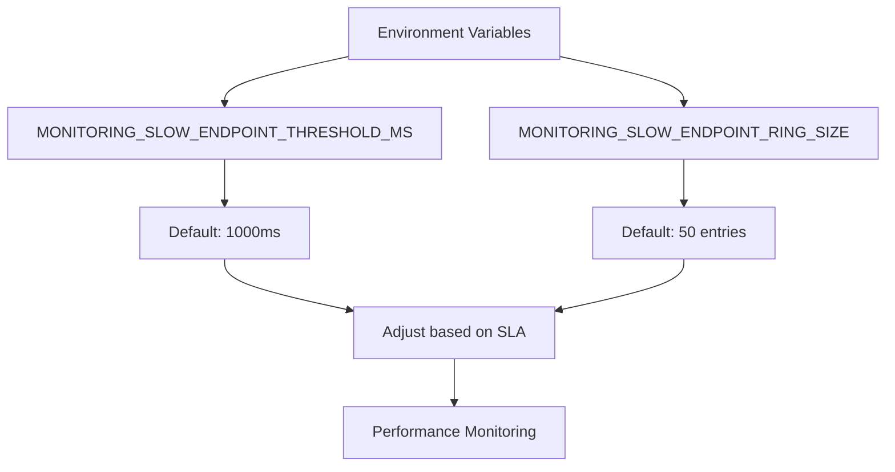
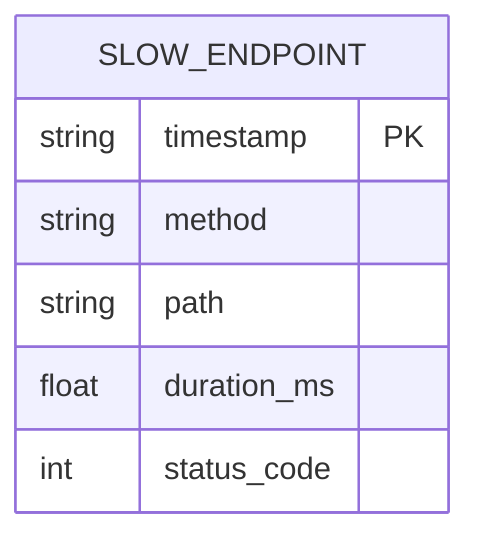
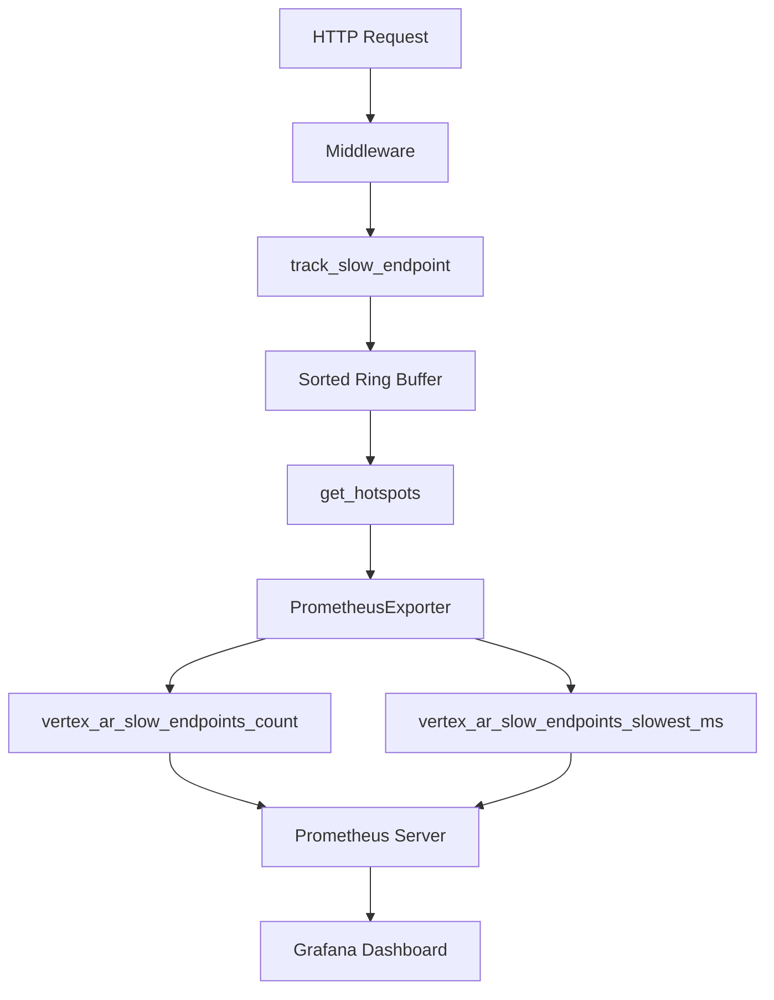

# Slow Endpoint Detection

<cite>
**Referenced Files in This Document**   
- [monitoring.py](file://vertex-ar/app/monitoring.py)
- [middleware.py](file://vertex-ar/app/middleware.py)
- [prometheus_metrics.py](file://vertex-ar/app/prometheus_metrics.py)
- [config.py](file://vertex-ar/app/config.py)
- [api/monitoring.py](file://vertex-ar/app/api/monitoring.py)
- [deep-diagnostics.md](file://docs/monitoring/deep-diagnostics.md)
- [implementation.md](file://docs/monitoring/implementation.md)
</cite>

## Table of Contents
1. [Introduction](#introduction)
2. [Configuration](#configuration)
3. [Implementation](#implementation)
4. [Data Collection and Storage](#data-collection-and-storage)
5. [Middleware Integration](#middleware-integration)
6. [Data Aggregation and Retrieval](#data-aggregation-and-retrieval)
7. [Prometheus Metrics](#prometheus-metrics)
8. [Usage and Optimization](#usage-and-optimization)
9. [Troubleshooting](#troubleshooting)
10. [Best Practices](#best-practices)

## Introduction
The Vertex AR monitoring system includes a comprehensive slow endpoint detection capability designed to identify API endpoints that exceed performance thresholds. This system automatically captures HTTP request performance data, storing information about slow endpoints in a sorted ring buffer for analysis and optimization. The implementation integrates with application middleware to transparently monitor all incoming requests, capturing critical performance metrics including HTTP method, request path, response duration, status code, and timestamps. This documentation details the architecture, configuration, and usage of the slow endpoint detection system, providing guidance on how to leverage this data for API performance optimization.

**Section sources**
- [monitoring.py](file://vertex-ar/app/monitoring.py#L55-L57)
- [deep-diagnostics.md](file://docs/monitoring/deep-diagnostics.md#L27-L35)

## Configuration
The slow endpoint detection system is configured through environment variables that control the threshold for identifying slow endpoints and the size of the storage buffer. The primary configuration parameters are `MONITORING_SLOW_ENDPOINT_THRESHOLD_MS` and `MONITORING_SLOW_ENDPOINT_RING_SIZE`, which are defined in the application settings. The threshold determines the response time in milliseconds that qualifies an endpoint as "slow," with a default value of 1000 milliseconds. The ring size parameter controls the maximum number of slow endpoint records to retain, defaulting to 50 entries. These settings can be adjusted based on service level agreements and performance requirements, allowing organizations to customize monitoring sensitivity for different environments (development, staging, production).

**Diagram sources**
- [config.py](file://vertex-ar/app/config.py#L231-L232)
- [monitoring.py](file://vertex-ar/app/monitoring.py#L55-L57)

## Implementation
The slow endpoint detection capability is implemented within the `SystemMonitor` class in the monitoring module. The core functionality is provided by the `track_slow_endpoint` method, which evaluates incoming request data against the configured threshold and stores qualifying entries in a sorted ring buffer. When a request duration exceeds the `MONITORING_SLOW_ENDPOINT_THRESHOLD_MS` value, the method creates a structured record containing the HTTP method, request path, duration in milliseconds, status code, and timestamp. This implementation uses a sorted insertion strategy to maintain the buffer with the slowest endpoints at the beginning, ensuring quick access to the most critical performance issues. The system is designed to be lightweight and efficient, minimizing overhead while providing comprehensive performance monitoring.

**Section sources**
- [monitoring.py](file://vertex-ar/app/monitoring.py#L689-L718)

## Data Collection and Storage
The system captures five key data points for each slow endpoint: HTTP method, request path, response duration, status code, and timestamp. These metrics are stored in a sorted ring buffer implemented as a list of dictionaries, with new entries inserted in descending order of duration (slowest first). The buffer is limited by the `MONITORING_SLOW_ENDPOINT_RING_SIZE` configuration parameter, which defaults to 50 entries. When the buffer reaches its capacity, additional entries beyond the ring size are truncated, preserving only the top N slowest endpoints. This storage strategy ensures that the most significant performance issues remain visible while preventing unbounded memory growth. The timestamp is recorded in UTC ISO format, enabling temporal analysis of performance patterns and correlation with specific user workflows or system events.

**Diagram sources**
- [monitoring.py](file://vertex-ar/app/monitoring.py#L703-L709)
- [monitoring.py](file://vertex-ar/app/monitoring.py#L711-L717)

## Middleware Integration
The slow endpoint detection system is seamlessly integrated into the application through the `RequestLoggingMiddleware`, which automatically captures timing data for all incoming HTTP requests. This middleware calculates the request duration by recording the start time at the beginning of request processing and computing the difference when the response is completed. After logging the request details, the middleware calls the `track_slow_endpoint` method on the system monitor, passing the HTTP method, request path, duration, and status code. This integration approach ensures comprehensive coverage of all API endpoints without requiring code changes to individual route handlers. The middleware also handles error cases, tracking failed requests with a 500 status code to ensure that performance issues resulting in errors are properly captured and analyzed.

**Section sources**
- [middleware.py](file://vertex-ar/app/middleware.py#L42-L67)
- [middleware.py](file://vertex-ar/app/middleware.py#L77-L98)

## Data Aggregation and Retrieval
The `get_hotspots` method aggregates slow endpoint data along with other performance diagnostics for comprehensive analysis. This method returns a structured response containing the count of slow endpoints, the configured threshold, and the complete list of tracked endpoints sorted by duration. The data is accessible through the `/admin/monitoring/hotspots` API endpoint, which requires administrative authentication. The aggregation process also includes metadata about the monitoring configuration, enabling users to understand the context in which the data was collected. This comprehensive view allows developers and system administrators to quickly identify performance bottlenecks, analyze patterns across multiple slow endpoints, and prioritize optimization efforts based on the severity and frequency of performance issues.

**Section sources**
- [monitoring.py](file://vertex-ar/app/monitoring.py#L783-L823)
- [api/monitoring.py](file://vertex-ar/app/api/monitoring.py#L616-L661)

## Prometheus Metrics
The system exposes two key Prometheus metrics for monitoring slow endpoints: `vertex_ar_slow_endpoints_count` and `vertex_ar_slow_endpoints_slowest_ms`. The count metric provides the current number of tracked slow endpoints, while the slowest_ms metric reports the duration of the single slowest endpoint in milliseconds. These metrics are updated periodically by the `PrometheusExporter` class, which retrieves the data from the `get_hotspots` method and converts it to the appropriate Prometheus format. The metrics are automatically exposed at the `/metrics` endpoint, making them available for collection by Prometheus servers and visualization in Grafana dashboards. This integration enables proactive alerting and long-term trend analysis, helping teams identify performance degradation before it impacts users.

**Diagram sources**
- [prometheus_metrics.py](file://vertex-ar/app/prometheus_metrics.py#L67-L68)
- [prometheus_metrics.py](file://vertex-ar/app/prometheus_metrics.py#L228-L234)

## Usage and Optimization
The slow endpoint data can be leveraged for API performance optimization through various strategies, including caching and code optimization. By analyzing the aggregated data, teams can identify endpoints that would benefit from response caching, particularly those with high response times and frequent access patterns. For endpoints that cannot be effectively cached, the data provides insights for code optimization, such as database query improvements, algorithm enhancements, or resource loading optimizations. The system supports different service level agreement configurations, allowing organizations to set appropriate thresholds based on their performance requirements. For example, user-facing APIs might use a threshold of 1000-2000ms, while internal microservices could have stricter thresholds of 100-500ms.

**Section sources**
- [deep-diagnostics.md](file://docs/monitoring/deep-diagnostics.md#L140-L151)
- [implementation.md](file://docs/monitoring/implementation.md#L360-L369)

## Troubleshooting
Common issues with the slow endpoint detection system include missing slow endpoints due to improper threshold settings or disabled monitoring. If no slow endpoints appear in the monitoring data, verify that the `MONITORING_SLOW_ENDPOINT_THRESHOLD_MS` is set appropriately for your environment and that request durations actually exceed this threshold. Ensure that the monitoring system is enabled by checking the `ALERTING_ENABLED` setting. The system logs diagnostic information that can help identify configuration issues, including messages about slow endpoint detection. To correlate slow endpoints with specific user workflows, examine the request paths and parameters in the collected data, and consider augmenting the system with additional logging or tracing for complex workflows. Regularly reviewing the hotspots data can help identify emerging performance issues before they become critical.

**Section sources**
- [deep-diagnostics.md](file://docs/monitoring/deep-diagnostics.md#L234-L239)
- [implementation.md](file://docs/monitoring/implementation.md#L410-L412)

## Best Practices
For production environments, configure the slow endpoint threshold between 1000-2000 milliseconds to focus on user-impacting performance issues while minimizing monitoring overhead. Keep the ring buffer size at the default of 50 entries to balance diagnostic value with memory usage. In development and debugging environments, consider lowering the threshold to 500 milliseconds or less to capture more granular performance data for optimization. Regularly review the slow endpoint data through the `/admin/monitoring/hotspots` endpoint, and set up Prometheus alerts on the `vertex_ar_slow_endpoints_count` and `vertex_ar_slow_endpoints_slowest_ms` metrics to proactively detect performance degradation. When optimizing endpoints, prioritize those with the highest duration and frequency, as these will provide the greatest performance improvement for users.

**Section sources**
- [deep-diagnostics.md](file://docs/monitoring/deep-diagnostics.md#L206-L211)
- [implementation.md](file://docs/monitoring/implementation.md#L409-L412)