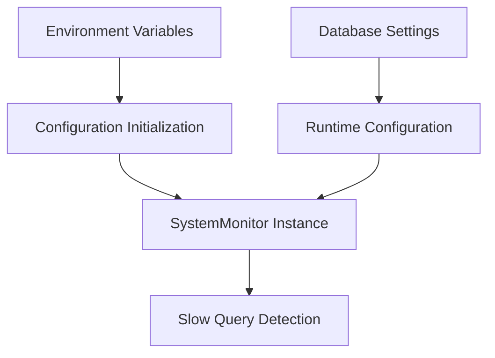
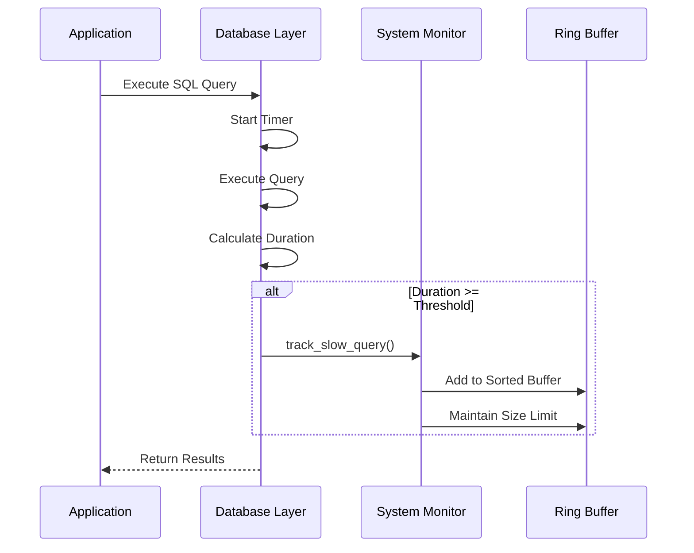
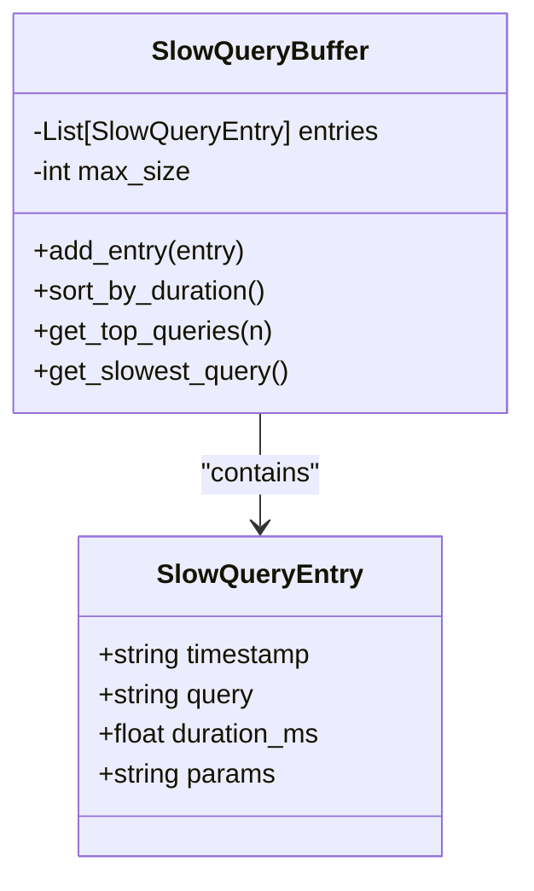
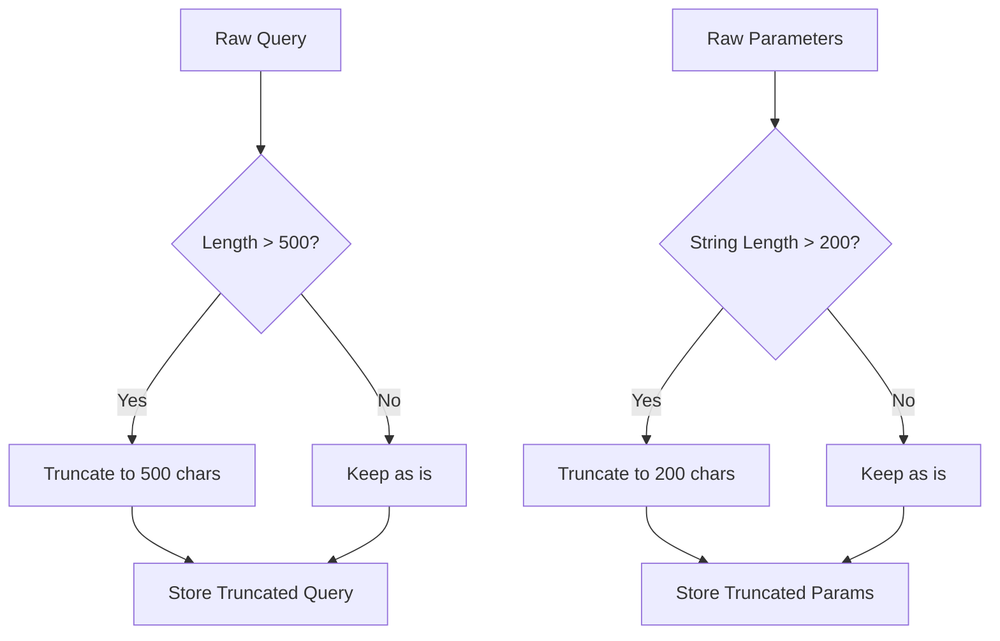
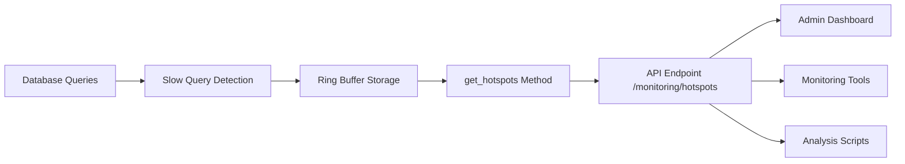
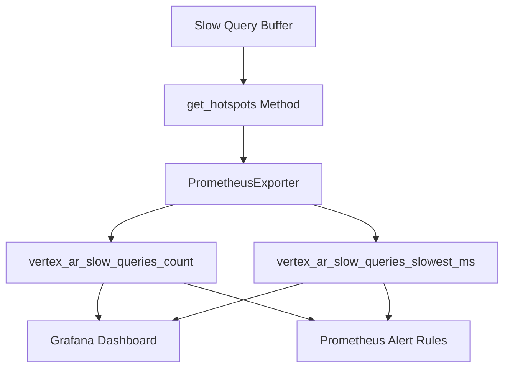
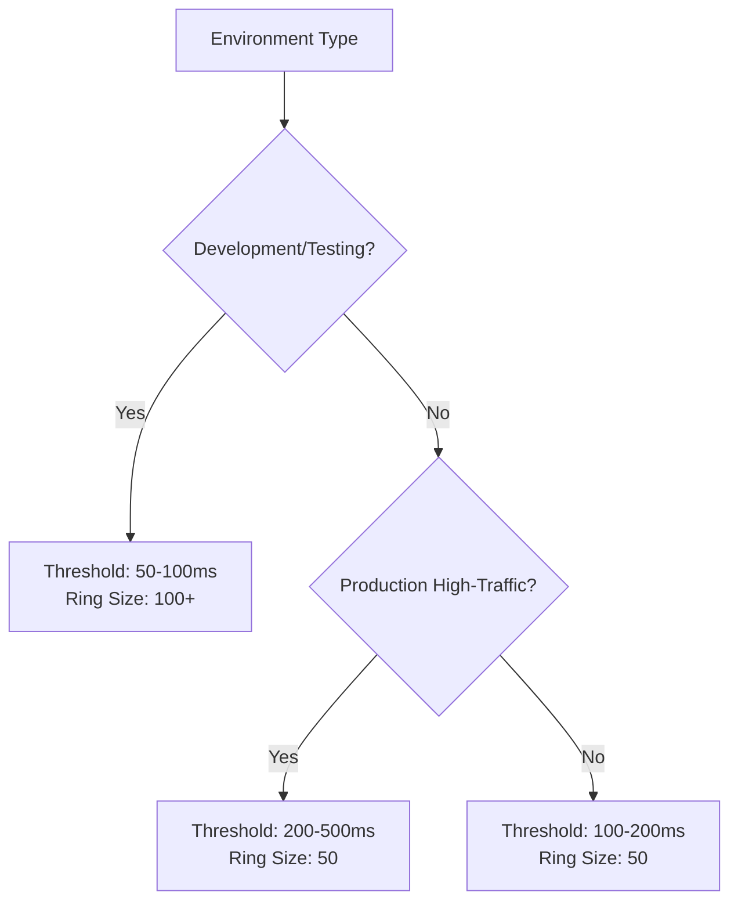
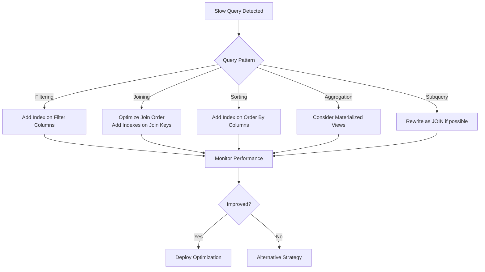
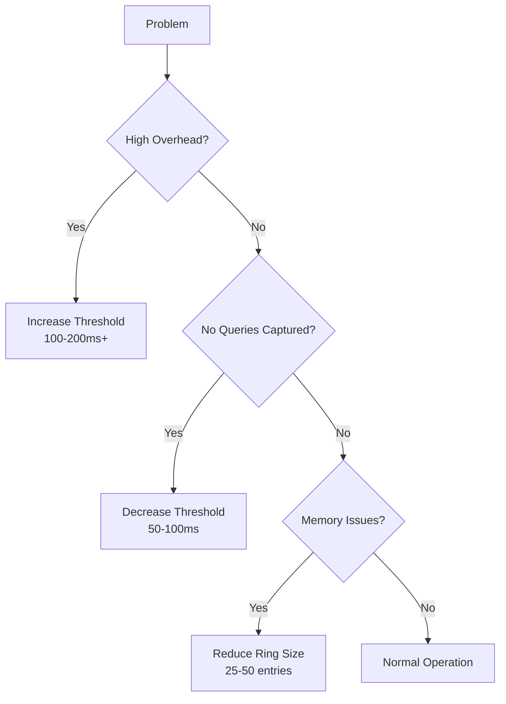

# Slow Query Detection

<cite>
**Referenced Files in This Document**   
- [monitoring.py](file://vertex-ar/app/monitoring.py)
- [database.py](file://vertex-ar/app/database.py)
- [prometheus_metrics.py](file://vertex-ar/app/prometheus_metrics.py)
- [config.py](file://vertex-ar/app/config.py)
- [test_monitoring.py](file://test_files/unit/test_monitoring.py)
- [deep-diagnostics.md](file://docs/monitoring/deep-diagnostics.md)
- [implementation.md](file://docs/monitoring/implementation.md)
</cite>

## Table of Contents
1. [Introduction](#introduction)
2. [Configuration Parameters](#configuration-parameters)
3. [Slow Query Tracking Mechanism](#slow-query-tracking-mechanism)
4. [Data Structure and Storage](#data-structure-and-storage)
5. [Query Truncation and Memory Management](#query-truncation-and-memory-management)
6. [Data Exposure and Retrieval](#data-exposure-and-retrieval)
7. [Prometheus Metrics Integration](#prometheus-metrics-integration)
8. [Configuration Profiles](#configuration-profiles)
9. [Performance Optimization Guidance](#performance-optimization-guidance)
10. [Common Issues and Troubleshooting](#common-issues-and-troubleshooting)

## Introduction
The slow query detection system in the Vertex AR monitoring framework provides comprehensive database performance monitoring capabilities. This system captures and analyzes SQL queries that exceed a configurable execution time threshold, enabling administrators to identify and resolve performance bottlenecks. The implementation combines real-time monitoring with historical analysis, providing both immediate visibility into problematic queries and long-term performance trend analysis. The system is designed to balance detailed performance insights with minimal overhead on production systems, making it suitable for continuous monitoring in production environments.

**Section sources**
- [monitoring.py](file://vertex-ar/app/monitoring.py#L53-L55)
- [config.py](file://vertex-ar/app/config.py#L228-L229)

## Configuration Parameters
The slow query detection system is controlled by several configuration parameters that determine its behavior and sensitivity. These parameters are primarily defined as environment variables and can be dynamically adjusted without requiring application restarts. The key configuration parameters include:

- **MONITORING_SLOW_QUERY_THRESHOLD_MS**: The execution duration threshold in milliseconds that determines whether a query is considered "slow" and should be captured for analysis. Queries with execution times at or above this threshold are recorded.
- **MONITORING_SLOW_QUERY_RING_SIZE**: The maximum number of slow queries to retain in the monitoring buffer. The system maintains a sorted ring buffer of the slowest queries, automatically discarding older entries when the buffer reaches capacity.

These parameters are initialized from environment variables with sensible defaults, allowing for easy configuration across different deployment environments. The system also supports dynamic reloading of settings from the database, enabling runtime configuration changes through the admin interface.

**Diagram sources**
- [config.py](file://vertex-ar/app/config.py#L228-L229)
- [monitoring.py](file://vertex-ar/app/monitoring.py#L53-L55)

**Section sources**
- [config.py](file://vertex-ar/app/config.py#L228-L229)
- [monitoring.py](file://vertex-ar/app/monitoring.py#L53-L55)

## Slow Query Tracking Mechanism
The slow query tracking mechanism is implemented through a combination of database instrumentation and monitoring system integration. When a database query executes, the system measures its execution duration and evaluates whether it exceeds the configured threshold. The tracking process follows these steps:

1. Query execution begins and a timer is started
2. After query completion, the execution duration is calculated in milliseconds
3. If the duration meets or exceeds MONITORING_SLOW_QUERY_THRESHOLD_MS, the query is processed for capture
4. Query details are extracted and formatted for storage
5. The query entry is added to the sorted ring buffer

The tracking is implemented in the database layer, specifically in the `_execute` method of the `Database` class, which wraps all SQL operations. This ensures comprehensive coverage of all database interactions without requiring changes to application code. The monitoring system is accessed through a global `system_monitor` instance, which provides the `track_slow_query` method for recording slow queries.

**Diagram sources**
- [database.py](file://vertex-ar/app/database.py#L59-L77)
- [monitoring.py](file://vertex-ar/app/monitoring.py#L662-L689)

**Section sources**
- [database.py](file://vertex-ar/app/database.py#L59-L77)
- [monitoring.py](file://vertex-ar/app/monitoring.py#L662-L689)

## Data Structure and Storage
The slow query detection system stores captured query information in a structured format within a sorted ring buffer. Each captured query is represented as a dictionary containing the following fields:

- **timestamp**: The UTC timestamp when the query was executed, formatted in ISO 8601 format
- **query**: The SQL query text, potentially truncated to prevent excessive memory usage
- **duration_ms**: The query execution duration in milliseconds, rounded to two decimal places
- **params**: The query parameters, converted to string representation and potentially truncated

The ring buffer is implemented as a Python list that is maintained in sorted order, with the slowest queries positioned at the beginning. After each insertion, the list is sorted in descending order by duration, ensuring that the most problematic queries are always readily accessible. When the buffer reaches its maximum size defined by MONITORING_SLOW_QUERY_RING_SIZE, excess entries are truncated from the end (fastest queries), preserving only the slowest queries for analysis.

**Diagram sources**
- [monitoring.py](file://vertex-ar/app/monitoring.py#L675-L688)
- [monitoring.py](file://vertex-ar/app/monitoring.py#L814-L817)

**Section sources**
- [monitoring.py](file://vertex-ar/app/monitoring.py#L675-L688)

## Query Truncation and Memory Management
To prevent memory issues and ensure system stability, the slow query detection system implements automatic truncation of both query text and parameters. This memory management strategy is critical for maintaining performance, especially when dealing with complex queries or queries with large parameter sets.

Query text is truncated to a maximum of 500 characters using Python's string slicing operation (`query[:500]`). This limit ensures that even extremely long queries (such as those generated by complex reporting functions or bulk operations) do not consume excessive memory. Similarly, query parameters are converted to string representation and truncated to 200 characters (`str(params)[:200]`). This prevents memory bloat from queries with large parameter arrays or complex data structures.

The truncation strategy balances the need for query identification with memory efficiency. Even when truncated, the beginning of the query text typically contains sufficient information to identify the query type and target tables, while the duration information remains complete and accurate for performance analysis.

**Diagram sources**
- [monitoring.py](file://vertex-ar/app/monitoring.py#L677-L679)

**Section sources**
- [monitoring.py](file://vertex-ar/app/monitoring.py#L677-L679)

## Data Exposure and Retrieval
The captured slow query data is exposed through the `get_hotspots` method of the `SystemMonitor` class, which aggregates various performance diagnostics for analysis. This method returns a comprehensive dictionary containing the slow query data along with other performance metrics, enabling holistic performance analysis.

The `get_hotspots` method organizes the slow query data into a structured format that includes:
- The total count of tracked slow queries
- The current threshold value (MONITORING_SLOW_QUERY_THRESHOLD_MS)
- The complete list of slow queries, sorted by duration

This data is accessible through both direct API calls within the application and via the monitoring API endpoint `/monitoring/hotspots`, which requires administrative authentication. The endpoint returns the hotspots data in JSON format, making it easily consumable by monitoring dashboards and analysis tools.

**Diagram sources**
- [monitoring.py](file://vertex-ar/app/monitoring.py#L782-L817)
- [api/monitoring.py](file://vertex-ar/app/api/monitoring.py#L616-L654)

**Section sources**
- [monitoring.py](file://vertex-ar/app/monitoring.py#L782-L817)
- [api/monitoring.py](file://vertex-ar/app/api/monitoring.py#L616-L654)

## Prometheus Metrics Integration
The slow query detection system integrates with Prometheus monitoring through dedicated metrics that provide real-time visibility into query performance. These metrics are automatically updated and exposed at the `/metrics` endpoint, allowing for continuous monitoring and alerting.

The key Prometheus metrics related to slow query detection are:

- **vertex_ar_slow_queries_count**: A gauge metric that reports the current number of tracked slow queries in the ring buffer. This metric provides immediate insight into query performance issues.
- **vertex_ar_slow_queries_slowest_ms**: A gauge metric that reports the duration of the slowest query currently in the buffer. This metric helps identify the most severe performance bottlenecks.

These metrics are updated by the `PrometheusExporter` class, which periodically calls the `get_hotspots` method to retrieve the latest slow query data and update the corresponding Prometheus gauges. This integration enables the creation of dashboards and alerts based on slow query patterns, such as triggering alerts when the number of slow queries exceeds a certain threshold or when the slowest query duration exceeds acceptable limits.

**Diagram sources**
- [prometheus_metrics.py](file://vertex-ar/app/prometheus_metrics.py#L65-L66)
- [prometheus_metrics.py](file://vertex-ar/app/prometheus_metrics.py#L221-L226)

**Section sources**
- [prometheus_metrics.py](file://vertex-ar/app/prometheus_metrics.py#L65-L66)
- [prometheus_metrics.py](file://vertex-ar/app/prometheus_metrics.py#L221-L226)

## Configuration Profiles
The slow query detection system supports different configuration profiles tailored to various deployment environments and performance requirements. These profiles balance the need for detailed performance insights with the overhead of monitoring on production systems.

For **development and testing environments**, a lower threshold of 50-100 milliseconds is recommended to capture a broader range of queries for optimization. The ring buffer size can be increased to 100+ entries to retain more historical data for analysis. This configuration provides detailed insights into query performance but may generate significant overhead in high-traffic scenarios.

For **production environments**, a more conservative approach is recommended with a threshold of 100-200 milliseconds. This focuses monitoring on genuinely problematic queries while minimizing overhead. The default ring buffer size of 50 entries provides sufficient data for analysis without consuming excessive memory. In high-traffic production systems, the threshold may be increased further to 200-500 milliseconds to focus only on severely impacting queries.

The configuration can be adjusted based on the specific performance characteristics of the application and database, with the goal of capturing meaningful performance data while maintaining system stability.

**Section sources**
- [deep-diagnostics.md](file://docs/monitoring/deep-diagnostics.md#L53-L54)
- [implementation.md](file://docs/monitoring/implementation.md#L400-L406)

## Performance Optimization Guidance
The data captured by the slow query detection system can be used to optimize database performance through targeted query refactoring and indexing strategies. When analyzing slow queries, consider the following optimization approaches:

**Indexing Strategies**: Examine the WHERE, JOIN, and ORDER BY clauses of slow queries to identify missing indexes. For example, if a query filters on a user_id column without an index, creating an index on that column can dramatically improve performance. Composite indexes may be beneficial for queries with multiple filter conditions.

**Query Refactoring**: Complex queries with multiple JOIN operations or subqueries may benefit from refactoring. Consider breaking large queries into smaller ones, using temporary tables for intermediate results, or rewriting correlated subqueries as JOINs. Avoid SELECT * and specify only the required columns to reduce data transfer.

**Parameter Optimization**: Analyze queries with parameters to ensure they are using appropriate data types and that the database can effectively use indexes with the provided parameter values. Be aware of parameter sniffing issues where the query plan is optimized for one set of parameters but performs poorly with others.

**Batch Operations**: For applications that perform frequent INSERT or UPDATE operations, consider batching these operations to reduce the number of round trips to the database. However, ensure that batch sizes are reasonable to avoid locking issues.

The slow query data should be analyzed regularly as part of performance maintenance routines, with particular attention to queries that consistently appear in the slow query log or show increasing execution times over time.

**Section sources**
- [monitoring.py](file://vertex-ar/app/monitoring.py#L662-L689)
- [database.py](file://vertex-ar/app/database.py#L59-L77)

## Common Issues and Troubleshooting
Several common issues may arise when using the slow query detection system, particularly related to configuration and performance overhead. Understanding these issues and their solutions is essential for effective system management.

**High Overhead from Low Thresholds**: Setting the MONITORING_SLOW_QUERY_THRESHOLD_MS too low can result in excessive monitoring overhead, as a large number of queries are captured and processed. This can impact overall system performance, particularly in high-traffic environments. To resolve this, increase the threshold to focus on genuinely problematic queries, typically starting with a value of 100-200 milliseconds and adjusting based on observed query patterns.

**Insufficient Data Capture**: If the threshold is set too high, important performance issues may be missed. Monitor the vertex_ar_slow_queries_count metric to ensure it is capturing a reasonable number of queries (neither zero nor excessively high). Adjust the threshold downward if no queries are being captured, but balance this with the overhead considerations.

**Memory Usage Concerns**: Although the system implements truncation to prevent memory issues, extremely high query volumes can still impact memory usage. Monitor the application's memory consumption and consider reducing the MONITORING_SLOW_QUERY_RING_SIZE if memory usage is a concern, while ensuring sufficient data is retained for analysis.

**Configuration Persistence**: Ensure that configuration changes are properly persisted, particularly when using the database-based settings storage. Verify that changes made through the admin interface are reflected in the system behavior by checking the monitoring status endpoint.

When troubleshooting performance issues, use the slow query data in conjunction with other monitoring metrics such as CPU usage, memory consumption, and disk I/O to gain a comprehensive understanding of system performance.

**Section sources**
- [monitoring.py](file://vertex-ar/app/monitoring.py#L53-L55)
- [implementation.md](file://docs/monitoring/implementation.md#L400-L406)
- [deep-diagnostics.md](file://docs/monitoring/deep-diagnostics.md#L53-L54)