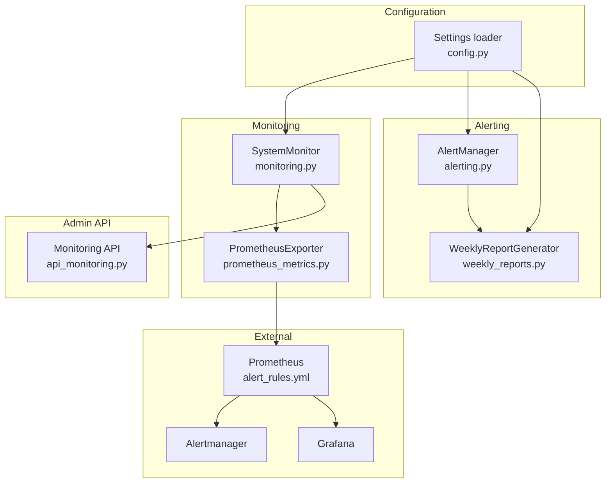
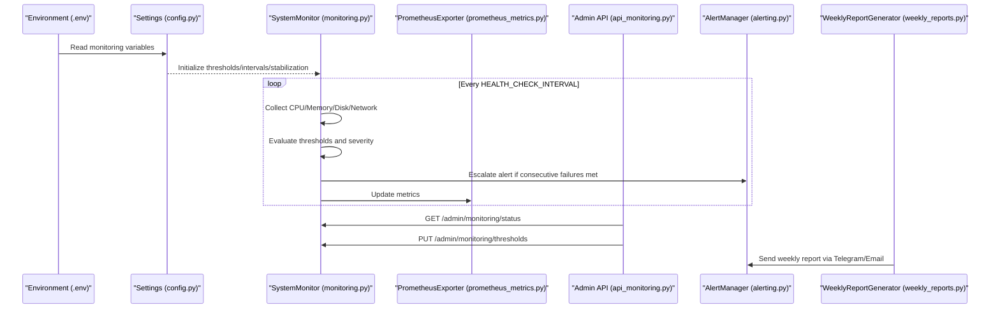
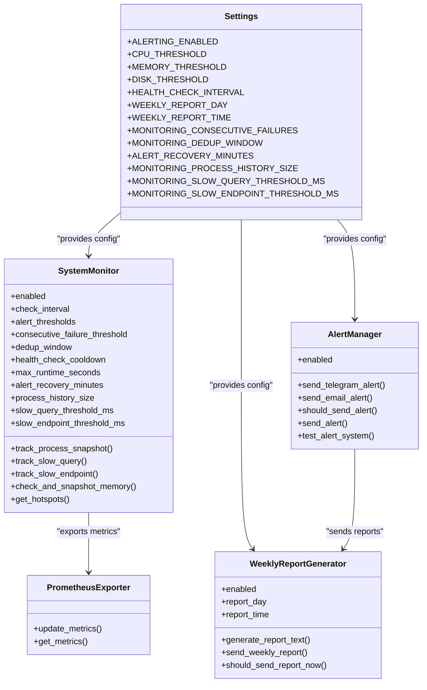
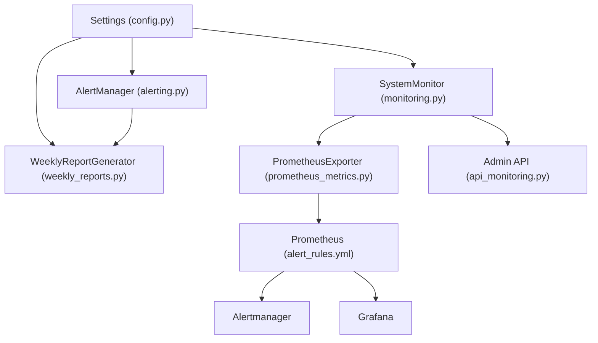

# Monitoring & Alerting

<cite>
**Referenced Files in This Document**
- [config.py](file://vertex-ar/app/config.py)
- [monitoring.py](file://vertex-ar/app/monitoring.py)
- [alerting.py](file://vertex-ar/app/alerting.py)
- [api_monitoring.py](file://vertex-ar/app/api/monitoring.py)
- [weekly_reports.py](file://vertex-ar/app/weekly_reports.py)
- [.env.example](file://vertex-ar/.env.example)
- [alert_rules.yml](file://monitoring/alert_rules.yml)
- [prometheus_metrics.py](file://vertex-ar/app/prometheus_metrics.py)
- [main.py](file://vertex-ar/app/main.py)
- [persistent-settings.md](file://docs/monitoring/persistent-settings.md)
- [alert-stabilization.md](file://docs/monitoring/alert-stabilization.md)
- [deep-diagnostics.md](file://docs/monitoring/deep-diagnostics.md)
</cite>

## Table of Contents
1. [Introduction](#introduction)
2. [Project Structure](#project-structure)
3. [Core Components](#core-components)
4. [Architecture Overview](#architecture-overview)
5. [Detailed Component Analysis](#detailed-component-analysis)
6. [Dependency Analysis](#dependency-analysis)
7. [Performance Considerations](#performance-considerations)
8. [Troubleshooting Guide](#troubleshooting-guide)
9. [Conclusion](#conclusion)
10. [Appendices](#appendices)

## Introduction
This document explains the monitoring and alerting environment variables in the Vertex AR system. It covers how ALERTING_ENABLED controls the monitoring subsystem, resource thresholds (CPU_THRESHOLD, MEMORY_THRESHOLD, DISK_THRESHOLD), monitoring frequency (HEALTH_CHECK_INTERVAL), automated reporting schedule (WEEKLY_REPORT_DAY/TIME), alert stabilization (MONITORING_CONSECUTIVE_FAILURES, MONITORING_DEDUP_WINDOW, ALERT_RECOVERY_MINUTES), and deep diagnostics (MONITORING_PROCESS_HISTORY_SIZE, MONITORING_SLOW_QUERY_THRESHOLD_MS, MONITORING_SLOW_ENDPOINT_THRESHOLD_MS). It also documents the implementation details from config.py, provides configuration examples for different deployment sizes, and offers tuning recommendations and troubleshooting guidance.

## Project Structure
The monitoring and alerting system spans several modules:
- Configuration loading and environment parsing
- System monitoring and alert stabilization logic
- Alert delivery via Telegram and Email
- Admin API endpoints for thresholds, settings, diagnostics, and reports
- Weekly report generation and delivery
- Prometheus metrics export for external monitoring
- Alert rules for Prometheus Alertmanager

**Diagram sources**
- [config.py](file://vertex-ar/app/config.py#L120-L140)
- [monitoring.py](file://vertex-ar/app/monitoring.py#L20-L70)
- [prometheus_metrics.py](file://vertex-ar/app/prometheus_metrics.py#L1-L120)
- [alerting.py](file://vertex-ar/app/alerting.py#L1-L60)
- [weekly_reports.py](file://vertex-ar/app/weekly_reports.py#L1-L40)
- [api_monitoring.py](file://vertex-ar/app/api/monitoring.py#L1-L40)
- [alert_rules.yml](file://monitoring/alert_rules.yml#L1-L40)

**Section sources**
- [config.py](file://vertex-ar/app/config.py#L120-L140)
- [monitoring.py](file://vertex-ar/app/monitoring.py#L20-L70)
- [prometheus_metrics.py](file://vertex-ar/app/prometheus_metrics.py#L1-L120)
- [alerting.py](file://vertex-ar/app/alerting.py#L1-L60)
- [weekly_reports.py](file://vertex-ar/app/weekly_reports.py#L1-L40)
- [api_monitoring.py](file://vertex-ar/app/api/monitoring.py#L1-L40)
- [alert_rules.yml](file://monitoring/alert_rules.yml#L1-L40)

## Core Components
- Settings loader: Parses environment variables and sets defaults for monitoring and alerting.
- SystemMonitor: Runs periodic checks, applies thresholds, manages stabilization, and exposes diagnostics.
- AlertManager: Sends alerts via Telegram and Email, with cooldown and routing.
- WeeklyReportGenerator: Builds and sends weekly reports on schedule.
- PrometheusExporter: Exports metrics consumed by Prometheus and Alertmanager.
- Admin API: Exposes endpoints to inspect status, update thresholds/settings, and trigger diagnostics.

**Section sources**
- [config.py](file://vertex-ar/app/config.py#L120-L140)
- [monitoring.py](file://vertex-ar/app/monitoring.py#L20-L70)
- [alerting.py](file://vertex-ar/app/alerting.py#L1-L60)
- [weekly_reports.py](file://vertex-ar/app/weekly_reports.py#L1-L40)
- [prometheus_metrics.py](file://vertex-ar/app/prometheus_metrics.py#L1-L120)
- [api_monitoring.py](file://vertex-ar/app/api/monitoring.py#L1-L40)

## Architecture Overview
The monitoring system reads environment variables to configure thresholds, intervals, and stabilization parameters. The SystemMonitor periodically collects system metrics, evaluates thresholds, escalates alerts after consecutive failures, and deduplicates repeated alerts. PrometheusExporter publishes metrics for external monitoring. AlertManager delivers alerts to configured channels. WeeklyReportGenerator compiles and sends weekly summaries.

**Diagram sources**
- [config.py](file://vertex-ar/app/config.py#L120-L140)
- [monitoring.py](file://vertex-ar/app/monitoring.py#L20-L70)
- [prometheus_metrics.py](file://vertex-ar/app/prometheus_metrics.py#L75-L120)
- [api_monitoring.py](file://vertex-ar/app/api/monitoring.py#L360-L430)
- [alerting.py](file://vertex-ar/app/alerting.py#L218-L260)
- [weekly_reports.py](file://vertex-ar/app/weekly_reports.py#L264-L303)

## Detailed Component Analysis

### Environment Variables and Their Roles
- ALERTING_ENABLED: Enables/disables the monitoring and alerting subsystem.
- CPU_THRESHOLD, MEMORY_THRESHOLD, DISK_THRESHOLD: Percentage thresholds for CPU, memory, and disk usage.
- HEALTH_CHECK_INTERVAL: Interval between health checks in seconds.
- WEEKLY_REPORT_DAY, WEEKLY_REPORT_TIME: Day and time for weekly report delivery.
- MONITORING_CONSECUTIVE_FAILURES: Number of consecutive checks above threshold before escalation.
- MONITORING_DEDUP_WINDOW: Seconds to suppress identical alerts after escalation.
- ALERT_RECOVERY_MINUTES: Minutes to wait before allowing an alert to re-fire after recovery.
- MONITORING_PROCESS_HISTORY_SIZE: Number of process snapshots retained.
- MONITORING_SLOW_QUERY_THRESHOLD_MS: Milliseconds threshold for slow query detection.
- MONITORING_SLOW_ENDPOINT_THRESHOLD_MS: Milliseconds threshold for slow endpoint detection.

Implementation details:
- Settings are loaded from environment variables and defaults in the Settings class.
- SystemMonitor reads these settings and applies them to checks and diagnostics.
- Prometheus metrics are exported for external monitoring and alerting.

**Section sources**
- [config.py](file://vertex-ar/app/config.py#L120-L140)
- [monitoring.py](file://vertex-ar/app/monitoring.py#L20-L70)
- [prometheus_metrics.py](file://vertex-ar/app/prometheus_metrics.py#L1-L120)
- [.env.example](file://vertex-ar/.env.example#L213-L249)

### Threshold Evaluation and Severity
- Severity levels are determined by how far a metric exceeds its threshold.
- Warning: just over threshold
- Medium: moderate degradation (5–15% overshoot)
- High: critical (15%+ overshoot or >95%)

Escalation logic:
- Increment failure count per metric/service on each breach.
- Only escalate after consecutive failures meet or exceed the threshold.
- Suppress repeated alerts within the dedup window.
- Reset failure count on recovery.

**Section sources**
- [monitoring.py](file://vertex-ar/app/monitoring.py#L152-L181)
- [monitoring.py](file://vertex-ar/app/monitoring.py#L193-L217)
- [alert-stabilization.md](file://docs/monitoring/alert-stabilization.md#L1-L60)

### Deep Diagnostics Configuration
- Process history: Tracks CPU% and RSS per process over time.
- Slow query detection: Captures SQL queries exceeding threshold.
- Slow endpoint detection: Captures HTTP requests exceeding threshold.
- Memory snapshots: Optional tracemalloc snapshots when memory exceeds threshold.

Configuration keys:
- MONITORING_PROCESS_HISTORY_SIZE
- MONITORING_SLOW_QUERY_THRESHOLD_MS
- MONITORING_SLOW_QUERY_RING_SIZE
- MONITORING_SLOW_ENDPOINT_THRESHOLD_MS
- MONITORING_SLOW_ENDPOINT_RING_SIZE
- MONITORING_TRACEMALLOC_ENABLED
- MONITORING_TRACEMALLOC_THRESHOLD_MB
- MONITORING_TRACEMALLOC_TOP_N

**Section sources**
- [monitoring.py](file://vertex-ar/app/monitoring.py#L52-L87)
- [monitoring.py](file://vertex-ar/app/monitoring.py#L623-L718)
- [monitoring.py](file://vertex-ar/app/monitoring.py#L719-L782)
- [deep-diagnostics.md](file://docs/monitoring/deep-diagnostics.md#L1-L66)

### Prometheus Integration and Alert Rules
- PrometheusExporter exports system and application metrics.
- Alert rules define conditions and durations for alerts (e.g., CPU > 80% for 5 minutes).
- Grafana dashboards consume Prometheus metrics.

**Section sources**
- [prometheus_metrics.py](file://vertex-ar/app/prometheus_metrics.py#L1-L120)
- [alert_rules.yml](file://monitoring/alert_rules.yml#L1-L120)
- [main.py](file://vertex-ar/app/main.py#L186-L197)

### Weekly Reports
- Scheduled delivery based on WEEKLY_REPORT_DAY and WEEKLY_REPORT_TIME.
- Generates a summary including database stats, usage stats, system performance, and alert summary.
- Delivers via Telegram and Email.

**Section sources**
- [weekly_reports.py](file://vertex-ar/app/weekly_reports.py#L1-L40)
- [weekly_reports.py](file://vertex-ar/app/weekly_reports.py#L160-L263)
- [weekly_reports.py](file://vertex-ar/app/weekly_reports.py#L264-L303)

### Admin API for Monitoring
- Status endpoint returns runtime settings and recent alerts.
- Thresholds and settings can be updated and persisted.
- Diagnostics endpoints expose hotspots and memory snapshots.

**Section sources**
- [api_monitoring.py](file://vertex-ar/app/api/monitoring.py#L71-L118)
- [api_monitoring.py](file://vertex-ar/app/api/monitoring.py#L367-L433)
- [api_monitoring.py](file://vertex-ar/app/api/monitoring.py#L616-L721)

## Architecture Overview

**Diagram sources**
- [config.py](file://vertex-ar/app/config.py#L120-L140)
- [monitoring.py](file://vertex-ar/app/monitoring.py#L20-L70)
- [alerting.py](file://vertex-ar/app/alerting.py#L1-L60)
- [weekly_reports.py](file://vertex-ar/app/weekly_reports.py#L1-L40)
- [prometheus_metrics.py](file://vertex-ar/app/prometheus_metrics.py#L75-L120)

## Detailed Component Analysis

### Settings Loader (config.py)
- Loads environment variables and applies defaults for monitoring and alerting.
- Converts values to appropriate types (floats for thresholds, ints for intervals).
- Persists defaults to database on first run.

Key conversions and validations:
- Thresholds parsed as float percentages.
- Intervals parsed as integers (seconds).
- Dedup window and recovery window parsed as integers (seconds/minutes).
- Persistence of defaults occurs in database initialization.

**Section sources**
- [config.py](file://vertex-ar/app/config.py#L120-L140)
- [config.py](file://vertex-ar/app/config.py#L128-L138)
- [persistent-settings.md](file://docs/monitoring/persistent-settings.md#L44-L94)

### SystemMonitor (monitoring.py)
- Initializes from Settings and applies thresholds and stabilization parameters.
- Implements escalation and dedup logic.
- Collects CPU, memory, disk, network, and service health metrics.
- Maintains diagnostics buffers and optional tracemalloc snapshots.

Operational flow:
- On each cycle, collect metrics and compare against thresholds.
- Determine severity and decide whether to escalate.
- Deduplicate alerts within the configured window.
- Reset failure counts on recovery.

**Section sources**
- [monitoring.py](file://vertex-ar/app/monitoring.py#L20-L70)
- [monitoring.py](file://vertex-ar/app/monitoring.py#L152-L181)
- [monitoring.py](file://vertex-ar/app/monitoring.py#L193-L217)
- [monitoring.py](file://vertex-ar/app/monitoring.py#L623-L718)
- [monitoring.py](file://vertex-ar/app/monitoring.py#L719-L782)

### AlertManager (alerting.py)
- Sends alerts via Telegram and Email.
- Applies a cooldown to prevent frequent re-alerts.
- Integrates with the notification system for routing and persistence.

**Section sources**
- [alerting.py](file://vertex-ar/app/alerting.py#L218-L260)
- [alerting.py](file://vertex-ar/app/alerting.py#L260-L328)

### WeeklyReportGenerator (weekly_reports.py)
- Reads configuration for report schedule.
- Builds a comprehensive weekly report and sends via Telegram and Email.

**Section sources**
- [weekly_reports.py](file://vertex-ar/app/weekly_reports.py#L1-L40)
- [weekly_reports.py](file://vertex-ar/app/weekly_reports.py#L160-L263)
- [weekly_reports.py](file://vertex-ar/app/weekly_reports.py#L264-L303)

### PrometheusExporter (prometheus_metrics.py)
- Exports system and application metrics for Prometheus.
- Updates metrics on a fixed interval and serves them at /metrics.

**Section sources**
- [prometheus_metrics.py](file://vertex-ar/app/prometheus_metrics.py#L1-L120)
- [main.py](file://vertex-ar/app/main.py#L186-L197)

### Admin API (api_monitoring.py)
- Provides endpoints to inspect status, update thresholds/settings, and trigger diagnostics.
- Returns runtime settings and persisted settings for consistency.

**Section sources**
- [api_monitoring.py](file://vertex-ar/app/api/monitoring.py#L71-L118)
- [api_monitoring.py](file://vertex-ar/app/api/monitoring.py#L367-L433)
- [api_monitoring.py](file://vertex-ar/app/api/monitoring.py#L616-L721)

## Dependency Analysis

**Diagram sources**
- [config.py](file://vertex-ar/app/config.py#L120-L140)
- [monitoring.py](file://vertex-ar/app/monitoring.py#L20-L70)
- [alerting.py](file://vertex-ar/app/alerting.py#L1-L60)
- [weekly_reports.py](file://vertex-ar/app/weekly_reports.py#L1-L40)
- [prometheus_metrics.py](file://vertex-ar/app/prometheus_metrics.py#L1-L120)
- [alert_rules.yml](file://monitoring/alert_rules.yml#L1-L40)
- [api_monitoring.py](file://vertex-ar/app/api/monitoring.py#L1-L40)

**Section sources**
- [config.py](file://vertex-ar/app/config.py#L120-L140)
- [monitoring.py](file://vertex-ar/app/monitoring.py#L20-L70)
- [alerting.py](file://vertex-ar/app/alerting.py#L1-L60)
- [weekly_reports.py](file://vertex-ar/app/weekly_reports.py#L1-L40)
- [prometheus_metrics.py](file://vertex-ar/app/prometheus_metrics.py#L1-L120)
- [alert_rules.yml](file://monitoring/alert_rules.yml#L1-L40)
- [api_monitoring.py](file://vertex-ar/app/api/monitoring.py#L1-L40)

## Performance Considerations
- Monitoring overhead is kept minimal through:
  - Asynchronous operations and non-blocking checks.
  - Conservative intervals and ring buffers sized for diagnostics.
  - Optional tracemalloc snapshots disabled by default to avoid overhead.
- Prometheus scraping interval is tuned to balance freshness and load.
- Recommendations:
  - Keep HEALTH_CHECK_INTERVAL at least 30–60 seconds for small deployments.
  - Use higher thresholds for development to reduce noise.
  - Disable tracemalloc in production unless actively debugging.

[No sources needed since this section provides general guidance]

## Troubleshooting Guide
Common issues and resolutions:
- Alerts fire too often (false positives):
  - Increase MONITORING_CONSECUTIVE_FAILURES or HEALTH_CHECK_INTERVAL.
  - Raise thresholds slightly to avoid transient spikes.
  - Verify dedup window is adequate.
- Alerts do not fire (missed alerts):
  - Check ALERTING_ENABLED and that thresholds are realistic.
  - Confirm consecutive failure threshold is not too high.
  - Review logs for escalation decisions.
- Excessive diagnostics overhead:
  - Disable tracemalloc or increase thresholds.
  - Reduce ring sizes for slow queries/endpoints.
- Weekly report not sent:
  - Verify WEEKLY_REPORT_DAY and WEEKLY_REPORT_TIME.
  - Ensure Telegram or Email credentials are configured.

**Section sources**
- [alert-stabilization.md](file://docs/monitoring/alert-stabilization.md#L249-L295)
- [deep-diagnostics.md](file://docs/monitoring/deep-diagnostics.md#L213-L257)
- [weekly_reports.py](file://vertex-ar/app/weekly_reports.py#L304-L346)

## Conclusion
The Vertex AR monitoring and alerting system provides robust, configurable coverage of system resources, service health, and performance diagnostics. By tuning thresholds, intervals, and stabilization parameters, teams can minimize alert noise while maintaining visibility into critical issues. Integration with Prometheus, Alertmanager, and Grafana enables scalable observability, and weekly reports streamline operational insights.

[No sources needed since this section summarizes without analyzing specific files]

## Appendices

### Configuration Examples by Deployment Size
- Development:
  - ALERTING_ENABLED=true
  - CPU_THRESHOLD=70.0, MEMORY_THRESHOLD=75.0, DISK_THRESHOLD=80.0
  - HEALTH_CHECK_INTERVAL=30
  - MONITORING_CONSECUTIVE_FAILURES=2
  - MONITORING_DEDUP_WINDOW=180
  - ALERT_RECOVERY_MINUTES=30
  - WEEKLY_REPORT_DAY=friday, WEEKLY_REPORT_TIME=17:00
  - Optional: Enable tracemalloc for targeted debugging
- Small Production:
  - ALERTING_ENABLED=true
  - CPU_THRESHOLD=80.0, MEMORY_THRESHOLD=85.0, DISK_THRESHOLD=90.0
  - HEALTH_CHECK_INTERVAL=60
  - MONITORING_CONSECUTIVE_FAILURES=3
  - MONITORING_DEDUP_WINDOW=300
  - ALERT_RECOVERY_MINUTES=60
  - WEEKLY_REPORT_DAY=monday, WEEKLY_REPORT_TIME=09:00
- High-Traffic Production:
  - ALERTING_ENABLED=true
  - CPU_THRESHOLD=85.0, MEMORY_THRESHOLD=90.0, DISK_THRESHOLD=95.0
  - HEALTH_CHECK_INTERVAL=60–120
  - MONITORING_CONSECUTIVE_FAILURES=3–5
  - MONITORING_DEDUP_WINDOW=300–600
  - ALERT_RECOVERY_MINUTES=60–120
  - WEEKLY_REPORT_DAY=monday, WEEKLY_REPORT_TIME=09:00
  - Deep diagnostics: Keep tracemalloc disabled; rely on Prometheus metrics and logs.

**Section sources**
- [.env.example](file://vertex-ar/.env.example#L213-L249)
- [alert-stabilization.md](file://docs/monitoring/alert-stabilization.md#L231-L247)
- [deep-diagnostics.md](file://docs/monitoring/deep-diagnostics.md#L190-L212)

### Integration with External Monitoring Systems
- Prometheus: Scrape /metrics endpoint; configure Alertmanager rules.
- Grafana: Import provided dashboard JSON and connect to Prometheus.
- Alertmanager: Use alert_rules.yml to define alert conditions and severities.

**Section sources**
- [alert_rules.yml](file://monitoring/alert_rules.yml#L1-L120)
- [prometheus_metrics.py](file://vertex-ar/app/prometheus_metrics.py#L1-L120)
- [main.py](file://vertex-ar/app/main.py#L186-L197)