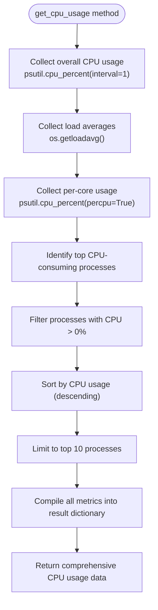
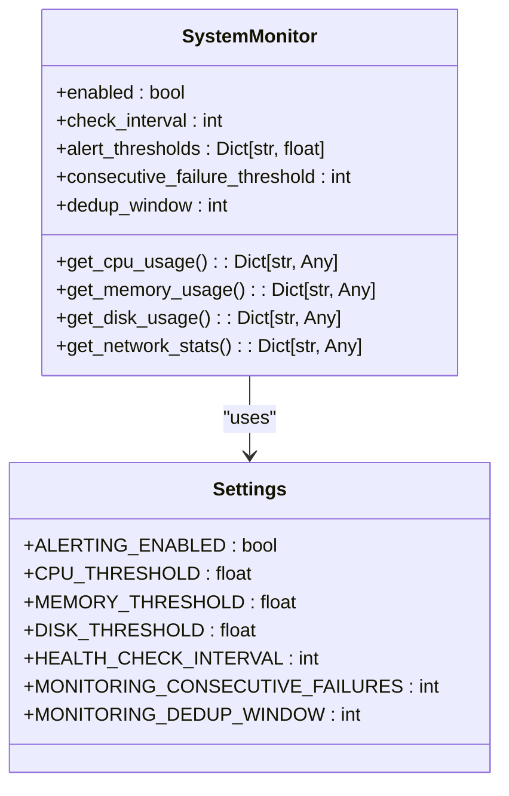
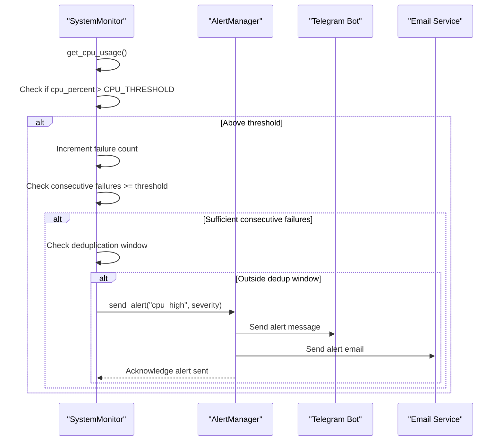
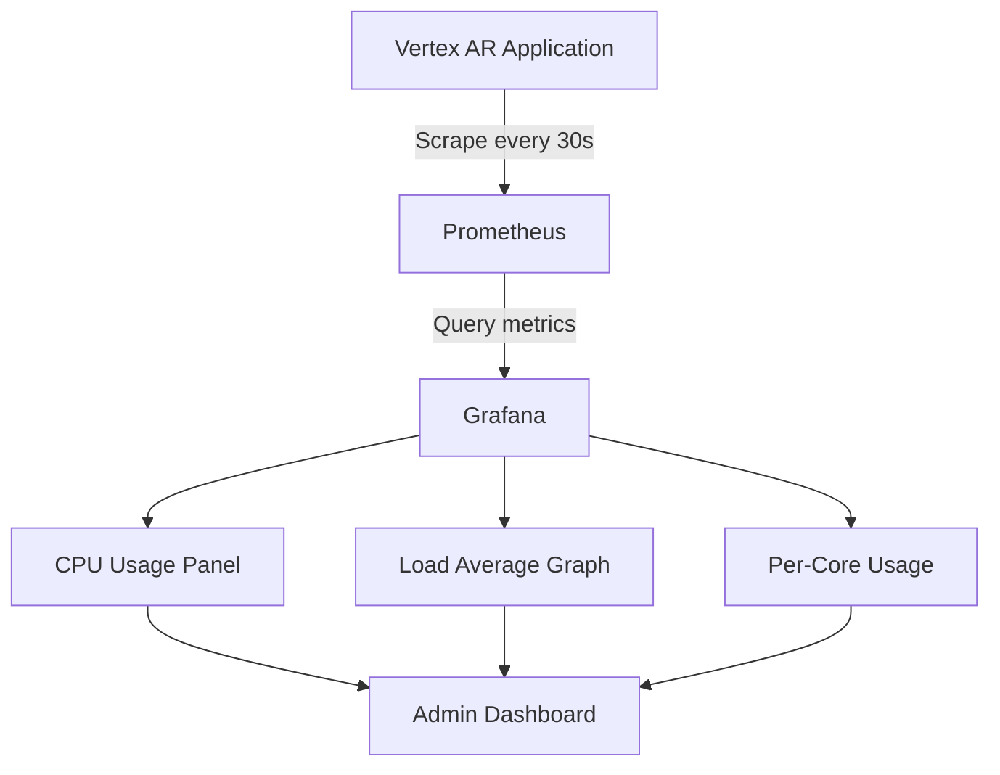

# CPU Monitoring

<cite>
**Referenced Files in This Document**   
- [monitoring.py](file://vertex-ar/app/monitoring.py)
- [config.py](file://vertex-ar/app/config.py)
- [prometheus_metrics.py](file://vertex-ar/app/prometheus_metrics.py)
- [grafana-dashboard.json](file://monitoring/grafana-dashboard.json)
- [prometheus.yml](file://monitoring/prometheus.yml)
- [docker-compose.monitoring.yml](file://docker-compose.monitoring.yml)
- [api/monitoring.py](file://vertex-ar/app/api/monitoring.py)
</cite>

## Table of Contents
1. [Introduction](#introduction)
2. [CPU Usage Collection](#cpu-usage-collection)
3. [Monitoring Configuration](#monitoring-configuration)
4. [Alerting System](#alerting-system)
5. [Prometheus Integration](#prometheus-integration)
6. [Grafana Visualization](#grafana-visualization)
7. [Configuration Examples](#configuration-examples)
8. [Troubleshooting and Optimization](#troubleshooting-and-optimization)

## Introduction
The Vertex AR application implements comprehensive CPU monitoring to ensure system stability and performance. This documentation details the implementation of CPU monitoring, including metric collection, threshold-based alerting, and integration with Prometheus and Grafana for visualization. The system collects detailed CPU usage metrics, including overall utilization, per-core usage, load averages, and top CPU-consuming processes, providing administrators with comprehensive insights into system performance.

## CPU Usage Collection

The CPU monitoring system is implemented in the `SystemMonitor` class within the monitoring module. The `get_cpu_usage()` method collects comprehensive CPU metrics using the psutil library, providing a detailed view of system CPU utilization.

The method returns a dictionary containing:
- Overall CPU usage percentage
- Load averages for 1, 5, and 15-minute intervals
- CPU count (physical and logical cores)
- Per-core CPU usage percentages
- Top 10 CPU-consuming processes with their PID, name, CPU percentage, and memory usage

For load averages, the system uses `os.getloadavg()` on Unix-like systems, with a fallback to zero values on Windows systems that don't support this function. The method also captures per-core usage by calling `psutil.cpu_percent(interval=0, percpu=True)`, which returns a list of CPU usage percentages for each core.

The top processes are identified by iterating through all running processes using `psutil.process_iter()`, filtering for processes with non-zero CPU usage, and sorting them by CPU percentage in descending order. This provides administrators with immediate visibility into which processes are consuming the most CPU resources.



**Diagram sources**
- [monitoring.py](file://vertex-ar/app/monitoring.py#L218-L269)

**Section sources**
- [monitoring.py](file://vertex-ar/app/monitoring.py#L218-L269)

## Monitoring Configuration

CPU monitoring behavior is controlled by several configuration settings defined in the application's settings system. These settings can be configured through environment variables or persisted in the database, allowing for dynamic adjustment without requiring application restarts.

The key configuration parameters include:
- `HEALTH_CHECK_INTERVAL`: Controls the frequency of CPU checks in seconds (default: 60)
- `CPU_THRESHOLD`: Defines the CPU usage percentage threshold that triggers alerts (default: 80.0%)
- `ALERTING_ENABLED`: Global toggle for enabling/disabling alerting (default: true)

These settings are loaded from environment variables in the `Settings` class and can be overridden through the database. The system supports dynamic reloading of settings, allowing administrators to adjust thresholds and check intervals through the admin interface without restarting the application.

The monitoring system also implements alert deduplication to prevent notification spam. It uses a consecutive failure threshold (default: 3) that requires multiple consecutive checks to exceed the threshold before triggering an alert. Additionally, a deduplication window (default: 300 seconds) prevents repeated alerts for the same issue within a specified time period.



**Diagram sources**
- [monitoring.py](file://vertex-ar/app/monitoring.py#L21-L150)
- [config.py](file://vertex-ar/app/config.py#L124-L137)

**Section sources**
- [monitoring.py](file://vertex-ar/app/monitoring.py#L24-L150)
- [config.py](file://vertex-ar/app/config.py#L124-L137)

## Alerting System

The alerting system is integrated with the CPU monitoring functionality to provide timely notifications when CPU usage exceeds configured thresholds. When the `get_cpu_usage()` method detects CPU utilization above the `CPU_THRESHOLD`, it triggers the alerting mechanism after validating the condition across multiple consecutive checks.

The alert severity is determined based on how much the CPU usage exceeds the threshold:
- **Warning**: CPU usage slightly above threshold
- **Medium**: CPU usage 5-15% above threshold
- **High**: CPU usage more than 15% above threshold or exceeding 95%

Alerts can be delivered through multiple channels, including Telegram and email, with routing priorities configured based on severity. The system prevents alert storms by implementing deduplication logic that tracks consecutive failures and enforces a cooldown period between alerts for the same issue.

The alerting system is designed to be resilient and reliable, with mechanisms to handle temporary network issues and ensure critical alerts are delivered. It also provides recovery notifications when CPU usage returns to normal levels after an alert condition has been resolved.



**Diagram sources**
- [monitoring.py](file://vertex-ar/app/monitoring.py#L152-L217)
- [alerting.py](file://vertex-ar/app/alerting.py)

**Section sources**
- [monitoring.py](file://vertex-ar/app/monitoring.py#L152-L217)

## Prometheus Integration

The CPU monitoring system integrates with Prometheus to expose metrics for external monitoring and alerting. The `PrometheusExporter` class in the `prometheus_metrics.py` module collects CPU metrics from the `SystemMonitor` and exposes them via the `/metrics` endpoint in Prometheus format.

Key CPU metrics exposed include:
- `vertex_ar_cpu_usage_percent{core}`: Per-core CPU usage percentage
- `vertex_ar_cpu_overall_percent`: Overall CPU usage percentage
- `vertex_ar_cpu_load_average{period}`: CPU load averages for 1, 5, and 15-minute intervals

The metrics are updated every 30 seconds by the `update_metrics()` method, which calls `get_cpu_usage()` to retrieve current CPU statistics and sets the corresponding Prometheus gauge values. The exporter uses a custom registry to organize metrics and prevent conflicts with other Prometheus clients.

The `/metrics` endpoint is accessible to authenticated admin users and returns all system metrics in the standard Prometheus text format, allowing Prometheus servers to scrape the data at regular intervals as configured in the `prometheus.yml` file.

```mermaid
flowchart LR
A[get_cpu_usage] --> B[PrometheusExporter]
B --> C[Update CPU metrics]
C --> D[Set gauge values]
D --> E[/metrics endpoint]
E --> F[Prometheus server]
F --> G[Grafana dashboard]
```

**Diagram sources**
- [prometheus_metrics.py](file://vertex-ar/app/prometheus_metrics.py#L75-L262)
- [monitoring.py](file://vertex-ar/app/monitoring.py#L218-L269)

**Section sources**
- [prometheus_metrics.py](file://vertex-ar/app/prometheus_metrics.py#L75-L262)

## Grafana Visualization

CPU metrics are visualized in Grafana using a pre-configured dashboard that provides comprehensive insights into system performance. The dashboard, defined in `grafana-dashboard.json`, includes multiple panels that display CPU usage in various formats.

Key visualization components include:
- **CPU Usage Stat Panel**: Displays the current overall CPU usage percentage with color-coded thresholds (green < 70%, yellow 70-90%, red > 90%)
- **CPU Load Average Graph**: Shows historical load averages for 1, 5, and 15-minute intervals
- **Per-Core Usage**: Visualizes CPU usage across all cores to identify imbalances

The dashboard is automatically provisioned when Grafana starts, thanks to the Docker compose configuration. It queries the Prometheus server, which scrapes metrics from the Vertex AR application's `/metrics` endpoint every 30 seconds as defined in `prometheus.yml`.

Administrators can use the dashboard to monitor CPU trends, identify performance bottlenecks, and correlate CPU usage with other system metrics such as memory, disk, and network usage. The dashboard refreshes every 30 seconds to provide near real-time visibility into system performance.



**Diagram sources**
- [grafana-dashboard.json](file://monitoring/grafana-dashboard.json)
- [prometheus.yml](file://monitoring/prometheus.yml)
- [docker-compose.monitoring.yml](file://docker-compose.monitoring.yml)

**Section sources**
- [grafana-dashboard.json](file://monitoring/grafana-dashboard.json)
- [prometheus.yml](file://monitoring/prometheus.yml)

## Configuration Examples

### Adjusting CPU Thresholds
To adjust the CPU threshold, modify the environment variable in your `.env` file:

```bash
CPU_THRESHOLD=85.0
```

Alternatively, use the API endpoint to update the threshold dynamically:

```json
PUT /monitoring/thresholds
{
  "cpu_threshold": 85.0
}
```

### Configuring Check Frequency
To change how often CPU checks are performed, update the `HEALTH_CHECK_INTERVAL` setting:

```bash
HEALTH_CHECK_INTERVAL=30
```

This reduces the check interval from the default 60 seconds to 30 seconds for more frequent monitoring.

### High-Load Scenario Handling
For environments that experience regular high CPU loads, configure alerting parameters to reduce noise:

```bash
CPU_THRESHOLD=90.0
MONITORING_CONSECUTIVE_FAILURES=5
MONITORING_DEDUP_WINDOW=600
```

This configuration raises the threshold to 90%, requires 5 consecutive failures before alerting, and extends the deduplication window to 10 minutes.

### Complete Monitoring Configuration
Example `.env` configuration for production:

```bash
# Monitoring settings
ALERTING_ENABLED=true
CPU_THRESHOLD=80.0
MEMORY_THRESHOLD=85.0
DISK_THRESHOLD=90.0
HEALTH_CHECK_INTERVAL=60
MONITORING_CONSECUTIVE_FAILURES=3
MONITORING_DEDUP_WINDOW=300
ALERT_RECOVERY_MINUTES=60
```

**Section sources**
- [config.py](file://vertex-ar/app/config.py#L124-L137)
- [api/monitoring.py](file://vertex-ar/app/api/monitoring.py#L367-L424)

## Troubleshooting and Optimization

### Sustained High CPU Usage
When experiencing sustained high CPU usage, follow these steps:

1. **Identify the cause**: Use the `/monitoring/metrics` endpoint to check which processes are consuming the most CPU
2. **Check for infinite loops**: Review application logs for any processes that might be stuck in loops
3. **Analyze thread usage**: High thread count can indicate inefficient code or thread leaks
4. **Monitor over time**: Use Grafana to analyze CPU trends and correlate with user activity

### Inefficient Processes
To address inefficient processes:

1. **Optimize database queries**: Slow queries can cause high CPU usage; use the slow query tracking feature
2. **Implement caching**: Use Redis to cache frequently accessed data and reduce CPU load
3. **Review algorithm complexity**: Ensure algorithms have appropriate time complexity for the data size
4. **Use asynchronous processing**: Offload intensive tasks to background workers

### Load Balancing Strategies
For high-traffic environments, consider these load balancing approaches:

1. **Horizontal scaling**: Deploy multiple application instances behind a load balancer
2. **Worker separation**: Separate CPU-intensive tasks to dedicated worker processes
3. **Resource limits**: Use container orchestration to set CPU limits and prevent any single instance from consuming excessive resources
4. **Auto-scaling**: Implement auto-scaling based on CPU usage metrics

### Optimization Recommendations
Based on real-world scenarios, implement these optimizations:

1. **Adjust Uvicorn workers**: Set `UVICORN_WORKERS` based on CPU count: `(2 * CPU_COUNT) + 1`
2. **Implement rate limiting**: Prevent API abuse that can cause CPU spikes
3. **Optimize image processing**: Use efficient libraries and consider offloading to specialized services
4. **Regular monitoring**: Establish baseline CPU usage patterns to quickly identify anomalies

**Section sources**
- [monitoring.py](file://vertex-ar/app/monitoring.py)
- [config.py](file://vertex-ar/app/config.py)
- [prometheus_metrics.py](file://vertex-ar/app/prometheus_metrics.py)