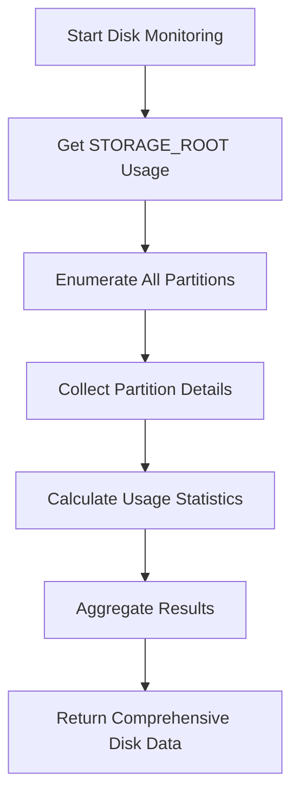
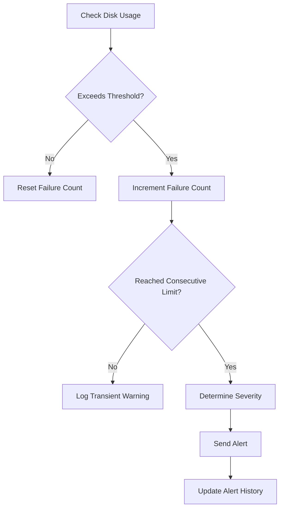
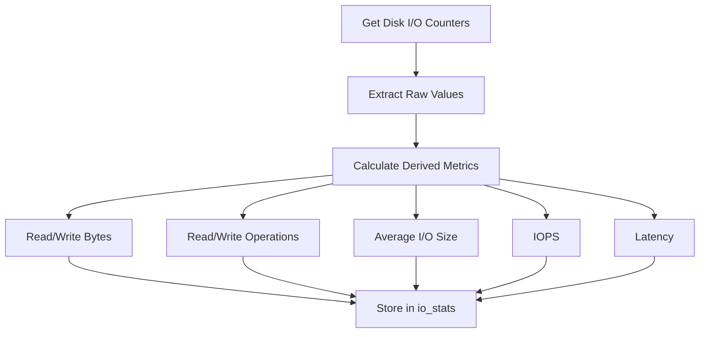
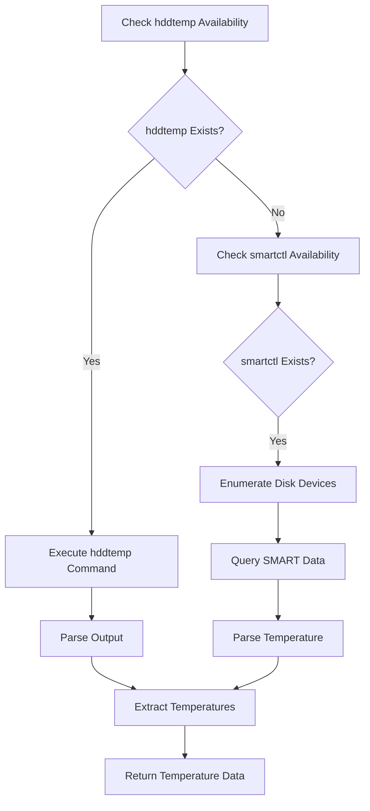

# Disk Monitoring

<cite>
**Referenced Files in This Document**   
- [vertex-ar/app/monitoring.py](file://vertex-ar/app/monitoring.py)
- [vertex-ar/app/prometheus_metrics.py](file://vertex-ar/app/prometheus_metrics.py)
- [vertex-ar/app/config.py](file://vertex-ar/app/config.py)
- [vertex-ar/app/api/monitoring.py](file://vertex-ar/app/api/monitoring.py)
</cite>

## Table of Contents
1. [Introduction](#introduction)
2. [Disk Usage Monitoring Implementation](#disk-usage-monitoring-implementation)
3. [Disk Threshold and Alerting System](#disk-threshold-and-alerting-system)
4. [Disk I/O Statistics Collection](#disk-io-statistics-collection)
5. [Disk Temperature Monitoring](#disk-temperature-monitoring)
6. [Prometheus Metrics Export](#prometheus-metrics-export)
7. [Grafana Integration](#grafana-integration)
8. [Configuration Examples](#configuration-examples)
9. [Disk Pressure Handling](#disk-pressure-handling)
10. [Troubleshooting Common Issues](#troubleshooting-common-issues)
11. [Optimization Recommendations](#optimization-recommendations)

## Introduction
The Vertex AR application implements a comprehensive disk monitoring system to track storage utilization, performance metrics, and potential issues. This documentation details the implementation of disk monitoring functionality, including the `get_disk_usage()` method, threshold-based alerting, I/O statistics collection, temperature monitoring, and integration with Prometheus and Grafana for visualization. The system is designed to proactively identify disk-related issues and provide administrators with actionable insights to maintain optimal system performance.

## Disk Usage Monitoring Implementation
The disk monitoring system in Vertex AR is implemented through the `get_disk_usage()` method in the `SystemMonitor` class. This method collects comprehensive disk usage information for both the designated `STORAGE_ROOT` directory and all system partitions. The implementation leverages the `psutil` library to gather disk usage statistics and partition information.

The monitoring system first retrieves basic disk usage for the `STORAGE_ROOT` directory specified in the application settings. It then enumerates all disk partitions on the system, collecting detailed information about each partition including device name, mount point, file system type, and usage statistics. For each accessible partition, the system calculates the percentage of disk usage, total capacity, used space, and free space in gigabytes.



**Diagram sources**
- [vertex-ar/app/monitoring.py](file://vertex-ar/app/monitoring.py#L343-L425)

**Section sources**
- [vertex-ar/app/monitoring.py](file://vertex-ar/app/monitoring.py#L343-L425)
- [vertex-ar/app/config.py](file://vertex-ar/app/config.py#L24)

## Disk Threshold and Alerting System
The disk monitoring system implements a threshold-based alerting mechanism that triggers notifications when disk usage exceeds predefined limits. The threshold value is configured through the `DISK_THRESHOLD` setting in the application configuration, with a default value of 90%. This threshold can be dynamically adjusted through the admin interface or configuration files.

When the disk usage exceeds the threshold, the system follows a multi-stage alerting process. First, it verifies the condition over multiple consecutive checks to prevent false positives from transient spikes. The system tracks failure counts for each metric and only escalates to a full alert after reaching the consecutive failure threshold, which is configurable via `MONITORING_CONSECUTIVE_FAILURES` (default: 3).

The alert severity is determined based on how much the disk usage exceeds the threshold. The system categorizes alerts into three severity levels: "warning" (slightly over threshold), "medium" (5-15% over threshold), and "high" (more than 15% over threshold or exceeding 95% utilization). This graduated severity system helps prioritize responses to disk pressure situations.



**Diagram sources**
- [vertex-ar/app/monitoring.py](file://vertex-ar/app/monitoring.py#L1444-L1477)
- [vertex-ar/app/monitoring.py](file://vertex-ar/app/monitoring.py#L193-L217)

**Section sources**
- [vertex-ar/app/monitoring.py](file://vertex-ar/app/monitoring.py#L1444-L1477)
- [vertex-ar/app/config.py](file://vertex-ar/app/config.py#L127)
- [vertex-ar/app/monitoring.py](file://vertex-ar/app/monitoring.py#L193-L217)

## Disk I/O Statistics Collection
The disk monitoring system collects comprehensive I/O statistics to provide insights into disk performance characteristics. These metrics include read/write bytes, operations count, latency, and throughput, which are essential for identifying performance bottlenecks and optimizing storage operations.

The I/O statistics are gathered using `psutil.disk_io_counters()` which provides raw counters for read and write operations. The system calculates derived metrics such as average I/O size by dividing total bytes by operation count, and IOPS (Input/Output Operations Per Second) as the sum of read and write operations. Latency is approximated by dividing cumulative I/O time by operation count, providing average read and write latency in milliseconds.

These metrics are updated periodically and stored in the `io_stats` dictionary within the disk usage response. The system captures absolute values from the counters, allowing Prometheus to calculate rates over time. This approach ensures accurate measurement of I/O performance trends and helps identify periods of high disk activity that may impact application responsiveness.



**Diagram sources**
- [vertex-ar/app/monitoring.py](file://vertex-ar/app/monitoring.py#L349-L401)

**Section sources**
- [vertex-ar/app/monitoring.py](file://vertex-ar/app/monitoring.py#L349-L401)

## Disk Temperature Monitoring
The Vertex AR application includes optional disk temperature monitoring for Linux systems using either `hddtemp` or `smartctl` utilities. This feature provides early warning of potential hardware issues related to disk overheating, which can lead to data corruption or drive failure.

The temperature monitoring is implemented in the `_get_disk_temperature()` method, which first checks for the presence of `hddtemp` in the system. If available, it executes `hddtemp` with wildcard device patterns to read temperature data from all accessible drives. The output is parsed to extract device names and corresponding temperature values in Celsius.

If `hddtemp` is not available, the system falls back to `smartctl`, which provides more detailed SMART (Self-Monitoring, Analysis, and Reporting Technology) data. The system enumerates available disk devices using `lsblk` and then queries each device's SMART attributes for temperature information. The parsing logic looks for temperature-related fields such as "Temperature_Celsius" and extracts the numeric value.

Temperature data is returned as a dictionary mapping device paths to temperature values, which is then exposed through the monitoring API and exported to Prometheus for visualization and alerting.



**Diagram sources**
- [vertex-ar/app/monitoring.py](file://vertex-ar/app/monitoring.py#L426-L483)

**Section sources**
- [vertex-ar/app/monitoring.py](file://vertex-ar/app/monitoring.py#L426-L483)

## Prometheus Metrics Export
The disk monitoring data is exposed to Prometheus through the `/metrics` endpoint, enabling long-term storage and visualization of disk usage trends. The `PrometheusExporter` class in `prometheus_metrics.py` handles the conversion of monitoring data into Prometheus-compatible metrics.

For disk usage, the system exports multiple gauge metrics with appropriate labels. The `vertex_ar_disk_usage_bytes` metric tracks used, free, and total space for each mount point, while `vertex_ar_disk_usage_percent` provides percentage utilization. The STORAGE_ROOT directory is exported with a dedicated label, and all system partitions are included with their mount points as labels (with special handling for the root partition).

Disk I/O metrics are exported as separate gauges for read and write operations, including bytes transferred, operation counts, and latency. These metrics allow Prometheus to calculate rates and provide insights into disk throughput and performance. Disk temperature, when available, is exported as `vertex_ar_disk_temperature_celsius` with the device path as a label.

The metrics are updated periodically by the `update_metrics()` method, which retrieves current monitoring data and sets the corresponding Prometheus gauge values. This ensures that Prometheus scrapes always receive up-to-date information about disk utilization and performance.

```mermaid
flowchart TD
A[Prometheus Scrape] --> B[update_metrics() Called]
B --> C[Get Current Disk Usage]
C --> D[Set Disk Usage Gauges]
D --> E[Set Disk Percent Gauges]
E --> F[Set I/O Metrics]
F --> G[Set Temperature Metrics]
G --> H[Generate Metrics Response]
H --> I[Return to Prometheus]
```

**Diagram sources**
- [vertex-ar/app/prometheus_metrics.py](file://vertex-ar/app/prometheus_metrics.py#L119-L147)
- [vertex-ar/app/monitoring.py](file://vertex-ar/app/monitoring.py#L343-L425)

**Section sources**
- [vertex-ar/app/prometheus_metrics.py](file://vertex-ar/app/prometheus_metrics.py#L119-L147)
- [vertex-ar/app/monitoring.py](file://vertex-ar/app/monitoring.py#L343-L425)

## Grafana Integration
The disk monitoring metrics are designed for integration with Grafana dashboards, providing visual representation of disk usage trends, I/O performance, and temperature data. The Prometheus metrics exported by the application can be used to create comprehensive dashboards that help administrators monitor storage health and identify potential issues.

Typical Grafana visualizations include time-series graphs of disk usage percentage for the STORAGE_ROOT directory and critical system partitions, allowing administrators to track capacity trends and forecast when additional storage may be needed. I/O performance dashboards display read/write throughput, IOPS, and latency over time, helping to identify performance bottlenecks and correlate disk activity with application behavior.

Temperature monitoring data can be visualized to track thermal conditions of storage devices, with alerting rules configured to notify administrators of overheating drives. The combination of usage, performance, and temperature metrics in Grafana provides a holistic view of storage system health, enabling proactive maintenance and optimization.

While specific dashboard configurations are not included in the codebase, the exported metrics are structured to support common monitoring patterns and best practices for storage monitoring in Grafana.

**Section sources**
- [vertex-ar/app/prometheus_metrics.py](file://vertex-ar/app/prometheus_metrics.py#L32-L36)
- [vertex-ar/app/prometheus_metrics.py](file://vertex-ar/app/prometheus_metrics.py#L119-L147)

## Configuration Examples
The disk monitoring system can be configured for different storage scenarios through environment variables and configuration files. The primary configuration is managed through the `.env` file or environment variables, with settings in `config.py` providing defaults.

For a basic configuration with default thresholds:
```env
DISK_THRESHOLD=90.0
MONITORING_CONSECUTIVE_FAILURES=3
MONITORING_DEDUP_WINDOW=300
```

For a high-availability production environment requiring more aggressive monitoring:
```env
DISK_THRESHOLD=80.0
MONITORING_CONSECUTIVE_FAILURES=2
MONITORING_DEDUP_WINDOW=180
MONITORING_TRACEMALLOC_ENABLED=true
MONITORING_TRACEMALLOC_THRESHOLD_MB=50
```

For systems with multiple storage devices requiring detailed monitoring:
```env
DISK_THRESHOLD=85.0
MONITORING_PROCESS_HISTORY_SIZE=200
MONITORING_SLOW_QUERY_THRESHOLD_MS=50
MONITORING_SLOW_ENDPOINT_THRESHOLD_MS=500
```

The configuration can also be adjusted through the admin API using the `/monitoring/thresholds` endpoint, allowing dynamic updates without restarting the application. This flexibility enables administrators to tailor the monitoring system to their specific storage architecture and operational requirements.

**Section sources**
- [vertex-ar/app/config.py](file://vertex-ar/app/config.py#L127-L137)
- [vertex-ar/app/api/monitoring.py](file://vertex-ar/app/api/monitoring.py#L367-L424)

## Disk Pressure Handling
The system implements several mechanisms to handle disk pressure situations and prevent service disruption. When disk usage approaches critical levels, the monitoring system triggers alerts and can initiate automated responses through integrated workflows.

The alerting system follows a graduated approach, starting with warnings when usage exceeds the threshold, escalating to higher severity alerts as utilization increases. This allows administrators time to respond before the situation becomes critical. The system also tracks consecutive failures to avoid alerting on transient spikes, reducing alert fatigue.

In addition to notifications, the system can be integrated with automated cleanup scripts or storage expansion workflows. For example, when disk usage exceeds 95%, a webhook can be triggered to initiate log rotation, temporary file cleanup, or storage provisioning in cloud environments.

The monitoring system also provides detailed diagnostics through the `/monitoring/hotspots` endpoint, which can help identify processes or services contributing to high disk usage. This information is valuable for troubleshooting and optimizing storage utilization patterns.

**Section sources**
- [vertex-ar/app/monitoring.py](file://vertex-ar/app/monitoring.py#L1444-L1477)
- [vertex-ar/app/monitoring.py](file://vertex-ar/app/monitoring.py#L616-L660)

## Troubleshooting Common Issues
The disk monitoring system helps identify and troubleshoot several common storage-related issues:

**Disk Space Exhaustion**: When disk usage reaches critical levels, check for large files or directories in the STORAGE_ROOT and system partitions. Common culprits include log files, temporary files, and cached data. Implement regular cleanup procedures and consider expanding storage capacity.

**High I/O Wait Times**: Elevated I/O latency may indicate disk performance bottlenecks. Check the IOPS and throughput metrics to identify periods of high activity. Consider optimizing application I/O patterns, upgrading to faster storage, or distributing load across multiple drives.

**Slow Storage Performance**: Consistently high read/write latency can impact application responsiveness. Analyze the average I/O size metrics to determine if the workload consists of many small operations (which are less efficient) or large sequential operations. Optimize application behavior or consider storage tiering.

**Temperature-Related Issues**: High disk temperatures can lead to performance throttling or hardware failure. Ensure proper system cooling and airflow. If temperatures remain high, consider adding additional cooling or replacing drives with models that have better thermal characteristics.

The monitoring API endpoints provide detailed diagnostics that can be used to investigate these issues, including historical trends, process-level resource usage, and slow operation tracking.

**Section sources**
- [vertex-ar/app/api/monitoring.py](file://vertex-ar/app/api/monitoring.py#L616-L660)
- [vertex-ar/app/monitoring.py](file://vertex-ar/app/monitoring.py#L783-L800)

## Optimization Recommendations
Based on the disk monitoring implementation and common performance patterns, the following optimization recommendations are suggested:

1. **Regular Maintenance**: Implement scheduled tasks to clean up temporary files, rotate logs, and remove unused data to prevent uncontrolled disk growth.

2. **Storage Tiering**: Consider using different storage types for different data categories, with high-performance storage for active data and cost-effective storage for archives.

3. **I/O Pattern Optimization**: Analyze application I/O patterns and optimize for larger, sequential operations rather than many small random operations, which are more efficient for most storage systems.

4. **Monitoring Configuration**: Adjust monitoring thresholds based on your specific environment and workload patterns to balance sensitivity with alert fatigue.

5. **Capacity Planning**: Use historical usage trends to forecast storage needs and plan capacity expansions before reaching critical levels.

6. **Temperature Management**: Monitor disk temperatures regularly and ensure adequate cooling, especially in high-density server environments.

7. **Backup Strategy**: Ensure that backup operations are scheduled during off-peak hours to minimize impact on production I/O performance.

These recommendations, combined with the comprehensive monitoring provided by the Vertex AR system, can help maintain optimal storage performance and reliability.

**Section sources**
- [vertex-ar/app/monitoring.py](file://vertex-ar/app/monitoring.py#L343-L425)
- [vertex-ar/app/prometheus_metrics.py](file://vertex-ar/app/prometheus_metrics.py#L119-L147)