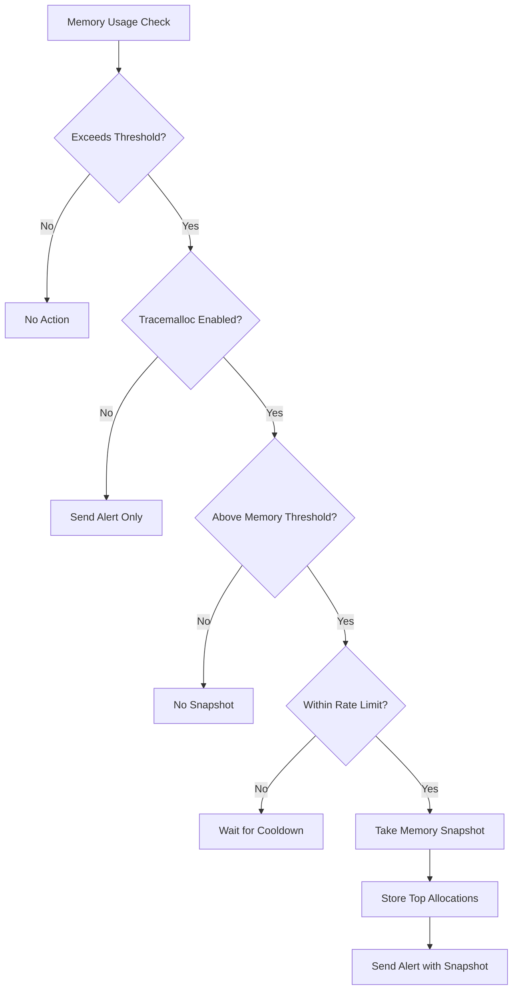
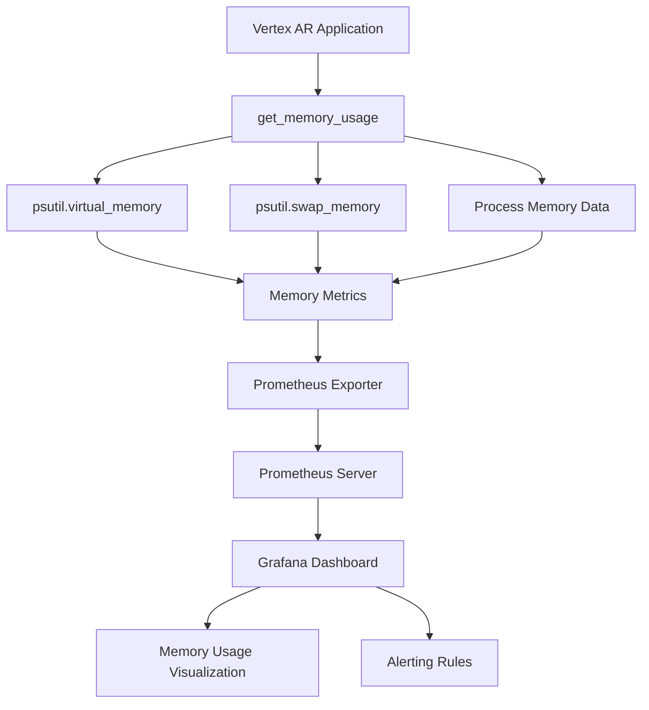

# Memory Monitoring

<cite>
**Referenced Files in This Document**   
- [monitoring.py](file://vertex-ar/app/monitoring.py#L271-L341)
- [config.py](file://vertex-ar/app/config.py#L126-L127)
- [prometheus_metrics.py](file://vertex-ar/app/prometheus_metrics.py#L30-L31)
- [api/monitoring.py](file://vertex-ar/app/api/monitoring.py#L664-L710)
- [monitoring/alert_rules.yml](file://monitoring/alert_rules.yml#L161-L169)
- [monitoring/grafana-dashboard.json](file://monitoring/grafana-dashboard.json#L32-L49)
</cite>

## Table of Contents
1. [Memory Monitoring Implementation](#memory-monitoring-implementation)
2. [Memory Threshold Configuration](#memory-threshold-configuration)
3. [Deep Diagnostics and Memory Leak Detection](#deep-diagnostics-and-memory-leak-detection)
4. [Prometheus and Grafana Integration](#prometheus-and-grafana-integration)
5. [Configuration Examples and Troubleshooting](#configuration-examples-and-troubleshooting)

## Memory Monitoring Implementation

The Vertex AR application implements comprehensive memory monitoring through the `get_memory_usage()` method in the `SystemMonitor` class. This method collects both virtual and swap memory metrics using the `psutil` library, providing detailed insights into system memory utilization. The implementation captures key metrics including total, used, available, and free memory, which are essential for monitoring system health and performance.

The `get_memory_usage()` method retrieves virtual memory information via `psutil.virtual_memory()` and swap memory details through `psutil.swap_memory()`. These metrics are returned in a structured format with values converted to gigabytes for easier interpretation. The method also identifies top memory-consuming processes by iterating through active processes and collecting their memory usage statistics. Only processes consuming more than 1% of system memory are included in the results, which are then sorted by memory percentage and limited to the top 10 processes.

Memory metrics are collected with comprehensive details including active, inactive, buffers, cached, shared, and slab memory components. This detailed breakdown allows administrators to understand how memory is being utilized across different system components. The method returns a dictionary containing virtual memory statistics, swap memory statistics, and the list of top memory-consuming processes, providing a complete picture of the system's memory state.

**Section sources**
- [monitoring.py](file://vertex-ar/app/monitoring.py#L271-L341)

## Memory Threshold Configuration

The memory monitoring system uses a configurable threshold to trigger alerts when memory usage exceeds defined limits. The default memory threshold is set to 85% in the application configuration, but this value can be adjusted based on specific requirements. When memory usage surpasses the threshold, the system initiates an alerting process that considers consecutive failures before escalating to a full alert.

The alerting mechanism includes severity levels that are determined by how much the memory usage exceeds the threshold. If memory usage is between 5-15% over the threshold, a "medium" severity alert is triggered. When usage exceeds the threshold by more than 15% or reaches above 95% of total capacity, a "high" severity alert is generated. This graduated response allows for appropriate prioritization of memory-related issues based on their severity.

The system also monitors swap memory usage, providing additional context when generating alerts. If swap usage exceeds 50%, this information is included in the alert message, indicating potential memory pressure that could impact system performance. The monitoring system tracks failure counts for memory alerts and only escalates to notification after a configurable number of consecutive failures, helping to prevent alert fatigue from transient memory spikes.

**Section sources**
- [config.py](file://vertex-ar/app/config.py#L126-L127)
- [monitoring.py](file://vertex-ar/app/monitoring.py#L1412-L1437)

## Deep Diagnostics and Memory Leak Detection

The Vertex AR monitoring system includes advanced diagnostics features for identifying memory leaks and tracking memory-consuming processes. When the `MONITORING_TRACEMALLOC_ENABLED` setting is active, the system can capture detailed memory allocation snapshots using Python's `tracemalloc` module. This feature is particularly valuable for detecting memory leaks in long-running applications.

Tracemalloc integration is configured with several parameters that control its behavior. The `MONITORING_TRACEMALLOC_THRESHOLD_MB` setting defines the memory usage threshold (default 100MB) that must be exceeded before a snapshot is captured. This prevents unnecessary overhead during normal operation. The system also implements rate limiting to ensure snapshots are not taken too frequently, with a minimum interval of one minute between captures.

When a memory snapshot is taken, the system records the current memory usage and the top memory allocations. Each snapshot includes file locations, line numbers, and the amount of memory allocated, providing developers with precise information to identify potential memory leaks. The system maintains a history of up to 20 snapshots, allowing for comparison over time to identify growing memory allocations.

The monitoring system also tracks process memory usage over time, maintaining a history of CPU and RSS (Resident Set Size) values for monitored processes. This historical data enables trend analysis to identify processes with steadily increasing memory consumption, which may indicate memory leaks or inefficient memory management.



**Diagram sources**
- [monitoring.py](file://vertex-ar/app/monitoring.py#L719-L781)
- [api/monitoring.py](file://vertex-ar/app/api/monitoring.py#L664-L710)

**Section sources**
- [monitoring.py](file://vertex-ar/app/monitoring.py#L719-L781)
- [api/monitoring.py](file://vertex-ar/app/api/monitoring.py#L664-L710)

## Prometheus and Grafana Integration

Memory metrics are exposed to Prometheus through the `/metrics` endpoint, enabling comprehensive monitoring and visualization in Grafana. The Prometheus exporter converts system memory metrics into the appropriate format for collection by Prometheus. Key metrics include `vertex_ar_memory_usage_bytes` for memory usage in bytes and `vertex_ar_memory_usage_percent` for percentage-based memory utilization.

The system exports separate metrics for virtual memory usage (used, available, total) and swap memory usage (used, total). These metrics are labeled appropriately to distinguish between different memory types, allowing for detailed queries and alerting in Prometheus. The process-specific memory usage is also exported as `vertex_ar_process_memory_bytes` with a 'type' label of 'rss', enabling monitoring of the application's own memory consumption.

In Grafana, these metrics are visualized through a dedicated dashboard that provides real-time monitoring of memory usage. The dashboard includes a memory usage panel that displays the current virtual memory utilization as a percentage, with color-coded thresholds to indicate warning (80%) and critical (95%) levels. This visualization allows administrators to quickly assess memory pressure and identify potential issues.



**Diagram sources**
- [prometheus_metrics.py](file://vertex-ar/app/prometheus_metrics.py#L30-L31)
- [monitoring/grafana-dashboard.json](file://monitoring/grafana-dashboard.json#L32-L49)

**Section sources**
- [prometheus_metrics.py](file://vertex-ar/app/prometheus_metrics.py#L30-L31)
- [monitoring/grafana-dashboard.json](file://monitoring/grafana-dashboard.json#L32-L49)

## Configuration Examples and Troubleshooting

The memory monitoring system can be configured through environment variables to suit different deployment scenarios. For production environments, conservative thresholds are recommended to ensure system stability:

```yaml
# Production configuration
MEMORY_THRESHOLD=85.0
MONITORING_TRACEMALLOC_ENABLED=false
MONITORING_PROCESS_HISTORY_SIZE=100
```

For development and debugging purposes, more aggressive monitoring can be enabled:

```yaml
# Development/Debugging configuration
MEMORY_THRESHOLD=70.0
MONITORING_TRACEMALLOC_ENABLED=true
MONITORING_TRACEMALLOC_THRESHOLD_MB=50.0
MONITORING_SLOW_QUERY_THRESHOLD_MS=50
```

When troubleshooting memory issues, administrators should first check for processes with high RSS growth, which may indicate memory leaks. High swap usage is another critical indicator of memory pressure, suggesting that the system is running low on physical memory. The system provides several diagnostic endpoints to assist with troubleshooting:

- `/api/monitoring/memory-leaks` - Provides access to tracemalloc snapshots when enabled
- `/api/monitoring/hotspots` - Shows detailed process memory trends and slow operations
- `/api/monitoring/detailed-metrics` - Returns comprehensive system metrics including memory usage

Common issues and their solutions include:

1. **Memory Leaks**: Enable tracemalloc temporarily and analyze the top allocations in the snapshots. Look for objects that continue to grow over time and identify the code responsible for their creation.

2. **High Swap Usage**: This indicates insufficient physical memory. Solutions include adding more RAM, optimizing application memory usage, or reducing the application load.

3. **RSS Growth in Processes**: Monitor the process trends to identify which processes are consuming increasing amounts of memory. This may require code optimization or restarting the process on a schedule.

The system's alerting rules include specific checks for excessive memory usage, such as the `ProcessHighMemoryUsage` alert which triggers when the process RSS exceeds 2GB. These alerts help administrators proactively address memory issues before they impact system performance.

**Section sources**
- [config.py](file://vertex-ar/app/config.py#L126-L127)
- [monitoring/alert_rules.yml](file://monitoring/alert_rules.yml#L161-L169)
- [api/monitoring.py](file://vertex-ar/app/api/monitoring.py#L664-L710)