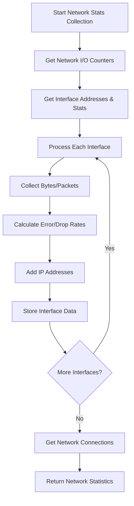
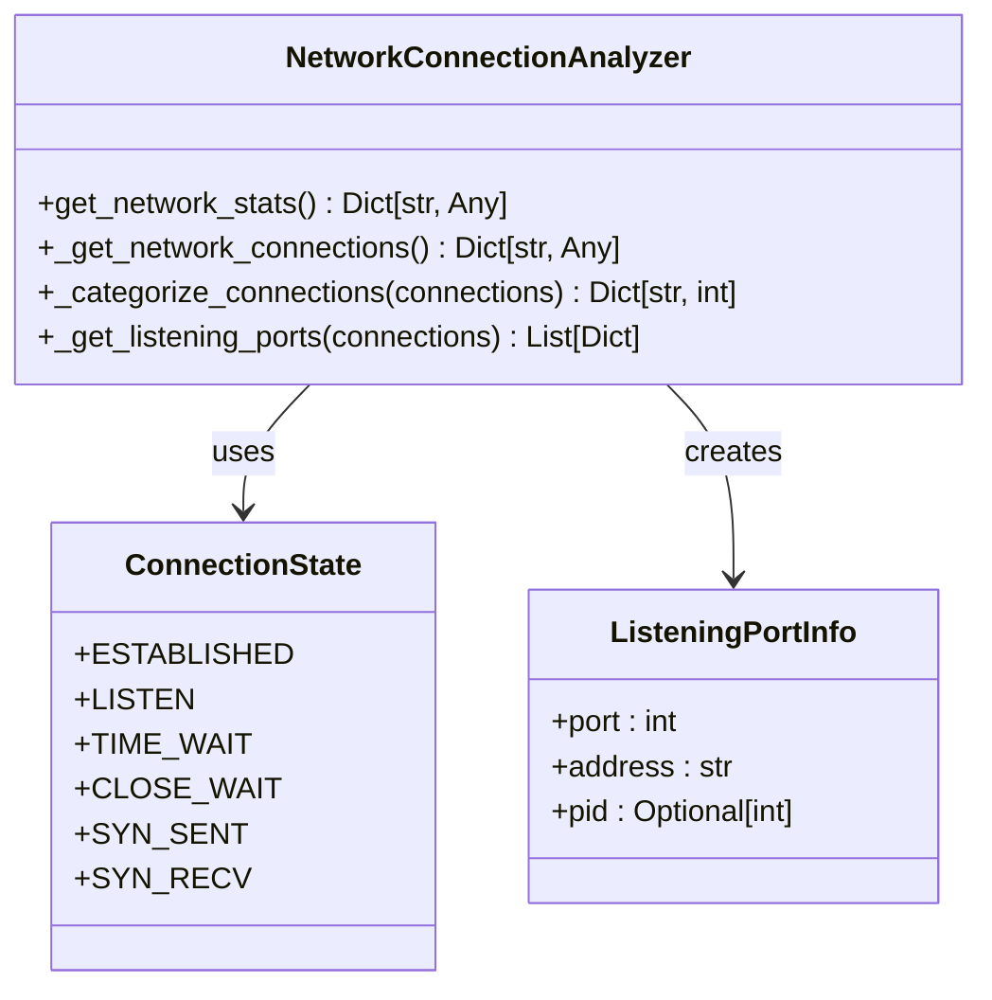
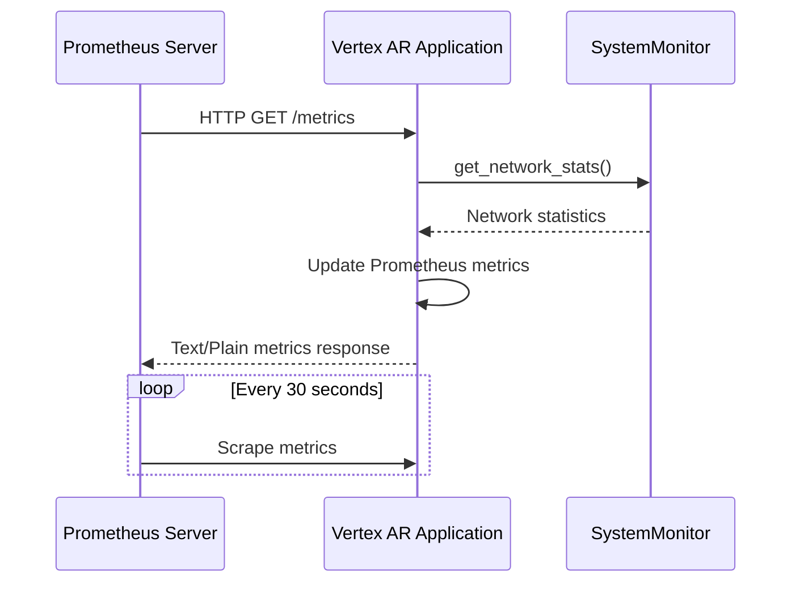
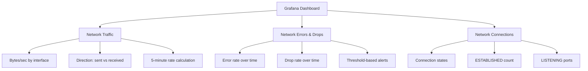
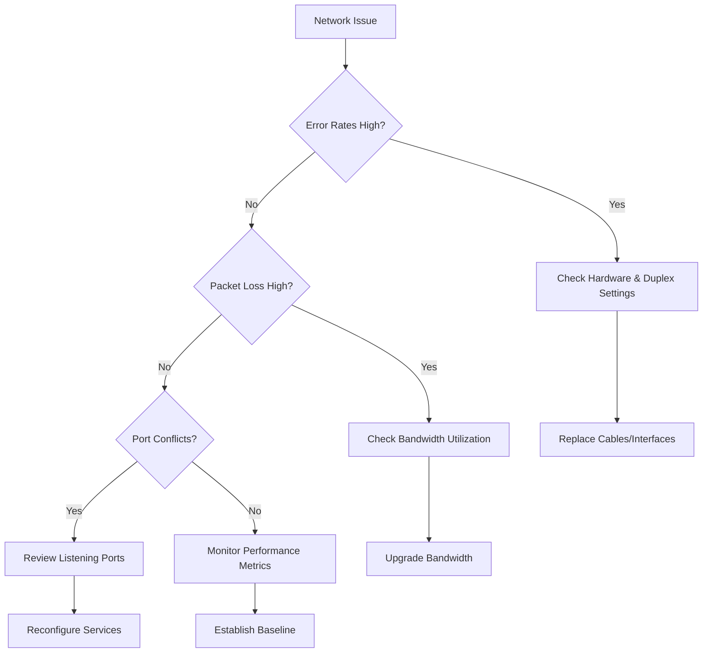

# Network Monitoring

<cite>
**Referenced Files in This Document**   
- [monitoring.py](file://vertex-ar/app/monitoring.py#L485-L585)
- [prometheus_metrics.py](file://vertex-ar/app/prometheus_metrics.py#L38-L43)
- [prometheus.yml](file://monitoring/prometheus.yml#L16-L22)
- [grafana-dashboard.json](file://monitoring/grafana-dashboard.json#L149-L159)
- [api/monitoring.py](file://vertex-ar/app/api/monitoring.py#L140-L154)
</cite>

## Table of Contents
1. [Network Interface Statistics Collection](#network-interface-statistics-collection)
2. [Network Connection Analysis](#network-connection-analysis)
3. [Network Interface Details](#network-interface-details)
4. [Prometheus Integration and Metrics Exposure](#prometheus-integration-and-metrics-exposure)
5. [Grafana Visualization](#grafana-visualization)
6. [Common Network Issues and Troubleshooting](#common-network-issues-and-troubleshooting)
7. [Configuration and Optimization](#configuration-and-optimization)

## Network Interface Statistics Collection

The Vertex AR application implements comprehensive network monitoring through the `get_network_stats()` method in the `SystemMonitor` class. This method leverages the `psutil` library to collect detailed network interface statistics, providing insights into network performance and potential issues.

The implementation collects several key metrics for each network interface, including bytes/packets sent and received, error rates, and drop rates. For each interface, the method gathers:

- **Transmission metrics**: Bytes and packets sent and received
- **Error metrics**: Input and output errors (errin, errout)
- **Drop metrics**: Incoming and outgoing packet drops (dropin, dropout)
- **Interface status**: Whether the interface is up or down
- **Performance metrics**: Speed (in Mbps), MTU (Maximum Transmission Unit), and duplex mode

The method calculates error and drop rates as percentages based on the total packets received and sent. These rates are crucial for identifying network quality issues. For example, a high error rate might indicate hardware problems or network congestion, while high drop rates could suggest buffer overflows or bandwidth saturation.

The implementation also collects overall network statistics that aggregate data across all interfaces, providing a system-wide view of network activity. This includes total bytes and packets transferred, as well as aggregated error and drop rates.



**Section sources**
- [monitoring.py](file://vertex-ar/app/monitoring.py#L485-L585)

## Network Connection Analysis

The network monitoring system includes detailed analysis of network connections by state and listening ports. This functionality is implemented through the `_get_network_connections()` method, which provides insights into the application's network connectivity and potential security issues.

The method collects and categorizes network connections by their state, including:
- **ESTABLISHED**: Active connections with data transfer
- **LISTEN**: Ports accepting incoming connections
- **TIME_WAIT**: Connections waiting after closure
- **CLOSE_WAIT**: Connections waiting for closure
- **SYN_SENT**: Connections attempting to establish
- **SYN_RECV**: Connections receiving establishment requests

For each connection state, the system maintains a count, allowing administrators to monitor connection patterns and identify potential issues. For example, an unusually high number of connections in TIME_WAIT state might indicate connection pooling issues, while excessive SYN_SENT connections could suggest connectivity problems.

A critical aspect of this analysis is the tracking of listening ports, which helps identify services exposed to the network and potential security vulnerabilities. The method collects information about each listening port, including:
- Port number
- Bound IP address
- Process ID (PID) of the listening process

This information is essential for detecting port conflicts, identifying unauthorized services, and ensuring that only expected ports are exposed.



**Section sources**
- [monitoring.py](file://vertex-ar/app/monitoring.py#L580-L619)

## Network Interface Details

The network monitoring system collects comprehensive details about network interfaces beyond basic statistics. This includes IP addressing information, interface configuration, and performance characteristics.

For each network interface, the system gathers IP address information, including:
- **IPv4 and IPv6 addresses**: Both primary and secondary addresses
- **Subnet masks**: Network configuration details
- **Broadcast addresses**: For IPv4 interfaces

This information is collected using `psutil.net_if_addrs()` and filtered to include only internet protocol addresses (AF_INET and AF_INET6). The implementation ensures that only relevant network layer information is collected, excluding link-layer addresses.

The system also collects interface configuration details:
- **MTU (Maximum Transmission Unit)**: Maximum packet size the interface can transmit
- **Speed**: Interface speed in Mbps
- **Duplex mode**: Half or full duplex operation
- **Interface status**: Whether the interface is currently active

These details are essential for diagnosing network performance issues. For example, a mismatch in duplex mode between connected devices can cause significant performance degradation and packet loss. Similarly, MTU mismatches can lead to packet fragmentation and reduced throughput.

```mermaid
flowchart TD
A[Network Interface] --> B[Physical Properties]
A --> C[Addressing Information]
A --> D[Performance Metrics]
B --> B1[MTU Size]
B --> B2[Duplex Mode]
B --> B3[Speed (Mbps)]
B --> B4[Status (Up/Down)]
C --> C1[IPv4 Addresses]
C --> C2[IPv6 Addresses]
C --> C3[Subnet Masks]
C --> C4[Broadcast Addresses]
D --> D1[Bytes Sent/Received]
D --> D2[Packets Sent/Received]
D --> D3[Error Rates]
D --> D4[Drop Rates]
```

**Section sources**
- [monitoring.py](file://vertex-ar/app/monitoring.py#L497-L548)

## Prometheus Integration and Metrics Exposure

The Vertex AR application integrates with Prometheus for exposing network metrics via the `/metrics` endpoint. This integration enables long-term monitoring, alerting, and visualization of network performance data.

The integration is implemented through the `PrometheusExporter` class in `prometheus_metrics.py`, which defines several network-related metrics:

- **Network bytes**: `vertex_ar_network_bytes_total` with labels for interface and direction
- **Network packets**: `vertex_ar_network_packets_total` with labels for interface and direction
- **Network errors**: `vertex_ar_network_errors_total` with labels for interface and direction
- **Network drops**: `vertex_ar_network_drops_total` with labels for interface and direction
- **Network connections**: `vertex_ar_network_connections` with labels for connection status

The `/metrics` endpoint is exposed through the FastAPI application and returns metrics in the Prometheus text format. The implementation in `main.py` overrides the default Prometheus metrics endpoint to include the comprehensive metrics from the custom exporter.

The Prometheus configuration in `prometheus.yml` is set up to scrape the application metrics every 30 seconds:

```yaml
scrape_configs:
  - job_name: 'vertex-ar'
    static_configs:
      - targets: ['localhost:8000']
    metrics_path: '/metrics'
    scrape_interval: 30s
    scrape_timeout: 10s
```

When a request is made to the `/metrics` endpoint, the system updates all metrics with current data from the `SystemMonitor`. For network metrics, this involves:
1. Retrieving current network statistics from `system_monitor.get_network_stats()`
2. Updating the Prometheus gauge values for each interface and direction
3. Calculating rates using the `rate()` function in Prometheus queries
4. Exposing the metrics in the proper text format

This integration allows for sophisticated alerting based on network metrics. For example, alerts can be configured to trigger when error rates exceed a threshold or when bandwidth utilization approaches capacity.



**Section sources**
- [prometheus_metrics.py](file://vertex-ar/app/prometheus_metrics.py#L38-L43)
- [prometheus.yml](file://monitoring/prometheus.yml#L16-L22)
- [api/monitoring.py](file://vertex-ar/app/api/monitoring.py#L140-L154)

## Grafana Visualization

Network metrics are visualized in Grafana using a dedicated dashboard that provides comprehensive insights into network performance. The `grafana-dashboard.json` file defines a dashboard with multiple panels specifically designed to monitor network activity.

Key network visualization panels include:

- **Network Traffic**: A graph showing the rate of bytes transferred per second for each interface and direction, using the `rate(vertex_ar_network_bytes_total[5m])` query
- **Network Errors & Drops**: A combined graph displaying the rate of network errors and packet drops, helping identify connectivity issues
- **Network Connections**: A graph showing the count of connections by status (ESTABLISHED, LISTEN, etc.), useful for monitoring connection patterns

The Network Traffic panel uses the following Prometheus query to calculate transfer rates:
```
rate(vertex_ar_network_bytes_total[5m])
```

This query calculates the per-second average rate of bytes transferred over a 5-minute window, smoothing out short-term fluctuations while maintaining responsiveness to actual changes in network utilization.

The Network Errors & Drops panel uses separate queries for errors and drops:
```
rate(vertex_ar_network_errors_total[5m])
rate(vertex_ar_network_drops_total[5m])
```

These queries help distinguish between different types of network issues. Errors typically indicate problems at the data link layer (e.g., CRC errors, framing errors), while drops suggest resource constraints (e.g., buffer overflows).

The dashboard also includes threshold-based coloring to quickly identify problematic conditions:
- Green: Normal operation
- Yellow: Warning conditions
- Red: Critical issues

This visualization approach enables administrators to quickly assess network health, identify trends, and detect anomalies that might indicate underlying problems.



**Section sources**
- [grafana-dashboard.json](file://monitoring/grafana-dashboard.json#L149-L159)

## Common Network Issues and Troubleshooting

The network monitoring system is designed to help diagnose and troubleshoot common network issues. The collected metrics provide valuable insights for identifying and resolving connectivity problems.

### High Error Rates
High network error rates can indicate various issues:
- **Hardware problems**: Faulty network cables, connectors, or interface cards
- **Duplex mismatches**: When connected devices operate in different duplex modes
- **Electrical interference**: In environments with high electromagnetic interference

Diagnostic procedures:
1. Check interface statistics for increasing error counters
2. Verify duplex and speed settings on both ends of the connection
3. Inspect physical cabling and connections
4. Monitor error rates over time to identify patterns

### Packet Loss
Packet loss can be caused by:
- **Bandwidth saturation**: Network utilization approaching capacity
- **Buffer overflows**: Insufficient buffer space in network devices
- **Congestion**: High traffic volumes causing packet drops

Diagnostic procedures:
1. Monitor drop rates in conjunction with bandwidth utilization
2. Check for correlation between high utilization and increased drops
3. Examine queue lengths and buffer usage
4. Consider upgrading bandwidth or optimizing traffic patterns

### Port Conflicts
Port conflicts occur when multiple services attempt to bind to the same port. The monitoring system helps identify these issues by:
- Listing all listening ports and their associated processes
- Detecting unexpected services on standard ports
- Identifying port exhaustion in high-connection scenarios

Diagnostic procedures:
1. Review the listening ports report for unexpected entries
2. Verify that services are configured to use appropriate ports
3. Check for applications binding to overly broad address ranges
4. Ensure proper service startup order to prevent race conditions

### Bandwidth Saturation
Bandwidth saturation occurs when network demand exceeds available capacity. Indicators include:
- Consistently high bandwidth utilization (>80%)
- Increasing packet drop rates
- Degraded application performance
- High latency

Diagnostic procedures:
1. Monitor bandwidth utilization trends over time
2. Identify peak usage periods and contributing applications
3. Implement traffic shaping or prioritization
4. Consider bandwidth upgrades or optimization strategies



**Section sources**
- [monitoring.py](file://vertex-ar/app/monitoring.py#L485-L585)
- [prometheus_metrics.py](file://vertex-ar/app/prometheus_metrics.py#L38-L43)

## Configuration and Optimization

The network monitoring system can be configured and optimized through environment variables and runtime settings. Proper configuration ensures effective monitoring while minimizing performance overhead.

Key configuration options include:
- **Scrape interval**: Controls how frequently Prometheus collects metrics
- **Monitoring interval**: Determines how often system health checks occur
- **Alert thresholds**: Sets the levels at which alerts are triggered
- **Retention policies**: Controls how long metrics data is stored

Optimization techniques:
- **Adjust scrape intervals**: Balance between data granularity and system load
- **Filter unnecessary metrics**: Reduce the volume of collected data
- **Use appropriate recording rules**: Pre-calculate frequently used queries
- **Implement proper retention policies**: Manage storage requirements

The system also supports dynamic configuration updates, allowing settings to be modified without restarting the application. This flexibility enables administrators to fine-tune monitoring parameters based on observed network behavior and performance requirements.

**Section sources**
- [monitoring.py](file://vertex-ar/app/monitoring.py#L485-L585)
- [prometheus.yml](file://monitoring/prometheus.yml#L16-L22)