# System Monitoring

<cite>
**Referenced Files in This Document**   
- [vertex-ar\app\monitoring.py](file://vertex-ar/app/monitoring.py)
- [vertex-ar\app\prometheus_metrics.py](file://vertex-ar/app/prometheus_metrics.py)
- [vertex-ar\app\api\monitoring.py](file://vertex-ar/app/api/monitoring.py)
- [vertex-ar\app\config.py](file://vertex-ar/app/config.py)
- [vertex-ar\app\database.py](file://vertex-ar/app/database.py)
- [docs\monitoring\persistent-settings.md](file://docs/monitoring/persistent-settings.md)
</cite>

## Table of Contents
1. [Introduction](#introduction)
2. [SystemMonitor Class Architecture](#systemmonitor-class-architecture)
3. [Metrics Collection Implementation](#metrics-collection-implementation)
4. [Threshold-Based Alerting System](#threshold-based-alerting-system)
5. [Prometheus Integration](#prometheus-integration)
6. [Configuration Management](#configuration-management)
7. [API Endpoints](#api-endpoints)
8. [Troubleshooting Guide](#troubleshooting-guide)
9. [Performance Analysis](#performance-analysis)
10. [Configuration Examples](#configuration-examples)

## Introduction

The Vertex AR application features a comprehensive system monitoring subsystem designed to track critical system resources including CPU, memory, disk, and network usage. This monitoring system is built around the `SystemMonitor` class, which leverages the `psutil` library to collect system metrics at configurable intervals. The system implements threshold-based alerting for critical resources and integrates with Prometheus for metrics exposure. Monitoring settings are persisted in the database, ensuring configuration survives application restarts. The subsystem provides both real-time monitoring and historical trend analysis, enabling administrators to maintain optimal system performance and quickly respond to potential issues.

**Section sources**
- [vertex-ar\app\monitoring.py](file://vertex-ar/app/monitoring.py#L21-L80)
- [vertex-ar\app\config.py](file://vertex-ar/app/config.py#L124-L137)

## SystemMonitor Class Architecture

The `SystemMonitor` class serves as the core component of the monitoring subsystem, responsible for collecting system metrics, analyzing them against thresholds, and triggering alerts when necessary. The class is initialized with configuration settings from the application's settings object, including alert thresholds and check intervals. It maintains state information such as historical data, alert status, and failure counts to enable sophisticated alerting logic that prevents alert storms.

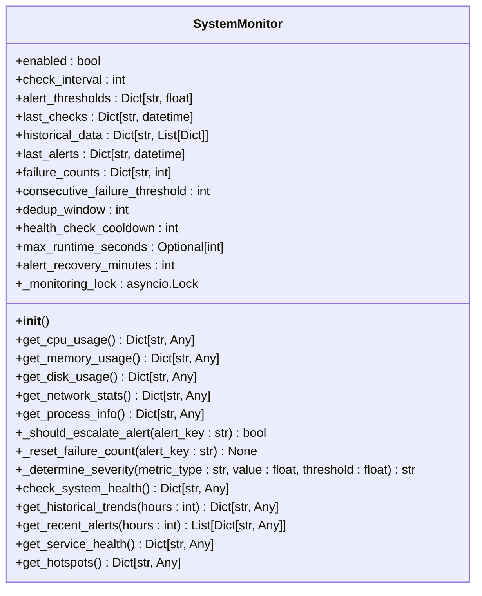

**Diagram sources**
- [vertex-ar\app\monitoring.py](file://vertex-ar/app/monitoring.py#L21-L80)

**Section sources**
- [vertex-ar\app\monitoring.py](file://vertex-ar/app/monitoring.py#L21-L80)

## Metrics Collection Implementation

The SystemMonitor class implements several methods for collecting system metrics using the psutil library. These methods provide comprehensive information about system resources, returning structured data that can be easily consumed by both internal systems and external monitoring tools.

### CPU Usage Collection

The `get_cpu_usage()` method collects comprehensive CPU metrics including overall usage percentage, load averages, per-core utilization, and top CPU-consuming processes. The method uses `psutil.cpu_percent(interval=1)` to obtain an accurate CPU usage reading over a one-second interval, providing a more reliable measurement than instantaneous readings.

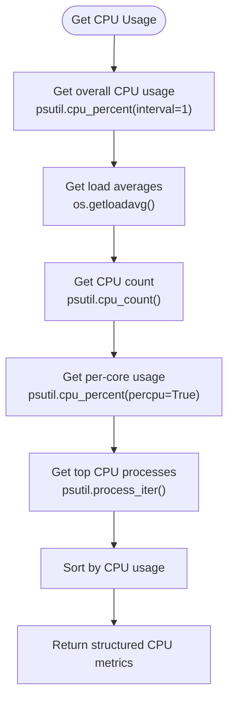

**Diagram sources**
- [vertex\r\app\monitoring.py](file://vertex-ar/app/monitoring.py#L218-L269)

**Section sources**
- [vertex-ar\app\monitoring.py](file://vertex-ar/app/monitoring.py#L218-L269)

### Memory Usage Collection

The `get_memory_usage()` method gathers detailed memory information, including virtual memory usage, swap statistics, and top memory-consuming processes. It returns memory values in both raw bytes and gigabytes for convenience, along with detailed breakdowns of memory types such as active, inactive, buffers, and cached memory.

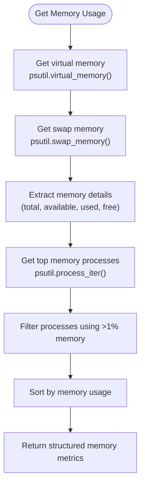

**Diagram sources**
- [vertex-ar\app\monitoring.py](file://vertex-ar/app/monitoring.py#L271-L341)

**Section sources**
- [vertex-ar\app\monitoring.py](file://vertex-ar/app/monitoring.py#L271-L341)

### Disk Usage Collection

The `get_disk_usage()` method collects disk metrics for both the storage root directory and all available partitions. It includes disk I/O statistics, partition details, and disk temperature information when available. The method handles potential permission errors when accessing certain partitions and provides comprehensive I/O performance metrics.

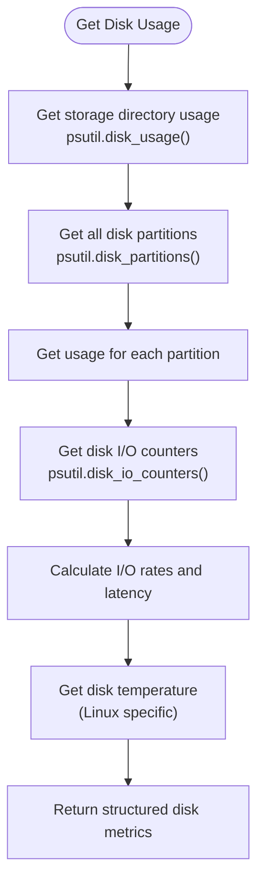

**Diagram sources**
- [vertex-ar\app\monitoring.py](file://vertex-ar/app/monitoring.py#L343-L424)

**Section sources**
- [vertex-ar\app\monitoring.py](file://vertex-ar/app/monitoring.py#L343-L424)

### Network Statistics Collection

The `get_network_stats()` method gathers comprehensive network interface statistics, including overall network I/O, per-interface metrics, and connection statistics. It provides detailed information about network interfaces, including IP addresses, error rates, and drop rates, enabling thorough network performance analysis.

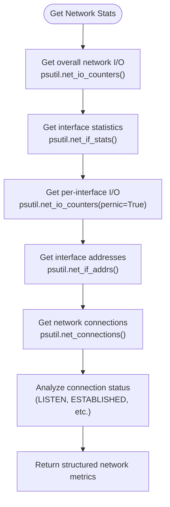

**Diagram sources**
- [vertex-ar\app\monitoring.py](file://vertex-ar/app/monitoring.py#L485-L578)

**Section sources**
- [vertex-ar\app\monitoring.py](file://vertex-ar/app/monitoring.py#L485-L578)

## Threshold-Based Alerting System

The monitoring subsystem implements a sophisticated threshold-based alerting system that triggers alerts when system metrics exceed configurable thresholds. The system uses a multi-stage approach to prevent alert storms and ensure that only meaningful alerts are sent.

### Alert Escalation Logic

The `_should_escalate_alert()` method implements the core alert escalation logic, requiring a configurable number of consecutive failures before escalating an alert. This prevents transient issues from triggering unnecessary alerts. The method also implements deduplication to prevent repeated alerts within a specified time window.

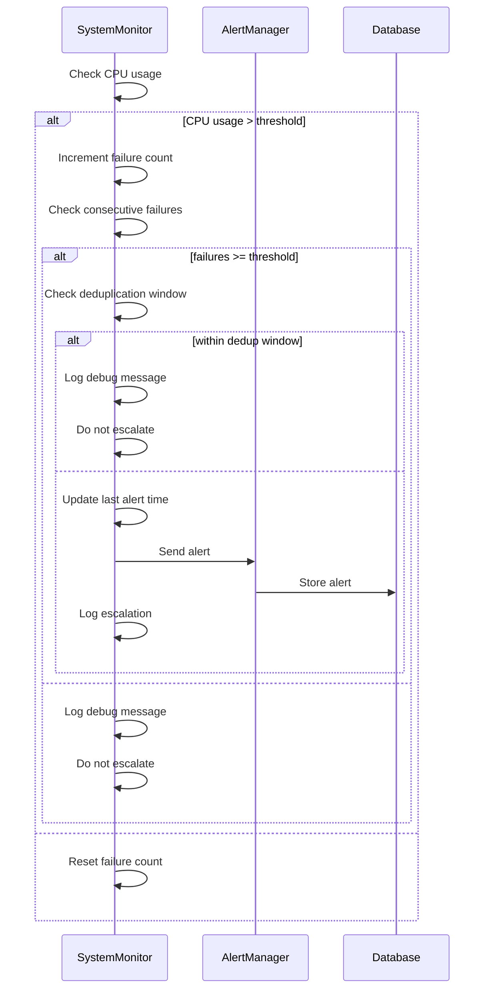

**Diagram sources**
- [vertex-ar\app\monitoring.py](file://vertex-ar/app/monitoring.py#L152-L180)

**Section sources**
- [vertex-ar\app\monitoring.py](file://vertex-ar/app/monitoring.py#L152-L180)

### Severity Determination

The `_determine_severity()` method calculates alert severity based on how much a metric exceeds its threshold. It considers both the percentage over threshold and absolute values, with special handling for critical levels above 95%. This ensures that alerts are appropriately prioritized based on their potential impact.

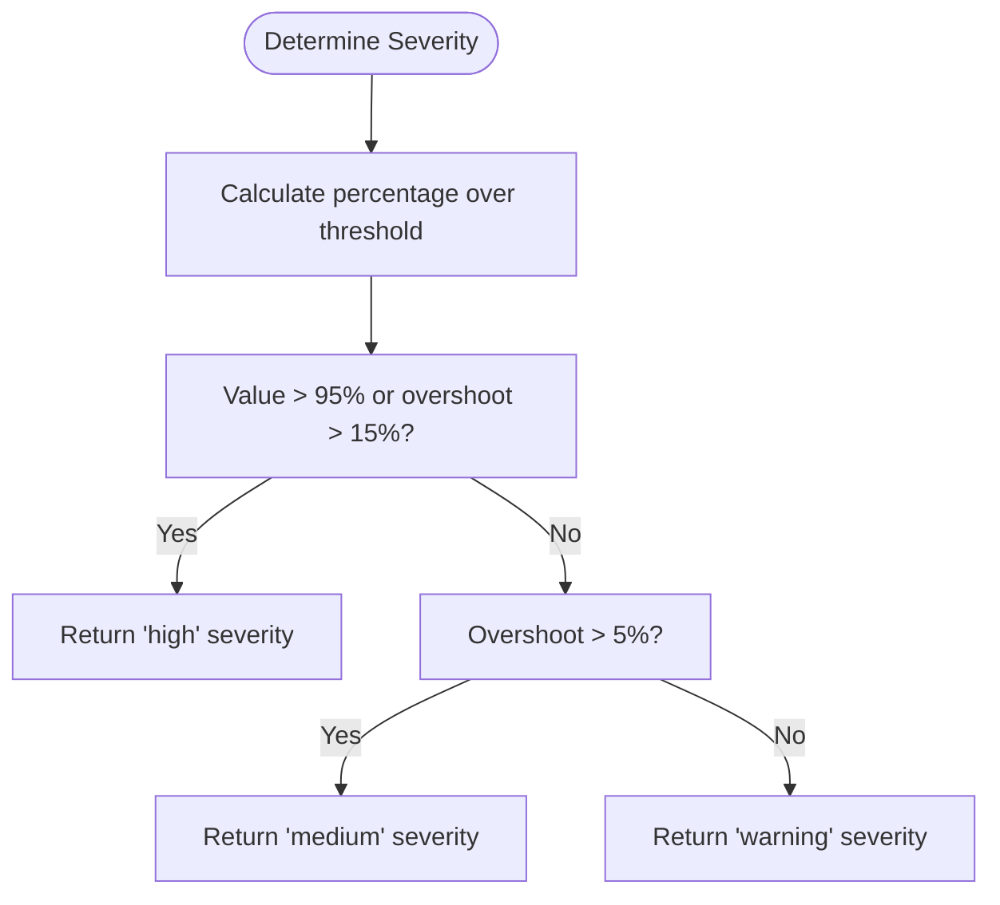

**Diagram sources**
- [vertex-ar\app\monitoring.py](file://vertex-ar/app/monitoring.py#L193-L216)

**Section sources**
- [vertex-ar\app\monitoring.py](file://vertex-ar/app/monitoring.py#L193-L216)

## Prometheus Integration

The monitoring subsystem integrates with Prometheus through the `prometheus_metrics.py` module, exposing metrics in the Prometheus text format. The `PrometheusExporter` class collects metrics from the `SystemMonitor` instance and converts them to Prometheus-compatible format.

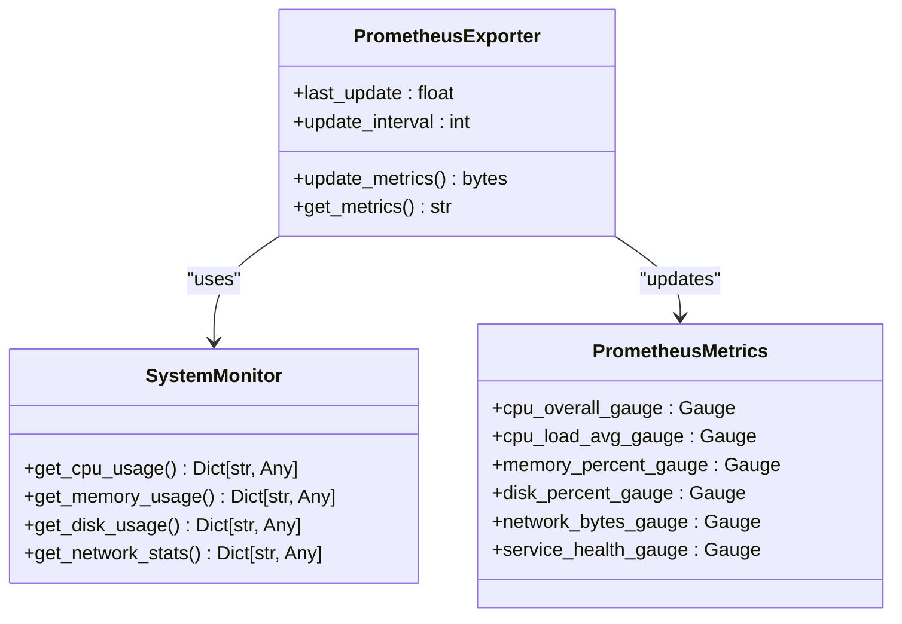

**Diagram sources**
- [vertex-ar\app\prometheus_metrics.py](file://vertex-ar/app/prometheus_metrics.py#L75-L262)
- [vertex-ar\app\monitoring.py](file://vertex-ar/app/monitoring.py#L21-L80)

**Section sources**
- [vertex-ar\app\prometheus_metrics.py](file://vertex-ar/app/prometheus_metrics.py#L75-L262)

The `/metrics` endpoint in the main application exposes these metrics in the Prometheus text format, allowing Prometheus servers to scrape them at regular intervals. The exporter implements rate limiting to prevent excessive resource usage, updating metrics only when the configured interval has elapsed.

## Configuration Management

The monitoring system supports both environment-based and database-persisted configuration. Default values are defined in the application settings, but can be overridden through environment variables. Additionally, settings can be persisted to the database, ensuring they survive application restarts.

### Configuration Hierarchy

The configuration system follows a hierarchy where database settings take precedence over environment variables, which in turn override hardcoded defaults. This allows for flexible configuration management across different deployment scenarios.

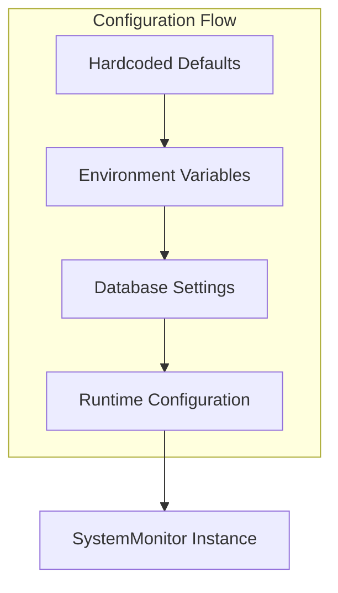

**Diagram sources**
- [vertex-ar\app\config.py](file://vertex-ar/app/config.py#L124-L137)
- [vertex-ar\app\monitoring.py](file://vertex-ar/app/monitoring.py#L88-L117)

**Section sources**
- [vertex-ar\app\config.py](file://vertex-ar/app/config.py#L124-L137)
- [vertex-ar\app\monitoring.py](file://vertex-ar/app/monitoring.py#L88-L117)

### Database Schema

The monitoring settings are stored in the `monitoring_settings` table, which includes fields for all configurable parameters. The table supports multiple settings records, but only the most recent active record is used by the system.

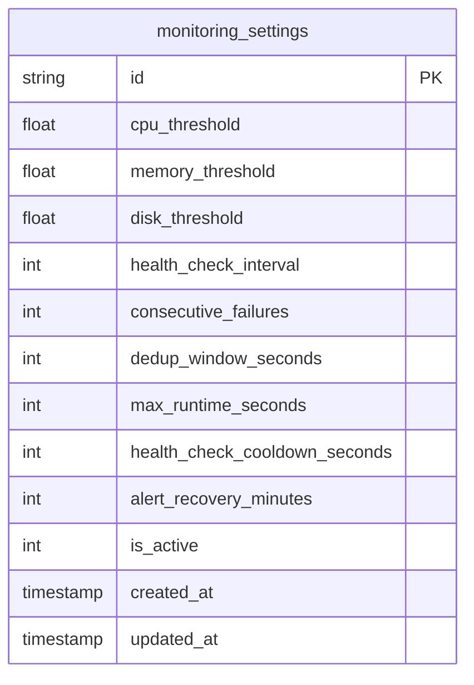

**Diagram sources**
- [docs\monitoring\persistent-settings.md](file://docs/monitoring/persistent-settings.md#L24-L42)

**Section sources**
- [docs\monitoring\persistent-settings.md](file://docs/monitoring/persistent-settings.md#L24-L42)

## API Endpoints

The monitoring system exposes several API endpoints through the `/admin/monitoring` prefix, allowing administrators to interact with the monitoring subsystem, retrieve metrics, and manage settings.

### Key Endpoints

| Endpoint | Method | Description | Authentication |
|---------|--------|-------------|----------------|
| `/admin/monitoring/status` | GET | Get current monitoring status and settings | Admin required |
| `/admin/monitoring/metrics` | GET | Get current system metrics | Admin required |
| `/admin/monitoring/trends` | GET | Get historical system trends | Admin required |
| `/admin/monitoring/hotspots` | GET | Get deep diagnostics data | Admin required |
| `/admin/monitoring/thresholds` | PUT | Update alert thresholds | Admin required |
| `/admin/monitoring/memory-leaks` | GET | Get memory leak diagnostics | Admin required |
| `/admin/monitoring/memory-snapshot` | POST | Manually trigger memory snapshot | Admin required |

**Section sources**
- [vertex-ar\app\api\monitoring.py](file://vertex-ar/app/api/monitoring.py#L21-L776)

### Status Endpoint

The `/admin/monitoring/status` endpoint provides comprehensive information about the current monitoring system state, including enabled status, check interval, thresholds, alert channels, and recent alerts. It also includes both runtime settings and persisted database settings for comparison.

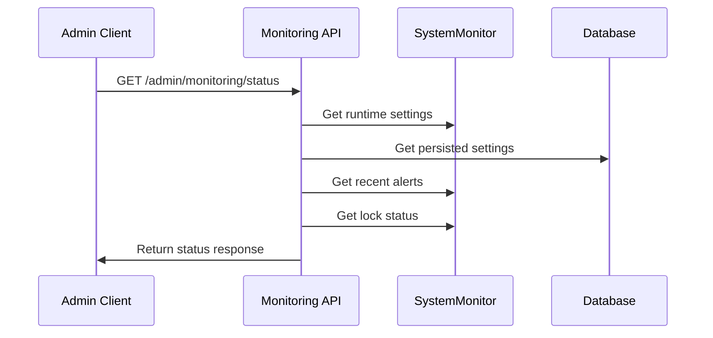

**Diagram sources**
- [vertex-ar\app\api\monitoring.py](file://vertex-ar/app/api/monitoring.py#L71-L117)

**Section sources**
- [vertex-ar\app\api\monitoring.py](file://vertex-ar/app/api/monitoring.py#L71-L117)

## Troubleshooting Guide

This section addresses common issues encountered with the monitoring subsystem and provides guidance for diagnosis and resolution.

### High CPU Load Patterns

High CPU usage can indicate performance bottlenecks or resource contention. The monitoring system provides several tools for diagnosing CPU issues:

1. **Check CPU load averages**: Compare the 1-minute, 5-minute, and 15-minute load averages to the number of CPU cores. If the 1-minute load is significantly higher than the number of cores, the system is experiencing recent high load.

2. **Identify top CPU processes**: Use the `get_cpu_usage()` method to identify processes consuming excessive CPU resources. This can help pinpoint specific applications or services causing high CPU usage.

3. **Analyze historical trends**: Use the `/admin/monitoring/trends` endpoint to analyze CPU usage patterns over time. This can reveal periodic spikes or gradual increases that might indicate memory leaks or inefficient algorithms.

**Section sources**
- [vertex-ar\app\monitoring.py](file://vertex-ar/app/monitoring.py#L218-L269)
- [vertex-ar\app\api\monitoring.py](file://vertex-ar/app/api/monitoring.py#L167-L186)

### Memory Leaks

Memory leaks can cause gradual performance degradation and eventual system instability. The monitoring system includes several features to help identify and diagnose memory leaks:

1. **Enable tracemalloc**: Set `MONITORING_TRACEMALLOC_ENABLED=true` in the environment to enable memory allocation tracking. This adds approximately 10% memory overhead but provides detailed information about memory usage.

2. **Set memory threshold**: Configure `MONITORING_TRACEMALLOC_THRESHOLD_MB` to specify the memory usage threshold at which snapshots are automatically taken. This prevents excessive snapshotting during normal operation.

3. **Analyze snapshots**: Use the `/admin/monitoring/memory-leaks` endpoint to retrieve memory snapshots and identify the top memory allocations. This can help pinpoint code sections responsible for excessive memory usage.

**Section sources**
- [vertex-ar\app\monitoring.py](file://vertex-ar/app/monitoring.py#L719-L781)
- [vertex-ar\app\api\monitoring.py](file://vertex-ar/app/api/monitoring.py#L663-L720)

### Disk I/O Bottlenecks

Disk I/O bottlenecks can significantly impact application performance. The monitoring system provides detailed disk I/O metrics to help identify and resolve these issues:

1. **Monitor I/O latency**: High average read or write latency (above 10-20ms for SSDs, 100ms for HDDs) indicates potential I/O bottlenecks. Use the `avg_read_latency_ms` and `avg_write_latency_ms` metrics from `get_disk_usage()`.

2. **Check IOPS**: Monitor the total IOPS (Input/Output Operations Per Second) to ensure they are within the capabilities of your storage system. Sudden spikes in IOPS might indicate inefficient database queries or file operations.

3. **Analyze I/O size**: Small average I/O sizes (below 4KB) can indicate inefficient random access patterns, while large I/O sizes (above 1MB) might suggest bulk operations that could be optimized.

**Section sources**
- [vertex-ar\app\monitoring.py](file://vertex-ar/app/monitoring.py#L343-L424)
- [vertex-ar\app\api\monitoring.py](file://vertex-ar/app/api/monitoring.py#L197-L266)

## Performance Analysis

The monitoring subsystem provides comprehensive tools for performance analysis, enabling administrators to identify bottlenecks and optimize system performance.

### Historical Trend Analysis

The `get_historical_trends()` method analyzes historical data to identify patterns and trends in system metrics. It calculates statistical measures such as mean, median, standard deviation, and trend slope for each metric over a specified time period.

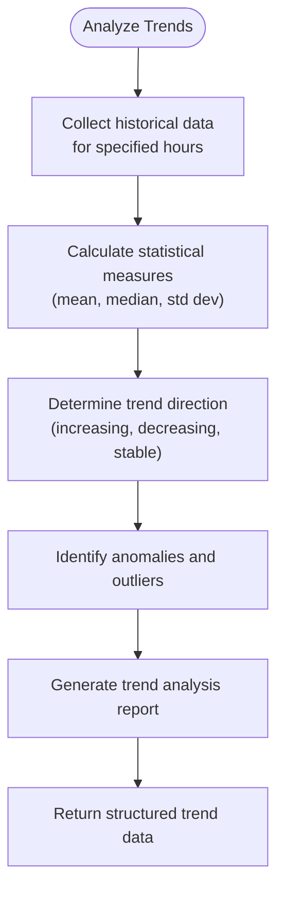

**Diagram sources**
- [vertex-ar\app\monitoring.py](file://vertex-ar/app/monitoring.py#L1000-L1100)

**Section sources**
- [vertex-ar\app\monitoring.py](file://vertex-ar/app/monitoring.py#L1000-L1100)

### Deep Diagnostics

The `get_hotspots()` method provides deep diagnostics data, including process CPU/RSS trends, slow database queries, slow HTTP endpoints, and memory allocation snapshots. This information is invaluable for identifying performance bottlenecks and optimizing application code.

**Section sources**
- [vertex-ar\app\monitoring.py](file://vertex-ar/app/monitoring.py#L783-L800)
- [vertex-ar\app\api\monitoring.py](file://vertex-ar/app/api/monitoring.py#L616-L660)

## Configuration Examples

This section provides configuration examples for different deployment scenarios, demonstrating how to adjust monitoring settings based on specific requirements.

### Development Environment

In development environments, monitoring can be configured with more lenient thresholds and shorter check intervals to facilitate debugging and testing.

```python
# Environment variables for development
ALERTING_ENABLED=true
CPU_THRESHOLD=90.0
MEMORY_THRESHOLD=95.0
DISK_THRESHOLD=98.0
HEALTH_CHECK_INTERVAL=30
MONITORING_CONSECUTIVE_FAILURES=2
MONITORING_DEDUP_WINDOW=120
MONITORING_MAX_RUNTIME=60
```

**Section sources**
- [vertex-ar\app\config.py](file://vertex-ar/app/config.py#L124-L137)

### Production Environment

In production environments, monitoring should be configured with more conservative thresholds and appropriate alerting parameters to ensure system stability.

```python
# Environment variables for production
ALERTING_ENABLED=true
CPU_THRESHOLD=80.0
MEMORY_THRESHOLD=85.0
DISK_THRESHOLD=90.0
HEALTH_CHECK_INTERVAL=60
MONITORING_CONSECUTIVE_FAILURES=3
MONITORING_DEDUP_WINDOW=300
MONITORING_MAX_RUNTIME=180
ALERT_RECOVERY_MINUTES=60
```

**Section sources**
- [vertex-ar\app\config.py](file://vertex-ar/app/config.py#L124-L137)

### High-Performance Environment

For high-performance environments with demanding workloads, monitoring can be tuned to detect issues earlier and provide more detailed diagnostics.

```python
# Environment variables for high-performance
ALERTING_ENABLED=true
CPU_THRESHOLD=75.0
MEMORY_THRESHOLD=80.0
DISK_THRESHOLD=85.0
HEALTH_CHECK_INTERVAL=15
MONITORING_CONSECUTIVE_FAILURES=2
MONITORING_DEDUP_WINDOW=180
MONITORING_MAX_RUNTIME=120
MONITORING_PROCESS_HISTORY_SIZE=200
MONITORING_SLOW_QUERY_THRESHOLD_MS=50
MONITORING_SLOW_ENDPOINT_THRESHOLD_MS=500
MONITORING_TRACEMALLOC_ENABLED=true
MONITORING_TRACEMALLOC_THRESHOLD_MB=50
```

**Section sources**
- [vertex-ar\app\config.py](file://vertex-ar/app/config.py#L124-L137)
- [vertex-ar\app\config.py](file://vertex-ar/app/config.py#L228-L235)