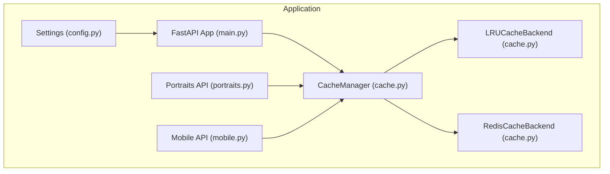
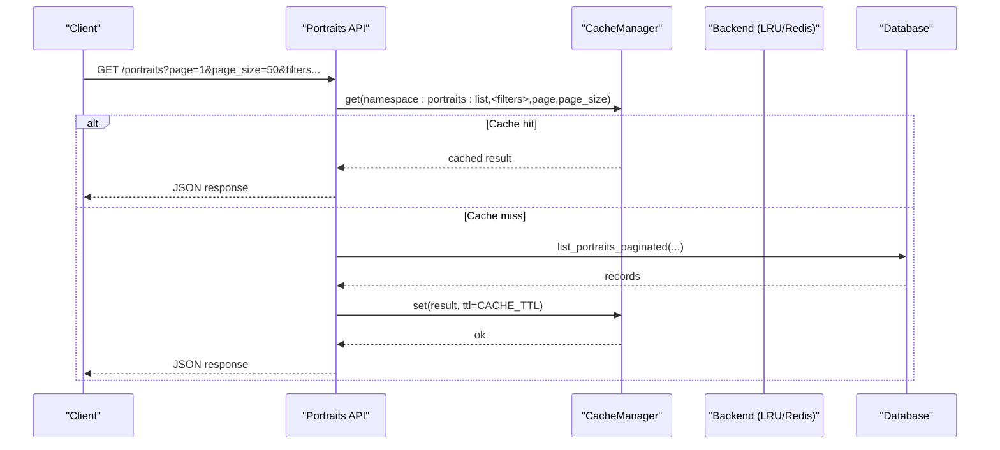
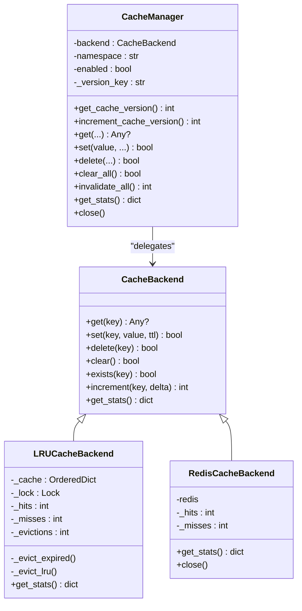
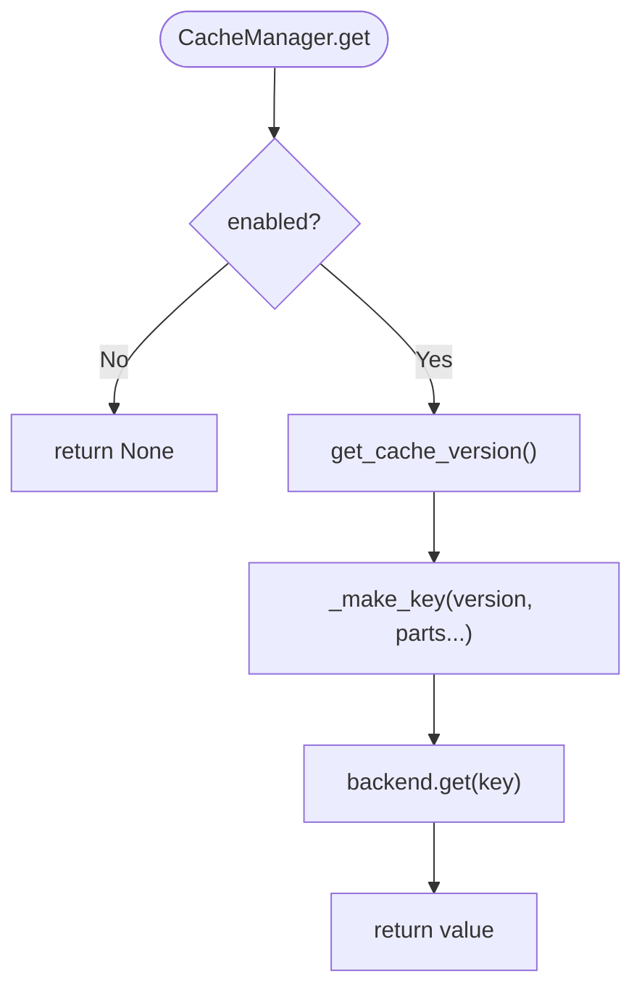
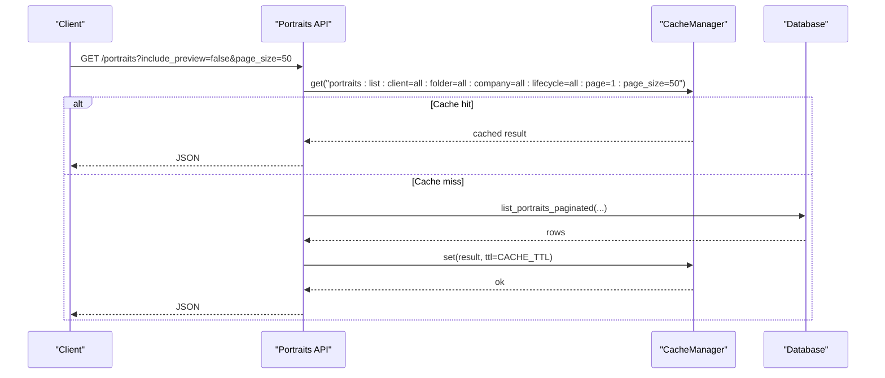
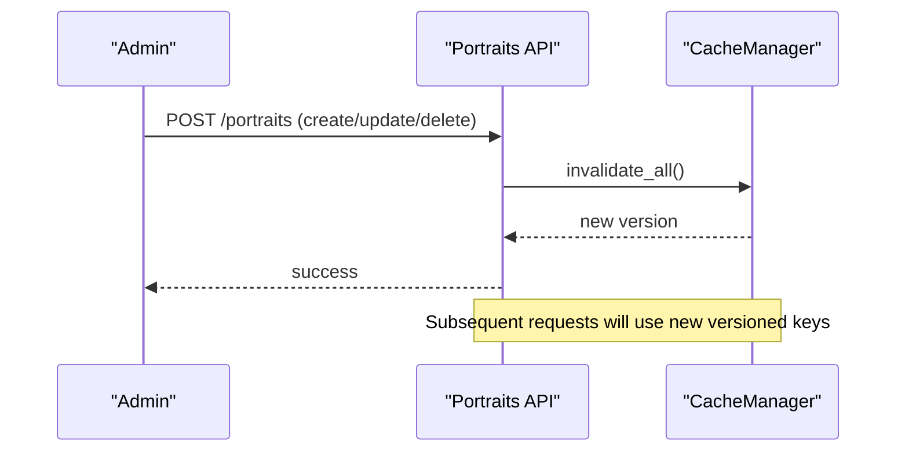
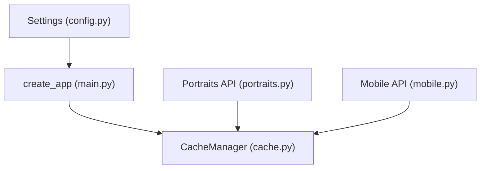

# Caching Optimization

<cite>
**Referenced Files in This Document**
- [cache.py](file://vertex-ar/app/cache.py)
- [config.py](file://vertex-ar/app/config.py)
- [main.py](file://vertex-ar/app/main.py)
- [portraits.py](file://vertex-ar/app/api/portraits.py)
- [mobile.py](file://vertex-ar/app/api/mobile.py)
- [.env.example](file://.env.example)
- [dashboard-features.md](file://docs/admin/dashboard-features.md)
- [test_cache.py](file://test_files/unit/test_cache.py)
</cite>

## Table of Contents
1. [Introduction](#introduction)
2. [Project Structure](#project-structure)
3. [Core Components](#core-components)
4. [Architecture Overview](#architecture-overview)
5. [Detailed Component Analysis](#detailed-component-analysis)
6. [Dependency Analysis](#dependency-analysis)
7. [Performance Considerations](#performance-considerations)
8. [Troubleshooting Guide](#troubleshooting-guide)
9. [Conclusion](#conclusion)
10. [Appendices](#appendices)

## Introduction
This document explains the caching configuration and optimization in the Vertex AR system. It covers the CACHE_ENABLED flag, REDIS_URL connection string, CACHE_TTL (time-to-live), CACHE_NAMESPACE (key organization), and CACHE_MAX_SIZE (memory limits) for both Redis and in-memory LRU backends. It also details cache hit/miss patterns, eviction strategies, serialization formats, and integration with frequently accessed endpoints such as portrait retrieval and company configuration. Guidance is provided for environment configuration, performance tuning, monitoring cache efficiency, and best practices for cache invalidation.

## Project Structure
The caching subsystem is implemented in a dedicated module and wired into the application via the main application factory. Configuration is centralized in the settings module and exposed to endpoints and services.

**Diagram sources**
- [config.py](file://vertex-ar/app/config.py#L114-L122)
- [main.py](file://vertex-ar/app/main.py#L106-L121)
- [cache.py](file://vertex-ar/app/cache.py#L313-L461)
- [portraits.py](file://vertex-ar/app/api/portraits.py#L226-L341)
- [mobile.py](file://vertex-ar/app/api/mobile.py#L403-L429)

**Section sources**
- [config.py](file://vertex-ar/app/config.py#L114-L122)
- [main.py](file://vertex-ar/app/main.py#L106-L121)
- [cache.py](file://vertex-ar/app/cache.py#L313-L461)

## Core Components
- CacheBackend: Abstract interface defining get/set/delete/clear/exists/increment/get_stats.
- LRUCacheBackend: In-memory LRU cache with TTL support, thread-safe counters, and eviction.
- RedisCacheBackend: Redis-backed cache with TTL and pickle-based serialization.
- CacheManager: Namespaces keys, versioning for invalidation, and delegates to backend.
- create_cache_manager: Factory that selects Redis or LRU backend based on configuration.

Key behaviors:
- Keys are namespaced and versioned to safely invalidate caches across deployments.
- Long keys are hashed to avoid Redis key length limits.
- Serialization uses pickle for Redis; in-memory stores native Python objects.
- TTL is enforced on set and during get operations.

**Section sources**
- [cache.py](file://vertex-ar/app/cache.py#L19-L56)
- [cache.py](file://vertex-ar/app/cache.py#L58-L195)
- [cache.py](file://vertex-ar/app/cache.py#L197-L312)
- [cache.py](file://vertex-ar/app/cache.py#L313-L461)

## Architecture Overview
The application initializes a CacheManager at startup using settings. Endpoints use the cache manager to cache expensive reads. Redis is used when configured; otherwise, an in-memory LRU cache is used.

**Diagram sources**
- [main.py](file://vertex-ar/app/main.py#L106-L121)
- [portraits.py](file://vertex-ar/app/api/portraits.py#L226-L341)
- [cache.py](file://vertex-ar/app/cache.py#L313-L461)

## Detailed Component Analysis

### CacheBackend and Implementations
- LRUCacheBackend
  - Maintains an ordered dictionary of entries with optional expiry timestamps.
  - Evicts expired entries on get/set and evicts least recently used when capacity is reached.
  - Tracks hits, misses, and evictions; computes hit rate.
  - Thread-safe via a lock.
- RedisCacheBackend
  - Uses redis.asyncio client with pickle serialization for values.
  - Honors TTL on set; supports increment for counters.
  - Logs and swallows exceptions to keep cache operations resilient.

**Diagram sources**
- [cache.py](file://vertex-ar/app/cache.py#L19-L56)
- [cache.py](file://vertex-ar/app/cache.py#L58-L195)
- [cache.py](file://vertex-ar/app/cache.py#L197-L312)
- [cache.py](file://vertex-ar/app/cache.py#L313-L461)

**Section sources**
- [cache.py](file://vertex-ar/app/cache.py#L58-L195)
- [cache.py](file://vertex-ar/app/cache.py#L197-L312)
- [cache.py](file://vertex-ar/app/cache.py#L313-L461)

### CacheManager and Key Organization
- Namespacing: Keys are prefixed with the configured namespace.
- Versioning: A version key is maintained; incrementing it invalidates all cached entries under the namespace.
- Key construction: Long composite keys are hashed to keep Redis key lengths manageable.
- Disabled mode: When disabled, get returns None and set returns False.

**Diagram sources**
- [cache.py](file://vertex-ar/app/cache.py#L313-L461)

**Section sources**
- [cache.py](file://vertex-ar/app/cache.py#L313-L461)

### Configuration and Environment
- CACHE_ENABLED: Enables/disables caching globally.
- REDIS_URL: Redis connection string; if absent, falls back to in-memory LRU.
- CACHE_TTL: Default TTL in seconds for cached entries.
- CACHE_NAMESPACE: Prefix for all cache keys.
- CACHE_MAX_SIZE: Maximum number of entries for in-memory LRU cache.
- CACHE_PAGE_SIZE_DEFAULT and CACHE_PAGE_SIZE_MAX: Pagination bounds used by endpoints.

Environment examples are provided in the repository’s example environment file.

**Section sources**
- [config.py](file://vertex-ar/app/config.py#L114-L122)
- [.env.example](file://.env.example#L299-L329)

### Integration with Endpoints
- Portraits listing:
  - Builds a cache key from filters and pagination.
  - Skips caching when including preview data (large payloads).
  - Uses CACHE_TTL for cached results.
- Company listing (mobile):
  - Iterates clients and portraits to compute counts; not cached by default.

**Diagram sources**
- [portraits.py](file://vertex-ar/app/api/portraits.py#L226-L341)
- [cache.py](file://vertex-ar/app/cache.py#L313-L461)

**Section sources**
- [portraits.py](file://vertex-ar/app/api/portraits.py#L226-L341)
- [portraits.py](file://vertex-ar/app/api/portraits.py#L354-L501)
- [mobile.py](file://vertex-ar/app/api/mobile.py#L403-L429)

### Serialization Formats
- Redis: Values are serialized/deserialized using pickle.
- In-memory: Native Python objects are stored; no serialization overhead.

**Section sources**
- [cache.py](file://vertex-ar/app/cache.py#L241-L256)
- [cache.py](file://vertex-ar/app/cache.py#L226-L236)

### Cache Hit/Miss Patterns and Statistics
- LRUCacheBackend tracks hits, misses, and evictions; computes hit rate.
- RedisCacheBackend tracks hits and misses.
- CacheManager exposes combined stats including backend type, namespace, and enabled flag.

**Section sources**
- [cache.py](file://vertex-ar/app/cache.py#L180-L195)
- [cache.py](file://vertex-ar/app/cache.py#L292-L303)
- [cache.py](file://vertex-ar/app/cache.py#L413-L419)
- [test_cache.py](file://test_files/unit/test_cache.py#L155-L171)

### Eviction Strategies
- LRU eviction: Removes least recently used entries when capacity is exceeded.
- Expired eviction: Removes expired entries on get/set.
- Redis: Uses server-side TTL; no manual eviction loop.

**Section sources**
- [cache.py](file://vertex-ar/app/cache.py#L83-L99)
- [cache.py](file://vertex-ar/app/cache.py#L94-L99)

### Cache Invalidation Strategies
- Version-based invalidation: Incrementing a version key invalidates all entries under the namespace.
- Endpoint-driven invalidation: Creating/deleting/updating portraits triggers cache invalidation.
- Disabled mode: Disables caching globally.

**Diagram sources**
- [portraits.py](file://vertex-ar/app/api/portraits.py#L52-L58)
- [cache.py](file://vertex-ar/app/cache.py#L355-L374)

**Section sources**
- [cache.py](file://vertex-ar/app/cache.py#L355-L374)
- [portraits.py](file://vertex-ar/app/api/portraits.py#L52-L58)

## Dependency Analysis
- Application wiring: The main app creates a CacheManager using settings and stores it in app.state for later retrieval by endpoints.
- Endpoint dependencies: Portraits and mobile APIs retrieve the cache manager from app.state and use it for caching.

**Diagram sources**
- [config.py](file://vertex-ar/app/config.py#L114-L122)
- [main.py](file://vertex-ar/app/main.py#L106-L121)
- [cache.py](file://vertex-ar/app/cache.py#L313-L461)
- [portraits.py](file://vertex-ar/app/api/portraits.py#L226-L341)
- [mobile.py](file://vertex-ar/app/api/mobile.py#L403-L429)

**Section sources**
- [main.py](file://vertex-ar/app/main.py#L106-L121)
- [portraits.py](file://vertex-ar/app/api/portraits.py#L226-L341)
- [mobile.py](file://vertex-ar/app/api/mobile.py#L403-L429)

## Performance Considerations
- Choose Redis for distributed systems; LRU for single-instance deployments.
- Tune CACHE_TTL to balance freshness and hit rate; higher TTL reduces misses but risks staleness.
- Set CACHE_MAX_SIZE appropriately for LRU to prevent memory bloat; monitor evictions.
- Avoid caching large payloads (e.g., previews) to reduce memory footprint.
- Use version-based invalidation to avoid cache stampedes on bulk updates.

[No sources needed since this section provides general guidance]

## Troubleshooting Guide
Common issues and remedies:
- High cache miss rate:
  - Increase CACHE_TTL.
  - Reduce invalidation frequency.
  - Ensure CACHE_MAX_SIZE is adequate.
- Cache stampedes:
  - Use version-based invalidation to invalidate in batches.
  - Avoid setting extremely low TTLs for hot keys.
- Memory bloat:
  - Lower CACHE_MAX_SIZE or switch to Redis with memory limits.
  - Avoid caching large previews; endpoints already skip preview caching.
- Stale data:
  - Use invalidate_all() on data changes.
  - Ensure CACHE_TTL is not excessively long for sensitive data.
- Redis connectivity issues:
  - Verify REDIS_URL format and connectivity.
  - Confirm Redis server is reachable and not rate-limited.

Monitoring tips:
- Use the admin monitoring endpoints to inspect cache stats and system health.
- Track cache hit rate and eviction counts to tune parameters.

**Section sources**
- [dashboard-features.md](file://docs/admin/dashboard-features.md#L265-L277)
- [cache.py](file://vertex-ar/app/cache.py#L180-L195)
- [cache.py](file://vertex-ar/app/cache.py#L292-L303)

## Conclusion
The Vertex AR caching system provides a robust, configurable abstraction supporting both in-memory LRU and Redis backends. Proper configuration of CACHE_ENABLED, REDIS_URL, CACHE_TTL, CACHE_NAMESPACE, and CACHE_MAX_SIZE enables scalable performance. Version-based invalidation and endpoint-driven invalidation ensure correctness. Monitoring cache stats and system metrics helps maintain optimal performance.

[No sources needed since this section summarizes without analyzing specific files]

## Appendices

### Configuration Examples by Environment
- Development:
  - CACHE_ENABLED=true
  - REDIS_URL=redis://localhost:6379/0 (optional)
  - CACHE_TTL=300
  - CACHE_NAMESPACE=vertex_ar_dev
  - CACHE_MAX_SIZE=1000
- Staging:
  - CACHE_ENABLED=true
  - REDIS_URL=<your-redis-url>
  - CACHE_TTL=600
  - CACHE_NAMESPACE=vertex_ar_stg
  - CACHE_MAX_SIZE=2000
- Production:
  - CACHE_ENABLED=true
  - REDIS_URL=<your-redis-url>
  - CACHE_TTL=900
  - CACHE_NAMESPACE=vertex_ar_prod
  - CACHE_MAX_SIZE=5000

**Section sources**
- [.env.example](file://.env.example#L299-L329)

### Performance Metrics and Monitoring
- Cache hit rate and eviction counts are available via cache statistics.
- System-wide metrics (CPU, memory, disk, network) are exported for comprehensive monitoring.
- Use the admin monitoring endpoints to diagnose cache-related issues.

**Section sources**
- [cache.py](file://vertex-ar/app/cache.py#L180-L195)
- [cache.py](file://vertex-ar/app/cache.py#L292-L303)
- [dashboard-features.md](file://docs/admin/dashboard-features.md#L265-L277)