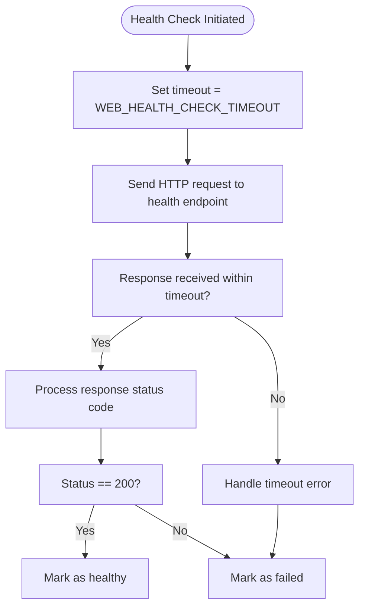
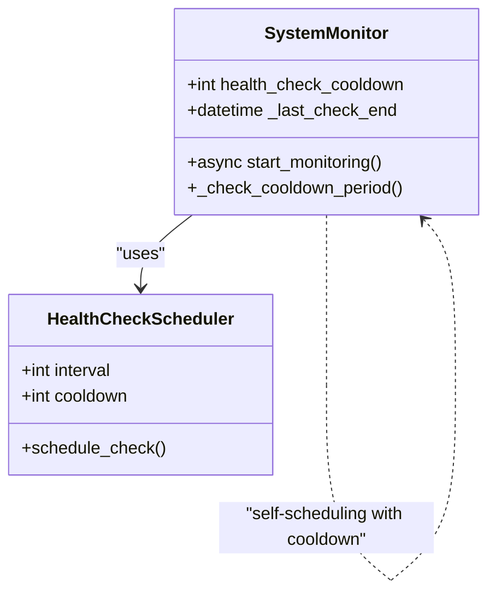
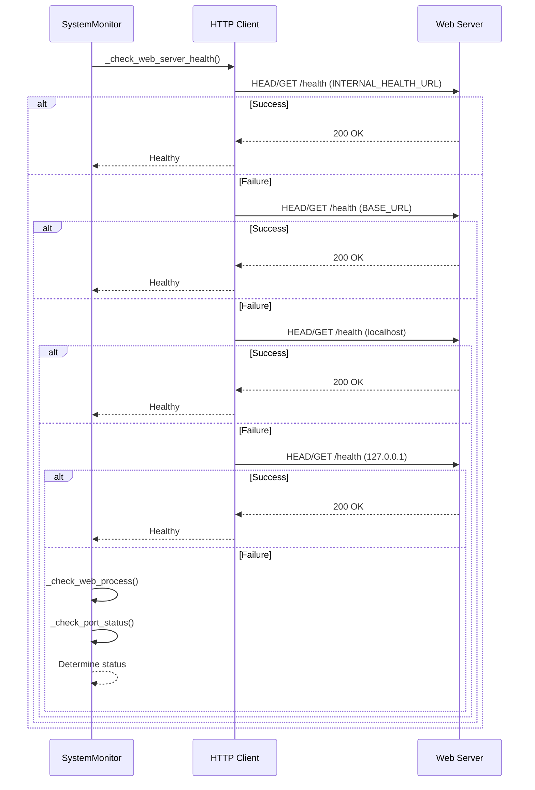

# Health Check Optimization

<cite>
**Referenced Files in This Document**   
- [vertex-ar/app/monitoring.py](file://vertex-ar/app/monitoring.py)
- [vertex-ar/app/config.py](file://vertex-ar/app/config.py)
- [docs/monitoring/web-health-check.md](file://docs/monitoring/web-health-check.md)
- [monitoring/prometheus.yml](file://monitoring/prometheus.yml)
- [monitoring/alertmanager.yml](file://monitoring/alertmanager.yml)
- [vertex-ar/app/api/monitoring.py](file://vertex-ar/app/api/monitoring.py)
- [docs/monitoring/persistent-settings.md](file://docs/monitoring/persistent-settings.md)
</cite>

## Table of Contents
1. [Introduction](#introduction)
2. [Configuration Parameters](#configuration-parameters)
3. [Implementation Details](#implementation-details)
4. [Monitoring Stack Integration](#monitoring-stack-integration)
5. [Configuration Scenarios](#configuration-scenarios)
6. [Best Practices](#best-practices)
7. [Troubleshooting](#troubleshooting)
8. [Conclusion](#conclusion)

## Introduction
The Vertex AR application includes a comprehensive web health check system designed to monitor service availability and performance. This documentation covers the configuration and tuning of three critical health check parameters: WEB_HEALTH_CHECK_TIMEOUT, WEB_HEALTH_CHECK_USE_HEAD, and WEB_HEALTH_CHECK_COOLDOWN. These parameters control the behavior of the monitoring system when checking the health of the web server, allowing administrators to balance monitoring sensitivity with system overhead and false positive reduction.

The health check system implements a sophisticated multi-attempt strategy with fallback URLs and process-level diagnostics to prevent false alerts when the application is healthy but external connectivity issues exist. This approach ensures reliable monitoring across various deployment scenarios, from development environments to production systems with external load balancers.

**Section sources**
- [docs/monitoring/web-health-check.md](file://docs/monitoring/web-health-check.md#L1-L365)

## Configuration Parameters
The web health check system is controlled by three primary configuration parameters that can be set via environment variables or configuration files. These parameters allow fine-tuning of the monitoring behavior to match specific deployment requirements and performance characteristics.

### WEB_HEALTH_CHECK_TIMEOUT
This parameter defines the maximum time in seconds to wait for a response from the health check endpoint before considering the request failed. The default value is 5 seconds.



**Diagram sources**
- [vertex-ar/app/monitoring.py](file://vertex-ar/app/monitoring.py#L914-L1113)

The timeout value should be set based on the expected response time of the application under normal load conditions. In high-latency networks, this value may need to be increased to prevent false positives due to network delays. However, setting it too high can delay the detection of actual service outages.

**Section sources**
- [vertex-ar/app/monitoring.py](file://vertex-ar/app/monitoring.py#L943-L944)
- [vertex-ar/app/config.py](file://vertex-ar/app/config.py#L223)

### WEB_HEALTH_CHECK_USE_HEAD
This boolean parameter determines whether to use HTTP HEAD requests (when true) or GET requests (when false) for health checks. The default value is false.

When enabled, the monitoring system uses HEAD requests which retrieve only the response headers without the response body. This reduces network bandwidth usage and server processing overhead, making it ideal for high-traffic production systems where monitoring should have minimal impact on performance.

The HEAD method is particularly beneficial in resource-constrained environments where every byte of network traffic and CPU cycle counts. However, it's important to note that some health check implementations may include diagnostic information in the response body that would not be available with HEAD requests.

**Section sources**
- [vertex-ar/app/monitoring.py](file://vertex-ar/app/monitoring.py#L945)
- [vertex-ar/app/config.py](file://vertex-ar/app/config.py#L224)

### WEB_HEALTH_CHECK_COOLDOWN
This parameter sets the minimum time in seconds between consecutive health check attempts. The default value is 30 seconds.



**Diagram sources**
- [vertex-ar/app/monitoring.py](file://vertex-ar/app/monitoring.py#L44)
- [vertex-ar/app/monitoring.py](file://vertex-ar/app/monitoring.py#L1619-L1626)

The cooldown period prevents the monitoring system from overwhelming the server with too frequent health checks, especially important in environments with limited resources. It works in conjunction with the HEALTH_CHECK_INTERVAL setting, ensuring that even if the interval is set very low, the cooldown period provides a safety mechanism to prevent excessive monitoring load.

**Section sources**
- [vertex-ar/app/monitoring.py](file://vertex-ar/app/monitoring.py#L44)
- [vertex-ar/app/config.py](file://vertex-ar/app/config.py#L225)
- [docs/monitoring/persistent-settings.md](file://docs/monitoring/persistent-settings.md#L36)

## Implementation Details
The web health check implementation in the Vertex AR application follows a comprehensive approach that combines HTTP endpoint monitoring with process-level diagnostics to provide accurate service status assessment.

### Multi-Attempt Health Check Strategy
The system implements a priority-based URL attempt strategy that tries multiple endpoints in sequence before declaring the service unhealthy:

1. **INTERNAL_HEALTH_URL** (if configured)
2. **BASE_URL** (public URL)
3. **localhost fallback** (http://localhost:{APP_PORT}/health)
4. **127.0.0.1 fallback** (http://127.0.0.1:{APP_PORT}/health)

This approach ensures that even if the public URL is unreachable due to DNS, TLS, or firewall issues, the monitoring system can still verify that the application process is running correctly on the host machine.



**Diagram sources**
- [vertex-ar/app/monitoring.py](file://vertex-ar/app/monitoring.py#L947-L968)
- [vertex-ar/app/monitoring.py](file://vertex-ar/app/monitoring.py#L970-L1018)

**Section sources**
- [vertex-ar/app/monitoring.py](file://vertex-ar/app/monitoring.py#L914-L1113)
- [docs/monitoring/web-health-check.md](file://docs/monitoring/web-health-check.md#L68-L76)

### Status Determination Logic
The system uses a three-tier status determination approach that provides more nuanced information than a simple binary healthy/unhealthy state:

- **Operational**: At least one URL returned HTTP 200
- **Degraded**: All HTTP attempts failed, but process is running and port is accepting connections
- **Failed**: All HTTP attempts failed and either process is not running or port is not accepting connections

This logic prevents false alerts when the application is healthy but external connectivity issues prevent the health check from reaching the service through its public URL.

**Section sources**
- [vertex-ar/app/monitoring.py](file://vertex-ar/app/monitoring.py#L1020-L1036)
- [docs/monitoring/web-health-check.md](file://docs/monitoring/web-health-check.md#L170-L187)

## Monitoring Stack Integration
The health check system is integrated with a comprehensive monitoring stack that includes Prometheus for metrics collection and Alertmanager for alert routing and deduplication.

### Prometheus Integration
The application exposes metrics through the `/metrics` endpoint, which is scraped by Prometheus according to the configuration in `prometheus.yml`:

```yaml
scrape_configs:
  - job_name: 'vertex-ar'
    static_configs:
      - targets: ['localhost:8000']
    metrics_path: '/metrics'
    scrape_interval: 30s
    scrape_timeout: 10s
```

The metrics include detailed information about the health check results, allowing for historical analysis and trend detection. The scrape interval of 30 seconds should be coordinated with the WEB_HEALTH_CHECK_COOLDOWN setting to avoid overwhelming the application with monitoring requests.

**Section sources**
- [monitoring/prometheus.yml](file://monitoring/prometheus.yml#L15-L23)

### Alertmanager Configuration
Alerts generated by the health check system are processed by Alertmanager, which handles deduplication, grouping, and routing according to the configuration in `alertmanager.yml`:

```yaml
route:
  group_by: ['alertname', 'service']
  group_wait: 10s
  group_interval: 10s
  repeat_interval: 1h
  receiver: 'web.hook'
  routes:
    - match:
        severity: critical
      receiver: 'critical-alerts'
      group_wait: 5s
      repeat_interval: 30m
```

The configuration includes inhibition rules that prevent warning alerts from being sent when a critical alert for the same issue already exists, reducing alert fatigue.

**Section sources**
- [monitoring/alertmanager.yml](file://monitoring/alertmanager.yml#L8-L21)

## Configuration Scenarios
The health check parameters can be tuned for different deployment scenarios to optimize monitoring effectiveness while minimizing overhead.

### High-Latency Networks
In networks with high latency or unreliable connectivity, the following configuration is recommended:

```bash
# Increase timeout to accommodate network delays
WEB_HEALTH_CHECK_TIMEOUT=10

# Use HEAD requests to minimize data transfer
WEB_HEALTH_CHECK_USE_HEAD=true

# Increase cooldown to reduce monitoring frequency
WEB_HEALTH_CHECK_COOLDOWN=60
```

This configuration reduces the likelihood of false positives due to network delays while minimizing the bandwidth usage of the monitoring system.

**Section sources**
- [vertex-ar/app/config.py](file://vertex-ar/app/config.py#L223-L225)

### Resource-Constrained Environments
For systems with limited CPU, memory, or network bandwidth:

```bash
# Use lightweight HEAD requests
WEB_HEALTH_CHECK_USE_HEAD=true

# Increase cooldown to reduce monitoring overhead
WEB_HEALTH_CHECK_COOLDOWN=120

# Set moderate timeout
WEB_HEALTH_CHECK_TIMEOUT=8
```

This configuration minimizes the impact of monitoring on system resources while still providing reliable service status information.

**Section sources**
- [vertex-ar/app/monitoring.py](file://vertex-ar/app/monitoring.py#L984-L988)

### Production with External Load Balancer
For production deployments behind load balancers or reverse proxies:

```bash
# Configure internal health check URL
INTERNAL_HEALTH_URL=http://127.0.0.1:8000

# Use HEAD requests for efficiency
WEB_HEALTH_CHECK_USE_HEAD=true

# Standard timeout and cooldown
WEB_HEALTH_CHECK_TIMEOUT=5
WEB_HEALTH_CHECK_COOLDOWN=30
```

This configuration allows the monitoring system to check the application directly while still validating the external URL path through the load balancer.

**Section sources**
- [docs/monitoring/web-health-check.md](file://docs/monitoring/web-health-check.md#L286-L297)

## Best Practices
To effectively tune the web health check parameters, follow these best practices:

### Balancing Sensitivity and False Positives
- Set WEB_HEALTH_CHECK_TIMEOUT to 2-3 times the average response time under peak load
- Use WEB_HEALTH_CHECK_USE_HEAD in production to reduce monitoring overhead
- Configure appropriate cooldown periods based on system resources and monitoring requirements
- Monitor the rate of health check failures and adjust parameters accordingly

### Monitoring Overhead Reduction
- In high-traffic systems, use HEAD requests and longer cooldown periods
- Consider the impact of monitoring on overall system performance
- Use the internal health check URL when possible to bypass external network dependencies
- Regularly review monitoring logs to identify and address false positives

### Threshold Setting Guidelines
- For WEB_HEALTH_CHECK_TIMEOUT: Start with 5 seconds and increase only if necessary
- For WEB_HEALTH_CHECK_COOLDOWN: Start with 30 seconds and increase for resource-constrained systems
- For critical systems: Use shorter cooldown periods (15-20 seconds) for faster detection
- For non-critical systems: Use longer cooldown periods (60-120 seconds) to reduce overhead

**Section sources**
- [docs/monitoring/web-health-check.md](file://docs/monitoring/web-health-check.md#L310-L317)

## Troubleshooting
Common issues with the health check system and their solutions:

### Flapping Alerts
Flapping alerts (rapid switching between healthy and unhealthy states) can be addressed by:
- Increasing WEB_HEALTH_CHECK_COOLDOWN to prevent rapid state changes
- Adjusting WEB_HEALTH_CHECK_TIMEOUT to accommodate temporary performance spikes
- Ensuring stable network connectivity between monitoring system and application

### Monitoring Overhead
If monitoring is consuming excessive resources:
- Enable WEB_HEALTH_CHECK_USE_HEAD to reduce request size
- Increase WEB_HEALTH_CHECK_COOLDOWN to reduce frequency
- Verify that the monitoring interval in Prometheus matches the application cooldown

### Misconfigured Thresholds
Issues with threshold configuration can be diagnosed by:
- Checking the monitoring logs for timeout and connection errors
- Verifying that the health check URLs are accessible from the monitoring system
- Using the `/api/monitoring/detailed-metrics` endpoint to view detailed diagnostics

**Section sources**
- [docs/monitoring/web-health-check.md](file://docs/monitoring/web-health-check.md#L122-L164)
- [vertex-ar/app/api/monitoring.py](file://vertex-ar/app/api/monitoring.py#L197-L266)

## Conclusion
The web health check system in the Vertex AR application provides a robust and configurable mechanism for monitoring service availability. By properly tuning the WEB_HEALTH_CHECK_TIMEOUT, WEB_HEALTH_CHECK_USE_HEAD, and WEB_HEALTH_CHECK_COOLDOWN parameters, administrators can create a monitoring strategy that balances sensitivity with reliability across various deployment scenarios.

The integration with Prometheus and Alertmanager provides a comprehensive monitoring stack that enables effective alerting and performance analysis. Following the best practices outlined in this documentation will help ensure reliable monitoring with minimal false positives and appropriate system overhead.

Regular review and adjustment of health check parameters based on system performance characteristics and operational requirements is essential for maintaining an effective monitoring strategy.