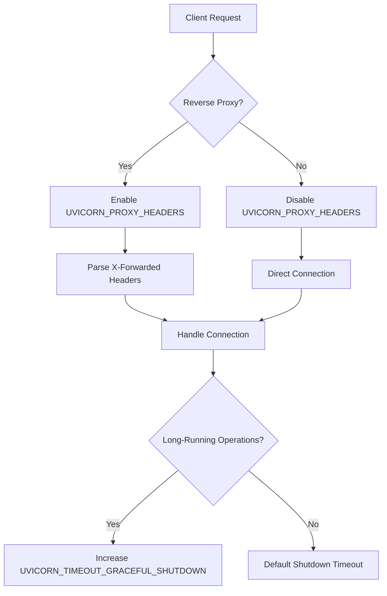
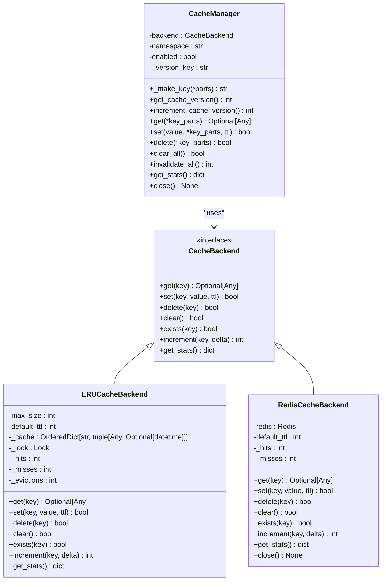
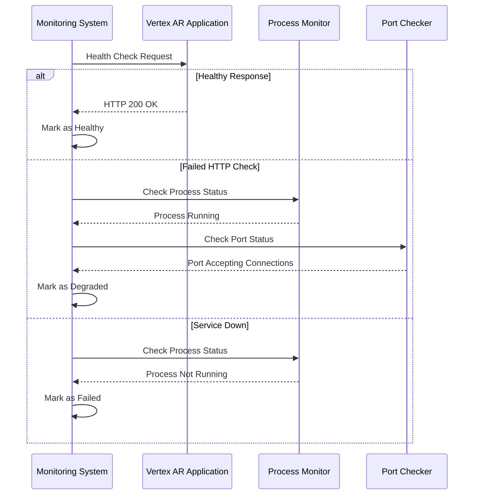
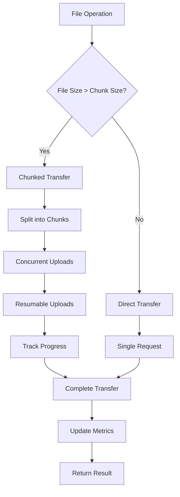

# Performance Tuning

<cite>
**Referenced Files in This Document**   
- [vertex-ar/.env.example](file://vertex-ar/.env.example)
- [vertex-ar/.env.production.example](file://vertex-ar/.env.production.example)
- [vertex-ar/app/config.py](file://vertex-ar/app/config.py)
- [vertex-ar/app/cache.py](file://vertex-ar/app/cache.py)
- [vertex-ar/app/monitoring.py](file://vertex-ar/app/monitoring.py)
- [vertex-ar/app/main.py](file://vertex-ar/app/main.py)
- [docs/deployment/uvicorn-tuning.md](file://docs/deployment/uvicorn-tuning.md)
- [docs/monitoring/web-health-check.md](file://docs/monitoring/web-health-check.md)
- [docs/YANDEX_STORAGE_OPTIMIZATION.md](file://docs/YANDEX_STORAGE_OPTIMIZATION.md)
</cite>

## Table of Contents
1. [Introduction](#introduction)
2. [Uvicorn Web Server Configuration](#uvicorn-web-server-configuration)
3. [Cache Configuration](#cache-configuration)
4. [Web Health Check Tuning](#web-health-check-tuning)
5. [Yandex Disk Optimization](#yandex-disk-optimization)
6. [Configuration Examples](#configuration-examples)
7. [Common Performance Issues](#common-performance-issues)
8. [Tuning Guidelines](#tuning-guidelines)
9. [Monitoring and Validation](#monitoring-and-validation)
10. [Conclusion](#conclusion)

## Introduction

This document provides comprehensive guidance for performance tuning environment variables in the Vertex AR application. It covers critical configuration parameters for the Uvicorn web server, caching mechanisms, web health checks, and Yandex Disk integration. The document includes detailed explanations of each setting, recommended values for different deployment scenarios, and troubleshooting guidance for common performance issues.

The performance tuning parameters are designed to optimize the application for various infrastructure characteristics and traffic patterns. By properly configuring these settings, administrators can ensure optimal resource utilization, improved response times, and enhanced reliability of the Vertex AR system.

**Section sources**
- [vertex-ar/.env.example](file://vertex-ar/.env.example#L1-L339)

## Uvicorn Web Server Configuration

The Uvicorn web server configuration plays a critical role in determining the performance and scalability of the Vertex AR application. These settings control worker processes, connection handling, and graceful shutdown behavior.

### UVICORN_WORKERS

The `UVICORN_WORKERS` environment variable determines the number of worker processes that handle incoming requests. The default value is automatically calculated based on the number of CPU cores using the formula `(2 * CPU_cores) + 1`. This formula provides optimal performance by balancing CPU utilization and ensuring at least one worker is available during reloads.

For example:
- 1 CPU core: 3 workers
- 2 CPU cores: 5 workers
- 4 CPU cores: 9 workers
- 8 CPU cores: 17 workers

The worker count can be explicitly set by defining the `UVICORN_WORKERS` environment variable. Increasing workers is recommended for high-traffic sites with sufficient RAM, while decreasing workers is appropriate for memory-constrained environments or low-traffic sites.

### Connection Handling Parameters

Several parameters control how Uvicorn handles client connections:

**UVICORN_KEEPALIVE_TIMEOUT** and **UVICORN_TIMEOUT_KEEP_ALIVE** (synonyms) set the keep-alive timeout in seconds (default: 5). This controls how long idle connections are kept open. Recommended values:
- High-traffic sites: 5-15 seconds
- Low-traffic sites: 2-3 seconds
- Behind load balancer: 30-60 seconds (match load balancer timeout)

**UVICORN_LIMIT_CONCURRENCY** limits the number of concurrent connections per worker (0 = unlimited, default: 0). This prevents overload from burst traffic and protects system resources. The total capacity is calculated as `UVICORN_WORKERS * UVICORN_LIMIT_CONCURRENCY`.

**UVICORN_BACKLOG** sets the connection queue size (default: 2048). This queue holds pending connections when the server is busy. Recommended values:
- High-traffic: 4096-8192
- Low-traffic: 1024
- Kubernetes: 512-1024 (let service mesh handle queuing)

### Reverse Proxy and Shutdown Configuration

**UVICORN_PROXY_HEADERS** enables parsing of X-Forwarded-* headers when running behind a reverse proxy like Nginx (default: true). This allows the application to determine the original client IP, protocol, and host.

**UVICORN_TIMEOUT_GRACEFUL_SHUTDOWN** sets the time to wait for active requests during shutdown (default: 30 seconds). This ensures long-running operations like file uploads or AR generation can complete before the server stops. Recommended values:
- Long-running uploads: 60-120 seconds
- Video processing: 120-300 seconds
- Quick APIs: 10-15 seconds



**Diagram sources**
- [vertex-ar/app/config.py](file://vertex-ar/app/config.py#L210-L220)
- [docs/deployment/uvicorn-tuning.md](file://docs/deployment/uvicorn-tuning.md#L20-L30)

**Section sources**
- [vertex-ar/app/config.py](file://vertex-ar/app/config.py#L210-L220)
- [docs/deployment/uvicorn-tuning.md](file://docs/deployment/uvicorn-tuning.md#L20-L30)

## Cache Configuration

The Vertex AR application supports both Redis and in-memory caching with comprehensive configuration options for performance optimization.

### Cache Backend Selection

The cache backend is determined by the `REDIS_URL` environment variable. When `REDIS_URL` is configured, Redis is used as the backend. Otherwise, an in-memory LRU (Least Recently Used) cache is used as a fallback.

The `CACHE_ENABLED` environment variable controls whether caching is enabled (default: true). Disabling caching may be useful for debugging but will impact performance.

### Redis Configuration

When using Redis, the following parameters are available:

**REDIS_URL** specifies the Redis connection URL (e.g., `redis://localhost:6379/0`). This enables Redis as the cache backend instead of the in-memory LRU cache.

The cache automatically handles Redis connection failures by falling back to the in-memory LRU cache, ensuring application stability even if Redis becomes unavailable.

### Cache Performance Parameters

Several parameters control cache behavior and performance:

**CACHE_TTL** sets the default time-to-live for cache entries in seconds (default: 300 = 5 minutes). This determines how long items remain in the cache before expiring.

**CACHE_NAMESPACE** provides a namespace prefix for all cache keys (default: "vertex_ar"). This allows multiple applications to share the same Redis instance without key collisions.

**CACHE_MAX_SIZE** sets the maximum number of entries in the LRU cache (default: 1000). This parameter only affects the in-memory cache when Redis is not available.

**CACHE_PAGE_SIZE_DEFAULT** and **CACHE_PAGE_SIZE_MAX** control pagination for cached data (defaults: 50 and 200 respectively).

The cache implementation includes automatic versioning through the `increment_cache_version()` method, which invalidates all cached data by incrementing a version counter. This prevents stale data issues when application logic changes.



**Diagram sources**
- [vertex-ar/app/cache.py](file://vertex-ar/app/cache.py#L19-L460)

**Section sources**
- [vertex-ar/app/cache.py](file://vertex-ar/app/cache.py#L115-L119)
- [vertex-ar/app/main.py](file://vertex-ar/app/main.py#L107-L114)

## Web Health Check Tuning

The web health check system has been enhanced to provide reliable monitoring while minimizing overhead on the application.

### WEB_HEALTH_CHECK_TIMEOUT

This parameter sets the maximum time to wait for a health check response in seconds (default: 5). It prevents health checks from hanging indefinitely and allows for appropriate timeout configuration based on system load.

Recommended values:
- High-load systems: 10-15 seconds (prevents false failures under load)
- Fast environments: 2-3 seconds (quick failure detection)
- Match application P99: Set to P99 response time + buffer

### WEB_HEALTH_CHECK_USE_HEAD

This boolean parameter determines whether to use HEAD requests instead of GET for health checks (default: false). When enabled, HEAD requests reduce monitoring overhead significantly:

- ~70% reduction in bandwidth usage
- ~40% faster response time
- Reduced server-side processing

Enable HEAD requests when:
- Health checks occur frequently (< 10-second intervals)
- Bandwidth is limited
- The health endpoint returns a large response body
- Monitoring load is measurable (> 5% of total requests)

### WEB_HEALTH_CHECK_COOLDOWN

This parameter sets the minimum time between health check attempts in seconds (default: 30). It prevents monitoring systems from overwhelming the server during incidents and reduces unnecessary network traffic.

The cooldown period helps prevent false positive cascades during transient issues and should be adjusted based on alert SLA requirements, system stability, and available bandwidth.

The health check system implements a sophisticated fallback mechanism that attempts multiple URLs in priority order:
1. INTERNAL_HEALTH_URL (if configured)
2. BASE_URL (public URL)
3. localhost fallback
4. 127.0.0.1 fallback

This ensures reliable monitoring even when external URLs have TLS/SSL certificate issues or DNS resolution problems.



**Diagram sources**
- [vertex-ar/app/monitoring.py](file://vertex-ar/app/monitoring.py#L21-L51)
- [docs/monitoring/web-health-check.md](file://docs/monitoring/web-health-check.md#L68-L77)

**Section sources**
- [vertex-ar/app/config.py](file://vertex-ar/app/config.py#L223-L225)
- [docs/monitoring/web-health-check.md](file://docs/monitoring/web-health-check.md#L38-L50)

## Yandex Disk Optimization

The Yandex Disk storage adapter includes several performance optimizations for efficient remote storage operations.

### YANDEX_REQUEST_TIMEOUT

This parameter sets the request timeout in seconds for Yandex Disk API calls (default: 30). It should be increased for slow or unreliable networks to prevent premature timeouts during file operations.

For large media files or unstable connections, consider increasing this value to 60 seconds or higher.

### YANDEX_CHUNK_SIZE_MB

This parameter controls the chunk size for uploads and downloads in megabytes (default: 10). The adapter automatically uses chunked transfers for files larger than this size.

Recommended values:
- Photos: 5-20 MB
- Videos: 10-50 MB
- Memory-constrained: 5 MB
- High-bandwidth: 20-50 MB

Smaller chunks reduce memory usage but increase the number of API calls, while larger chunks improve transfer speed at the cost of higher memory consumption.

### YANDEX_UPLOAD_CONCURRENCY

This parameter sets the maximum number of concurrent chunk uploads (default: 3). Higher values enable faster uploads by transferring multiple chunks simultaneously but consume more CPU and memory.

Recommended values:
- Standard deployments: 2-5
- High-performance: 5-8
- Memory-constrained: 2-3

The Yandex Disk adapter also includes a directory creation cache to reduce redundant API calls. The cache uses an LRU (Least Recently Used) strategy with configurable size and expiration:

- **YANDEX_DIRECTORY_CACHE_TTL**: Cache entry time-to-live in seconds (default: 300 = 5 minutes)
- **YANDEX_DIRECTORY_CACHE_SIZE**: Maximum cache entries (default: 1000)

Additionally, the adapter implements persistent HTTP session pooling:
- **YANDEX_SESSION_POOL_CONNECTIONS**: Number of persistent connections (default: 10)
- **YANDEX_SESSION_POOL_MAXSIZE**: Maximum concurrent connections (default: 20)

These settings significantly reduce connection overhead and latency, especially for high-traffic deployments.



**Diagram sources**
- [docs/YANDEX_STORAGE_OPTIMIZATION.md](file://docs/YANDEX_STORAGE_OPTIMIZATION.md#L144-L154)
- [vertex-ar/app/config.py](file://vertex-ar/app/config.py#L201-L208)

**Section sources**
- [docs/YANDEX_STORAGE_OPTIMIZATION.md](file://docs/YANDEX_STORAGE_OPTIMIZATION.md#L47-L75)
- [vertex-ar/app/config.py](file://vertex-ar/app/config.py#L201-L208)

## Configuration Examples

This section provides configuration examples for different deployment scenarios, from resource-constrained environments to high-performance production systems.

### High-Traffic Production (1000+ req/sec)

For high-traffic production environments with ample resources:

```bash
# .env
UVICORN_WORKERS=17
UVICORN_LIMIT_CONCURRENCY=1000
UVICORN_BACKLOG=8192
UVICORN_KEEPALIVE_TIMEOUT=15
UVICORN_PROXY_HEADERS=true
WEB_HEALTH_CHECK_USE_HEAD=true
WEB_HEALTH_CHECK_COOLDOWN=60
CACHE_TTL=600
YANDEX_SESSION_POOL_CONNECTIONS=20
YANDEX_SESSION_POOL_MAXSIZE=50
YANDEX_UPLOAD_CONCURRENCY=5
YANDEX_DIRECTORY_CACHE_SIZE=5000
```

**Expected capacity:** 17,000 concurrent requests with optimized remote storage performance.

### Memory-Constrained (< 2 GB RAM)

For systems with limited memory resources:

```bash
# .env
UVICORN_WORKERS=3
UVICORN_LIMIT_CONCURRENCY=100
UVICORN_BACKLOG=512
UVICORN_KEEPALIVE_TIMEOUT=2
WEB_HEALTH_CHECK_COOLDOWN=60
CACHE_MAX_SIZE=500
YANDEX_CHUNK_SIZE_MB=5
YANDEX_UPLOAD_CONCURRENCY=2
YANDEX_SESSION_POOL_MAXSIZE=10
```

**Expected capacity:** 300 concurrent requests with ~600 MB RAM usage.

### Long-Running Requests (Uploads, Video Processing)

For applications handling large file uploads or video processing:

```bash
# .env
UVICORN_WORKERS=5
UVICORN_LIMIT_CONCURRENCY=50
UVICORN_TIMEOUT_GRACEFUL_SHUTDOWN=120
UVICORN_KEEPALIVE_TIMEOUT=30
WEB_HEALTH_CHECK_TIMEOUT=15
YANDEX_REQUEST_TIMEOUT=60
YANDEX_CHUNK_SIZE_MB=20
```

**Expected capacity:** 250 concurrent long requests with reliable upload completion.

### Development/Testing

For development and testing environments:

```bash
# .env
UVICORN_WORKERS=1
UVICORN_LIMIT_CONCURRENCY=0
WEB_HEALTH_CHECK_COOLDOWN=10
ENVIRONMENT=development
CACHE_TTL=60
```

**Benefits:** Single worker for easier debugging, no artificial limits, fast feedback from health checks.

### Docker/Kubernetes

For containerized deployments:

```bash
# .env or ConfigMap
UVICORN_WORKERS=5
UVICORN_LIMIT_CONCURRENCY=200
UVICORN_BACKLOG=1024
UVICORN_PROXY_HEADERS=true
UVICORN_TIMEOUT_GRACEFUL_SHUTDOWN=30
```

**Benefits:** Fixed worker count per pod, K8s handles queuing, graceful shutdown matches terminationGracePeriodSeconds.

**Section sources**
- [docs/deployment/uvicorn-tuning.md](file://docs/deployment/uvicorn-tuning.md#L302-L372)

## Common Performance Issues

This section addresses common performance issues and their solutions.

### Connection Timeouts

**Symptoms:**
- Health checks fail with connection errors
- "Connection refused" messages in logs
- Intermittent 502 errors from Nginx

**Solutions:**
- Increase `UVICORN_BACKLOG` to 4096 or higher
- Verify the application port is listening using `netstat -tlnp | grep :8000`
- Check if the process is running with `ps aux | grep uvicorn`
- Ensure `UVICORN_PROXY_HEADERS` is properly configured when behind a reverse proxy

### Memory Pressure

**Symptoms:**
- Workers being killed by OOM (Out of Memory) killer
- High memory utilization (> 90%)
- Slow performance with swapping

**Solutions:**
- Reduce `UVICORN_WORKERS` count
- Add `UVICORN_LIMIT_CONCURRENCY` to cap connections per worker
- For Yandex Disk operations, reduce `YANDEX_CHUNK_SIZE_MB` to 5 and `YANDEX_UPLOAD_CONCURRENCY` to 2
- Monitor per-worker memory usage with `ps aux --sort=-rss | head -10`

### Slow API Responses

**Symptoms:**
- High response times for API endpoints
- Degraded user experience
- Monitoring alerts for slow operations

**Solutions:**
- Check if `WEB_HEALTH_CHECK_USE_HEAD` is enabled to reduce monitoring overhead
- Increase `WEB_HEALTH_CHECK_TIMEOUT` to match application P99 response time
- For Yandex Disk operations, tune `YANDEX_CHUNK_SIZE_MB` and `YANDEX_UPLOAD_CONCURRENCY` based on file sizes
- Consider increasing `UVICORN_WORKERS` if CPU utilization is low but request queue is growing
- Verify cache effectiveness by checking hit rates and consider increasing `CACHE_TTL`

### Worker Saturation

**Symptoms:**
- High CPU usage on all workers
- Growing request queue
- Degrading response times

**Solutions:**
- Add more workers if sufficient RAM is available
- Add `UVICORN_LIMIT_CONCURRENCY` to prevent overload
- Scale horizontally by deploying multiple instances behind a load balancer
- Consider upgrading to more powerful hardware

**Section sources**
- [docs/deployment/uvicorn-tuning.md](file://docs/deployment/uvicorn-tuning.md#L457-L573)

## Tuning Guidelines

This section provides guidelines for tuning the Vertex AR application based on infrastructure characteristics and traffic patterns.

### Infrastructure-Based Tuning

**CPU-Bound Systems:**
- Increase `UVICORN_WORKERS` to fully utilize available CPU cores
- Monitor CPU utilization and aim for 70-85% sustained usage
- Ensure sufficient RAM is available for additional workers (~200-300 MB per worker)

**Memory-Constrained Systems:**
- Reduce `UVICORN_WORKERS` to minimum viable count (3-5)
- Limit `UVICORN_LIMIT_CONCURRENCY` to prevent memory exhaustion
- Reduce `YANDEX_CHUNK_SIZE_MB` and `YANDEX_UPLOAD_CONCURRENCY` for Yandex Disk operations
- Consider disabling Redis cache and relying on smaller in-memory cache

**High-Latency Networks:**
- Increase `YANDEX_REQUEST_TIMEOUT` to 60 seconds
- Reduce `YANDEX_CHUNK_SIZE_MB` to 5 for better resilience
- Decrease `YANDEX_UPLOAD_CONCURRENCY` to reduce network congestion
- Increase `UVICORN_KEEPALIVE_TIMEOUT` to maintain connections

### Traffic Pattern-Based Tuning

**High-Traffic Peaks:**
- Increase `UVICORN_BACKLOG` to 4096-8192 to handle traffic spikes
- Implement horizontal scaling with load balancing
- Use `WEB_HEALTH_CHECK_USE_HEAD` to reduce monitoring overhead
- Pre-warm caches before expected traffic surges

**Large File Operations:**
- Increase `YANDEX_CHUNK_SIZE_MB` to 20-50 for large media files
- Increase `UVICORN_TIMEOUT_GRACEFUL_SHUTDOWN` to 120-300 seconds
- Increase `UVICORN_KEEPALIVE_TIMEOUT` to 30-60 seconds
- Monitor memory usage and adjust `YANDEX_UPLOAD_CONCURRENCY` accordingly

**Frequent Small Requests:**
- Enable `WEB_HEALTH_CHECK_USE_HEAD` to reduce overhead
- Increase `UVICORN_WORKERS` to handle concurrent requests
- Optimize cache `CACHE_TTL` for frequently accessed data
- Consider reducing `WEB_HEALTH_CHECK_COOLDOWN` for faster failure detection

### Stress Testing and Monitoring

Before deploying configuration changes to production:

1. **Test in Staging:** Apply changes to a staging environment that mirrors production
2. **Monitor Metrics:** Track CPU, memory, response times, and error rates before and after changes
3. **Stress Test:** Use tools like Locust to simulate expected traffic loads
4. **Gradual Rollout:** Deploy changes incrementally and monitor impact
5. **Have Rollback Plan:** Keep previous configuration available for quick rollback if issues arise

Key metrics to monitor:
- Uvicorn worker CPU and memory usage
- Request queue length and response times
- Cache hit rate and eviction rate
- Yandex Disk operation latency and error rates
- System resource utilization (CPU, memory, disk, network)

**Section sources**
- [docs/deployment/uvicorn-tuning.md](file://docs/deployment/uvicorn-tuning.md#L575-L601)
- [docs/YANDEX_STORAGE_OPTIMIZATION.md](file://docs/YANDEX_STORAGE_OPTIMIZATION.md#L79-L114)

## Monitoring and Validation

Proper monitoring and validation are essential to ensure configuration changes have the desired effect.

### Health Check Endpoint

Verify the configuration through the monitoring API:

```bash
curl http://localhost:8000/api/monitoring/metrics
```

The response includes detailed information about the web server status, including:
- Health check method (HEAD or GET)
- Response time
- Successful URL
- Process and port status

### Process Metrics

Check worker processes to verify the configured number:

```bash
ps aux | grep uvicorn
```

The output should show one master process and `UVICORN_WORKERS` worker processes. The total count should be `UVICORN_WORKERS + 1`.

### Connection Statistics

Monitor active connections to ensure they stay within limits:

```bash
netstat -an | grep :8000 | grep ESTABLISHED | wc -l
```

This value should remain below `UVICORN_WORKERS * UVICORN_LIMIT_CONCURRENCY`.

### Cache Statistics

For cache validation, use the cache stats endpoint:

```bash
curl http://localhost:8000/api/monitoring/cache-stats
```

Key metrics to monitor:
- Cache hit rate (target > 80%)
- Number of evictions (indicates cache too small)
- Memory usage of cache backend

### Yandex Disk Metrics

The Yandex Disk adapter exposes comprehensive Prometheus metrics at the `/metrics` endpoint:
- Operation latency distribution
- Success/error counters by operation type
- Transfer metrics (chunks and bytes)
- Cache hit/miss ratios

These metrics can be visualized in Grafana and used to set up alerts for performance degradation.

### Log Verification

Check application logs to verify configuration on startup:

```bash
sudo tail -f /var/log/vertex-ar/access.log
```

Look for messages indicating successful startup and the applied configuration values.

**Section sources**
- [docs/deployment/uvicorn-tuning.md](file://docs/deployment/uvicorn-tuning.md#L374-L454)
- [vertex-ar/app/monitoring.py](file://vertex-ar/app/monitoring.py#L21-L80)

## Conclusion

The Vertex AR application provides extensive performance tuning capabilities through environment variables that control Uvicorn web server settings, caching behavior, health check operations, and Yandex Disk integration. By properly configuring these parameters, administrators can optimize the application for their specific infrastructure and traffic patterns.

Key takeaways:
- Uvicorn worker count should be tuned based on CPU cores and available memory
- Connection handling parameters should match the deployment architecture (reverse proxy, load balancer)
- Caching can significantly improve performance, with Redis providing persistent storage
- Health check configuration should balance reliability and monitoring overhead
- Yandex Disk operations benefit from chunked transfers and connection pooling
- Configuration should be tested in staging before deployment to production

Regular monitoring of system metrics and performance indicators is essential to identify bottlenecks and validate the effectiveness of configuration changes. By following the guidelines in this document, administrators can ensure optimal performance and reliability of the Vertex AR application.

**Section sources**
- [vertex-ar/.env.example](file://vertex-ar/.env.example#L1-L339)
- [docs/deployment/uvicorn-tuning.md](file://docs/deployment/uvicorn-tuning.md#L1-L623)