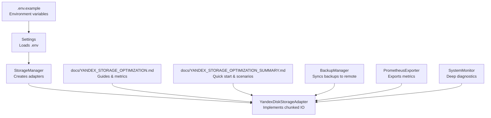
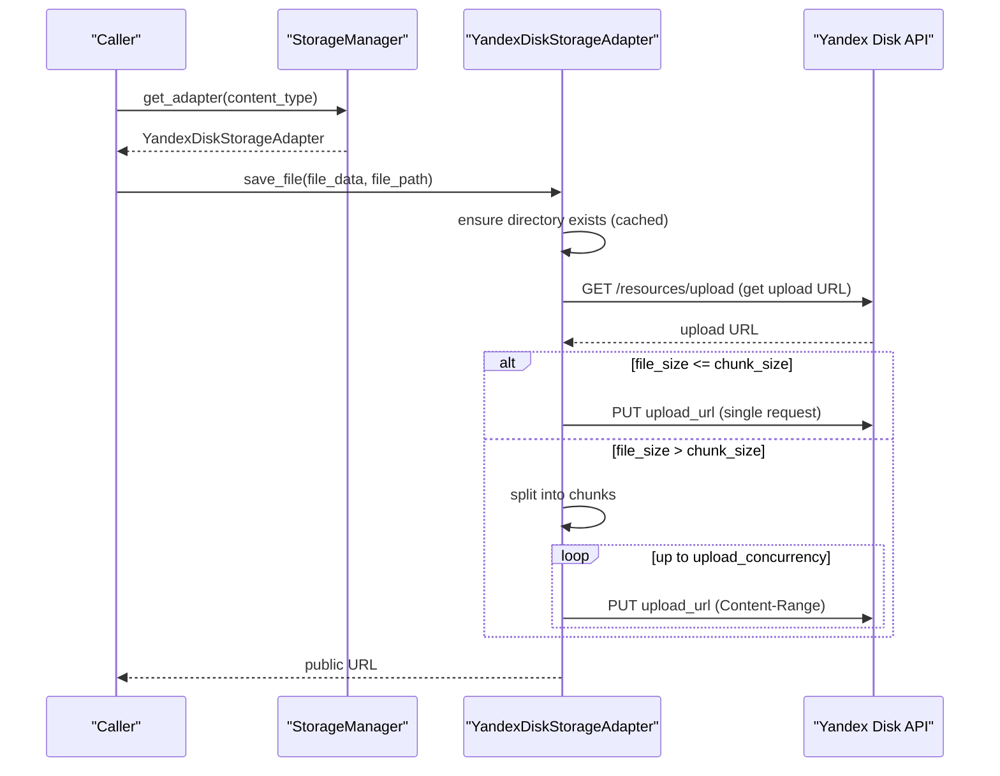
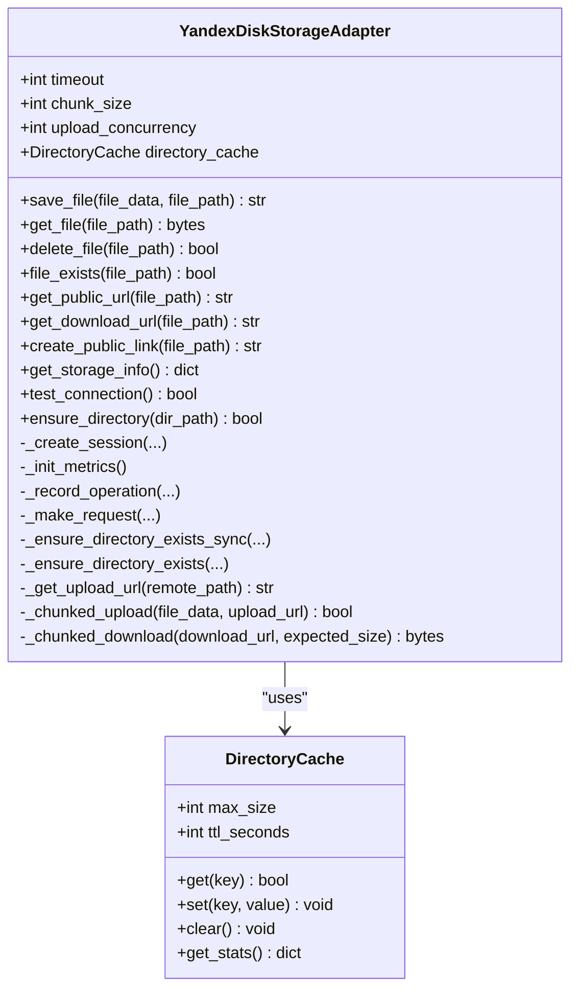
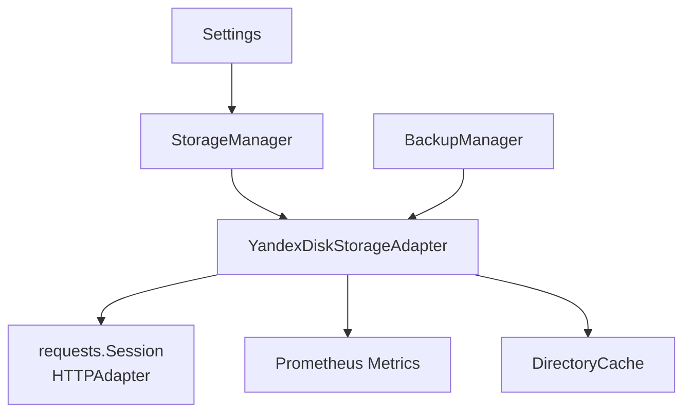

# Remote Storage Performance

<cite>
**Referenced Files in This Document**
- [vertex-ar/app/storage_yandex.py](file://vertex-ar/app/storage_yandex.py)
- [vertex-ar/storage_manager.py](file://vertex-ar/storage_manager.py)
- [vertex-ar/app/config.py](file://vertex-ar/app/config.py)
- [vertex-ar/.env.example](file://.env.example)
- [docs/YANDEX_STORAGE_OPTIMIZATION.md](file://docs/YANDEX_STORAGE_OPTIMIZATION.md)
- [docs/YANDEX_STORAGE_OPTIMIZATION_SUMMARY.md](file://docs/YANDEX_STORAGE_OPTIMIZATION_SUMMARY.md)
- [vertex-ar/backup_manager.py](file://vertex-ar/backup_manager.py)
- [vertex-ar/app/prometheus_metrics.py](file://vertex-ar/app/prometheus_metrics.py)
- [vertex-ar/app/monitoring.py](file://vertex-ar/app/monitoring.py)
- [test_files/unit/test_yandex_storage_enhanced.py](file://test_files/unit/test_yandex_storage_enhanced.py)
</cite>

## Table of Contents
1. [Introduction](#introduction)
2. [Project Structure](#project-structure)
3. [Core Components](#core-components)
4. [Architecture Overview](#architecture-overview)
5. [Detailed Component Analysis](#detailed-component-analysis)
6. [Dependency Analysis](#dependency-analysis)
7. [Performance Considerations](#performance-considerations)
8. [Troubleshooting Guide](#troubleshooting-guide)
9. [Conclusion](#conclusion)
10. [Appendices](#appendices)

## Introduction
This document explains how to optimize remote storage performance when using Yandex.Disk integration in the Vertex AR platform. It focuses on the three primary environment variables—YANDEX_REQUEST_TIMEOUT, YANDEX_CHUNK_SIZE_MB, and YANDEX_UPLOAD_CONCURRENCY—and how they influence upload and download throughput. It also details the implementation of chunked uploads and downloads, retry mechanisms, and concurrency control in the YandexDiskStorageAdapter, along with configuration recommendations, monitoring, and integration examples for backup and AR content delivery.

## Project Structure
The Yandex.Disk integration lives primarily in the storage adapter and is orchestrated by the storage manager. Configuration is centralized in application settings and documented in environment examples and operational guides.

**Diagram sources**
- [vertex-ar/storage_manager.py](file://vertex-ar/storage_manager.py#L1-L120)
- [vertex-ar/app/storage_yandex.py](file://vertex-ar/app/storage_yandex.py#L84-L145)
- [vertex-ar/app/config.py](file://vertex-ar/app/config.py#L190-L210)
- [.env.example](file://.env.example#L334-L369)
- [docs/YANDEX_STORAGE_OPTIMIZATION.md](file://docs/YANDEX_STORAGE_OPTIMIZATION.md#L38-L75)
- [docs/YANDEX_STORAGE_OPTIMIZATION_SUMMARY.md](file://docs/YANDEX_STORAGE_OPTIMIZATION_SUMMARY.md#L29-L41)
- [vertex-ar/backup_manager.py](file://vertex-ar/backup_manager.py#L731-L800)
- [vertex-ar/app/prometheus_metrics.py](file://vertex-ar/app/prometheus_metrics.py#L1-L60)

**Section sources**
- [vertex-ar/storage_manager.py](file://vertex-ar/storage_manager.py#L1-L120)
- [vertex-ar/app/storage_yandex.py](file://vertex-ar/app/storage_yandex.py#L84-L145)
- [vertex-ar/app/config.py](file://vertex-ar/app/config.py#L190-L210)
- [.env.example](file://.env.example#L334-L369)
- [docs/YANDEX_STORAGE_OPTIMIZATION.md](file://docs/YANDEX_STORAGE_OPTIMIZATION.md#L38-L75)
- [docs/YANDEX_STORAGE_OPTIMIZATION_SUMMARY.md](file://docs/YANDEX_STORAGE_OPTIMIZATION_SUMMARY.md#L29-L41)

## Core Components
- YandexDiskStorageAdapter: Implements chunked uploads/downloads, directory caching, persistent session with retries, and Prometheus metrics.
- StorageManager: Creates and manages adapters, passing tuning parameters from settings.
- Settings: Loads environment variables including YANDEX_* tunables.
- PrometheusExporter: Exposes application and system metrics for monitoring.
- SystemMonitor: Provides system-level diagnostics and integrates with alerting.

Key environment variables:
- YANDEX_REQUEST_TIMEOUT: Request timeout in seconds for Yandex API calls.
- YANDEX_CHUNK_SIZE_MB: Chunk size for uploads/downloads in megabytes.
- YANDEX_UPLOAD_CONCURRENCY: Maximum concurrent chunk uploads.
- YANDEX_DIRECTORY_CACHE_TTL and YANDEX_DIRECTORY_CACHE_SIZE: Directory existence cache policy.
- YANDEX_SESSION_POOL_CONNECTIONS and YANDEX_SESSION_POOL_MAXSIZE: Connection pool sizing for persistent sessions.

**Section sources**
- [vertex-ar/app/storage_yandex.py](file://vertex-ar/app/storage_yandex.py#L84-L145)
- [vertex-ar/storage_manager.py](file://vertex-ar/storage_manager.py#L64-L86)
- [vertex-ar/app/config.py](file://vertex-ar/app/config.py#L190-L210)
- [.env.example](file://.env.example#L334-L369)

## Architecture Overview
The adapter initializes a persistent requests.Session with retry/backoff and connection pooling. It uses a directory cache to minimize API calls for directory existence checks. For large files, it splits data into configurable chunks and uploads them concurrently, controlled by a semaphore. Metrics are recorded for operations, latency, errors, chunks, bytes, and cache behavior.

**Diagram sources**
- [vertex-ar/storage_manager.py](file://vertex-ar/storage_manager.py#L95-L123)
- [vertex-ar/app/storage_yandex.py](file://vertex-ar/app/storage_yandex.py#L367-L451)
- [vertex-ar/app/storage_yandex.py](file://vertex-ar/app/storage_yandex.py#L452-L505)

## Detailed Component Analysis

### YandexDiskStorageAdapter Implementation
- Initialization and persistence:
  - Creates a persistent session with HTTPAdapter, connection pooling, and retry strategy.
  - Sets Authorization and Accept headers once.
  - Initializes Prometheus metrics once per class.
- Directory caching:
  - LRU cache with TTL for directory existence checks.
  - Cache hits/misses counters and gauge for cache size.
- Chunked upload logic:
  - Small files (< chunk_size) use direct upload.
  - Large files are split into chunks; uploads are executed concurrently with a semaphore.
  - Uses Content-Range headers for resumable chunked uploads.
- Chunked download logic:
  - Small files (< chunk_size) use direct GET.
  - Large files use Range requests to assemble chunks.
- Metrics:
  - Operations counters, latency histogram, error counters, chunk and byte counters, cache metrics.

**Diagram sources**
- [vertex-ar/app/storage_yandex.py](file://vertex-ar/app/storage_yandex.py#L84-L145)
- [vertex-ar/app/storage_yandex.py](file://vertex-ar/app/storage_yandex.py#L33-L83)

**Section sources**
- [vertex-ar/app/storage_yandex.py](file://vertex-ar/app/storage_yandex.py#L146-L175)
- [vertex-ar/app/storage_yandex.py](file://vertex-ar/app/storage_yandex.py#L176-L271)
- [vertex-ar/app/storage_yandex.py](file://vertex-ar/app/storage_yandex.py#L272-L305)
- [vertex-ar/app/storage_yandex.py](file://vertex-ar/app/storage_yandex.py#L306-L362)
- [vertex-ar/app/storage_yandex.py](file://vertex-ar/app/storage_yandex.py#L367-L451)
- [vertex-ar/app/storage_yandex.py](file://vertex-ar/app/storage_yandex.py#L506-L560)
- [vertex-ar/app/storage_yandex.py](file://vertex-ar/app/storage_yandex.py#L803-L835)

### StorageManager Integration
- Creates YandexDiskStorageAdapter instances with tuning parameters from settings.
- Passes YANDEX_REQUEST_TIMEOUT, YANDEX_CHUNK_SIZE_MB, YANDEX_UPLOAD_CONCURRENCY, cache TTL/size, and pool sizes.

**Section sources**
- [vertex-ar/storage_manager.py](file://vertex-ar/storage_manager.py#L64-L86)
- [vertex-ar/storage_manager.py](file://vertex-ar/storage_manager.py#L317-L412)

### Environment Configuration and Tuning
- Settings load YANDEX_* variables from environment.
- .env.example documents recommended defaults and tuning guidelines.
- Operational docs provide scenario-based recommendations.

**Section sources**
- [vertex-ar/app/config.py](file://vertex-ar/app/config.py#L190-L210)
- [.env.example](file://.env.example#L334-L369)
- [docs/YANDEX_STORAGE_OPTIMIZATION.md](file://docs/YANDEX_STORAGE_OPTIMIZATION.md#L38-L75)
- [docs/YANDEX_STORAGE_OPTIMIZATION_SUMMARY.md](file://docs/YANDEX_STORAGE_OPTIMIZATION_SUMMARY.md#L29-L41)

### Monitoring and Metrics
- YandexDiskStorageAdapter records Prometheus metrics for operations, latency, errors, chunks, bytes, and cache.
- PrometheusExporter exposes system and application metrics.
- SystemMonitor provides deep diagnostics and integrates with alerting.

**Section sources**
- [vertex-ar/app/storage_yandex.py](file://vertex-ar/app/storage_yandex.py#L176-L271)
- [vertex-ar/app/prometheus_metrics.py](file://vertex-ar/app/prometheus_metrics.py#L1-L60)
- [vertex-ar/app/monitoring.py](file://vertex-ar/app/monitoring.py#L1-L120)

### Backup and AR Content Delivery Integration
- BackupManager supports splitting large backups and syncing them to remote storage.
- Yandex.Disk can be used as a remote target for backups and AR content delivery.

**Section sources**
- [vertex-ar/backup_manager.py](file://vertex-ar/backup_manager.py#L731-L800)
- [docs/YANDEX_STORAGE_OPTIMIZATION.md](file://docs/YANDEX_STORAGE_OPTIMIZATION.md#L237-L287)

## Dependency Analysis
- StorageManager depends on Settings to pass YANDEX_* parameters to YandexDiskStorageAdapter.
- YandexDiskStorageAdapter depends on:
  - requests.Session with HTTPAdapter for connection pooling and retries.
  - Prometheus metrics registry for exporting metrics.
  - DirectoryCache for reducing API calls.
- BackupManager depends on remote storage abstraction to upload split backup chunks.

**Diagram sources**
- [vertex-ar/app/config.py](file://vertex-ar/app/config.py#L190-L210)
- [vertex-ar/storage_manager.py](file://vertex-ar/storage_manager.py#L64-L86)
- [vertex-ar/app/storage_yandex.py](file://vertex-ar/app/storage_yandex.py#L146-L175)
- [vertex-ar/backup_manager.py](file://vertex-ar/backup_manager.py#L731-L800)

**Section sources**
- [vertex-ar/storage_manager.py](file://vertex-ar/storage_manager.py#L64-L86)
- [vertex-ar/app/storage_yandex.py](file://vertex-ar/app/storage_yandex.py#L146-L175)
- [vertex-ar/backup_manager.py](file://vertex-ar/backup_manager.py#L731-L800)

## Performance Considerations

### Impact of YANDEX_REQUEST_TIMEOUT
- Controls per-request timeout for Yandex API calls.
- Larger timeouts improve resilience on slow networks but may delay failure detection.
- Use larger timeouts for large files or unreliable networks.

**Section sources**
- [vertex-ar/app/config.py](file://vertex-ar/app/config.py#L190-L210)
- [vertex-ar/app/storage_yandex.py](file://vertex-ar/app/storage_yandex.py#L272-L305)
- [docs/YANDEX_STORAGE_OPTIMIZATION.md](file://docs/YANDEX_STORAGE_OPTIMIZATION.md#L48-L50)

### Impact of YANDEX_CHUNK_SIZE_MB
- Determines chunk size for uploads and downloads.
- Larger chunks increase throughput but also memory usage and risk of partial failures.
- Smaller chunks reduce memory usage and improve resilience on unstable networks.

**Section sources**
- [vertex-ar/app/config.py](file://vertex-ar/app/config.py#L190-L210)
- [vertex-ar/app/storage_yandex.py](file://vertex-ar/app/storage_yandex.py#L118-L123)
- [vertex-ar/app/storage_yandex.py](file://vertex-ar/app/storage_yandex.py#L392-L451)
- [vertex-ar/app/storage_yandex.py](file://vertex-ar/app/storage_yandex.py#L506-L560)
- [docs/YANDEX_STORAGE_OPTIMIZATION.md](file://docs/YANDEX_STORAGE_OPTIMIZATION.md#L51-L54)

### Impact of YANDEX_UPLOAD_CONCURRENCY
- Controls maximum concurrent chunk uploads.
- Higher concurrency improves throughput for large files but increases CPU and memory usage.
- Lower concurrency reduces resource usage and improves stability.

**Section sources**
- [vertex-ar/app/config.py](file://vertex-ar/app/config.py#L190-L210)
- [vertex-ar/app/storage_yandex.py](file://vertex-ar/app/storage_yandex.py#L404-L451)
- [test_files/unit/test_yandex_storage_enhanced.py](file://test_files/unit/test_yandex_storage_enhanced.py#L234-L261)

### Benchmarking Guidance
- Use Prometheus metrics to compare throughput and latency under different configurations.
- Monitor cache hit rate to assess directory cache effectiveness.
- Validate chunked behavior with unit tests that assert chunk counts and Content-Range headers.

**Section sources**
- [docs/YANDEX_STORAGE_OPTIMIZATION.md](file://docs/YANDEX_STORAGE_OPTIMIZATION.md#L420-L460)
- [test_files/unit/test_yandex_storage_enhanced.py](file://test_files/unit/test_yandex_storage_enhanced.py#L182-L277)

## Troubleshooting Guide

### Timeout Errors
- Symptoms: frequent timeout errors in logs and metrics.
- Diagnosis: check error metrics and current timeout setting.
- Solutions: increase YANDEX_REQUEST_TIMEOUT or reduce chunk size for faster individual requests.

**Section sources**
- [docs/YANDEX_STORAGE_OPTIMIZATION.md](file://docs/YANDEX_STORAGE_OPTIMIZATION.md#L486-L507)
- [vertex-ar/app/storage_yandex.py](file://vertex-ar/app/storage_yandex.py#L286-L301)

### High Memory Usage During Uploads
- Symptoms: memory spikes during uploads.
- Diagnosis: inspect current chunk size and monitor memory.
- Solutions: reduce YANDEX_CHUNK_SIZE_MB and/or YANDEX_UPLOAD_CONCURRENCY.

**Section sources**
- [docs/YANDEX_STORAGE_OPTIMIZATION.md](file://docs/YANDEX_STORAGE_OPTIMIZATION.md#L464-L485)

### Low Cache Hit Rate
- Symptoms: low cache hit rate and high API call volume.
- Diagnosis: check cache statistics and settings.
- Solutions: increase YANDEX_DIRECTORY_CACHE_SIZE and/or YANDEX_DIRECTORY_CACHE_TTL; flush and rebuild cache if needed.

**Section sources**
- [docs/YANDEX_STORAGE_OPTIMIZATION.md](file://docs/YANDEX_STORAGE_OPTIMIZATION.md#L508-L531)

### Connection Pool Exhaustion
- Symptoms: errors indicating connection pool is full.
- Diagnosis: review pool settings and concurrent connections.
- Solutions: increase YANDEX_SESSION_POOL_CONNECTIONS and YANDEX_SESSION_POOL_MAXSIZE.

**Section sources**
- [docs/YANDEX_STORAGE_OPTIMIZATION.md](file://docs/YANDEX_STORAGE_OPTIMIZATION.md#L533-L553)

### Partial Uploads and Resilience
- Use chunked uploads with Content-Range headers for resumable transfers.
- Monitor chunk and byte counters to detect partial progress.
- Ensure adequate YANDEX_REQUEST_TIMEOUT for large files.

**Section sources**
- [vertex-ar/app/storage_yandex.py](file://vertex-ar/app/storage_yandex.py#L404-L451)
- [vertex-ar/app/storage_yandex.py](file://vertex-ar/app/storage_yandex.py#L452-L505)

## Conclusion
By tuning YANDEX_REQUEST_TIMEOUT, YANDEX_CHUNK_SIZE_MB, and YANDEX_UPLOAD_CONCURRENCY, and leveraging directory caching, persistent sessions, and chunked transfers, the Yandex.Disk integration achieves significant improvements in throughput, memory efficiency, and reliability. Combine these settings with comprehensive monitoring and alerting to maintain optimal performance and detect issues early.

## Appendices

### Configuration Recommendations by Scenario
- High traffic (100+ concurrent users): increase pool sizes and upload concurrency.
- Large media files (100MB+ videos): increase chunk size and request timeout.
- Memory-constrained environments (<2GB RAM): reduce chunk size and concurrency.
- Complex folder hierarchies (1000+ folders): increase cache size and TTL.
- Slow/unreliable networks: increase timeout and reduce chunk size; lower concurrency.

**Section sources**
- [docs/YANDEX_STORAGE_OPTIMIZATION.md](file://docs/YANDEX_STORAGE_OPTIMIZATION.md#L79-L115)
- [docs/YANDEX_STORAGE_OPTIMIZATION_SUMMARY.md](file://docs/YANDEX_STORAGE_OPTIMIZATION_SUMMARY.md#L59-L78)

### Monitoring and Alerting
- Exported metrics include operation totals, latency histogram, error totals, chunk and byte counters, and cache metrics.
- Use Grafana dashboards to track operation rates, error rates, P95 latency, and cache hit rate.
- Configure Prometheus alerts for high error rates, slow operations, and low cache hit rate.

**Section sources**
- [vertex-ar/app/storage_yandex.py](file://vertex-ar/app/storage_yandex.py#L176-L271)
- [docs/YANDEX_STORAGE_OPTIMIZATION.md](file://docs/YANDEX_STORAGE_OPTIMIZATION.md#L290-L359)
- [docs/YANDEX_STORAGE_OPTIMIZATION_SUMMARY.md](file://docs/YANDEX_STORAGE_OPTIMIZATION_SUMMARY.md#L87-L114)

### Integration Examples
- Backup workflows: split large backups and upload chunks to Yandex.Disk.
- AR content delivery: use adapter to store and serve media files with public URLs.

**Section sources**
- [vertex-ar/backup_manager.py](file://vertex-ar/backup_manager.py#L731-L800)
- [vertex-ar/app/storage_yandex.py](file://vertex-ar/app/storage_yandex.py#L697-L713)
- [docs/YANDEX_STORAGE_OPTIMIZATION.md](file://docs/YANDEX_STORAGE_OPTIMIZATION.md#L237-L287)