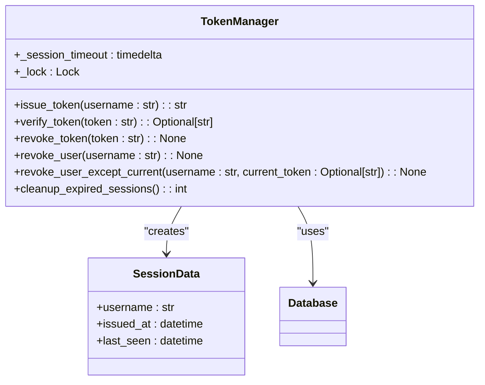
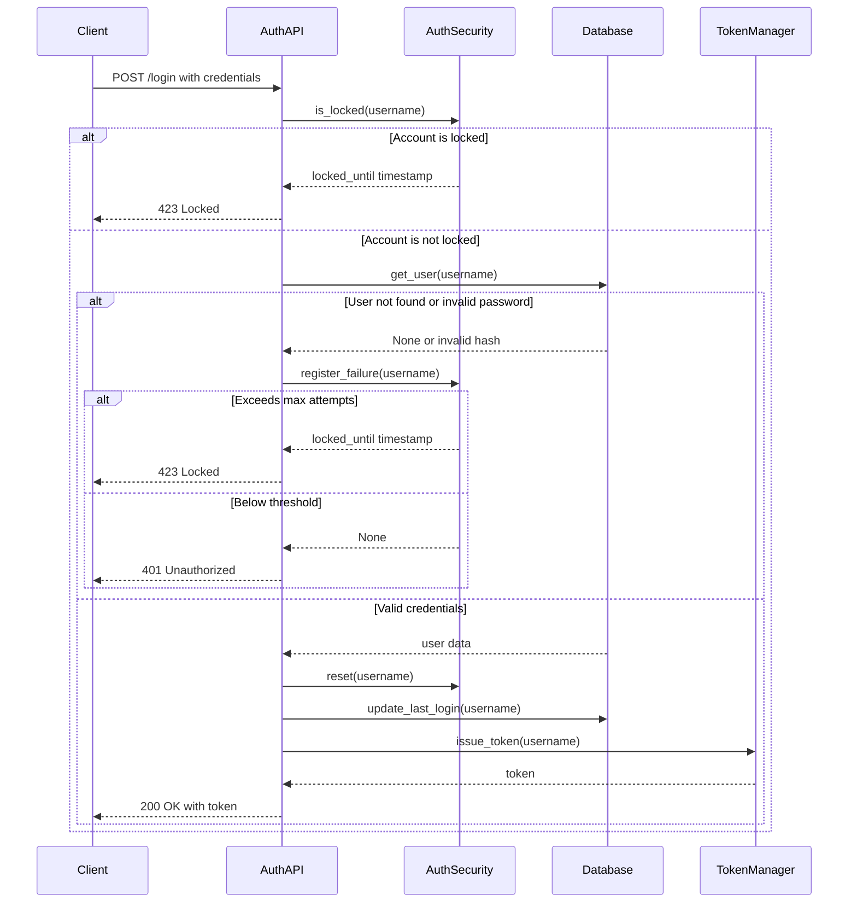
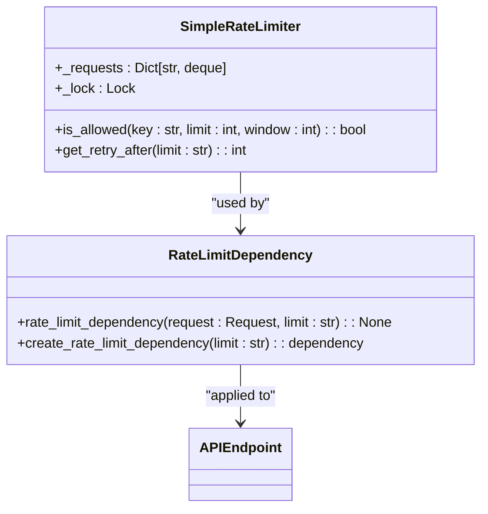

# Authentication Security

<cite>
**Referenced Files in This Document**   
- [auth.py](file://vertex-ar/app/auth.py)
- [api/auth.py](file://vertex-ar/app/api/auth.py)
- [config.py](file://vertex-ar/app/config.py)
- [database.py](file://vertex-ar/app/database.py)
- [.env.example](file://vertex-ar/.env.example)
- [.env.production.example](file://vertex-ar/.env.production.example)
- [rate_limiter.py](file://vertex-ar/app/rate_limiter.py)
- [test_auth.py](file://test_files/unit/test_auth.py)
</cite>

## Table of Contents
1. [Introduction](#introduction)
2. [Session Management](#session-management)
3. [Brute Force Protection](#brute-force-protection)
4. [JWT Token Validity](#jwt-token-validity)
5. [Rate Limiting](#rate-limiting)
6. [Default Admin Credentials](#default-admin-credentials)
7. [Secure Configuration Examples](#secure-configuration-examples)
8. [Common Misconfigurations](#common-misconfigurations)
9. [Credential Rotation and Monitoring](#credential-rotation-and-monitoring)
10. [Conclusion](#conclusion)

## Introduction
This document provides comprehensive documentation for authentication-related security settings in the Vertex AR application. The security framework is designed to protect against common threats such as brute force attacks, session hijacking, and credential compromise. The implementation includes multiple layers of protection: session management with configurable timeouts, brute force protection with account lockout mechanisms, JWT token validity controls, rate limiting for authentication endpoints, and secure handling of default administrative credentials.

The authentication security system is configured through environment variables that can be customized for different deployment environments. These settings are loaded into the application configuration and used to initialize security components at runtime. The system is designed to be both secure by default and configurable for specific security requirements in production environments.

The core security components are implemented in several key files: `auth.py` contains the main authentication classes, `api/auth.py` implements the authentication endpoints, `config.py` manages the configuration settings, and `database.py` handles persistent storage of session data and user information. The implementation follows security best practices including secure password hashing, token-based authentication, and comprehensive logging of authentication events.

**Section sources**
- [auth.py](file://vertex-ar/app/auth.py#L1-L153)
- [api/auth.py](file://vertex-ar/app/api/auth.py#L1-L192)
- [config.py](file://vertex-ar/app/config.py#L1-L244)

## Session Management
The Vertex AR application implements session management through the `TokenManager` class, which handles the creation, validation, and revocation of authentication tokens. Session timeout is controlled by the `SESSION_TIMEOUT_MINUTES` environment variable, which defaults to 30 minutes. This setting determines how long a user session remains active before requiring re-authentication.

The `TokenManager` class creates cryptographically secure tokens using `secrets.token_urlsafe(32)` and stores session information in the database to ensure compatibility across Uvicorn workers. Each session includes the username, issuance timestamp, and last seen timestamp, which is updated on each request to extend the session. The session timeout is implemented as a sliding window - each successful token verification updates the last seen timestamp, effectively extending the session duration.

Sessions are stored in the `admin_sessions` database table, which includes fields for the token, username, issuance timestamp, last seen timestamp, expiration timestamp, and revocation status. This persistent storage approach ensures that sessions survive application restarts and are consistent across multiple application instances. The database storage also enables centralized session management, allowing administrators to revoke sessions across the entire system.

The session management system includes several security features:
- Tokens are cryptographically secure and unpredictable
- Sessions are stored securely in the database with appropriate indexing
- Expired sessions are automatically cleaned up
- Sessions can be revoked individually or for all sessions of a specific user
- The system supports revoking all sessions except the current one, which is useful for "log out from other devices" functionality



**Diagram sources**
- [auth.py](file://vertex-ar/app/auth.py#L27-L103)
- [database.py](file://vertex-ar/app/database.py#L1025-L1109)

**Section sources**
- [auth.py](file://vertex-ar/app/auth.py#L27-L103)
- [database.py](file://vertex-ar/app/database.py#L1025-L1109)

## Brute Force Protection
The Vertex AR application implements brute force protection through the `AuthSecurityManager` class, which tracks failed login attempts and enforces temporary account lockouts. This protection is configured through two environment variables: `AUTH_MAX_ATTEMPTS` (default: 5) and `AUTH_LOCKOUT_MINUTES` (default: 15). When a user exceeds the maximum number of failed attempts, their account is locked for the specified lockout duration.

The `AuthSecurityManager` maintains two dictionaries in memory: `_failed_attempts` to track the number of consecutive failed attempts for each user, and `_lockouts` to track when accounts are locked and when the lockout period expires. The implementation uses thread-safe operations with a threading lock to prevent race conditions in multi-threaded environments. When a failed login attempt is registered, the system checks if the user is already locked out, increments the failure counter, and locks the account if the threshold is exceeded.

The brute force protection system includes several important features:
- Lockout duration is configurable and defaults to 15 minutes
- Failed attempt counter is reset when a successful login occurs
- Lockout state is automatically cleaned up when the lockout period expires
- The system prevents additional failed attempts from extending an existing lockout period
- Comprehensive logging of failed attempts and lockout events

The implementation is integrated with the authentication endpoints in `api/auth.py`, where the `login_user` function checks if an account is locked before processing credentials and registers failed attempts when invalid credentials are provided. The system returns appropriate HTTP status codes: 423 Locked when an account is locked and 401 Unauthorized for invalid credentials.



**Diagram sources**
- [auth.py](file://vertex-ar/app/auth.py#L105-L153)
- [api/auth.py](file://vertex-ar/app/api/auth.py#L109-L170)

**Section sources**
- [auth.py](file://vertex-ar/app/auth.py#L105-L153)
- [api/auth.py](file://vertex-ar/app/api/auth.py#L109-L170)
- [test_auth.py](file://test_files/unit/test_auth.py#L140-L266)

## JWT Token Validity
JWT token validity in the Vertex AR application is controlled by the `TOKEN_EXPIRATION_HOURS` environment variable, which determines how long issued tokens remain valid before requiring renewal. The default value is 24 hours, as specified in the `.env.example` and `.env.production.example` configuration files. This setting is implemented through the session timeout mechanism in the `TokenManager` class.

Tokens are issued as URL-safe base64-encoded strings generated using Python's `secrets` module, providing strong cryptographic security. Each token is associated with a session in the database that includes an expiration timestamp calculated as the current time plus the session timeout duration. The token itself does not contain the expiration information; instead, validation is performed by checking the database record.

The token validation process involves several steps:
1. Extract the token from the Authorization header or authToken cookie
2. Query the database for the corresponding session
3. Verify that the session exists, is not revoked, and has not expired
4. Update the last seen timestamp to extend the session
5. Return the associated username if validation succeeds

This database-backed approach to token validation provides several advantages over stateless JWT tokens:
- Immediate revocation capability
- Centralized session management
- Ability to modify session properties without changing the token format
- Enhanced security through database-level access controls

The system also supports token revocation through logout operations and administrative actions. When a user logs out, the token is marked as revoked in the database. Administrators can revoke all tokens for a user or all tokens except the current one, providing flexibility in session management.

**Section sources**
- [.env.example](file://vertex-ar/.env.example#L121-L122)
- [.env.production.example](file://vertex-ar/.env.production.example#L62)
- [auth.py](file://vertex-ar/app/auth.py#L27-L103)

## Rate Limiting
The Vertex AR application implements rate limiting for authentication endpoints through a custom rate limiting system that replaces SlowAPI to avoid compatibility issues. The rate limiting is configured through the `AUTH_RATE_LIMIT` environment variable, which defaults to "5/minute". This setting is applied to both the `/login` and `/logout` endpoints to prevent abuse and protect against brute force attacks.

The rate limiting system is implemented in `rate_limiter.py` using a `SimpleRateLimiter` class that tracks requests in memory using a dictionary of deques. Each request is identified by a key that combines the client IP address and the requested endpoint path. The system checks if the number of requests from a given key within the specified time window exceeds the configured limit.

The rate limiting configuration interacts with the global rate limiter settings:
- `RATE_LIMIT_ENABLED`: Global toggle for rate limiting (defaults to True)
- `GLOBAL_RATE_LIMIT`: Default rate limit for all endpoints (defaults to "100/minute")
- `AUTH_RATE_LIMIT`: Specific rate limit for authentication endpoints (defaults to "5/minute")
- `UPLOAD_RATE_LIMIT`: Rate limit for file upload endpoints (defaults to "10/minute")

The implementation uses a dependency injection pattern where `create_rate_limit_dependency` generates FastAPI dependency functions with specific rate limits. For authentication endpoints, this dependency is applied with the `AUTH_RATE_LIMIT` value, ensuring that login attempts are rate-limited independently of other application endpoints.

When a rate limit is exceeded, the system returns an HTTP 429 Too Many Requests status code with a Retry-After header indicating when the client can retry. This provides clear feedback to clients while enforcing the rate limits. The rate limiting system is disabled during testing to prevent interference with automated tests.



**Diagram sources**
- [rate_limiter.py](file://vertex-ar/app/rate_limiter.py#L13-L124)
- [api/auth.py](file://vertex-ar/app/api/auth.py#L109-L110)

**Section sources**
- [rate_limiter.py](file://vertex-ar/app/rate_limiter.py#L13-L124)
- [api/auth.py](file://vertex-ar/app/api/auth.py#L109-L110)
- [config.py](file://vertex-ar/app/config.py#L48-L53)

## Default Admin Credentials
The Vertex AR application includes default administrative credentials that are automatically seeded for initial access to the admin panel. These credentials are defined by several environment variables:
- `DEFAULT_ADMIN_USERNAME`: Defaults to "superar"
- `DEFAULT_ADMIN_PASSWORD`: Defaults to "ffE48f0ns@HQ"
- `DEFAULT_ADMIN_EMAIL`: Defaults to "superar@vertex-ar.local"
- `DEFAULT_ADMIN_FULL_NAME`: Defaults to "Super Administrator"

These default credentials are automatically created or updated when the application starts, ensuring that an administrative account is always available. The system checks for the existence of the default admin user and creates it if missing, or updates the password if it differs from the configured value. This ensures consistent access to the administrative interface while allowing password changes through configuration.

The use of default passwords in production poses significant security risks:
- Well-known default credentials are a common attack vector
- Automated scanners specifically target systems with default admin accounts
- Default passwords are often weak and easily guessable
- They provide a persistent entry point even if other accounts are secured

To mitigate these risks, the application should be configured with strong, unique administrative credentials before deployment to production environments. The default credentials should be changed immediately after initial setup, and the environment variables should be updated accordingly. Additionally, organizations should implement a credential rotation policy to periodically change administrative passwords.

The system logs all authentication attempts, including those using the default admin credentials, providing an audit trail for security monitoring. Administrators should regularly review these logs for suspicious activity, particularly failed login attempts targeting the default admin account.

**Section sources**
- [.env.example](file://vertex-ar/.env.example#L128-L132)
- [.env.production.example](file://vertex-ar/.env.production.example#L66-L69)
- [config.py](file://vertex-ar/app/config.py#L168-L172)
- [database.py](file://vertex-ar/app/database.py#L988-L1022)

## Secure Configuration Examples
For production deployments of the Vertex AR application, it is essential to configure authentication security settings appropriately to balance security and usability. The following examples demonstrate secure configuration practices for different deployment scenarios.

For a standard production environment, the following configuration is recommended:
```
# Security Settings
SESSION_TIMEOUT_MINUTES=15
AUTH_MAX_ATTEMPTS=3
AUTH_LOCKOUT_MINUTES=30
TOKEN_EXPIRATION_HOURS=8
AUTH_RATE_LIMIT=3/minute
RATE_LIMIT_ENABLED=True
DEFAULT_ADMIN_PASSWORD=generate-a-secure-random-password
```

For high-security environments such as financial or healthcare applications:
```
# High Security Settings
SESSION_TIMEOUT_MINUTES=10
AUTH_MAX_ATTEMPTS=3
AUTH_LOCKOUT_MINUTES=60
TOKEN_EXPIRATION_HOURS=4
AUTH_RATE_LIMIT=2/minute
RATE_LIMIT_ENABLED=True
DEFAULT_ADMIN_PASSWORD=generate-a-very-strong-random-password
```

For environments with trusted users and usability requirements:
```
# Balanced Security Settings
SESSION_TIMEOUT_MINUTES=30
AUTH_MAX_ATTEMPTS=5
AUTH_LOCKOUT_MINUTES=15
TOKEN_EXPIRATION_HOURS=12
AUTH_RATE_LIMIT=5/minute
RATE_LIMIT_ENABLED=True
DEFAULT_ADMIN_PASSWORD=generate-a-secure-random-password
```

Key recommendations for production configuration:
- Set `SESSION_TIMEOUT_MINUTES` between 10-30 minutes based on security requirements
- Configure `AUTH_MAX_ATTEMPTS` to 3-5 to prevent brute force attacks while allowing for user mistakes
- Set `AUTH_LOCKOUT_MINUTES` to at least 15 minutes, with 30 minutes recommended for high-security environments
- Configure `TOKEN_EXPIRATION_HOURS` between 4-12 hours to balance security and user convenience
- Set `AUTH_RATE_LIMIT` to 3-5 requests per minute to prevent abuse while allowing legitimate use
- Always change the default admin password to a strong, randomly generated password
- Enable rate limiting in production by setting `RATE_LIMIT_ENABLED=True`

These configurations should be set in the `.env` file for production deployments, with sensitive values like passwords generated using secure random methods.

**Section sources**
- [.env.example](file://vertex-ar/.env.example)
- [.env.production.example](file://vertex-ar/.env.production.example)
- [config.py](file://vertex-ar/app/config.py#L42-L53)

## Common Misconfigurations
Several common misconfigurations can compromise the security of the Vertex AR application's authentication system. Identifying and addressing these issues is critical for maintaining a secure deployment.

**Insufficient lockout periods**: Setting `AUTH_LOCKOUT_MINUTES` to values less than 15 minutes significantly reduces the effectiveness of brute force protection. Short lockout periods allow attackers to continue automated attacks with minimal interruption. The recommended minimum is 15 minutes, with 30 minutes or more preferred for high-security environments.

**Excessively long token lifetimes**: Configuring `TOKEN_EXPIRATION_HOURS` to values greater than 24 hours increases the window of opportunity for token theft and misuse. Long-lived tokens are more likely to be compromised through various attack vectors. The recommended maximum is 12 hours, with shorter durations (4-8 hours) preferred for sensitive applications.

**Disabled rate limiting**: Setting `RATE_LIMIT_ENABLED=False` in production removes an important layer of protection against automated attacks. Rate limiting should always be enabled in production environments to prevent brute force attacks and denial-of-service attempts.

**Default passwords in production**: Using the default `DEFAULT_ADMIN_PASSWORD` in production environments is a critical security risk. Default credentials are well-known and actively targeted by automated scanners. The default password must be changed before deploying to production.

**Inadequate session timeouts**: Setting `SESSION_TIMEOUT_MINUTES` to values greater than 60 minutes increases the risk of session hijacking. Long session durations mean that compromised sessions remain valid for extended periods. The recommended maximum is 30 minutes.

**Overly permissive rate limits**: Configuring `AUTH_RATE_LIMIT` to values greater than "10/minute" reduces the effectiveness of rate limiting. High rate limits allow attackers to perform more login attempts before being blocked. The recommended maximum is "5/minute" for most environments.

**Missing monitoring**: Failing to monitor authentication logs for suspicious activity prevents early detection of attacks. Organizations should implement logging and monitoring to detect patterns of failed login attempts and other suspicious behavior.

Addressing these common misconfigurations is essential for maintaining the security of the Vertex AR application in production environments.

**Section sources**
- [.env.example](file://vertex-ar/.env.example)
- [config.py](file://vertex-ar/app/config.py#L42-L53)
- [api/auth.py](file://vertex-ar/app/api/auth.py#L109-L170)

## Credential Rotation and Monitoring
Effective security practices for the Vertex AR application include regular credential rotation and comprehensive monitoring of authentication activities. These practices help mitigate the risk of credential compromise and enable early detection of security incidents.

**Credential rotation** should follow these guidelines:
- Rotate the default admin password immediately after initial setup
- Implement a regular rotation schedule (e.g., every 90 days) for administrative accounts
- Use strong, randomly generated passwords with at least 12 characters including uppercase, lowercase, numbers, and special characters
- Store passwords securely using the application's encrypted storage mechanisms
- Update the `DEFAULT_ADMIN_PASSWORD` environment variable when rotating credentials
- Consider implementing multi-factor authentication for administrative accounts

**Authentication monitoring** should include:
- Regular review of authentication logs for patterns of failed login attempts
- Monitoring for repeated failed attempts from the same IP address
- Alerting on successful logins from unusual locations or at unusual times
- Tracking account lockout events to identify potential attack patterns
- Monitoring for rapid succession of login attempts across multiple accounts (horizontal brute force)
- Reviewing session creation and termination patterns for anomalies

The application provides comprehensive logging of authentication events through the `logger` instance in `api/auth.py`. Key events that should be monitored include:
- `login_attempt`: Records each login attempt with username and client IP
- `login_failed_account_locked`: Logs when an account is locked due to multiple failed attempts
- `login_failed_invalid_credentials`: Logs failed login attempts with invalid credentials
- `login_successful`: Logs successful login events
- `logout_successful`: Logs successful logout events

Organizations should implement log aggregation and analysis tools to process these authentication logs and generate alerts for suspicious activity. Regular security audits should include review of authentication logs and verification that credential rotation policies are being followed.

**Section sources**
- [api/auth.py](file://vertex-ar/app/api/auth.py#L17-L192)
- [config.py](file://vertex-ar/app/config.py#L168-L172)
- [database.py](file://vertex-ar/app/database.py#L988-L1022)

## Conclusion
The Vertex AR application implements a comprehensive authentication security framework designed to protect against common threats while providing flexibility for different deployment scenarios. The system combines multiple security controls including session management, brute force protection, JWT token validity, rate limiting, and secure credential handling.

Key security features include configurable session timeouts, account lockout mechanisms for brute force protection, database-backed token validation, rate limiting for authentication endpoints, and secure handling of default administrative credentials. These features are configured through environment variables that can be customized for specific security requirements.

For production deployments, it is essential to configure these security settings appropriately, avoiding common misconfigurations such as insufficient lockout periods, excessively long token lifetimes, disabled rate limiting, and the use of default passwords. Organizations should implement secure configuration practices, regular credential rotation, and comprehensive monitoring of authentication activities.

The authentication security system provides a solid foundation for protecting the Vertex AR application, but its effectiveness depends on proper configuration and ongoing security practices. By following the recommendations outlined in this document, organizations can significantly enhance the security of their Vertex AR deployments.