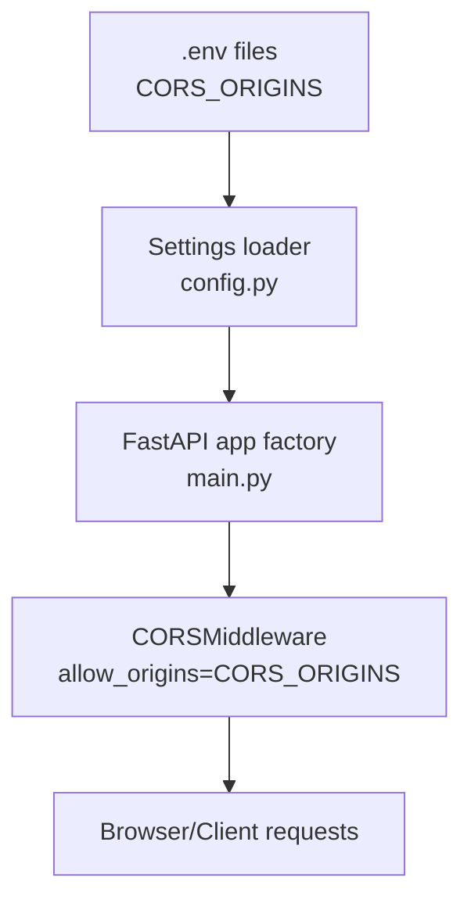
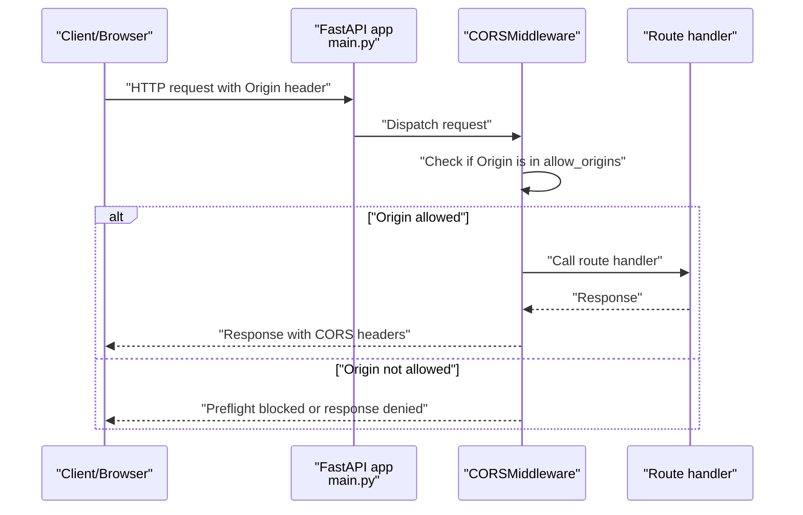
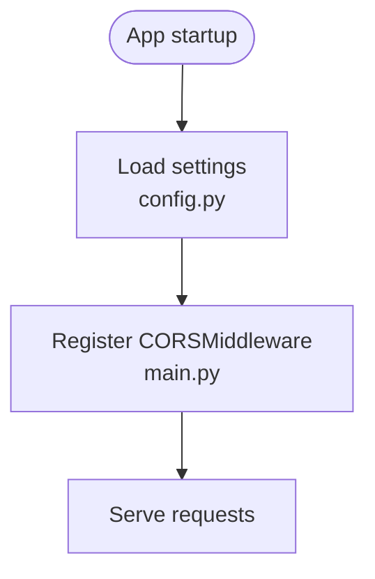
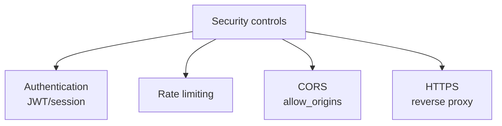
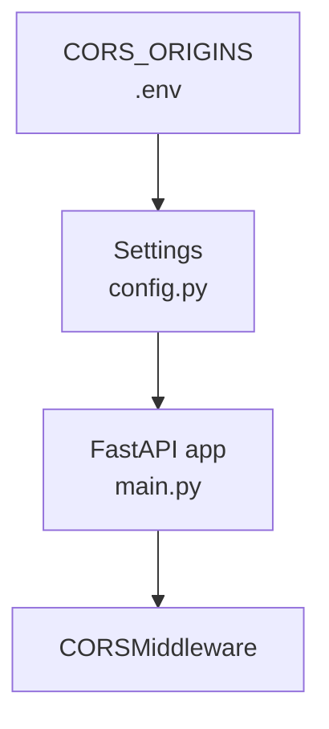

# CORS Security

<cite>
**Referenced Files in This Document**
- [middleware.py](file://vertex-ar/app/middleware.py)
- [main.py](file://vertex-ar/app/main.py)
- [config.py](file://vertex-ar/app/config.py)
- [.env.example](file://vertex-ar/.env.example)
- [.env.production.example](file://vertex-ar/.env.production.example)
- [production-setup.md](file://docs/deployment/production-setup.md)
- [SECURITY.md](file://SECURITY.md)
- [auth.py](file://vertex-ar/app/auth.py)
</cite>

## Table of Contents
1. [Introduction](#introduction)
2. [Project Structure](#project-structure)
3. [Core Components](#core-components)
4. [Architecture Overview](#architecture-overview)
5. [Detailed Component Analysis](#detailed-component-analysis)
6. [Dependency Analysis](#dependency-analysis)
7. [Performance Considerations](#performance-considerations)
8. [Troubleshooting Guide](#troubleshooting-guide)
9. [Conclusion](#conclusion)
10. [Appendices](#appendices)

## Introduction
This document explains Cross-Origin Resource Sharing (CORS) security configuration in the Vertex AR application. It focuses on the CORS_ORIGINS environment variable, how it controls which domains can access the API, and the security implications of different origin configurations. It also documents how CORS is implemented in the application, how to configure multiple origins for complex deployments, and how CORS relates to other security controls such as authentication and rate limiting.

## Project Structure
CORS configuration is centralized in the application settings and applied via FastAPI’s built-in CORS middleware. The environment variables define allowed origins, and the application factory registers the middleware with those origins.

**Diagram sources**
- [config.py](file://vertex-ar/app/config.py#L54-L58)
- [main.py](file://vertex-ar/app/main.py#L64-L74)
- [.env.example](file://vertex-ar/.env.example#L118-L120)
- [.env.production.example](file://vertex-ar/.env.production.example#L61-L61)

**Section sources**
- [config.py](file://vertex-ar/app/config.py#L54-L58)
- [main.py](file://vertex-ar/app/main.py#L64-L74)
- [.env.example](file://vertex-ar/.env.example#L118-L120)
- [.env.production.example](file://vertex-ar/.env.production.example#L61-L61)

## Core Components
- CORS_ORIGINS environment variable defines allowed origins. It is parsed into a list and passed to FastAPI’s CORSMiddleware.
- The application factory registers CORSMiddleware with allow_origins set to the configured list, allowing credentials and common headers/methods.
- Security guidance is documented in SECURITY.md and production deployment docs.

Key implementation references:
- CORS_ORIGINS parsing and assignment: [config.py](file://vertex-ar/app/config.py#L54-L58)
- CORSMiddleware registration: [main.py](file://vertex-ar/app/main.py#L64-L74)
- Environment examples and production guidance: [.env.example](file://vertex-ar/.env.example#L118-L120), [.env.production.example](file://vertex-ar/.env.production.example#L61-L61)
- Security policy and checklist: [SECURITY.md](file://SECURITY.md#L36-L42), [SECURITY.md](file://SECURITY.md#L57-L65)

**Section sources**
- [config.py](file://vertex-ar/app/config.py#L54-L58)
- [main.py](file://vertex-ar/app/main.py#L64-L74)
- [.env.example](file://vertex-ar/.env.example#L118-L120)
- [.env.production.example](file://vertex-ar/.env.production.example#L61-L61)
- [SECURITY.md](file://SECURITY.md#L36-L42)
- [SECURITY.md](file://SECURITY.md#L57-L65)

## Architecture Overview
The CORS configuration is applied at the FastAPI layer. Origins are loaded from environment variables and enforced by the CORSMiddleware. This ensures that only trusted origins can access the API, preventing cross-origin attacks.

**Diagram sources**
- [main.py](file://vertex-ar/app/main.py#L64-L74)
- [config.py](file://vertex-ar/app/config.py#L54-L58)

## Detailed Component Analysis

### CORS_ORIGINS Purpose and Behavior
- Purpose: Controls which domains (origins) are permitted to access the API. This prevents unauthorized cross-origin requests.
- Parsing: The environment variable is split by commas and stripped of whitespace to form a list of origins.
- Middleware: CORSMiddleware is configured with allow_origins set to this list, enabling credentials and common headers/methods.

Implementation references:
- Origin parsing: [config.py](file://vertex-ar/app/config.py#L54-L58)
- Middleware configuration: [main.py](file://vertex-ar/app/main.py#L64-L74)

Security implications:
- Wildcard origins (*) are convenient for development but dangerous in production because they allow any domain to access the API.
- Production guidance recommends explicit, secure origins.

Production examples:
- Development template allows wildcard for convenience: [.env.example](file://vertex-ar/.env.example#L118-L120)
- Production template demonstrates explicit origins: [.env.production.example](file://vertex-ar/.env.production.example#L61-L61)
- Deployment guide emphasizes setting BASE_URL and CORS_ORIGINS appropriately: [production-setup.md](file://docs/deployment/production-setup.md#L75-L82)

**Section sources**
- [config.py](file://vertex-ar/app/config.py#L54-L58)
- [main.py](file://vertex-ar/app/main.py#L64-L74)
- [.env.example](file://vertex-ar/.env.example#L118-L120)
- [.env.production.example](file://vertex-ar/.env.production.example#L61-L61)
- [production-setup.md](file://docs/deployment/production-setup.md#L75-L82)

### Implementation Details from main.py
The application factory registers CORSMiddleware with:
- allow_origins: loaded from settings.CORS_ORIGINS
- allow_credentials: True
- allow_methods: GET, POST, PUT, DELETE, PATCH, OPTIONS
- allow_headers: Authorization, Content-Type

This ensures that authenticated requests from allowed origins can reach protected endpoints.

**Diagram sources**
- [config.py](file://vertex-ar/app/config.py#L54-L58)
- [main.py](file://vertex-ar/app/main.py#L64-L74)

**Section sources**
- [main.py](file://vertex-ar/app/main.py#L64-L74)
- [config.py](file://vertex-ar/app/config.py#L54-L58)

### Configuring Multiple Origins for Complex Deployments
Common scenarios:
- Admin web UI and mobile app served from the same domain or subdomains
- Third-party integrations requiring specific origins
- Staging and production domains

Guidance:
- Define all trusted origins in CORS_ORIGINS as a comma-separated list.
- Include www variants and subdomains if applicable.
- Keep origins as narrow as possible to minimize risk.

References:
- Multi-origin example in production template: [.env.production.example](file://vertex-ar/.env.production.example#L61-L61)
- Security checklist emphasizing restricted CORS: [SECURITY.md](file://SECURITY.md#L57-L65)

**Section sources**
- [.env.production.example](file://vertex-ar/.env.production.example#L61-L61)
- [SECURITY.md](file://SECURITY.md#L57-L65)

### Relationship Between CORS and Other Security Controls
- Authentication: JWT tokens and session management protect access to resources. CORS does not replace authentication; both must be configured.
  - Token management and verification: [auth.py](file://vertex-ar/app/auth.py#L27-L103)
- Rate limiting: Protects endpoints from abuse regardless of origin.
- HTTPS: Enforced at the reverse proxy layer to prevent downgrade attacks and ensure secure transport.
  - Deployment guide references HTTPS and proxy headers: [production-setup.md](file://docs/deployment/production-setup.md#L175-L213)

**Diagram sources**
- [auth.py](file://vertex-ar/app/auth.py#L27-L103)
- [production-setup.md](file://docs/deployment/production-setup.md#L175-L213)

**Section sources**
- [auth.py](file://vertex-ar/app/auth.py#L27-L103)
- [production-setup.md](file://docs/deployment/production-setup.md#L175-L213)

## Dependency Analysis
CORS depends on environment configuration and FastAPI middleware registration.

**Diagram sources**
- [.env.example](file://vertex-ar/.env.example#L118-L120)
- [.env.production.example](file://vertex-ar/.env.production.example#L61-L61)
- [config.py](file://vertex-ar/app/config.py#L54-L58)
- [main.py](file://vertex-ar/app/main.py#L64-L74)

**Section sources**
- [.env.example](file://vertex-ar/.env.example#L118-L120)
- [.env.production.example](file://vertex-ar/.env.production.example#L61-L61)
- [config.py](file://vertex-ar/app/config.py#L54-L58)
- [main.py](file://vertex-ar/app/main.py#L64-L74)

## Performance Considerations
- CORS preflight requests add overhead; keep allow_origins minimal to reduce unnecessary preflights.
- Avoid wildcard origins in production to prevent excessive preflight traffic and potential abuse.
- Combine CORS with rate limiting and authentication to reduce load from malicious origins.

[No sources needed since this section provides general guidance]

## Troubleshooting Guide
Common issues and resolutions:
- Preflight blocked or 403 responses
  - Cause: Origin not included in CORS_ORIGINS
  - Resolution: Add the origin to CORS_ORIGINS and redeploy
  - References: [config.py](file://vertex-ar/app/config.py#L54-L58), [main.py](file://vertex-ar/app/main.py#L64-L74)
- Wildcard origins in production
  - Risk: Allows any domain to access the API
  - Resolution: Replace "*" with explicit origins
  - References: [.env.example](file://vertex-ar/.env.example#L118-L120), [.env.production.example](file://vertex-ar/.env.production.example#L61-L61)
- Mixed content or HTTPS-related CORS errors
  - Cause: HTTP vs HTTPS mismatch or missing HTTPS enforcement
  - Resolution: Ensure BASE_URL and reverse proxy enforce HTTPS
  - References: [production-setup.md](file://docs/deployment/production-setup.md#L175-L213)
- Domain changes not reflected
  - Cause: Outdated CORS_ORIGINS after domain migration
  - Resolution: Update CORS_ORIGINS and redeploy; verify with health checks
  - References: [SECURITY.md](file://SECURITY.md#L57-L65)

**Section sources**
- [config.py](file://vertex-ar/app/config.py#L54-L58)
- [main.py](file://vertex-ar/app/main.py#L64-L74)
- [.env.example](file://vertex-ar/.env.example#L118-L120)
- [.env.production.example](file://vertex-ar/.env.production.example#L61-L61)
- [production-setup.md](file://docs/deployment/production-setup.md#L175-L213)
- [SECURITY.md](file://SECURITY.md#L57-L65)

## Conclusion
CORS_ORIGINS is a critical security control that restricts which domains can access the Vertex AR API. In production, avoid wildcard origins and configure explicit, minimal origins aligned with your deployment domains. Combine CORS with authentication, rate limiting, and HTTPS enforcement to achieve a robust defense-in-depth posture.

[No sources needed since this section summarizes without analyzing specific files]

## Appendices

### Production-Ready CORS Configuration Examples
- Development (template): Allow wildcard for local development
  - Reference: [.env.example](file://vertex-ar/.env.example#L118-L120)
- Production (template): Explicit origins for primary and www domains
  - Reference: [.env.production.example](file://vertex-ar/.env.production.example#L61-L61)
- Deployment checklist: Confirm HTTPS and CORS origins
  - Reference: [SECURITY.md](file://SECURITY.md#L57-L65)

**Section sources**
- [.env.example](file://vertex-ar/.env.example#L118-L120)
- [.env.production.example](file://vertex-ar/.env.production.example#L61-L61)
- [SECURITY.md](file://SECURITY.md#L57-L65)