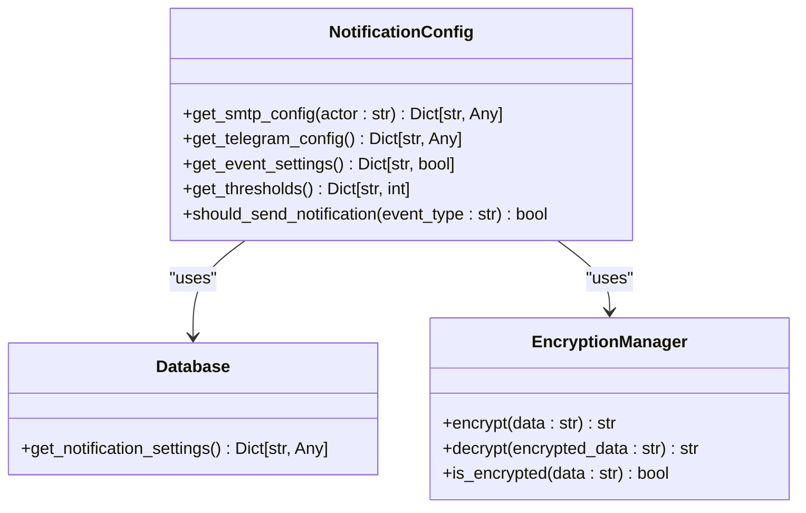
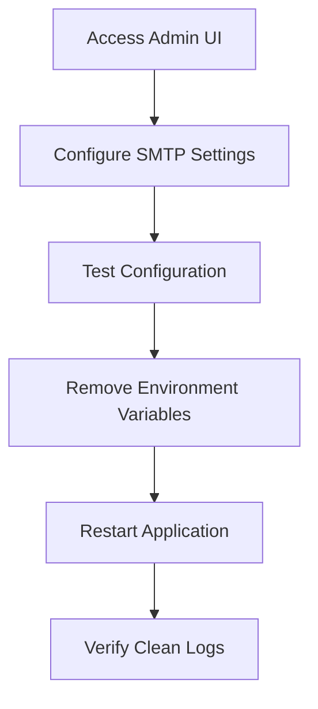

# Credential Management

<cite>
**Referenced Files in This Document**   
- [config.py](file://vertex-ar/app/config.py)
- [notification_config.py](file://vertex-ar/app/notification_config.py)
- [encryption.py](file://vertex-ar/app/encryption.py)
- [database.py](file://vertex-ar/app/database.py)
- [email_service.py](file://vertex-ar/app/services/email_service.py)
- [EMAIL_MIGRATION.md](file://docs/EMAIL_MIGRATION.md)
- [.env.example](file://vertex-ar/.env.example)
- [.env.production.example](file://vertex-ar/.env.production.example)
</cite>

## Table of Contents
1. [Introduction](#introduction)
2. [Deprecation of Environment-Based SMTP Credentials](#deprecation-of-environment-based-smtp-credentials)
3. [Secure Storage Workflow](#secure-storage-workflow)
4. [SECRET_KEY Management](#secret_key-management)
5. [MINIO_SECRET_KEY and Other Sensitive Credentials](#minio_secret_key-and-other-sensitive-credentials)
6. [Migration Guidance](#migration-guidance)
7. [Common Issues and Best Practices](#common-issues-and-best-practices)
8. [Conclusion](#conclusion)

## Introduction
This document outlines the secure credential management practices implemented in the Vertex AR application. It focuses on the deprecation of environment-based SMTP credentials (SMTP_USERNAME, SMTP_PASSWORD) and the transition to encrypted database storage via the admin UI. The document explains the security warning mechanism in config.py that prevents production startup with environment-based credentials, details the secure storage workflow using NotificationConfig and encrypted fields in the database, and covers the secure generation and handling of SECRET_KEY using Python's secrets module. It also addresses the secure configuration of MINIO_SECRET_KEY and other sensitive credentials, provides step-by-step migration guidance from environment variables to secure storage as outlined in EMAIL_MIGRATION.md, and discusses common issues such as credential exposure in logs, improper environment variable handling, and failure to rotate credentials. Best practices for credential rotation, access control, and audit logging are also included.

## Deprecation of Environment-Based SMTP Credentials
The Vertex AR application has deprecated the use of environment-based SMTP credentials (SMTP_USERNAME and SMTP_PASSWORD) due to significant security risks. These credentials are now required to be stored in an encrypted format within the database, accessible only through the admin UI. The application includes a security warning mechanism in config.py that detects the presence of these environment variables and logs a critical warning. In production environments, the application will refuse to start if these credentials are detected in the environment, ensuring that operators must migrate to the secure storage method before deploying to production.

```mermaid
flowchart TD
A[Application Startup] --> B{Environment Variables Set?}
B --> |Yes| C[Log Critical Security Warning]
C --> D{Environment = Production?}
D --> |Yes| E[Refuse to Start - sys.exit(1)]
D --> |No| F[Continue with Warning]
B --> |No| G[Proceed Normally]
```

**Diagram sources**
- [config.py](file://vertex-ar/app/config.py#L81-L107)

**Section sources**
- [config.py](file://vertex-ar/app/config.py#L81-L107)
- [EMAIL_MIGRATION.md](file://docs/EMAIL_MIGRATION.md#L24-L40)

## Secure Storage Workflow
The secure storage workflow for SMTP credentials in the Vertex AR application involves storing encrypted credentials in the database via the admin UI. The NotificationConfig class manages the retrieval and decryption of these credentials, ensuring they are never exposed in plaintext. The encryption is handled by the EncryptionManager class, which uses AES-256 encryption via the cryptography library. When the application needs to send an email, it retrieves the SMTP configuration from the database, decrypts the password, and uses it to authenticate with the SMTP server. This process is logged with an audit trail that includes the actor requesting the credentials and a sanitized version of the configuration.



**Diagram sources**
- [notification_config.py](file://vertex-ar/app/notification_config.py#L40-L221)
- [encryption.py](file://vertex-ar/app/encryption.py#L16-L84)
- [database.py](file://vertex-ar/app/database.py#L34-L4163)

**Section sources**
- [notification_config.py](file://vertex-ar/app/notification_config.py#L40-L221)
- [encryption.py](file://vertex-ar/app/encryption.py#L16-L84)
- [database.py](file://vertex-ar/app/database.py#L34-L4163)

## SECRET_KEY Management
The SECRET_KEY in the Vertex AR application is used for JWT token generation and should be a secure random key. The application provides a default value in the .env.example file, but this must be changed to a secure random key in production. The recommended method for generating a secure SECRET_KEY is using Python's secrets module with the command `python -c "import secrets; print(secrets.token_urlsafe(32))"`. Using a weak or default key poses significant security risks, including the possibility of token forgery and unauthorized access to protected resources.

**Section sources**
- [.env.example](file://vertex-ar/.env.example#L11-L13)
- [.env.production.example](file://vertex-ar/.env.production.example#L9)

## MINIO_SECRET_KEY and Other Sensitive Credentials
The MINIO_SECRET_KEY and other sensitive credentials such as TELEGRAM_BOT_TOKEN should also be managed securely. These credentials should not be stored in environment variables or configuration files in plaintext. Instead, they should be configured through the admin UI and stored encrypted in the database, following the same pattern as SMTP credentials. The application's security model ensures that all sensitive credentials are encrypted at rest and redacted from logs, providing a consistent approach to credential management across different services.

**Section sources**
- [.env.example](file://vertex-ar/.env.example#L58-L59)
- [.env.production.example](file://vertex-ar/.env.production.example#L27-L28)

## Migration Guidance
The migration from environment-based SMTP credentials to encrypted database storage is a critical step for ensuring the security of the Vertex AR application. The process involves accessing the admin UI, configuring the SMTP settings through the secure interface, testing the configuration, removing the deprecated environment variables, and restarting the application. Detailed step-by-step instructions are provided in the EMAIL_MIGRATION.md document, which includes specific commands for different deployment environments such as Docker Compose, Kubernetes, and systemd services.



**Diagram sources**
- [EMAIL_MIGRATION.md](file://docs/EMAIL_MIGRATION.md#L82-L180)

**Section sources**
- [EMAIL_MIGRATION.md](file://docs/EMAIL_MIGRATION.md#L82-L180)

## Common Issues and Best Practices
Common issues in credential management include credential exposure in logs, improper handling of environment variables, and failure to rotate credentials regularly. To mitigate these risks, the Vertex AR application implements several best practices: all sensitive data is automatically redacted from logs, environment variables for credentials are deprecated in favor of encrypted database storage, and credential rotation can be performed without restarting the application. Additional best practices include enabling TLS/SSL for SMTP connections, rotating credentials quarterly or after any security incident, monitoring access logs for suspicious activity, backing up encryption keys securely, using app passwords instead of account passwords for services like Gmail, restricting admin access to authorized personnel only, enabling Prometheus alerting on email failures, testing disaster recovery procedures regularly, and keeping the Vertex AR application updated for security patches.

**Section sources**
- [EMAIL_MIGRATION.md](file://docs/EMAIL_MIGRATION.md#L664-L674)

## Conclusion
The Vertex AR application has implemented robust security measures for credential management, moving away from the insecure practice of storing credentials in environment variables to a more secure model of encrypted database storage. This approach, combined with comprehensive audit logging, secure key management, and clear migration guidance, ensures that sensitive credentials are protected against unauthorized access and exposure. By following the best practices outlined in this document, operators can maintain a high level of security for their Vertex AR deployments.