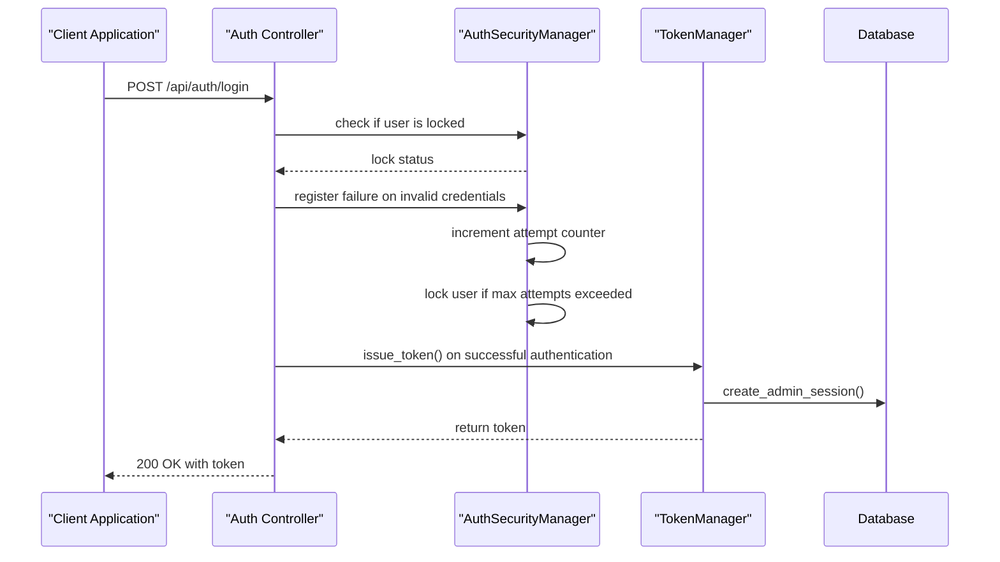
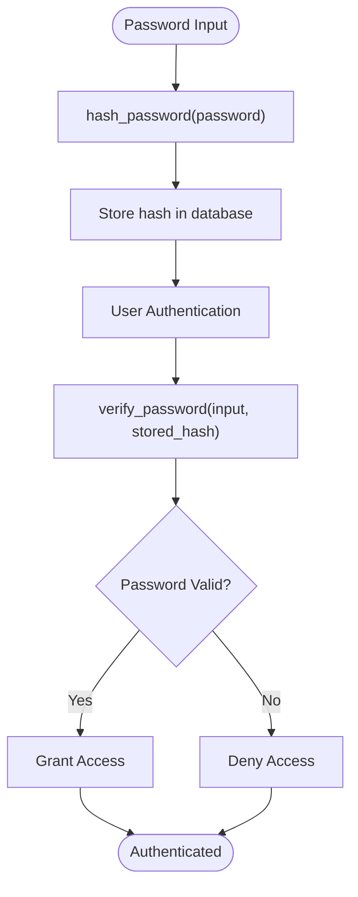
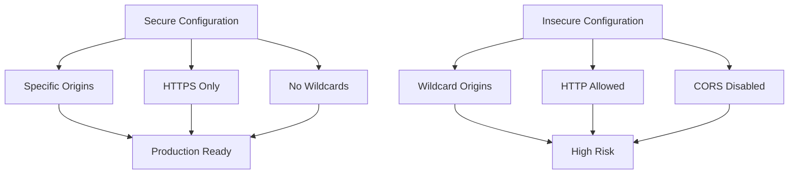

# Security Configuration

<cite>
**Referenced Files in This Document**   
- [config.py](file://vertex-ar/app/config.py)
- [.env.example](file://vertex-ar/.env.example)
- [.env.production.example](file://vertex-ar/.env.production.example)
- [auth.py](file://vertex-ar/app/auth.py)
- [rate_limiter.py](file://vertex-ar/app/rate_limiter.py)
- [middleware.py](file://vertex-ar/app/middleware.py)
- [utils.py](file://vertex-ar/app/utils.py)
- [database.py](file://vertex-ar/app/database.py)
</cite>

## Table of Contents
1. [Introduction](#introduction)
2. [Authentication Security Settings](#authentication-security-settings)
3. [CORS Configuration](#cors-configuration)
4. [Password Hashing Security](#password-hashing-security)
5. [Default Admin Credentials](#default-admin-credentials)
6. [Secure Configuration Examples](#secure-configuration-examples)
7. [Common Security Misconfigurations](#common-security-misconfigurations)
8. [Secret Key Generation](#secret-key-generation)
9. [Implementation Details](#implementation-details)
10. [Conclusion](#conclusion)

## Introduction
This document provides comprehensive guidance on security-related environment variables in the Vertex AR application. It covers authentication settings, CORS configuration, password hashing, and secure handling of default credentials. The documentation explains how these security parameters are implemented in the application's configuration system and provides best practices for secure deployment in production environments.

## Authentication Security Settings
The Vertex AR application implements multiple layers of authentication security through environment variables that control session management, brute force protection, and token validity.

### Session Management
The `SESSION_TIMEOUT_MINUTES` environment variable controls the duration of user sessions before they expire. This setting is implemented in the `TokenManager` class in `auth.py`, which manages access tokens with session timeouts using database storage for compatibility across Uvicorn workers. The default value is 30 minutes, after which inactive sessions are automatically invalidated.

### Brute Force Protection
The application implements a robust brute force protection mechanism through two key environment variables:
- `AUTH_MAX_ATTEMPTS`: Defines the maximum number of failed login attempts before temporary lockout (default: 5)
- `AUTH_LOCKOUT_MINUTES`: Specifies the duration of the lockout period after exceeding maximum attempts (default: 15 minutes)

These settings are implemented in the `AuthSecurityManager` class, which tracks authentication attempts and enforces temporary lockouts. When a user exceeds the maximum allowed attempts, their account is locked for the specified duration to prevent automated password guessing attacks.

### JWT Token Validity
The `TOKEN_EXPIRATION_HOURS` environment variable controls the validity period of JWT tokens issued by the application. The default value is 24 hours, after which tokens must be refreshed. This setting helps limit the window of opportunity for token theft and replay attacks.



**Diagram sources**
- [auth.py](file://vertex-ar/app/auth.py#L27-L153)
- [config.py](file://vertex-ar/app/config.py#L43-L47)

**Section sources**
- [config.py](file://vertex-ar/app/config.py#L43-L47)
- [auth.py](file://vertex-ar/app/auth.py#L105-L153)

## CORS Configuration
The application uses the `CORS_ORIGINS` environment variable to configure Cross-Origin Resource Sharing security policies.

### CORS Implementation
The `CORS_ORIGINS` setting accepts a comma-separated list of allowed origins. In development, it defaults to `http://localhost:8000,http://127.0.0.1:8000`, while production deployments should specify exact domain names. The configuration is processed in `config.py` where it's split into a list of origins that are used to configure the application's CORS middleware.

### Security Risks of Wildcard Origins
Using a wildcard (`*`) in the `CORS_ORIGINS` setting, as shown in the `.env.example` file for development purposes, poses significant security risks in production:
- Allows any website to make requests to the API
- Increases vulnerability to Cross-Site Request Forgery (CSRF) attacks
- Enables data exfiltration from malicious websites

Production deployments must specify exact domain names and avoid using wildcards to maintain proper security boundaries.

**Section sources**
- [config.py](file://vertex-ar/app/config.py#L56-L58)
- [.env.example](file://vertex-ar/.env.example#L119)

## Password Hashing Security
The application implements password security through the `BCRYPT_ROUNDS` environment variable and secure hashing practices.

### Bcrypt Configuration
The `BCRYPT_ROUNDS` setting controls the computational cost of password hashing, with a default value of 12. Higher values increase security by making brute force attacks more computationally expensive, but also increase server load. The value represents the logarithmic cost factor (2^n iterations), so 12 rounds equate to 4,096 iterations.

### Password Hashing Implementation
The application uses SHA-256 hashing for password storage, implemented in `app/utils.py`. The `hash_password()` function converts plaintext passwords to secure hashes before storage, while `verify_password()` compares provided passwords against stored hashes during authentication.



**Diagram sources**
- [utils.py](file://vertex-ar/app/utils.py#L9-L16)
- [database.py](file://vertex-ar/app/database.py#L1017-L1019)

**Section sources**
- [utils.py](file://vertex-ar/app/utils.py#L9-L16)
- [.env.example](file://vertex-ar/.env.example#L125)

## Default Admin Credentials
The application includes default administrative credentials that require immediate attention in production environments.

### Default Credentials
The following default credentials are configured through environment variables:
- `DEFAULT_ADMIN_USERNAME`: superar (default)
- `DEFAULT_ADMIN_PASSWORD`: ffE48f0ns@HQ (default)
- `DEFAULT_ADMIN_EMAIL`: superar@vertex-ar.local (default)

These credentials are automatically seeded into the system during initial setup and provide full administrative access to the application.

### Security Implications
The use of default admin credentials poses severe security risks:
- Well-known default passwords are vulnerable to dictionary attacks
- Default accounts are often targeted by automated scanning tools
- Failure to change defaults creates a persistent security vulnerability

The admin guide explicitly recommends changing these credentials immediately after initial deployment.

**Section sources**
- [config.py](file://vertex-ar/app/config.py#L168-L172)
- [.env.example](file://vertex-ar/.env.example#L128-L131)
- [database.py](file://vertex-ar/app/database.py#L1010-L1022)

## Secure Configuration Examples
This section provides recommended configuration examples for production environments.

### Production Environment Configuration
The `.env.production.example` file provides a secure template for production deployment:

```env
# Security Settings
CORS_ORIGINS=https://yourdomain.com,https://www.yourdomain.com
TOKEN_EXPIRATION_HOURS=24
BCRYPT_ROUNDS=12

# Default admin credentials (change immediately after deployment)
DEFAULT_ADMIN_USERNAME=superar
DEFAULT_ADMIN_PASSWORD=ffE48f0ns@HQ
```

Key security improvements in this configuration:
- Specific domain origins instead of wildcards
- Strong bcrypt hashing with 12 rounds
- HTTPS-only origins to prevent mixed content issues

### Rate Limiting Configuration
The application implements rate limiting through multiple environment variables:
- `RATE_LIMIT_ENABLED`: Enables rate limiting (true by default)
- `GLOBAL_RATE_LIMIT`: Global request limit (default: 100/minute)
- `AUTH_RATE_LIMIT`: Authentication endpoint limit (default: 5/minute)
- `UPLOAD_RATE_LIMIT`: Upload endpoint limit (default: 10/minute)

These settings are enforced by the `SimpleRateLimiter` class and complement Nginx-level rate limiting configured in deployment scripts.

**Section sources**
- [.env.production.example](file://vertex-ar/.env.production.example#L61-L69)
- [rate_limiter.py](file://vertex-ar/app/rate_limiter.py#L13-L65)

## Common Security Misconfigurations
This section addresses frequent security misconfigurations and their remediation.

### Default Admin Password Usage
Using the default admin password `ffE48f0ns@HQ` in production is a critical security flaw. The application does not enforce password changes on first login, making it essential for administrators to immediately change this password after deployment.

### Insufficient Rate Limiting
Disabling rate limiting (`RATE_LIMIT_ENABLED=False`) or setting overly permissive limits can expose the application to:
- Brute force attacks on authentication endpoints
- Denial of service through excessive requests
- Automated scraping of sensitive data

The recommended configuration maintains strict limits on authentication endpoints (5/minute) while allowing higher limits for general API usage.

### Overly Permissive CORS Settings
Configuring `CORS_ORIGINS=*` in production removes cross-origin security protections and should be avoided. Instead, specify exact domain names that need to access the API.



**Diagram sources**
- [.env.production.example](file://vertex-ar/.env.production.example#L61)
- [.env.example](file://vertex-ar/.env.example#L119)

**Section sources**
- [.env.example](file://vertex-ar/.env.example#L119)
- [.env.production.example](file://vertex-ar/.env.production.example#L61)

## Secret Key Generation
The `SECRET_KEY` environment variable is critical for application security and must be properly configured.

### Secure Key Generation
The documentation recommends generating a secure random key using Python's `secrets` module:
```python
import secrets
print(secrets.token_urlsafe(32))
```

This generates a 32-byte cryptographically secure random token suitable for use as a secret key.

### Key Management Best Practices
- Never use the default `default-secret-key-change-in-production` value in production
- Generate unique keys for each deployment environment
- Store keys securely in environment variables, not in code
- Rotate keys periodically for enhanced security

The secret key is used for JWT token signing and other cryptographic operations, making it one of the most sensitive configuration values.

**Section sources**
- [.env.example](file://vertex-ar/.env.example#L13)
- [config.py](file://vertex-ar/app/config.py#L43)

## Implementation Details
This section details how security configurations are implemented in the application codebase.

### Configuration Loading
The `Settings` class in `config.py` loads environment variables during initialization. Security-related settings are processed with appropriate type conversion and default values. The configuration system validates inputs and provides sensible defaults while allowing customization through environment variables.

### Environment-Specific Configuration
The application supports different configuration profiles through example files:
- `.env.example`: Development configuration with relaxed security
- `.env.production.example`: Production configuration with strict security settings

This approach allows developers to work efficiently in development while ensuring production deployments follow security best practices.

### Security Validation
The configuration system includes validation for security-critical settings:
- Deprecation warnings for insecure SMTP credential storage
- Critical warnings when insecure configurations are detected
- Automatic enforcement of security policies in production mode

**Section sources**
- [config.py](file://vertex-ar/app/config.py#L9-L244)
- [.env.example](file://vertex-ar/.env.example#L1-L339)
- [.env.production.example](file://vertex-ar/.env.production.example#L1-L93)

## Conclusion
Proper configuration of security-related environment variables is essential for protecting the Vertex AR application from common web vulnerabilities. Administrators must carefully configure authentication settings, implement strict CORS policies, use strong password hashing, and immediately change default credentials in production environments. By following the secure configuration examples and avoiding common misconfigurations, organizations can significantly improve their security posture and protect against unauthorized access and data breaches.