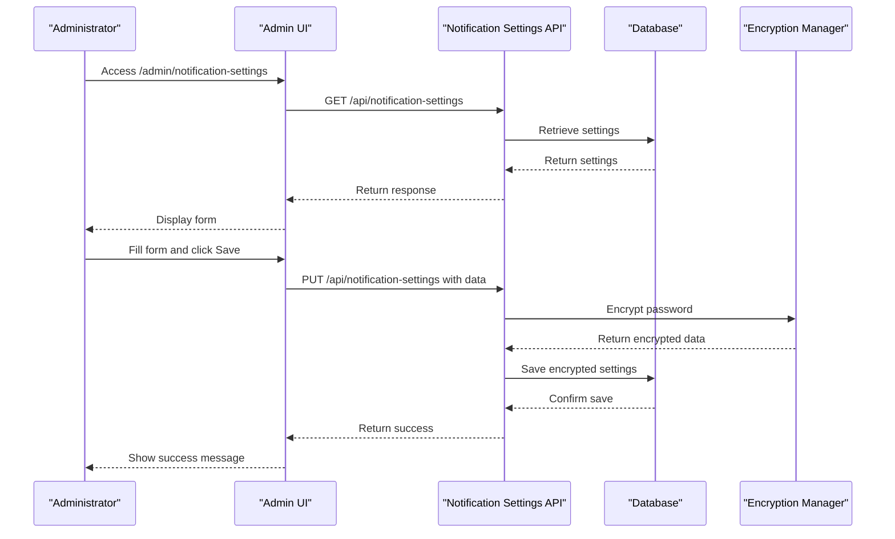
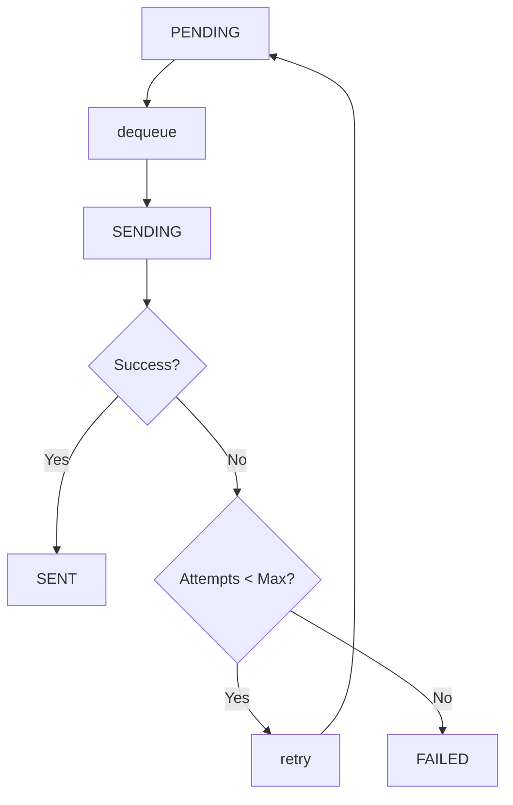

# Email Integration

<cite>
**Referenced Files in This Document**   
- [vertex-ar/.env.example](file://vertex-ar/.env.example)
- [docs/EMAIL_MIGRATION.md](file://docs/EMAIL_MIGRATION.md)
- [docs/SMTP_SECURITY_ENHANCEMENT_SUMMARY.md](file://docs/SMTP_SECURITY_ENHANCEMENT_SUMMARY.md)
- [docs/EMAIL_QUEUE.md](file://docs/EMAIL_QUEUE.md)
- [docs/EMAIL_MONITORING.md](file://docs/EMAIL_MONITORING.md)
- [vertex-ar/app/services/email_service.py](file://vertex-ar/app/services/email_service.py)
- [vertex-ar/app/api/notification_settings.py](file://vertex-ar/app/api/notification_settings.py)
- [vertex-ar/templates/admin_notification_settings.html](file://vertex-ar/templates/admin_notification_settings.html)
- [vertex-ar/app/notification_config.py](file://vertex-ar/app/notification_config.py)
- [vertex-ar/app/encryption.py](file://vertex-ar/app/encryption.py)
- [vertex-ar/app/database.py](file://vertex-ar/app/database.py)
- [scripts/process_email_queue.py](file://scripts/process_email_queue.py)
</cite>

## Table of Contents
1. [Introduction](#introduction)
2. [Environment Variables Configuration](#environment-variables-configuration)
3. [Deprecation of SMTP Credentials](#deprecation-of-smtp-credentials)
4. [Notification Settings Configuration](#notification-settings-configuration)
5. [Email Queue Processing](#email-queue-processing)
6. [Retry Mechanism and Exponential Backoff](#retry-mechanism-and-exponential-backoff)
7. [Troubleshooting Common Issues](#troubleshooting-common-issues)
8. [Security Best Practices](#security-best-practices)
9. [Monitoring and Diagnostics](#monitoring-and-diagnostics)
10. [Conclusion](#conclusion)

## Introduction
This document provides comprehensive guidance for configuring and managing email service integration within the Vertex AR application. It details the configuration of essential environment variables, explains the security-driven deprecation of traditional SMTP credential storage, and outlines the secure, database-backed configuration method via the admin UI. The documentation covers email queue processing, retry mechanisms with exponential backoff, and provides troubleshooting guidance for common issues such as authentication failures and network connectivity problems. It also highlights critical security best practices and monitoring strategies to ensure reliable and secure email delivery.

**Section sources**
- [vertex-ar/.env.example](file://vertex-ar/.env.example#L160-L187)
- [docs/EMAIL_MIGRATION.md](file://docs/EMAIL_MIGRATION.md#L1-L681)
- [docs/SMTP_SECURITY_ENHANCEMENT_SUMMARY.md](file://docs/SMTP_SECURITY_ENHANCEMENT_SUMMARY.md#L1-L449)

## Environment Variables Configuration
The Vertex AR application uses several environment variables to configure its email service. These variables are defined in the `.env.example` file and must be set in the production `.env` file. The key variables are:

- **SMTP_HOST**: The hostname of the SMTP server (e.g., `smtp.gmail.com`).
- **SMTP_PORT**: The port number for the SMTP server (e.g., `587` for TLS, `465` for SSL).
- **EMAIL_FROM**: The default sender email address (e.g., `noreply@vertex-ar.com`).
- **ADMIN_EMAILS**: A comma-separated list of email addresses for administrative notifications (e.g., `admin@vertex-ar.com`).
- **EMAIL_QUEUE_WORKERS**: The number of concurrent workers to process the email queue (default: `3`).
- **EMAIL_RETRY_MAX_ATTEMPTS**: The maximum number of times to retry sending a failed email (default: `5`).

For Gmail, a valid configuration example is:
```bash
SMTP_HOST=smtp.gmail.com
SMTP_PORT=587
EMAIL_FROM=noreply@yourcompany.com
ADMIN_EMAILS=admin@yourcompany.com
```

For Outlook, a valid configuration example is:
```bash
SMTP_HOST=smtp-mail.outlook.com
SMTP_PORT=587
EMAIL_FROM=noreply@yourcompany.com
ADMIN_EMAILS=admin@yourcompany.com
```

For a custom SMTP provider, replace the host and port with the provider's specific values:
```bash
SMTP_HOST=mail.yourprovider.com
SMTP_PORT=587
EMAIL_FROM=noreply@yourcompany.com
ADMIN_EMAILS=admin@yourcompany.com
```

**Section sources**
- [vertex-ar/.env.example](file://vertex-ar/.env.example#L169-L187)

## Deprecation of SMTP Credentials
Due to significant security risks associated with storing credentials in environment variables, the use of `SMTP_USERNAME` and `SMTP_PASSWORD` has been deprecated in Vertex AR v1.6.0. Storing credentials in plaintext within `.env` files exposes them to numerous attack vectors, including process environment leaks, log file exposure, and backup vulnerabilities. This practice fails to meet compliance standards such as PCI DSS, SOC 2, and ISO 27001.

To mitigate these risks, the application now requires all SMTP credentials to be stored in an encrypted format within the application's database. This change enforces a zero-trust model where credentials are never exposed in logs, process environments, or configuration files. In production mode, the application will refuse to start if it detects `SMTP_USERNAME` or `SMTP_PASSWORD` in the environment, ensuring that operators migrate to the secure method. The migration process involves configuring the credentials through the admin UI, which encrypts them using AES-256 before storing them in the database.

**Section sources**
- [docs/EMAIL_MIGRATION.md](file://docs/EMAIL_MIGRATION.md#L24-L35)
- [docs/SMTP_SECURITY_ENHANCEMENT_SUMMARY.md](file://docs/SMTP_SECURITY_ENHANCEMENT_SUMMARY.md#L44-L77)

## Notification Settings Configuration
The secure configuration of SMTP credentials is performed through the Notification Settings interface in the admin panel. This web-based UI provides a secure and user-friendly way to manage email settings.

To configure the SMTP credentials:
1. Log in to the Vertex AR admin panel at `/admin/login`.
2. Navigate to the Notification Settings page at `/admin/notification-settings`.
3. Fill in the SMTP Host, SMTP Port, Username, and Password fields with the appropriate values from your email provider.
4. For Gmail users, it is essential to generate an App Password instead of using the account password. This can be done in the Google Account settings under "Security" > "App passwords."
5. Enter the desired sender email address in the "From Email" field.
6. Select the appropriate security protocol by enabling "Use TLS" for port 587 or "Use SSL" for port 465.
7. Click "Save Configuration" to store the settings.

The interface uses JavaScript to mask the password field by default, with a toggle button to reveal the input for verification. Upon saving, the password is encrypted by the backend using the `encryption_manager` before being stored in the database. The system performs an audit log of all configuration access, recording the actor (e.g., "email_service", "alerting") and timestamp, ensuring a complete audit trail.



**Diagram sources** 
- [vertex-ar/templates/admin_notification_settings.html](file://vertex-ar/templates/admin_notification_settings.html#L293-L411)
- [vertex-ar/app/api/notification_settings.py](file://vertex-ar/app/api/notification_settings.py#L119-L195)
- [vertex-ar/app/encryption.py](file://vertex-ar/app/encryption.py#L16-L84)

**Section sources**
- [docs/EMAIL_MIGRATION.md](file://docs/EMAIL_MIGRATION.md#L80-L124)
- [vertex-ar/app/api/notification_settings.py](file://vertex-ar/app/api/notification_settings.py#L119-L195)
- [vertex-ar/templates/admin_notification_settings.html](file://vertex-ar/templates/admin_notification_settings.html#L293-L411)

## Email Queue Processing
The Vertex AR application employs a durable, asynchronous email queue to ensure reliable message delivery without blocking application requests. The queue is managed by the `EmailQueue` class, which uses the application's database for persistence, guaranteeing that emails are not lost during server restarts or crashes.

The queue operates with a configurable number of worker processes, controlled by the `EMAIL_QUEUE_WORKERS` environment variable (default: 3). During application startup, the `EmailQueue` initializes and reloads any pending jobs from the database into an in-memory queue. Worker processes then continuously poll for jobs, process them by sending the email, and update the job status. If a job fails, it is requeued for a retry according to the retry policy. If a job exceeds the maximum retry attempts, it is marked as permanently failed.

The lifecycle of an email job is as follows:
1. A job is created and its status is set to `pending`.
2. A worker dequeues the job and changes its status to `sending`.
3. If the email is sent successfully, the status is updated to `sent`.
4. If the send fails and the retry limit has not been reached, the job is requeued with its status reset to `pending`.
5. If the retry limit is exceeded, the job is marked as `failed`.



**Diagram sources** 
- [docs/EMAIL_QUEUE.md](file://docs/EMAIL_QUEUE.md#L58-L80)
- [vertex-ar/app/services/email_queue.py](file://vertex-ar/app/services/email_queue.py#L244-L303)

**Section sources**
- [docs/EMAIL_QUEUE.md](file://docs/EMAIL_QUEUE.md#L1-L659)
- [vertex-ar/app/services/email_queue.py](file://vertex-ar/app/services/email_queue.py#L113-L340)

## Retry Mechanism and Exponential Backoff
The email service implements a robust retry mechanism to handle transient failures such as network outages or temporary SMTP server issues. The number of retry attempts is governed by the `EMAIL_RETRY_MAX_ATTEMPTS` setting, with a default value of 5. The delay between retries follows an exponential backoff strategy, defined by the `EMAIL_RETRY_DELAYS` setting, which defaults to `[1, 2, 4, 8, 16]` seconds.

When an email send attempt fails, the system waits for the corresponding delay period before attempting to resend. For example, after the first failure, it waits 1 second; after the second, it waits 2 seconds, and so on. This strategy prevents overwhelming the SMTP server with rapid, repeated requests during an outage. The retry delays are configurable via environment variables, allowing operators to tailor the behavior to their specific environment and provider requirements.

The retry process is managed within the `EmailService._send_with_retry` method. It loops for the maximum number of attempts, calling the `_send_smtp` method on each iteration. If all attempts fail, the job is marked as permanently failed in the queue, and an error is logged. This mechanism ensures high delivery reliability while respecting the SMTP server's capacity.

**Section sources**
- [vertex-ar/app/services/email_service.py](file://vertex-ar/app/services/email_service.py#L313-L403)
- [vertex-ar/.env.example](file://vertex-ar/.env.example#L181-L187)

## Troubleshooting Common Issues
Common issues with email delivery can be diagnosed and resolved using the following guidelines:

- **Authentication Failures**: Ensure the correct username and password are configured in the admin UI. For Gmail, verify that an App Password is being used and that 2-Step Verification is enabled on the account. For other providers, check that the username format is correct (e.g., the full email address).
- **TLS/SSL Handshake Errors**: Verify that the correct port and security protocol (TLS/SSL) are selected. Port 587 typically uses STARTTLS, while port 465 uses SSL. Use tools like `openssl s_client -connect smtp.gmail.com:587 -starttls smtp` to test the connection.
- **Rate Limiting**: Email providers often impose sending limits. Check the provider's documentation for daily or hourly quotas. If limits are being exceeded, consider upgrading the account or using a dedicated email service like SendGrid.
- **Blocked Ports**: Ensure that the server's firewall allows outbound connections on the SMTP port (e.g., 587). Use `telnet smtp.gmail.com 587` to test connectivity. If the connection is blocked, configure the firewall to allow traffic on the required port.

Diagnostic commands can be used to verify the email system's health:
- Check the queue status: `python scripts/process_email_queue.py stats`
- View failed jobs: `python scripts/process_email_queue.py failed --limit 10`
- Manually retry failed jobs: `python scripts/process_email_queue.py retry --max 10`
- Check application logs for errors: `tail -f /var/log/vertex-ar/app.log | grep -i "email"`

**Section sources**
- [docs/EMAIL_MIGRATION.md](file://docs/EMAIL_MIGRATION.md#L331-L413)
- [docs/EMAIL_MONITORING.md](file://docs/EMAIL_MONITORING.md#L451-L525)
- [scripts/process_email_queue.py](file://scripts/process_email_queue.py#L174-L223)

## Security Best Practices
To maintain a secure email integration, adhere to the following best practices:

- **Use App-Specific Passwords**: For providers like Gmail and Outlook, always use app-specific passwords instead of the primary account password. This limits the scope of any potential credential compromise.
- **Firewall Configuration**: Configure the server's firewall to only allow outbound SMTP traffic from the application server, reducing the attack surface.
- **Monitor Outbound Traffic**: Regularly monitor outbound email traffic for unusual patterns, which could indicate a compromised account or a misconfigured application.
- **Regular Credential Rotation**: Rotate SMTP credentials periodically, at least quarterly, or immediately after any security incident.
- **Access Control**: Restrict access to the Notification Settings UI to authorized administrative personnel only.
- **Encryption Key Management**: Securely back up the encryption key stored in `vertex-ar/app/.encryption_key`. If this key is lost, all encrypted credentials in the database become irrecoverable.

**Section sources**
- [docs/EMAIL_MIGRATION.md](file://docs/EMAIL_MIGRATION.md#L664-L674)
- [docs/SMTP_SECURITY_ENHANCEMENT_SUMMARY.md](file://docs/SMTP_SECURITY_ENHANCEMENT_SUMMARY.md#L404-L409)

## Monitoring and Diagnostics
The email service is integrated with the application's monitoring system to provide observability into its performance and health. Key metrics are exposed at the `/metrics` endpoint in Prometheus format, including:
- `vertex_ar_email_sent_total`: A counter for successfully sent emails.
- `vertex_ar_email_failed_total`: A counter for permanently failed emails.
- `vertex_ar_email_queue_depth`: A gauge showing the current number of pending emails.
- `vertex_ar_email_send_duration_seconds`: A histogram of email send durations.

These metrics can be visualized in a Grafana dashboard to monitor the email pipeline. The system also includes an automated alerting feature that triggers when the email failure rate exceeds 10% over a one-hour window. This alert is sent via the configured notification channels (email and Telegram) to ensure prompt attention.

The REST API endpoint `/api/monitoring/email-stats` provides detailed statistics about the email service, including the current queue depth, failure rate, and recent error messages. This endpoint requires admin authentication and is a valuable tool for operational troubleshooting.

**Section sources**
- [docs/EMAIL_MONITORING.md](file://docs/EMAIL_MONITORING.md#L32-L232)
- [vertex-ar/app/services/email_service.py](file://vertex-ar/app/services/email_service.py#L494-L525)

## Conclusion
The email integration in the Vertex AR application has been designed with security, reliability, and ease of management as primary goals. By migrating from environment-based credentials to an encrypted, database-backed configuration accessed via a secure admin UI, the system significantly reduces the risk of credential exposure. The asynchronous, persistent email queue with exponential backoff retry logic ensures that messages are delivered reliably even in the face of transient failures. Operators should follow the documented configuration and security best practices to maintain a robust and secure email service. Regular monitoring and prompt troubleshooting of any issues will ensure the continued reliability of the notification system.