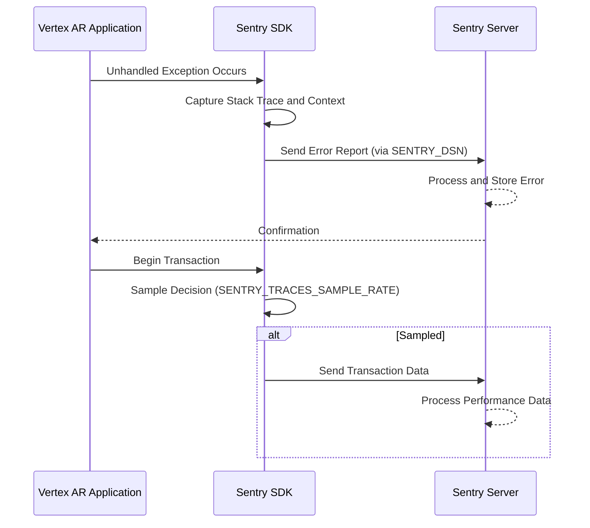
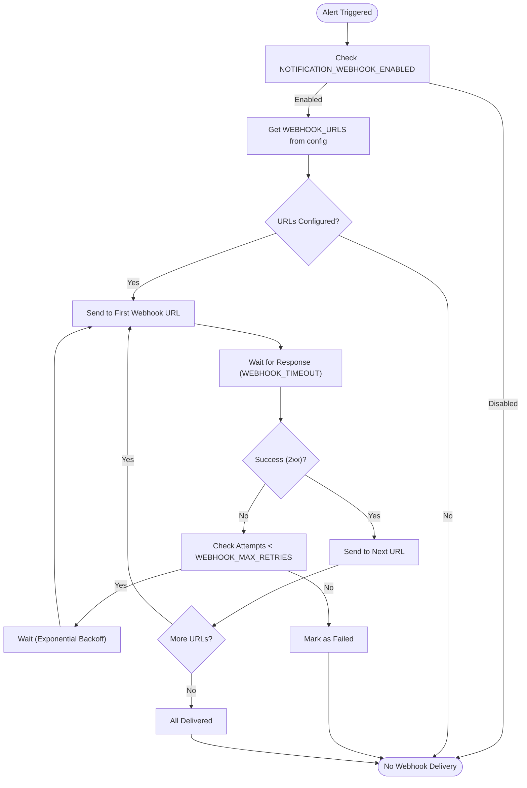
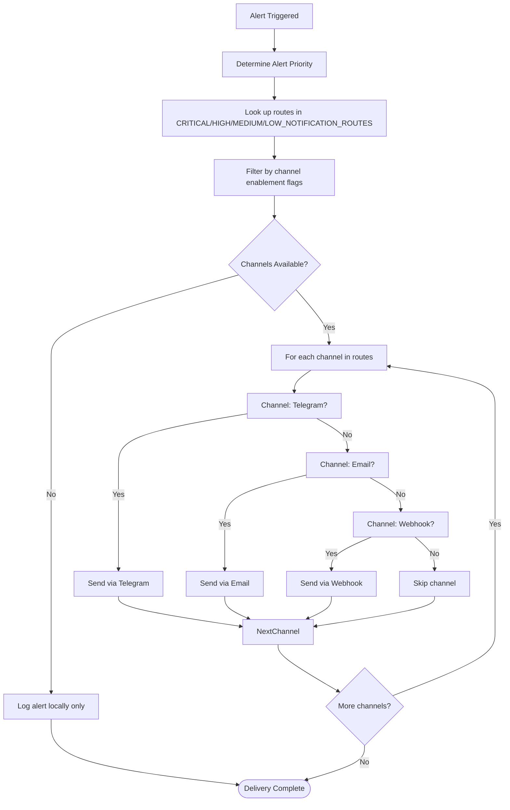
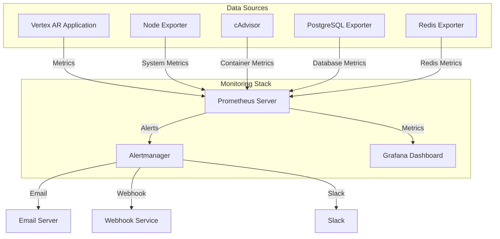

# Monitoring & Alerting Integration

<cite>
**Referenced Files in This Document**   
- [vertex-ar/app/config.py](file://vertex-ar/app/config.py)
- [vertex-ar/notification_integrations.py](file://vertex-ar/notification_integrations.py)
- [vertex-ar/app/alerting.py](file://vertex-ar/app/alerting.py)
- [vertex-ar/app/prometheus_metrics.py](file://vertex-ar/app/prometheus_metrics.py)
- [monitoring/alertmanager.yml](file://monitoring/alertmanager.yml)
- [monitoring/prometheus.yml](file://monitoring/prometheus.yml)
- [monitoring/alert_rules.yml](file://monitoring/alert_rules.yml)
- [vertex-ar/.env.example](file://vertex-ar/.env.example)
- [vertex-ar/app/api/monitoring.py](file://vertex-ar/app/api/monitoring.py)
</cite>

## Table of Contents
1. [Introduction](#introduction)
2. [Sentry Error Tracking Configuration](#sentry-error-tracking-configuration)
3. [Webhook Alert Integration](#webhook-alert-integration)
4. [Priority-Based Notification Routing](#priority-based-notification-routing)
5. [Prometheus and Alertmanager Integration](#prometheus-and-alertmanager-integration)
6. [Webhook Payload Examples](#webhook-payload-examples)
7. [Security Considerations](#security-considerations)
8. [Troubleshooting Guide](#troubleshooting-guide)

## Introduction
The Vertex AR platform provides a comprehensive monitoring and alerting system designed to ensure system reliability, track errors, and deliver timely notifications through multiple channels. This documentation details the configuration and integration of external alerting systems, focusing on Sentry for error tracking and webhook integrations for delivering alerts to external services like Discord, Microsoft Teams, and custom monitoring platforms.

The monitoring system is built on a multi-layered architecture that combines application-level monitoring with external observability tools. It includes performance monitoring through Sentry, system metric collection via Prometheus, alert routing through Alertmanager, and flexible notification delivery through webhook integrations. The system is designed to be highly configurable, allowing administrators to set up appropriate alerting thresholds, delivery methods, and escalation policies based on the severity of incidents.

This document provides comprehensive guidance on configuring and managing the monitoring and alerting integrations, including setup instructions, configuration options, security considerations, and troubleshooting procedures.

## Sentry Error Tracking Configuration

The Vertex AR platform integrates with Sentry for comprehensive error tracking and performance monitoring. The integration is configured through environment variables that control the connection to Sentry, error sampling, and environment identification.

The primary configuration parameter is `SENTRY_DSN`, which contains the Data Source Name required to connect to your Sentry project. This DSN should be obtained from your Sentry dashboard and configured in the application environment. When the DSN is provided, the application automatically captures and reports unhandled exceptions, providing detailed stack traces, context information, and user data to help diagnose issues.

For performance monitoring, the platform uses two key configuration parameters: `SENTRY_ENVIRONMENT` and `SENTRY_TRACES_SAMPLE_RATE`. The `SENTRY_ENVIRONMENT` variable specifies the deployment environment (e.g., "development", "staging", "production") which helps categorize and filter events in the Sentry dashboard. This allows teams to focus on issues in specific environments and track the progression of errors through different deployment stages.

The `SENTRY_TRACES_SAMPLE_RATE` parameter controls the percentage of transactions that are captured for performance monitoring. This sampling rate is crucial for balancing detailed performance insights with data volume and cost considerations. A value of 1.0 captures 100% of transactions, while a value of 0.1 captures only 10%. The optimal sampling rate depends on your traffic volume and monitoring budget, with lower rates recommended for high-traffic production environments.



**Diagram sources**
- [vertex-ar/app/config.py](file://vertex-ar/app/config.py#L59-L62)
- [vertex-ar/.env.example](file://vertex-ar/.env.example#L209-L211)

**Section sources**
- [vertex-ar/app/config.py](file://vertex-ar/app/config.py#L59-L62)
- [vertex-ar/.env.example](file://vertex-ar/.env.example#L209-L211)

## Webhook Alert Integration

The Vertex AR platform supports external alerting through webhook integrations, allowing notifications to be sent to various external services such as Discord, Microsoft Teams, Slack, or custom monitoring platforms. The webhook integration is controlled by several configuration parameters that ensure reliable delivery and proper error handling.

The `NOTIFICATION_WEBHOOK_ENABLED` flag is a boolean configuration that enables or disables the webhook notification system. When set to `true`, the platform will attempt to deliver alerts to the configured webhook URLs. This flag provides a simple way to temporarily disable external notifications during maintenance or testing without removing the webhook configurations.

Webhook endpoints are specified through the `WEBHOOK_URLS` environment variable, which accepts a comma-separated list of URLs. Multiple webhook URLs can be configured to send alerts to multiple external services simultaneously. For example, you might configure webhooks for both a Discord channel and a Microsoft Teams channel to ensure that alerts reach all relevant team members.

To ensure reliable delivery, the platform implements configurable timeout and retry mechanisms. The `WEBHOOK_TIMEOUT` parameter specifies the maximum time in seconds that the platform will wait for a response from the webhook endpoint before considering the delivery attempt failed. The default timeout is 30 seconds, which is sufficient for most webhook services but can be adjusted based on the responsiveness of your external services.

The `WEBHOOK_MAX_RETRIES` parameter controls how many times the platform will attempt to redeliver a webhook after a failure. The system implements exponential backoff between retry attempts, with the delay doubling after each failed attempt. This approach helps prevent overwhelming the external service during temporary outages while ensuring that important alerts are eventually delivered.



**Diagram sources**
- [vertex-ar/app/config.py](file://vertex-ar/app/config.py#L146-L154)
- [vertex-ar/notification_integrations.py](file://vertex-ar/notification_integrations.py#L55-L56)

**Section sources**
- [vertex-ar/app/config.py](file://vertex-ar/app/config.py#L146-L154)
- [vertex-ar/notification_integrations.py](file://vertex-ar/notification_integrations.py#L67-L128)

## Priority-Based Notification Routing

The Vertex AR platform implements a sophisticated priority-based routing system that determines which notification channels receive alerts based on their severity. This system allows administrators to implement appropriate escalation policies, ensuring that critical issues receive immediate attention while lower-severity alerts are delivered through less intrusive channels.

The routing system is configured through a series of environment variables that define the notification routes for different priority levels: `CRITICAL_NOTIFICATION_ROUTES`, `HIGH_NOTIFICATION_ROUTES`, `MEDIUM_NOTIFICATION_ROUTES`, and `LOW_NOTIFICATION_ROUTES`. Each of these variables accepts a comma-separated list of notification channels that should be used for alerts of the corresponding severity.

For critical alerts, the `CRITICAL_NOTIFICATION_ROUTES` variable typically includes all available notification channels such as "telegram", "email", and "webhook". This ensures that critical system issues are delivered through multiple channels simultaneously, maximizing the likelihood that they will be noticed and addressed promptly. High-severity alerts might be configured to use "telegram" and "email" but exclude webhook integrations if they are primarily used for automated systems rather than human responders.

The notification routing system also respects channel-specific enablement flags. Even if a channel is included in a priority route, it will only be used if its corresponding enablement flag is set to `true`. For example, the webhook channel will only be used if both `NOTIFICATION_WEBHOOK_ENABLED` is `true` and the webhook is included in the appropriate priority route.

The platform supports the following notification channels:
- **Telegram**: Real-time messaging through Telegram bots
- **Email**: Traditional email notifications to configured addresses
- **Webhook**: Integration with external services via HTTP callbacks

This flexible routing system allows organizations to implement sophisticated alerting policies that match their operational procedures and on-call rotations. For example, critical alerts might be sent to both the primary on-call engineer via Telegram and the entire operations team via email, while medium-severity alerts might only be sent to a shared team email address for periodic review.



**Diagram sources**
- [vertex-ar/app/config.py](file://vertex-ar/app/config.py#L151-L160)
- [vertex-ar/app/alerting.py](file://vertex-ar/app/alerting.py#L342-L353)

**Section sources**
- [vertex-ar/app/config.py](file://vertex-ar/app/config.py#L151-L160)
- [vertex-ar/app/alerting.py](file://vertex-ar/app/alerting.py#L342-L353)

## Prometheus and Alertmanager Integration

The Vertex AR platform integrates with Prometheus and Alertmanager to provide comprehensive system monitoring and alert management. This integration enables the collection of detailed metrics, definition of alerting rules, and sophisticated alert routing based on severity and other criteria.

The Prometheus configuration is defined in `prometheus.yml`, which specifies the scraping jobs for collecting metrics from various components of the system. The configuration includes jobs for monitoring the Vertex AR application itself, Prometheus server, system metrics via Node Exporter, container metrics via cAdvisor, PostgreSQL database metrics, and Redis metrics. Each job has a specified scrape interval, with most set to 30 seconds to balance metric freshness with system load.

The alerting rules are defined in `alert_rules.yml`, which contains a comprehensive set of rules for monitoring various aspects of the system. These rules cover CPU usage, memory consumption, disk space, service health, network errors, and application-specific metrics. Each alert rule includes an expression that defines the condition for triggering the alert, a duration that specifies how long the condition must persist before the alert is fired, and labels that categorize the alert by severity and service.

Critical alerts, such as `CriticalCPUUsage` and `CriticalMemoryUsage`, are triggered when system resources exceed 95% utilization for more than 2 minutes. Warning-level alerts are triggered at lower thresholds (80-85%) and require a longer duration (5-10 minutes) to prevent alerting on transient spikes. The system also includes trend-based alerts like `CPUIncreasingTrend` that detect sustained growth in resource usage, allowing proactive intervention before thresholds are breached.

Alertmanager is configured through `alertmanager.yml` to handle the routing and delivery of alerts based on their severity and other attributes. The configuration defines a routing tree that directs alerts to different receivers based on matching criteria. Critical alerts are routed to the `critical-alerts` receiver, which sends notifications via email and webhooks with a shorter repeat interval (30 minutes) to ensure they receive immediate attention.

The Alertmanager configuration also includes inhibition rules that prevent lower-severity alerts from being sent when a higher-severity alert for the same issue already exists. For example, a warning-level disk usage alert will be inhibited if a critical disk usage alert is already active for the same mount point. This prevents alert fatigue and ensures that responders focus on the most critical issues.



**Diagram sources**
- [monitoring/prometheus.yml](file://monitoring/prometheus.yml#L1-L51)
- [monitoring/alert_rules.yml](file://monitoring/alert_rules.yml#L1-L210)
- [monitoring/alertmanager.yml](file://monitoring/alertmanager.yml#L1-L97)

**Section sources**
- [monitoring/prometheus.yml](file://monitoring/prometheus.yml#L1-L51)
- [monitoring/alert_rules.yml](file://monitoring/alert_rules.yml#L1-L210)
- [monitoring/alertmanager.yml](file://monitoring/alertmanager.yml#L1-L97)

## Webhook Payload Examples

The Vertex AR platform sends standardized webhook payloads when delivering alerts to external services. These payloads contain comprehensive information about the alert, enabling external systems to process and display the information appropriately. Understanding the payload structure is essential for integrating with custom monitoring platforms or building integration scripts for services like Discord and Microsoft Teams.

The webhook payload follows a JSON structure with several key fields that provide context about the alert. The `title` field contains a brief summary of the alert, while the `message` field provides a detailed description. The `priority` field indicates the severity level (e.g., "critical", "high", "medium"), which can be used by external services to apply appropriate formatting or routing.

Additional context is provided through fields such as `source`, which identifies the component or service that generated the alert, and `service_name`, which specifies the name of the affected service. The `created_at` field contains a timestamp in ISO 8601 format, allowing external systems to sort and filter alerts chronologically.

For integration with popular messaging platforms, the platform provides examples of how to process these webhook payloads. For Discord, the payload can be sent directly to a webhook URL, with the `title` field mapped to the embed title and the `message` field to the embed description. The `priority` can be used to set the embed color, with red for critical alerts, orange for high, yellow for medium, and green for low.

For Microsoft Teams, the payload needs to be transformed into the Adaptive Card format. This involves mapping the Vertex AR alert fields to the corresponding Adaptive Card elements, such as using the `title` for the card title and the `message` for the body text. The `priority` can be used to add an appropriate emoji prefix and set the card accent color.

```json
{
  "title": "High CPU Usage Detected",
  "message": "CPU usage is 85% for more than 5 minutes",
  "priority": "high",
  "source": "system-monitoring",
  "service_name": "vertex-ar",
  "created_at": "2025-01-15T10:30:45Z",
  "event_data": {
    "cpu_usage_percent": 85.2,
    "duration_minutes": 5,
    "threshold": 80
  }
}
```

When developing custom integration scripts, it's important to handle potential payload format changes and implement proper error handling. Scripts should validate the incoming payload structure, provide meaningful error messages for malformed payloads, and implement retry logic for failed deliveries to the final destination service.

**Section sources**
- [vertex-ar/notification_integrations.py](file://vertex-ar/notification_integrations.py#L213-L237)
- [vertex-ar/app/alerting.py](file://vertex-ar/app/alerting.py#L380-L382)

## Security Considerations

Securing webhook endpoints and notification integrations is critical for maintaining the overall security posture of the Vertex AR platform. Webhook integrations represent potential attack vectors that could be exploited for data exfiltration, denial of service, or unauthorized access if not properly secured.

The primary security consideration for webhook endpoints is authentication. Most external services support various authentication methods that should be implemented to ensure that only authorized systems can send data to your webhook endpoints. For custom webhook endpoints, implement robust authentication using API keys, OAuth tokens, or mutual TLS. API keys should be long, randomly generated strings stored securely and rotated periodically.

Encryption is another critical security measure. All webhook communications should use HTTPS with valid TLS certificates to protect data in transit. This prevents eavesdropping and man-in-the-middle attacks that could compromise sensitive information contained in alert payloads. When configuring webhook URLs, ensure they use the `https://` protocol rather than `http://`.

For services that support it, implement signature verification to ensure the integrity of webhook payloads. This involves the sending system including a cryptographic signature in the webhook request headers, which the receiving system can verify using a shared secret. This prevents tampering with alert data and ensures that alerts are genuinely from the Vertex AR platform.

Additional security best practices include:
- Implementing rate limiting on webhook endpoints to prevent abuse and denial of service
- Validating and sanitizing all incoming webhook data before processing
- Logging webhook requests for audit and troubleshooting purposes
- Regularly reviewing and rotating webhook credentials
- Using separate webhook endpoints for different environments (development, staging, production)
- Implementing IP allowlisting when the Vertex AR platform has a static IP address

The platform itself implements several security measures for notification integrations. Sensitive credentials like SMTP passwords are not stored in environment variables but are instead stored in encrypted form in the database, accessible only through the admin UI. The logging system automatically redacts sensitive information from log entries to prevent accidental exposure of credentials.

**Section sources**
- [vertex-ar/app/config.py](file://vertex-ar/app/config.py#L81-L113)
- [vertex-ar/logging_setup.py](file://vertex-ar/logging_setup.py#L14-L80)

## Troubleshooting Guide

Effective troubleshooting of the monitoring and alerting system requires understanding common issues and their solutions. This section addresses frequent problems related to webhook deliveries, payload format mismatches, and response handling.

One common issue is failed webhook deliveries, which can occur due to network connectivity problems, incorrect webhook URLs, or authentication failures. To diagnose delivery issues, check the webhook queue status through the admin API endpoint `/admin/monitoring/webhooks/queue`. This endpoint provides detailed information about pending, delivered, and failed webhook events, including the number of delivery attempts and the last error message.

When troubleshooting payload format mismatches, verify that the receiving service expects the JSON structure sent by the Vertex AR platform. Some services may require specific field names or additional formatting. Use the webhook queue information to inspect the exact payload being sent and compare it with the receiving service's documentation. For custom integrations, implement logging to capture incoming webhook requests and their structure.

Response handling issues often stem from incorrect HTTP status code interpretation. The platform considers a webhook delivery successful if the receiving service returns an HTTP status code in the 200-299 range. If the receiving service returns a 202 Accepted status, ensure that this is acceptable for your use case, as it indicates the request was received but processing is asynchronous.

For issues with alert routing, verify that the priority-based routing configuration matches your intended policy. Check that the `CRITICAL_NOTIFICATION_ROUTES`, `HIGH_NOTIFICATION_ROUTES`, etc., environment variables are correctly set and that the corresponding notification channels are enabled. Use the alert system test functionality to verify that all configured channels are working correctly.

Performance issues with webhook delivery can occur when the webhook queue grows too large. Monitor the queue size and delivery statistics through the webhook queue endpoint. If the queue is consistently growing, consider increasing the webhook timeout or reducing the number of concurrent webhook targets. The notification scheduler processes the webhook queue every 30 seconds, so sustained delivery failures can quickly lead to queue buildup.

When troubleshooting Sentry integration issues, verify that the `SENTRY_DSN` is correctly configured and that the application can reach the Sentry server. Check application logs for any Sentry-related error messages. For performance monitoring issues, verify that `SENTRY_TRACES_SAMPLE_RATE` is set to an appropriate value and that the application environment matches the intended deployment environment.

**Section sources**
- [vertex-ar/notification_integrations.py](file://vertex-ar/notification_integrations.py#L130-L149)
- [vertex-ar/app/api/notifications_management.py](file://vertex-ar/app/api/notifications_management.py#L307-L334)
- [vertex-ar/app/alerting.py](file://vertex-ar/app/alerting.py#L355-L378)