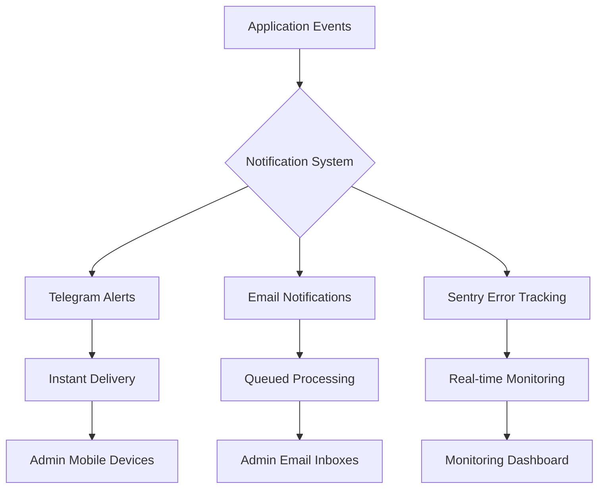
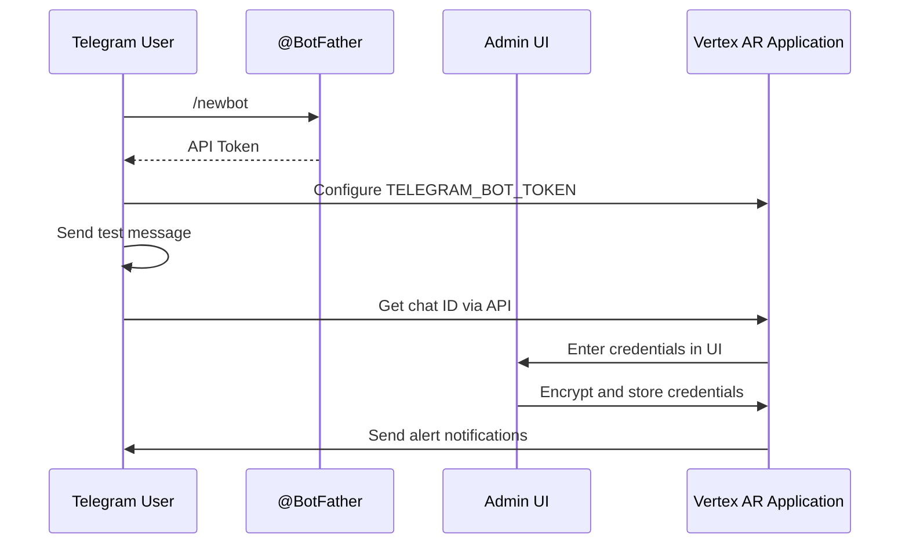
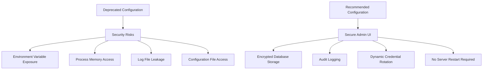
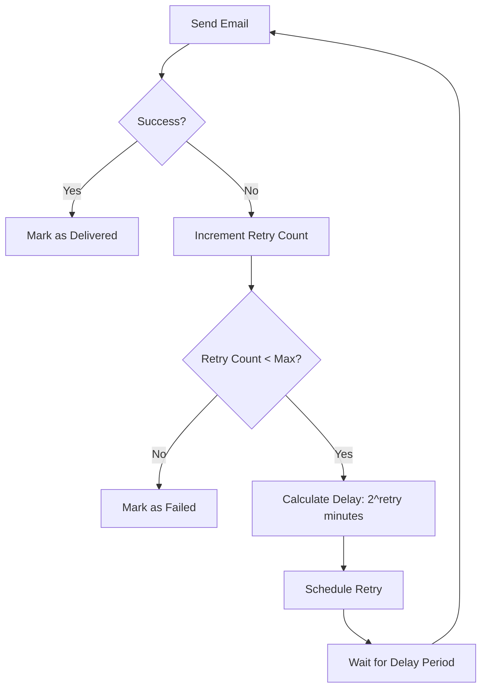
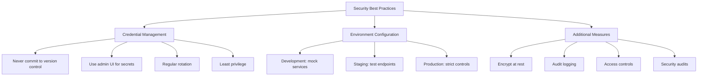

# Service Integrations

<cite>
**Referenced Files in This Document**   
- [.env.example](file://.env.example)
- [.env.notification-example](file://.env.notification-example)
- [app/config.py](file://vertex-ar/app/config.py)
- [app/api/notification_settings.py](file://vertex-ar/app/api/notification_settings.py)
- [app/notification_config.py](file://vertex-ar/app/notification_config.py)
- [app/encryption.py](file://vertex-ar/app/encryption.py)
- [templates/admin_notification_settings.html](file://vertex-ar/templates/admin_notification_settings.html)
</cite>

## Table of Contents
1. [Introduction](#introduction)
2. [Notification Services Configuration](#notification-services-configuration)
3. [Telegram Integration](#telegram-integration)
4. [Email Service Configuration](#email-service-configuration)
5. [Sentry Integration for Error Tracking](#sentry-integration-for-error-tracking)
6. [Notification Processing and Queue Management](#notification-processing-and-queue-management)
7. [Complete Configuration Examples](#complete-configuration-examples)
8. [Common Integration Issues](#common-integration-issues)
9. [Security Best Practices](#security-best-practices)
10. [Conclusion](#conclusion)

## Introduction
This document provides comprehensive guidance on configuring service integrations for the Vertex AR application, with a focus on notification systems. The documentation covers essential environment variables for integrating Telegram and email notifications, security considerations for credential management, and proper configuration of monitoring through Sentry. Special attention is given to the transition from environment-based SMTP credentials to the secure admin UI configuration method, as well as the implementation of robust notification processing with proper retry mechanisms and concurrency controls.

**Section sources**
- [.env.example](file://.env.example#L169-L208)
- [.env.notification-example](file://.env.notification-example#L1-L32)

## Notification Services Configuration
The Vertex AR application supports multiple notification channels for system alerts and operational updates. The primary notification services include Telegram for instant messaging alerts and email for formal notifications and reports. These services are configured through environment variables during initial setup, with sensitive credentials later managed through the secure admin UI. The notification system is designed with security and reliability in mind, featuring encrypted credential storage, audit logging, and robust error handling.

The configuration framework allows administrators to enable or disable notification channels based on their operational requirements. Each service has specific configuration parameters that control connectivity, authentication, and message delivery behavior. The system also supports notification routing by priority, allowing critical alerts to be delivered through multiple channels simultaneously while less urgent notifications follow different delivery patterns.



**Diagram sources**
- [.env.example](file://.env.example#L169-L208)
- [app/notification_config.py](file://vertex-ar/app/notification_config.py#L201-L220)

**Section sources**
- [.env.example](file://.env.example#L169-L208)
- [app/notification_config.py](file://vertex-ar/app/notification_config.py#L201-L220)

## Telegram Integration
### Configuration Variables
The Telegram integration requires two essential environment variables for initial setup:

- **TELEGRAM_BOT_TOKEN**: The authentication token for your Telegram bot, obtained from BotFather
- **TELEGRAM_CHAT_ID**: The recipient chat ID(s) where notifications should be sent

These variables are configured in the `.env` file during initial deployment. The application supports multiple recipients by accepting comma-separated chat IDs in the TELEGRAM_CHAT_ID variable.

### Obtaining Telegram Credentials
To configure Telegram notifications, you must first create a bot through Telegram's BotFather:

1. Start a chat with @BotFather on Telegram
2. Use the `/newbot` command to create a new bot
3. Follow the prompts to name your bot and choose a username
4. BotFather will provide an API token - this is your TELEGRAM_BOT_TOKEN
5. To find your chat ID, send a message to your new bot and visit `https://api.telegram.org/bot<your_token>/getUpdates` (replace `<your_token>` with your actual bot token)
6. Extract the chat ID from the JSON response under the "id" field within the "chat" object

### Security and Management
For enhanced security, the application provides an admin UI at `/admin/notification-settings` where Telegram credentials can be managed without requiring server restarts. The admin interface allows for secure credential rotation and provides audit logging for all configuration changes. When credentials are configured through the admin UI, they are encrypted using industry-standard encryption before being stored in the database.



**Diagram sources**
- [.env.example](file://.env.example#L170-L174)
- [templates/admin_notification_settings.html](file://vertex-ar/templates/admin_notification_settings.html#L338-L350)
- [app/api/notification_settings.py](file://vertex-ar/app/api/notification_settings.py#L320-L354)

**Section sources**
- [.env.example](file://.env.example#L170-L174)
- [templates/admin_notification_settings.html](file://vertex-ar/templates/admin_notification_settings.html#L338-L350)
- [app/api/notification_settings.py](file://vertex-ar/app/api/notification_settings.py#L320-L354)

## Email Service Configuration
### Current Configuration Parameters
The email service configuration includes several environment variables that control SMTP connectivity and message delivery:

- **SMTP_SERVER**: The SMTP server address (e.g., smtp.gmail.com)
- **SMTP_PORT**: The SMTP server port (typically 587 for TLS)
- **EMAIL_FROM**: The default sender email address
- **ADMIN_EMAILS**: Comma-separated list of administrator email addresses
- **SMTP_USE_SSL**: Boolean flag to enable SSL encryption

### Deprecated Variables and Security Warning
The environment variables **SMTP_USERNAME** and **SMTP_PASSWORD** are deprecated and should not be used in production environments. These variables present significant security risks as they expose credentials in environment variables, which can be accessed through various attack vectors including process listings, log files, and memory dumps.



**Diagram sources**
- [.env.example](file://.env.example#L180-L195)
- [templates/admin_notification_settings.html](file://vertex-ar/templates/admin_notification_settings.html#L327-L334)

**Section sources**
- [.env.example](file://.env.example#L180-L195)
- [templates/admin_notification_settings.html](file://vertex-ar/templates/admin_notification_settings.html#L327-L334)

### Migration to Secure Configuration
Administrators should migrate from environment-based SMTP credentials to the secure admin UI configuration method:

1. Access the admin panel at `/admin/notification-settings`
2. Navigate to the Email Settings section
3. Enter SMTP credentials (username and password) in the secure form
4. Save the configuration

The admin UI encrypts credentials using the application's encryption manager before storing them in the database. This approach provides several security advantages:
- Credentials are never exposed in environment variables
- Audit logs track all configuration changes
- Credentials can be rotated without server restarts
- Encrypted storage protects against database breaches

## Sentry Integration for Error Tracking
### Configuration Variables
The application integrates with Sentry for comprehensive error tracking and performance monitoring:

- **SENTRY_DSN**: The Data Source Name provided by Sentry for your project
- **SENTRY_ENVIRONMENT**: The environment name (e.g., production, staging)
- **SENTRY_TRACES_SAMPLE_RATE**: The sampling rate for performance traces (0.0 to 1.0)

### Implementation Details
The Sentry integration is configured in the application's main configuration file and initialized during application startup. The SENTRY_DSN variable is required to establish the connection to your Sentry project, while SENTRY_ENVIRONMENT helps differentiate between deployments in your monitoring dashboard.

The SENTRY_TRACES_SAMPLE_RATE controls the percentage of transactions that are captured for performance monitoring. A value of 0.1 means 10% of transactions will be sampled, which provides a balance between detailed performance data and system overhead. For high-traffic applications, a lower sampling rate may be appropriate to reduce costs and performance impact.

### Best Practices
- Set SENTRY_ENVIRONMENT to match your deployment environment (production, staging, development)
- Use different Sentry projects for different environments when possible
- Adjust SENTRY_TRACES_SAMPLE_RATE based on traffic volume and monitoring needs
- Monitor Sentry dashboard regularly for emerging issues
- Configure alert rules in Sentry for critical error types

**Section sources**
- [.env.example](file://.env.example#L127-L135)
- [app/config.py](file://vertex-ar/app/config.py#L178-L201)

## Notification Processing and Queue Management
### Email Queue Workers
The EMAIL_QUEUE_WORKERS environment variable controls the number of concurrent workers processing the email queue. The default value is 3, which provides a balance between delivery speed and system resource usage. This value can be adjusted based on server capacity and email volume:

- Increase for high-volume deployments to improve delivery throughput
- Decrease for resource-constrained environments to reduce memory usage
- Monitor system resources when adjusting this value

### Retry Strategy and Exponential Backoff
The email notification system implements a robust retry mechanism for failed deliveries:

- **EMAIL_MAX_RETRIES**: Maximum number of retry attempts (default: 3)
- Automatic exponential backoff strategy: 2^attempt minutes between retries
  - Attempt 1: 2 minutes delay
  - Attempt 2: 4 minutes delay  
  - Attempt 3: 8 minutes delay

This exponential backoff strategy prevents overwhelming external SMTP servers during temporary outages while ensuring reliable delivery. The retry delays are configurable through the EMAIL_RETRY_DELAYS environment variable, which accepts a comma-separated list of delay values in minutes.



**Diagram sources**
- [.env.example](file://.env.example#L211-L218)
- [app/config.py](file://vertex-ar/app/config.py#L185-L192)

**Section sources**
- [.env.example](file://.env.example#L211-L218)
- [app/config.py](file://vertex-ar/app/config.py#L185-L192)

## Complete Configuration Examples
### Production-Ready Notification Setup
```env
# Telegram Notifications
TELEGRAM_BOT_TOKEN=1234567890:ABCdefGHIjklMNOpqrsTUVwxyz1234567890
TELEGRAM_CHAT_ID=123456789,987654321

# Email Service Configuration (public settings only)
SMTP_SERVER=smtp.gmail.com
SMTP_PORT=587
EMAIL_FROM=alerts@yourcompany.com
ADMIN_EMAILS=admin@yourcompany.com,ops@yourcompany.com

# Sentry Integration
SENTRY_DSN=https://examplePublicKey@o0.ingest.sentry.io/0
SENTRY_ENVIRONMENT=production
SENTRY_TRACES_SAMPLE_RATE=0.1

# Email Queue Processing
EMAIL_QUEUE_WORKERS=5
EMAIL_MAX_RETRIES=3
```

### Development Environment Configuration
```env
# Telegram (optional for development)
TELEGRAM_BOT_TOKEN=
TELEGRAM_CHAT_ID=

# Email (using development SMTP service)
SMTP_SERVER=localhost
SMTP_PORT=1025
EMAIL_FROM=dev@localhost
ADMIN_EMAILS=developer@localhost

# Sentry (optional for development)
SENTRY_DSN=
SENTRY_ENVIRONMENT=development
SENTRY_TRACES_SAMPLE_RATE=1.0

# Email Queue (reduced workers for development)
EMAIL_QUEUE_WORKERS=1
EMAIL_MAX_RETRIES=2
```

**Section sources**
- [.env.example](file://.env.example#L169-L218)
- [.env.notification-example](file://.env.notification-example#L1-L32)

## Common Integration Issues
### Failed Message Delivery
Common causes and solutions:

- **Network connectivity issues**: Verify that the application server can reach the SMTP server or Telegram API endpoints
- **Firewall restrictions**: Ensure outbound connections on required ports are allowed
- **Rate limiting**: Implement proper retry strategies and monitor service rate limits
- **Invalid credentials**: Verify credentials through the test functionality in the admin UI

### Authentication Errors
- **Telegram "Bad Request: chat not found"**: Verify the chat ID is correct and the bot has been added to the chat/group
- **SMTP authentication failed**: Verify username/password and ensure app-specific passwords are used for services like Gmail
- **Sentry "Project does not exist"**: Verify the SENTRY_DSN is correct and the project exists in your Sentry organization

### Rate Limiting
Both Telegram and email services enforce rate limits:

- **Telegram**: Limits vary by endpoint but typically allow ~30 messages per second per chat
- **Email providers**: Gmail allows 500 emails per day for free accounts, 2,000 for Workspace

Mitigation strategies:
- Implement queuing with appropriate worker counts
- Use exponential backoff for retries
- Monitor service-specific rate limit headers
- Consider using dedicated email delivery services for high-volume needs

**Section sources**
- [app/api/notification_settings.py](file://vertex-ar/app/api/notification_settings.py#L320-L354)
- [app/config.py](file://vertex-ar/app/config.py#L185-L192)

## Security Best Practices
### Credential Management
- **Never commit credentials to version control**: Use `.env` files excluded from git
- **Use the admin UI for sensitive credentials**: Migrate from environment variables to encrypted database storage
- **Regular credential rotation**: Change credentials periodically and update through the admin UI
- **Least privilege principle**: Use dedicated service accounts with minimal required permissions

### Environment-Specific Configuration
- **Development**: Use mock services or sandbox environments
- **Staging**: Mirror production configuration but with test endpoints
- **Production**: Implement strict access controls and monitoring

### Additional Security Measures
- **Encrypt sensitive data at rest**: Ensure database encryption is enabled
- **Audit logging**: Maintain logs of all configuration changes
- **Access controls**: Restrict admin UI access to authorized personnel only
- **Regular security audits**: Review configuration and access patterns periodically



**Diagram sources**
- [.env.example](file://.env.example#L180-L195)
- [app/encryption.py](file://vertex-ar/app/encryption.py)
- [app/api/notification_settings.py](file://vertex-ar/app/api/notification_settings.py#L135-L144)

**Section sources**
- [.env.example](file://.env.example#L180-L195)
- [app/encryption.py](file://vertex-ar/app/encryption.py)
- [app/api/notification_settings.py](file://vertex-ar/app/api/notification_settings.py#L135-L144)

## Conclusion
Proper configuration of service integrations is critical for the reliable operation of the Vertex AR application. This documentation has covered the essential environment variables for notification services, with particular emphasis on the secure management of credentials. The transition from environment-based SMTP credentials to the encrypted admin UI configuration represents a significant security improvement that all administrators should implement.

Key takeaways include:
- Use Telegram for instant alerts with proper bot configuration
- Migrate from deprecated SMTP environment variables to the secure admin UI
- Configure Sentry for comprehensive error tracking and performance monitoring
- Implement appropriate email queue workers and retry strategies
- Follow security best practices for credential management across environments

By following these guidelines, administrators can ensure reliable notification delivery while maintaining the highest standards of security and operational excellence.