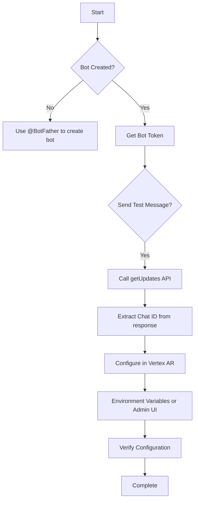
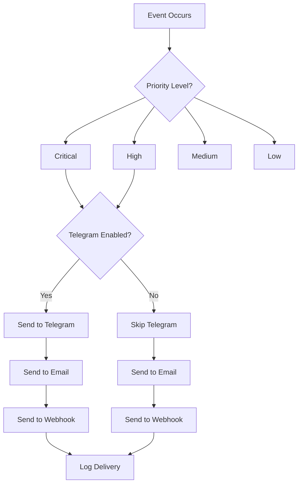
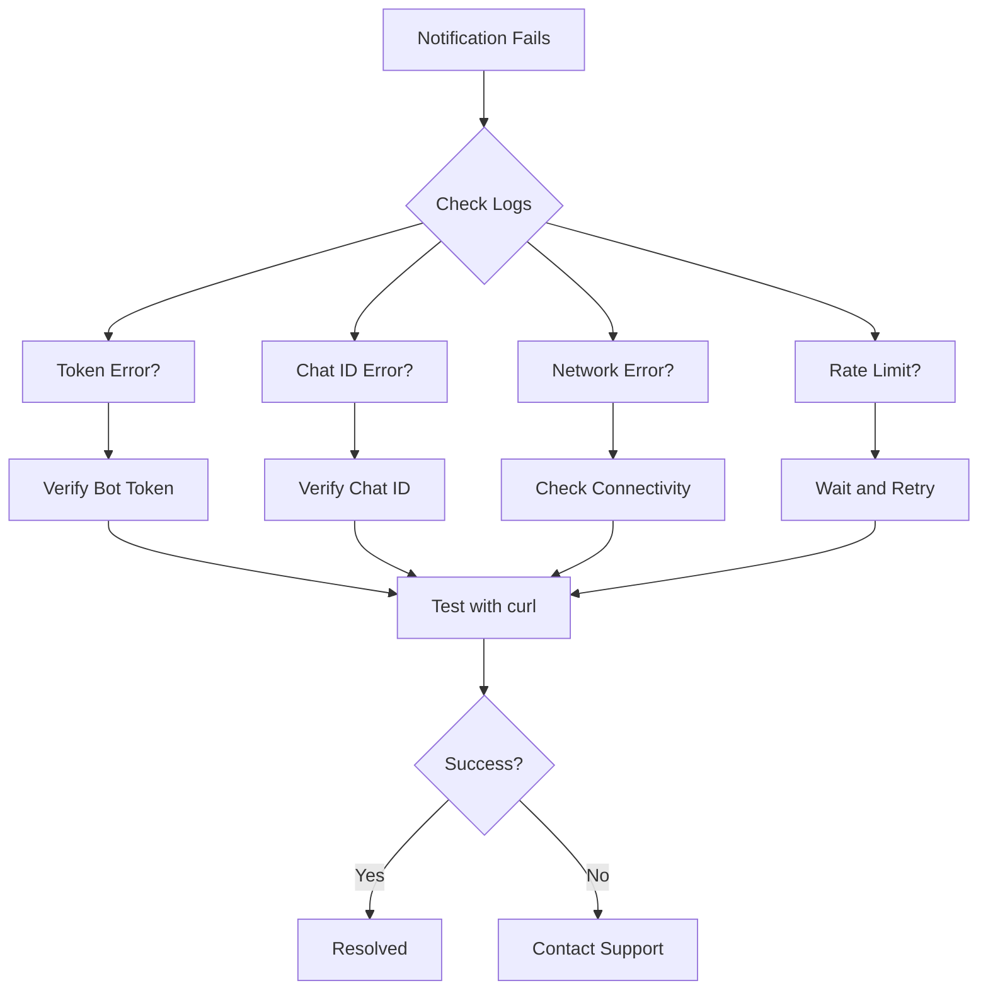

# Telegram Integration

<cite>
**Referenced Files in This Document**   
- [notification_integrations.py](file://vertex-ar/notification_integrations.py)
- [alerting.py](file://vertex-ar/app/alerting.py)
- [config.py](file://vertex-ar/app/config.py)
- [.env.example](file://vertex-ar/.env.example)
- [notification_config.py](file://vertex-ar/app/notification_config.py)
- [admin_notification_settings.html](file://vertex-ar/templates/admin_notification_settings.html)
- [notification_handler.py](file://vertex-ar/notification_handler.py)
- [notifications.py](file://vertex-ar/notifications.py)
</cite>

## Table of Contents
1. [Introduction](#introduction)
2. [Configuration Settings](#configuration-settings)
3. [Bot Setup and Authentication](#bot-setup-and-authentication)
4. [Notification Routing and Priority](#notification-routing-and-priority)
5. [Implementation and Code Examples](#implementation-and-code-examples)
6. [Security Considerations](#security-considerations)
7. [Troubleshooting Common Issues](#troubleshooting-common-issues)
8. [Notification Content and Formatting](#notification-content-and-formatting)
9. [Monitoring and Alert History](#monitoring-and-alert-history)
10. [Conclusion](#conclusion)

## Introduction
The Vertex AR system provides comprehensive Telegram notification integration for real-time alerting and monitoring. This documentation details the configuration, implementation, and management of Telegram notifications within the system. The integration allows administrators to receive critical alerts about system health, backup operations, resource usage, and application events directly in Telegram. The system supports both environment variable configuration and secure database storage for Telegram credentials, with fallback mechanisms and comprehensive error handling. Notifications are routed based on severity levels, and the system includes features for deduplication, cooldown periods, and delivery confirmation.

## Configuration Settings

The Telegram notification system in Vertex AR is controlled by several key environment variables and configuration settings that determine how and when alerts are sent.

### Core Configuration Variables
The primary configuration for Telegram notifications is managed through environment variables defined in the `.env` file. These variables control the connection to the Telegram API and the routing of notifications based on severity.

```env
# Telegram Bot Token (obtained from @BotFather)
TELEGRAM_BOT_TOKEN=

# Telegram Chat ID (your chat ID or group)
TELEGRAM_CHAT_ID=

# Enable or disable Telegram alerts
NOTIFICATION_TELEGRAM_ENABLED=true

# Notification routes by priority level
CRITICAL_NOTIFICATION_ROUTES=telegram,email,webhook
HIGH_NOTIFICATION_ROUTES=telegram,email
MEDIUM_NOTIFICATION_ROUTES=email
LOW_NOTIFICATION_ROUTES=
```

The system also supports database-based configuration through the admin interface, which takes precedence over environment variables for enhanced security. When both database and environment configurations are present, the system uses the database settings.

**Section sources**
- [.env.example](file://vertex-ar/.env.example#L146-L155)
- [config.py](file://vertex-ar/app/config.py#L71-L73)
- [config.py](file://vertex-ar/app/config.py#L151-L160)

## Bot Setup and Authentication

### Creating a Telegram Bot
To integrate Telegram notifications with Vertex AR, you need to create a bot through Telegram's BotFather. Follow these steps:

1. Open Telegram and search for the @BotFather bot
2. Start a chat with @BotFather and use the `/newbot` command
3. Follow the prompts to name your bot and choose a username
4. After creation, BotFather will provide a token in the format `1234567890:ABCdefGHIjklMNOpqrsTUVwxyz`
5. Save this token securely as it authenticates your bot with the Telegram API

### Obtaining Chat ID
To send messages to a specific user or group, you need the corresponding Chat ID:

1. **For direct messages**: Start a conversation with your bot, then visit `https://api.telegram.org/bot<TOKEN>/getUpdates` (replace `<TOKEN>` with your bot token)
2. **For groups**: Add your bot to the group, send a message, then check the updates endpoint
3. The response will contain a JSON object with the chat ID in the `message.chat.id` field
4. The chat ID is typically a numeric value like `123456789` or negative for groups like `-100123456789`

### Configuration Methods
Vertex AR supports two methods for configuring Telegram credentials:

1. **Environment variables**: Set `TELEGRAM_BOT_TOKEN` and `TELEGRAM_CHAT_ID` in the `.env` file
2. **Database storage**: Configure through the admin UI at `/admin/notification-settings` for encrypted storage

The system prioritizes database configuration over environment variables for enhanced security.



**Diagram sources**
- [alerting.py](file://vertex-ar/app/alerting.py#L23-L115)
- [notification_config.py](file://vertex-ar/app/notification_config.py#L146-L161)

**Section sources**
- [.env.example](file://vertex-ar/.env.example#L150-L154)
- [admin_notification_settings.html](file://vertex-ar/templates/admin_notification_settings.html#L338-L350)

## Notification Routing and Priority

The Vertex AR system implements a sophisticated notification routing mechanism that determines when and how Telegram messages are sent based on the severity of events.

### Priority Levels
The system recognizes five priority levels for notifications:

- **Critical**: System-critical issues requiring immediate attention
- **High**: Important issues that should be addressed promptly
- **Medium**: Notable events that require awareness
- **Low**: Informational messages of minor importance
- **Ignore**: Events that should not trigger notifications

### Route Configuration
Notification routes are configured through environment variables that specify which integration channels should be used for each priority level:

```env
CRITICAL_NOTIFICATION_ROUTES=telegram,email,webhook
HIGH_NOTIFICATION_ROUTES=telegram,email
MEDIUM_NOTIFICATION_ROUTES=email
LOW_NOTIFICATION_ROUTES=
```

The system evaluates these routes in conjunction with the `NOTIFICATION_TELEGRAM_ENABLED` flag to determine whether Telegram should be used for a given notification.

### Routing Logic
When an alert is triggered, the system follows this decision process:

1. Determine the severity/priority of the event
2. Check if notifications are enabled for the integration type
3. Retrieve the appropriate route configuration for the priority level
4. Send the notification to all enabled channels in the route
5. Log delivery attempts and results



**Diagram sources**
- [alerting.py](file://vertex-ar/app/alerting.py#L329-L353)
- [config.py](file://vertex-ar/app/config.py#L156-L160)

**Section sources**
- [config.py](file://vertex-ar/app/config.py#L151-L160)
- [alerting.py](file://vertex-ar/app/alerting.py#L329-L353)

## Implementation and Code Examples

### Python Implementation
The Telegram notification system is implemented in Python using the `aiohttp` library for asynchronous HTTP requests to the Telegram Bot API. The core functionality is contained in the `AlertManager` class within the `alerting.py` module.

```python
async def send_telegram_alert(self, message: str) -> bool:
    """Send alert via Telegram bot."""
    # Try to get settings from database first
    from app.notification_config import get_notification_config
    notification_config = get_notification_config()
    telegram_config = notification_config.get_telegram_config()
    
    if telegram_config:
        bot_token = telegram_config['bot_token']
        chat_ids = telegram_config['chat_ids']
    else:
        # Fallback to environment variables
        bot_token = settings.TELEGRAM_BOT_TOKEN
        chat_ids = [settings.TELEGRAM_CHAT_ID] if settings.TELEGRAM_CHAT_ID else []
    
    if not bot_token or not chat_ids:
        logger.warning("Telegram credentials not configured")
        return False
        
    try:
        success_count = 0
        for chat_id in chat_ids:
            try:
                url = f"https://api.telegram.org/bot{bot_token}/sendMessage"
                payload = {
                    "chat_id": chat_id,
                    "text": f"🚨 **VERTEX AR ALERT** 🚨\n\n{message}",
                    "parse_mode": "Markdown"
                }
                
                async with aiohttp.ClientSession() as session:
                    async with session.post(url, json=payload, timeout=10) as response:
                        if response.status == 200:
                            logger.info(f"Telegram alert sent successfully to {chat_id}")
                            success_count += 1
                        else:
                            error_text = await response.text()
                            logger.error(f"Failed to send Telegram alert to {chat_id}: {response.status} - {error_text}")
            except Exception as e:
                logger.error(f"Error sending Telegram alert to {chat_id}: {e}")
        
        return success_count > 0
                    
    except Exception as e:
        logger.error(f"Error sending Telegram alert: {e}")
        return False
```

### Integration with Notification System
The Telegram integration is part of a broader notification system that routes alerts through multiple channels. The `NotificationIntegrator` class handles the routing logic:

```python
async def _handle_telegram(self, notification_data: Dict[str, Any], priority: str) -> bool:
    """Handle Telegram integration."""
    try:
        from app.alerting import alert_manager
        return await alert_manager.send_telegram_alert(
            self._format_message(notification_data, priority)
        )
    except Exception as e:
        logger.error(f"Telegram integration error: {e}")
        return False
```

### Sending Test Notifications
The system includes functionality to test the Telegram configuration:

```python
async def test_alert_system(self) -> Dict[str, bool]:
    """Test all alert channels."""
    logger.info("Testing alert system...")
    
    results = {}
    
    # Test Telegram
    if settings.TELEGRAM_BOT_TOKEN:
        results["telegram"] = await self.send_telegram_alert("Test message from Vertex AR alert system")
    else:
        results["telegram"] = False
```

**Section sources**
- [alerting.py](file://vertex-ar/app/alerting.py#L23-L115)
- [notification_integrations.py](file://vertex-ar/notification_integrations.py#L176-L185)

## Security Considerations

### Token Protection
The Telegram bot token is a sensitive credential that must be protected to prevent unauthorized access to your bot. The Vertex AR system implements multiple security measures:

1. **Environment variable protection**: The `.env` file should not be committed to version control
2. **Database encryption**: Credentials can be stored in the database with encryption
3. **Runtime validation**: The system validates configuration at startup

### Best Practices
To ensure the security of your Telegram integration:

1. **Never expose tokens in public repositories**: Use `.env` files and add them to `.gitignore`
2. **Use database storage**: Configure credentials through the admin UI for encrypted storage
3. **Restrict bot permissions**: Only grant the bot permissions it needs
4. **Monitor token usage**: Regularly check for unauthorized access
5. **Rotate tokens**: Periodically regenerate bot tokens

### IP Restrictions
While Telegram does not support IP restrictions for bot APIs, you can enhance security by:

1. **Restricting access to the Vertex AR server**: Use firewalls to limit access to trusted IPs
2. **Monitoring logs**: Regularly review system logs for suspicious activity
3. **Using secure connections**: Ensure all communication uses HTTPS

The system also includes security warnings when deprecated configuration methods are detected:

```python
if _env_smtp_username or _env_smtp_password:
    warning_msg = (
        "CRITICAL SECURITY WARNING: SMTP credentials detected in environment variables!\n"
        "  Environment-based SMTP_USERNAME and SMTP_PASSWORD are deprecated and insecure.\n"
        "  ACTION REQUIRED:\n"
        "    1. Access the admin notification settings UI at /admin/notification-settings\n"
        "    2. Configure SMTP credentials through the secure encrypted storage interface\n"
        "    3. Remove SMTP_USERNAME and SMTP_PASSWORD from your .env file and environment\n"
    )
```

**Section sources**
- [config.py](file://vertex-ar/app/config.py#L81-L113)
- [notification_config.py](file://vertex-ar/app/notification_config.py#L64-L71)

## Troubleshooting Common Issues

### Invalid Token Errors
When encountering "Invalid token" errors:

1. **Verify the token format**: Ensure it matches the pattern `1234567890:ABCdefGHIjklMNOpqrsTUVwxyz`
2. **Check for typos**: Copy the token directly from BotFather
3. **Regenerate the token**: Use @BotFather to generate a new token if compromised
4. **Verify bot status**: Ensure the bot has not been deactivated

### Unauthorized Chat ID
When receiving "Unauthorized" errors:

1. **Confirm the chat exists**: Ensure the user or group exists
2. **Start a conversation**: For direct messages, the user must have started a conversation with the bot
3. **Add bot to group**: For group messages, ensure the bot is a member of the group
4. **Check chat ID format**: Verify the chat ID is correct and properly formatted

### Network Connectivity Problems
For network-related issues:

1. **Verify server connectivity**: Ensure the Vertex AR server can reach `api.telegram.org`
2. **Check firewall rules**: Ensure outbound connections on port 443 are allowed
3. **Test connectivity**: Use tools like `curl` or `ping` to test connectivity
4. **Review proxy settings**: If behind a proxy, ensure proper configuration

### Message Rate Limits
Telegram enforces rate limits to prevent spam:

1. **Message frequency**: No more than 30 messages per second per chat
2. **Bulk limits**: Up to 20 messages per minute for notifications
3. **Implementation**: The system includes cooldown periods and deduplication

The Vertex AR system handles rate limiting through:

- **Cooldown periods**: 5-minute cooldown between same alert types
- **Deduplication**: Suppression of duplicate alerts within a window
- **Retry logic**: Exponential backoff for failed deliveries

### Debugging Steps
To diagnose notification issues:

1. **Check system logs**: Look for error messages in the application logs
2. **Verify configuration**: Confirm settings in both environment variables and database
3. **Test connectivity**: Use the test notification feature in the admin UI
4. **Review delivery history**: Check the notification history for delivery status



**Diagram sources**
- [alerting.py](file://vertex-ar/app/alerting.py#L74-L91)
- [notification_integrations.py](file://vertex-ar/notification_integrations.py#L115-L128)

**Section sources**
- [alerting.py](file://vertex-ar/app/alerting.py#L74-L115)
- [notification_integrations.py](file://vertex-ar/notification_integrations.py#L115-L128)

## Notification Content and Formatting

### Message Structure
Telegram notifications from Vertex AR follow a standardized format that includes:

- **Emoji indicators**: Visual cues for severity (🔴 for critical, 🟠 for high)
- **Markdown formatting**: Bold text for emphasis and structure
- **Structured content**: Title, message body, source, and timestamp
- **Consistent branding**: "VERTEX AR ALERT" header

Example message format:
```
🚨 **VERTEX AR ALERT** 🚨

🔴 **HIGH**
**Backup Process Completed**
Backup process completed successfully for database and storage.

*Source: backup_system | Service: vertex_ar*
*Time: 2025-01-15 10:30:45 UTC*
```

### Customization Options
Administrators can customize notification content through:

1. **Event settings**: Enable or disable specific notification types
2. **Template customization**: Modify message templates in the code
3. **Severity mapping**: Adjust how events are categorized by severity
4. **Content filtering**: Configure which information is included

### Severity-Based Formatting
The system uses different formatting for different severity levels:

- **Critical**: Red emoji (🔴), urgent language, immediate attention required
- **High**: Orange emoji (🟠), important notice, prompt action needed
- **Medium**: Yellow emoji (🟡), informational, awareness required
- **Low**: Green emoji (🟢), routine update, no action needed

The formatting is implemented in the `_format_message` method of the `NotificationIntegrator` class:

```python
def _format_message(self, notification_data: Dict[str, Any], priority: str) -> str:
    """Format notification message for external services."""
    priority_emoji = {
        "critical": "🔴",
        "high": "🟠", 
        "medium": "🟡",
        "low": "🟢",
        "ignore": "⚪"
    }
    
    emoji = priority_emoji.get(priority, "📢")
    
    message = f"{emoji} **{priority.upper()}**\n\n"
    message += f"**{notification_data.get('title', 'Notification')}**\n\n"
    message += f"{notification_data.get('message', '')}\n"
    
    if notification_data.get('source'):
        message += f"\n*Source: {notification_data['source']}*"
    
    if notification_data.get('service_name'):
        message += f" | *Service: {notification_data['service_name']}*"
    
    message += f"\n\n*Time: {datetime.utcnow().strftime('%Y-%m-%d %H:%M:%S')} UTC*"
    
    return message
```

**Section sources**
- [notification_integrations.py](file://vertex-ar/notification_integrations.py#L213-L237)
- [alerting.py](file://vertex-ar/app/alerting.py#L239-L240)

## Monitoring and Alert History

### Delivery Confirmation
The system maintains a comprehensive history of all notification attempts, including:

- **Success tracking**: Records successful deliveries with timestamps
- **Failure logging**: Captures error details for failed attempts
- **Retry management**: Tracks retry attempts with exponential backoff
- **Delivery verification**: Confirms message receipt by the Telegram API

### Notification History
All notification attempts are logged in the database with the following details:

- **History ID**: Unique identifier for each notification attempt
- **Notification type**: Telegram, email, or webhook
- **Recipient**: Chat ID, email address, or webhook URL
- **Message content**: The message sent
- **Status**: Sent, failed, or pending
- **Error messages**: Details of any delivery failures
- **Timestamps**: Creation and delivery times

The history is stored using the `add_notification_history` method in the database module:

```python
db.add_notification_history(
    history_id=str(uuid.uuid4()),
    notification_type='telegram',
    recipient=str(chat_id),
    message=message,
    status='sent'
)
```

### Status Monitoring
Administrators can monitor notification system health through:

1. **Admin UI**: View notification history and status in the admin panel
2. **System logs**: Review detailed logs of all notification attempts
3. **Delivery statistics**: Track success rates and failure patterns
4. **Alert testing**: Use the test function to verify configuration

The system also includes a test function to verify the alert system:

```python
async def test_alert_system(self) -> Dict[str, bool]:
    """Test all alert channels."""
    logger.info("Testing alert system...")
    
    results = {}
    
    # Test Telegram
    if settings.TELEGRAM_BOT_TOKEN:
        results["telegram"] = await self.send_telegram_alert("Test message from Vertex AR alert system")
    else:
        results["telegram"] = False
```

**Section sources**
- [alerting.py](file://vertex-ar/app/alerting.py#L63-L108)
- [notification_handler.py](file://vertex-ar/notification_handler.py#L1-L110)

## Conclusion
The Telegram notification integration in Vertex AR provides a robust and secure system for real-time alerting and monitoring. By leveraging both environment variable configuration and secure database storage, the system offers flexibility while maintaining security best practices. The routing system allows administrators to control which events trigger Telegram notifications based on severity, ensuring that critical issues receive immediate attention while minimizing notification fatigue. With comprehensive logging, delivery confirmation, and troubleshooting tools, the system provides full visibility into notification delivery and reliability. By following the configuration guidelines and security recommendations outlined in this documentation, administrators can ensure reliable and secure notification delivery for their Vertex AR deployment.