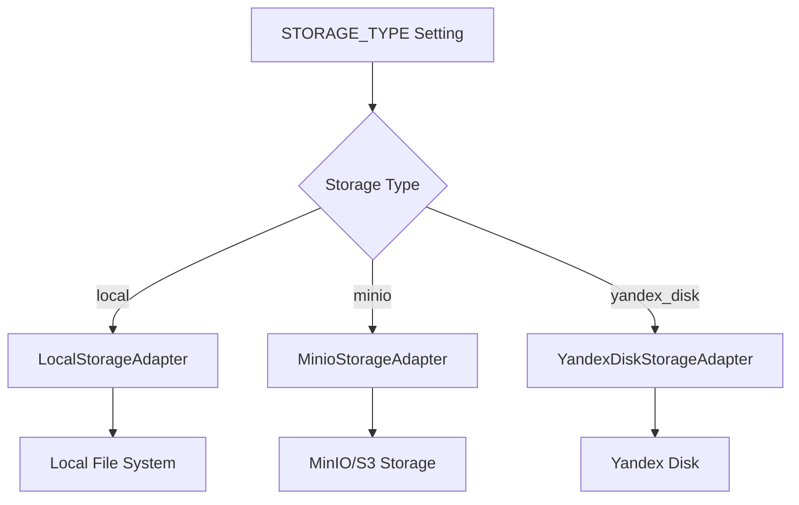
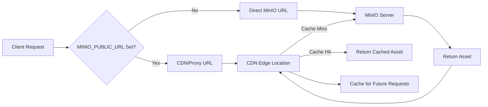
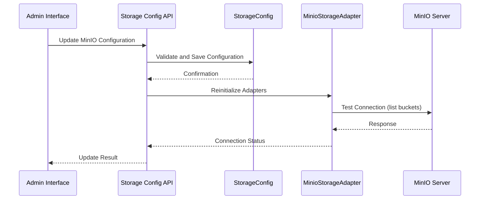
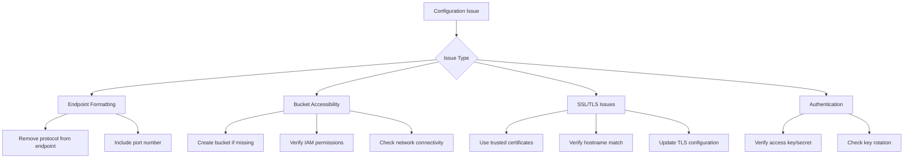
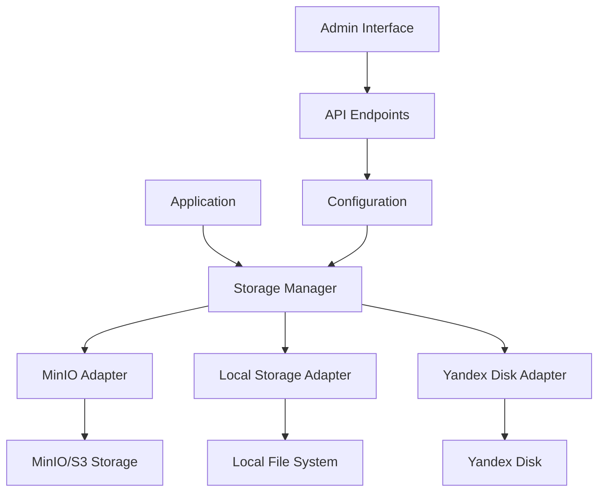

# MinIO/S3 Storage Configuration

<cite>
**Referenced Files in This Document**   
- [.env.example](file://.env.example)
- [.env.production.example](file://.env.production.example)
- [app/config.py](file://vertex-ar/app/config.py)
- [storage.py](file://vertex-ar/storage.py)
- [storage_manager.py](file://vertex-ar/storage_manager.py)
- [app/storage_minio.py](file://vertex-ar/app/storage_minio.py)
- [storage_config.py](file://vertex-ar/storage_config.py)
- [app/api/storage_config.py](file://vertex-ar/app/api/storage_config.py)
</cite>

## Table of Contents
1. [Introduction](#introduction)
2. [STORAGE_TYPE Configuration](#storagetype-configuration)
3. [Required MinIO Parameters](#required-minio-parameters)
4. [Optional MINIO_PUBLIC_URL](#optional-minio_public_url)
5. [Configuration Examples](#configuration-examples)
6. [Configuration Validation](#configuration-validation)
7. [Common Configuration Pitfalls](#common-configuration-pitfalls)
8. [Troubleshooting Guide](#troubleshooting-guide)
9. [Storage Architecture](#storage-architecture)

## Introduction
This document provides comprehensive guidance for configuring MinIO or S3-compatible storage in the Vertex AR system. The Vertex AR platform supports multiple storage backends, with MinIO being the primary option for scalable, distributed storage. This configuration enables the system to handle large volumes of AR content, videos, portraits, and NFT markers across different deployment environments.

The storage system is designed with flexibility in mind, allowing administrators to configure different storage types for various content categories. The configuration can be managed through environment variables, API endpoints, or the admin interface, providing multiple pathways for deployment and management.

**Section sources**
- [.env.example](file://.env.example#L42-L70)
- [.env.production.example](file://.env.production.example#L19-L34)

## STORAGE_TYPE Configuration
The `STORAGE_TYPE` environment variable determines the storage backend used by the Vertex AR system. This setting has significant implications on system behavior, performance characteristics, and deployment requirements.

When `STORAGE_TYPE='minio'`, the system switches from local file storage to an S3-compatible object storage backend. This enables several key capabilities:
- **Scalability**: Horizontal scaling of storage capacity without application downtime
- **High Availability**: Redundant storage across multiple nodes or availability zones
- **Distributed Access**: Multiple application instances can access the same storage pool
- **Backup and Recovery**: Simplified backup procedures through bucket-level operations
- **CDN Integration**: Seamless integration with content delivery networks

The storage manager dynamically initializes the appropriate adapter based on this setting. For MinIO configuration, the system creates a `MinioStorageAdapter` instance that handles all S3 operations, while falling back to `LocalStorageAdapter` for the 'local' storage type.

The system also supports per-company storage configurations, allowing different organizations within the same deployment to use different storage backends based on their requirements and subscription levels.



**Diagram sources**
- [app/storage_manager.py](file://vertex-ar/storage_manager.py#L50-L93)
- [app/storage_minio.py](file://vertex-ar/app/storage_minio.py#L10-L25)

**Section sources**
- [.env.example](file://.env.example#L43)
- [app/config.py](file://vertex-ar/app/config.py#L65)

## Required MinIO Parameters
The MinIO storage configuration requires several essential parameters that must be correctly set for the system to function properly. These parameters are loaded from environment variables and validated during application startup.

### MINIO_ENDPOINT
The `MINIO_ENDPOINT` parameter specifies the network address of the MinIO server, including the port number but excluding the protocol scheme. The endpoint should be provided in the format `hostname:port` (e.g., `minio.example.com:9000` or `localhost:9000`).

The system automatically handles protocol determination based on the `MINIO_SECURE` flag and port number. When `MINIO_SECURE=True` or the port is 443, HTTPS is used; otherwise, HTTP is used. The configuration code explicitly strips any protocol prefix from the endpoint to ensure consistent formatting.

For production deployments, it's recommended to use a dedicated domain name rather than an IP address to facilitate seamless infrastructure changes and SSL certificate management.

### MINIO_ACCESS_KEY and MINIO_SECRET_KEY
The `MINIO_ACCESS_KEY` and `MINIO_SECRET_KEY` parameters provide the authentication credentials for accessing the MinIO server. These credentials follow AWS IAM-style access control and must be kept secure.

Security best practices for these credentials include:
- **Never commit to version control**: Ensure the .env file is included in .gitignore
- **Use strong, randomly generated keys**: Avoid default credentials like "minioadmin"
- **Rotate credentials periodically**: Implement a credential rotation policy
- **Restrict permissions**: Use IAM policies to limit the access scope of the credentials
- **Environment-specific credentials**: Use different credentials for development, staging, and production

The system encrypts these credentials when stored in the database for company-specific storage connections, providing an additional layer of security beyond environment variable protection.

### MINIO_BUCKET
The `MINIO_BUCKET` parameter specifies the name of the bucket (or container) within the MinIO server where application data will be stored. Bucket naming conventions follow S3 standards:
- Must be between 3 and 63 characters long
- Can contain lowercase letters, numbers, dots, and hyphens
- Must start and end with a letter or number
- Cannot contain two adjacent periods
- Cannot be formatted as an IP address

The bucket must exist before the application starts, or the system must have permissions to create it. The storage initialization code automatically creates the bucket if it doesn't exist, but this requires the access key to have bucket creation privileges.

### MINIO_SECURE
The `MINIO_SECURE` parameter is a boolean flag that determines whether to use HTTPS (True) or HTTP (False) when connecting to the MinIO server. This setting is critical for security in production environments.

When `MINIO_SECURE=True`, the system establishes an encrypted TLS connection to the MinIO server, protecting data in transit from eavesdropping and man-in-the-middle attacks. This is mandatory when the MinIO server is accessible over public networks or contains sensitive data.

In development environments, this can be set to False to simplify setup, but it should always be True in production. The system validates SSL certificates by default, ensuring the authenticity of the MinIO server.

```mermaid
classDiagram
class MinioStorageAdapter {
+string endpoint
+string access_key
+string secret_key
+string bucket
+bool secure
-Minio client
+save_file(file_data, file_path) str
+get_file(file_path) bytes
+delete_file(file_path) bool
+file_exists(file_path) bool
+get_public_url(file_path) str
}
class StorageManager {
+Path storage_root
+dict config
+dict adapters
+dict _company_adapters
+get_adapter(content_type) StorageAdapter
+get_company_adapter(company_id, content_type) StorageAdapter
+save_file(file_data, file_path, content_type) str
+get_file(file_path, content_type) bytes
+delete_file(file_path, content_type) bool
}
StorageManager --> MinioStorageAdapter : "uses"
MinioStorageAdapter --> "minio.Minio" : "depends on"
```

**Diagram sources**
- [app/storage_minio.py](file://vertex-ar/app/storage_minio.py#L10-L134)
- [storage_manager.py](file://vertex-ar/storage_manager.py#L19-L175)

**Section sources**
- [.env.example](file://.env.example#L55-L65)
- [app/config.py](file://vertex-ar/app/config.py#L66-L69)
- [app/storage_minio.py](file://vertex-ar/app/storage_minio.py#L13-L25)

## Optional MINIO_PUBLIC_URL
The `MINIO_PUBLIC_URL` parameter is an optional setting that specifies a public endpoint for accessing stored assets, typically used for CDN integration. This parameter decouples the internal storage endpoint from the public asset delivery URL, enabling performance optimization and architectural flexibility.

When configured, the system uses this URL as the base for generating public asset URLs instead of constructing them from the `MINIO_ENDPOINT`. This is particularly useful in the following scenarios:

### CDN Integration
For content delivery network integration, set `MINIO_PUBLIC_URL` to the CDN endpoint (e.g., `https://cdn.example.com`). This directs client requests through the CDN, which caches assets at edge locations closer to end users, significantly improving load times and reducing latency.

The CDN acts as a caching layer between clients and the origin MinIO server, serving cached content for subsequent requests and only forwarding cache misses to the origin. This reduces bandwidth consumption on the MinIO server and improves overall system performance.

### Reverse Proxy Configuration
When MinIO is behind a reverse proxy or load balancer, the public URL may differ from the internal endpoint. For example, the internal endpoint might be `minio.internal:9000` while the public URL is `https://storage.example.com`.

This configuration allows network-level security controls, SSL termination at the proxy level, and simplified firewall rules, as only the proxy needs external access.

### Performance Impact
Using `MINIO_PUBLIC_URL` with a CDN provides several performance benefits:
- **Reduced Latency**: Assets are served from geographically distributed edge locations
- **Lower Bandwidth Costs**: CDN caches reduce data transfer from the origin server
- **Improved Scalability**: CDNs handle traffic spikes that might overwhelm the origin
- **Better User Experience**: Faster asset loading improves application responsiveness

The system automatically generates asset URLs using the public URL when configured, ensuring clients receive optimized delivery endpoints. If `MINIO_PUBLIC_URL` is not set, the system constructs URLs directly from the `MINIO_ENDPOINT` and bucket name.



**Diagram sources**
- [app/storage_minio.py](file://vertex-ar/app/storage_minio.py#L118-L134)
- [docs/features/storage-scaling.md](file://docs/features/storage-scaling.md#L278-L311)

**Section sources**
- [.env.example](file://.env.example#L67-L70)
- [app/storage_minio.py](file://vertex-ar/app/storage_minio.py#L127-L134)

## Configuration Examples
This section provides real-world examples of MinIO configuration from development and production environments, highlighting the differences in settings and security considerations.

### Development Environment Configuration
The development environment configuration prioritizes ease of setup and debugging over security. The `.env.example` file provides a template for local development:

```env
# Storage Settings
STORAGE_TYPE=local

# MinIO Settings (for development)
MINIO_ENDPOINT=localhost:9000
MINIO_ACCESS_KEY=minioadmin
MINIO_SECRET_KEY=minioadmin
MINIO_BUCKET=vertex-ar
MINIO_SECURE=False
MINIO_PUBLIC_URL=
```

Key characteristics of the development configuration:
- Uses HTTP (MINIO_SECURE=False) for simplified setup
- Uses default MinIO credentials for convenience
- No public URL configured, using direct MinIO access
- Local storage as default, with MinIO as an option

### Production Environment Configuration
The production environment configuration emphasizes security, reliability, and performance. The `.env.production.example` file demonstrates proper production settings:

```env
# Storage Settings - Remote MinIO
STORAGE_TYPE=minio

# Remote MinIO Configuration
MINIO_ENDPOINT=minio.yourdomain.com:9000
MINIO_ACCESS_KEY=your-production-access-key
MINIO_SECRET_KEY=your-production-secret-key
MINIO_BUCKET=vertex-ar-production
MINIO_SECURE=True
MINIO_PUBLIC_URL=https://cdn.yourdomain.com
```

Key characteristics of the production configuration:
- Uses HTTPS (MINIO_SECURE=True) for encrypted connections
- Uses strong, unique credentials instead of defaults
- Configures a CDN endpoint for improved performance
- Uses a dedicated production domain for the MinIO endpoint
- Specifies a production-specific bucket name

Additional production considerations include:
- Using infrastructure-as-code to manage credentials
- Implementing automated credential rotation
- Monitoring storage usage and performance metrics
- Configuring appropriate bucket policies and CORS settings
- Setting up cross-region replication for disaster recovery

**Section sources**
- [.env.example](file://.env.example#L43-L70)
- [.env.production.example](file://.env.production.example#L19-L34)

## Configuration Validation
The Vertex AR system implements comprehensive validation logic to ensure MinIO configuration correctness. This validation occurs at multiple levels: environment variable loading, storage adapter initialization, and runtime configuration management.

### Environment Variable Loading
The `Settings` class in `config.py` loads and validates MinIO configuration from environment variables with sensible defaults:

```python
self.STORAGE_TYPE = os.getenv("STORAGE_TYPE", "local")
self.MINIO_ENDPOINT = os.getenv("MINIO_ENDPOINT", "localhost:9000")
self.MINIO_ACCESS_KEY = os.getenv("MINIO_ACCESS_KEY", "minioadmin")
self.MINIO_SECRET_KEY = os.getenv("MINIO_SECRET_KEY", "minioadmin")
self.MINIO_BUCKET = os.getenv("MINIO_BUCKET", "vertex-ar")
```

The system provides default values for all MinIO parameters, allowing the application to start even if some variables are missing. However, these defaults are only suitable for development and should be overridden in production.

### Storage Adapter Initialization
The `MinioStorageAdapter` performs additional validation during initialization, including:
- Verifying the availability of the MinIO client library
- Establishing a connection to the MinIO server
- Checking bucket existence and creating it if necessary
- Validating credentials through a test operation

The adapter automatically creates the configured bucket if it doesn't exist, reducing deployment complexity. However, this requires the provided credentials to have bucket creation permissions.

### Runtime Configuration Management
The system provides API endpoints for dynamic configuration management through the `storage_config.py` module. These endpoints validate input data and ensure configuration consistency:

```python
@router.post("/minio")
async def update_minio_config(config: MinioConfig) -> Dict[str, Any]:
    # Validation occurs through Pydantic model
    # Configuration is saved and adapters are reinitialized
```

The `MinioConfig` Pydantic model enforces data types and required fields, preventing invalid configurations from being saved. After updating the configuration, the system reinitializes all storage adapters to apply the changes.

The admin interface also provides a test connection feature that verifies the MinIO configuration by attempting to list buckets or perform a test operation, providing immediate feedback on configuration correctness.



**Diagram sources**
- [app/config.py](file://vertex-ar/app/config.py#L65-L69)
- [storage_config.py](file://vertex-ar/storage_config.py#L172-L182)
- [app/api/storage_config.py](file://vertex-ar/app/api/storage_config.py#L189-L217)

**Section sources**
- [app/config.py](file://vertex-ar/app/config.py#L65-L69)
- [storage_config.py](file://vertex-ar/storage_config.py#L172-L182)
- [app/api/storage_config.py](file://vertex-ar/app/api/storage_config.py#L189-L217)

## Common Configuration Pitfalls
This section addresses common configuration issues that can prevent successful MinIO integration, along with their solutions and prevention strategies.

### Incorrect Endpoint Formatting
One of the most common issues is incorrect endpoint formatting. The `MINIO_ENDPOINT` should not include the protocol (http:// or https://) and should include the port number. Common mistakes include:

- Including the protocol: `http://minio.example.com:9000` (incorrect)
- Omitting the port: `minio.example.com` (incorrect)
- Using IP address without port: `192.168.1.100` (incorrect)

The correct format is `hostname:port` (e.g., `minio.example.com:9000`). The system automatically determines the protocol based on the `MINIO_SECURE` flag and port number.

### Bucket Accessibility Issues
Bucket accessibility problems typically stem from one of these causes:
- **Bucket does not exist**: The specified bucket hasn't been created
- **Insufficient permissions**: The access key lacks permissions to access the bucket
- **Region mismatch**: The bucket is in a different region than expected
- **Network connectivity**: Firewall rules block access to the MinIO server

Solutions include:
- Ensure the bucket exists before starting the application
- Verify the access key has appropriate IAM policies
- Check network connectivity and firewall rules
- Use the same region for all operations

### SSL/TLS Handshake Failures
SSL/TLS handshake failures occur when `MINIO_SECURE=True` but the SSL configuration is incorrect. Common causes include:
- **Self-signed certificates**: MinIO's default certificates are self-signed
- **Certificate chain issues**: Intermediate certificates are missing
- **Hostname mismatch**: Certificate doesn't match the endpoint hostname
- **Outdated TLS versions**: Server and client support different TLS versions

To resolve SSL issues:
- Use trusted certificates from a recognized CA
- Ensure the certificate covers the endpoint hostname
- Configure both client and server to support modern TLS versions
- Consider using a reverse proxy with proper SSL termination



**Diagram sources**
- [app/storage_minio.py](file://vertex-ar/app/storage_minio.py#L22-L30)
- [storage.py](file://vertex-ar/storage.py#L24-L30)
- [app/storage_minio.py](file://vertex-ar/app/storage_minio.py#L27-L34)

**Section sources**
- [.env.example](file://.env.example#L55)
- [app/storage_minio.py](file://vertex-ar/app/storage_minio.py#L22-L30)
- [storage.py](file://vertex-ar/storage.py#L24-L30)

## Troubleshooting Guide
This section provides guidance for diagnosing and resolving common connectivity problems, authentication issues, and performance bottlenecks with MinIO storage.

### Connectivity Problems
When experiencing connectivity issues, follow this diagnostic process:

1. **Verify network connectivity**:
   ```bash
   telnet minio.example.com 9000
   # or
   nc -zv minio.example.com 9000
   ```

2. **Check DNS resolution**:
   ```bash
   nslookup minio.example.com
   dig minio.example.com
   ```

3. **Test basic HTTP connectivity**:
   ```bash
   curl -v http://minio.example.com:9000/minio/health/ready
   ```

4. **Verify firewall rules** allow traffic on the MinIO port (typically 9000).

### Signature Mismatches
Signature mismatch errors typically indicate credential or configuration issues:

- **Verify access key and secret key** match exactly, including case
- **Check for whitespace** in credentials, especially when copying from configuration files
- **Ensure the endpoint** matches exactly what's configured in MinIO
- **Verify the bucket name** is correct and accessible with the provided credentials
- **Check timestamp synchronization** between client and server

The system logs detailed error information that can help identify the specific cause of signature mismatches.

### Performance Tuning for Large File Transfers
For optimal performance with large file transfers, consider these tuning recommendations:

- **Adjust multipart upload settings**: Configure appropriate part sizes for your network conditions
- **Enable compression**: Compress files before upload when appropriate
- **Use parallel uploads**: Upload multiple parts simultaneously
- **Optimize network path**: Ensure low-latency, high-bandwidth connection to MinIO
- **Monitor and tune MinIO server settings**: Adjust server-side configuration for optimal performance

The system automatically handles many performance optimizations, but network infrastructure and server configuration play a critical role in overall performance.

**Section sources**
- [app/storage_minio.py](file://vertex-ar/app/storage_minio.py#L27-L34)
- [storage.py](file://vertex-ar/storage.py#L24-L30)
- [app/api/storage_management.py](file://vertex-ar/app/api/storage_management.py#L149-L242)

## Storage Architecture
The Vertex AR storage architecture is designed for flexibility, scalability, and reliability. It supports multiple storage backends through a pluggable adapter pattern, with MinIO as the primary option for production deployments.

The architecture consists of several key components:
- **Storage Manager**: Central coordinator that routes requests to appropriate adapters
- **Storage Adapters**: Backend-specific implementations for different storage types
- **Configuration System**: Manages storage settings at global and per-company levels
- **API Endpoints**: Provide programmatic access to storage configuration and operations

The system supports both global storage configuration through environment variables and per-company configuration stored in the database, allowing for multi-tenancy with different storage requirements.



**Diagram sources**
- [storage_manager.py](file://vertex-ar/storage_manager.py#L19-L34)
- [app/storage_minio.py](file://vertex-ar/app/storage_minio.py#L10-L25)
- [app/api/storage_config.py](file://vertex-ar/app/api/storage_config.py#L50-L217)

**Section sources**
- [storage_manager.py](file://vertex-ar/storage_manager.py#L19-L34)
- [app/storage_minio.py](file://vertex-ar/app/storage_minio.py#L10-L25)
- [app/api/storage_config.py](file://vertex-ar/app/api/storage_config.py#L50-L217)