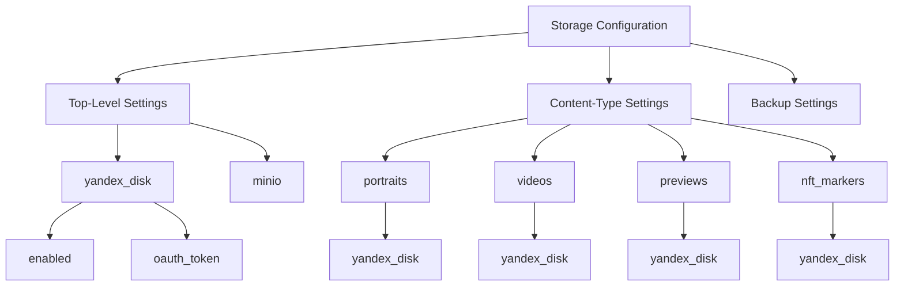
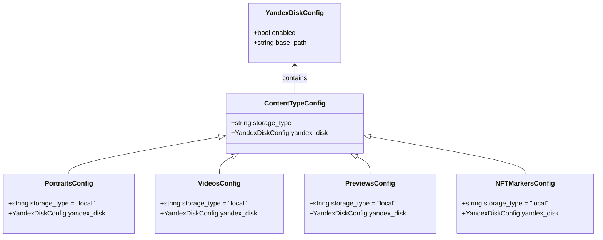
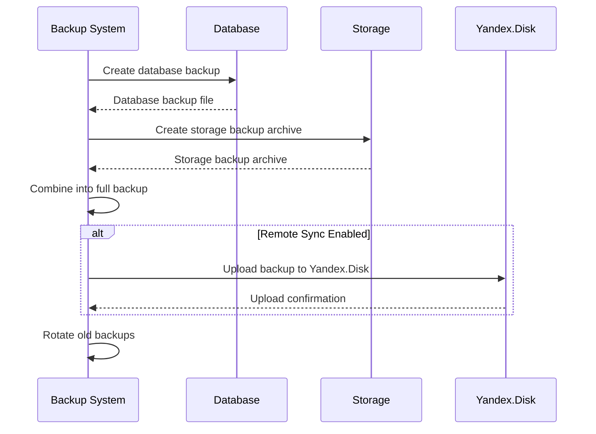
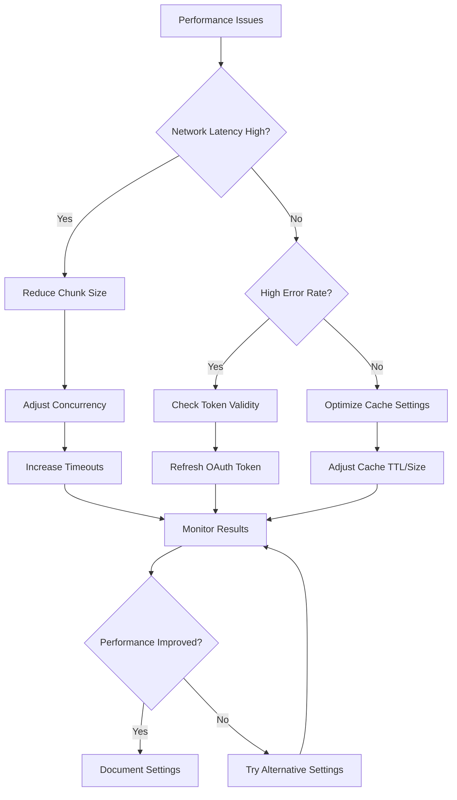

# Yandex.Disk Storage Configuration

<cite>
**Referenced Files in This Document**   
- [storage_config.json](file://vertex-ar/config/storage_config.json)
- [config.py](file://vertex-ar/app/config.py)
- [storage_yandex.py](file://vertex-ar/app/storage_yandex.py)
- [yandex_disk.py](file://vertex-ar/app/api/yandex_disk.py)
- [storage_config.py](file://vertex-ar/storage_config.py)
- [storage_manager.py](file://vertex-ar/storage_manager.py)
- [backup_manager.py](file://vertex-ar/backup_manager.py)
</cite>

## Table of Contents
1. [Introduction](#introduction)
2. [Configuration Structure](#configuration-structure)
3. [Top-Level Yandex.Disk Configuration](#top-level-yandexdisk-configuration)
4. [Per-Content-Type Configuration](#per-content-type-configuration)
5. [Environment Variables](#environment-variables)
6. [OAuth Token Management](#oauth-token-management)
7. [Configuration Examples](#configuration-examples)
8. [Backup and Synchronization](#backup-and-synchronization)
9. [Troubleshooting](#troubleshooting)
10. [Performance Optimization](#performance-optimization)

## Introduction

The Yandex.Disk storage integration in the Vertex AR system provides a robust solution for storing and managing various types of content including portraits, videos, previews, and NFT markers. This documentation details the comprehensive configuration options available for Yandex.Disk integration, covering JSON-based configuration, environment variable tuning, OAuth token management, and integration with backup workflows.

The system is designed with flexibility in mind, allowing administrators to configure Yandex.Disk storage at both global and content-type-specific levels. The integration supports chunked uploads for large files, directory caching for improved performance, and comprehensive monitoring through Prometheus metrics.

**Section sources**
- [storage_config.json](file://vertex-ar/config/storage_config.json)
- [storage_yandex.py](file://vertex-ar/app/storage_yandex.py)

## Configuration Structure

The Yandex.Disk storage configuration is structured in a hierarchical JSON format that allows for both global and granular control over storage settings. The configuration is stored in `storage_config.json` and contains several key sections that work together to define the storage behavior for different content types.

The configuration structure follows a logical hierarchy with top-level settings that apply globally and content-type-specific settings that allow for fine-grained control. This design enables administrators to maintain consistent global policies while accommodating the specific requirements of different content types.



**Diagram sources**
- [storage_config.json](file://vertex-ar/config/storage_config.json)
- [storage_config.py](file://vertex-ar/storage_config.py)

**Section sources**
- [storage_config.json](file://vertex-ar/config/storage_config.json)
- [storage_config.py](file://vertex-ar/storage_config.py)

## Top-Level Yandex.Disk Configuration

The top-level 'yandex_disk' object in the storage configuration contains global settings that apply to all Yandex.Disk operations across the system. This section defines whether Yandex.Disk integration is enabled and provides the OAuth token used for authentication.

The 'enabled' flag is a boolean value that controls the overall activation of Yandex.Disk integration. When set to false, the system will fall back to local storage regardless of content-type-specific configurations. This provides a simple way to disable Yandex.Disk integration system-wide without modifying individual content type settings.

The 'oauth_token' field contains the OAuth 2.0 token used to authenticate with the Yandex.Disk API. This token must be obtained through the Yandex OAuth process and grants the application access to the user's Yandex.Disk account. The token should be kept secure and never exposed in client-side code or public repositories.

```json
"yandex_disk": {
  "oauth_token": "",
  "enabled": false
}
```

When the 'enabled' flag is set to true and a valid 'oauth_token' is provided, the system will use Yandex.Disk as the primary storage backend for all content types that have Yandex.Disk enabled in their individual configurations.

**Section sources**
- [storage_config.json](file://vertex-ar/config/storage_config.json#L38-L41)
- [storage_config.py](file://vertex-ar/storage_config.py#L95-L106)

## Per-Content-Type Configuration

Each content type in the Vertex AR system can have its own Yandex.Disk configuration, allowing for granular control over storage settings. The 'content_types' section contains configurations for portraits, videos, previews, and nft_markers, each with their own 'yandex_disk' settings and 'base_path' parameters.

The per-content-type configuration enables different storage strategies for different types of content. For example, high-resolution videos might be stored on Yandex.Disk for its large storage capacity, while frequently accessed previews might be kept locally for faster access.

Each content type configuration includes:
- 'storage_type': Specifies the storage backend (local, minio, or yandex_disk)
- 'yandex_disk': Object containing Yandex.Disk-specific settings
  - 'enabled': Boolean flag to enable Yandex.Disk for this content type
  - 'base_path': Directory path on Yandex.Disk where files will be stored



**Diagram sources**
- [storage_config.json](file://vertex-ar/config/storage_config.json#L2-L31)
- [storage_config.py](file://vertex-ar/storage_config.py#L58-L87)

**Section sources**
- [storage_config.json](file://vertex-ar/config/storage_config.json#L2-L31)
- [storage_config.py](file://vertex-ar/storage_config.py#L108-L141)

## Environment Variables

The Yandex.Disk integration can be tuned through several environment variables defined in `config.py`. These variables control various aspects of the integration's behavior, including request timeouts, upload concurrency, and caching parameters.

The environment variables provide a way to adjust the integration's performance characteristics without modifying the codebase. They are particularly useful for optimizing the system for different network conditions and usage patterns.

| Environment Variable | Default Value | Description |
|----------------------|-------------|-------------|
| YANDEX_REQUEST_TIMEOUT | 30 | Request timeout in seconds for Yandex.Disk API calls |
| YANDEX_CHUNK_SIZE_MB | 10 | Chunk size for uploads and downloads in megabytes |
| YANDEX_UPLOAD_CONCURRENCY | 3 | Maximum number of concurrent chunk uploads |
| YANDEX_DIRECTORY_CACHE_TTL | 300 | Directory cache TTL in seconds (5 minutes) |
| YANDEX_DIRECTORY_CACHE_SIZE | 1000 | Maximum number of entries in the directory cache |
| YANDEX_SESSION_POOL_CONNECTIONS | 10 | Number of connections in the session pool |
| YANDEX_SESSION_POOL_MAXSIZE | 20 | Maximum size of the session pool |

These variables are used when initializing the YandexDiskStorageAdapter and affect how the system interacts with the Yandex.Disk API. For example, increasing YANDEX_CHUNK_SIZE_MB can improve throughput on high-bandwidth connections, while decreasing it can reduce memory usage on systems with limited resources.

**Section sources**
- [config.py](file://vertex-ar/app/config.py#L200-L207)
- [storage_manager.py](file://vertex-ar/storage_manager.py#L74-L85)

## OAuth Token Management

OAuth token management is a critical aspect of the Yandex.Disk integration. The system is designed to obtain and secure OAuth tokens through the admin UI rather than hardcoding them in configuration files, which enhances security and simplifies token rotation.

The OAuth token acquisition process involves the following steps:
1. Administrators access the admin UI and navigate to the storage configuration section
2. Initiate the OAuth flow by clicking the "Connect to Yandex.Disk" button
3. The system redirects to Yandex's authorization page
4. After granting permission, Yandex redirects back to the application with an authorization code
5. The application exchanges the authorization code for an access token
6. The access token is securely stored in the database

This approach ensures that OAuth tokens are never exposed in configuration files or environment variables, reducing the risk of unauthorized access. Additionally, the system provides mechanisms for token refresh and revocation through the admin interface.

The YandexDiskStorageAdapter class handles token validation and automatically manages token expiration. When a token expires, the system can either prompt the administrator to re-authenticate or use refresh tokens if available, depending on the OAuth flow implemented.

**Section sources**
- [yandex_disk.py](file://vertex-ar/app/api/yandex_disk.py)
- [storage_yandex.py](file://vertex-ar/app/storage_yandex.py)

## Configuration Examples

This section provides complete examples of storage_config.json for both disabled and enabled Yandex.Disk configurations.

### Disabled Configuration Example

```json
{
  "content_types": {
    "portraits": {
      "storage_type": "local",
      "yandex_disk": {
        "enabled": false,
        "base_path": "vertex-ar/portraits"
      }
    },
    "videos": {
      "storage_type": "local",
      "yandex_disk": {
        "enabled": false,
        "base_path": "vertex-ar/videos"
      }
    },
    "previews": {
      "storage_type": "local",
      "yandex_disk": {
        "enabled": false,
        "base_path": "vertex-ar/previews"
      }
    },
    "nft_markers": {
      "storage_type": "local",
      "yandex_disk": {
        "enabled": false,
        "base_path": "vertex-ar/nft_markers"
      }
    }
  },
  "backup_settings": {
    "auto_split_backups": true,
    "max_backup_size_mb": 500,
    "chunk_size_mb": 100,
    "compression": "gz"
  },
  "yandex_disk": {
    "oauth_token": "",
    "enabled": false
  },
  "minio": {
    "enabled": false,
    "endpoint": "",
    "access_key": "",
    "secret_key": "",
    "bucket": ""
  }
}
```

### Enabled Configuration Example

```json
{
  "content_types": {
    "portraits": {
      "storage_type": "yandex_disk",
      "yandex_disk": {
        "enabled": true,
        "base_path": "vertex-ar/portraits"
      }
    },
    "videos": {
      "storage_type": "yandex_disk",
      "yandex_disk": {
        "enabled": true,
        "base_path": "vertex-ar/videos"
      }
    },
    "previews": {
      "storage_type": "local",
      "yandex_disk": {
        "enabled": false,
        "base_path": "vertex-ar/previews"
      }
    },
    "nft_markers": {
      "storage_type": "yandex_disk",
      "yandex_disk": {
        "enabled": true,
        "base_path": "vertex-ar/nft_markers"
      }
    }
  },
  "backup_settings": {
    "auto_split_backups": true,
    "max_backup_size_mb": 500,
    "chunk_size_mb": 100,
    "compression": "gz"
  },
  "yandex_disk": {
    "oauth_token": "AgAAAAABXZJkAATuwR234567890abcdefghijk",
    "enabled": true
  },
  "minio": {
    "enabled": false,
    "endpoint": "",
    "access_key": "",
    "secret_key": "",
    "bucket": ""
  }
}
```

In the enabled configuration example, portraits, videos, and NFT markers are stored on Yandex.Disk, while previews remain on local storage. This hybrid approach optimizes storage costs and performance by keeping frequently accessed content locally while storing larger files on Yandex.Disk.

**Section sources**
- [storage_config.json](file://vertex-ar/config/storage_config.json)
- [storage_config.py](file://vertex-ar/storage_config.py#L58-L106)

## Backup and Synchronization

The Yandex.Disk integration works seamlessly with the system's backup workflows and content synchronization processes. The backup_manager.py component handles the creation, rotation, and restoration of backups, with support for syncing backups to remote storage including Yandex.Disk.

The backup process consists of several key steps:
1. Database backup using SQLite's backup API
2. Storage directory backup as a compressed tar archive
3. Full backup combining database and storage backups
4. Optional synchronization to remote storage

When Yandex.Disk is configured as a backup destination, the system can automatically sync completed backups to a specified directory on Yandex.Disk. This provides an additional layer of data protection by maintaining off-site backups.

The backup system also supports splitting large backup files into smaller chunks, which is particularly useful when dealing with Yandex.Disk's file size limitations or when operating on networks with limited bandwidth. The chunk_size_mb parameter in backup_settings controls the size of these chunks.



**Diagram sources**
- [backup_manager.py](file://vertex-ar/backup_manager.py#L212-L730)
- [storage_manager.py](file://vertex-ar/storage_manager.py#L435-L511)

**Section sources**
- [backup_manager.py](file://vertex-ar/backup_manager.py)
- [storage_manager.py](file://vertex-ar/storage_manager.py#L435-L511)

## Troubleshooting

This section addresses common issues that may occur with the Yandex.Disk integration and provides troubleshooting steps to resolve them.

### Authentication Failures

Authentication failures are typically caused by expired or invalid OAuth tokens. Symptoms include:
- HTTP 401 Unauthorized errors
- "Invalid token" messages in logs
- Failed backup synchronization

**Troubleshooting steps:**
1. Check the admin UI to verify the Yandex.Disk connection status
2. Re-authenticate through the OAuth flow to obtain a new token
3. Verify that the token has the necessary permissions for file operations
4. Check system logs for detailed error messages

### Rate Limiting

Yandex.Disk API has rate limits that may be exceeded during intensive operations. Symptoms include:
- HTTP 429 Too Many Requests errors
- Intermittent failures during bulk operations
- Slow performance during file transfers

**Mitigation strategies:**
1. Implement exponential backoff in retry logic
2. Reduce YANDEX_UPLOAD_CONCURRENCY to decrease request frequency
3. Schedule intensive operations during off-peak hours
4. Monitor API usage and adjust operations accordingly

### Directory Creation Failures

Directory creation failures can occur due to permission issues or invalid paths. Symptoms include:
- Failed directory creation attempts
- "Access denied" errors
- Invalid path characters in directory names

**Resolution steps:**
1. Verify that the OAuth token has write permissions
2. Check that directory names don't contain invalid characters
3. Ensure the base_path exists and is writable
4. Clear the directory cache and retry the operation

### Chunked Upload Errors

Chunked upload errors may occur during large file transfers. Symptoms include:
- Partial uploads
- Timeout errors during upload
- Inconsistent file sizes

**Troubleshooting steps:**
1. Increase YANDEX_REQUEST_TIMEOUT for slow connections
2. Adjust YANDEX_CHUNK_SIZE_MB based on network conditions
3. Verify network stability during uploads
4. Check available storage space on Yandex.Disk

**Section sources**
- [storage_yandex.py](file://vertex-ar/app/storage_yandex.py)
- [backup_manager.py](file://vertex-ar/backup_manager.py)

## Performance Optimization

This section provides recommendations for optimizing the performance of the Yandex.Disk integration, particularly in high-latency network environments.

### Network Optimization

For high-latency networks, consider the following optimizations:
- **Reduce chunk size**: Decrease YANDEX_CHUNK_SIZE_MB to minimize the impact of network latency on individual requests
- **Adjust concurrency**: Lower YANDEX_UPLOAD_CONCURRENCY to prevent overwhelming the network connection
- **Increase timeouts**: Raise YANDEX_REQUEST_TIMEOUT to accommodate slower network responses

### Caching Strategies

The system implements directory caching to reduce API calls and improve performance:
- **Cache TTL**: The YANDEX_DIRECTORY_CACHE_TTL setting controls how long directory existence checks are cached
- **Cache size**: YANDEX_DIRECTORY_CACHE_SIZE limits the number of entries in the cache to prevent memory exhaustion
- **Cache clearing**: The flush_directory_cache method can be used to clear the cache when directory structure changes

### Connection Pooling

The integration uses connection pooling to improve performance:
- **Session pool**: YANDEX_SESSION_POOL_CONNECTIONS and YANDEX_SESSION_POOL_MAXSIZE control the connection pool size
- **Persistent connections**: Reusing connections reduces the overhead of establishing new connections
- **Connection reuse**: The system reuses connections for multiple API calls within the same session

### Monitoring and Metrics

The system includes comprehensive monitoring through Prometheus metrics:
- **Operation counters**: Track the number of successful and failed operations
- **Latency histograms**: Monitor the duration of various operations
- **Error counters**: Track different types of errors by operation and error type
- **Cache metrics**: Monitor cache hits, misses, and size

These metrics can be used to identify performance bottlenecks and optimize configuration settings.



**Diagram sources**
- [storage_yandex.py](file://vertex-ar/app/storage_yandex.py#L130-L259)
- [config.py](file://vertex-ar/app/config.py#L200-L207)

**Section sources**
- [storage_yandex.py](file://vertex-ar/app/storage_yandex.py)
- [config.py](file://vertex-ar/app/config.py#L200-L207)