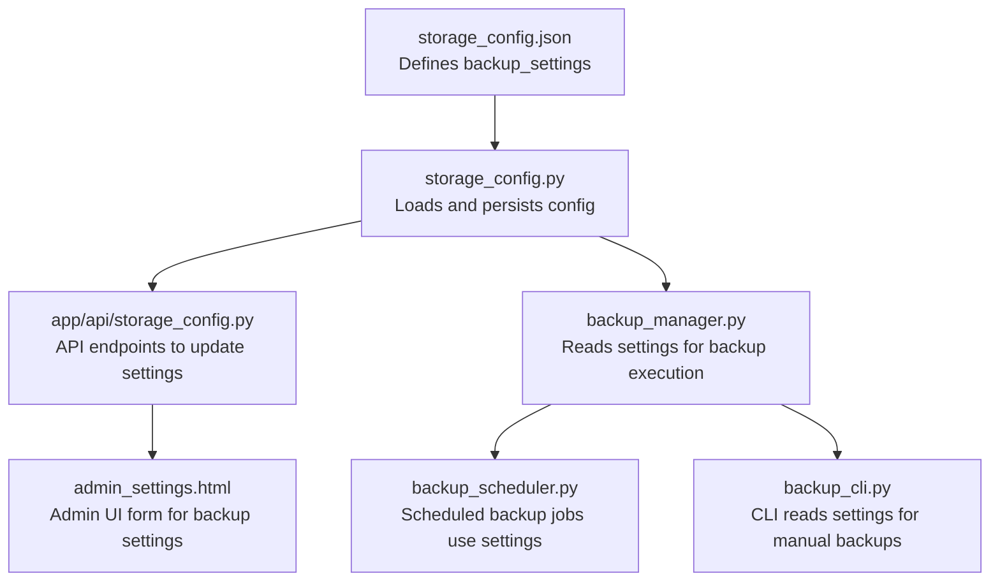
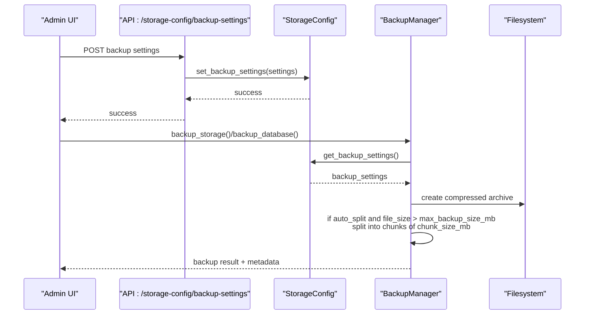
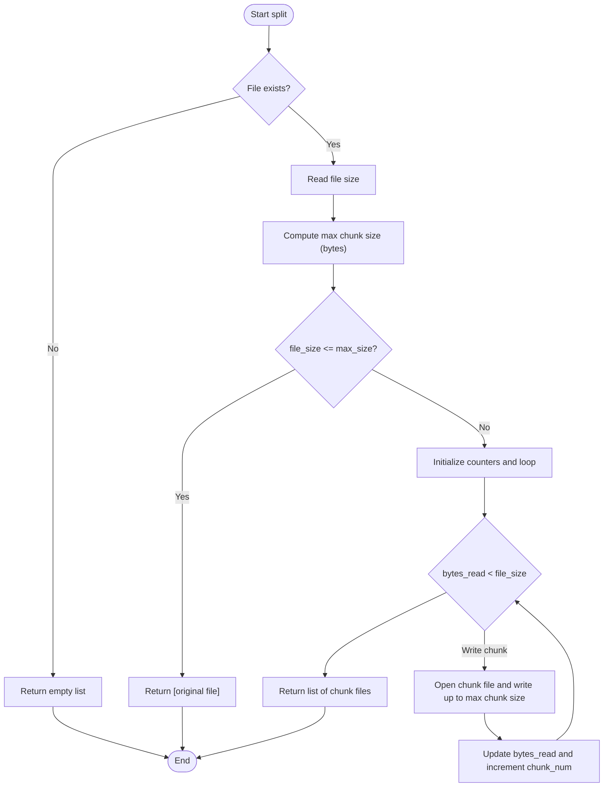
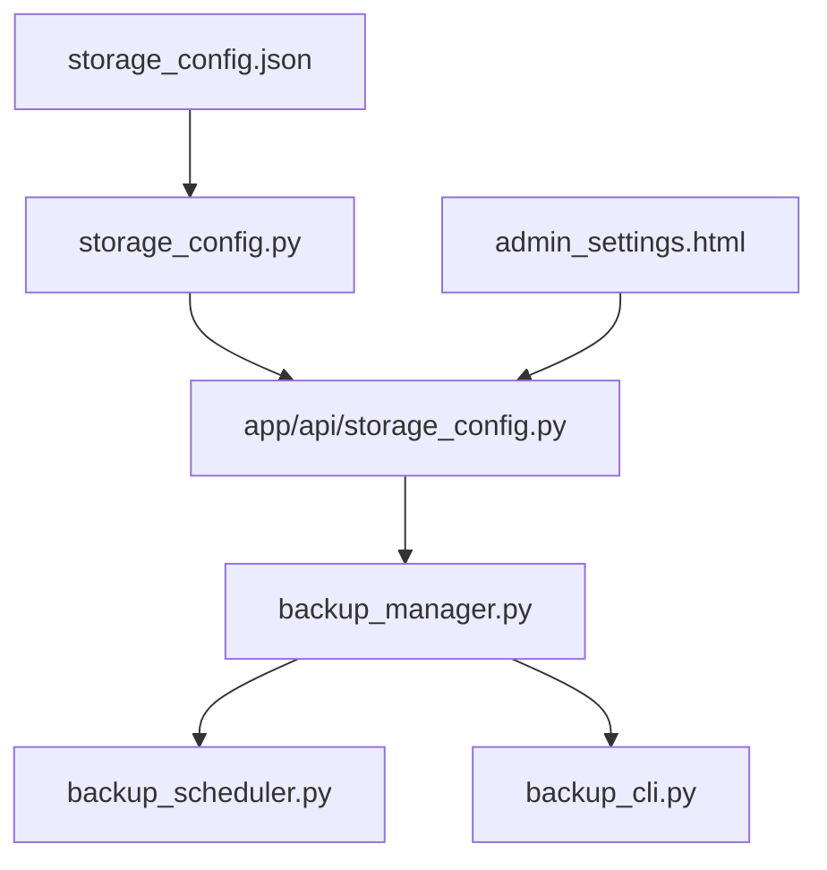

# Backup Settings Configuration

<cite>
**Referenced Files in This Document**
- [storage_config.json](file://vertex-ar/config/storage_config.json)
- [storage_config.py](file://vertex-ar/storage_config.py)
- [storage_config.py (API)](file://vertex-ar/app/api/storage_config.py)
- [backup_manager.py](file://vertex-ar/backup_manager.py)
- [backup_scheduler.py](file://vertex-ar/backup_scheduler.py)
- [backup_cli.py](file://vertex-ar/backup_cli.py)
- [admin_settings.html](file://vertex-ar/templates/admin_settings.html)
- [yandex-disk-backup.md](file://docs/operations/yandex-disk-backup.md)
</cite>

## Table of Contents
1. [Introduction](#introduction)
2. [Project Structure](#project-structure)
3. [Core Components](#core-components)
4. [Architecture Overview](#architecture-overview)
5. [Detailed Component Analysis](#detailed-component-analysis)
6. [Dependency Analysis](#dependency-analysis)
7. [Performance Considerations](#performance-considerations)
8. [Troubleshooting Guide](#troubleshooting-guide)
9. [Conclusion](#conclusion)
10. [Appendices](#appendices)

## Introduction
This document explains the backup settings defined under the backup_settings section in storage_config.json. It covers each parameter’s role, how they interact during backup execution, the algorithm for splitting large backups, and how compression is applied. It also provides configuration examples for different operational scenarios, discusses performance implications, and documents runtime validation and error handling.

## Project Structure
The backup settings are defined in the storage configuration file and consumed by the backup manager and API endpoints. The admin UI exposes controls to configure these settings.

**Diagram sources**
- [storage_config.json](file://vertex-ar/config/storage_config.json#L32-L37)
- [storage_config.py](file://vertex-ar/storage_config.py#L143-L154)
- [storage_config.py (API)](file://vertex-ar/app/api/storage_config.py#L131-L156)
- [backup_manager.py](file://vertex-ar/backup_manager.py#L292-L367)
- [backup_scheduler.py](file://vertex-ar/backup_scheduler.py#L19-L56)
- [backup_cli.py](file://vertex-ar/backup_cli.py#L25-L67)
- [admin_settings.html](file://vertex-ar/templates/admin_settings.html#L560-L595)

**Section sources**
- [storage_config.json](file://vertex-ar/config/storage_config.json#L32-L37)
- [storage_config.py](file://vertex-ar/storage_config.py#L143-L154)
- [storage_config.py (API)](file://vertex-ar/app/api/storage_config.py#L131-L156)
- [backup_manager.py](file://vertex-ar/backup_manager.py#L292-L367)
- [backup_scheduler.py](file://vertex-ar/backup_scheduler.py#L19-L56)
- [backup_cli.py](file://vertex-ar/backup_cli.py#L25-L67)
- [admin_settings.html](file://vertex-ar/templates/admin_settings.html#L560-L595)

## Core Components
- storage_config.json: Defines the backup_settings section with four keys: auto_split_backups, max_backup_size_mb, chunk_size_mb, and compression.
- storage_config.py: Loads, validates, and persists the configuration; exposes get_backup_settings and set_backup_settings.
- app/api/storage_config.py: FastAPI endpoints to read and update backup settings.
- backup_manager.py: Reads backup settings and applies them during backup creation, including compression and splitting logic.
- backup_scheduler.py: Uses backup settings indirectly via the backup manager for scheduled runs.
- backup_cli.py: Uses backup settings for manual operations.
- admin_settings.html: Admin UI form for configuring backup settings.

**Section sources**
- [storage_config.json](file://vertex-ar/config/storage_config.json#L32-L37)
- [storage_config.py](file://vertex-ar/storage_config.py#L143-L154)
- [storage_config.py (API)](file://vertex-ar/app/api/storage_config.py#L131-L156)
- [backup_manager.py](file://vertex-ar/backup_manager.py#L292-L367)
- [backup_scheduler.py](file://vertex-ar/backup_scheduler.py#L19-L56)
- [backup_cli.py](file://vertex-ar/backup_cli.py#L25-L67)
- [admin_settings.html](file://vertex-ar/templates/admin_settings.html#L560-L595)

## Architecture Overview
The backup settings flow from the configuration file to the backup manager, which uses them to compress archives and decide whether to split large backups. The scheduler and CLI consume the same settings for automated and manual operations.

**Diagram sources**
- [storage_config.py (API)](file://vertex-ar/app/api/storage_config.py#L131-L156)
- [storage_config.py](file://vertex-ar/storage_config.py#L143-L154)
- [backup_manager.py](file://vertex-ar/backup_manager.py#L292-L367)

## Detailed Component Analysis

### Parameter Reference and Behavior
- auto_split_backups (boolean)
  - Purpose: Enables automatic splitting of large backup archives into smaller chunks.
  - Default: True.
  - Effect: When enabled and the resulting archive exceeds max_backup_size_mb, the manager splits the archive into chunks sized by chunk_size_mb.

- max_backup_size_mb (integer)
  - Purpose: Threshold in megabytes that triggers splitting when exceeded by the final archive size.
  - Default: 500.
  - Interaction: Controls the condition for splitting; the manager compares the final archive size against this threshold.

- chunk_size_mb (integer)
  - Purpose: Size of each split chunk in megabytes.
  - Default: 100.
  - Interaction: Used as the maximum chunk size during splitting; the manager writes chunks until the desired chunk size is reached or the file ends.

- compression (string)
  - Supported values: "gz", "bz2", "xz", "" (empty for no compression).
  - Purpose: Determines the compression mode for tar archives.
  - Default: "gz".
  - Effect: The archive is created with the selected compression; splitting occurs after compression.

**Section sources**
- [storage_config.json](file://vertex-ar/config/storage_config.json#L32-L37)
- [storage_config.py](file://vertex-ar/storage_config.py#L143-L154)
- [storage_config.py (API)](file://vertex-ar/app/api/storage_config.py#L27-L33)
- [backup_manager.py](file://vertex-ar/backup_manager.py#L292-L367)

### How Settings Are Loaded and Applied
- Loading settings:
  - The backup manager retrieves backup settings from storage_config.py via get_backup_settings().
  - If storage_config loading fails, it falls back to default values.

- Applying settings:
  - Compression: The manager opens the tar archive with a compression mode derived from the setting.
  - Splitting: After creating the archive, if auto_split_backups is true and the file size exceeds max_backup_size_mb, the manager splits the archive into chunks sized by chunk_size_mb.
  - Metadata: When splitting occurs, metadata records split_files, split flag, and chunk_size_mb.

**Section sources**
- [backup_manager.py](file://vertex-ar/backup_manager.py#L164-L202)
- [backup_manager.py](file://vertex-ar/backup_manager.py#L292-L367)

### Splitting Algorithm
The manager uses a streaming approach to split large files into chunks of approximately chunk_size_mb. The algorithm:
- Validates the input file exists.
- Computes the maximum chunk size in bytes.
- If the file size is less than or equal to the maximum chunk size, returns the original file.
- Otherwise, streams the file in blocks and writes chunk files until the entire input is processed.
- On failure, logs an error and cleans up partially written chunk files.

**Diagram sources**
- [backup_manager.py](file://vertex-ar/backup_manager.py#L63-L125)

**Section sources**
- [backup_manager.py](file://vertex-ar/backup_manager.py#L63-L125)

### Compression Application
- The manager constructs the tar archive with a compression mode based on the compression setting ("gz", "bz2", "xz", or empty for no compression).
- Compression is applied before checking the size threshold; splitting occurs after compression.

**Section sources**
- [backup_manager.py](file://vertex-ar/backup_manager.py#L292-L310)
- [backup_manager.py](file://vertex-ar/backup_manager.py#L333-L347)

### Runtime Validation and Error Handling
- Validation:
  - The API enforces types via Pydantic models for backup settings (auto_split_backups: bool, max_backup_size_mb: int, chunk_size_mb: int, compression: str).
  - The admin UI sets numeric constraints and step sizes for max_backup_size_mb and chunk_size_mb, and provides a checkbox for auto_split_backups.

- Error handling:
  - Storage config loading failures fall back to defaults.
  - Splitting failures log errors and clean up partial chunks.
  - Remote sync handles missing split files gracefully and logs errors.
  - Backup verification checks metadata presence and checksum validity.

**Section sources**
- [storage_config.py (API)](file://vertex-ar/app/api/storage_config.py#L27-L33)
- [admin_settings.html](file://vertex-ar/templates/admin_settings.html#L560-L595)
- [backup_manager.py](file://vertex-ar/backup_manager.py#L164-L202)
- [backup_manager.py](file://vertex-ar/backup_manager.py#L118-L125)
- [backup_manager.py](file://vertex-ar/backup_manager.py#L740-L800)
- [yandex-disk-backup.md](file://docs/operations/yandex-disk-backup.md#L144-L178)

### Configuration Examples
- High-frequency small backups:
  - Use a lower max_backup_size_mb (e.g., 200) and a moderate chunk_size_mb (e.g., 50) to keep uploads fast and manageable.
  - Keep auto_split_backups enabled to ensure reliability.

- Infrequent large archives:
  - Increase max_backup_size_mb (e.g., 1000) and adjust chunk_size_mb accordingly (e.g., 200–250) to reduce overhead while still enabling splitting if needed.
  - Consider compression "bz2" or "xz" for higher compression ratios at the cost of CPU time.

- Minimal overhead:
  - Disable auto_split_backups and keep chunk_size_mb at a conservative value to avoid splitting.
  - Use compression "gz" for balanced speed and size.

- Remote storage constraints:
  - Align max_backup_size_mb with provider limits; ensure chunk_size_mb is below provider limits for uploads.

Note: These examples describe recommended parameter combinations; actual values depend on your environment and constraints.

**Section sources**
- [storage_config.json](file://vertex-ar/config/storage_config.json#L32-L37)
- [admin_settings.html](file://vertex-ar/templates/admin_settings.html#L560-L595)
- [yandex-disk-backup.md](file://docs/operations/yandex-disk-backup.md#L1-L48)

## Dependency Analysis
The backup settings are consumed by the backup manager and indirectly by scheduler and CLI. The API layer ensures settings are persisted and validated.

**Diagram sources**
- [storage_config.json](file://vertex-ar/config/storage_config.json#L32-L37)
- [storage_config.py](file://vertex-ar/storage_config.py#L143-L154)
- [storage_config.py (API)](file://vertex-ar/app/api/storage_config.py#L131-L156)
- [backup_manager.py](file://vertex-ar/backup_manager.py#L292-L367)
- [backup_scheduler.py](file://vertex-ar/backup_scheduler.py#L19-L56)
- [backup_cli.py](file://vertex-ar/backup_cli.py#L25-L67)
- [admin_settings.html](file://vertex-ar/templates/admin_settings.html#L560-L595)

**Section sources**
- [storage_config.py](file://vertex-ar/storage_config.py#L143-L154)
- [storage_config.py (API)](file://vertex-ar/app/api/storage_config.py#L131-L156)
- [backup_manager.py](file://vertex-ar/backup_manager.py#L292-L367)
- [backup_scheduler.py](file://vertex-ar/backup_scheduler.py#L19-L56)
- [backup_cli.py](file://vertex-ar/backup_cli.py#L25-L67)
- [admin_settings.html](file://vertex-ar/templates/admin_settings.html#L560-L595)

## Performance Considerations
- Compression impact:
  - "gz" offers good balance of speed and compression ratio.
  - "bz2" and "xz" provide higher compression ratios but increase CPU usage and time.
  - Empty compression avoids CPU overhead but increases storage footprint.

- Splitting overhead:
  - Enabling auto_split_backups introduces additional I/O and CPU work for splitting and merging.
  - chunk_size_mb affects the number of chunks and upload/download granularity; smaller chunks improve resilience but increase metadata and upload overhead.

- Archive size thresholds:
  - max_backup_size_mb determines when splitting occurs; lowering it reduces risk of oversized uploads but increases splitting frequency.

- Scheduler and CLI:
  - Scheduled backups run according to cron expressions; ensure adequate resources during peak backup windows.
  - CLI operations support immediate backups; consider disabling auto_split_backups for quick operations if needed.

[No sources needed since this section provides general guidance]

## Troubleshooting Guide
- Invalid values:
  - If chunk_size_mb exceeds max_backup_size_mb, splitting may behave unexpectedly. While there is no explicit validation in the code, practical behavior depends on the comparison logic. Adjust chunk_size_mb to be less than or equal to max_backup_size_mb for predictable splitting.

- Splitting failures:
  - Partially written chunk files are cleaned up on errors. Check logs for detailed error messages and retry after resolving underlying issues (e.g., disk space, permissions).

- Remote sync issues:
  - If split files are missing locally, remote sync skips them and logs errors. Ensure metadata and split files are preserved together.

- Verification failures:
  - Missing metadata or checksum mismatches indicate corruption or tampering. Recreate backups and verify integrity.

**Section sources**
- [backup_manager.py](file://vertex-ar/backup_manager.py#L118-L125)
- [backup_manager.py](file://vertex-ar/backup_manager.py#L740-L800)
- [yandex-disk-backup.md](file://docs/operations/yandex-disk-backup.md#L144-L178)

## Conclusion
The backup_settings section in storage_config.json controls compression, retention, and splitting behavior for backups. The backup manager applies these settings consistently across scheduled and manual operations. By tuning max_backup_size_mb and chunk_size_mb, you can balance reliability, performance, and storage efficiency. The API and admin UI provide straightforward mechanisms to update and validate settings, while robust error handling ensures resilient backup operations.

[No sources needed since this section summarizes without analyzing specific files]

## Appendices

### Appendix A: Parameter Definitions and Defaults
- auto_split_backups: Boolean; default True.
- max_backup_size_mb: Integer (megabytes); default 500.
- chunk_size_mb: Integer (megabytes); default 100.
- compression: String; supported values "gz", "bz2", "xz", ""; default "gz".

**Section sources**
- [storage_config.json](file://vertex-ar/config/storage_config.json#L32-L37)
- [storage_config.py (API)](file://vertex-ar/app/api/storage_config.py#L27-L33)
- [backup_manager.py](file://vertex-ar/backup_manager.py#L292-L310)

### Appendix B: Where Settings Are Consumed
- backup_manager.py: Reads settings and applies compression and splitting.
- backup_scheduler.py: Executes backups using the backup manager’s settings.
- backup_cli.py: Executes backups using the backup manager’s settings.
- admin_settings.html: Presents UI controls for backup settings.

**Section sources**
- [backup_manager.py](file://vertex-ar/backup_manager.py#L164-L202)
- [backup_manager.py](file://vertex-ar/backup_manager.py#L292-L367)
- [backup_scheduler.py](file://vertex-ar/backup_scheduler.py#L19-L56)
- [backup_cli.py](file://vertex-ar/backup_cli.py#L25-L67)
- [admin_settings.html](file://vertex-ar/templates/admin_settings.html#L560-L595)