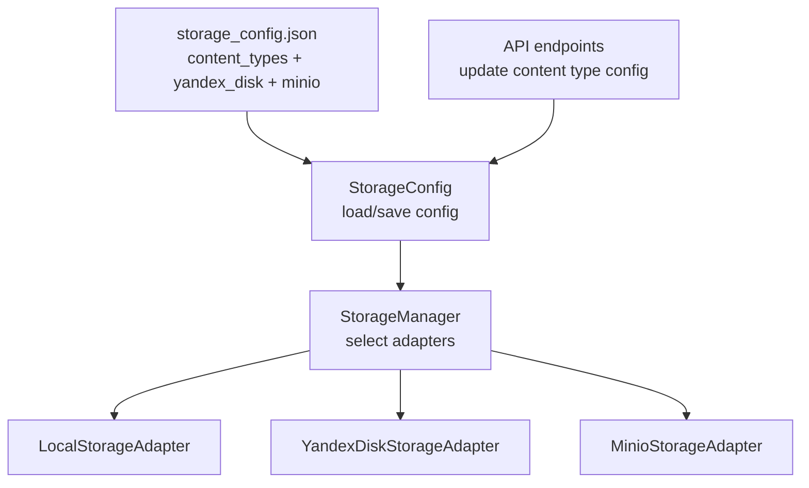
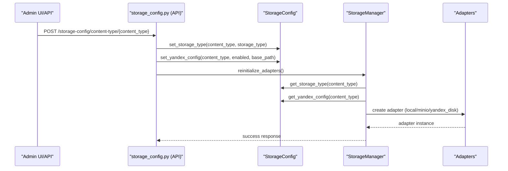
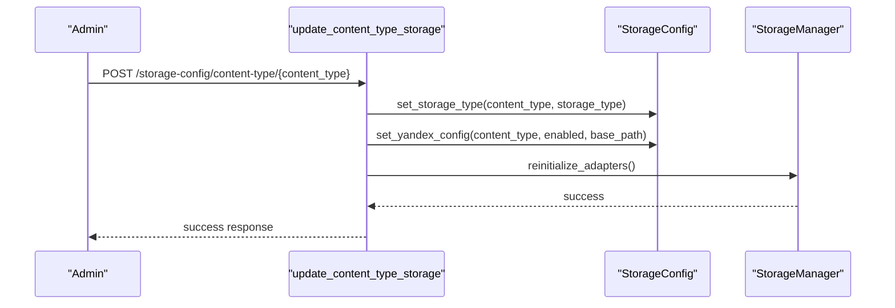
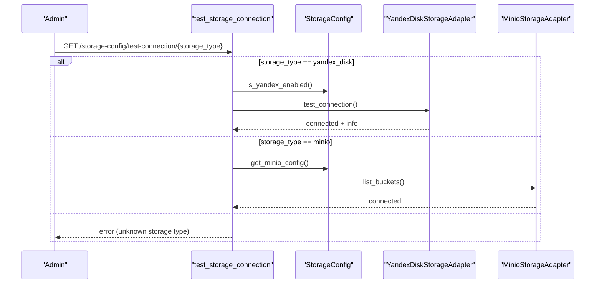
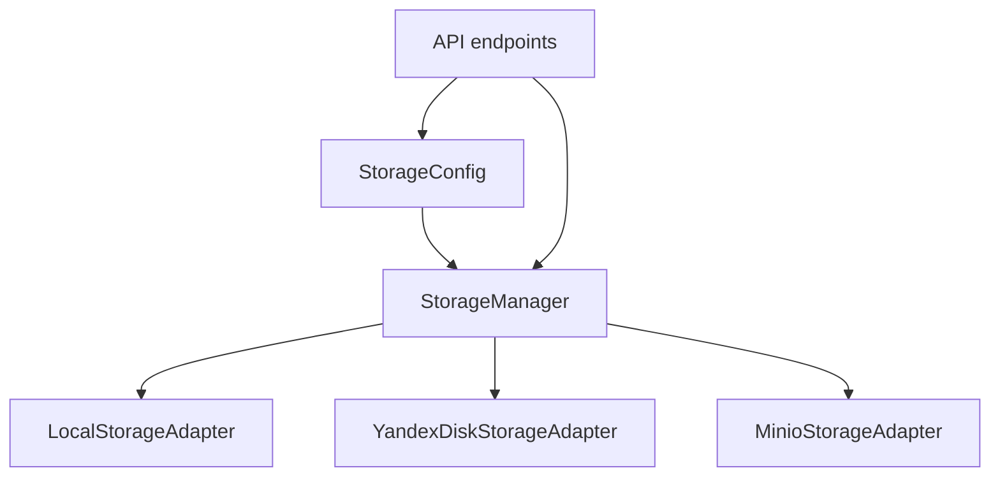

# Content Types Configuration

<cite>
**Referenced Files in This Document**
- [storage_config.json](file://vertex-ar/config/storage_config.json)
- [storage_config.py](file://vertex-ar/storage_config.py)
- [storage_manager.py](file://vertex-ar/storage_manager.py)
- [storage_config.py (API)](file://vertex-ar/app/api/storage_config.py)
- [storage_local.py](file://vertex-ar/app/storage_local.py)
- [storage_yandex.py](file://vertex-ar/app/storage_yandex.py)
- [storage_minio.py](file://vertex-ar/app/storage_minio.py)
- [storage_utils.py](file://vertex-ar/app/storage_utils.py)
- [test_storage_config.py](file://test_files/integration/test_storage_config.py)
</cite>

## Table of Contents
1. [Introduction](#introduction)
2. [Project Structure](#project-structure)
3. [Core Components](#core-components)
4. [Architecture Overview](#architecture-overview)
5. [Detailed Component Analysis](#detailed-component-analysis)
6. [Dependency Analysis](#dependency-analysis)
7. [Performance Considerations](#performance-considerations)
8. [Troubleshooting Guide](#troubleshooting-guide)
9. [Conclusion](#conclusion)
10. [Appendices](#appendices)

## Introduction
This document explains the content_types section in storage_config.json and how each content type (portraits, videos, previews, nft_markers) is individually configurable. It covers:
- How storage_type values are interpreted and validated
- Yandex.Disk integration settings per content type
- Purpose of each content type within the AR workflow
- Hybrid storage strategies (e.g., portraits on local, videos on Yandex.Disk)
- Validation rules and error handling during application startup and runtime

## Project Structure
The storage configuration is centralized in a JSON file and managed by a configuration module. The storage manager selects the appropriate adapter based on content type and global settings.

**Diagram sources**
- [storage_config.json](file://vertex-ar/config/storage_config.json#L1-L49)
- [storage_config.py](file://vertex-ar/storage_config.py#L1-L203)
- [storage_manager.py](file://vertex-ar/storage_manager.py#L1-L120)
- [storage_local.py](file://vertex-ar/app/storage_local.py#L1-L162)
- [storage_yandex.py](file://vertex-ar/app/storage_yandex.py#L1-L120)
- [storage_minio.py](file://vertex-ar/app/storage_minio.py#L1-L120)
- [storage_config.py (API)](file://vertex-ar/app/api/storage_config.py#L1-L120)

**Section sources**
- [storage_config.json](file://vertex-ar/config/storage_config.json#L1-L49)
- [storage_config.py](file://vertex-ar/storage_config.py#L1-L203)
- [storage_manager.py](file://vertex-ar/storage_manager.py#L1-L120)

## Core Components
- storage_config.json: Defines default content_types and global storage settings (Yandex.Disk and MinIO).
- StorageConfig: Loads, validates, and persists configuration; exposes getters/setters for content types and Yandex.Disk settings.
- StorageManager: Initializes adapters per content type based on storage_type and Yandex.Disk base_path; falls back gracefully on invalid or missing configuration.
- Adapters: Local, Yandex.Disk, and MinIO implementations provide unified save/get/delete/file_exists operations.

**Section sources**
- [storage_config.json](file://vertex-ar/config/storage_config.json#L1-L49)
- [storage_config.py](file://vertex-ar/storage_config.py#L1-L203)
- [storage_manager.py](file://vertex-ar/storage_manager.py#L1-L120)
- [storage_local.py](file://vertex-ar/app/storage_local.py#L1-L162)
- [storage_yandex.py](file://vertex-ar/app/storage_yandex.py#L1-L120)
- [storage_minio.py](file://vertex-ar/app/storage_minio.py#L1-L120)

## Architecture Overview
The content_types section allows independent configuration per content type. At runtime, StorageManager reads storage_type and Yandex.Disk base_path to instantiate the correct adapter.

**Diagram sources**
- [storage_config.py (API)](file://vertex-ar/app/api/storage_config.py#L76-L129)
- [storage_config.py](file://vertex-ar/storage_config.py#L108-L142)
- [storage_manager.py](file://vertex-ar/storage_manager.py#L35-L94)

## Detailed Component Analysis

### Content Types in storage_config.json
Each content type has:
- storage_type: one of local, minio, yandex_disk
- yandex_disk: enabled flag and base_path for Yandex.Disk

Defaults are defined in the JSON and mirrored in StorageConfig._get_default_config().

- Portraits: intended for profile images used in AR experiences
- Videos: video assets associated with portraits
- Previews: generated thumbnails or preview frames
- NFT markers: marker files used for AR tracking and NFT integration

These content types are initialized by StorageManager and mapped to adapters based on storage_type.

**Section sources**
- [storage_config.json](file://vertex-ar/config/storage_config.json#L1-L49)
- [storage_manager.py](file://vertex-ar/storage_manager.py#L35-L49)

### Storage Type Values and Validation
- storage_type values recognized:
  - local: local filesystem
  - minio: MinIO-compatible object storage
  - yandex_disk: Yandex.Disk integration

Validation and normalization:
- is_local_storage() treats both "local" and "local_disk" as local.
- StorageManager falls back to local when encountering unknown storage_type or missing Yandex.Disk token.

Startup behavior:
- If Yandex.Disk token is missing, StorageManager creates adapters with fallback to local storage for that content type.
- Unknown content_type values are logged and default to local adapter.

**Section sources**
- [storage_utils.py](file://vertex-ar/app/storage_utils.py#L7-L18)
- [storage_manager.py](file://vertex-ar/storage_manager.py#L50-L94)

### Yandex.Disk Integration Settings
Per content type, Yandex.Disk settings include:
- enabled: whether synchronization is enabled for this content type
- base_path: directory path on Yandex.Disk where files are stored

StorageManager constructs YandexDiskStorageAdapter with:
- oauth_token from global Yandex.Disk config
- base_path from content type config (or default derived from content_type)
- Tuning parameters from settings (timeout, chunk size, concurrency, cache TTL/size, session pool)

If token is missing, adapters fall back to local storage.

**Section sources**
- [storage_config.json](file://vertex-ar/config/storage_config.json#L38-L49)
- [storage_config.py](file://vertex-ar/storage_config.py#L155-L171)
- [storage_manager.py](file://vertex-ar/storage_manager.py#L64-L87)
- [storage_yandex.py](file://vertex-ar/app/storage_yandex.py#L84-L145)

### Purpose Within the AR Workflow
- Portraits: profile images used in AR experiences; often accessed frequently and may benefit from local caching.
- Videos: larger media assets; suitable for remote storage (e.g., Yandex.Disk) to reduce local footprint.
- Previews: thumbnails or preview frames; may be generated on demand and stored locally or remotely depending on strategy.
- NFT markers: marker files used for AR tracking; may be stored alongside portraits or separately.

These roles inform hybrid storage strategies (see next section).

**Section sources**
- [storage_manager.py](file://vertex-ar/storage_manager.py#L35-L49)

### Hybrid Storage Strategies
Example: Store portraits on local storage and videos on Yandex.Disk.

Steps:
1. Set storage_type to local for portraits and to yandex_disk for videos.
2. Enable Yandex.Disk for videos and set base_path (e.g., vertex-ar/videos).
3. Save configuration; StorageManager reinitializes adapters.
4. On file operations, StorageManager routes to the appropriate adapter per content type.

Implications:
- Portraits remain fast-accessible locally.
- Videos are offloaded to Yandex.Disk, reducing local disk usage.
- NFT markers and previews can be kept local for responsiveness.

**Section sources**
- [storage_config.py (API)](file://vertex-ar/app/api/storage_config.py#L76-L129)
- [storage_manager.py](file://vertex-ar/storage_manager.py#L35-L94)

### Validation Rules and Startup Error Handling
- Content type validation: API enforces content_type must be one of portraits, videos, previews, nft_markers.
- Storage type validation: Unknown storage_type values fall back to local; missing Yandex.Disk token also falls back to local.
- Missing base_path: StorageManager uses a default derived from content_type if not provided.
- Persistence: StorageConfig saves changes to storage_config.json; errors are logged and surfaced via HTTP exceptions in API.

Startup resilience:
- If configuration file is missing or corrupted, StorageConfig generates defaults and persists them.
- Adapter initialization logs warnings and errors; application continues using local fallback.

**Section sources**
- [storage_config.py (API)](file://vertex-ar/app/api/storage_config.py#L91-L96)
- [storage_config.py](file://vertex-ar/storage_config.py#L28-L55)
- [storage_manager.py](file://vertex-ar/storage_manager.py#L64-L94)

### Example Workflows

#### Update Content Type Storage

**Diagram sources**
- [storage_config.py (API)](file://vertex-ar/app/api/storage_config.py#L76-L129)
- [storage_config.py](file://vertex-ar/storage_config.py#L112-L142)
- [storage_manager.py](file://vertex-ar/storage_manager.py#L106-L109)

#### Test Storage Connection

**Diagram sources**
- [storage_config.py (API)](file://vertex-ar/app/api/storage_config.py#L220-L310)
- [storage_config.py](file://vertex-ar/storage_config.py#L172-L183)

## Dependency Analysis
- StorageManager depends on StorageConfig for content_type storage_type and Yandex.Disk base_path.
- Adapters depend on settings for tuning parameters.
- API endpoints depend on StorageConfig and StorageManager to apply and verify changes.

**Diagram sources**
- [storage_config.py](file://vertex-ar/storage_config.py#L108-L183)
- [storage_manager.py](file://vertex-ar/storage_manager.py#L1-L120)
- [storage_config.py (API)](file://vertex-ar/app/api/storage_config.py#L1-L120)

**Section sources**
- [storage_config.py](file://vertex-ar/storage_config.py#L108-L183)
- [storage_manager.py](file://vertex-ar/storage_manager.py#L1-L120)
- [storage_config.py (API)](file://vertex-ar/app/api/storage_config.py#L1-L120)

## Performance Considerations
- Yandex.Disk chunked uploads/downloads improve throughput for large files.
- Directory cache reduces repeated API calls for directory existence checks.
- Concurrency limits prevent overload; tuning parameters can be adjusted via settings.
- Local storage avoids network latency for frequently accessed content (e.g., portraits).

[No sources needed since this section provides general guidance]

## Troubleshooting Guide
Common issues and resolutions:
- Unknown content type: API returns 400; ensure content_type is one of portraits, videos, previews, nft_markers.
- Unknown storage_type: StorageManager falls back to local; verify configuration.
- Missing Yandex.Disk token: Adapter falls back to local; set oauth_token and reinitialize adapters.
- Invalid base_path: StorageManager uses default derived from content_type; set explicit base_path if needed.
- API errors: HTTP 500 indicates internal failures; check logs and retry.

Verification:
- Use test-connection endpoints to validate connectivity for yandex_disk and minio.
- Use get_storage_info to inspect adapter types and Yandex.Disk info.

**Section sources**
- [storage_config.py (API)](file://vertex-ar/app/api/storage_config.py#L91-L129)
- [storage_manager.py](file://vertex-ar/storage_manager.py#L64-L94)
- [test_storage_config.py](file://test_files/integration/test_storage_config.py#L1-L167)

## Conclusion
The content_types section enables granular control over where each asset type is stored. By combining local storage for frequently accessed content (e.g., portraits) with remote storage (e.g., Yandex.Disk) for large assets (e.g., videos), organizations can balance performance, cost, and scalability. Robust validation and graceful fallbacks ensure reliability during configuration changes and startup.

[No sources needed since this section summarizes without analyzing specific files]

## Appendices

### Appendix A: Configuration Reference
- content_types.{content_type}.storage_type: local | minio | yandex_disk
- content_types.{content_type}.yandex_disk.enabled: true | false
- content_types.{content_type}.yandex_disk.base_path: directory path on Yandex.Disk
- yandex_disk.oauth_token: required for Yandex.Disk integration
- yandex_disk.enabled: toggles global Yandex.Disk usage
- minio.enabled, endpoint, access_key, secret_key, bucket: MinIO configuration

**Section sources**
- [storage_config.json](file://vertex-ar/config/storage_config.json#L1-L49)
- [storage_config.py](file://vertex-ar/storage_config.py#L155-L183)

### Appendix B: Example Hybrid Strategy
- Portraits: storage_type=local, yandex_disk.enabled=false
- Videos: storage_type=yandex_disk, yandex_disk.enabled=true, base_path=vertex-ar/videos
- Previews: storage_type=local, yandex_disk.enabled=false
- NFT markers: storage_type=local, yandex_disk.enabled=false

Apply via API endpoints and reinitialize adapters.

**Section sources**
- [storage_config.py (API)](file://vertex-ar/app/api/storage_config.py#L76-L129)
- [storage_manager.py](file://vertex-ar/storage_manager.py#L106-L109)